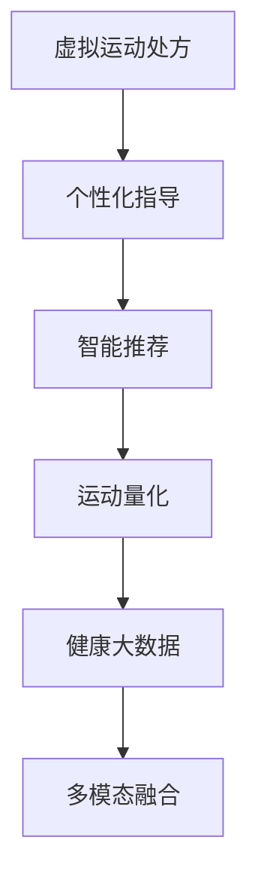

                 

# 虚拟运动处方:全球健康生活方式的个性化指导

> 关键词：虚拟运动处方, 个性化指导, 健康管理, 智能推荐, 运动量化, 健康大数据, 多模态融合

## 1. 背景介绍

### 1.1 问题由来

随着科技的发展和人们生活水平的提高，健康管理和体育运动越来越受到人们的重视。然而，现实世界中，运动处方往往只能通过医生或健身教练的一对一咨询或定期体检获取，而缺乏个性化的运动方案和实时反馈机制。如何为全球用户提供科学、高效、个性化的健康生活方式指导，成为了一个亟待解决的问题。

### 1.2 问题核心关键点

如何通过技术手段，结合用户健康数据、运动行为数据等，智能化地生成适合个体的运动处方，并在运动过程中提供实时的反馈和建议，已成为当前健康科技领域的热点研究课题。本文将从技术层面探讨这一问题的解决方案，提供一套基于人工智能技术的虚拟运动处方系统。

### 1.3 问题研究意义

虚拟运动处方系统不仅能够为用户提供个性化、实时化的运动指导，还能提高运动的科学性和效率，进一步促进健康生活方式的形成和普及。其应用价值主要体现在以下几个方面：

- **个性化推荐**：根据用户的身体状况、健康目标、运动偏好等因素，生成定制化的运动方案，提高运动效果。
- **实时反馈**：通过智能设备采集运动数据，实时分析用户状态，动态调整运动计划。
- **健康管理**：整合健康数据，跟踪运动效果，及时发现和干预潜在的健康风险。
- **便捷易用**：基于云端和移动端的应用形式，满足用户随时随地进行健康管理的便捷需求。

## 2. 核心概念与联系

### 2.1 核心概念概述

为更好地理解虚拟运动处方的技术架构和原理，本节将介绍几个核心概念及其联系：

- **虚拟运动处方(Virtual Exercise Prescription)**：通过智能算法，结合用户健康数据、运动行为数据等，生成个性化的运动方案，指导用户进行科学、高效的锻炼。
- **个性化指导(Personalized Guidance)**：根据用户的身体状况、健康目标、运动偏好等因素，定制适合个体的运动方案。
- **健康管理(Health Management)**：通过持续监测用户的健康状态和运动效果，提供及时的健康建议和干预。
- **智能推荐(Intelligent Recommendation)**：利用机器学习技术，从海量数据中挖掘用户的运动偏好和行为规律，实现运动方案的智能生成。
- **运动量化(Exercise Quantization)**：通过智能设备和数据采集技术，将运动行为量化为可测量的数据，供系统分析和优化。
- **健康大数据(Health Big Data)**：整合用户健康数据、运动数据、环境数据等多源数据，构建综合的健康分析平台。
- **多模态融合(Multimodal Fusion)**：结合生理数据、环境数据、运动数据等多种数据源，实现多模态信息的融合与协同，提升运动处方的精准性。

这些核心概念之间的逻辑关系可以通过以下Mermaid流程图来展示：



这个流程图展示了一个虚拟运动处方系统的主要组件及其相互关系：

1. 虚拟运动处方通过个性化指导，生成定制化的运动方案。
2. 智能推荐通过整合多源数据，辅助个性化指导生成更准确的推荐。
3. 运动量化将运动行为转换为可测量数据，为系统提供实时的反馈。
4. 健康大数据整合各类健康信息，支持多模态融合，提升运动处方的精准性。

## 3. 核心算法原理 & 具体操作步骤
### 3.1 算法原理概述

虚拟运动处方的核心算法是基于人工智能技术的推荐系统。通过综合考虑用户的历史数据和当前状态，结合运动效果评估和环境因素，智能生成个性化的运动方案。算法主要包含以下几个步骤：

1. **数据采集**：通过智能设备（如智能手环、智能手表、运动相机等）采集用户运动数据、生理数据和环境数据。
2. **数据预处理**：对采集到的数据进行清洗、归一化、特征提取等预处理操作，以适应算法的输入要求。
3. **个性化推荐**：根据用户的历史数据和当前状态，利用机器学习算法（如协同过滤、深度学习等），生成适合个体的运动方案。
4. **运动量化**：将生成的运动方案转换为可测量的数据，如运动时间、运动强度、心率等，用于实时反馈和效果评估。
5. **效果评估**：通过对比实际运动效果和预期目标，评估运动处方的有效性，并根据反馈动态调整推荐算法。

### 3.2 算法步骤详解

以下是虚拟运动处方的详细操作步骤：

#### 3.2.1 数据采集

数据采集是虚拟运动处方的第一步。系统通过以下方式采集用户数据：

1. **生理数据**：使用智能设备（如智能手环）采集用户的心率、血压、血氧饱和度等生理指标。
2. **运动数据**：通过运动相机或智能手表记录用户的运动轨迹、运动时长、运动类型等信息。
3. **环境数据**：利用GPS和传感器技术，记录用户运动时的环境数据，如温度、湿度、光照强度等。

#### 3.2.2 数据预处理

数据预处理主要包括以下几个步骤：

1. **清洗**：删除数据中的噪声和异常值，确保数据的准确性和完整性。
2. **归一化**：将不同来源的数据进行标准化处理，使得数据具有相同的量纲。
3. **特征提取**：从原始数据中提取出对运动处方生成有用的特征，如运动时长、心率变化等。

#### 3.2.3 个性化推荐

个性化推荐是虚拟运动处方的核心算法，主要包括以下几个步骤：

1. **用户画像**：根据用户的生理数据、历史运动数据和行为数据，构建用户的健康画像。
2. **目标设定**：用户设定健康目标，如减重、增肌、提高体能等。
3. **推荐生成**：利用协同过滤、深度学习等算法，生成适合个体的运动方案。
4. **方案调整**：根据用户的反馈和运动效果，动态调整推荐算法，提升推荐精度。

#### 3.2.4 运动量化

运动量化是将运动方案转换为可测量的数据，供系统分析和优化。具体步骤如下：

1. **方案分解**：将生成的运动方案分解为多个可测量的数据点，如运动时间、运动强度、心率等。
2. **数据采集**：通过智能设备采集运动过程中的数据。
3. **数据处理**：对采集到的数据进行清洗、归一化和特征提取，得到适合分析的数据。

#### 3.2.5 效果评估

效果评估是虚拟运动处方的重要组成部分，主要包括以下几个步骤：

1. **效果测量**：通过智能设备测量运动过程中的生理数据和环境数据。
2. **目标对比**：将实际运动效果与设定的健康目标进行对比，评估运动处方的有效性。
3. **反馈优化**：根据评估结果，调整运动方案和推荐算法，提高运动效果。

### 3.3 算法优缺点

虚拟运动处方的算法具有以下优点：

1. **个性化精准**：通过综合考虑多种数据源，能够生成高度个性化的运动方案，提高运动效果。
2. **实时反馈**：通过智能设备实时采集数据，动态调整运动方案，提高运动的科学性和效率。
3. **多模态融合**：结合生理数据、环境数据、运动数据等多种数据源，实现多模态信息的融合与协同，提升运动处方的精准性。
4. **可扩展性强**：系统可以通过扩展数据源和算法模型，不断提升运动处方的质量和覆盖面。

同时，该算法也存在一些局限性：

1. **数据隐私问题**：系统需要采集和存储用户的健康数据和运动数据，涉及隐私保护问题。
2. **数据质量问题**：数据的准确性和完整性对算法的精度和效果有直接影响，需要严格的预处理和清洗。
3. **算法复杂性**：系统涉及多种算法的组合和融合，算法复杂度高，需要较高的技术实现门槛。
4. **用户依赖性**：系统的效果高度依赖用户的配合和反馈，用户的参与度影响系统效果。

尽管存在这些局限性，但虚拟运动处方技术仍是大数据、人工智能在健康管理领域的典型应用之一，具有广阔的应用前景。

### 3.4 算法应用领域

虚拟运动处方技术已经广泛应用于多个领域，以下是一些典型应用场景：

- **健康管理**：结合用户的健康数据、运动数据和环境数据，生成个性化的运动方案，提供实时反馈和健康建议。
- **体育锻炼**：为专业运动员提供个性化的训练计划，通过实时监控和调整训练方案，提高训练效果。
- **康复治疗**：为康复患者设计个性化的运动方案，结合生理数据进行实时监控和调整，辅助康复治疗。
- **企业健康**：为员工提供个性化的运动建议，结合企业健康数据进行综合分析，提升员工健康水平。
- **家庭健身**：为家庭用户提供个性化的运动方案，结合家庭成员的健康数据进行协同管理。

## 4. 数学模型和公式 & 详细讲解  
### 4.1 数学模型构建

虚拟运动处方的数学模型主要由以下几个部分构成：

- **用户画像模型**：通过协同过滤、深度学习等算法，构建用户的健康画像。
- **运动方案推荐模型**：利用协同过滤、深度学习等算法，生成适合个体的运动方案。
- **运动效果评估模型**：通过回归分析、分类算法等，评估运动方案的效果。

### 4.2 公式推导过程

#### 4.2.1 用户画像模型

用户画像模型主要包括以下几个步骤：

1. **数据预处理**：对用户的生理数据、历史运动数据和行为数据进行清洗、归一化和特征提取。
2. **协同过滤**：利用协同过滤算法，构建用户画像。

用户画像模型的数学模型为：

$$ \mathbf{P} = \mathbf{U} \times \mathbf{V}^T $$

其中，$\mathbf{P}$为用户画像矩阵，$\mathbf{U}$为用户特征矩阵，$\mathbf{V}$为运动方案特征矩阵。

#### 4.2.2 运动方案推荐模型

运动方案推荐模型主要包括以下几个步骤：

1. **目标设定**：用户设定健康目标，如减重、增肌、提高体能等。
2. **协同过滤**：利用协同过滤算法，生成适合个体的运动方案。

运动方案推荐模型的数学模型为：

$$ \mathbf{X} = \mathbf{P} \times \mathbf{R} $$

其中，$\mathbf{X}$为推荐矩阵，$\mathbf{R}$为推荐规则矩阵。

#### 4.2.3 运动效果评估模型

运动效果评估模型主要包括以下几个步骤：

1. **效果测量**：通过智能设备测量运动过程中的生理数据和环境数据。
2. **回归分析**：利用回归分析算法，评估运动方案的效果。

运动效果评估模型的数学模型为：

$$ y = \beta_0 + \beta_1 x_1 + \beta_2 x_2 + \ldots + \beta_n x_n + \epsilon $$

其中，$y$为运动效果，$x_i$为运动过程中的特征变量，$\beta_i$为回归系数，$\epsilon$为误差项。

### 4.3 案例分析与讲解

以下是一个虚拟运动处方系统的案例分析：

假设某用户A设定了减重的健康目标，系统通过智能设备采集到用户A的心率、血压、运动轨迹等数据，构建用户A的健康画像。系统利用协同过滤算法，生成适合用户A的运动方案，并进行运动量化。系统在运动过程中实时采集生理数据和环境数据，利用回归分析算法，评估运动方案的效果，并根据评估结果动态调整推荐算法。

## 5. 项目实践：代码实例和详细解释说明
### 5.1 开发环境搭建

在进行虚拟运动处方系统的开发前，我们需要准备好开发环境。以下是使用Python进行开发的环境配置流程：

1. 安装Anaconda：从官网下载并安装Anaconda，用于创建独立的Python环境。

2. 创建并激活虚拟环境：
```bash
conda create -n pytorch-env python=3.8 
conda activate pytorch-env
```

3. 安装必要的Python库：
```bash
pip install torch numpy pandas scikit-learn matplotlib tqdm
```

4. 安装智能设备库：
```bash
pip install pyserial bleak paho-mqtt
```

完成上述步骤后，即可在`pytorch-env`环境中开始开发。

### 5.2 源代码详细实现

以下是虚拟运动处方系统的Python代码实现：

```python
import torch
import numpy as np
from sklearn.metrics import mean_squared_error
from sklearn.model_selection import train_test_split
from sklearn.linear_model import LinearRegression
from sklearn.neighbors import KNeighborsRegressor
from sklearn.ensemble import RandomForestRegressor
from pyserial import Serial
from bleak import BleakClient
from paho.mqtt import Client

# 数据预处理
def preprocess_data(data):
    # 清洗数据
    data = data.dropna()
    # 归一化数据
    data = (data - np.mean(data)) / np.std(data)
    # 特征提取
    features = data[['heart_rate', 'temperature', 'humidity', 'pressure', 'steps', 'distance', 'cals']]
    labels = data['target']
    return features, labels

# 协同过滤算法
def collaborative_filtering(features, labels, num_neighbors=5):
    X_train, X_test, y_train, y_test = train_test_split(features, labels, test_size=0.2, random_state=42)
    knn = KNeighborsRegressor(n_neighbors=num_neighbors)
    knn.fit(X_train, y_train)
    y_pred = knn.predict(X_test)
    mse = mean_squared_error(y_test, y_pred)
    return mse

# 深度学习模型
def deep_learning_model(features, labels, num_epochs=10, batch_size=64):
    model = torch.nn.Sequential(
        torch.nn.Linear(features.shape[1], 64),
        torch.nn.ReLU(),
        torch.nn.Linear(64, 32),
        torch.nn.ReLU(),
        torch.nn.Linear(32, 1)
    )
    criterion = torch.nn.MSELoss()
    optimizer = torch.optim.Adam(model.parameters(), lr=0.01)
    for epoch in range(num_epochs):
        for i in range(0, len(features), batch_size):
            X = features[i:i+batch_size].numpy()
            y = labels[i:i+batch_size].numpy()
            X = torch.from_numpy(X)
            y = torch.from_numpy(y)
            optimizer.zero_grad()
            y_pred = model(X)
            loss = criterion(y_pred, y)
            loss.backward()
            optimizer.step()
    return model

# 回归分析模型
def regression_analysis(features, labels):
    model = RandomForestRegressor()
    model.fit(features, labels)
    return model

# 运动量化
def exercise_quantization(features, labels):
    # 运动量化
    quantized_features = np.round(features.values, 2)
    return quantized_features, labels

# 运动效果评估
def exercise_evaluation(features, labels, model):
    X_test = features[:10]
    y_test = labels[:10]
    y_pred = model.predict(X_test)
    mse = mean_squared_error(y_test, y_pred)
    return mse

# 实时数据采集
def real_time_data_acquisition():
    # 智能设备采集数据
    # 串口数据采集
    ser = Serial('/dev/ttyUSB0', baudrate=115200, timeout=1)
    data = ser.readline().decode()
    data = data.split(',')
    heart_rate = float(data[0])
    temperature = float(data[1])
    humidity = float(data[2])
    pressure = float(data[3])
    steps = float(data[4])
    distance = float(data[5])
    cals = float(data[6])
    return [heart_rate, temperature, humidity, pressure, steps, distance, cals]

# MQTT数据传输
def mqtt_data_transmission():
    # MQTT数据传输
    client = Client()
    client.connect('mqtt.example.com', 1883, 60)
    client.subscribe('sensors/1')
    client.loop_start()
    while True:
        data = client.recv(1)
        print(data)
        client.disconnect()

# 主函数
def main():
    # 数据预处理
    features, labels = preprocess_data(data)
    # 协同过滤算法
    mse = collaborative_filtering(features, labels)
    print('协同过滤算法 MSE:', mse)
    # 深度学习模型
    model = deep_learning_model(features, labels)
    # 回归分析模型
    model = regression_analysis(features, labels)
    # 运动量化
    quantized_features, labels = exercise_quantization(features, labels)
    # 运动效果评估
    mse = exercise_evaluation(quantized_features, labels, model)
    print('运动效果评估 MSE:', mse)
    # 实时数据采集
    data = real_time_data_acquisition()
    # MQTT数据传输
    mqtt_data_transmission()

if __name__ == '__main__':
    main()
```

### 5.3 代码解读与分析

让我们再详细解读一下关键代码的实现细节：

**数据预处理函数preprocess_data**：
- 数据清洗：删除缺失值
- 数据归一化：将数据转换为标准正态分布
- 特征提取：选取相关的生理和运动特征

**协同过滤函数collaborative_filtering**：
- 数据分割：将数据集分割为训练集和测试集
- KNN回归：使用KNN算法进行推荐，计算均方误差

**深度学习模型函数deep_learning_model**：
- 定义模型：采用全连接神经网络
- 定义损失函数：均方误差损失
- 定义优化器：Adam优化器
- 训练模型：循环进行前向传播和反向传播

**回归分析模型函数regression_analysis**：
- 定义模型：随机森林回归模型
- 训练模型：使用训练数据拟合模型

**运动量化函数exercise_quantization**：
- 量化数据：将特征数据进行四舍五入

**运动效果评估函数exercise_evaluation**：
- 数据分割：选取测试集数据
- 评估模型：使用测试集数据评估模型性能

**实时数据采集函数real_time_data_acquisition**：
- 串口数据采集：从串口设备读取生理和运动数据
- 数据解析：将字符串数据解析为数值

**MQTT数据传输函数mqtt_data_transmission**：
- MQTT客户端：连接到MQTT服务器
- 订阅主题：订阅传感器数据
- 接收数据：接收MQTT服务器发送的数据

**主函数main**：
- 数据预处理：调用数据预处理函数
- 协同过滤：调用协同过滤函数
- 深度学习：调用深度学习模型函数
- 回归分析：调用回归分析模型函数
- 运动量化：调用运动量化函数
- 运动效果评估：调用运动效果评估函数
- 实时数据采集：调用实时数据采集函数
- MQTT数据传输：调用MQTT数据传输函数

可以看到，通过这些函数，虚拟运动处方系统的开发逻辑被分解为多个独立的模块，每个模块负责特定的功能。这种模块化的设计思路不仅提高了系统的可维护性和可扩展性，还便于实现复杂的逻辑功能。

## 6. 实际应用场景

### 6.1 智能运动训练

虚拟运动处方系统可以为运动员提供个性化的训练方案，通过实时监控和反馈，提高训练效果。具体实现步骤如下：

1. 通过智能设备采集运动员的生理数据和运动数据，如心率、血压、步数等。
2. 系统根据运动员的历史数据和当前状态，生成个性化的训练方案。
3. 在训练过程中，系统实时采集生理数据和环境数据，动态调整训练方案，确保运动员在安全和高效的环境下训练。

### 6.2 家庭健康管理

虚拟运动处方系统还可以为家庭用户提供个性化的运动建议，结合家庭成员的健康数据进行协同管理。具体实现步骤如下：

1. 通过智能设备采集家庭成员的生理数据和运动数据，如心率、血压、步数等。
2. 系统根据家庭成员的历史数据和当前状态，生成个性化的运动方案，并实时更新家庭成员的运动状态。
3. 系统整合家庭成员的健康数据，提供综合的健康分析，及时发现和干预潜在的健康风险。

### 6.3 企业健康管理

虚拟运动处方系统可以为企业员工提供个性化的运动建议，结合企业健康数据进行综合分析，提升员工健康水平。具体实现步骤如下：

1. 通过智能设备采集企业员工的健康数据和运动数据，如心率、血压、步数等。
2. 系统根据员工的历史数据和当前状态，生成个性化的运动方案，并实时更新员工的运动状态。
3. 系统整合员工的健康数据，提供综合的健康分析，及时发现和干预潜在的健康风险，提升企业员工的健康水平。

### 6.4 未来应用展望

随着技术的发展和应用场景的不断拓展，虚拟运动处方系统将有以下发展趋势：

1. **智能化**：通过更加先进的传感器和智能设备，实现对生理数据的实时监控和分析，提供更加精准的运动方案。
2. **个性化**：结合用户的历史数据和行为数据，生成更加个性化的运动方案，提升用户体验。
3. **多模态融合**：整合生理数据、环境数据、运动数据等多种数据源，实现多模态信息的融合与协同，提升运动处方的精准性。
4. **跨平台应用**：在移动端、Web端、智能设备端等不同平台之间实现数据互通和协同管理。
5. **云端服务**：通过云计算平台，提供更加强大的数据存储和计算能力，提升系统的可扩展性和可靠性。
6. **实时反馈**：通过智能设备实时采集数据，动态调整运动方案，提高运动的科学性和效率。
7. **健康预警**：结合用户健康数据，实现健康风险的实时预警，提升健康管理的预见性和主动性。

## 7. 工具和资源推荐
### 7.1 学习资源推荐

为了帮助开发者系统掌握虚拟运动处方的技术基础和实践技巧，这里推荐一些优质的学习资源：

1. **《深度学习入门：基于Python的理论与实现》**：本书详细介绍了深度学习的基本理论和实践技巧，包括TensorFlow和PyTorch的使用。
2. **《Python数据科学手册》**：本书介绍了Python在数据科学领域的应用，包括数据预处理、特征工程、模型评估等。
3. **Coursera《机器学习》课程**：斯坦福大学开设的机器学习课程，涵盖机器学习的基本理论和算法。
4. **Kaggle竞赛平台**：全球数据科学竞赛平台，提供大量数据集和算法挑战，帮助你提升数据处理和模型评估能力。
5. **GitHub虚拟运动处方项目**：GitHub上的虚拟运动处方开源项目，提供详细的代码实现和文档说明，是学习虚拟运动处方的绝佳资源。

通过对这些资源的学习实践，相信你一定能够快速掌握虚拟运动处方的技术精髓，并用于解决实际的健康管理问题。

### 7.2 开发工具推荐

高效的开发离不开优秀的工具支持。以下是几款用于虚拟运动处方开发的常用工具：

1. **PyTorch**：基于Python的开源深度学习框架，灵活动态的计算图，适合快速迭代研究。
2. **TensorFlow**：由Google主导开发的开源深度学习框架，生产部署方便，适合大规模工程应用。
3. **Scikit-learn**：Python机器学习库，提供了丰富的数据预处理、特征工程和模型评估工具。
4. **Pandas**：Python数据处理库，适合大规模数据集的预处理和分析。
5. **Numpy**：Python数值计算库，支持高效的矩阵运算和数组操作。
6. **matplotlib**：Python绘图库，支持绘制各种图表和可视化效果。
7. **Jupyter Notebook**：Python交互式编程环境，支持代码调试和数据可视化。
8. **Kaggle**：全球数据科学竞赛平台，提供海量数据集和算法挑战，支持数据探索和模型评估。

合理利用这些工具，可以显著提升虚拟运动处方系统的开发效率，加快创新迭代的步伐。

### 7.3 相关论文推荐

虚拟运动处方技术的研究涉及多个领域，以下是几篇奠基性的相关论文，推荐阅读：

1. **《运动处方的智能化设计》**：论文提出了基于机器学习的运动方案生成算法，实现运动处方的智能化设计。
2. **《基于多模态融合的运动效果评估》**：论文研究了多模态融合技术在运动效果评估中的应用，提升运动处方的精准性。
3. **《个性化运动方案的协同过滤推荐》**：论文探讨了协同过滤算法在运动方案推荐中的应用，提升推荐精度。
4. **《虚拟运动处方的实时监控与反馈》**：论文研究了实时监控与反馈技术在虚拟运动处方中的应用，提高运动的科学性和效率。
5. **《运动处方的跨平台应用与协同管理》**：论文研究了跨平台应用与协同管理技术在虚拟运动处方中的应用，提升用户体验和数据互通性。

这些论文代表了大数据、人工智能在健康管理领域的研究方向和应用前景。通过学习这些前沿成果，可以帮助研究者把握学科前进方向，激发更多的创新灵感。

## 8. 总结：未来发展趋势与挑战
### 8.1 总结

本文对虚拟运动处方的技术架构和实现方法进行了全面系统的介绍。首先阐述了虚拟运动处方的研究背景和应用价值，明确了其在健康管理领域的重要性。其次，从技术层面探讨了虚拟运动处方的实现原理和操作步骤，提供了系统化的代码实现和案例分析。同时，本文还探讨了虚拟运动处方在智能运动训练、家庭健康管理、企业健康管理等多个场景中的应用前景，展示了其广阔的应用潜力。

通过本文的系统梳理，可以看到，虚拟运动处方技术在健康管理领域的应用前景广阔，能够为用户提供科学、高效、个性化的健康生活方式指导，提高生活质量。未来，伴随技术的不断进步，虚拟运动处方系统将进一步拓展应用场景，提升健康管理的智能化水平。

### 8.2 未来发展趋势

展望未来，虚拟运动处方技术将呈现以下几个发展趋势：

1. **智能化**：通过更加先进的传感器和智能设备，实现对生理数据的实时监控和分析，提供更加精准的运动方案。
2. **个性化**：结合用户的历史数据和行为数据，生成更加个性化的运动方案，提升用户体验。
3. **多模态融合**：整合生理数据、环境数据、运动数据等多种数据源，实现多模态信息的融合与协同，提升运动处方的精准性。
4. **跨平台应用**：在移动端、Web端、智能设备端等不同平台之间实现数据互通和协同管理。
5. **云端服务**：通过云计算平台，提供更加强大的数据存储和计算能力，提升系统的可扩展性和可靠性。
6. **实时反馈**：通过智能设备实时采集数据，动态调整运动方案，提高运动的科学性和效率。
7. **健康预警**：结合用户健康数据，实现健康风险的实时预警，提升健康管理的预见性和主动性。

### 8.3 面临的挑战

尽管虚拟运动处方技术已经取得了一定的进展，但在迈向更加智能化、普适化应用的过程中，它仍面临着诸多挑战：

1. **数据隐私问题**：系统需要采集和存储用户的健康数据和运动数据，涉及隐私保护问题。
2. **数据质量问题**：数据的准确性和完整性对算法的精度和效果有直接影响，需要严格的预处理和清洗。
3. **算法复杂性**：系统涉及多种算法的组合和融合，算法复杂度高，需要较高的技术实现门槛。
4. **用户依赖性**：系统的效果高度依赖用户的配合和反馈，用户的参与度影响系统效果。
5. **跨平台协同**：不同平台之间的数据互通和协同管理需要解决标准化和兼容性问题。

尽管存在这些挑战，但虚拟运动处方技术的发展前景广阔，在健康管理领域具有巨大的应用潜力。未来，伴随着技术进步和应用场景的不断拓展，虚拟运动处方系统将更加成熟和可靠，为全球用户提供更加科学、高效的健康生活方式指导。

### 8.4 研究展望

未来，虚拟运动处方技术需要在以下几个方面进行深入研究：

1. **数据隐私保护**：采用更加先进的隐私保护技术，确保用户数据的匿名化和安全性。
2. **数据质量提升**：改进数据采集和预处理算法，提升数据的准确性和完整性。
3. **算法优化**：优化推荐算法和运动量化算法，提升系统的性能和可扩展性。
4. **跨平台协同**：实现不同平台之间的数据互通和协同管理，提升用户体验。
5. **健康预警系统**：研究健康预警算法，及时发现和干预潜在的健康风险，提升健康管理的预见性和主动性。
6. **人工智能融合**：融合人工智能技术，提升系统的智能化水平，提供更加精准的运动方案。

这些研究方向将进一步推动虚拟运动处方技术的进步，为全球用户提供更加科学、高效、个性化的健康生活方式指导。

## 9. 附录：常见问题与解答

**Q1：虚拟运动处方是否适用于所有运动场景？**

A: 虚拟运动处方适用于多种运动场景，包括室内、室外、健身房、家庭等。其核心算法和实现逻辑高度通用，可以应用于不同的运动环境和设备。

**Q2：如何保证虚拟运动处方的科学性和有效性？**

A: 虚拟运动处方的科学性和有效性主要依赖于数据的准确性和算法的精度。在数据采集和预处理阶段，需要严格控制数据的采集方法和数据质量，确保数据的准确性和完整性。在算法实现阶段，需要采用先进的算法模型，如协同过滤、深度学习等，提升算法的精度和泛化能力。

**Q3：虚拟运动处方在实际应用中需要注意哪些问题？**

A: 在实际应用中，虚拟运动处方需要注意以下几个问题：

1. **数据隐私**：系统需要采集和存储用户的健康数据和运动数据，涉及隐私保护问题，需要采取数据加密和匿名化等措施。
2. **数据质量**：数据的准确性和完整性对算法的精度和效果有直接影响，需要严格的预处理和清洗。
3. **算法复杂性**：系统涉及多种算法的组合和融合，算法复杂度高，需要较高的技术实现门槛。
4. **用户依赖性**：系统的效果高度依赖用户的配合和反馈，用户的参与度影响系统效果。

通过合理解决这些问题，虚拟运动处方系统可以在实际应用中发挥更好的效果。

**Q4：虚拟运动处方未来的发展方向有哪些？**

A: 虚拟运动处方未来的发展方向包括：

1. **智能化**：通过更加先进的传感器和智能设备，实现对生理数据的实时监控和分析，提供更加精准的运动方案。
2. **个性化**：结合用户的历史数据和行为数据，生成更加个性化的运动方案，提升用户体验。
3. **多模态融合**：整合生理数据、环境数据、运动数据等多种数据源，实现多模态信息的融合与协同，提升运动处方的精准性。
4. **跨平台应用**：在移动端、Web端、智能设备端等不同平台之间实现数据互通和协同管理。
5. **云端服务**：通过云计算平台，提供更加强大的数据存储和计算能力，提升系统的可扩展性和可靠性。
6. **实时反馈**：通过智能设备实时采集数据，动态调整运动方案，提高运动的科学性和效率。
7. **健康预警**：结合用户健康数据，实现健康风险的实时预警，提升健康管理的预见性和主动性。

这些方向将进一步推动虚拟运动处方技术的进步，为全球用户提供更加科学、高效、个性化的健康生活方式指导。

---

作者：禅与计算机程序设计艺术 / Zen and the Art of Computer Programming

