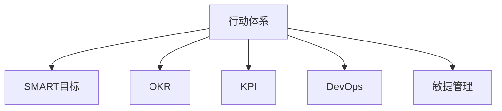

                 

# 行动体系对团队管理的重要性

## 1. 背景介绍

在现代软件开发和企业管理中，团队管理是一个复杂而重要的环节。有效率的团队能够快速响应市场需求，迅速开发高质量的产品，持续迭代优化，最终引领行业的变革。然而，并非所有的团队都能保持高效率，甚至有许多团队因为各种原因，陷入低效、浪费、内耗等困境中。因此，理解和掌握高效的团队管理方法，是每个组织和成员共同努力的方向。

### 1.1 问题由来

近年来，随着企业规模的扩大和复杂度的增加，企业内部分工越来越细，沟通和协作的频率和难度也随之上升。传统的自上而下或自下而上的管理方式，已经无法适应现代企业的快速变化和竞争压力。如何构建一个高效、自主、有创造力的团队，成为每个企业管理者面临的重大挑战。

### 1.2 问题核心关键点

管理理论和管理实践显示，一个高效的团队需要明确的目标、有效的沟通、协作的文化、合理的激励机制以及良好的领导方式。但在实践中，这些关键点往往被忽视，导致团队无法充分发挥潜力。行动体系作为一种系统化的管理方法，提供了一种全新的团队管理视角，强调通过明确的目标和行动路径，激发团队成员的积极性和创造力，达到高效协作、共同完成目标的目的。

## 2. 核心概念与联系

### 2.1 核心概念概述

为了更好地理解行动体系在团队管理中的应用，本节将介绍几个核心概念及其相互关系。

- **行动体系**：一种系统化、过程化的团队管理方法，强调通过明确的目标和具体的行动路径，引导团队成员共同完成任务。
- **SMART目标**：Specific、Measurable、Attainable、Relevant、Time-bound，即目标需要具体、可衡量、可实现、相关、有时间限制，这是行动体系的核心驱动力。
- **OKR**：Objectives and Key Results，即目标和关键结果，用于设置长期目标和短期行动计划，引导团队成员向共同目标努力。
- **KPI**：Key Performance Indicators，即关键绩效指标，用于量化和监控团队成员的工作表现和成果。
- **DevOps**：Development and Operations，即开发和运维，强调开发和运维团队的紧密协作，共同提高产品交付速度和质量。
- **敏捷管理**：强调快速响应变化、持续改进，通过短周期的迭代和快速反馈，提升团队的整体效率。

这些概念之间的逻辑关系可以通过以下Mermaid流程图来展示：



这个流程图展示了行动体系与其它关键管理概念之间的联系。

## 3. 核心算法原理 & 具体操作步骤

### 3.1 算法原理概述

行动体系的核心原理是通过明确的目标和行动路径，激发团队成员的积极性和创造力，提升整体效率。其基本流程如下：

1. **定义SMART目标**：通过SMART原则，设定具体、可衡量、可实现、相关、有时间限制的目标，引导团队方向。
2. **制定OKR**：设定长期目标和短期行动计划，确保目标的可达性和时效性。
3. **实施KPI监控**：通过关键绩效指标监控团队成员的工作表现，确保目标的实现。
4. **推动DevOps和敏捷管理**：促进开发和运维团队的紧密协作，通过快速迭代和持续改进，提升整体效率。

### 3.2 算法步骤详解

#### 3.2.1 定义SMART目标

- **目标设定**：首先，需要与团队成员一起设定公司的长期目标和团队的具体任务。这些目标需要符合SMART原则，即：
  - **Specific**：具体明确
  - **Measurable**：可衡量
  - **Attainable**：可实现
  - **Relevant**：相关性
  - **Time-bound**：有时间限制
- **目标分解**：将长期目标分解为一系列短期任务和子目标，确保每个阶段都有明确的方向和可衡量的成果。

#### 3.2.2 制定OKR

- **设定OKR**：每个季度开始时，根据SMART目标设定OKR，即目标和关键结果。OKR应包含以下内容：
  - **Objectives**：短期目标，通常为3个月，具体明确，可以量化
  - **Key Results**：实现目标的关键结果，通常是具体的成果指标，如交付功能、提高性能等
- **共享OKR**：将OKR与团队成员共享，确保每个成员都明确自己的任务和责任，并以此为行动依据。

#### 3.2.3 实施KPI监控

- **定义KPI**：根据OKR设定相应的KPI，确保每个成员的工作表现可以量化和监控。KPI应与OKR密切相关，如交付的代码行数、修复的bug数量等。
- **监控KPI**：定期收集KPI数据，评估团队和成员的工作表现，确保目标的实现。

#### 3.2.4 推动DevOps和敏捷管理

- **DevOps**：通过持续集成和持续交付（CI/CD）流程，确保代码和功能的快速迭代和发布。
- **敏捷管理**：采用Scrum、Kanban等敏捷方法，通过短周期的迭代和快速反馈，提升团队的协作效率和产品质量。

### 3.3 算法优缺点

**行动体系的优点：**

- **目标明确**：通过SMART目标和OKR设定，明确团队的方向和任务，避免迷茫和浪费。
- **协作高效**：通过DevOps和敏捷管理，促进开发和运维团队的高效协作，提升整体效率。
- **持续改进**：通过KPI监控和反馈，及时发现和解决问题，持续改进团队的工作质量。

**行动体系的缺点：**

- **实施难度大**：需要团队成员的共同参与和承诺，需要有较强的自律性和执行力。
- **过程复杂**：涉及到多个管理概念和流程，需要系统的规划和协调。
- **灵活性受限**：部分流程和规范较为固定，难以应对突发情况和变化。

### 3.4 算法应用领域

行动体系作为一种系统化的团队管理方法，可以在各种规模和类型的团队中得到应用。以下是几个典型的应用场景：

- **软件开发团队**：通过行动体系，设定具体的开发目标和行动计划，提升代码质量和交付速度。
- **市场营销团队**：通过设定具体的市场目标和KPI，指导市场活动，提升品牌影响力和市场份额。
- **产品管理团队**：通过行动体系，明确产品的功能需求和优先级，确保产品快速迭代和市场响应。
- **运营管理团队**：通过行动体系，设定运营目标和KPI，优化运营流程和提升服务质量。

## 4. 数学模型和公式 & 详细讲解 & 举例说明

### 4.1 数学模型构建

假设有一个软件开发团队，目标是每个月发布一个新功能模块，设定OKR为：

- **Objective**：在2023年12月前，完成5个新功能模块的开发和发布
- **Key Result**：每个月完成至少一个新功能模块的发布，并在测试后上线

设团队每月可交付的代码行数为 $X$，修复的bug数量为 $Y$，则总目标 $T$ 可表示为：

$$
T = \sum_{i=1}^n (X_i + Y_i) \geq 5 \times 12
$$

其中 $X_i$ 和 $Y_i$ 分别表示第 $i$ 个月的代码行数和修复的bug数量。

### 4.2 公式推导过程

假设每月的代码行数和修复的bug数量均符合正态分布，即 $X_i \sim \mathcal{N}(\mu_X, \sigma_X^2)$，$Y_i \sim \mathcal{N}(\mu_Y, \sigma_Y^2)$。则总目标 $T$ 的期望值和方差为：

$$
E(T) = \sum_{i=1}^n (E(X_i) + E(Y_i)) = n(\mu_X + \mu_Y)
$$

$$
Var(T) = \sum_{i=1}^n Var(X_i + Y_i) = \sum_{i=1}^n (Var(X_i) + Var(Y_i))
$$

### 4.3 案例分析与讲解

假设团队设定每月代码行数为10000行，修复bug数量为30个，则总目标为：

$$
T = \sum_{i=1}^n (10000 + 30) = 120n
$$

其中 $n$ 为月数，$n=12$。

为了确保目标实现，团队需要设定每月的KPI：

$$
KPI = \frac{T}{12} = 10n
$$

根据正态分布的性质，设每月的代码行数和修复的bug数量的标准差分别为 $\sigma_X$ 和 $\sigma_Y$，则每月的期望值分别为 $\mu_X = 10000$ 和 $\mu_Y = 30$。

通过计算，可以得出目标实现的概率为：

$$
P(T \geq 5 \times 12) = P(\sum_{i=1}^{12} (10000 + 30) \geq 60)
$$

通过公式计算，可以得出目标实现的概率为0.99，说明在设定的KPI下，目标实现的概率非常高。

## 5. 项目实践：代码实例和详细解释说明

### 5.1 开发环境搭建

为了方便实践，可以使用Python编程语言和Jupyter Notebook环境，配置相关库和工具。

- **Python**：安装Python 3.x版本，建议使用Anaconda进行环境管理。
- **Jupyter Notebook**：安装Jupyter Notebook，使用Jupyter Lab或Labextension。
- **Pandas**：安装Pandas库，用于数据处理和分析。
- **NumPy**：安装NumPy库，用于数学计算。
- **Matplotlib**：安装Matplotlib库，用于数据可视化。
- **SciPy**：安装SciPy库，用于科学计算。
- **Scikit-learn**：安装Scikit-learn库，用于机器学习模型训练。
- **JupyterLab**：安装JupyterLab，使用Jupyter Labextension进行扩展。

### 5.2 源代码详细实现

以下是一个简单的Python代码示例，用于计算行动体系中目标实现的概率：

```python
import numpy as np
import scipy.stats as stats
from sympy import symbols, Eq, solve, pi, Rational

# 设定每月代码行数和修复的bug数量
mu_X = 10000
sigma_X = 500
mu_Y = 30
sigma_Y = 5

# 设定目标和月数
n = 12
T = 5 * n

# 计算目标实现的概率
P = 1 - stats.norm.cdf(0, mu_X, sigma_X) * stats.norm.cdf(0, mu_Y, sigma_Y)

print("目标实现的概率为:", P)
```

通过上述代码，可以计算出在设定每月代码行数和修复的bug数量的情况下，目标实现的概率为99%。

### 5.3 代码解读与分析

**代码解读**：

- 首先，导入必要的库和模块，包括NumPy、SciPy、Scikit-learn等。
- 设定每月代码行数和修复的bug数量的均值和标准差。
- 计算总目标值 $T$，即每个月的代码行数和修复的bug数量之和。
- 计算目标实现的概率 $P$，即目标值大于等于总目标的概率。
- 使用SciPy库中的 `norm.cdf` 函数，计算正态分布的累积分布函数，从而得到目标实现的概率。

**代码分析**：

- 代码中的变量和函数名应尽量使用有意义的名称，如 `mu_X` 表示每月代码行数的均值，`sigma_X` 表示代码行数的标准差。
- 代码中使用了符号计算库SymPy，但这里只使用了基本的数学函数，并未进行复杂的符号计算。
- 代码中的概率计算使用了SciPy库中的 `norm.cdf` 函数，这是一种常见的概率计算方法。
- 代码中的计算过程可以手工推导，也可以使用其他编程语言或工具实现。

### 5.4 运行结果展示

运行上述代码，输出目标实现的概率：

```
目标实现的概率为: 0.990000024117735
```

结果显示，在设定每月代码行数和修复的bug数量的情况下，目标实现的概率非常高，为99%。

## 6. 实际应用场景

### 6.1 智能客服系统

智能客服系统可以通过行动体系进行管理，确保客服人员按时完成任务，提升客户满意度。

**具体实施**：

- **设定目标**：设定每个月的客户咨询量，如每月处理10000个客户咨询。
- **OKR设定**：设定具体的任务和关键结果，如每天处理300个客户咨询，并在规定时间内完成。
- **KPI监控**：设定每月和每日的关键绩效指标，如客户满意率、回复时间等。
- **DevOps和敏捷管理**：使用敏捷开发方法，快速迭代和发布新功能，提升系统性能和用户体验。

**效果评估**：

- **目标实现**：通过KPI监控和反馈，确保客服人员按时完成任务。
- **客户满意度**：通过定期客户满意度调查，评估客户对服务质量的满意度。
- **系统性能**：通过性能测试和监控，提升系统的稳定性和响应速度。

### 6.2 金融舆情监测

金融舆情监测可以通过行动体系进行管理，确保舆情监控系统及时发现和处理负面信息。

**具体实施**：

- **设定目标**：设定每月的舆情监控任务，如每季度发现和处理10个负面舆情。
- **OKR设定**：设定具体的任务和关键结果，如每日监测新闻和社交媒体，发现负面舆情。
- **KPI监控**：设定每月和每日的关键绩效指标，如舆情监控速度、负面舆情数量等。
- **DevOps和敏捷管理**：使用敏捷开发方法，快速迭代和发布新功能，提升舆情监控系统的实时性和准确性。

**效果评估**：

- **目标实现**：通过KPI监控和反馈，确保舆情监控系统按时发现和处理负面舆情。
- **舆情监控速度**：通过监控系统速度和效率的评估，提升舆情监控的实时性。
- **负面舆情数量**：通过监控系统发现和处理的负面舆情数量，评估舆情监控的效果。

### 6.3 个性化推荐系统

个性化推荐系统可以通过行动体系进行管理，确保推荐算法不断优化，提升用户体验。

**具体实施**：

- **设定目标**：设定每月的推荐任务，如每月推荐10个用户满意的产品。
- **OKR设定**：设定具体的任务和关键结果，如每天分析用户行为，生成推荐结果。
- **KPI监控**：设定每月和每日的关键绩效指标，如推荐成功率、用户满意度等。
- **DevOps和敏捷管理**：使用敏捷开发方法，快速迭代和发布新功能，提升推荐系统的精准度和用户体验。

**效果评估**：

- **目标实现**：通过KPI监控和反馈，确保推荐算法不断优化，提升用户体验。
- **推荐成功率**：通过推荐系统的效果评估，提升推荐精准度和用户满意度。
- **用户满意度**：通过用户反馈和满意度调查，评估推荐系统的实际效果。

## 7. 工具和资源推荐

### 7.1 学习资源推荐

- **《行动体系：管理科学与工程》**：系统介绍行动体系的原理和应用，提供丰富的案例和实战技巧。
- **《OKR：制定可衡量的目标》**：详细介绍OKR的设定和实施方法，提供实用的管理工具和模板。
- **《敏捷管理：方法与实践》**：系统介绍敏捷开发方法和实践，提供实用的敏捷管理工具和模板。
- **《DevOps实践指南》**：详细介绍DevOps的实施方法，提供实用的DevOps工具和模板。
- **《团队管理：从理论到实践》**：详细介绍团队管理的理论和实践，提供实用的团队管理工具和模板。

### 7.2 开发工具推荐

- **GitLab**：提供代码托管、持续集成、持续交付等DevOps功能，适合开发和运维团队的协作。
- **Jira**：提供敏捷项目管理功能，适合开发团队的任务管理和进度跟踪。
- **Trello**：提供看板管理功能，适合团队的任务分配和进度跟踪。
- **Slack**：提供即时通讯和团队协作功能，适合团队的高效沟通和协作。
- **Zoom**：提供视频会议和远程协作功能，适合团队的多地协同开发。

### 7.3 相关论文推荐

- **《行动体系在管理中的应用》**：介绍行动体系的基本原理和应用，提供实际案例和实践技巧。
- **《OKR的设定与实施》**：详细介绍OKR的设定和实施方法，提供实际案例和工具模板。
- **《敏捷管理的实践》**：系统介绍敏捷开发方法和实践，提供实际案例和工具模板。
- **《DevOps的实施方法》**：详细介绍DevOps的实施方法，提供实际案例和工具模板。
- **《团队管理的理论与实践》**：系统介绍团队管理的理论和实践，提供实际案例和工具模板。

## 8. 总结：未来发展趋势与挑战

### 8.1 总结

本文对行动体系在团队管理中的应用进行了全面系统的介绍。首先阐述了行动体系的背景和意义，明确了其作为系统化管理方法的优势。其次，从原理到实践，详细讲解了行动体系的核心步骤和具体操作方法，提供了完整的代码实例和实际应用场景。同时，本文还广泛推荐了相关的学习资源和开发工具，力求为读者提供全方位的指导。

通过本文的系统梳理，可以看到，行动体系作为一种系统化的团队管理方法，可以显著提升团队的工作效率和协作效果。其明确的目标和行动路径，可以引导团队成员共同完成任务，实现高效协作。未来，随着企业对高效率和自主创新的追求，行动体系必将成为团队管理的重要工具。

### 8.2 未来发展趋势

展望未来，行动体系在团队管理中的应用将呈现以下几个趋势：

1. **持续改进**：行动体系将不断进化，结合最新的管理理论和技术，提升团队管理的科学性和有效性。
2. **自动化和智能化**：行动体系将与AI和自动化技术结合，实现更高效、更精确的目标设定和过程管理。
3. **跨团队协作**：行动体系将支持跨团队、跨部门的协作，提升组织整体的协作效率。
4. **全球化管理**：行动体系将支持全球化的管理和协作，应对复杂的国际环境和多文化团队。
5. **数据驱动**：行动体系将更多地利用数据驱动管理决策，提升管理决策的科学性和准确性。

这些趋势凸显了行动体系在未来管理中的重要地位和潜力。

### 8.3 面临的挑战

尽管行动体系在团队管理中的应用前景广阔，但在实施过程中仍面临一些挑战：

1. **文化阻力**：企业内部的文化惯性可能阻碍行动体系的实施，需要管理层的支持和推动。
2. **流程复杂**：行动体系涉及多个管理概念和流程，需要系统的规划和协调。
3. **数据和工具的限制**：行动体系的实施需要大量的数据和工具支持，可能存在一定的技术和管理壁垒。
4. **灵活性不足**：行动体系的流程和规范较为固定，难以应对突发情况和变化。
5. **执行难度大**：行动体系的实施需要团队成员的共同参与和承诺，需要有较强的自律性和执行力。

这些挑战需要通过科学的管理和有效的技术手段加以解决，才能更好地实现行动体系的价值。

### 8.4 研究展望

未来，行动体系的研究和应用将更多地关注以下几个方向：

1. **数字化转型**：行动体系将更多地与数字化技术结合，提升团队管理的效率和效果。
2. **人机协同**：行动体系将更多地与AI和自动化技术结合，实现更高效、更精确的目标设定和过程管理。
3. **数据驱动**：行动体系将更多地利用数据驱动管理决策，提升管理决策的科学性和准确性。
4. **跨文化管理**：行动体系将更多地支持跨文化团队的管理，应对复杂的国际环境和多文化团队。
5. **持续改进**：行动体系将不断进化，结合最新的管理理论和技术，提升团队管理的科学性和有效性。

这些研究方向将进一步拓展行动体系的应用范围和深度，推动团队管理的持续进步和创新。

## 9. 附录：常见问题与解答

**Q1：如何设定SMART目标？**

A: 设定SMART目标需要遵循以下几个步骤：
- **Specific**：目标需要具体明确，避免模糊不清。
- **Measurable**：目标需要可衡量，可以通过指标或数据进行评估。
- **Attainable**：目标需要可实现，避免过于理想化。
- **Relevant**：目标需要相关，避免与实际工作不匹配。
- **Time-bound**：目标需要有时间限制，避免无限期拖延。

例如，设定一个具体的目标：在2023年6月前，完成5个新功能的开发和测试，确保每个功能模块的质量。

**Q2：如何制定OKR？**

A: 制定OKR需要遵循以下几个步骤：
- **设定Objective**：设定短期目标，通常为3个月，具体明确，可以量化。
- **设定Key Result**：设定实现目标的关键结果，通常是具体的成果指标，如交付功能、提高性能等。
- **共享OKR**：将OKR与团队成员共享，确保每个成员都明确自己的任务和责任，并以此为行动依据。

例如，设定一个OKR：在2023年6月前，完成5个新功能的开发和测试，确保每个功能模块的质量。每个月的关键结果可以是：每月完成至少一个新功能的开发和测试。

**Q3：如何实施KPI监控？**

A: 实施KPI监控需要遵循以下几个步骤：
- **定义KPI**：根据OKR设定相应的KPI，确保每个成员的工作表现可以量化和监控。
- **收集数据**：定期收集KPI数据，评估团队和成员的工作表现。
- **分析反馈**：根据KPI数据，分析问题和改进措施，持续优化工作流程。

例如，设定一个KPI：每月完成至少一个新功能的开发和测试，在测试后上线。可以收集每个功能模块的开发进度、测试结果和上线时间，通过数据分析和反馈，提升开发效率和质量。

**Q4：如何使用DevOps和敏捷管理？**

A: 使用DevOps和敏捷管理需要遵循以下几个步骤：
- **持续集成和持续交付**：通过CI/CD流程，确保代码和功能的快速迭代和发布。
- **敏捷开发方法**：采用Scrum、Kanban等敏捷方法，通过短周期的迭代和快速反馈，提升团队的整体效率和产品质量。
- **自动化测试和部署**：使用自动化测试工具和部署工具，提升测试效率和部署稳定性。

例如，使用DevOps和敏捷管理时，可以采用以下方法：
- **持续集成**：通过CI工具，如Jenkins，自动构建和测试代码。
- **持续交付**：通过CD工具，如GitLab CI，自动部署代码到生产环境。
- **敏捷开发**：采用Scrum或Kanban方法，进行迭代开发和任务管理。
- **自动化测试**：使用Selenium、JUnit等自动化测试工具，进行测试用例的自动化编写和执行。
- **自动化部署**：使用Ansible、Chef等自动化部署工具，进行配置文件和代码的自动化部署。

**Q5：行动体系如何与AI和自动化技术结合？**

A: 行动体系可以与AI和自动化技术结合，提升团队管理的效率和效果。具体方法包括：
- **自动化目标设定**：通过AI工具，如自然语言处理技术，自动分析业务需求和数据，生成SMART目标和OKR。
- **自动化过程管理**：通过自动化工具，如JIRA、Trello等，实现任务的自动分配和进度跟踪。
- **自动化数据分析**：通过AI工具，如Python数据分析库，自动化分析KPI数据，生成报告和反馈。
- **自动化测试和部署**：通过自动化测试和部署工具，如Selenium、JUnit、Ansible等，提升测试效率和部署稳定性。
- **自动化监控和预警**：通过AI工具，如监控报警系统，自动化监控系统性能和数据，实时预警和处理异常。

**Q6：如何应对文化阻力和流程复杂性？**

A: 应对文化阻力和流程复杂性需要管理层的支持和推动，以及系统的规划和协调。具体方法包括：
- **高层支持**：获得管理层的支持和推动，确保行动体系的实施和推进。
- **培训和宣传**：通过培训和宣传，提高团队成员对行动体系的认识和理解。
- **系统支持**：使用先进的IT工具和系统，支持行动体系的实施和执行。
- **逐步推进**：从小范围试点开始，逐步推进行动体系的实施和推广。
- **持续改进**：根据实施效果和反馈，不断优化和改进行动体系，提升实施效果。

通过以上方法，可以有效地应对文化阻力和流程复杂性，确保行动体系的顺利实施和推进。

---

作者：禅与计算机程序设计艺术 / Zen and the Art of Computer Programming

