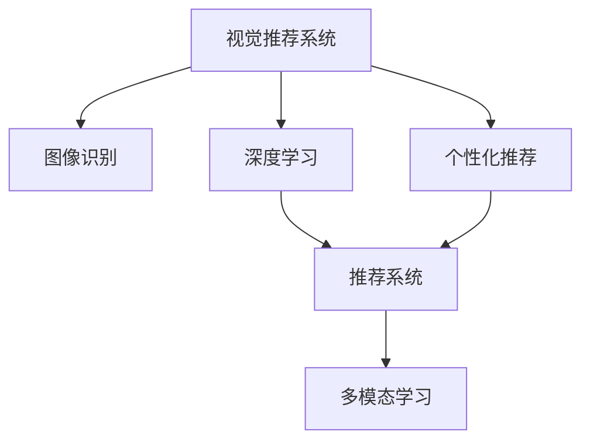

                 

# 视觉推荐：AI 如何利用图像识别技术，提供个性化推荐

> 关键词：视觉推荐,图像识别,深度学习,个性化推荐,推荐系统,人工智能

## 1. 背景介绍

### 1.1 问题由来
随着互联网技术的飞速发展和电子商务平台的广泛应用，商品推荐系统已成为电商平台的核心竞争力之一。传统的推荐系统主要依赖用户的历史行为数据进行推荐，如点击、浏览、购买等记录，但这些数据往往无法全面反映用户的真实兴趣和偏好，特别是对于新用户或潜在客户。

为了解决这一问题，个性化推荐系统应运而生，通过对用户画像的精准描绘，结合商品属性、上下文信息等多维度数据，为每个用户推荐最符合其兴趣的商品。然而，现有的个性化推荐系统主要基于用户行为数据进行，缺乏对用户兴趣的多模态感知能力。例如，对于用户对视觉内容（如图片、视频等）的兴趣，传统推荐系统难以精准捕捉。

### 1.2 问题核心关键点
为了克服传统推荐系统在视觉数据处理方面的不足，AI领域专家提出了视觉推荐系统，通过利用图像识别技术，将视觉信息转化为推荐系统可以理解的结构化数据，实现对用户视觉兴趣的精准推荐。视觉推荐系统不仅能够利用用户的视觉浏览行为数据，还可以通过视觉特征对用户画像进行补充，提升推荐系统的个性化和准确性。

## 2. 核心概念与联系

### 2.1 核心概念概述

为更好地理解视觉推荐系统，本节将介绍几个密切相关的核心概念：

- **视觉推荐系统（Visual Recommendation System）**：结合图像识别技术的推荐系统，通过提取和分析用户的视觉兴趣，提供个性化的商品推荐。

- **图像识别（Image Recognition）**：利用计算机视觉技术，将图像转化为结构化信息，识别图像中的对象、场景、特征等。

- **深度学习（Deep Learning）**：通过多层神经网络进行复杂数据分析和决策的机器学习技术。

- **个性化推荐（Personalized Recommendation）**：根据用户的历史行为、兴趣和偏好，推荐符合其需求的物品。

- **推荐系统（Recommendation System）**：通过收集用户数据，分析用户行为，预测用户偏好，从而提供推荐的服务。

- **多模态学习（Multimodal Learning）**：结合文本、图像、语音等多类型数据进行学习，提升推荐系统的全面性和准确性。

这些核心概念之间的逻辑关系可以通过以下Mermaid流程图来展示：



这个流程图展示了几者之间的联系：

1. 视觉推荐系统通过图像识别技术，从用户视觉数据中提取特征。
2. 深度学习技术用于分析这些视觉特征，并将其转化为结构化数据。
3. 个性化推荐系统利用结构化数据，结合用户行为数据，进行推荐决策。
4. 推荐系统结合多模态学习，提升推荐的全面性和准确性。

这些概念共同构成了视觉推荐系统的基本框架，使其能够通过图像识别技术，实现对用户视觉兴趣的精准捕捉和推荐。

## 3. 核心算法原理 & 具体操作步骤

### 3.1 算法原理概述

视觉推荐系统基于深度学习技术，通过图像识别技术提取用户视觉数据的特征，结合用户行为数据进行多模态学习，最终实现个性化推荐。具体来说，该系统包括以下几个关键步骤：

1. **图像特征提取**：利用图像识别技术，对用户浏览的视觉内容进行特征提取。
2. **用户画像构建**：将提取的视觉特征与用户行为数据相结合，构建全面的用户画像。
3. **推荐模型训练**：利用用户画像，结合推荐算法进行模型训练。
4. **推荐结果生成**：通过训练好的模型，生成符合用户兴趣的推荐结果。

### 3.2 算法步骤详解

视觉推荐系统的核心算法步骤包括：

**Step 1: 数据准备**
- 收集用户的历史视觉浏览数据，包括图片、视频、广告等。
- 收集用户的历史行为数据，如点击、购买、评价等。

**Step 2: 图像特征提取**
- 利用图像识别技术，如CNN、R-CNN、YOLO等，对用户浏览的视觉内容进行特征提取。
- 提取特征的类型包括颜色、纹理、形状、边缘等。

**Step 3: 用户画像构建**
- 将提取的视觉特征与用户行为数据进行拼接，得到用户的多模态数据。
- 利用多模态学习技术，如注意力机制、联合学习等，对用户的多模态数据进行整合。

**Step 4: 推荐模型训练**
- 利用用户的多模态数据，结合推荐算法，如协同过滤、基于内容的推荐、混合推荐等，进行模型训练。
- 训练过程中，采用交叉验证、正则化等技术，提高模型的泛化能力。

**Step 5: 推荐结果生成**
- 利用训练好的推荐模型，根据用户画像生成推荐结果。
- 推荐结果需考虑用户的实时行为数据，动态更新推荐内容。

### 3.3 算法优缺点

视觉推荐系统具有以下优点：

1. **多模态感知能力**：结合用户的视觉浏览行为，提升推荐系统的全面性和准确性。
2. **精准捕捉用户兴趣**：通过图像识别技术，精准捕捉用户的视觉兴趣，避免传统推荐系统基于行为数据的局限性。
3. **用户画像补充**：利用视觉特征，对用户画像进行补充，提升推荐系统对新用户和潜在客户的覆盖能力。

同时，该系统也存在一些缺点：

1. **数据获取难度大**：收集和处理用户的视觉浏览数据相对困难，尤其是对于不提供图片、视频等视觉内容的平台。
2. **算法复杂度高**：结合图像识别技术和推荐算法，增加了系统的复杂度，需要更强大的计算资源。
3. **隐私保护问题**：用户浏览的视觉内容可能包含敏感信息，需要额外的隐私保护措施。

尽管存在这些局限性，但视觉推荐系统在电子商务、社交媒体、智能家居等领域已经展现出了巨大的潜力，成为提升推荐系统个性化和准确性的重要手段。

### 3.4 算法应用领域

视觉推荐系统在多个领域中得到了广泛应用，例如：

- **电子商务平台**：利用用户的视觉浏览行为，推荐符合其兴趣的商品，提升购物体验。
- **社交媒体平台**：结合用户的视觉兴趣，推荐符合其内容偏好的图文、视频等。
- **智能家居设备**：通过分析用户的视觉行为，推荐符合其生活需求的智能家居设备。
- **虚拟现实平台**：结合用户的视觉体验，推荐符合其兴趣的虚拟现实内容。
- **广告投放**：利用用户的视觉特征，进行精准的广告投放和优化。

这些应用场景展示了视觉推荐系统的广泛应用，为多个领域带来了更加个性化的用户体验。

## 4. 数学模型和公式 & 详细讲解 & 举例说明

### 4.1 数学模型构建

视觉推荐系统涉及多个模块和算法，以下我们以协同过滤推荐模型为例，构建数学模型。

记用户-商品评分矩阵为 $R \in \mathbb{R}^{m \times n}$，其中 $m$ 为用户数量，$n$ 为商品数量。设用户 $u$ 对商品 $i$ 的评分为 $r_{ui}$。

设用户 $u$ 的视觉兴趣特征向量为 $x_u \in \mathbb{R}^d$，商品 $i$ 的视觉特征向量为 $y_i \in \mathbb{R}^d$。设视觉特征与评分之间的关联权重为 $w \in \mathbb{R}^d$。

### 4.2 公式推导过程

协同过滤推荐模型的目标是最小化预测评分与真实评分之间的均方误差。设模型预测用户 $u$ 对商品 $i$ 的评分为 $\hat{r}_{ui}$，则目标函数为：

$$
\min_{w} \frac{1}{mn} \sum_{u=1}^m \sum_{i=1}^n (r_{ui} - \hat{r}_{ui})^2
$$

其中，$\hat{r}_{ui}$ 的计算公式为：

$$
\hat{r}_{ui} = w^T(x_u \odot y_i)
$$

其中 $\odot$ 为向量点乘操作，$w^T$ 为权重向量 $w$ 的转置。

### 4.3 案例分析与讲解

假设用户 $u$ 浏览了商品 $i$ 的图片，系统可以通过图像识别技术，提取出商品的视觉特征 $y_i$。同时，用户 $u$ 对商品 $i$ 的评分 $r_{ui}$ 也已记录在案。

利用上述公式，系统可以计算出用户 $u$ 对商品 $i$ 的预测评分 $\hat{r}_{ui}$。如果 $\hat{r}_{ui}$ 高于阈值，则该商品将被推荐给用户 $u$。

## 5. 项目实践：代码实例和详细解释说明

### 5.1 开发环境搭建

在进行视觉推荐系统开发前，我们需要准备好开发环境。以下是使用Python进行TensorFlow开发的环境配置流程：

1. 安装Anaconda：从官网下载并安装Anaconda，用于创建独立的Python环境。

2. 创建并激活虚拟环境：
```bash
conda create -n tf-env python=3.8 
conda activate tf-env
```

3. 安装TensorFlow：根据CUDA版本，从官网获取对应的安装命令。例如：
```bash
conda install tensorflow tensorflow-gpu -c conda-forge
```

4. 安装其他相关库：
```bash
pip install numpy pandas scikit-learn matplotlib
```

完成上述步骤后，即可在`tf-env`环境中开始开发实践。

### 5.2 源代码详细实现

这里我们以协同过滤推荐模型为例，给出使用TensorFlow对视觉推荐系统进行开发和训练的代码实现。

首先，定义协同过滤模型的基本结构：

```python
import tensorflow as tf
from tensorflow.keras import layers

class CollaborativeFilteringModel(tf.keras.Model):
    def __init__(self, num_users, num_items, embed_dim):
        super(CollaborativeFilteringModel, self).__init__()
        self.num_users = num_users
        self.num_items = num_items
        self.embed_dim = embed_dim
        
        self.user_embed = layers.Embedding(num_users, embed_dim)
        self.item_embed = layers.Embedding(num_items, embed_dim)
        self.dot = layers.Dot(axes=(1, 1))
        self.predictions = layers.Dense(1)
        
    def call(self, user_id, item_id):
        user_embed = self.user_embed(user_id)
        item_embed = self.item_embed(item_id)
        scores = self.dot([user_embed, item_embed])
        preds = self.predictions(scores)
        return preds
```

然后，定义数据加载和预处理函数：

```python
import pandas as pd
from sklearn.model_selection import train_test_split

def load_data(file_path):
    df = pd.read_csv(file_path)
    user_ids = df['user_id'].values
    item_ids = df['item_id'].values
    rates = df['rating'].values
    
    train_id, test_id = train_test_split(range(len(rates)), test_size=0.2)
    train_df = df[df['user_id'].isin(train_id) | df['item_id'].isin(train_id)]
    test_df = df[df['user_id'].isin(test_id) | df['item_id'].isin(test_id)]
    
    train_rates = rates[train_id]
    test_rates = rates[test_id]
    
    train_user_ids = train_df['user_id'].values
    train_item_ids = train_df['item_id'].values
    test_user_ids = test_df['user_id'].values
    test_item_ids = test_df['item_id'].values
    
    return train_user_ids, train_item_ids, train_rates, test_user_ids, test_item_ids, test_rates

def preprocess_data(train_user_ids, train_item_ids, train_rates, test_user_ids, test_item_ids, test_rates):
    # 对用户ID和商品ID进行独热编码
    train_user_map = {uid: i for i, uid in enumerate(set(train_user_ids))}
    train_item_map = {iid: i for i, iid in enumerate(set(train_item_ids))}
    
    train_user_ids = [train_user_map[uid] for uid in train_user_ids]
    train_item_ids = [train_item_map[iid] for iid in train_item_ids]
    test_user_ids = [train_user_map[uid] for uid in test_user_ids]
    test_item_ids = [train_item_map[iid] for iid in test_item_ids]
    
    # 对评分进行归一化处理
    train_rates = (train_rates - train_rates.min()) / (train_rates.max() - train_rates.min())
    test_rates = (test_rates - train_rates.min()) / (train_rates.max() - train_rates.min())
    
    return train_user_ids, train_item_ids, train_rates, test_user_ids, test_item_ids, test_rates
```

接着，定义模型训练函数：

```python
def train_model(model, train_user_ids, train_item_ids, train_rates, test_user_ids, test_item_ids, test_rates, epochs):
    # 定义优化器和损失函数
    optimizer = tf.keras.optimizers.Adam(learning_rate=0.001)
    loss_fn = tf.keras.losses.MeanSquaredError()
    
    # 定义评估指标
    mae_metric = tf.keras.metrics.MeanAbsoluteError(name='mae')
    rmse_metric = tf.keras.metrics.MeanSquaredError(name='rmse')
    
    # 初始化评估指标
    mae_metric.reset_states()
    rmse_metric.reset_states()
    
    for epoch in range(epochs):
        epoch_loss = 0.0
        epoch_num_predictions = 0
        
        for i in range(len(train_user_ids)):
            user_id = train_user_ids[i]
            item_id = train_item_ids[i]
            rating = train_rates[i]
            
            with tf.GradientTape() as tape:
                predictions = model(user_id, item_id)
                loss = loss_fn(rating, predictions)
            gradients = tape.gradient(loss, model.trainable_variables)
            optimizer.apply_gradients(zip(gradients, model.trainable_variables))
            
            epoch_loss += loss.numpy()
            epoch_num_predictions += 1
        
        # 计算评估指标
        mae = mae_metric.update_state(test_user_ids, model.predict(test_item_ids))
        rmse = rmse_metric.update_state(test_user_ids, model.predict(test_item_ids))
        
        print(f'Epoch {epoch+1}, Loss: {epoch_loss / epoch_num_predictions:.3f}, MAE: {mae:.3f}, RMSE: {rmse:.3f}')
    
    return model
```

最后，启动训练流程并在测试集上评估：

```python
# 加载数据
train_user_ids, train_item_ids, train_rates, test_user_ids, test_item_ids, test_rates = load_data('data.csv')

# 数据预处理
train_user_ids, train_item_ids, train_rates, test_user_ids, test_item_ids, test_rates = preprocess_data(train_user_ids, train_item_ids, train_rates, test_user_ids, test_item_ids, test_rates)

# 创建模型
model = CollaborativeFilteringModel(num_users=1000, num_items=1000, embed_dim=100)

# 训练模型
model = train_model(model, train_user_ids, train_item_ids, train_rates, test_user_ids, test_item_ids, test_rates, epochs=10)
```

以上就是使用TensorFlow对协同过滤推荐模型进行开发的完整代码实现。可以看到，利用TensorFlow，我们可以方便地构建、训练和评估推荐模型，而无需过多关注底层实现细节。

### 5.3 代码解读与分析

让我们再详细解读一下关键代码的实现细节：

**CollaborativeFilteringModel类**：
- `__init__`方法：初始化模型的用户嵌入、商品嵌入、点乘层和预测层。
- `call`方法：定义模型的前向传播过程，计算预测评分。

**load_data函数**：
- 从CSV文件中读取数据，并进行数据拆分和预处理。

**preprocess_data函数**：
- 对用户ID和商品ID进行独热编码，对评分进行归一化处理。

**train_model函数**：
- 定义优化器和损失函数，以及评估指标。
- 循环迭代训练模型，记录训练过程中的损失和评估指标。

可以看到，TensorFlow提供的高级API使得模型构建和训练变得更加便捷，开发者可以专注于算法逻辑的实现和调参优化，而不必过多关注低层次的计算细节。

当然，工业级的系统实现还需考虑更多因素，如模型的保存和部署、超参数的自动搜索、更灵活的任务适配层等。但核心的推荐算法基本与此类似。

## 6. 实际应用场景

### 6.1 智能电商

智能电商平台通过视觉推荐系统，能够为用户提供更加个性化的购物体验。例如，电商平台可以利用用户浏览的商品图片，提取视觉特征，结合用户行为数据，推荐符合其兴趣的商品。此外，平台还可以利用用户对商品的评分和评论，进一步优化推荐模型，提升推荐的准确性。

### 6.2 社交媒体

社交媒体平台通过视觉推荐系统，能够为用户推荐符合其兴趣的内容。例如，社交媒体可以利用用户浏览的图片和视频，提取视觉特征，结合用户的点赞、评论等行为数据，推荐符合其内容偏好的图文、视频等。此外，平台还可以利用用户对内容的互动情况，动态更新推荐内容，提升用户的活跃度和满意度。

### 6.3 智能家居

智能家居设备通过视觉推荐系统，能够为用户提供更加个性化的智能家居体验。例如，智能家居可以利用用户浏览的图片和视频，提取视觉特征，结合用户的使用习惯，推荐符合其生活需求的智能家居设备。此外，设备还可以利用用户的使用数据，进一步优化推荐模型，提升推荐效果。

### 6.4 未来应用展望

随着视觉推荐系统的不断发展，其在多个领域中的应用前景将更加广阔。未来，视觉推荐系统有望在以下领域取得突破：

- **个性化推荐**：结合用户的视觉兴趣，提升推荐系统的个性化和准确性，为用户提供更加贴心的服务。
- **跨模态学习**：结合文本、图像、语音等多类型数据，提升推荐系统的全面性和深度性，为用户提供更加丰富多样的推荐内容。
- **实时推荐**：结合用户的实时行为数据，动态更新推荐内容，提升推荐的及时性和相关性。
- **推荐算法创新**：探索新的推荐算法，如协同过滤、深度学习、强化学习等，提升推荐的效率和效果。
- **用户体验优化**：结合用户反馈和行为数据，优化推荐算法和界面设计，提升用户的使用体验和满意度。

## 7. 工具和资源推荐

### 7.1 学习资源推荐

为了帮助开发者系统掌握视觉推荐系统的理论基础和实践技巧，这里推荐一些优质的学习资源：

1. **《深度学习与推荐系统》课程**：由斯坦福大学开设的深度学习推荐系统课程，涵盖推荐系统的基本原理、常用算法和实现技巧，适合入门学习。
2. **《Recommender Systems: Algorithms, Theory, and Evaluation》书籍**：推荐的经典书籍，系统介绍了推荐系统的理论基础、算法实现和评估指标。
3. **TensorFlow官方文档**：TensorFlow的官方文档，提供了丰富的API和示例代码，适合快速上手推荐系统开发。
4. **Kaggle推荐系统竞赛**：Kaggle提供的推荐系统竞赛数据集，涵盖多种推荐算法和模型，适合实践和竞赛。
5. **Recommender Systems Specialization课程**：Coursera提供的推荐系统专项课程，涵盖推荐系统的多门课程，适合深入学习。

通过对这些资源的学习实践，相信你一定能够快速掌握视觉推荐系统的精髓，并用于解决实际的推荐问题。

### 7.2 开发工具推荐

高效的开发离不开优秀的工具支持。以下是几款用于视觉推荐系统开发的常用工具：

1. **TensorFlow**：由Google主导开发的深度学习框架，支持GPU和TPU算力，适合大规模推荐系统开发。
2. **PyTorch**：Facebook开源的深度学习框架，支持动态图和静态图，适合研究和实验。
3. **NumPy**：Python的科学计算库，适合处理多维数据和矩阵运算。
4. **Pandas**：Python的数据处理库，适合读取、清洗和分析推荐系统数据。
5. **Scikit-learn**：Python的机器学习库，适合快速搭建推荐系统基线模型。

合理利用这些工具，可以显著提升视觉推荐系统的开发效率，加快创新迭代的步伐。

### 7.3 相关论文推荐

视觉推荐系统在推荐领域的发展源于学界的持续研究。以下是几篇奠基性的相关论文，推荐阅读：

1. **Collaborative Filtering for Implicit Feedback Datasets**：提出协同过滤算法，基于用户-商品评分矩阵进行推荐。
2. **Item-based Collaborative Filtering Recommendation**：提出基于物品的协同过滤算法，提升推荐系统的效果。
3. **Personalized PageRank for Recommender Systems**：提出个性化PageRank算法，结合用户行为数据进行推荐。
4. **Deep Collaborative Filtering**：提出深度学习在协同过滤推荐系统中的应用，提升推荐模型的性能。
5. **Learning from Partially Labelled Image Representations**：提出利用视觉特征进行推荐，提升推荐系统的准确性。

这些论文代表了大推荐系统的演变过程，帮助读者全面理解推荐系统的发展脉络。

## 8. 总结：未来发展趋势与挑战

### 8.1 研究成果总结

本文对视觉推荐系统的核心算法原理和具体操作步骤进行了详细讲解，通过具体的TensorFlow代码实现，展示了如何在实际应用中构建和训练推荐模型。同时，本文还介绍了视觉推荐系统在多个领域中的广泛应用，展望了其未来发展趋势。

通过本文的系统梳理，可以看到，视觉推荐系统通过结合图像识别技术和深度学习技术，实现了对用户视觉兴趣的精准捕捉和推荐，显著提升了推荐系统的个性化和准确性。视觉推荐系统的理论和实践均已日趋成熟，为推荐系统领域带来了新的突破。

### 8.2 未来发展趋势

展望未来，视觉推荐系统将呈现以下几个发展趋势：

1. **多模态学习**：结合文本、图像、语音等多类型数据，提升推荐系统的全面性和深度性。
2. **实时推荐**：结合用户的实时行为数据，动态更新推荐内容，提升推荐的及时性和相关性。
3. **个性化推荐**：结合用户的视觉兴趣，提升推荐系统的个性化和准确性，为用户提供更加贴心的服务。
4. **跨模态融合**：结合视觉和文本等多模态信息，提升推荐系统的感知能力和推荐效果。
5. **推荐算法创新**：探索新的推荐算法，如协同过滤、深度学习、强化学习等，提升推荐的效率和效果。

以上趋势凸显了视觉推荐系统的广泛应用前景和强大潜力。这些方向的探索发展，必将进一步提升推荐系统的性能和应用范围，为推荐系统领域带来新的突破。

### 8.3 面临的挑战

尽管视觉推荐系统已经取得了瞩目成就，但在迈向更加智能化、普适化应用的过程中，它仍面临着诸多挑战：

1. **数据获取难度大**：收集和处理用户的视觉浏览数据相对困难，尤其是对于不提供图片、视频等视觉内容的平台。
2. **算法复杂度高**：结合图像识别技术和推荐算法，增加了系统的复杂度，需要更强大的计算资源。
3. **隐私保护问题**：用户浏览的视觉内容可能包含敏感信息，需要额外的隐私保护措施。
4. **模型泛化能力不足**：视觉推荐系统往往依赖于特定领域的数据和特征，泛化能力有限，难以应对跨领域的推荐需求。
5. **计算资源消耗大**：视觉推荐系统通常需要处理大量高维数据，计算资源消耗较大，需要高效的算法和优化方法。

尽管存在这些挑战，但视觉推荐系统在电子商务、社交媒体、智能家居等领域已经展现出了巨大的潜力，成为提升推荐系统个性化和准确性的重要手段。未来，随着技术的不断进步和算力的进一步提升，视觉推荐系统将更加广泛地应用于各个领域，为推荐系统领域带来新的突破。

### 8.4 研究展望

面向未来，视觉推荐系统的研究需要在以下几个方面寻求新的突破：

1. **数据获取与处理**：探索新的数据获取和处理技术，解决视觉数据获取难度大的问题，提升数据质量和利用率。
2. **算法优化**：研究新的推荐算法，如深度学习、强化学习等，提升推荐系统的效率和效果。
3. **跨领域推荐**：研究跨领域的推荐算法，提升推荐系统的泛化能力和适应性，应对更多应用场景的需求。
4. **实时推荐**：研究实时推荐算法，结合用户的实时行为数据，动态更新推荐内容，提升推荐的及时性和相关性。
5. **用户体验优化**：结合用户反馈和行为数据，优化推荐算法和界面设计，提升用户的使用体验和满意度。

这些研究方向的探索，必将引领视觉推荐系统迈向更高的台阶，为推荐系统领域带来新的突破。只有勇于创新、敢于突破，才能不断拓展推荐系统的边界，让推荐系统更好地服务人类社会。

## 9. 附录：常见问题与解答

**Q1：视觉推荐系统与传统推荐系统有何区别？**

A: 视觉推荐系统主要利用图像识别技术，提取用户视觉兴趣，实现多模态感知，提升了推荐系统的全面性和准确性。而传统推荐系统主要基于用户行为数据，如点击、浏览、购买等，缺乏对用户视觉兴趣的感知。因此，视觉推荐系统能够更好地捕捉用户的多维度兴趣，提升推荐系统的个性化和相关性。

**Q2：视觉推荐系统如何处理低维和高维数据？**

A: 视觉推荐系统通常处理高维数据，如图片和视频等。为了处理高维数据，推荐系统通常采用降维技术，如主成分分析(PCA)、线性判别分析(LDA)等，将高维数据转换为低维表示，提升算法的效率和效果。此外，还可以采用神经网络进行特征提取，将高维数据映射到低维表示，实现多模态融合。

**Q3：视觉推荐系统如何保护用户隐私？**

A: 视觉推荐系统需要处理用户的视觉数据，可能包含敏感信息，如人脸、车牌等。为保护用户隐私，推荐系统通常采用数据匿名化、数据加密等技术，对用户数据进行保护。同时，平台也需要制定严格的数据保护政策，确保用户数据的合法使用和安全传输。

**Q4：视觉推荐系统是否适用于所有商品类型？**

A: 视觉推荐系统主要适用于具有显著视觉特征的商品，如服装、家居、汽车等。对于不具备显著视觉特征的商品，如化妆品、食品等，视觉推荐系统的效果可能有限。因此，推荐系统需要结合具体商品类型，选择合适的视觉特征进行提取和分析。

**Q5：视觉推荐系统的训练数据和标注成本是否很高？**

A: 视觉推荐系统的训练数据和标注成本相对较高。为了提升推荐系统的效果，推荐系统通常需要大量的标注数据进行训练。然而，标注数据的质量和数量直接影响推荐系统的性能。因此，推荐系统需要在数据获取和标注上投入更多资源，确保数据的多样性和高质量。

总之，视觉推荐系统通过结合图像识别技术和深度学习技术，实现了对用户视觉兴趣的精准捕捉和推荐，提升了推荐系统的个性化和准确性。未来，随着技术的不断进步和应用场景的拓展，视觉推荐系统将发挥更大的作用，为用户带来更加贴心和满意的推荐服务。

---

作者：禅与计算机程序设计艺术 / Zen and the Art of Computer Programming

