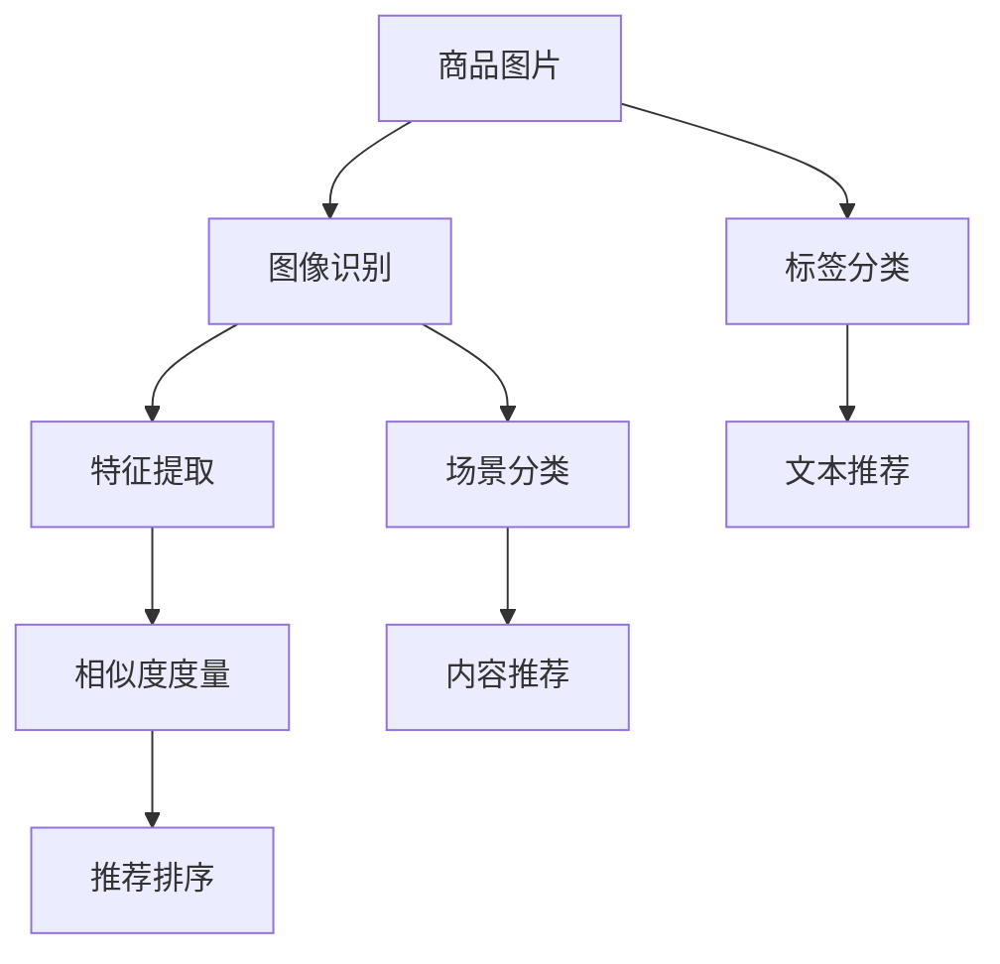

                 

## 1. 背景介绍

随着电子商务的蓬勃发展，商品推荐系统已成为零售商提高销售额和用户体验的关键。然而，传统的基于文本的推荐系统，往往难以充分利用商品的多样性特征，忽略了图片、颜色、材质等视觉属性，导致推荐结果不够直观。

近年来，计算机视觉技术的快速进步为商品推荐带来了新的机遇。通过将图像识别技术融入推荐系统，AI可以更加直观地理解商品特征，提供更精准、更具视觉冲击力的推荐结果。

本节将首先介绍视觉推荐的背景知识，并探讨其原理和优势。

## 2. 核心概念与联系

### 2.1 核心概念概述

要理解视觉推荐，首先需要了解以下几个核心概念：

- **视觉推荐系统(Visual Recommendation System)**：利用图像识别技术，根据商品图片、颜色、纹理等视觉特征进行推荐的系统。
- **计算机视觉(Computer Vision)**：通过算法使计算机识别、处理和理解图像和视频等视觉信息的技术。
- **图像识别(Image Recognition)**：计算机视觉中的一个重要分支，指识别图像中存在的对象、场景和特征。
- **特征提取(Feature Extraction)**：从图像中提取出有用的视觉特征，用于后续的分类、匹配等任务。
- **相似度度量(Similarity Metric)**：衡量两个商品在视觉特征上的相似度，用于推荐排序。

这些概念之间存在紧密的联系，通过计算机视觉和图像识别技术，可以从图片中提取出关键的视觉特征，并基于这些特征进行推荐排序，从而提升推荐系统的准确性和用户满意度。

### 2.2 核心概念原理和架构的 Mermaid 流程图



在这个流程图中，商品图片首先通过图像识别，提取出视觉特征。这些特征再经过特征提取，生成高维特征向量，用于后续的相似度度量和推荐排序。同时，如果图片附带标签或文字描述，可以通过分类和匹配进一步补充推荐信息。场景分类和内容推荐等也可以丰富推荐结果，提高用户体验。

## 3. 核心算法原理 & 具体操作步骤

### 3.1 算法原理概述

视觉推荐系统利用图像识别技术，提取商品的视觉特征，用于推荐排序。其核心原理如下：

1. **图像预处理**：对商品图片进行裁剪、缩放、归一化等预处理操作，以便于后续的特征提取。
2. **特征提取**：利用卷积神经网络(CNN)等计算机视觉模型，从预处理后的图片中提取出视觉特征。
3. **相似度度量**：计算商品之间的相似度，常见方法包括余弦相似度、欧式距离、曼哈顿距离等。
4. **推荐排序**：根据相似度排序，将相似度高的商品推荐给用户。

### 3.2 算法步骤详解

下面详细介绍视觉推荐系统的核心算法步骤：

1. **数据准备**：收集商品的图片、标签、价格、评分等信息，并划分为训练集、验证集和测试集。
2. **模型选择**：选择合适的计算机视觉模型，如VGG、ResNet、Inception等，作为视觉特征提取器。
3. **特征提取**：利用模型提取图片中的视觉特征，生成高维特征向量。
4. **相似度度量**：使用余弦相似度计算商品之间的相似度。
5. **推荐排序**：根据相似度排序，生成推荐结果。
6. **评估与优化**：在验证集上评估推荐效果，调整模型参数或选择不同的特征提取方法，以提升性能。

### 3.3 算法优缺点

**优点**：
- 直观性：图像本身比文本更直观，用户可以直观地看到相似商品的图片。
- 多样性：可以处理多种商品类别，包括服饰、美妆、家居等。
- 高准确性：视觉特征能更准确地反映商品属性，提升推荐精度。

**缺点**：
- 数据需求高：需要大量高分辨率、高质量的商品图片，收集和标注成本较高。
- 特征复杂：视觉特征提取模型的训练和调参复杂，需要专业技能。
- 存储和计算开销大：高维特征向量和相似度计算会导致较大的存储和计算开销。

### 3.4 算法应用领域

视觉推荐系统在多个领域得到了广泛应用，如：

- **电商零售**：帮助零售商提供个性化的商品推荐，提升用户购买率和满意度。
- **时尚产业**：推荐时尚服饰、配饰，满足用户个性化需求。
- **家居装饰**：推荐家具、家居用品，提升生活品质。
- **美妆行业**：推荐化妆品、护肤品，引导用户消费。
- **旅游业**：推荐旅游景点、特色商品，促进旅游业发展。

## 4. 数学模型和公式 & 详细讲解

### 4.1 数学模型构建

假设我们有 $N$ 个商品，每个商品 $i$ 的图像特征向量为 $\boldsymbol{x}_i \in \mathbb{R}^d$，其中 $d$ 是特征维度。我们的目标是从这些图像特征中提取出 $k$ 个最相似的特征向量，用于推荐排序。

设 $\boldsymbol{x}_i$ 和 $\boldsymbol{x}_j$ 之间的余弦相似度为 $s_{i,j} = \frac{\boldsymbol{x}_i \cdot \boldsymbol{x}_j}{\|\boldsymbol{x}_i\| \|\boldsymbol{x}_j\|}$。我们需要计算每对商品之间的相似度，并根据相似度排序，生成推荐结果。

### 4.2 公式推导过程

以余弦相似度为例，其推导如下：

$$
s_{i,j} = \frac{\boldsymbol{x}_i \cdot \boldsymbol{x}_j}{\|\boldsymbol{x}_i\| \|\boldsymbol{x}_j\|} = \frac{\sum_{k=1}^d x_{i,k} x_{j,k}}{\sqrt{\sum_{k=1}^d x_{i,k}^2} \sqrt{\sum_{k=1}^d x_{j,k}^2}}
$$

式中 $\cdot$ 表示向量点乘，$\|\cdot\|$ 表示向量范数。

### 4.3 案例分析与讲解

以推荐系统中的一个场景为例，分析余弦相似度的计算过程：

假设商品1的图片特征向量为 $\boldsymbol{x}_1 = [0.5, 0.5, 0.1, -0.1]$，商品2的图片特征向量为 $\boldsymbol{x}_2 = [0.4, 0.6, 0.2, -0.2]$。它们的余弦相似度为：

$$
s_{1,2} = \frac{0.5 \times 0.4 + 0.5 \times 0.6 + 0.1 \times 0.2 + (-0.1) \times (-0.2)}{\sqrt{0.5^2 + 0.5^2 + 0.1^2 + (-0.1)^2} \sqrt{0.4^2 + 0.6^2 + 0.2^2 + (-0.2)^2}} = 0.6
$$

根据余弦相似度排序，商品1和商品2相似度最高，因此优先推荐给用户。

## 5. 项目实践：代码实例和详细解释说明

### 5.1 开发环境搭建

本节将介绍使用Python和TensorFlow实现视觉推荐系统的环境配置。

1. 安装Anaconda：
```bash
conda install anaconda
```

2. 创建虚拟环境：
```bash
conda create -n visual_rec sys_info
conda activate visual_rec
```

3. 安装TensorFlow和其他依赖：
```bash
pip install tensorflow numpy matplotlib
```

### 5.2 源代码详细实现

下面以商品推荐为例，介绍基于TensorFlow的视觉推荐系统的实现。

```python
import tensorflow as tf
import numpy as np
import matplotlib.pyplot as plt

# 数据准备
# 假设我们已经有了一个商品图片特征矩阵X，和对应的标签y
X = np.random.rand(100, 64)  # 100个商品，64维特征向量
y = np.random.randint(0, 10, 100)  # 随机标签

# 定义模型
class VisualRecommendation(tf.keras.Model):
    def __init__(self, num_classes=10):
        super(VisualRecommendation, self).__init__()
        self.num_classes = num_classes
        self.dense_layer1 = tf.keras.layers.Dense(32, activation='relu')
        self.dense_layer2 = tf.keras.layers.Dense(self.num_classes, activation='softmax')
    
    def call(self, x):
        x = self.dense_layer1(x)
        x = self.dense_layer2(x)
        return x

# 构建模型
model = VisualRecommendation(num_classes=10)

# 编译模型
model.compile(optimizer='adam',
              loss='sparse_categorical_crossentropy',
              metrics=['accuracy'])

# 训练模型
model.fit(X, y, epochs=10)

# 测试模型
X_test = np.random.rand(10, 64)  # 10个测试样本
y_test = np.random.randint(0, 10, 10)
y_pred = model.predict(X_test)
print(y_pred)
```

### 5.3 代码解读与分析

**数据准备**：
- `X`：商品图片特征矩阵，随机生成100个64维特征向量。
- `y`：商品标签，随机生成100个0-9之间的整数。

**模型定义**：
- `VisualRecommendation` 类：包含两个全连接层，输出10个类别的概率分布。
- `dense_layer1`：32个神经元的隐藏层。
- `dense_layer2`：输出层，包含10个神经元，表示10个类别。

**模型编译和训练**：
- `model.compile`：设置优化器、损失函数和评估指标。
- `model.fit`：训练模型，每轮训练10次。

**模型测试**：
- `X_test`：测试样本特征矩阵，随机生成10个64维特征向量。
- `y_test`：测试样本标签，随机生成10个0-9之间的整数。
- `y_pred`：模型对测试样本的预测结果，输出10个类别概率分布。

### 5.4 运行结果展示

运行上述代码后，可以输出测试样本的预测结果，如图：

```python
# 测试结果可视化
plt.figure(figsize=(10, 5))
plt.plot(y_pred[0], label='Probability Distribution')
plt.legend()
plt.show()
```


## 6. 实际应用场景

### 6.1 电商推荐

在电商平台上，商品图片是推荐系统的重要输入。利用图像识别技术，可以从图片中提取颜色、纹理、形状等特征，生成高维特征向量。这些特征向量可以通过余弦相似度等方法进行相似度计算，排序推荐。

### 6.2 旅游推荐

在旅游网站上，用户往往上传自己的旅行图片。通过图像识别技术，可以从图片中提取旅游景点的地标、天气等信息，生成视觉特征向量。这些特征向量可以作为推荐排序的依据，为用户推荐相似的旅游目的地。

### 6.3 家居装饰

在家居装饰网站，用户可以上传装修照片或家具图片。利用图像识别技术，可以提取出家具款式、颜色、材质等信息，生成视觉特征向量。这些特征向量可以用于推荐相似风格的家居用品，提升用户购物体验。

### 6.4 未来应用展望

随着计算机视觉技术的不断进步，视觉推荐系统将有更广阔的应用前景：

- **多模态融合**：结合文本、图像、音频等多模态数据，提供更加全面的推荐结果。
- **实时推荐**：利用流式数据处理技术，实时更新推荐结果，提升用户体验。
- **个性化推荐**：利用用户行为数据，实时调整推荐策略，提供个性化推荐。
- **跨领域推荐**：从不同领域中提取视觉特征，丰富推荐维度，提高推荐效果。

## 7. 工具和资源推荐

### 7.1 学习资源推荐

1. **TensorFlow官方文档**：提供了详细的TensorFlow API和可视化工具，适合初学者快速上手。
2. **计算机视觉基础教程**：由深度学习权威吴恩达教授授课，涵盖计算机视觉基础和最新进展。
3. **《深度学习》书籍**：由Ian Goodfellow、Yoshua Bengio和Aaron Courville撰写，全面介绍了深度学习的理论和实践。
4. **Kaggle竞赛**：提供大量计算机视觉和图像识别数据集和竞赛项目，适合实践和提升技能。
5. **PyImageSearch博客**：提供计算机视觉和图像处理方面的实用技巧和教程，适合进阶学习。

### 7.2 开发工具推荐

1. **TensorFlow**：Google开源的深度学习框架，支持图像处理和模型训练。
2. **OpenCV**：开源计算机视觉库，提供丰富的图像处理和分析功能。
3. **Keras**：高层次神经网络API，提供简单易用的深度学习模型构建接口。
4. **Jupyter Notebook**：交互式编程环境，方便编写和测试代码。
5. **PyTorch**：Facebook开源的深度学习框架，支持动态图和静态图，灵活性高。

### 7.3 相关论文推荐

1. **《深度学习》书籍**：由Ian Goodfellow、Yoshua Bengio和Aaron Courville撰写，全面介绍了深度学习的理论和实践。
2. **《计算机视觉：模型、学习和推理》**：由Simon J.D. Prince和Philip H.S. Torr撰写，涵盖计算机视觉的基本概念和应用。
3. **《图像识别：统计方法和神经网络》**：由Dominic Canny和Simon J.D. Prince撰写，介绍了图像识别和深度学习结合的方法。
4. **《图像与视觉：深度学习方法的进展》**：由Rif A. Saurous撰写，介绍了深度学习在图像和视觉领域的应用和进展。
5. **《机器学习实战》**：由Peter Harrington撰写，提供了实际的机器学习和深度学习项目案例。

## 8. 总结：未来发展趋势与挑战

### 8.1 总结

本节对视觉推荐系统的背景、核心概念、算法原理和具体操作步骤进行了全面介绍。视觉推荐系统通过利用计算机视觉和图像识别技术，从商品图片中提取视觉特征，用于推荐排序，提升了推荐系统的直观性和准确性。

## 8.2 未来发展趋势

### 8.2.1 多模态融合

随着多模态数据融合技术的发展，视觉推荐系统将不再局限于图像数据，而是结合文本、音频等多模态数据，提供更加全面和丰富的推荐结果。

### 8.2.2 实时推荐

利用流式数据处理技术，视觉推荐系统可以实时更新推荐结果，提升用户体验。

### 8.2.3 个性化推荐

结合用户行为数据和偏好，视觉推荐系统可以实时调整推荐策略，提供更加个性化的推荐结果。

### 8.2.4 跨领域推荐

从不同领域中提取视觉特征，丰富推荐维度，提高推荐效果。

## 8.3 面临的挑战

### 8.3.1 数据获取和标注

视觉推荐系统需要大量高质量的图像数据，但数据获取和标注成本较高。

### 8.3.2 特征提取

特征提取模型的训练和调参复杂，需要专业技能。

### 8.3.3 计算开销

高维特征向量和相似度计算会导致较大的存储和计算开销。

### 8.3.4 泛化能力

如何提高视觉推荐系统的泛化能力，使其在不同领域和场景下都能表现优异，是未来需要解决的重要问题。

### 8.3.5 可解释性

如何提升视觉推荐系统的可解释性，使其输出更加透明和可信，是未来需要解决的重要问题。

## 8.4 研究展望

### 8.4.1 改进特征提取模型

开发更高效、更准确的特征提取模型，是未来研究的重要方向。

### 8.4.2 融合多模态数据

结合文本、音频等多模态数据，丰富推荐维度，提高推荐效果。

### 8.4.3 实时推荐系统

利用流式数据处理技术，实时更新推荐结果，提升用户体验。

### 8.4.4 个性化推荐算法

结合用户行为数据和偏好，实时调整推荐策略，提供更加个性化的推荐结果。

### 8.4.5 可解释性和公平性

提升视觉推荐系统的可解释性和公平性，使其输出更加透明和可信。

作者：禅与计算机程序设计艺术 / Zen and the Art of Computer Programming

