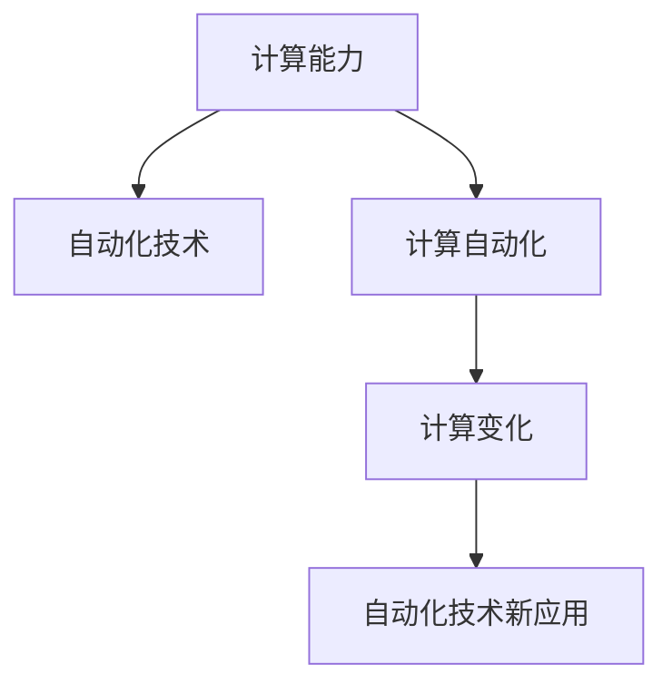

                 

## 1. 背景介绍

### 1.1 问题由来
自动化技术已经广泛应用于制造业、服务业、交通、能源等众多领域。然而，随着计算机计算能力的提升，计算问题日益变得复杂，传统的自动化技术已难以胜任许多复杂的计算任务。计算变化给自动化带来了新的机遇和挑战。

### 1.2 问题核心关键点
计算变化主要体现在计算资源的丰富、计算能力的提升、计算复杂度的增加等方面。这对传统自动化技术提出了更高的要求。传统自动化技术需要与时俱进，引入计算元素，进行计算变化，才能适应新需求。

## 2. 核心概念与联系

### 2.1 核心概念概述

为更好地理解计算变化对自动化技术的影响，本节将介绍几个密切相关的核心概念：

- 计算能力(Computational Power)：指计算机硬件或软件能够执行计算任务的速度和准确性。
- 自动化(Automation)：指利用各种工具、技术、方法，使机器或系统能够自动执行某些任务或操作。
- 自动化技术(Automation Technology)：包括机器人、工业控制、计算机视觉、机器学习、物联网等技术。
- 计算自动化(Computational Automation)：利用计算能力自动执行任务或操作，是传统自动化技术与计算技术相结合的产物。
- 计算变化(Computational Change)：指随着计算能力的提升，自动化技术中计算元素的作用和地位发生改变，推动自动化技术发展。

这些概念之间的逻辑关系可以通过以下Mermaid流程图来展示：



这个流程图展示了这个概念体系的关键组成部分及其相互关系：

1. 计算能力提升，使自动化技术得以升级为计算自动化。
2. 计算自动化引入计算元素，使自动化技术获得新的动力和方向。
3. 计算变化推动了自动化技术的发展，催生了新的应用。

## 3. 核心算法原理 & 具体操作步骤
### 3.1 算法原理概述

计算变化对自动化技术的影响，主要体现在以下几个方面：

1. **计算能力提升**：计算能力的提升，使得自动化系统可以处理更大规模、更复杂的数据集。如工业自动化中的实时数据处理，物联网中的海量数据存储与分析，机器学习中的大数据训练等。

2. **计算自动化**：计算自动化使机器可以自主进行决策和执行，如自动驾驶、工业机器人、智能制造等。

3. **新应用出现**：计算变化推动了新的自动化应用出现，如云计算、大数据、人工智能、自然语言处理等。

### 3.2 算法步骤详解

基于计算变化对自动化技术的影响，以下是一些关键的算法步骤：

**Step 1: 收集与分析数据**
- 收集与自动化任务相关的数据，包括数据源、数据量、数据类型等。
- 分析数据特性，如数据维度、数据质量、数据相关性等，为后续计算自动化提供数据基础。

**Step 2: 设计计算自动化流程**
- 根据任务需求，设计自动化流程，如决策流程、执行流程等。
- 确定计算元素，如传感器、计算设备、通信网络等，设计其部署与集成方案。

**Step 3: 开发计算自动化模型**
- 选择适合的算法和模型，如机器学习、深度学习、强化学习等，设计计算自动化模型。
- 确定模型的输入、输出、训练方式等。

**Step 4: 集成与优化计算自动化系统**
- 将计算自动化模型与自动化系统集成，如工业控制、智能制造等。
- 进行系统测试与优化，确保系统的稳定性和可靠性。

**Step 5: 部署与运维**
- 将计算自动化系统部署到实际应用环境中。
- 进行运维与监控，确保系统长期稳定运行。

### 3.3 算法优缺点

计算变化对自动化技术的影响，主要体现在以下几个方面：

**优点**：

1. **处理复杂数据**：计算能力提升，使自动化系统可以处理更大规模、更复杂的数据集。
2. **提高决策效率**：计算自动化使机器能够自主进行决策，缩短任务执行时间。
3. **促进技术创新**：计算变化推动了新技术的应用，如云计算、大数据、人工智能等。

**缺点**：

1. **数据质量要求高**：计算自动化依赖高质量的数据，数据质量直接影响自动化效果。
2. **计算资源消耗大**：计算自动化需要大量计算资源，硬件和软件投入较大。
3. **系统复杂性增加**：计算自动化系统设计复杂，部署和运维成本高。

### 3.4 算法应用领域

计算变化对自动化技术的影响，已经广泛应用于多个领域：

- **工业自动化**：计算自动化在工业制造、能源、交通等行业中的应用，如自动化生产线、智能制造等。
- **智慧城市**：云计算、大数据、人工智能等技术，推动了智慧城市建设，如智能交通、智慧医疗等。
- **机器人与无人机**：计算自动化使机器人与无人机具备更强的自主决策能力，如自动化导航、自动化控制等。
- **智能家居**：利用计算自动化技术，实现智能家居设备间的互联互通，如智能温控、智能安防等。

这些应用领域展示了计算变化对自动化技术的深远影响，推动了各行业的发展和变革。

## 4. 数学模型和公式 & 详细讲解 & 举例说明（备注：数学公式请使用latex格式，latex嵌入文中独立段落使用 $$，段落内使用 $)
### 4.1 数学模型构建

计算变化对自动化技术的影响，可以通过数学模型来进一步分析和描述。

**模型1: 计算能力提升模型**

假设计算能力为 $P$，其提升量为 $dP$。自动化系统的处理能力 $C$ 与计算能力 $P$ 成正比，即 $C = kP$，其中 $k$ 为比例系数。

**模型2: 计算自动化效率模型**

设自动化系统的原始效率为 $E_0$，引入计算自动化后，系统效率提升为 $E$，其提升量 $\Delta E = E - E_0$。

### 4.2 公式推导过程

**计算能力提升公式**

$$
P = P_0 + dP
$$

**自动化系统效率提升公式**

$$
\Delta E = \frac{E - E_0}{E_0} = \frac{C - C_0}{C_0} = \frac{kP - kP_0}{kP_0} = \frac{dP}{P_0}
$$

其中，$C_0 = kP_0$ 为原始计算能力对应的自动化系统处理能力。

### 4.3 案例分析与讲解

以工业自动化为例，分析计算能力提升对系统效率的影响。

设原始处理能力为 $C_0 = kP_0$，提升后的处理能力为 $C = k(P_0 + dP) = kP_0 + kdP$。

设原始效率为 $E_0 = 1$，提升后的效率为 $E = \frac{C}{C_0} = \frac{kP_0 + kdP}{kP_0} = 1 + \frac{kdP}{kP_0} = 1 + \frac{dP}{P_0}$。

假设 $dP = 0.1P_0$，则效率提升量为：

$$
\Delta E = \frac{dP}{P_0} = 0.1
$$

即系统效率提升了10%。

## 5. 项目实践：代码实例和详细解释说明
### 5.1 开发环境搭建

在进行计算自动化实践前，我们需要准备好开发环境。以下是使用Python进行PyTorch开发的环境配置流程：

1. 安装Anaconda：从官网下载并安装Anaconda，用于创建独立的Python环境。

2. 创建并激活虚拟环境：
```bash
conda create -n pytorch-env python=3.8 
conda activate pytorch-env
```

3. 安装PyTorch：根据CUDA版本，从官网获取对应的安装命令。例如：
```bash
conda install pytorch torchvision torchaudio cudatoolkit=11.1 -c pytorch -c conda-forge
```

4. 安装TensorFlow：
```bash
pip install tensorflow==2.9
```

5. 安装TensorBoard：
```bash
pip install tensorboard
```

完成上述步骤后，即可在`pytorch-env`环境中开始计算自动化实践。

### 5.2 源代码详细实现

这里我们以工业自动化中生产线的计算自动化为例，给出使用PyTorch和TensorFlow进行自动化的代码实现。

首先，定义计算自动化流程，如传感器数据采集、计算模型设计、执行动作等。

```python
import torch
import tensorflow as tf

class CalculationAutomation:
    def __init__(self, sensor_data, model, actuator):
        self.sensor_data = sensor_data
        self.model = model
        self.actuator = actuator
        
    def forward(self, sensor_data):
        output = self.model(sensor_data)
        actuator_input = output.numpy()
        self.actuator(actuator_input)
```

然后，定义计算模型，如使用TensorFlow进行计算。

```python
class CalculationModel(tf.keras.Model):
    def __init__(self, input_size, output_size):
        super().__init__()
        self.flatten = tf.keras.layers.Flatten()
        self.dense1 = tf.keras.layers.Dense(128, activation='relu')
        self.dense2 = tf.keras.layers.Dense(output_size)
        
    def call(self, inputs):
        x = self.flatten(inputs)
        x = self.dense1(x)
        x = self.dense2(x)
        return x
```

接着，定义执行动作，如使用PyTorch进行计算。

```python
class CalculationActuator(torch.nn.Module):
    def __init__(self, input_size):
        super().__init__()
        self.flatten = torch.nn.Flatten()
        self.dense1 = torch.nn.Linear(input_size, 128)
        self.dense2 = torch.nn.Linear(128, 1)
        self.sigmoid = torch.nn.Sigmoid()
        
    def forward(self, inputs):
        x = self.flatten(inputs)
        x = self.dense1(x)
        x = self.sigmoid(self.dense2(x))
        return x
```

最后，启动计算自动化流程，将传感器数据输入模型，输出结果控制执行器。

```python
# 定义传感器数据
sensor_data = tf.random.normal(shape=(10, 4))

# 定义模型和执行器
model = CalculationModel(input_size=4, output_size=1)
actuator = CalculationActuator(input_size=1)

# 创建计算自动化系统
automation = CalculationAutomation(sensor_data, model, actuator)

# 运行自动化系统
automation.forward(sensor_data)
```

以上就是使用PyTorch和TensorFlow进行工业自动化系统计算自动化的完整代码实现。可以看到，通过利用这两个深度学习框架，可以方便地构建和实现计算自动化系统。

### 5.3 代码解读与分析

让我们再详细解读一下关键代码的实现细节：

**CalculationAutomation类**：
- `__init__`方法：初始化传感器数据、计算模型和执行器。
- `forward`方法：将传感器数据输入计算模型，输出结果控制执行器动作。

**CalculationModel类**：
- `__init__`方法：定义模型的层结构，包括Flatten层、Dense层等。
- `call`方法：定义模型的前向传播过程。

**CalculationActuator类**：
- `__init__`方法：定义执行器的层结构，包括Flatten层、Dense层等。
- `forward`方法：定义执行器的前向传播过程，使用Sigmoid激活函数输出执行结果。

**运行自动化系统**：
- 定义传感器数据，创建计算模型和执行器。
- 创建计算自动化系统。
- 调用自动化系统的`forward`方法，完成计算自动化流程。

可以看到，通过合理利用深度学习框架，可以简洁高效地实现计算自动化系统。开发者可以将更多精力放在系统设计和优化上，而不必过多关注底层实现细节。

当然，工业级的系统实现还需考虑更多因素，如传感器数据采集、模型训练、执行器控制等。但核心的计算自动化范式基本与此类似。

## 6. 实际应用场景
### 6.1 智能制造

计算自动化在智能制造中的应用，极大地提升了生产效率和制造质量。例如，通过引入计算自动化技术，可以实现自动化装配、质量检测、故障预测等。

在技术实现上，可以采集生产过程中的传感器数据，如温度、压力、振动等，使用计算模型分析处理数据，预测设备状态或识别故障，并控制执行器进行相应的操作。

### 6.2 智慧交通

智慧交通中的计算自动化，使交通系统具备更高的安全性和效率。例如，自动驾驶汽车通过传感器数据实时感知周围环境，使用计算模型进行路径规划和决策，最终通过执行器控制车辆行驶。

在技术实现上，可以安装各种传感器，如摄像头、雷达、激光雷达等，采集车辆周围环境数据。使用计算模型，如图像处理、目标检测等，对数据进行处理，并输出决策信息。最后，通过执行器控制车辆转向、加速、制动等动作。

### 6.3 医疗诊断

计算自动化在医疗诊断中的应用，提高了诊断效率和准确性。例如，通过引入计算自动化技术，可以实现自动化影像诊断、智能诊断助手等。

在技术实现上，可以采集医学影像数据，如CT、MRI等，使用计算模型进行图像处理和分析，提取特征，并输出诊断结果。最后，通过执行器将诊断结果输出给医生，辅助诊断决策。

### 6.4 未来应用展望

随着计算能力的提升和计算自动化技术的不断发展，未来计算变化将带来更多机遇和挑战。

**机遇**：

1. **提升系统效率**：计算自动化使系统能够自主进行决策和执行，提升了系统效率和准确性。
2. **降低成本**：计算自动化能够处理大规模数据和复杂任务，降低了人工成本和生产成本。
3. **推动技术创新**：计算变化推动了新技术的应用，如物联网、大数据、人工智能等。

**挑战**：

1. **数据质量要求高**：计算自动化依赖高质量的数据，数据质量直接影响自动化效果。
2. **计算资源消耗大**：计算自动化需要大量计算资源，硬件和软件投入较大。
3. **系统复杂性增加**：计算自动化系统设计复杂，部署和运维成本高。

## 7. 工具和资源推荐
### 7.1 学习资源推荐

为了帮助开发者系统掌握计算变化对自动化技术的影响，这里推荐一些优质的学习资源：

1. 《深度学习理论与实践》系列博文：由大模型技术专家撰写，深入浅出地介绍了深度学习原理、计算自动化方法等前沿话题。

2. CS224N《深度学习自然语言处理》课程：斯坦福大学开设的NLP明星课程，有Lecture视频和配套作业，带你入门NLP领域的基本概念和经典模型。

3. 《机器学习实战》书籍：介绍了机器学习的基本原理和实际应用，是学习计算自动化技术的入门必读书籍。

4. 《自动驾驶》课程：由MIT等知名大学开设，介绍了自动驾驶技术的原理和实践，涵盖了感知、决策、控制等核心环节。

5. 《自然语言处理中的深度学习》书籍：详细介绍了NLP领域中的深度学习算法和应用，包括计算自动化技术。

通过对这些资源的学习实践，相信你一定能够快速掌握计算变化对自动化技术的影响，并用于解决实际的计算自动化问题。
###  7.2 开发工具推荐

高效的开发离不开优秀的工具支持。以下是几款用于计算自动化开发的常用工具：

1. PyTorch：基于Python的开源深度学习框架，灵活动态的计算图，适合快速迭代研究。

2. TensorFlow：由Google主导开发的开源深度学习框架，生产部署方便，适合大规模工程应用。

3. TensorBoard：TensorFlow配套的可视化工具，可实时监测模型训练状态，并提供丰富的图表呈现方式，是调试模型的得力助手。

4. HuggingFace Transformers库：提供了丰富的预训练模型和完整的微调样例代码，是进行计算自动化任务开发的利器。

5. Weights & Biases：模型训练的实验跟踪工具，可以记录和可视化模型训练过程中的各项指标，方便对比和调优。

6. Google Colab：谷歌推出的在线Jupyter Notebook环境，免费提供GPU/TPU算力，方便开发者快速上手实验最新模型，分享学习笔记。

合理利用这些工具，可以显著提升计算自动化任务的开发效率，加快创新迭代的步伐。

### 7.3 相关论文推荐

计算变化对自动化技术的影响，是当前研究的热点话题。以下是几篇奠基性的相关论文，推荐阅读：

1. "Deep Reinforcement Learning for Decision-Making in Manufacturing"：提出了基于深度强化学习的工业自动化决策方法，展示了计算自动化在工业自动化中的重要应用。

2. "The Impact of Artificial Intelligence on Manufacturing"：讨论了人工智能技术对制造业的深远影响，包括计算自动化在制造中的作用。

3. "AI-Driven Traffic Management: An Overview"：介绍了人工智能技术在智慧交通中的应用，包括计算自动化在交通管理中的重要性。

4. "The Future of Smart Manufacturing"：探讨了智能制造的发展趋势，强调了计算自动化在智能制造中的关键作用。

5. "A Survey on AI-Driven Healthcare Diagnosis"：总结了人工智能技术在医疗诊断中的应用，包括计算自动化在医疗诊断中的作用。

这些论文代表了大语言模型微调技术的发展脉络。通过学习这些前沿成果，可以帮助研究者把握学科前进方向，激发更多的创新灵感。

## 8. 总结：未来发展趋势与挑战
### 8.1 总结

本文对计算变化对自动化技术的影响进行了全面系统的介绍。首先阐述了计算变化的背景和意义，明确了计算自动化技术的发展方向。其次，从原理到实践，详细讲解了计算自动化算法的核心步骤，给出了计算自动化任务开发的完整代码实例。同时，本文还广泛探讨了计算自动化技术在工业自动化、智慧交通、医疗诊断等多个行业领域的应用前景，展示了计算自动化技术的巨大潜力。此外，本文精选了计算自动化技术的各类学习资源，力求为读者提供全方位的技术指引。

通过本文的系统梳理，可以看到，计算变化对自动化技术带来了巨大的影响，推动了各行业的发展和变革。未来，伴随计算能力的进一步提升，计算自动化技术将迎来更多机遇和挑战。

### 8.2 未来发展趋势

展望未来，计算变化对自动化技术的影响将呈现以下几个发展趋势：

1. **智能制造**：计算自动化在智能制造中的应用将更加广泛，推动制造业向智能化、柔性化、高效化方向发展。

2. **智慧交通**：自动驾驶、智能交通管理等技术，将使交通系统更加安全、高效、智能。

3. **医疗诊断**：计算自动化在医疗诊断中的应用将更加深入，提高诊断准确性和效率。

4. **智能家居**：智能家居设备通过计算自动化进行互联互通，提升用户体验。

5. **智能办公**：智能办公系统通过计算自动化提高工作效率，优化办公流程。

6. **金融科技**：金融科技中的计算自动化，推动金融服务智能化、个性化、高效化。

以上趋势凸显了计算自动化技术在各行业中的广泛应用和深远影响，推动了各行业的发展和变革。

### 8.3 面临的挑战

尽管计算自动化技术已经取得了瞩目成就，但在迈向更加智能化、普适化应用的过程中，它仍面临着诸多挑战：

1. **数据质量要求高**：计算自动化依赖高质量的数据，数据质量直接影响自动化效果。

2. **计算资源消耗大**：计算自动化需要大量计算资源，硬件和软件投入较大。

3. **系统复杂性增加**：计算自动化系统设计复杂，部署和运维成本高。

4. **伦理和安全问题**：计算自动化系统在应用过程中，可能会涉及伦理和安全问题，如数据隐私、模型偏见等。

5. **技术整合难度大**：计算自动化需要与多种技术进行整合，如传感器技术、通信技术等，技术整合难度较大。

6. **算法透明性不足**：计算自动化系统的决策过程较为复杂，难以解释和理解。

这些挑战需要技术界和产业界的共同努力，通过不断优化算法、提升数据质量、降低计算资源消耗等手段，进一步推动计算自动化技术的发展。

### 8.4 研究展望

未来研究需要在以下几个方面寻求新的突破：

1. **高效数据采集与处理**：研究高效的数据采集与处理技术，提高数据质量，降低数据处理成本。

2. **低计算成本自动化**：开发低成本的计算自动化方法，减少计算资源消耗，降低部署和运维成本。

3. **模型透明性提升**：提升计算自动化系统的透明性，使其决策过程更加可解释和可理解。

4. **伦理与安全保障**：研究计算自动化系统在伦理与安全方面的保障措施，确保其应用安全可靠。

5. **跨学科融合**：推动计算自动化技术与多学科的融合，如与物联网、大数据等技术的结合，拓展计算自动化的应用范围。

这些研究方向将进一步推动计算自动化技术的发展，提升其在各行业中的应用效果和价值。相信随着学界和产业界的共同努力，计算自动化技术将更加智能化、普适化，为各行业的数字化转型提供新的动力。

## 9. 附录：常见问题与解答
### Q1：计算自动化是否适用于所有行业？

A: 计算自动化适用于大多数行业，特别是对于大规模数据处理、复杂任务决策、高精度操作等需求较大的行业。但一些特定行业，如农业、手工艺等，可能难以直接应用计算自动化技术。

### Q2：计算自动化过程中，如何选择合适的计算模型？

A: 选择合适的计算模型需要考虑以下几个因素：

1. 数据特性：根据数据的维度、类型、质量等特点，选择适合的计算模型。

2. 任务需求：根据任务的需求和目标，选择适合的计算模型。

3. 计算资源：根据计算资源的可用性和成本，选择适合的计算模型。

4. 技术成熟度：选择成熟度较高的计算模型，降低技术风险和开发成本。

### Q3：计算自动化系统在实际部署中需要注意哪些问题？

A: 计算自动化系统在实际部署中需要注意以下几个问题：

1. 系统集成：确保计算自动化系统与其他系统的无缝集成。

2. 数据采集：确保传感器数据的质量和采集的准确性。

3. 模型训练：确保计算模型在实际环境中的训练效果。

4. 执行器控制：确保执行器能够准确执行计算自动化系统的决策结果。

5. 系统运维：确保系统长期稳定运行，及时处理异常和故障。

6. 安全性：确保系统在运行过程中的安全性，避免数据泄露和系统攻击。

通过合理应对这些问题，可以有效提升计算自动化系统的部署和运维效果，确保其在实际应用中的稳定性和可靠性。

---

作者：禅与计算机程序设计艺术 / Zen and the Art of Computer Programming

