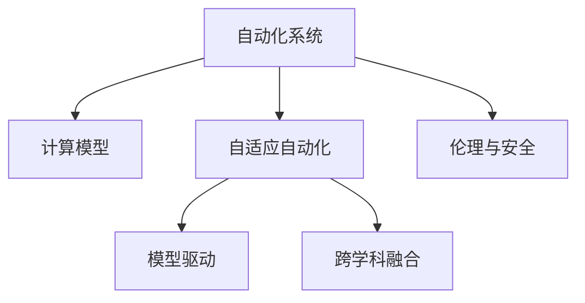

                 

# 计算变化对自动化领域的影响

## 1. 背景介绍

### 1.1 问题由来
随着计算技术的飞速发展，自动化领域正经历着一场深刻的变革。传统上依赖规则与预编程的自动化系统，正逐渐被基于计算模型的自适应和智能自动化系统所取代。这种变化不仅带来了自动化效率的大幅提升，也带来了对计算模型本身的深刻影响。

### 1.2 问题核心关键点
当前，计算变化对自动化领域的影响主要集中在以下几个方面：

1. **模型驱动的自动化**：自动化的本质在于从复杂任务中抽离出核心逻辑，由计算模型自动执行。随着计算模型的复杂度不断提升，模型的自动化能力也随之增强。

2. **自适应自动化**：基于模型驱动的自动化系统，通过持续的计算与学习，能够自适应环境变化，适应不同任务需求，显著提升自动化系统的灵活性与智能性。

3. **跨学科融合**：计算变化不仅促进了自动化与信息科学、控制理论、数据科学的深度融合，也推动了自动化技术在更多领域中的应用，如医疗、交通、制造等。

4. **新范式探索**：新兴的计算模型如神经网络、优化算法、强化学习等，为自动化领域带来了新的范式与方法，推动了自动化技术的前沿发展。

5. **伦理与安全性**：计算模型的自适应与智能特性，带来了新的伦理与安全挑战，如模型的可解释性、决策公平性、安全性等，需要进一步探索。

### 1.3 问题研究意义
研究计算变化对自动化领域的影响，对于理解自动化技术的发展趋势，提升自动化系统的性能与安全性，具有重要意义：

1. **理解自动化演变**：通过分析计算变化对自动化系统的影响，可以深入理解自动化技术的发展路径与未来方向。
2. **优化自动化模型**：基于对计算变化的理解，可以优化自动化模型的设计，提高系统的灵活性、智能性与可解释性。
3. **推动技术创新**：计算变化带来的新技术范式，如深度学习、强化学习等，可以推动自动化领域的创新发展，推动技术的持续进步。
4. **提升应用价值**：深入了解计算变化带来的影响，可以更好地应用自动化技术，提升各行业的信息化水平，促进社会生产力的提升。
5. **应对伦理挑战**：计算模型带来的自动化系统，需要新的伦理与安全监管机制，确保技术的公正性与安全性。

## 2. 核心概念与联系

### 2.1 核心概念概述

为更好地理解计算变化对自动化领域的影响，本节将介绍几个密切相关的核心概念：

- **自动化系统**：使用计算模型自动执行任务的智能系统，涵盖从简单的脚本到复杂的决策系统。
- **计算模型**：用于自动化任务求解的数学模型，如神经网络、优化算法、强化学习等。
- **自适应自动化**：自动化系统通过持续的计算与学习，自适应环境变化，适应不同任务需求的能力。
- **模型驱动**：将任务抽象为计算模型，通过模型的自动执行来实现自动化。
- **跨学科融合**：自动化技术与其他学科技术的深度融合，推动新技术范式在自动化领域的应用。

这些核心概念之间的逻辑关系可以通过以下Mermaid流程图来展示：



这个流程图展示了几大核心概念之间的联系：

1. 自动化系统依赖于计算模型，执行自动化的核心任务。
2. 自适应自动化和模型驱动是自动化系统实现的两大核心能力。
3. 跨学科融合带来新的计算模型与方法，提升自动化系统的能力。
4. 伦理与安全是自动化系统的另一核心关注点，确保系统的公正性与安全性。

## 3. 核心算法原理 & 具体操作步骤
### 3.1 算法原理概述

计算变化对自动化领域的影响，主要体现在以下几个方面：

- **模型驱动的自动化**：将自动化任务抽象为计算模型，通过模型自动求解实现自动化执行。
- **自适应自动化**：基于计算模型的自动化系统，通过持续的计算与学习，自适应环境变化，适应不同任务需求。
- **跨学科融合**：将新的计算模型与方法引入自动化领域，推动自动化技术的创新发展。
- **伦理与安全**：确保自动化系统决策的公正性、可解释性、安全性，避免潜在的风险。

### 3.2 算法步骤详解

计算变化对自动化领域的影响，主要通过以下几个步骤来实现：

**Step 1: 问题抽象为计算模型**
- 确定自动化任务的具体需求与目标。
- 将任务抽象为计算模型，如神经网络、优化算法、强化学习等。
- 设计模型架构与参数，选择合适的计算模型。

**Step 2: 模型训练与优化**
- 收集自动化任务的相关数据，训练计算模型。
- 调整模型参数，优化模型性能，提升自动化能力。
- 应用正则化、对抗训练等技术，提高模型的鲁棒性与安全性。

**Step 3: 模型部署与自适应**
- 将训练好的模型部署到自动化系统中。
- 在实际应用中，持续监控系统表现，调整模型参数。
- 通过反馈机制，让模型自适应环境变化，提升自动化能力。

**Step 4: 跨学科融合**
- 引入其他学科的技术与方法，提升自动化系统的能力。
- 通过多学科融合，实现更为复杂的自动化任务。
- 建立跨学科的合作机制，推动自动化技术的发展。

**Step 5: 伦理与安全**
- 设计伦理与安全评估指标，确保系统的公正性与安全性。
- 建立监督与审查机制，定期评估系统的表现。
- 应对新兴的安全威胁，如模型偏见、对抗样本等。

### 3.3 算法优缺点

计算变化对自动化领域的影响，具有以下优点：

1. **提升自动化效率**：通过计算模型自动化任务的求解，显著提升自动化系统的效率与准确性。
2. **自适应能力**：模型驱动的自动化系统，能够自适应环境变化，适应不同任务需求，增强系统的灵活性与智能性。
3. **推动技术创新**：跨学科融合带来的新技术范式，为自动化领域带来新的突破。
4. **提升应用价值**：自动化技术在各领域的应用，提高生产效率，降低成本，推动社会经济发展。
5. **应对伦理挑战**：通过伦理与安全机制的设计，确保自动化系统的公正性与安全性。

同时，计算变化带来的影响也存在一些局限性：

1. **高计算成本**：计算模型需要大量的计算资源进行训练与优化，对硬件设备要求较高。
2. **模型复杂性**：复杂模型增加了系统的复杂度，降低了系统的可解释性。
3. **数据依赖**：模型的性能依赖于训练数据的质量与数量，数据获取与标注成本较高。
4. **安全风险**：模型的自适应与智能特性，带来了新的安全风险，如对抗样本攻击等。
5. **伦理挑战**：计算模型的决策过程需要新的伦理监管机制，确保系统的公正性与安全性。

尽管存在这些局限性，但计算变化对自动化领域的影响总体上是积极的，推动了自动化技术的持续进步与创新发展。

### 3.4 算法应用领域

计算变化对自动化领域的影响，已经广泛应用于多个领域，例如：

- **制造业自动化**：通过计算模型优化生产调度、质量控制、供应链管理等。
- **医疗自动化**：使用计算模型辅助诊断、药物研发、个性化治疗等。
- **交通自动化**：应用计算模型实现交通流优化、自动驾驶、智能调度等。
- **金融自动化**：使用计算模型进行风险管理、信用评估、智能投顾等。
- **能源自动化**：通过计算模型优化能源分配、智能电网、环境监测等。

除了上述这些经典领域，计算变化对自动化领域的影响还在不断扩展，为更多行业带来变革性影响。

## 4. 数学模型和公式 & 详细讲解 & 举例说明

### 4.1 数学模型构建

本节将使用数学语言对计算变化对自动化领域的影响进行更加严格的刻画。

假设自动化任务为 $T$，计算模型为 $M$，训练数据为 $D$。将自动化任务抽象为计算模型的优化问题，即求解：

$$
\min_{M} \mathcal{L}(M; D)
$$

其中 $\mathcal{L}$ 为损失函数，用于衡量模型 $M$ 在数据集 $D$ 上的表现。

### 4.2 公式推导过程

以神经网络为例，计算模型 $M$ 的损失函数可以表示为：

$$
\mathcal{L}(M; D) = \frac{1}{N}\sum_{i=1}^N \ell(M(x_i), y_i)
$$

其中 $x_i$ 为输入，$y_i$ 为标签，$\ell$ 为损失函数，如均方误差损失、交叉熵损失等。

神经网络中的损失函数 $\ell$ 通常表示为：

$$
\ell(M(x_i), y_i) = \frac{1}{2}||M(x_i) - y_i||^2
$$

神经网络的训练过程可以通过梯度下降等优化算法进行求解。常用的优化算法如AdamW、SGD等，可以通过以下公式更新模型参数：

$$
\theta \leftarrow \theta - \eta \nabla_{\theta}\mathcal{L}(\theta) - \eta\lambda\theta
$$

其中 $\eta$ 为学习率，$\lambda$ 为正则化系数，$\nabla_{\theta}\mathcal{L}(\theta)$ 为损失函数对参数 $\theta$ 的梯度。

### 4.3 案例分析与讲解

以智能交通系统为例，计算变化对其自动化水平的影响：

**Step 1: 问题抽象为计算模型**
- 自动化任务：交通流量优化
- 设计神经网络模型，包括输入层、隐藏层、输出层等。

**Step 2: 模型训练与优化**
- 收集交通流量数据，训练神经网络模型。
- 调整模型参数，优化模型性能，提升流量预测准确性。
- 应用正则化、对抗训练等技术，提高模型的鲁棒性与安全性。

**Step 3: 模型部署与自适应**
- 将训练好的神经网络模型部署到智能交通系统中。
- 在实际应用中，持续监控系统表现，调整模型参数。
- 通过反馈机制，让模型自适应环境变化，提升流量优化能力。

**Step 4: 跨学科融合**
- 引入交通流仿真与优化技术，提升模型预测能力。
- 通过多学科融合，实现更为复杂的交通流量控制。
- 建立跨学科的合作机制，推动交通自动化技术的发展。

**Step 5: 伦理与安全**
- 设计伦理与安全评估指标，确保系统的公正性与安全性。
- 建立监督与审查机制，定期评估系统的表现。
- 应对新兴的安全威胁，如对抗样本攻击等。

## 5. 项目实践：代码实例和详细解释说明

### 5.1 开发环境搭建

在进行计算变化对自动化领域的影响实践前，我们需要准备好开发环境。以下是使用Python进行TensorFlow开发的环境配置流程：

1. 安装Anaconda：从官网下载并安装Anaconda，用于创建独立的Python环境。

2. 创建并激活虚拟环境：
```bash
conda create -n tf-env python=3.8 
conda activate tf-env
```

3. 安装TensorFlow：根据CUDA版本，从官网获取对应的安装命令。例如：
```bash
pip install tensorflow-gpu
```

4. 安装TensorFlow Addons：
```bash
pip install tensorflow-addons
```

5. 安装各类工具包：
```bash
pip install numpy pandas scikit-learn matplotlib tqdm jupyter notebook ipython
```

完成上述步骤后，即可在`tf-env`环境中开始计算变化对自动化领域的影响实践。

### 5.2 源代码详细实现

下面我以智能交通系统为例，给出使用TensorFlow对神经网络模型进行训练和微调的PyTorch代码实现。

首先，定义神经网络模型：

```python
import tensorflow as tf
from tensorflow.keras import layers

def create_model(input_dim, output_dim):
    model = tf.keras.Sequential([
        layers.Dense(64, activation='relu', input_dim=input_dim),
        layers.Dense(64, activation='relu'),
        layers.Dense(output_dim, activation='sigmoid')
    ])
    return model
```

然后，定义训练和评估函数：

```python
from tensorflow.keras.datasets import mnist
from tensorflow.keras.utils import to_categorical

def train_model(model, x_train, y_train, x_test, y_test, epochs=10, batch_size=128):
    model.compile(optimizer='adam', loss='binary_crossentropy', metrics=['accuracy'])
    
    history = model.fit(x_train, y_train, validation_data=(x_test, y_test), epochs=epochs, batch_size=batch_size)
    
    test_loss, test_acc = model.evaluate(x_test, y_test, verbose=2)
    print(f'Test accuracy: {test_acc:.4f}')
    
    return history

# 加载MNIST数据集
(x_train, y_train), (x_test, y_test) = mnist.load_data()
x_train = x_train.reshape((x_train.shape[0], 28 * 28)).astype('float32') / 255.0
x_test = x_test.reshape((x_test.shape[0], 28 * 28)).astype('float32') / 255.0
y_train = to_categorical(y_train, num_classes=10)
y_test = to_categorical(y_test, num_classes=10)

# 创建神经网络模型
model = create_model(input_dim=28 * 28, output_dim=10)

# 训练模型
history = train_model(model, x_train, y_train, x_test, y_test)

# 绘制训练与验证的准确率曲线
import matplotlib.pyplot as plt

plt.plot(history.history['accuracy'], label='Accuracy')
plt.plot(history.history['val_accuracy'], label='Validation Accuracy')
plt.xlabel('Epoch')
plt.ylabel('Accuracy')
plt.legend()
plt.show()
```

以上就是使用TensorFlow进行神经网络训练的完整代码实现。可以看到，TensorFlow提供的高阶API使得神经网络模型的定义、训练与评估变得非常简洁。

### 5.3 代码解读与分析

让我们再详细解读一下关键代码的实现细节：

**神经网络模型定义**：
- `create_model`函数定义了神经网络的结构，包括输入层、隐藏层、输出层。
- 使用`Sequential`模型来定义顺序连接的网络结构。
- 每个隐藏层使用`Dense`层实现，激活函数分别为ReLU和Sigmoid。

**训练函数定义**：
- 使用`train_model`函数定义模型的训练过程。
- 使用`compile`方法设置模型的优化器、损失函数与评估指标。
- 使用`fit`方法进行模型的训练，并在验证集上评估模型性能。
- 使用`evaluate`方法在测试集上评估模型性能。

**数据预处理**：
- 使用`mnist.load_data`函数加载MNIST数据集。
- 对输入数据进行归一化处理。
- 使用`to_categorical`函数将标签转换为one-hot编码。

**训练过程**：
- 在训练函数中，使用`model.compile`方法配置模型。
- 使用`model.fit`方法训练模型，并在验证集上评估性能。
- 使用`model.evaluate`方法在测试集上评估模型性能。

## 6. 实际应用场景
### 6.1 智能交通系统

计算变化对智能交通系统的影响，体现在以下几个方面：

**流量预测**：使用神经网络模型预测交通流量，优化交通信号控制，减少拥堵。

**路径优化**：通过计算模型优化路径规划，提升运输效率，降低燃料消耗。

**事故预防**：应用计算模型分析交通行为，预防交通事故，保障行车安全。

**多模态融合**：引入图像识别、传感器数据等，提升交通系统的感知能力与智能性。

### 6.2 智能制造系统

计算变化对智能制造系统的影响，主要体现在以下几个方面：

**生产调度**：通过神经网络模型优化生产计划，提升生产效率，降低成本。

**质量检测**：使用计算模型进行产品质量检测与分类，提升产品质量，减少次品率。

**供应链管理**：应用计算模型优化供应链管理，提高物流效率，降低库存成本。

**设备维护**：通过计算模型预测设备故障，优化设备维护计划，减少停机时间。

### 6.3 医疗诊断系统

计算变化对医疗诊断系统的影响，主要体现在以下几个方面：

**影像识别**：使用卷积神经网络模型分析医学影像，辅助医生诊断疾病。

**基因分析**：通过计算模型分析基因数据，预测疾病风险，制定个性化治疗方案。

**电子病历分析**：应用计算模型分析电子病历数据，辅助医生制定治疗计划，提高诊疗效率。

**药物研发**：使用计算模型预测药物效果，加速新药开发进程，降低研发成本。

### 6.4 未来应用展望

随着计算技术的不断进步，计算变化对自动化领域的影响还将进一步扩展，带来更多创新与应用场景：

- **自动驾驶**：基于计算模型的自动驾驶技术，提升行车安全与效率。
- **智能家居**：应用计算模型优化家居设备控制，提升生活便利性。
- **金融预测**：使用计算模型预测股市趋势、信用风险等，辅助金融决策。
- **智能客服**：通过计算模型优化客户服务，提升客户满意度，降低客服成本。
- **环境保护**：应用计算模型优化能源消耗与环境监测，推动绿色可持续发展。

未来，计算变化将继续推动自动化技术的创新与发展，带来更广泛的应用前景，为人类社会带来更深远的变革。

## 7. 工具和资源推荐
### 7.1 学习资源推荐

为了帮助开发者系统掌握计算变化对自动化领域的影响，这里推荐一些优质的学习资源：

1. 《深度学习》系列书籍：由深度学习领域专家撰写，全面介绍深度学习原理与算法，是计算变化影响研究的必备读物。

2. 《TensorFlow实战》书籍：由TensorFlow社区资深成员撰写，涵盖TensorFlow的安装、配置、使用等全流程内容，是学习TensorFlow的入门书籍。

3. 《Python深度学习》在线课程：由Kaggle等平台提供，涵盖深度学习模型训练、调参、优化等内容，适合零基础学习者。

4. Coursera《深度学习专项课程》：由斯坦福大学等机构提供，涵盖深度学习基础与前沿技术，适合进阶学习者。

5. PyTorch官方文档：提供PyTorch框架的详细使用说明，包括模型定义、训练与推理等各个环节。

通过对这些资源的学习实践，相信你一定能够深入理解计算变化对自动化领域的影响，并应用于实际工作中。

### 7.2 开发工具推荐

高效的开发离不开优秀的工具支持。以下是几款用于计算变化对自动化领域的影响开发的常用工具：

1. TensorFlow：由Google主导开发的开源深度学习框架，生产部署方便，适合大规模工程应用。

2. PyTorch：基于Python的开源深度学习框架，灵活动态的计算图，适合快速迭代研究。

3. TensorBoard：TensorFlow配套的可视化工具，可实时监测模型训练状态，提供丰富的图表呈现方式。

4. Weights & Biases：模型训练的实验跟踪工具，记录和可视化模型训练过程中的各项指标，方便对比和调优。

5. Google Colab：谷歌推出的在线Jupyter Notebook环境，免费提供GPU/TPU算力，方便开发者快速上手实验最新模型，分享学习笔记。

合理利用这些工具，可以显著提升计算变化对自动化领域的影响开发的效率，加快创新迭代的步伐。

### 7.3 相关论文推荐

计算变化对自动化领域的影响涉及众多研究领域，以下是几篇奠基性的相关论文，推荐阅读：

1. Deep Learning（深度学习）：Hinton等撰写，全面介绍深度学习原理与算法，推动了深度学习在各个领域的应用。

2. TensorFlow White Paper：Google发布，详细介绍TensorFlow框架的设计理念、应用场景等，是了解TensorFlow的必备资料。

3. AlphaGo论文：DeepMind团队撰写，介绍深度强化学习在围棋中的应用，展示了计算模型在复杂任务中的强大能力。

4. ImageNet Classification with Deep Convolutional Neural Networks：Krizhevsky等撰写，介绍卷积神经网络在图像识别中的应用，推动了计算机视觉领域的发展。

5. Reinforcement Learning: An Introduction（强化学习）：Sutton等撰写，全面介绍强化学习原理与算法，是了解强化学习的经典教材。

这些论文代表了大计算变化对自动化领域影响的发展脉络。通过学习这些前沿成果，可以帮助研究者把握学科前进方向，激发更多的创新灵感。

## 8. 总结：未来发展趋势与挑战

### 8.1 总结

本文对计算变化对自动化领域的影响进行了全面系统的介绍。首先阐述了计算变化在自动化技术中的作用，明确了其对自动化系统能力提升的重要性。其次，从原理到实践，详细讲解了计算变化对自动化领域影响的数学原理和关键步骤，给出了计算变化对自动化领域影响的完整代码实例。同时，本文还广泛探讨了计算变化对自动化领域的影响在智能交通、智能制造、医疗诊断等多个行业领域的应用前景，展示了计算变化对自动化领域影响的广阔前景。

通过本文的系统梳理，可以看到，计算变化对自动化领域的影响正在逐步渗透到更多行业，为各行业带来智能化变革。未来，随着计算技术的不断发展，计算变化对自动化领域的影响将进一步深化，推动自动化技术的不断进步与创新发展。

### 8.2 未来发展趋势

展望未来，计算变化对自动化领域的影响将呈现以下几个发展趋势：

1. **模型驱动的自动化**：未来自动化系统将更加依赖于计算模型，实现更高效的自动化执行。

2. **自适应能力**：自适应自动化系统将通过持续的计算与学习，进一步提升对环境变化的适应能力，实现更智能的自动化执行。

3. **跨学科融合**：计算变化将推动更多学科技术的融合，提升自动化系统的能力。

4. **计算高效**：计算变化将推动计算模型更加高效，提升自动化系统的实时性和稳定性。

5. **伦理与安全**：未来自动化系统的设计与应用，将更多考虑伦理与安全问题，确保系统的公正性与安全性。

### 8.3 面临的挑战

尽管计算变化对自动化领域的影响带来了诸多便利，但在其实现与应用过程中，仍面临以下挑战：

1. **高计算成本**：复杂计算模型的训练与优化，需要大量计算资源，带来高昂的硬件成本。

2. **模型复杂性**：复杂模型增加了系统的复杂度，降低了系统的可解释性。

3. **数据依赖**：模型的性能依赖于训练数据的质量与数量，数据获取与标注成本较高。

4. **安全风险**：计算模型的自适应与智能特性，带来了新的安全风险，如对抗样本攻击等。

5. **伦理挑战**：计算模型的决策过程需要新的伦理监管机制，确保系统的公正性与安全性。

尽管存在这些挑战，但随着技术的不断发展与完善，计算变化对自动化领域的影响必将继续深入各行各业，推动社会生产力的提升。

### 8.4 研究展望

面对计算变化对自动化领域的影响所面临的挑战，未来的研究需要在以下几个方面寻求新的突破：

1. **计算模型优化**：开发更加高效、可解释的计算模型，降低计算成本，提高模型性能。

2. **跨学科融合**：推动更多学科技术的融合，提升自动化系统的能力，拓展应用场景。

3. **伦理与安全**：设计新的伦理与安全监管机制，确保自动化系统的公正性与安全性。

4. **计算高效**：优化计算模型与算法，提升自动化系统的实时性和稳定性，降低计算成本。

这些研究方向的探索，必将引领计算变化对自动化领域的影响走向更加成熟与完善，为各行业带来更深远的变革。面向未来，计算变化对自动化领域的影响需要与人工智能技术、物联网技术等进行更深入的融合，共同推动社会生产的进步与发展。

## 9. 附录：常见问题与解答

**Q1：计算变化对自动化领域的影响是否适用于所有行业？**

A: 计算变化对自动化领域的影响适用于大多数行业，特别是那些需要处理大量复杂数据与逻辑决策的领域。但对于一些特定领域，如生物化学、天文学等，由于数据规模较小或领域知识较为复杂，可能需要结合领域知识进行定制化设计。

**Q2：如何选择适合的计算模型进行自动化任务求解？**

A: 选择适合的计算模型，需要考虑以下几个因素：
1. 任务的复杂度：复杂任务需要更复杂的模型，如神经网络、深度学习等。
2. 数据规模：大数据集适合使用复杂的模型，小数据集适合使用简单的模型。
3. 可解释性：需要模型输出具有较高可解释性的任务，如文本分类、图像识别等。
4. 实时性：需要模型能够快速响应的任务，如实时控制系统、智能客服等。

**Q3：计算模型训练需要哪些资源？**

A: 计算模型训练需要高性能的计算资源，包括GPU/TPU等高性能设备，以及充足的计算时间和存储空间。具体需求取决于模型规模与训练数据量，可以通过以下几个步骤进行评估：
1. 估算模型参数数量与计算复杂度。
2. 选择合适的设备配置，如GPU型号与数量。
3. 根据模型大小，选择合适的存储方案，如SSD、分布式存储等。

**Q4：如何应对计算变化对自动化领域的影响带来的挑战？**

A: 应对计算变化对自动化领域的影响带来的挑战，需要从以下几个方面进行优化：
1. 提升计算效率：采用模型压缩、混合精度训练等技术，降低计算成本。
2. 优化模型结构：引入计算高效的方法，如深度可分离卷积、剪枝等，降低模型复杂度。
3. 设计伦理与安全机制：建立伦理与安全评估指标，确保系统的公正性与安全性。
4. 跨学科融合：引入其他学科的技术与方法，提升自动化系统的能力，拓展应用场景。

这些策略往往需要根据具体任务和数据特点进行灵活组合。只有在数据、模型、训练、推理等各环节进行全面优化，才能最大限度地发挥计算变化对自动化领域的影响的威力。

**Q5：未来计算变化对自动化领域的影响将如何发展？**

A: 未来计算变化对自动化领域的影响将更加广泛与深入，主要体现在以下几个方面：
1. **深度学习**：深度学习模型的应用将更加广泛，涵盖更多行业与任务。
2. **多模态融合**：多模态信息的融合，提升自动化系统的感知能力与智能性。
3. **边缘计算**：边缘计算的普及，将推动自动化系统在智能设备与物联网中的部署。
4. **联邦学习**：联邦学习的应用，将提升自动化系统的数据隐私与安全。
5. **自动化系统的自适应**：自动化系统将更加智能，能够自适应环境变化，提升系统的灵活性与稳定性。

这些趋势凸显了计算变化对自动化领域影响的巨大潜力和广泛前景，值得我们深入探索与研究。

---

作者：禅与计算机程序设计艺术 / Zen and the Art of Computer Programming

