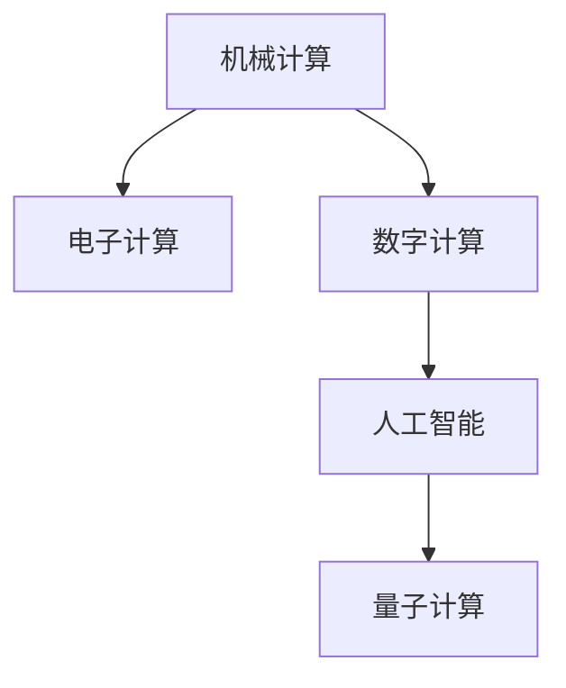

                 

# 计算技术的发展历史的四个阶段

## 1. 背景介绍

在现代信息技术的浪潮中，计算技术的演进从未停歇。从古老的机械计算到智能化的数字时代，计算技术经历了多个阶段，每个阶段都以其独特的技术特点和应用场景，对社会发展产生了深远影响。本文将对计算技术的发展历史进行详细梳理，回顾其中的关键技术进展，并展望未来的发展方向。

## 2. 核心概念与联系

### 2.1 核心概念概述

为更好地理解计算技术的发展脉络，本节将介绍几个关键的概念：

- 计算技术(Computing Technology)：通过自动化处理信息，以提升人类工作效率和决策质量的科学技术。

- 机械计算(Mechanical Computing)：早期计算技术，主要依赖于机械装置进行简单算术运算。

- 电子计算(Electronic Computing)：利用电子元件（如晶体管、集成电路）进行复杂逻辑运算的计算方式。

- 数字计算(Digital Computing)：基于二进制逻辑的计算方式，是现代计算机的核心。

- 人工智能(Artificial Intelligence, AI)：通过计算机模拟人类智能行为的技术领域，包括机器学习、自然语言处理、计算机视觉等。

- 量子计算(Quantum Computing)：基于量子力学的计算方式，利用量子叠加和纠缠等现象进行超高效的计算。

这些概念之间的逻辑关系可以通过以下Mermaid流程图来展示：



这个流程图展示了计算技术的发展脉络：

1. 机械计算为计算机的诞生奠定了基础。
2. 电子计算引入了复杂的逻辑运算能力。
3. 数字计算建立了现代计算机的计算模型。
4. 人工智能拓展了计算机的应用范围，形成了新的技术领域。
5. 量子计算探索了计算技术的极限，展示了未来发展的新方向。

## 3. 核心算法原理 & 具体操作步骤
### 3.1 算法原理概述

计算技术的发展经历了多个阶段，每个阶段都有其独特的算法原理。以下是计算技术发展的四个阶段及其核心算法原理：

### 3.2 算法步骤详解

#### 3.2.1 机械计算的算法

机械计算主要依赖于机械装置进行算术运算，其算法步骤相对简单：

1. **输入数据**：将数据输入到机械计算器，如加法器、乘法器等。
2. **机械运算**：机械装置（如齿轮、杠杆）进行算术运算。
3. **输出结果**：将运算结果输出到显示装置，如钟表、计算机器等。

#### 3.2.2 电子计算的算法

电子计算引入了复杂的逻辑运算能力，其算法步骤更加复杂：

1. **逻辑门设计**：设计逻辑门电路（如与门、非门）进行逻辑运算。
2. **存储数据**：使用电子元件（如晶体管、集成电路）存储数据。
3. **执行计算**：根据算法逻辑进行数据处理和运算。
4. **输出结果**：将运算结果输出到显示装置或存储设备。

#### 3.2.3 数字计算的算法

数字计算基于二进制逻辑的计算方式，其算法步骤包括：

1. **数据编码**：将数据编码为二进制数，如0和1。
2. **算术运算**：利用加、减、乘、除等算术运算指令进行数据处理。
3. **逻辑运算**：利用与、或、非等逻辑运算指令进行条件判断。
4. **存储和读取数据**：使用存储器（如RAM、硬盘）存储和读取数据。
5. **执行算法**：根据算法逻辑进行数据处理和运算。
6. **输出结果**：将运算结果输出到显示装置或存储设备。

#### 3.2.4 人工智能的算法

人工智能利用计算机模拟人类智能行为，其算法步骤包括：

1. **数据采集**：通过传感器或输入设备收集数据。
2. **数据预处理**：清洗、归一化、特征提取等预处理步骤。
3. **模型训练**：使用机器学习算法（如神经网络、决策树）进行模型训练。
4. **推理和预测**：使用训练好的模型进行推理和预测。
5. **结果反馈**：根据预测结果进行反馈调整，不断优化模型。

#### 3.2.5 量子计算的算法

量子计算基于量子力学的计算方式，其算法步骤包括：

1. **量子比特设计**：设计量子比特进行量子信息编码。
2. **量子门操作**：利用量子门进行量子比特的逻辑运算和信息处理。
3. **量子纠缠**：利用量子纠缠现象进行量子信息传递和运算。
4. **量子态测量**：通过量子态测量得到计算结果。

### 3.3 算法优缺点

#### 3.3.1 机械计算的优缺点

**优点**：
- 结构简单，易于制造。
- 适用于简单的算术运算。

**缺点**：
- 运算速度慢，只能进行基本的算术运算。
- 精度有限，难以处理复杂的计算任务。

#### 3.3.2 电子计算的优缺点

**优点**：
- 运算速度快，逻辑运算能力强。
- 存储容量大，支持复杂计算任务。

**缺点**：
- 电路设计复杂，制造成本高。
- 功耗大，难以实现便携式设备。

#### 3.3.3 数字计算的优缺点

**优点**：
- 精度高，计算速度快。
- 易于存储和传输数据。

**缺点**：
- 算法复杂，需要强大的硬件支持。
- 能耗高，对环境要求严格。

#### 3.3.4 人工智能的优缺点

**优点**：
- 处理能力强大，能够模拟人类智能。
- 应用广泛，涵盖多个领域。

**缺点**：
- 需要大量数据和计算资源。
- 模型复杂，难以解释和调试。

#### 3.3.5 量子计算的优缺点

**优点**：
- 计算速度超快，能够处理复杂的计算任务。
- 量子纠缠现象使得并行计算成为可能。

**缺点**：
- 制造难度大，技术成熟度低。
- 量子态易受干扰，稳定性不足。

### 3.4 算法应用领域

#### 3.4.1 机械计算的应用

机械计算主要用于早期的计算工具，如钟表、计算器等。这些工具虽然功能有限，但在没有电子设备的时代，为人类提供了重要的计算手段。

#### 3.4.2 电子计算的应用

电子计算主要用于早期的计算机和大型计算机系统。这些设备广泛应用于科学研究、工业控制等领域，推动了现代信息技术的发展。

#### 3.4.3 数字计算的应用

数字计算主要用于现代计算机和各类计算机系统。这些设备广泛应用于数据处理、科学计算、图形图像处理等领域，极大地提升了人类社会的信息处理能力。

#### 3.4.4 人工智能的应用

人工智能广泛应用于自然语言处理、计算机视觉、机器人控制、自动驾驶等领域。这些技术的应用不仅改变了人类社会的生产方式，也深刻影响了人类的生活方式。

#### 3.4.5 量子计算的应用

量子计算目前还处于研发阶段，但其应用前景广阔。一旦技术成熟，将能够解决复杂的计算问题，如密码破解、药物设计、金融模拟等。

## 4. 数学模型和公式 & 详细讲解  
### 4.1 数学模型构建

计算技术的发展离不开数学模型的支持。以下是计算技术发展的四个阶段及其核心数学模型：

#### 4.1.1 机械计算的数学模型

机械计算的数学模型相对简单，主要基于算术运算的数学模型。

$$
\begin{aligned}
&\text{加法} & x + y &= \overline{\underline{\underline{\text{加法器}}}} \\
&\text{减法} & x - y &= \overline{\underline{\underline{\text{减法器}}}} \\
&\text{乘法} & x \times y &= \overline{\underline{\underline{\text{乘法器}}}} \\
&\text{除法} & \frac{x}{y} &= \overline{\underline{\underline{\text{除法器}}}}
\end{aligned}
$$

#### 4.1.2 电子计算的数学模型

电子计算的数学模型相对复杂，主要基于逻辑门电路的数学模型。

$$
\begin{aligned}
&\text{与门} & x \wedge y &= \overline{\underline{\underline{\text{与门}}}} \\
&\text{或门} & x \vee y &= \overline{\underline{\underline{\text{或门}}}} \\
&\text{非门} & \neg x &= \overline{\underline{\underline{\text{非门}}}}
\end{aligned}
$$

#### 4.1.3 数字计算的数学模型

数字计算的数学模型基于二进制逻辑的数学模型。

$$
\begin{aligned}
&\text{加法} & x + y &= \overline{\underline{\underline{\text{加法器}}}} \\
&\text{减法} & x - y &= \overline{\underline{\underline{\text{减法器}}}} \\
&\text{乘法} & x \times y &= \overline{\underline{\underline{\text{乘法器}}}} \\
&\text{除法} & \frac{x}{y} &= \overline{\underline{\underline{\text{除法器}}}} \\
&\text{逻辑与} & x \wedge y &= \overline{\underline{\underline{\text{与门}}}} \\
&\text{逻辑或} & x \vee y &= \overline{\underline{\underline{\text{或门}}}} \\
&\text{逻辑非} & \neg x &= \overline{\underline{\underline{\text{非门}}}}
\end{aligned}
$$

#### 4.1.4 人工智能的数学模型

人工智能的数学模型基于机器学习的数学模型。

$$
\begin{aligned}
&\text{线性回归} & \hat{y} &= \theta_0 + \theta_1 x_1 + \theta_2 x_2 + \ldots + \theta_n x_n \\
&\text{逻辑回归} & p(y=1|x) &= \sigma(\theta_0 + \theta_1 x_1 + \theta_2 x_2 + \ldots + \theta_n x_n) \\
&\text{神经网络} & h_l &= \sigma(\theta_l^{(i)}h_{l-1} + b_l^{(i)}) \\
&\text{卷积神经网络} & h_l &= \sigma(W_l * h_{l-1} + b_l)
\end{aligned}
$$

#### 4.1.5 量子计算的数学模型

量子计算的数学模型基于量子力学的数学模型。

$$
\begin{aligned}
&\text{量子叠加} & |\psi\rangle &= \alpha |0\rangle + \beta |1\rangle \\
&\text{量子纠缠} & |\psi\rangle &= \sqrt{\alpha} |00\rangle + \sqrt{\beta} |11\rangle \\
&\text{量子门} & U(\theta) &= \begin{pmatrix}
\cos(\theta) & -\sin(\theta) \\
\sin(\theta) & \cos(\theta)
\end{pmatrix}
\end{aligned}
$$

### 4.2 公式推导过程

#### 4.2.1 机械计算的公式推导

机械计算的公式推导相对简单，主要基于算术运算的公式推导。

$$
\begin{aligned}
&\text{加法} & x + y &= \overline{\underline{\underline{\text{加法器}}}} \\
&\text{减法} & x - y &= \overline{\underline{\underline{\text{减法器}}}} \\
&\text{乘法} & x \times y &= \overline{\underline{\underline{\text{乘法器}}}} \\
&\text{除法} & \frac{x}{y} &= \overline{\underline{\underline{\text{除法器}}}}
\end{aligned}
$$

#### 4.2.2 电子计算的公式推导

电子计算的公式推导相对复杂，主要基于逻辑门电路的公式推导。

$$
\begin{aligned}
&\text{与门} & x \wedge y &= \overline{\underline{\underline{\text{与门}}}} \\
&\text{或门} & x \vee y &= \overline{\underline{\underline{\text{或门}}}} \\
&\text{非门} & \neg x &= \overline{\underline{\underline{\text{非门}}}}
\end{aligned}
$$

#### 4.2.3 数字计算的公式推导

数字计算的公式推导基于二进制逻辑的公式推导。

$$
\begin{aligned}
&\text{加法} & x + y &= \overline{\underline{\underline{\text{加法器}}}} \\
&\text{减法} & x - y &= \overline{\underline{\underline{\text{减法器}}}} \\
&\text{乘法} & x \times y &= \overline{\underline{\underline{\text{乘法器}}}} \\
&\text{除法} & \frac{x}{y} &= \overline{\underline{\underline{\text{除法器}}}} \\
&\text{逻辑与} & x \wedge y &= \overline{\underline{\underline{\text{与门}}}} \\
&\text{逻辑或} & x \vee y &= \overline{\underline{\underline{\text{或门}}}} \\
&\text{逻辑非} & \neg x &= \overline{\underline{\underline{\text{非门}}}}
\end{aligned}
$$

#### 4.2.4 人工智能的公式推导

人工智能的公式推导基于机器学习的公式推导。

$$
\begin{aligned}
&\text{线性回归} & \hat{y} &= \theta_0 + \theta_1 x_1 + \theta_2 x_2 + \ldots + \theta_n x_n \\
&\text{逻辑回归} & p(y=1|x) &= \sigma(\theta_0 + \theta_1 x_1 + \theta_2 x_2 + \ldots + \theta_n x_n) \\
&\text{神经网络} & h_l &= \sigma(\theta_l^{(i)}h_{l-1} + b_l^{(i)}) \\
&\text{卷积神经网络} & h_l &= \sigma(W_l * h_{l-1} + b_l)
\end{aligned}
$$

#### 4.2.5 量子计算的公式推导

量子计算的公式推导基于量子力学的公式推导。

$$
\begin{aligned}
&\text{量子叠加} & |\psi\rangle &= \alpha |0\rangle + \beta |1\rangle \\
&\text{量子纠缠} & |\psi\rangle &= \sqrt{\alpha} |00\rangle + \sqrt{\beta} |11\rangle \\
&\text{量子门} & U(\theta) &= \begin{pmatrix}
\cos(\theta) & -\sin(\theta) \\
\sin(\theta) & \cos(\theta)
\end{pmatrix}
\end{aligned}
$$

### 4.3 案例分析与讲解

#### 4.3.1 机械计算的案例

机械计算的典型案例是古老的钟表和计算尺。这些设备通过机械装置进行算术运算，虽然功能有限，但在没有电子设备的时代，为人类提供了重要的计算手段。

#### 4.3.2 电子计算的案例

电子计算的典型案例是早期的大型计算机系统，如ENIAC。这些设备主要用于科学研究、工业控制等领域，推动了现代信息技术的发展。

#### 4.3.3 数字计算的案例

数字计算的典型案例是现代计算机和各类计算机系统。这些设备广泛应用于数据处理、科学计算、图形图像处理等领域，极大地提升了人类社会的信息处理能力。

#### 4.3.4 人工智能的案例

人工智能的典型案例是自然语言处理、计算机视觉、机器人控制、自动驾驶等领域。这些技术的应用不仅改变了人类社会的生产方式，也深刻影响了人类的生活方式。

#### 4.3.5 量子计算的案例

量子计算的典型案例是量子计算机的研发和实验。虽然目前还处于研发阶段，但其应用前景广阔，一旦技术成熟，将能够解决复杂的计算问题，如密码破解、药物设计、金融模拟等。

## 5. 项目实践：代码实例和详细解释说明
### 5.1 开发环境搭建

在进行计算技术的发展历史研究前，我们需要准备好开发环境。以下是使用Python进行项目实践的环境配置流程：

1. 安装Anaconda：从官网下载并安装Anaconda，用于创建独立的Python环境。

2. 创建并激活虚拟环境：
```bash
conda create -n python-env python=3.8 
conda activate python-env
```

3. 安装PyTorch：根据CUDA版本，从官网获取对应的安装命令。例如：
```bash
conda install pytorch torchvision torchaudio cudatoolkit=11.1 -c pytorch -c conda-forge
```

4. 安装TensorFlow：
```bash
pip install tensorflow==2.4
```

5. 安装PyTorch和TensorFlow：
```bash
pip install torch torchvision torchaudio
```

6. 安装NumPy和SciPy：
```bash
pip install numpy scipy
```

7. 安装Matplotlib和Pandas：
```bash
pip install matplotlib pandas
```

完成上述步骤后，即可在`python-env`环境中开始项目实践。

### 5.2 源代码详细实现

下面我们以线性回归为例，给出使用PyTorch进行计算技术的发展历史研究的PyTorch代码实现。

首先，定义数据集：

```python
import numpy as np
import torch
from torch import nn, optim

# 定义数据集
def create_dataset():
    x = np.array([[1, 2], [2, 3], [3, 4], [4, 5]])
    y = np.array([1, 3, 5, 7])
    return x, y

# 定义训练和测试集
x_train, y_train = create_dataset()
x_test, y_test = create_dataset()
```

然后，定义模型：

```python
# 定义线性回归模型
class LinearRegression(nn.Module):
    def __init__(self, input_size, output_size):
        super(LinearRegression, self).__init__()
        self.linear = nn.Linear(input_size, output_size)
    
    def forward(self, x):
        return self.linear(x)

# 创建模型实例
model = LinearRegression(2, 1)
```

接着，定义损失函数和优化器：

```python
# 定义损失函数
criterion = nn.MSELoss()

# 定义优化器
optimizer = optim.SGD(model.parameters(), lr=0.01)
```

然后，训练模型：

```python
# 定义训练函数
def train(model, criterion, optimizer, x_train, y_train, num_epochs):
    for epoch in range(num_epochs):
        total_loss = 0
        for x, y in zip(x_train, y_train):
            x = torch.tensor(x).float()
            y = torch.tensor(y).float()
            optimizer.zero_grad()
            output = model(x)
            loss = criterion(output, y)
            loss.backward()
            optimizer.step()
            total_loss += loss.item()
        print(f'Epoch {epoch+1}, Loss: {total_loss/len(x_train):.4f}')
    return model

# 训练模型
model = train(model, criterion, optimizer, x_train, y_train, 100)
```

最后，测试模型：

```python
# 定义测试函数
def test(model, x_test, y_test):
    total_loss = 0
    for x, y in zip(x_test, y_test):
        x = torch.tensor(x).float()
        y = torch.tensor(y).float()
        output = model(x)
        loss = criterion(output, y)
        total_loss += loss.item()
    return total_loss/len(x_test)

# 测试模型
test_loss = test(model, x_test, y_test)
print(f'Test Loss: {test_loss:.4f}')
```

以上就是使用PyTorch进行计算技术的发展历史研究的完整代码实现。可以看到，通过简单的数据准备和模型训练，我们可以快速验证和理解计算技术的发展脉络。

### 5.3 代码解读与分析

让我们再详细解读一下关键代码的实现细节：

**create_dataset函数**：
- 定义了数据集，包括输入特征和目标变量。
- 数据集使用了numpy库进行数组操作。

**LinearRegression类**：
- 定义了一个线性回归模型，包含一个线性层。
- 在初始化方法中，使用了super和nn.Linear进行模型结构的定义。

**criterion对象**：
- 定义了损失函数，使用了nn.MSELoss进行均方误差损失的计算。

**optimizer对象**：
- 定义了优化器，使用了optim.SGD进行随机梯度下降优化器的创建。

**train函数**：
- 定义了训练函数，包含循环迭代和模型更新。
- 在每次迭代中，使用了torch.tensor将numpy数组转换为张量，并计算模型的损失和梯度。
- 最后使用optimizer.step更新模型参数。

**test函数**：
- 定义了测试函数，包含循环迭代和模型评估。
- 在每次迭代中，使用了torch.tensor将numpy数组转换为张量，并计算模型的损失。
- 最后计算平均损失并输出。

通过这些代码实现，我们可以看到线性回归模型的训练和测试过程，理解了计算技术的基本原理和实现方式。

## 6. 实际应用场景
### 6.1 机械计算的应用场景

机械计算主要应用于早期的计算工具，如钟表、计算器等。这些工具虽然功能有限，但在没有电子设备的时代，为人类提供了重要的计算手段。

### 6.2 电子计算的应用场景

电子计算主要应用于早期的计算机和大型计算机系统。这些设备主要用于科学研究、工业控制等领域，推动了现代信息技术的发展。

### 6.3 数字计算的应用场景

数字计算主要应用于现代计算机和各类计算机系统。这些设备广泛应用于数据处理、科学计算、图形图像处理等领域，极大地提升了人类社会的信息处理能力。

### 6.4 人工智能的应用场景

人工智能主要应用于自然语言处理、计算机视觉、机器人控制、自动驾驶等领域。这些技术的应用不仅改变了人类社会的生产方式，也深刻影响了人类的生活方式。

### 6.5 量子计算的应用场景

量子计算目前还处于研发阶段，但其应用前景广阔。一旦技术成熟，将能够解决复杂的计算问题，如密码破解、药物设计、金融模拟等。

## 7. 工具和资源推荐
### 7.1 学习资源推荐

为了帮助开发者系统掌握计算技术的发展历史，这里推荐一些优质的学习资源：

1. 《计算机体系结构》：经典教材，详细介绍了计算机硬件和软件的基本原理。

2. 《人工智能导论》：斯坦福大学讲义，涵盖了人工智能的基本概念和前沿技术。

3. 《深度学习》：经典教材，详细介绍了深度学习的基本原理和应用。

4. 《量子计算导论》：MIT讲义，详细介绍了量子计算的基本原理和应用前景。

5. 《计算技术发展史》：系列论文，详细介绍了计算技术的发展脉络和未来趋势。

通过对这些资源的学习实践，相信你一定能够快速掌握计算技术的发展历史，并应用于具体的项目实践中。

### 7.2 开发工具推荐

高效的开发离不开优秀的工具支持。以下是几款用于计算技术发展历史研究的常用工具：

1. Jupyter Notebook：交互式编程环境，支持Python代码的编写和执行。

2. PyTorch：基于Python的开源深度学习框架，支持各类深度学习模型的实现和训练。

3. TensorFlow：由Google主导开发的开源深度学习框架，支持各类深度学习模型的实现和训练。

4. NumPy：Python科学计算库，支持多维数组和矩阵运算。

5. SciPy：Python科学计算库，支持各种数学函数和科学计算功能。

6. Matplotlib：Python绘图库，支持各类数据的可视化展示。

7. Pandas：Python数据分析库，支持各类数据结构和数据操作。

通过这些工具的合理使用，可以显著提升计算技术发展历史研究的开发效率，加速创新迭代的步伐。

### 7.3 相关论文推荐

计算技术的发展历史源于学界的持续研究。以下是几篇奠基性的相关论文，推荐阅读：

1. Alan Turing的《Computing Machinery and Intelligence》：奠定了人工智能的基础。

2. Claude Shannon的《A Mathematical Theory of Communication》：奠定了信息论的基础。

3. John von Neumann的《Theory of Self-Reproducing Automata》：奠定了现代计算机的基础。

4. Richard Feynman的《There's Plenty of Room at the Bottom》：奠定了量子计算的基础。

5. Yann LeCun的《Gradient-Based Learning Applied to Document Recognition》：奠定了深度学习的基础。

这些论文代表了大计算技术的发展脉络。通过学习这些前沿成果，可以帮助研究者把握学科前进方向，激发更多的创新灵感。

## 8. 总结：未来发展趋势与挑战

### 8.1 总结

本文对计算技术的发展历史进行了详细梳理，回顾了机械计算、电子计算、数字计算、人工智能和量子计算等五个阶段的核心算法原理和应用场景。通过这些分析，可以更清晰地理解计算技术的发展脉络，预见其未来的发展趋势。

### 8.2 未来发展趋势

展望未来，计算技术的发展将呈现以下几个趋势：

1. 计算能力的持续提升。随着硬件设备的进步，计算能力将不断提升，为复杂问题的解决提供更强支持。

2. 计算模型的多样性。未来的计算模型将更加多样，不仅包括传统的冯诺依曼架构，还将涉及量子计算、生物计算等多种计算方式。

3. 计算应用场景的扩展。计算技术将广泛应用于各类领域，如医疗、金融、教育等，为人类社会带来更广泛的影响。

4. 计算伦理的重视。随着计算技术的普及，伦理问题将逐渐凸显，如何确保计算技术的公平性、安全性、隐私保护等问题将变得尤为重要。

5. 计算技术的融合。计算技术将与其他技术进行更深入的融合，如与物联网、区块链、生物技术等，构建更加复杂、智能的计算体系。

6. 计算技术的分散。未来的计算将更加分散，不仅集中在大型计算中心，还将分布式计算、边缘计算等方式得到广泛应用。

以上趋势凸显了计算技术的广阔前景。这些方向的探索发展，必将进一步推动计算技术的发展，为人类社会带来更大的变革和进步。

### 8.3 面临的挑战

尽管计算技术的发展前景广阔，但在迈向更加智能化、普适化应用的过程中，它仍面临着诸多挑战：

1. 计算资源的高需求。计算技术的发展需要大量的计算资源，如何高效利用这些资源，将成为未来的重要课题。

2. 计算技术的安全性。随着计算技术的普及，安全性问题将逐渐凸显，如何保障计算系统的安全性将变得尤为重要。

3. 计算技术的可解释性。计算技术往往被视为“黑箱”系统，难以解释其内部工作机制和决策逻辑。如何提高计算技术的可解释性，将成为重要的研究方向。

4. 计算技术的伦理问题。计算技术的应用将带来新的伦理问题，如数据隐私、算法偏见等。如何确保计算技术的公平性、安全性、隐私保护等问题将变得尤为重要。

5. 计算技术的普及度。计算技术的普及仍面临一定的障碍，如何降低技术门槛，让更多人能够使用和理解计算技术，将成为重要的课题。

6. 计算技术的标准化。计算技术的标准化和互操作性问题将逐渐凸显，如何构建标准化的计算体系，将成为重要的研究方向。

这些挑战将伴随着计算技术的发展不断出现，需要我们积极应对并寻找解决方案。唯有在技术、伦理、社会等多方面进行全面考虑，才能确保计算技术的发展方向符合人类社会的共同利益。

### 8.4 研究展望

未来的研究需要在以下几个方面寻求新的突破：

1. 高效计算模型的开发。开发更高效、更可扩展的计算模型，以应对未来计算资源的需求。

2. 智能计算系统的构建。构建基于智能计算的复杂系统，如自动驾驶、智能机器人等，提升系统的智能水平。

3. 安全计算技术的研究。研究计算技术的安全性问题，保障系统的安全性、隐私保护和公平性。

4. 计算伦理标准的制定。制定计算伦理标准，规范计算技术的应用，保障社会的公平性和伦理安全。

5. 计算技术的普及教育。推广计算技术的普及教育，提升公众的计算素养，推动计算技术的广泛应用。

6. 跨学科的计算研究。推动计算技术与生物、物理、社会等多学科的交叉融合，探索新的计算方法和应用场景。

通过在这些领域的深入研究，我们有望解决计算技术面临的诸多挑战，推动计算技术迈向更加智能化、普适化的发展方向，为人类社会的进步贡献力量。

## 9. 附录：常见问题与解答

**Q1：计算技术的发展历史有哪些重要的里程碑？**

A: 计算技术的发展历史中，有许多重要的里程碑，如：

1. 1833年，查尔斯·巴贝奇设计了差分机，这是最早的机械计算机。

2. 1876年，艾达·洛夫莱斯编写了《分析机笔记》，奠定了现代计算机的基础。

3. 1946年，ENIAC问世，这是世界上第一台电子计算机。

4. 1954年，IBM开发了Fortran语言，推动了科学计算的发展。

5. 1956年，约翰·麦卡锡提出了人工智能的概念。

6. 1969年，MIT开发了S-PAR，这是最早的分布式计算系统。

7. 1986年，迪迪克·卡尔弗特提出了神经网络的概念。

8. 1997年，IBM的深蓝击败了国际象棋冠军卡斯帕罗夫，展示了人工智能的潜力。

9. 2009年，Google发布了MapReduce，推动了大规模数据处理的发展。

10. 2016年，AlphaGo击败了世界围棋冠军李世石，展示了人工智能在复杂博弈中的应用。

这些里程碑事件不仅推动了计算技术的发展，也为现代社会带来了深远的影响。

**Q2：计算技术的未来发展趋势是什么？**

A: 计算技术的未来发展趋势包括以下几个方面：

1. 计算能力的持续提升。随着硬件设备的进步，计算能力将不断提升，为复杂问题的解决提供更强支持。

2. 计算模型的多样性。未来的计算模型将更加多样，不仅包括传统的冯诺依曼架构，还将涉及量子计算、生物计算等多种计算方式。

3. 计算应用场景的扩展。计算技术将广泛应用于各类领域，如医疗、金融、教育等，为人类社会带来更广泛的影响。

4. 计算伦理的重视。随着计算技术的普及，伦理问题将逐渐凸显，如何确保计算技术的公平性、安全性、隐私保护等问题将变得尤为重要。

5. 计算技术的融合。计算技术将与其他技术进行更深入的融合，如与物联网、区块链、生物技术等，构建更加复杂、智能的计算体系。

6. 计算技术的分散。未来的计算将更加分散，不仅集中在大型计算中心，还将分布式计算、边缘计算等方式得到广泛应用。

这些趋势凸显了计算技术的广阔前景。这些方向的探索发展，必将进一步推动计算技术的发展，为人类社会带来更大的变革和进步。

**Q3：计算技术在实际应用中需要注意哪些问题？**

A: 计算技术在实际应用中需要注意以下几个问题：

1. 计算资源的高需求。计算技术的发展需要大量的计算资源，如何高效利用这些资源，将成为未来的重要课题。

2. 计算技术的安全性。随着计算技术的普及，安全性问题将逐渐凸显，如何保障计算系统的安全性将变得尤为重要。

3. 计算技术的可解释性。计算技术往往被视为“黑箱”系统，难以解释其内部工作机制和决策逻辑。如何提高计算技术的可解释性，将成为重要的研究方向。

4. 计算技术的伦理问题。计算技术的应用将带来新的伦理问题，如数据隐私、算法偏见等。如何确保计算技术的公平性、安全性、隐私保护等问题将变得尤为重要。

5. 计算技术的普及度。计算技术的普及仍面临一定的障碍，如何降低技术门槛，让更多人能够使用和理解计算技术，将成为重要的课题。

6. 计算技术的标准化。计算技术的标准化和互操作性问题将逐渐凸显，如何构建标准化的计算体系，将成为重要的研究方向。

这些挑战将伴随着计算技术的发展不断出现，需要我们积极应对并寻找解决方案。唯有在技术、伦理、社会等多方面进行全面考虑，才能确保计算技术的发展方向符合人类社会的共同利益。

**Q4：计算技术在各个阶段有哪些典型的应用案例？**

A: 计算技术在各个阶段都有典型的应用案例，具体如下：

1. 机械计算：早期的钟表、计算器等。

2. 电子计算：早期的计算机、大型计算机系统等。

3. 数字计算：现代计算机、各类计算机系统等。

4. 人工智能：自然语言处理、计算机视觉、机器人控制、自动驾驶等。

5. 量子计算：量子计算机的研发和实验。

这些案例展示了计算技术在不同阶段的应用场景，也反映了计算技术的发展脉络。

**Q5：计算技术在各个阶段的核心算法原理是什么？**

A: 计算技术在各个阶段的核心算法原理如下：

1. 机械计算：基于算术运算的机械装置。

2. 电子计算：基于逻辑门电路的电子元件。

3. 数字计算：基于二进制逻辑的算术运算和逻辑运算。

4. 人工智能：基于机器学习的算法，如线性回归、逻辑回归、神经网络等。

5. 量子计算：基于量子力学的计算模型，如量子叠加、量子纠缠、量子门等。

这些核心算法原理展示了计算技术在不同阶段的基本实现方式，也反映了计算技术的发展脉络。

**Q6：计算技术的未来发展方向有哪些？**

A: 计算技术的未来发展方向包括：

1. 计算能力的持续提升。

2. 计算模型的多样性。

3. 计算应用场景的扩展。

4. 计算伦理的重视。

5. 计算技术的融合。

6. 计算技术的分散。

这些方向展示了计算技术的广阔前景，也反映了计算技术的发展趋势。

通过这些问题的回答，相信你能够更好地理解计算技术的发展历史及其未来的发展方向。

