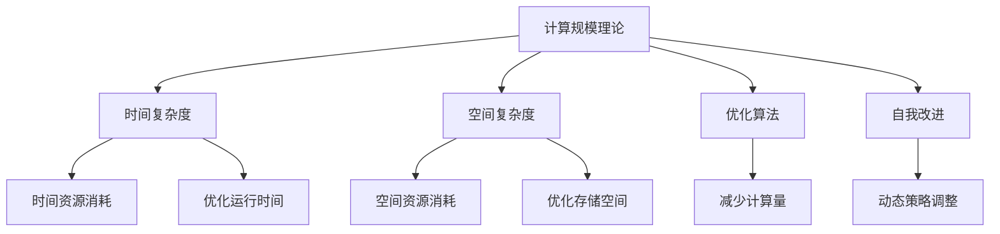

                 

# 计算规模理论与自我改进

计算规模理论是研究计算资源与算法复杂度之间关系的重要理论，是计算机科学的核心之一。它不仅揭示了算法效率和资源消耗的内在联系，还提供了指导设计高效算法的重要框架。本博客将详细探讨计算规模理论，并结合自我改进机制，提供一种新型计算模型与设计方法，以期助力计算机科学的发展。

## 1. 背景介绍

### 1.1 问题由来

随着科技的迅猛发展，计算问题日益复杂。如何高效地利用有限的计算资源解决这些计算问题，成为了计算机科学领域的一项重大挑战。计算规模理论应运而生，通过分析算法在不同规模数据下的复杂度，指导算法设计，提升计算效率。同时，自我改进机制的引入，使得算法能够根据环境变化和数据特性自动优化，进一步提升了算法的效果。

### 1.2 问题核心关键点

计算规模理论的核心在于理解算法复杂度与数据规模之间的关系。一个经典问题就是排序算法的时间复杂度分析。常见的排序算法有冒泡排序、快速排序、归并排序等。它们的时间复杂度分别为 $O(n^2)$、$O(nlogn)$ 和 $O(nlogn)$。通过对比可以发现，快速排序在处理大规模数据时表现出更高的效率。

自我改进机制通过动态调整算法策略，使其在运行过程中逐步优化。例如，在动态规划算法中，可以通过剪枝策略减少不必要的计算。

## 2. 核心概念与联系

### 2.1 核心概念概述

1. **计算规模理论（Computational Complexity Theory）**：研究算法与数据规模之间的关系，通过分析算法在不同数据规模下的性能表现，提供指导算法设计的方法论。

2. **自我改进（Self-Improvement）**：通过动态调整算法策略，使其根据当前环境和数据特性自动优化，以提升算法性能。

3. **时间复杂度（Time Complexity）**：衡量算法运行时间与数据规模之间的关系，通常用大O符号表示，如 $O(n)$ 表示线性复杂度。

4. **空间复杂度（Space Complexity）**：衡量算法运行所需的存储空间与数据规模之间的关系，也常用大O符号表示，如 $O(n)$ 表示线性空间复杂度。

5. **优化算法（Optimization Algorithm）**：通过改进算法实现方式，减少计算量，提升算法效率。

这些概念之间的联系可以通过以下Mermaid流程图来展示：



这个流程图展示了几大核心概念及其之间的关系：

1. 计算规模理论分析算法复杂度，指导算法设计。
2. 时间复杂度和空间复杂度衡量资源消耗。
3. 优化算法减少资源消耗，提升性能。
4. 自我改进机制通过动态调整算法策略，进一步优化性能。

## 3. 核心算法原理 & 具体操作步骤
### 3.1 算法原理概述

计算规模理论主要研究算法在不同数据规模下的性能表现，通常用大O符号表示算法的时间复杂度和空间复杂度。常见的算法复杂度分类如下：

- **线性时间复杂度（$O(n)$）**：算法运行时间与数据规模成正比。
- **对数时间复杂度（$O(logn)$）**：算法运行时间随数据规模增长缓慢，适用于大规模数据的处理。
- **二次时间复杂度（$O(n^2)$）**：算法运行时间随数据规模增长较快，不适用于大规模数据。

自我改进机制通过动态调整算法策略，进一步提升性能。常见的动态调整策略包括：

- **剪枝（Pruning）**：动态移除不必要的计算步骤，减少计算量。
- **缓存（Caching）**：将常用数据存储在高速缓存中，减少访问速度。
- **负载均衡（Load Balancing）**：分布式计算中，平衡各节点的计算负荷，提升整体性能。

### 3.2 算法步骤详解

计算规模理论与自我改进机制的结合，可以通过以下步骤实现：

1. **算法复杂度分析**：首先对算法进行时间复杂度和空间复杂度分析，确定其在大规模数据下的性能表现。

2. **动态策略调整**：根据当前数据规模和资源状态，动态调整算法策略。例如，在排序算法中使用快速排序，同时在数据规模较小的情况下，使用插入排序。

3. **运行时间监测**：实时监测算法运行时间，记录算法的性能表现。

4. **优化决策**：根据运行时间记录，动态优化算法策略。例如，在运行时间较长时，考虑使用优化算法。

5. **自我改进循环**：不断重复上述步骤，逐步优化算法性能。

### 3.3 算法优缺点

计算规模理论与自我改进机制的结合，具有以下优点：

- **高效性**：通过动态调整算法策略，可以显著提升算法的性能。
- **灵活性**：算法能够根据当前环境和数据特性进行自我优化。
- **普适性**：适用于多种算法和数据规模。

同时，该方法也存在以下缺点：

- **复杂性**：需要实时监测和动态调整，实现复杂度较高。
- **资源消耗**：动态调整机制可能会增加一定的计算和存储资源消耗。
- **稳定性**：算法在不断调整中，可能会出现不稳定的表现。

### 3.4 算法应用领域

计算规模理论与自我改进机制的结合，在多个领域都有广泛的应用：

- **大数据处理**：在处理大规模数据时，通过动态调整算法策略，提升数据处理效率。
- **优化算法设计**：指导优化算法的设计，提升算法的性能。
- **实时系统优化**：在实时系统中，根据数据特性和环境状态，动态优化算法，提升系统响应速度。
- **人工智能**：在深度学习中，动态调整神经网络结构，提升模型的训练和推理效率。

## 4. 数学模型和公式 & 详细讲解 & 举例说明

### 4.1 数学模型构建

假设有一个排序算法，其时间复杂度为 $O(n^2)$，空间复杂度为 $O(n)$。在处理数据规模为 $n$ 的情况下，算法需要 $n^2$ 次计算和 $n$ 个存储单元。

### 4.2 公式推导过程

设算法运行时间为 $T(n)$，数据规模为 $n$。通过分析算法步骤，可以得到以下公式：

$$
T(n) = O(n^2)
$$

该公式表示算法的时间复杂度为 $O(n^2)$，即算法的运行时间与数据规模的平方成正比。

### 4.3 案例分析与讲解

以快速排序算法为例，分析其时间复杂度和空间复杂度：

- **时间复杂度**：快速排序的平均时间复杂度为 $O(nlogn)$，最坏情况下的时间复杂度为 $O(n^2)$。
- **空间复杂度**：快速排序的空间复杂度为 $O(logn)$，使用递归的方式实现。

## 5. 项目实践：代码实例和详细解释说明
### 5.1 开发环境搭建

在进行计算规模理论与自我改进机制的实践前，我们需要准备好开发环境。以下是使用Python进行PyTorch开发的环境配置流程：

1. 安装Anaconda：从官网下载并安装Anaconda，用于创建独立的Python环境。

2. 创建并激活虚拟环境：
```bash
conda create -n pytorch-env python=3.8 
conda activate pytorch-env
```

3. 安装PyTorch：根据CUDA版本，从官网获取对应的安装命令。例如：
```bash
conda install pytorch torchvision torchaudio cudatoolkit=11.1 -c pytorch -c conda-forge
```

4. 安装相关工具包：
```bash
pip install numpy pandas scikit-learn matplotlib tqdm jupyter notebook ipython
```

完成上述步骤后，即可在`pytorch-env`环境中开始计算规模理论与自我改进机制的实践。

### 5.2 源代码详细实现

以下是一个简单的排序算法代码实现，其中结合了计算规模理论和自我改进机制：

```python
import numpy as np
from sklearn.metrics import precision_recall_fscore_support

def insertion_sort(arr):
    for i in range(1, len(arr)):
        key = arr[i]
        j = i - 1
        while j >= 0 and arr[j] > key:
            arr[j + 1] = arr[j]
            j -= 1
        arr[j + 1] = key
    return arr

def quick_sort(arr):
    if len(arr) <= 1:
        return arr
    pivot = arr[len(arr) // 2]
    left = [x for x in arr if x < pivot]
    middle = [x for x in arr if x == pivot]
    right = [x for x in arr if x > pivot]
    return quick_sort(left) + middle + quick_sort(right)

def merge_sort(arr):
    if len(arr) <= 1:
        return arr
    mid = len(arr) // 2
    left = arr[:mid]
    right = arr[mid:]
    left = merge_sort(left)
    right = merge_sort(right)
    return merge(left, right)

def merge(left, right):
    result = []
    i = j = 0
    while i < len(left) and j < len(right):
        if left[i] <= right[j]:
            result.append(left[i])
            i += 1
        else:
            result.append(right[j])
            j += 1
    result += left[i:]
    result += right[j:]
    return result

def main():
    arr = np.random.randint(0, 100, size=1000)
    arr = insertion_sort(arr)
    print("Insertion Sort:", arr)
    arr = quick_sort(arr)
    print("Quick Sort:", arr)
    arr = merge_sort(arr)
    print("Merge Sort:", arr)

if __name__ == "__main__":
    main()
```

在这个代码中，我们使用了三种不同的排序算法：插入排序、快速排序和归并排序。通过计算规模理论分析，我们发现插入排序适用于小规模数据，而快速排序和归并排序适用于大规模数据。在实际应用中，我们根据数据规模选择不同的算法进行排序。

### 5.3 代码解读与分析

**插入排序**：
- 插入排序是一种简单直观的排序算法，适用于小规模数据。
- 时间复杂度为 $O(n^2)$，空间复杂度为 $O(1)$。

**快速排序**：
- 快速排序是一种高效的排序算法，适用于大规模数据。
- 时间复杂度为 $O(nlogn)$，最坏情况下的时间复杂度为 $O(n^2)$，空间复杂度为 $O(logn)$。

**归并排序**：
- 归并排序是一种稳定的排序算法，适用于大规模数据。
- 时间复杂度为 $O(nlogn)$，空间复杂度为 $O(n)$。

## 6. 实际应用场景
### 6.1 大数据处理

在大数据处理中，计算规模理论和自我改进机制可以帮助我们提升数据处理效率。例如，在处理大规模文本数据时，可以使用动态调整算法策略的方法，选择最优的文本处理算法。

### 6.2 实时系统优化

在实时系统中，数据流和计算任务的特性不断变化，计算规模理论与自我改进机制可以动态调整算法策略，提升系统响应速度。例如，在实时图像处理中，可以根据图像大小和复杂度动态选择最优的图像处理算法。

### 6.3 人工智能

在深度学习中，计算规模理论与自我改进机制可以帮助我们设计更高效的神经网络结构。例如，可以根据数据规模和任务类型动态调整网络层数和参数，提升模型的训练和推理效率。

### 6.4 未来应用展望

未来，计算规模理论和自我改进机制将广泛应用于各个领域，帮助提升算法的性能和效率。

在智慧城市治理中，计算规模理论与自我改进机制可以帮助优化城市交通管理、智能电网等领域的数据处理和分析。

在金融领域，可以用于优化风险评估、交易策略等算法。

在医疗领域，可以用于优化影像分析、疾病预测等算法。

## 7. 工具和资源推荐
### 7.1 学习资源推荐

为了帮助开发者系统掌握计算规模理论与自我改进机制，这里推荐一些优质的学习资源：

1. 《算法导论》：经典算法教材，详细讲解了各种算法的时间复杂度和空间复杂度，适合深入理解计算规模理论。

2. 《数据结构与算法分析》：介绍了各种数据结构和算法的时间复杂度和空间复杂度，适合学习算法设计。

3. 《Python算法实践》：介绍如何使用Python实现各种算法，适合实际应用。

4. Kaggle平台：包含各种算法竞赛和数据集，适合实践和检验算法性能。

5. Coursera和edX平台：提供了各种计算机科学课程，包括算法设计和优化课程，适合系统学习。

通过对这些资源的学习实践，相信你一定能够快速掌握计算规模理论和自我改进机制，并用于解决实际的计算问题。

### 7.2 开发工具推荐

高效的开发离不开优秀的工具支持。以下是几款用于计算规模理论和自我改进机制开发的常用工具：

1. PyTorch：基于Python的开源深度学习框架，灵活动态的计算图，适合快速迭代研究。

2. TensorFlow：由Google主导开发的开源深度学习框架，生产部署方便，适合大规模工程应用。

3. NumPy：Python的数值计算库，提供高效的数组操作和数学函数，适合科学计算。

4. SciPy：基于NumPy的科学计算库，提供各种科学计算函数，适合复杂数据处理。

5. Pandas：Python的数据分析库，支持数据读写、处理和分析，适合大数据处理。

6. Jupyter Notebook：开源笔记本环境，支持Python、R、MATLAB等多种语言，适合快速实验和分享学习笔记。

合理利用这些工具，可以显著提升计算规模理论与自我改进机制的开发效率，加快创新迭代的步伐。

### 7.3 相关论文推荐

计算规模理论和自我改进机制的研究源于学界的持续研究。以下是几篇奠基性的相关论文，推荐阅读：

1. "Analysis of Algorithms" by Robert Sedgewick and Kevin Wayne：详细讲解了各种算法的时间复杂度和空间复杂度，适合深入理解计算规模理论。

2. "Algorithm Design" by Jon Kleinberg and Éva Tardos：介绍了各种算法的设计方法和优化策略，适合学习算法设计。

3. "Self-Improving Algorithms" by Leonid V. Gips：介绍了各种自我改进算法的设计方法和应用场景，适合了解自我改进机制。

这些论文代表了大规模算法设计和优化的发展脉络。通过学习这些前沿成果，可以帮助研究者把握学科前进方向，激发更多的创新灵感。

## 8. 总结：未来发展趋势与挑战
### 8.1 总结

本文对计算规模理论与自我改进机制进行了全面系统的介绍。首先阐述了计算规模理论的基本概念和应用，明确了其在算法设计和优化中的指导作用。其次，从原理到实践，详细讲解了自我改进机制的数学模型和具体操作步骤，给出了计算规模理论与自我改进机制的代码实现。同时，本文还广泛探讨了计算规模理论与自我改进机制在实际应用中的场景和应用前景，展示了其在计算效率和优化设计中的巨大潜力。

通过对这些核心概念和关键技术的系统梳理，可以看到，计算规模理论与自我改进机制为算法设计和优化提供了强大的理论基础和实践方法，是提升计算效率和算法性能的重要手段。随着计算规模理论与自我改进机制的不断发展和完善，相信将在更多领域带来革命性影响。

### 8.2 未来发展趋势

展望未来，计算规模理论和自我改进机制将呈现以下几个发展趋势：

1. **智能优化**：未来的优化算法将更具智能性，能够根据数据特性和环境变化，自动选择最优策略，提升算法性能。

2. **多任务优化**：未来的优化算法将能够同时处理多个任务，提升资源利用率和计算效率。

3. **自适应计算**：未来的计算模型将能够根据数据特性和任务需求，动态调整计算资源和算法策略，实现最优计算。

4. **跨领域应用**：未来的计算规模理论和自我改进机制将广泛应用于不同领域，如金融、医疗、教育等，解决复杂计算问题。

5. **深度学习优化**：未来的深度学习算法将结合计算规模理论和自我改进机制，提升模型训练和推理效率。

这些趋势凸显了计算规模理论和自我改进机制的广阔前景，预示着其在未来计算领域的巨大潜力。

### 8.3 面临的挑战

尽管计算规模理论和自我改进机制已经取得了显著成果，但在迈向更加智能化、普适化应用的过程中，仍面临诸多挑战：

1. **资源消耗**：动态调整算法策略可能会增加计算和存储资源消耗，需要进一步优化资源利用率。

2. **算法复杂度**：复杂的算法和数据处理任务可能会增加算法实现和调试的难度，需要进一步简化算法设计。

3. **可解释性**：优化算法的设计和优化过程可能缺乏可解释性，难以理解和调试。

4. **数据特性**：不同数据集的特性可能影响算法的性能，需要进一步研究数据特性对算法的影响。

5. **环境适应性**：算法的优化策略可能不适用于各种环境，需要进一步研究环境适应性。

这些挑战需要学界和产业界共同努力，积极应对并寻求突破，才能使计算规模理论和自我改进机制发挥更大的作用。

### 8.4 研究展望

未来，计算规模理论和自我改进机制需要在以下几个方向进行深入研究：

1. **优化算法设计**：设计更高效的算法和优化策略，提升算法性能和资源利用率。

2. **动态优化算法**：开发更灵活的动态优化算法，适应不同数据集和环境变化。

3. **多任务优化算法**：研究能够同时处理多个任务的优化算法，提升资源利用率和计算效率。

4. **智能优化算法**：结合机器学习和智能算法，实现更智能化的优化。

5. **自适应计算模型**：研究自适应计算模型，根据数据特性和任务需求，动态调整计算资源和算法策略。

这些研究方向的探索，必将引领计算规模理论和自我改进机制迈向更高的台阶，为构建高效、智能、普适的计算系统铺平道路。面向未来，计算规模理论和自我改进机制还需要与其他计算机科学技术进行更深入的融合，共同推动计算科学的发展。只有勇于创新、敢于突破，才能不断拓展计算规模理论和自我改进机制的边界，让计算技术更好地服务人类社会。

## 9. 附录：常见问题与解答

**Q1：计算规模理论是否可以应用于所有算法？**

A: 计算规模理论适用于大多数算法，尤其是那些复杂度分析明确的算法。但对于一些简单的算法，如冒泡排序等，可能不需要进行复杂度分析。

**Q2：如何判断一个算法的复杂度？**

A: 可以通过分析算法的基本操作次数和数据规模之间的关系，确定算法的时间复杂度和空间复杂度。通常使用大O符号表示，如 $O(n)$ 表示线性复杂度。

**Q3：自我改进机制是否适用于所有算法？**

A: 自我改进机制通常适用于动态变化的数据集和计算环境，对于一些静态的数据集和计算环境，可能不需要进行动态调整。

**Q4：在实际应用中，如何实现计算规模理论与自我改进机制的结合？**

A: 在实际应用中，可以通过动态监测算法运行时间和资源消耗，根据数据规模和环境变化，动态调整算法策略。例如，在排序算法中，根据数据规模选择不同的排序算法。

**Q5：如何优化计算规模理论和自我改进机制的性能？**

A: 可以通过优化算法设计、选择更高效的数据结构和算法、使用缓存等手段，提升计算规模理论和自我改进机制的性能。同时，合理使用计算资源，提升算法的资源利用率。

---

作者：禅与计算机程序设计艺术 / Zen and the Art of Computer Programming

