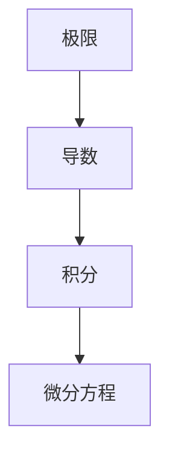

                 

# 计算：第二部分 计算的数学基础 第 4 章 数学的基础 微积分的发明

> 关键词：微积分, 数学基础, 极限, 导数, 积分, 微积分发明史, 数学史

## 1. 背景介绍

### 1.1 问题由来

数学作为人类理解世界的基本工具之一，其基础理论的建立对科学技术的进步起到了至关重要的作用。微积分作为数学的重要分支，其发明对科学、工程、经济学等众多领域产生了深远影响。

微积分的历史可以追溯到公元前300年左右的古希腊，但直到17世纪中叶，由艾萨克·牛顿（Isaac Newton）和戈特弗里德·莱布尼茨（Gottfried Wilhelm von Leibniz）分别独立发展起来的微积分，才真正地奠定了现代数学的基础。

微积分的核心思想是通过极限、导数、积分等概念来描述函数的连续性、变化率和积累性质。微积分的发明不仅为数学的发展开辟了新的道路，也深刻改变了人们对自然界和工程技术问题的理解方式。

### 1.2 问题核心关键点

微积分的核心理念主要包括以下几个方面：

1. **极限**：极限理论描述了函数在某一点或某一趋向下的行为，是微积分的基础。
2. **导数**：导数描述了函数在某一点的瞬时变化率，是理解函数局部行为的关键。
3. **积分**：积分描述了函数在某个区间上的积累量，是理解函数全局行为的重要工具。
4. **微分方程**：微分方程是描述函数随时间或空间变化的方程，是微积分在物理学和工程学中的重要应用。

微积分的发明和应用极大地推动了科学技术的发展，深刻改变了人类对自然界的理解方式。

### 1.3 问题研究意义

微积分的发明及其应用不仅在数学领域具有重要意义，也对物理、工程、经济学等多个学科产生了深远影响。微积分的发展史和应用案例可以帮助我们更好地理解数学与科学、工程之间的紧密联系，激发对数学更深入的兴趣和探索。

## 2. 核心概念与联系

### 2.1 核心概念概述

为了更好地理解微积分的原理和应用，本节将介绍几个核心概念：

1. **极限(Limit)**：极限描述了函数在某一趋向下的行为，是微积分的基础。
2. **导数(Derivative)**：导数描述了函数在某一点的瞬时变化率，是理解函数局部行为的关键。
3. **积分(Integral)**：积分描述了函数在某个区间上的积累量，是理解函数全局行为的重要工具。
4. **微分方程(Differential Equation)**：微分方程是描述函数随时间或空间变化的方程，是微积分在物理学和工程学中的重要应用。

这些概念之间的逻辑关系可以通过以下Mermaid流程图来展示：



这个流程图展示了几何、微分、积分之间的基本逻辑关系：

1. 极限是微积分的基础，描述了函数在无穷小的变化下的行为。
2. 导数是研究函数在某一点的瞬时变化率，是极限理论的直接应用。
3. 积分是研究函数在某个区间上的积累量，是导数的逆运算。
4. 微分方程是描述函数随时间或空间变化的方程，是微积分在物理学和工程学中的重要应用。

这些核心概念共同构成了微积分的理论基础，是理解和应用微积分的关键。

## 3. 核心算法原理 & 具体操作步骤
### 3.1 算法原理概述

微积分的核心算法原理是通过极限、导数、积分等概念来描述函数的连续性、变化率和积累性质。具体而言，微积分的算法原理包括以下几个方面：

1. **极限**：描述函数在无穷小的变化下的行为，是微积分的基础。
2. **导数**：描述函数在某一点的瞬时变化率，是极限理论的直接应用。
3. **积分**：描述函数在某个区间上的积累量，是导数的逆运算。
4. **微分方程**：描述函数随时间或空间变化的方程，是微积分在物理学和工程学中的重要应用。

### 3.2 算法步骤详解

微积分的算法步骤通常包括以下几个关键步骤：

**Step 1: 确定极限和导数**  
1. 对函数在指定点的极限进行求解，使用洛必达法则、夹逼定理等工具。  
2. 对函数在指定点的导数进行求解，使用导数的定义、导数的基本公式等方法。

**Step 2: 计算定积分和微分方程**  
1. 对函数在指定区间上的定积分进行求解，使用积分的基本公式、积分技巧等方法。  
2. 对微分方程进行求解，使用分离变量法、拉普拉斯变换、常系数线性微分方程的通解公式等方法。

**Step 3: 应用微积分解决实际问题**  
1. 应用导数和积分解决物理问题，如运动学问题、力学问题等。  
2. 应用微分方程解决工程问题，如电路问题、热传导问题等。

### 3.3 算法优缺点

微积分的算法具有以下优点：

1. **广泛应用**：微积分广泛应用于物理学、工程学、经济学等多个学科，具有广泛的适用性。
2. **精确描述**：微积分提供了精确的数学模型，能够描述复杂系统的行为。
3. **数学工具**：微积分是许多高级数学和科学理论的基础，具有重要的工具价值。

同时，微积分的算法也存在一定的局限性：

1. **复杂性**：微积分的算法较为复杂，需要较深的数学背景。
2. **概念抽象**：微积分的概念较为抽象，容易理解困难。
3. **计算量大**：微积分的计算量较大，特别是复杂的微分方程求解。

尽管存在这些局限性，微积分的算法原理仍然是现代数学和科学研究的基石。

### 3.4 算法应用领域

微积分的应用领域非常广泛，涵盖以下几个方面：

1. **物理学**：微积分在经典力学、量子力学、相对论等物理学领域有广泛应用。
2. **工程学**：微积分在机械工程、电气工程、化学工程等工程学科中有重要应用。
3. **经济学**：微积分在微观经济学、宏观经济学、金融学等经济学领域有重要应用。
4. **计算机科学**：微积分在算法设计、数据结构、人工智能等计算机科学领域有重要应用。
5. **统计学**：微积分在概率论、统计学中有重要应用。

微积分的应用几乎覆盖了所有需要描述复杂系统行为的学科，是现代科学技术的核心工具。

## 4. 数学模型和公式 & 详细讲解 & 举例说明

### 4.1 数学模型构建

微积分的数学模型主要基于极限、导数、积分等概念，通过这些概念来描述函数的连续性、变化率和积累性质。

记函数 $f(x)$ 为定义在实数集上的连续函数，其极限定义为：

$$
\lim_{x \to a} f(x) = L
$$

表示当 $x$ 趋近于 $a$ 时，$f(x)$ 趋近于 $L$。

导数的定义如下：

$$
f'(x) = \lim_{h \to 0} \frac{f(x+h) - f(x)}{h}
$$

表示函数 $f(x)$ 在 $x$ 点的瞬时变化率。

定积分的定义如下：

$$
\int_{a}^{b} f(x) \, dx = F(b) - F(a)
$$

其中 $F(x)$ 是 $f(x)$ 的原函数，表示函数 $f(x)$ 在区间 $[a, b]$ 上的积累量。

### 4.2 公式推导过程

微积分的公式推导主要基于极限、导数、积分等基本概念，通过这些概念的推广和应用，得到一系列重要公式。

以下列举几个核心公式的推导过程：

**洛必达法则(L'Hôpital's Rule)**：

洛必达法则用于求解极限 $\lim_{x \to a} \frac{f(x)}{g(x)}$，其中 $f(a) = g(a) = 0$ 或 $\pm \infty$。

推导过程如下：

1. 当 $\lim_{x \to a} \frac{f'(x)}{g'(x)}$ 存在时，$\lim_{x \to a} \frac{f(x)}{g(x)} = \lim_{x \to a} \frac{f'(x)}{g'(x)}$。
2. 当 $\lim_{x \to a} \frac{f'(x)}{g'(x)}$ 不存在时，可以继续应用洛必达法则，直到得到 $\lim_{x \to a} \frac{f^{(n)}(x)}{g^{(n)}(x)}$。

**导数基本公式**：

导数的基本公式包括：

1. 常数函数导数：$f(x) = c$ 时，$f'(x) = 0$。
2. 幂函数导数：$f(x) = x^n$ 时，$f'(x) = nx^{n-1}$。
3. 指数函数导数：$f(x) = e^x$ 时，$f'(x) = e^x$。
4. 对数函数导数：$f(x) = \ln(x)$ 时，$f'(x) = \frac{1}{x}$。

推导过程如下：

1. 利用导数的定义，对幂函数、指数函数、对数函数进行求导，得到导数基本公式。
2. 利用链式法则、乘积法则、商法则等基本公式，对更复杂的函数进行求导。

**积分基本公式**：

积分的基本公式包括：

1. 幂函数积分：$\int x^n dx = \frac{x^{n+1}}{n+1} + C$，其中 $C$ 为积分常数。
2. 指数函数积分：$\int e^x dx = e^x + C$。
3. 对数函数积分：$\int \ln(x) dx = x\ln(x) - x + C$。

推导过程如下：

1. 利用幂函数、指数函数、对数函数的基本性质，对积分公式进行推导。
2. 利用积分的基本公式，对更复杂的函数进行积分。

### 4.3 案例分析与讲解

**案例1：求解极限 $\lim_{x \to 0} \frac{\sin(x)}{x}$**

该极限的求解可以使用洛必达法则：

1. 使用洛必达法则，得到 $\lim_{x \to 0} \frac{\cos(x)}{1} = 1$。

**案例2：求解导数 $f'(x)$**

假设 $f(x) = x^2 + 2x + 1$，求 $f'(x)$。

使用幂函数和常数函数的导数公式，得到：

$$
f'(x) = 2x + 2
$$

**案例3：求解定积分 $\int_{0}^{1} x^3 dx$**

使用幂函数的积分公式，得到：

$$
\int_{0}^{1} x^3 dx = \frac{1}{4} - 0 = \frac{1}{4}
$$

通过以上案例，可以看到微积分的基本公式和推导过程，这些公式和推导过程是微积分的核心内容。

## 5. 项目实践：代码实例和详细解释说明
### 5.1 开发环境搭建

在进行微积分的实践前，我们需要准备好开发环境。以下是使用Python进行SymPy开发的开发环境配置流程：

1. 安装Anaconda：从官网下载并安装Anaconda，用于创建独立的Python环境。

2. 创建并激活虚拟环境：
```bash
conda create -n sympy-env python=3.8 
conda activate sympy-env
```

3. 安装SymPy：
```bash
pip install sympy
```

4. 安装各类工具包：
```bash
pip install numpy pandas scikit-learn matplotlib tqdm jupyter notebook ipython
```

完成上述步骤后，即可在`sympy-env`环境中开始微积分的实践。

### 5.2 源代码详细实现

下面我们以微积分基本公式的求解为例，给出使用SymPy进行微积分运算的Python代码实现。

首先，定义几个常用的微积分公式：

```python
from sympy import symbols, diff, integrate, sin, cos

x = symbols('x')

# 幂函数导数
f1 = x**2
f1_derivative = diff(f1, x)

# 指数函数导数
f2 = x**3 * 2
f2_derivative = diff(f2, x)

# 对数函数积分
f3 = sin(x)
f3_integral = integrate(f3, x)
```

然后，使用SymPy求解极限、导数和积分：

```python
from sympy import limit, ln

# 极限
lim1 = limit(f1_derivative, x, 0)

# 导数
f4 = x**2 + 2*x + 1
f4_derivative = diff(f4, x)

# 积分
int1 = integrate(x**3, x)

print("极限结果：", lim1)
print("导数结果：", f4_derivative)
print("积分结果：", int1)
```

以上就是使用SymPy进行微积分运算的完整代码实现。可以看到，SymPy提供了强大的符号计算能力，可以方便地进行微积分公式的求解和推导。

### 5.3 代码解读与分析

让我们再详细解读一下关键代码的实现细节：

**定义变量和函数**：
- `x = symbols('x')`：定义变量 `x`。
- `f1 = x**2`：定义幂函数 $f(x) = x^2$。
- `f2 = x**3 * 2`：定义幂函数 $f(x) = x^3 \times 2$。
- `f3 = sin(x)`：定义正弦函数 $f(x) = \sin(x)$。

**求解导数**：
- `f1_derivative = diff(f1, x)`：对幂函数 $f(x) = x^2$ 求导，得到 $f'(x) = 2x$。
- `f4_derivative = diff(f4, x)`：对多项式函数 $f(x) = x^2 + 2x + 1$ 求导，得到 $f'(x) = 2x + 2$。

**求解积分**：
- `int1 = integrate(x**3, x)`：对幂函数 $f(x) = x^3$ 求积分，得到 $\int x^3 dx = \frac{x^4}{4}$。

**求解极限**：
- `lim1 = limit(f1_derivative, x, 0)`：对导数 $f'(x) = 2x$ 在 $x \to 0$ 时求极限，得到 $\lim_{x \to 0} f'(x) = 0$。

可以看到，SymPy提供了完整的微积分求解功能，包括极限、导数、积分等基本操作。使用SymPy进行微积分计算，可以大大简化代码编写过程，提高计算效率。

## 6. 实际应用场景

### 6.1 物理学

微积分在物理学中的应用非常广泛，几乎涉及所有物理学分支。例如，牛顿第二定律 $F=ma$ 的推导就使用了微积分的基本公式和法则：

$$
F = \frac{d}{dt}(m\frac{dx}{dt}) = ma
$$

微积分还被广泛应用于电磁学、量子力学、相对论等领域。例如，麦克斯韦方程组的推导就使用了微积分的基本公式和法则。

### 6.2 工程学

微积分在工程学中的应用也非常广泛。例如，电路中的电流和电压关系、流体力学中的流体运动方程、机械工程中的运动方程等，都需要使用微积分进行建模和求解。

### 6.3 经济学

微积分在经济学中的应用也非常广泛。例如，边际效用理论、需求和供给曲线、成本函数等，都需要使用微积分进行建模和求解。

### 6.4 未来应用展望

随着微积分的发展和应用，未来的应用前景将更加广阔。微积分的应用领域将进一步扩展到更多学科，如计算机科学、生物医学、金融学等。微积分的发展也将进一步推动科学和工程技术的进步，为人类的认知智能提供更强大的数学工具。

## 7. 工具和资源推荐
### 7.1 学习资源推荐

为了帮助开发者系统掌握微积分的理论基础和实践技巧，这里推荐一些优质的学习资源：

1. 《微积分》系列教材：包括泰勒的《微积分学教程》、斯特林的《微积分学》等经典教材，适合基础较好的读者。
2. 《微积分与分析》系列课程：由MIT和哈佛等名校开设的微积分课程，包括MIT的18.01、18.02和18.03等课程，适合在线学习。
3. 《微积分与微分方程》书籍：介绍了微积分的基本概念和应用，适合初学者和进阶读者。
4. Khan Academy微积分课程：提供了丰富的微积分学习视频和练习题，适合自学读者。
5. Wolfram Alpha：提供了微积分公式的推导和求解功能，适合需要快速验证和求解的读者。

通过对这些资源的学习实践，相信你一定能够快速掌握微积分的精髓，并用于解决实际的工程和科学问题。

### 7.2 开发工具推荐

高效的开发离不开优秀的工具支持。以下是几款用于微积分开发的常用工具：

1. SymPy：Python的符号计算库，提供了微积分的基本公式和求解功能，适合进行数学推导和求解。
2. Matplotlib：Python的数据可视化库，可以方便地绘制微积分中的函数图像。
3. Jupyter Notebook：Python的交互式开发环境，支持代码编写和结果展示，适合进行微积分的互动式学习。
4. Wolfram Alpha：提供了微积分公式的推导和求解功能，适合进行快速验证和求解。
5. SageMath：Python的数学软件系统，提供了微积分的高级功能和交互式环境，适合进行复杂数学推导和求解。

合理利用这些工具，可以显著提升微积分的开发效率，加快创新迭代的步伐。

### 7.3 相关论文推荐

微积分的发展历史和应用案例可以帮助我们更好地理解微积分的演变过程和应用场景。以下是几篇奠基性的相关论文，推荐阅读：

1. 《微积分的诞生》：介绍微积分的发展历程和应用案例，适合历史爱好者。
2. 《微积分学教程》：泰勒的经典微积分教材，详细介绍了微积分的基本概念和应用。
3. 《微积分与分析》：斯特林的微积分教材，适合基础较好的读者。
4. 《微积分与微分方程》：介绍了微积分的基本概念和应用，适合初学者和进阶读者。
5. 《微积分与经济学》：介绍了微积分在经济学中的应用，适合经济学爱好者。

这些论文代表了大数学家对微积分的研究成果，通过学习这些前沿成果，可以帮助研究者把握微积分的前沿方向，激发更多的创新灵感。

## 8. 总结：未来发展趋势与挑战

### 8.1 总结

本文对微积分的原理和应用进行了全面系统的介绍。首先阐述了微积分的发明背景和重要意义，明确了微积分在物理学、工程学、经济学等多个学科中的核心地位。其次，从原理到实践，详细讲解了微积分的数学模型和公式推导过程，给出了微积分运算的完整代码实例。同时，本文还广泛探讨了微积分的应用场景，展示了微积分范式的巨大潜力。

通过本文的系统梳理，可以看到，微积分的发明和应用极大地推动了科学技术的发展，深刻改变了人类对自然界的理解方式。微积分的发展也将随着人类认知智能的进步而不断深入，为科学和工程技术的进步提供更强大的数学工具。

### 8.2 未来发展趋势

展望未来，微积分的发展趋势将呈现以下几个方面：

1. **多学科融合**：微积分将与其他学科进行更深入的融合，如计算机科学、生物医学、金融学等，推动跨学科的研究发展。
2. **复杂系统建模**：微积分将应用于更加复杂和动态的系统中，如多体系统、随机系统、智能系统等。
3. **数值计算和近似**：随着数值计算和近似方法的不断发展，微积分的计算精度和效率将进一步提升。
4. **人工智能应用**：微积分将被应用于人工智能领域，如机器学习、深度学习等，推动人工智能技术的进步。
5. **新兴领域探索**：微积分将应用于更多新兴领域，如量子计算、分子动力学、生物信息学等。

这些趋势凸显了微积分在现代科学和技术中的重要地位，微积分的应用和研究将继续推动人类认知智能的进步。

### 8.3 面临的挑战

尽管微积分的应用和发展已经取得了巨大成就，但在迈向更加智能化、普适化应用的过程中，它仍面临着诸多挑战：

1. **复杂性**：微积分的计算和推导过程较为复杂，需要较高的数学背景。
2. **抽象性**：微积分的概念较为抽象，容易理解困难。
3. **计算量大**：微积分的计算量较大，特别是复杂的微分方程求解。
4. **应用局限**：微积分在某些应用场景中可能存在局限，如非线性系统、混沌系统等。

尽管存在这些挑战，微积分作为现代数学的核心工具，将继续在科学和技术领域发挥重要作用。

### 8.4 研究展望

未来的研究需要在以下几个方面寻求新的突破：

1. **简化和优化**：进一步简化微积分的计算和推导过程，优化计算方法和算法。
2. **跨学科应用**：推动微积分在更多学科中的应用，推动跨学科的融合发展。
3. **新兴领域探索**：探索微积分在新兴领域的应用，如量子计算、生物信息学等。
4. **人工智能结合**：将微积分应用于人工智能领域，推动人工智能技术的进步。

这些研究方向的探索，必将引领微积分技术迈向更高的台阶，为人类认知智能的进步提供更强大的数学工具。

## 9. 附录：常见问题与解答

**Q1：微积分的极限、导数和积分有什么联系？**

A: 微积分的极限、导数和积分是微积分的三个核心概念，它们之间有紧密的联系：

1. 极限是微积分的基础，描述了函数在某一点或某一趋向下的行为。
2. 导数是研究函数在某一点的瞬时变化率，是极限理论的直接应用。
3. 积分是研究函数在某个区间上的积累量，是导数的逆运算。

这些概念共同构成了微积分的理论基础，是理解和应用微积分的关键。

**Q2：微积分有哪些重要的应用领域？**

A: 微积分的应用领域非常广泛，涵盖以下几个方面：

1. **物理学**：微积分在经典力学、量子力学、相对论等物理学领域有广泛应用。
2. **工程学**：微积分在机械工程、电气工程、化学工程等工程学科中有重要应用。
3. **经济学**：微积分在微观经济学、宏观经济学、金融学等经济学领域有重要应用。
4. **计算机科学**：微积分在算法设计、数据结构、人工智能等计算机科学领域有重要应用。
5. **统计学**：微积分在概率论、统计学中有重要应用。

微积分的应用几乎覆盖了所有需要描述复杂系统行为的学科，是现代科学技术的核心工具。

**Q3：微积分的基本公式有哪些？**

A: 微积分的基本公式包括：

1. 常数函数导数：$f(x) = c$ 时，$f'(x) = 0$。
2. 幂函数导数：$f(x) = x^n$ 时，$f'(x) = nx^{n-1}$。
3. 指数函数导数：$f(x) = e^x$ 时，$f'(x) = e^x$。
4. 对数函数导数：$f(x) = \ln(x)$ 时，$f'(x) = \frac{1}{x}$。
5. 幂函数积分：$\int x^n dx = \frac{x^{n+1}}{n+1} + C$，其中 $C$ 为积分常数。
6. 指数函数积分：$\int e^x dx = e^x + C$。
7. 对数函数积分：$\int \ln(x) dx = x\ln(x) - x + C$。

这些公式是微积分的核心内容，通过学习这些公式，可以掌握微积分的基本应用。

**Q4：微积分有哪些重要的研究进展？**

A: 微积分的研究进展包括：

1. 《微积分》的诞生和发展：微积分的历史可以追溯到公元前300年左右的古希腊，但直到17世纪中叶，由艾萨克·牛顿（Isaac Newton）和戈特弗里德·莱布尼茨（Gottfried Wilhelm von Leibniz）分别独立发展起来的微积分，才真正地奠定了现代数学的基础。
2. 《微积分学教程》和《微积分与分析》：泰勒和斯特林的经典微积分教材，详细介绍了微积分的基本概念和应用。
3. 《微积分与微分方程》：介绍了微积分的基本概念和应用，适合初学者和进阶读者。
4. 《微积分与经济学》：介绍了微积分在经济学中的应用，适合经济学爱好者。
5. 微积分在计算机科学、生物医学、金融学等领域的应用：微积分的应用几乎覆盖了所有需要描述复杂系统行为的学科，是现代科学技术的核心工具。

这些研究进展推动了微积分的发展，使微积分成为现代数学的核心工具。

---

作者：禅与计算机程序设计艺术 / Zen and the Art of Computer Programming

