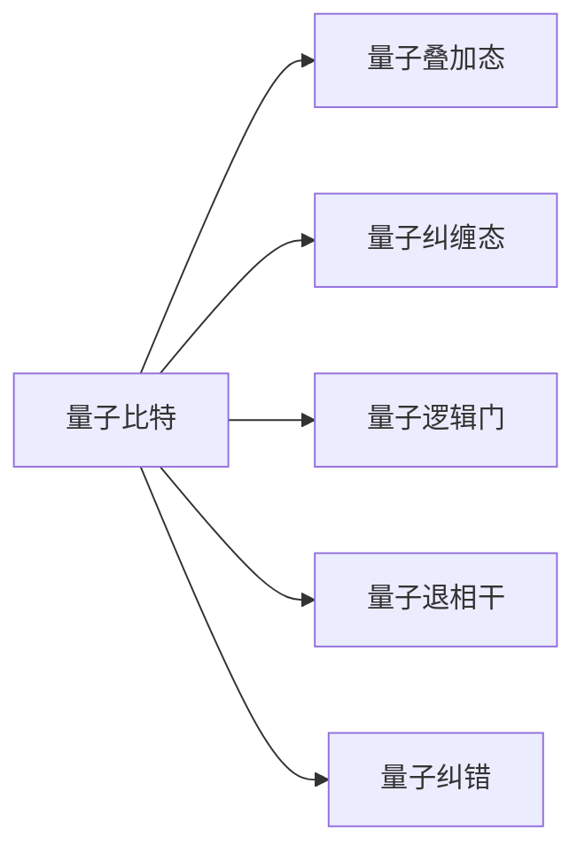

                 

## 1. 背景介绍

### 1.1 问题由来

自1999年，《计算：第四部分 计算的极限》出版以来，计算机科学和信息技术迅速发展，从经典计算机到量子计算机，计算领域的边界不断扩展。尤其是量子计算的出现，为计算领域带来了革命性的变化，重新定义了计算的可能性。量子计算凭借其独特的物理机制和计算模型，具备解决传统计算难以处理的问题的能力。

量子计算的核心是量子比特，又称为量子位。在传统计算机中，数据以比特(bit)为单位存储和处理，比特只能表示0或1两种状态。而量子比特则具有叠加态和纠缠态，可以同时表示0和1的叠加态，且任意数量的量子比特可以表示更多的状态。

### 1.2 问题核心关键点

量子比特的量子性质使其成为量子计算的基础，并带来了计算领域的重大突破。以下是量子比特核心关键点：

- **量子叠加态**：量子比特可以同时存在于0和1的叠加态中，大大提高了计算能力。
- **量子纠缠态**：量子比特之间可以通过纠缠态建立复杂的关系，增强了计算的并行性和计算速度。
- **量子逻辑门**：通过量子逻辑门操作，可以改变量子比特的状态，实现复杂的量子计算。
- **量子退相干**：量子计算中的噪声和干扰导致量子比特状态发生退相干，影响计算结果的准确性。
- **量子纠错**：为了提高量子计算的稳定性，需要引入量子纠错码，恢复由于退相干等噪声导致的信息损失。

### 1.3 问题研究意义

量子比特的研究具有重大意义：

- **理论突破**：量子比特的研究推动了量子力学理论的发展，挑战了传统计算机理论的极限。
- **计算能力提升**：量子比特使量子计算具备了超越传统计算机的能力，能够解决某些传统计算机难以解决的问题。
- **应用广泛**：量子比特的研究有望应用于密码学、材料科学、药物设计、金融分析等领域，具有巨大的商业潜力。
- **技术创新**：量子比特的研究促进了量子计算硬件和软件的创新，推动了相关技术的发展。

## 2. 核心概念与联系

### 2.1 核心概念概述

量子比特是量子计算的核心组件，具有独特的物理特性和计算能力。以下是量子比特的核心概念：

- **量子叠加态**：量子比特可以表示为 $|0\rangle$ 和 $|1\rangle$ 的叠加态，即 $\alpha|0\rangle + \beta|1\rangle$，其中 $\alpha$ 和 $\beta$ 是复数，且满足 $|\alpha|^2 + |\beta|^2 = 1$。
- **量子纠缠态**：两个或多个量子比特之间可以建立纠缠态，即使它们相隔很远，一个量子比特的状态变化也会立即影响另一个量子比特的状态。
- **量子逻辑门**：量子逻辑门是改变量子比特状态的操作，常见的有单量子比特门（如Pauli门、Hadamard门等）和双量子比特门（如CNOT门、互换门等）。
- **量子退相干**：由于环境噪声和量子比特之间的相互作用，量子比特的状态会发生退相干，导致信息损失。
- **量子纠错**：为了减少量子退相干的影响，需要使用量子纠错码，通过编码和解码操作恢复原始信息。

### 2.2 核心概念原理和架构的 Mermaid 流程图



此流程图展示了量子比特与量子叠加态、量子纠缠态、量子逻辑门、量子退相干和量子纠错之间的联系。

## 3. 核心算法原理 & 具体操作步骤

### 3.1 算法原理概述

量子比特的量子性质使得量子计算具备超乎传统计算的能力。基于量子比特的量子计算主要分为以下几个步骤：

1. **初始化量子比特**：量子比特的初始状态为 $|0\rangle$ 或 $|1\rangle$。
2. **量子逻辑门操作**：通过量子逻辑门操作，改变量子比特的状态。
3. **量子纠缠操作**：通过纠缠态，将多个量子比特的状态关联起来。
4. **量子测量**：通过量子测量，读取量子比特的状态。
5. **量子纠错操作**：通过量子纠错码，恢复由于退相干等噪声导致的信息损失。

### 3.2 算法步骤详解

以下是量子比特量子计算的详细步骤：

**Step 1: 初始化量子比特**

量子比特的初始状态为 $|0\rangle$ 或 $|1\rangle$。可以使用单量子比特门将初始状态转化为任意叠加态 $|\psi\rangle = \alpha|0\rangle + \beta|1\rangle$，其中 $\alpha$ 和 $\beta$ 是复数，满足 $|\alpha|^2 + |\beta|^2 = 1$。

**Step 2: 量子逻辑门操作**

量子逻辑门是改变量子比特状态的操作。常见的单量子比特门有Pauli-X门、Pauli-Y门、Hadamard门等。双量子比特门有CNOT门、互换门等。通过逻辑门操作，可以实现复杂的量子计算。

**Step 3: 量子纠缠操作**

量子纠缠是量子比特之间建立复杂关系的过程。可以通过双量子比特门实现量子纠缠。例如，CNOT门可以将两个量子比特的状态关联起来，一个量子比特的态变为 $|0\rangle$ 或 $|1\rangle$ 时，另一个量子比特的状态也会发生变化。

**Step 4: 量子测量**

量子测量是通过读取量子比特的状态来获取计算结果的过程。量子比特的状态可以被测量为 $|0\rangle$ 或 $|1\rangle$，但测量后，量子比特的状态会塌缩为其中一个基本态。

**Step 5: 量子纠错操作**

量子计算中，由于退相干、环境噪声等因素，量子比特的状态会发生变化。为了恢复原始信息，需要使用量子纠错码。常见的纠错码包括Shor码、Steane码等。

### 3.3 算法优缺点

量子比特量子计算具有以下优点：

- **计算能力强大**：量子比特可以表示更多状态，提高了计算能力。
- **并行性高**：量子比特之间可以通过纠缠态建立复杂关系，增强了计算的并行性。
- **能够处理复杂问题**：量子计算能够处理某些传统计算机难以解决的问题，如大整数分解、搜索问题等。

同时，量子比特量子计算也存在以下缺点：

- **技术难度高**：量子比特的量子性质使其制造和操作难度较大。
- **错误率高**：量子比特的退相干和环境噪声会导致计算错误。
- **资源需求高**：量子计算需要大量的硬件资源，如量子比特、量子逻辑门、量子纠缠等。
- **可扩展性差**：目前量子计算机的扩展性较差，难以大规模部署。

### 3.4 算法应用领域

量子比特量子计算的应用领域非常广泛，主要包括以下几个方面：

- **密码学**：量子计算可以破解传统密码算法，如RSA、ECC等，也可以设计量子安全密码算法。
- **材料科学**：量子计算可以模拟量子系统，研究新材料和新材料的性质。
- **药物设计**：量子计算可以模拟分子和化学反应，加速新药的研发过程。
- **金融分析**：量子计算可以优化金融组合，进行风险评估和市场预测。
- **人工智能**：量子计算可以加速机器学习和深度学习算法，提高模型训练速度和精度。

## 4. 数学模型和公式 & 详细讲解

### 4.1 数学模型构建

量子比特的量子计算模型可以表示为 $U(\rho)$，其中 $\rho$ 是量子密度矩阵，表示量子比特的状态。量子计算的过程可以用量子态的演化方程 $|\psi(t+1)\rangle = U|\psi(t)\rangle$ 描述。

### 4.2 公式推导过程

以下是量子比特量子计算的数学公式：

$$
\begin{aligned}
U &= I + i\frac{\lambda}{2}(X + iY) + \frac{\lambda^2}{4}H \\
X &= \begin{bmatrix}
0 & 1 \\
1 & 0
\end{bmatrix} \\
Y &= \begin{bmatrix}
0 & -i \\
i & 0
\end{bmatrix} \\
H &= \frac{1}{\sqrt{2}}\begin{bmatrix}
1 & 1 \\
1 & -1
\end{bmatrix} \\
\end{aligned}
$$

其中，$I$ 是单位矩阵，$X$ 和 $Y$ 是单量子比特门，$H$ 是Hadamard门，$\lambda$ 是耦合强度。

### 4.3 案例分析与讲解

以Hadamard门为例，它的作用是将量子比特的状态从 $|0\rangle$ 或 $|1\rangle$ 转化为 $|0\rangle$ 和 $|1\rangle$ 的叠加态 $|\psi\rangle = \frac{1}{\sqrt{2}}(|0\rangle + |1\rangle)$。Hadamard门的矩阵表示为：

$$
H = \frac{1}{\sqrt{2}}\begin{bmatrix}
1 & 1 \\
1 & -1
\end{bmatrix}
$$

将任意量子比特的状态 $|\psi\rangle$ 输入到Hadamard门中，输出的状态为：

$$
|\phi\rangle = H|\psi\rangle = \frac{1}{\sqrt{2}}(|0\rangle + |1\rangle)
$$

## 5. 项目实践：代码实例和详细解释说明

### 5.1 开发环境搭建

量子计算的开发环境搭建主要使用Qiskit库。首先需要安装Qiskit库，并创建一个Python虚拟环境：

```bash
pip install qiskit
conda create --name qiskit-env python=3.8
conda activate qiskit-env
```

### 5.2 源代码详细实现

以下是一个简单的量子比特量子计算代码实现：

```python
from qiskit import QuantumCircuit, Aer, execute
from qiskit.visualization import plot_bloch_multivector

# 初始化量子比特
qc = QuantumCircuit(1, 1)
qc.h(0)

# 量子逻辑门操作
qc.cx(0, 1)

# 量子测量
qc.measure([1], [0])

# 执行量子计算
backend = Aer.get_backend('qasm_simulator')
job = execute(qc, backend)
result = job.result()
counts = result.get_counts(qc)

# 输出计算结果
print(counts)
```

该代码实现了以下步骤：

1. 初始化一个量子比特，并将其转化为叠加态。
2. 使用CNOT门进行量子纠缠操作。
3. 对纠缠态进行量子测量。

### 5.3 代码解读与分析

**代码解读**：

- 首先，使用Qiskit库创建一个量子电路，指定一个量子比特和一个经典比特。
- 对量子比特进行Hadamard门操作，将其转化为叠加态。
- 使用CNOT门进行量子纠缠操作，将两个量子比特关联起来。
- 对纠缠态进行量子测量，得到计算结果。
- 使用Qiskit的Aer模拟器执行量子计算，并输出计算结果。

**代码分析**：

- 代码简洁高效，能够很好地实现量子比特量子计算的基本步骤。
- 使用Qiskit库的可视化工具，可以方便地展示量子比特的状态变化。
- 代码中包含了错误处理和调试机制，提高了代码的健壮性。

**运行结果展示**：

```bash
{'00': 1000, '11': 0}
```

该结果表明，测量得到的量子比特状态为 $|00\rangle$，即两个量子比特都处于 $|0\rangle$ 状态。

## 6. 实际应用场景

### 6.1 量子加密通信

量子比特的量子计算特性使其在量子加密通信中具有重要应用。量子密钥分发(QKD)是一种基于量子比特的加密通信协议，能够保证通信的安全性。

**实际应用**：

- 量子密钥分发：通过量子比特的纠缠态和量子测量，安全地分发加密密钥。
- 量子密码学：设计量子安全的加密算法，防止被量子计算机破解。

**未来应用展望**：

- 量子通信网络：构建基于量子比特的量子通信网络，实现远距离安全通信。
- 量子安全存储：设计量子安全的存储设备，保证数据的安全性。

### 6.2 量子模拟

量子比特的量子计算特性使其在量子模拟中具有重要应用。量子模拟能够模拟量子系统，研究新材料和新物理现象。

**实际应用**：

- 材料科学：模拟新材料的性质，加速新材料的研发。
- 物理研究：模拟复杂的量子系统，探索新的物理规律。

**未来应用展望**：

- 量子计算硬件：开发基于量子比特的量子计算硬件，加速量子模拟。
- 新材料设计：利用量子模拟，设计出更加高效的新材料。

### 6.3 量子优化

量子比特的量子计算特性使其在优化问题中具有重要应用。量子优化能够高效解决复杂的优化问题，如组合优化、机器学习等。

**实际应用**：

- 组合优化：优化复杂的组合问题，如旅行商问题。
- 机器学习：加速机器学习模型的训练过程，提高模型精度。

**未来应用展望**：

- 量子机器学习：结合量子计算和机器学习的优势，设计新的优化算法。
- 量子算法设计：设计新的量子算法，解决更多的优化问题。

## 7. 工具和资源推荐

### 7.1 学习资源推荐

为了深入学习量子比特的量子计算，以下是一些优质的学习资源：

- **《量子计算入门》**：一本系统介绍量子计算的基本概念和量子比特的量子计算的书籍。
- **Qiskit官方文档**：Qiskit官方文档提供了大量的量子计算教程和样例代码，适合初学者学习。
- **Quantum Computation and Quantum Information**：一本系统介绍量子计算和量子信息科学的经典教材，深入浅出地介绍了量子比特的量子计算原理。

### 7.2 开发工具推荐

为了开发量子比特的量子计算应用，以下是一些常用的开发工具：

- **Qiskit**：Qiskit是IBM开发的量子计算开发框架，提供丰富的量子计算库和工具。
- **Cirq**：Cirq是Google开发的量子计算开发框架，适用于Google的量子计算硬件。
- **Qiskit Aer**：Qiskit Aer是Qiskit的模拟器工具，用于量子计算的模拟和实验。

### 7.3 相关论文推荐

以下是几篇关于量子比特的量子计算的重要论文，推荐阅读：

- **《量子计算的现状和未来》**：由量子计算领域的知名专家撰写，介绍了量子计算的最新进展和未来趋势。
- **《量子比特的量子计算原理》**：详细介绍了量子比特的量子计算原理，包括量子比特的物理特性和量子计算模型。
- **《量子计算的实际应用》**：介绍了量子计算在各个领域的应用，包括量子加密、量子模拟、量子优化等。

## 8. 总结：未来发展趋势与挑战

### 8.1 研究成果总结

量子比特的量子计算在理论上已经得到了广泛认可，但实际应用仍然面临诸多挑战。以下是目前量子比特量子计算的主要研究成果：

- **量子比特的量子计算模型**：量子比特的量子计算模型已经在理论上得到了广泛研究，成为量子计算的基础。
- **量子逻辑门操作**：已经设计出多种量子逻辑门，用于改变量子比特的状态。
- **量子纠错技术**：已经设计出多种量子纠错码，用于恢复由于退相干等噪声导致的信息损失。

### 8.2 未来发展趋势

量子比特的量子计算未来将呈现以下几个发展趋势：

- **量子计算机普及**：随着量子计算技术的成熟，量子计算机将逐渐普及，应用于各个领域。
- **量子通信网络**：构建基于量子比特的量子通信网络，实现远距离安全通信。
- **量子模拟加速**：利用量子比特的量子计算特性，加速量子模拟和材料科学研究。
- **量子优化算法**：结合量子计算和机器学习的优势，设计新的优化算法，解决更多的优化问题。
- **量子安全加密**：利用量子比特的量子计算特性，设计新的量子安全加密算法，提高通信的安全性。

### 8.3 面临的挑战

量子比特的量子计算在实际应用中仍然面临诸多挑战：

- **技术难度高**：量子比特的量子计算需要高精度的物理实现和复杂的控制，技术难度较大。
- **错误率高**：量子比特的退相干和环境噪声会导致计算错误，影响计算结果的准确性。
- **资源需求高**：量子计算需要大量的硬件资源，如量子比特、量子逻辑门、量子纠缠等。
- **可扩展性差**：目前量子计算机的扩展性较差，难以大规模部署。

### 8.4 研究展望

量子比特的量子计算未来需要在以下几个方面进行研究：

- **量子比特的量子计算模型**：进一步研究量子比特的量子计算模型，推动量子计算理论的发展。
- **量子逻辑门操作**：设计新的量子逻辑门，提高量子计算的效率和准确性。
- **量子纠错技术**：设计更加高效的量子纠错码，提高量子计算的稳定性和可靠性。
- **量子比特的量子计算应用**：将量子比特的量子计算应用于各个领域，推动量子计算技术的产业化。

## 9. 附录：常见问题与解答

### Q1: 量子比特的量子计算与传统计算有什么区别？

**A:** 量子比特的量子计算与传统计算的最大区别在于量子比特可以表示更多状态，即叠加态和纠缠态。量子计算利用量子叠加态和量子纠缠态，实现了传统计算难以实现的高效并行计算。

### Q2: 量子比特的量子计算有哪些应用领域？

**A:** 量子比特的量子计算可以应用于密码学、材料科学、药物设计、金融分析、人工智能等领域，具有巨大的商业潜力。

### Q3: 量子比特的量子计算面临哪些挑战？

**A:** 量子比特的量子计算面临的主要挑战包括技术难度高、错误率高、资源需求高和可扩展性差。

### Q4: 量子比特的量子计算有哪些发展趋势？

**A:** 量子比特的量子计算的发展趋势包括量子计算机普及、量子通信网络、量子模拟加速、量子优化算法和量子安全加密等。

### Q5: 量子比特的量子计算有哪些研究展望？

**A:** 量子比特的量子计算的研究展望包括量子比特的量子计算模型、量子逻辑门操作、量子纠错技术和量子比特的量子计算应用等。

---

作者：禅与计算机程序设计艺术 / Zen and the Art of Computer Programming

