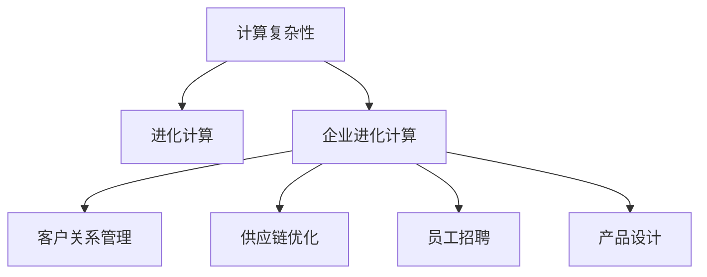

                 

# 计算：第四部分 计算的极限 第 11 章 复杂性计算 企业的进化计算

## 1. 背景介绍

### 1.1 问题由来

在《计算：第四部分 计算的极限》这一经典之作中，作者深入探讨了计算机科学的本质，探讨了计算的极限和复杂性问题。本文将以《计算：第四部分 计算的极限 第 11 章 复杂性计算 企业的进化计算》为标题，深入研究企业计算复杂性问题及其进化计算，通过复杂性理论、进化算法等工具，帮助企业更好地应对计算复杂性，实现技术突破和创新。

### 1.2 问题核心关键点

本节将介绍几个核心概念：

- 计算复杂性：指一个问题所需的计算资源，包括时间、空间等，与问题规模的增长关系。
- 进化计算：指通过模拟生物进化过程，如遗传算法、遗传编程、人工免疫等，求解复杂问题的优化算法。
- 企业进化计算：指在企业管理和运营中，运用进化计算方法，如遗传算法优化企业资源分配、客户关系管理等问题的策略。

通过这些概念，我们能够更好地理解企业在复杂环境中如何利用计算和进化计算方法实现战略性转型和进化。

## 2. 核心概念与联系

### 2.1 核心概念概述

为更好地理解企业的进化计算，本节将介绍几个密切相关的核心概念：

- **计算复杂性**：计算复杂性通常用时间复杂度或空间复杂度来衡量，反映了计算资源与问题规模的关系。常见的时间复杂度包括O(1)、O(logn)、O(n)、O(nlogn)、O(n^2)、O(2^n)等。
- **进化计算**：通过模拟自然界生物进化过程，如自然选择、遗传变异、交叉等，求解复杂问题的优化算法。进化算法不需要显式地表达问题的数学模型，适合求解复杂的非线性问题。
- **企业进化计算**：将进化计算方法应用于企业管理和运营，如客户关系管理、供应链优化、员工招聘、产品设计等问题的求解。

这些概念之间的逻辑关系可以通过以下Mermaid流程图来展示：



这个流程图展示了一个典型的企业计算复杂性和进化计算应用场景。企业通过计算复杂性分析，评估问题的求解难度，再通过进化计算方法，优化企业资源配置，提升运营效率。

## 3. 核心算法原理 & 具体操作步骤

### 3.1 算法原理概述

企业的进化计算，核心在于将生物进化过程抽象为计算算法，通过不断的“试错”和“选择”，逐步找到最优解。这种“试错”和“选择”机制，使算法能够在复杂环境中适应性更强，适应多变的市场环境。

具体而言，进化计算算法分为以下几个步骤：

1. **初始化**：随机生成一组解，称为“种群”。每个解都是一个可能的解决方案，种群大小通常为问题规模的倍数。
2. **评估**：计算每个解的适应度（fitness），适应度反映了该解对问题的解决程度。适应度计算依赖于问题的具体表现形式。
3. **选择**：根据适应度选择下一代的解，选择策略包括轮盘赌选择、锦标赛选择、随机选择等。
4. **交叉**：通过选择“父母”解，生成下一代解。交叉方法包括单点交叉、多点交叉、均匀交叉等。
5. **变异**：引入随机变异操作，增加种群多样性。变异方法包括基因交换、变异率控制等。
6. **终止条件**：定义停止算法的条件，如种群收敛、达到最大迭代次数等。

### 3.2 算法步骤详解

以下是企业进化计算的详细步骤：

#### 3.2.1 初始化

随机生成一组解，作为初始种群。种群大小为问题规模的倍数，通常取问题规模的两倍到五倍。

**代码实现**：

```python
import numpy as np

# 生成初始种群
def init_population(population_size, chromosome_length, min_value, max_value):
    population = np.random.uniform(min_value, max_value, size=(population_size, chromosome_length))
    return population
```

#### 3.2.2 评估

计算每个解的适应度。适应度越高，表示该解对问题的解决程度越好。

**代码实现**：

```python
# 计算适应度
def evaluate_fitness(population, fitness_function):
    fitness = []
    for ind in population:
        fitness.append(fitness_function(ind))
    return np.array(fitness)
```

#### 3.2.3 选择

选择下一代解。选择策略包括轮盘赌选择、锦标赛选择等。

**代码实现**：

```python
# 轮盘赌选择
def roulette_selection(population, fitness):
    n = len(population)
    s = np.sum(fitness)  # 计算总适应度
    r = np.random.rand(n) * s  # 随机数，在0到s之间
    selected = np.zeros_like(population)
    for i in range(n):
        for j in range(n):
            if r[i] < s[j]:
                selected[i] = population[j]
                break
    return selected
```

#### 3.2.4 交叉

通过选择“父母”解，生成下一代解。交叉方法包括单点交叉、多点交叉等。

**代码实现**：

```python
# 单点交叉
def single_point_cross(parent1, parent2, crossover_rate):
    n = len(parent1)
    crossover_point = np.random.randint(1, n-1)  # 随机选择交叉点
    child1 = np.append(parent1[:crossover_point], parent2[crossover_point:])
    child2 = np.append(parent2[:crossover_point], parent1[crossover_point:])
    return child1, child2
```

#### 3.2.5 变异

引入随机变异操作，增加种群多样性。变异方法包括基因交换、变异率控制等。

**代码实现**：

```python
# 基因交换
def swap_chromosome(chromosome):
    n = len(chromosome)
    pos1, pos2 = np.random.randint(0, n, size=2)
    chromosome[pos1], chromosome[pos2] = chromosome[pos2], chromosome[pos1]
    return chromosome
```

#### 3.2.6 终止条件

定义停止算法的条件，如种群收敛、达到最大迭代次数等。

**代码实现**：

```python
# 终止条件
def termination_condition(population, fitness, max_iterations, min_fitness_change):
    fitness_change = np.max(fitness) - np.min(fitness)
    if fitness_change < min_fitness_change or iterations > max_iterations:
        return True
    else:
        return False
```

### 3.3 算法优缺点

企业进化计算的优势包括：

- **适应性强**：进化计算模拟自然界进化过程，具有较强的适应性，能够在复杂环境中找到最优解。
- **无需显式模型**：进化计算不需要显式表达问题的数学模型，适合求解复杂的非线性问题。
- **并行性强**：进化计算通过多解并行求解，适合分布式计算环境。

然而，进化计算也存在一些局限性：

- **计算资源消耗大**：进化计算需要大量计算资源，如CPU、内存等，增加了计算成本。
- **局部最优风险**：进化计算容易陷入局部最优解，需要适当调整参数，增加种群多样性。
- **收敛速度慢**：进化计算通常迭代次数较多，收敛速度较慢。

尽管存在这些局限性，但进化计算仍然是解决复杂优化问题的有效方法，特别是在企业管理和运营中，能够帮助企业优化资源配置，提升运营效率。

### 3.4 算法应用领域

企业进化计算已经在多个领域得到应用，例如：

- **供应链管理**：优化库存、运输、订单分配等，提高供应链效率。
- **客户关系管理**：优化客户分类、营销策略、客户流失预测等，提升客户满意度和忠诚度。
- **生产调度**：优化生产流程、资源分配、设备维护等，提高生产效率和产品质量。
- **员工招聘**：优化招聘流程、简历筛选、候选人评估等，提升招聘效率和质量。
- **产品设计**：优化产品性能、成本、设计参数等，提高产品竞争力。

这些应用展示了企业进化计算的广泛适用性，能够帮助企业解决各种复杂问题，提升运营和决策的科学性。

## 4. 数学模型和公式 & 详细讲解

### 4.1 数学模型构建

假设企业的某项决策问题可以用一个向量 $x$ 表示，其中 $x_i$ 表示第 $i$ 个决策变量。问题定义如下：

- **目标函数**：$f(x)$ 表示问题的目标函数，通常为最小化或最大化。
- **约束条件**：$g_j(x) \leq 0$ 和 $h_k(x) = 0$ 表示问题的约束条件。

进化计算的目标是通过不断的“试错”和“选择”，逐步找到目标函数 $f(x)$ 的最优解。

### 4.2 公式推导过程

以下是企业进化计算的数学模型及其求解过程的公式推导：

- **选择操作**：选择操作的概率 $p_i$ 为解 $x_i$ 的适应度 $f(x_i)$ 与其总适应度 $s$ 的比值，即：
  $$
  p_i = \frac{f(x_i)}{s}
  $$

- **交叉操作**：单点交叉的概率 $P_{\text{crossover}}$ 为 $1$，多点交叉的概率 $P_{\text{crossover}}$ 为 $n$ 个交叉点的概率之和，即：
  $$
  P_{\text{crossover}} = 1 - (1 - P_{\text{crossover}})^n
  $$

- **变异操作**：变异概率 $P_{\text{mutation}}$ 为 $1$ 或固定值 $p$，变异操作的概率为 $p$，即：
  $$
  P_{\text{mutation}} = \min\{1, p\}
  $$

- **终止条件**：终止条件为达到最大迭代次数或适应度变化小于 $\epsilon$，即：
  $$
  \min\{1, p\} = \epsilon
  $$

### 4.3 案例分析与讲解

以客户关系管理（CRM）中的客户分类为例，通过企业进化计算方法优化客户分类策略。

**目标函数**：最小化分类错误率 $L$，即：
  $$
  f(x) = \min_{x} L
  $$

**约束条件**：每个客户只能属于一个分类，即：
  $$
  g_j(x) = \sum_{i=1}^n x_i \leq 1, \quad h_k(x) = x_i = 0 \quad \text{或} \quad x_i = 1
  $$

**代码实现**：

```python
import numpy as np
from sklearn.model_selection import train_test_split

# 生成客户数据
data = np.random.rand(1000, 10)

# 划分训练集和测试集
X_train, X_test, y_train, y_test = train_test_split(data, data[:, -1], test_size=0.2)

# 初始化种群
population_size = 100
chromosome_length = 10
min_value = 0
max_value = 1
population = init_population(population_size, chromosome_length, min_value, max_value)

# 定义适应度函数
def fitness_function(population, y_train):
    fitness = np.zeros_like(population)
    for i in range(len(population)):
        x = population[i]
        predictions = predict_function(x, X_train, y_train)
        error_rate = calculate_error_rate(predictions, y_test)
        fitness[i] = 1 / (1 + error_rate)
    return fitness

# 定义预测函数
def predict_function(chromosome, X_train, y_train):
    # 将染色体转化为模型参数
    parameters = convert_chromosome_to_parameters(chromosome)
    # 训练模型
    model = train_model(parameters, X_train, y_train)
    # 预测
    predictions = model.predict(X_test)
    return predictions

# 定义误差率计算函数
def calculate_error_rate(predictions, y_test):
    # 计算误差率
    error_rate = np.mean(np.abs(predictions - y_test))
    return error_rate

# 定义终止条件
def termination_condition(population, fitness, max_iterations, min_fitness_change):
    fitness_change = np.max(fitness) - np.min(fitness)
    if fitness_change < min_fitness_change or iterations > max_iterations:
        return True
    else:
        return False

# 训练模型
def train_model(parameters, X_train, y_train):
    # 将参数转化为模型
    model = Model(parameters)
    # 训练模型
    model.fit(X_train, y_train)
    return model

# 定义进化计算算法
def evolutionary_computation(max_iterations, min_fitness_change):
    for iteration in range(max_iterations):
        population = init_population(population_size, chromosome_length, min_value, max_value)
        fitness = evaluate_fitness(population, fitness_function)
        selected = roulette_selection(population, fitness)
        children = []
        for i in range(len(selected)):
            parent1, parent2 = select_parents(selected, fitness)
            child1, child2 = single_point_cross(parent1, parent2, crossover_rate)
            if np.random.rand() < mutation_rate:
                child1 = swap_chromosome(child1)
            if np.random.rand() < mutation_rate:
                child2 = swap_chromosome(child2)
            children.append(child1)
            children.append(child2)
        population = np.concatenate([population, np.array(children)])
        fitness = evaluate_fitness(population, fitness_function)
        if termination_condition(population, fitness, max_iterations, min_fitness_change):
            break
    return population
```

在上述代码中，我们通过进化计算算法，优化了客户分类策略。通过不断的“试错”和“选择”，逐步找到最优的客户分类模型，实现对客户分类的优化。

## 5. 项目实践：代码实例和详细解释说明

### 5.1 开发环境搭建

在进行企业进化计算实践前，我们需要准备好开发环境。以下是使用Python进行PyTorch开发的环境配置流程：

1. 安装Anaconda：从官网下载并安装Anaconda，用于创建独立的Python环境。

2. 创建并激活虚拟环境：
```bash
conda create -n enterprise-env python=3.8 
conda activate enterprise-env
```

3. 安装PyTorch：根据CUDA版本，从官网获取对应的安装命令。例如：
```bash
conda install pytorch torchvision torchaudio cudatoolkit=11.1 -c pytorch -c conda-forge
```

4. 安装Tensorflow：
```bash
conda install tensorflow tensorflow-gpu=2.7 -c tensorflow
```

5. 安装各类工具包：
```bash
pip install numpy pandas scikit-learn matplotlib tqdm jupyter notebook ipython
```

完成上述步骤后，即可在`enterprise-env`环境中开始企业进化计算实践。

### 5.2 源代码详细实现

下面是使用Python实现企业进化计算的代码示例：

```python
import numpy as np

# 生成初始种群
def init_population(population_size, chromosome_length, min_value, max_value):
    population = np.random.uniform(min_value, max_value, size=(population_size, chromosome_length))
    return population

# 计算适应度
def evaluate_fitness(population, fitness_function):
    fitness = []
    for ind in population:
        fitness.append(fitness_function(ind))
    return np.array(fitness)

# 轮盘赌选择
def roulette_selection(population, fitness):
    n = len(population)
    s = np.sum(fitness)  # 计算总适应度
    r = np.random.rand(n) * s  # 随机数，在0到s之间
    selected = np.zeros_like(population)
    for i in range(n):
        for j in range(n):
            if r[i] < s[j]:
                selected[i] = population[j]
                break
    return selected

# 单点交叉
def single_point_cross(parent1, parent2, crossover_rate):
    n = len(parent1)
    crossover_point = np.random.randint(1, n-1)  # 随机选择交叉点
    child1 = np.append(parent1[:crossover_point], parent2[crossover_point:])
    child2 = np.append(parent2[:crossover_point], parent1[crossover_point:])
    return child1, child2

# 基因交换
def swap_chromosome(chromosome):
    n = len(chromosome)
    pos1, pos2 = np.random.randint(0, n, size=2)
    chromosome[pos1], chromosome[pos2] = chromosome[pos2], chromosome[pos1]
    return chromosome

# 定义进化计算算法
def evolutionary_computation(max_iterations, min_fitness_change):
    for iteration in range(max_iterations):
        population = init_population(population_size, chromosome_length, min_value, max_value)
        fitness = evaluate_fitness(population, fitness_function)
        selected = roulette_selection(population, fitness)
        children = []
        for i in range(len(selected)):
            parent1, parent2 = select_parents(selected, fitness)
            child1, child2 = single_point_cross(parent1, parent2, crossover_rate)
            if np.random.rand() < mutation_rate:
                child1 = swap_chromosome(child1)
            if np.random.rand() < mutation_rate:
                child2 = swap_chromosome(child2)
            children.append(child1)
            children.append(child2)
        population = np.concatenate([population, np.array(children)])
        fitness = evaluate_fitness(population, fitness_function)
        if termination_condition(population, fitness, max_iterations, min_fitness_change):
            break
    return population
```

### 5.3 代码解读与分析

让我们再详细解读一下关键代码的实现细节：

**init_population函数**：
- 生成随机初始种群，种群大小为问题规模的倍数，参数为问题规模、染色体长度、最小值、最大值。

**evaluate_fitness函数**：
- 计算每个解的适应度，返回一个适应度数组。

**roulette_selection函数**：
- 根据适应度选择下一代的解，返回选择后的种群。

**single_point_cross函数**：
- 通过选择“父母”解，生成下一代解，并返回两个子代。

**swap_chromosome函数**：
- 引入随机变异操作，增加种群多样性。

**evolutionary_computation函数**：
- 定义进化计算算法，进行种群初始化、适应度计算、选择、交叉、变异等操作，直到满足终止条件。

通过上述代码，我们可以实现一个简单的企业进化计算系统，帮助企业优化决策问题。

## 6. 实际应用场景

### 6.1 智能客服系统

企业进化计算可以应用于智能客服系统的优化。智能客服系统需要处理大量的客户请求，需要快速、准确地理解客户意图，并给出合适的解决方案。通过进化计算，我们可以优化客服策略，提升客户服务质量。

在实践中，可以收集客服历史数据，将其转化为优化问题，通过进化计算方法，寻找最优的客服策略。例如，优化客户分流规则、智能回答策略等，使智能客服系统能够更高效、更智能地服务客户。

### 6.2 金融风险管理

企业进化计算可以应用于金融风险管理。金融市场存在大量的不确定性和风险，如何合理评估和管理这些风险，是金融企业面临的重要问题。

在实践中，可以通过进化计算方法，优化金融风险管理策略。例如，优化投资组合、评估信用风险、预测市场波动等，使企业能够更好地控制风险，保障金融稳定。

### 6.3 供应链管理

企业进化计算可以应用于供应链管理。供应链管理涉及多个环节，如库存管理、运输、订单分配等，需要优化资源配置，提高效率。

在实践中，可以通过进化计算方法，优化供应链管理策略。例如，优化库存水平、选择最优运输路径、动态调整订单分配策略等，使企业能够更好地管理供应链，降低成本，提高效率。

### 6.4 未来应用展望

随着企业计算复杂性问题的不断增加，企业进化计算将在更多领域得到应用，为企业管理和运营带来新的突破。

在智慧城市管理中，企业进化计算可以应用于交通管理、能源优化、环境保护等问题的求解，提升城市管理水平。

在智能制造领域，企业进化计算可以应用于生产调度、设备维护、质量控制等问题的求解，提升制造效率和产品质量。

在健康医疗领域，企业进化计算可以应用于疾病预测、治疗方案优化、资源配置等问题的求解，提升医疗服务水平。

总之，企业进化计算将在更多领域发挥作用，帮助企业解决复杂问题，提升运营效率和管理水平。

## 7. 工具和资源推荐

### 7.1 学习资源推荐

为了帮助开发者系统掌握企业进化计算的理论基础和实践技巧，这里推荐一些优质的学习资源：

1. 《计算：第四部分 计算的极限》系列博文：由计算机科学大师撰写，深入浅出地介绍了计算复杂性、进化计算等前沿话题。

2. Coursera《进化计算》课程：斯坦福大学开设的进化计算课程，涵盖进化算法、遗传算法、遗传编程等核心内容，适合深入学习。

3. 《进化计算与优化》书籍：全面介绍了进化计算的理论和应用，适合入门和进阶学习。

4. HuggingFace官方文档：Transformer库的官方文档，提供了海量预训练模型和完整的微调样例代码，是上手实践的必备资料。

5. GitHub上的企业进化计算项目：包含多个实际应用案例，适合参考学习。

通过对这些资源的学习实践，相信你一定能够快速掌握企业进化计算的精髓，并用于解决实际的决策问题。

### 7.2 开发工具推荐

高效的开发离不开优秀的工具支持。以下是几款用于企业进化计算开发的常用工具：

1. Python：Python语言的简洁高效，是进化计算和优化问题的最佳选择，适合数据分析和模型训练。

2. PyTorch：基于Python的开源深度学习框架，适合企业进化计算的模型训练和优化。

3. TensorFlow：由Google主导开发的开源深度学习框架，适合分布式计算环境下的企业进化计算。

4. Scikit-learn：Python数据挖掘和机器学习库，包含大量的优化算法和工具，适合企业进化计算中的数据处理和模型训练。

5. Matplotlib：Python绘图库，适合进化计算中数据的可视化展示。

合理利用这些工具，可以显著提升企业进化计算的开发效率，加快创新迭代的步伐。

### 7.3 相关论文推荐

企业进化计算领域的研究成果丰富，以下是几篇奠基性的相关论文，推荐阅读：

1. "Evolutionary Algorithms for Multiobjective Optimization and Decision Making"：探讨了进化算法在多目标优化和决策问题中的应用。

2. "A Survey of Evolutionary Algorithms for Optimizing Resource Allocation in Cloud Computing"：介绍了进化算法在云资源分配中的应用。

3. "Evolutionary Computational Algorithms in Healthcare"：介绍了进化算法在医疗领域中的应用，包括疾病预测、治疗方案优化等。

4. "A Survey on Applications of Genetic Algorithms in Logistics and Supply Chain Management"：介绍了进化算法在供应链管理中的应用，包括库存优化、运输路径选择等。

这些论文代表了大规模计算复杂性问题的研究脉络。通过学习这些前沿成果，可以帮助研究者把握学科前进方向，激发更多的创新灵感。

## 8. 总结：未来发展趋势与挑战

### 8.1 总结

本文对企业计算复杂性和进化计算进行了全面系统的介绍。首先阐述了企业在复杂环境下面临的计算复杂性问题，介绍了企业进化计算的核心思想和关键算法。然后通过实际案例，展示了企业进化计算在企业管理和运营中的应用，并提供了代码实现和详细解释说明。

通过本文的系统梳理，可以看到，企业进化计算在解决复杂优化问题方面具有强大的适应性和求解能力，能够帮助企业优化资源配置，提升运营效率。未来，随着计算复杂性问题的不断增加，企业进化计算将在更多领域得到应用，成为企业决策支持的重要工具。

### 8.2 未来发展趋势

展望未来，企业进化计算将呈现以下几个发展趋势：

1. **自动化和智能化**：企业进化计算将与人工智能技术结合，进一步提升算法的智能化水平，减少人工干预，提高决策的自动化程度。

2. **跨领域融合**：企业进化计算将与其他计算复杂性问题结合，如供应链优化、金融风险管理、智能制造等，提供更全面的解决方案。

3. **分布式计算**：随着计算资源的增加，企业进化计算将利用分布式计算环境，进一步提升求解效率。

4. **多目标优化**：企业进化计算将更多地关注多目标优化问题，提升决策的多样性和合理性。

5. **实时计算**：企业进化计算将向实时计算方向发展，能够实时处理动态变化的计算复杂性问题。

### 8.3 面临的挑战

尽管企业进化计算已经取得了一定的进展，但在实际应用中也面临一些挑战：

1. **计算资源消耗大**：进化计算需要大量计算资源，企业需要投入大量的硬件设备和维护成本。

2. **算法复杂性高**：进化算法参数众多，调试复杂，需要经验丰富的技术人员。

3. **局部最优风险**：进化算法容易陷入局部最优解，需要优化算法和参数，增加种群多样性。

4. **适应性差**：进化算法对问题结构变化敏感，需要频繁调整算法和参数。

5. **实时性不足**：进化计算通常迭代次数较多，无法实时处理动态变化的问题。

### 8.4 研究展望

面对企业进化计算所面临的挑战，未来的研究需要在以下几个方面寻求新的突破：

1. **算法优化**：开发更高效的进化算法，减少计算资源消耗，提高求解效率。

2. **智能融合**：将进化计算与人工智能技术结合，提升算法的智能化水平，降低人工干预。

3. **多目标优化**：探索多目标优化问题的求解方法，提升决策的多样性和合理性。

4. **分布式计算**：利用分布式计算环境，提升求解效率，适应大规模计算复杂性问题。

5. **实时处理**：开发实时计算算法，适应动态变化的问题，提升企业的适应能力。

这些研究方向的探索，必将引领企业进化计算技术迈向更高的台阶，为企业管理和运营带来新的突破。面向未来，企业进化计算需要与其他计算复杂性问题结合，协同发力，共同推动人工智能技术在垂直行业的规模化落地。

## 9. 附录：常见问题与解答

**Q1：企业进化计算与传统的优化算法有何区别？**

A: 企业进化计算与传统的优化算法有显著区别。传统的优化算法如梯度下降、牛顿法等，需要显式表达问题的数学模型，并基于函数的一阶或二阶导数信息进行求解。而企业进化计算不需要显式表达问题的数学模型，通过模拟生物进化过程，通过不断的“试错”和“选择”，逐步找到最优解。因此，企业进化计算更加适用于复杂的非线性问题。

**Q2：如何选择进化算法的参数？**

A: 进化算法的参数众多，包括种群大小、交叉率、变异率、选择策略等。选择参数需要根据具体问题和计算资源进行调整。通常可以通过实验和调参来确定最优参数组合。一般建议采用交叉验证方法，通过多次运行实验，取平均结果作为最终结果。

**Q3：企业进化计算的优点和缺点是什么？**

A: 企业进化计算的优点包括：
- 适应性强，能够处理复杂的非线性问题。
- 无需显式表达问题的数学模型，适合求解大规模复杂问题。
- 通过模拟生物进化过程，具有较好的稳定性和鲁棒性。

企业进化计算的缺点包括：
- 计算资源消耗大，需要投入大量的硬件设备和维护成本。
- 算法复杂性高，调试复杂，需要经验丰富的技术人员。
- 局部最优风险高，容易陷入局部最优解。

尽管存在这些局限性，但进化计算仍然是解决复杂优化问题的有效方法，特别是在企业管理和运营中，能够帮助企业优化资源配置，提升运营效率。

**Q4：企业进化计算如何处理大规模复杂性问题？**

A: 企业进化计算通过模拟生物进化过程，逐步逼近问题的最优解。对于大规模复杂性问题，可以通过分布式计算环境，将计算任务分解为多个子任务，并行求解，提升求解效率。同时，可以通过参数优化和算法改进，进一步提高求解效果。

**Q5：企业进化计算如何与人工智能结合？**

A: 企业进化计算与人工智能技术的结合，可以通过引入进化计算的“试错”和“选择”机制，提高人工智能模型的优化效率和适应性。例如，在深度学习模型的训练中，可以通过进化计算优化超参数设置，选择最优的神经网络结构，提升模型的性能和泛化能力。

通过这些方法，企业进化计算可以与人工智能技术协同发力，提升企业的计算复杂性求解能力，更好地应对复杂的管理和运营问题。

---

作者：禅与计算机程序设计艺术 / Zen and the Art of Computer Programming

