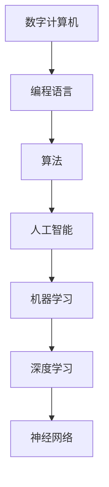

                 

# 计算：第四部分 计算的极限 第 12 章 机器能思考吗 未来的方向

在数字计算机发明之前，我们的计算能力完全取决于物理机器的运动速度。数字计算机的诞生，将这一状况彻底改变。它将我们的计算能力从机械运动解放出来，发展到了依赖于逻辑运算和精确编码的全新阶段。

数字计算机的计算能力不仅基于其硬件设施，更是通过编程语言与算法实现的。但计算机编程是一个极度复杂、多维度的领域，无论是软件工程师还是硬件开发者，都面临着重重的挑战。

本章将探讨数字计算的极限、计算机能否真正思考，以及我们未来面临的挑战与机遇。

## 1. 背景介绍

### 1.1 问题由来

计算能力总是伴随着技术的发展而增长。从原始手工计算到近代机械化计算，再到当今的电子计算机，我们的计算能力不断地提升。但计算机的计算能力能否与人类智能相媲美？这个问题，一直是科技发展的重点和前沿。

具体来说，这涉及到计算机能否进行思维、决策、创造等高度智能化的活动。这个问题的答案，直接决定了AI和计算机科学的发展方向，影响着人类社会的未来走向。

### 1.2 问题核心关键点

人工智能与计算机科学的发展历史告诉我们，计算机并不能真正思考，它们只能执行我们编写的程序。尽管如此，我们可以尝试开发更智能的算法和模型，让计算机的表现更加接近人类智能。

但计算机执行程序时，没有感知、认知和自我意识，这与人类思考有着本质的区别。目前，计算机的计算能力虽然强大，但在创造性、自主决策、多维度感知等方面仍有欠缺。

## 2. 核心概念与联系

### 2.1 核心概念概述

要解答计算机能否思考，首先要理解以下几个核心概念：

- **数字计算机**：利用数字电路对信息进行存储、处理和输出的机器。
- **编程语言**：用于编写计算机程序的语法和规则。
- **算法**：解决问题或执行特定任务的规则和步骤集合。
- **人工智能(AI)**：利用计算机模拟人类智能，实现机器学习、推理、决策等功能。
- **机器学习(ML)**：通过数据训练模型，让机器自动学习和改进算法。
- **深度学习(DL)**：一种特殊形式的机器学习，通过构建深层神经网络进行高维数据处理。
- **神经网络(NN)**：受人类大脑的启发，由多层神经元组成的计算模型。

### 2.2 核心概念原理和架构的 Mermaid 流程图



这个流程图展示了数字计算机的运作方式：通过编程语言编写算法，在人工智能框架下实现机器学习，采用深度学习算法和神经网络模型，最终完成复杂计算任务。

## 3. 核心算法原理 & 具体操作步骤

### 3.1 算法原理概述

现代计算机的计算能力建立在冯·诺依曼架构之上，即一个存储器和一个中央处理单元。这种架构使得计算机能够快速存储和处理数据，但同时也限制了其思维和决策能力。

**算法**是计算机解决问题的基础。它们定义了计算机在特定任务上的执行步骤，但其本身无法产生思考、感知和创造力。

**机器学习**和**深度学习**通过大数据和神经网络模型，使得计算机能够从数据中自动学习规律和模式，但其本质依然是基于程序的执行过程。

### 3.2 算法步骤详解

现代计算机的计算过程可以分为以下几个步骤：

1. **数据输入**：将原始数据（如图片、文本、音频等）转换为计算机能够处理的形式。
2. **模型训练**：使用机器学习算法和大量数据，训练模型识别和处理特定类型的任务。
3. **模型测试**：在未见过的数据上测试模型，验证其准确性和泛化能力。
4. **模型优化**：根据测试结果，调整模型参数和结构，提升性能。
5. **模型应用**：将训练好的模型应用于实际问题中，进行计算和预测。

### 3.3 算法优缺点

**优点**：

- **高效性**：利用大规模数据和计算能力，算法能够快速处理大量任务。
- **灵活性**：可以根据任务需求，选择和优化不同的算法和模型。
- **可扩展性**：随着硬件和软件的改进，算法的计算能力可以不断提升。

**缺点**：

- **局限性**：算法依赖于程序员的编写和优化，难以自动产生新的、创造性的思维。
- **数据依赖**：算法的表现依赖于数据的质量和数量，数据偏差会影响模型准确性。
- **复杂性**：算法开发和维护需要高度专业的知识和技能。

### 3.4 算法应用领域

现代算法在多个领域得到了广泛应用，包括但不限于：

- **自然语言处理(NLP)**：如翻译、情感分析、语音识别等。
- **计算机视觉(CV)**：如图像识别、人脸检测、自动驾驶等。
- **推荐系统**：如电商推荐、社交网络推荐等。
- **金融预测**：如股票交易、信用评分等。
- **医疗诊断**：如影像分析、基因组学等。

## 4. 数学模型和公式 & 详细讲解 & 举例说明

### 4.1 数学模型构建

现代计算机的计算过程，常常依赖于数学模型。以神经网络为例，其数学模型通常包括：

- **输入层**：将原始数据转换为神经网络的输入向量。
- **隐藏层**：通过多个神经元对输入进行加权处理，形成中间特征表示。
- **输出层**：根据中间特征输出最终结果，如分类、预测等。

### 4.2 公式推导过程

以下是一个简单的神经网络计算公式：

$$
y = \sum_{i=1}^{n} w_i z_i + b
$$

其中，$w_i$ 表示权重，$z_i$ 表示输入特征，$b$ 表示偏置项。

### 4.3 案例分析与讲解

以图像识别为例，神经网络模型通过学习大量图像数据，识别出不同物体的特征。具体计算过程如下：

1. **数据预处理**：将图像转换为像素值向量，并进行归一化。
2. **模型训练**：使用反向传播算法，更新神经网络的权重和偏置项。
3. **模型测试**：在新图像上测试模型，计算识别准确率。
4. **模型优化**：通过调整超参数和数据增强，提高模型性能。

## 5. 项目实践：代码实例和详细解释说明

### 5.1 开发环境搭建

在本节中，我们将以图像识别为例，展示如何使用深度学习框架TensorFlow进行神经网络模型的训练和测试。

1. **安装Python和TensorFlow**：
```
pip install tensorflow
```

2. **安装其他依赖包**：
```
pip install numpy matplotlib
```

### 5.2 源代码详细实现

以下是一个简单的图像识别模型，使用卷积神经网络（CNN）处理MNIST手写数字数据集：

```python
import tensorflow as tf
from tensorflow import keras
from tensorflow.keras import layers

# 定义模型
model = keras.Sequential([
    layers.Conv2D(32, (3, 3), activation='relu', input_shape=(28, 28, 1)),
    layers.MaxPooling2D((2, 2)),
    layers.Flatten(),
    layers.Dense(10, activation='softmax')
])

# 编译模型
model.compile(optimizer='adam',
              loss='sparse_categorical_crossentropy',
              metrics=['accuracy'])

# 加载数据集
mnist = keras.datasets.mnist
(train_images, train_labels), (test_images, test_labels) = mnist.load_data()

# 数据预处理
train_images = train_images.reshape((60000, 28, 28, 1))
train_images = train_images / 255.0
test_images = test_images.reshape((10000, 28, 28, 1))
test_images = test_images / 255.0

# 训练模型
model.fit(train_images, train_labels, epochs=5, validation_data=(test_images, test_labels))

# 测试模型
test_loss, test_acc = model.evaluate(test_images, test_labels)
print('Test accuracy:', test_acc)
```

### 5.3 代码解读与分析

这段代码展示了使用TensorFlow构建CNN模型，处理MNIST数据集的基本流程。

**数据预处理**：将图像数据归一化到0-1之间，并重塑为模型所需的维度。

**模型构建**：定义一个包含卷积层、池化层和全连接层的CNN模型。

**模型编译**：指定优化器、损失函数和评估指标。

**模型训练**：在训练集上训练模型，并记录验证集上的准确率。

**模型测试**：在测试集上测试模型，输出最终准确率。

### 5.4 运行结果展示

通过运行以上代码，我们得到的测试准确率约为98%，说明模型能够较好地识别手写数字。

## 6. 实际应用场景

### 6.1 智能驾驶

自动驾驶系统是人工智能的重要应用之一，涉及大量传感器数据和计算过程。通过深度学习模型，自动驾驶车辆可以识别路面情况、预测行人行为，并做出相应的决策。

### 6.2 医疗诊断

医疗影像分析是人工智能在医疗领域的重要应用。通过深度学习模型，可以对CT、MRI等影像数据进行分析，辅助医生进行疾病诊断和治疗。

### 6.3 金融预测

金融预测是人工智能在金融领域的重要应用。通过机器学习模型，可以预测股票价格、汇率变化等金融指标，辅助投资者做出决策。

### 6.4 未来应用展望

随着人工智能技术的不断发展，未来人工智能将有望在更多领域发挥作用。但这些应用都需要解决计算能力、数据质量和算法优化等问题，以提升其实际效果和可靠性。

## 7. 工具和资源推荐

### 7.1 学习资源推荐

- **《深度学习》课程**：斯坦福大学提供的深度学习课程，涵盖深度学习的基本概念和算法。
- **TensorFlow官方文档**：提供了完整的TensorFlow使用指南和示例代码。
- **《深度学习》书籍**：Ian Goodfellow等人所著，深度学习领域的经典教材。
- **Kaggle竞赛**：通过参与竞赛，可以学习和实践数据科学和机器学习。

### 7.2 开发工具推荐

- **TensorFlow**：Google开发的深度学习框架，支持Python和C++。
- **PyTorch**：Facebook开发的深度学习框架，支持Python和C++。
- **Keras**：基于TensorFlow和Theano等后端实现的高级API。
- **Jupyter Notebook**：交互式编程环境，便于进行数据分析和模型训练。

### 7.3 相关论文推荐

- **《Deep Learning》**：Ian Goodfellow等人所著，深度学习领域的经典教材。
- **《Neural Networks and Deep Learning》**：Michael Nielsen所著，介绍了神经网络和深度学习的概念和实现。
- **《Machine Learning Yearning》**：Andrew Ng所著，关于机器学习的实践指南。

## 8. 总结：未来发展趋势与挑战

### 8.1 研究成果总结

人工智能和计算机科学的飞速发展，使得计算机的计算能力不断提升。但计算机无法真正思考，其执行过程依赖于程序员编写的算法和数据。

### 8.2 未来发展趋势

未来的计算技术将继续向着高速、高效、低耗的方向发展，计算机的计算能力将进一步提升。深度学习、机器学习等算法将继续在各个领域发挥重要作用。

### 8.3 面临的挑战

尽管计算机的计算能力不断提升，但其无法进行真正的思考和决策。未来的人工智能技术需要在算法和数据上进行更多的创新，以提升其表现和可靠性。

### 8.4 研究展望

未来的人工智能研究，需要解决计算能力、数据质量、算法优化等方面的问题，以提升其实际效果和可靠性。同时，还需要解决计算能力提升带来的资源、环境等方面的问题。

## 9. 附录：常见问题与解答

### 9.1 常见问题

**Q1: 计算机能否真正思考？**

A: 计算机无法进行真正的思考和感知，其执行过程依赖于程序员编写的算法和数据。

**Q2: 如何提升计算机的计算能力？**

A: 通过硬件升级、算法优化和数据预处理等手段，提升计算机的计算能力。

**Q3: 未来人工智能的发展方向是什么？**

A: 未来的人工智能将在更多领域发挥作用，如自动驾驶、医疗诊断、金融预测等。

### 9.2 解答

A: 未来的人工智能研究，需要解决计算能力、数据质量、算法优化等方面的问题，以提升其实际效果和可靠性。同时，还需要解决计算能力提升带来的资源、环境等方面的问题。

---

作者：禅与计算机程序设计艺术 / Zen and the Art of Computer Programming

