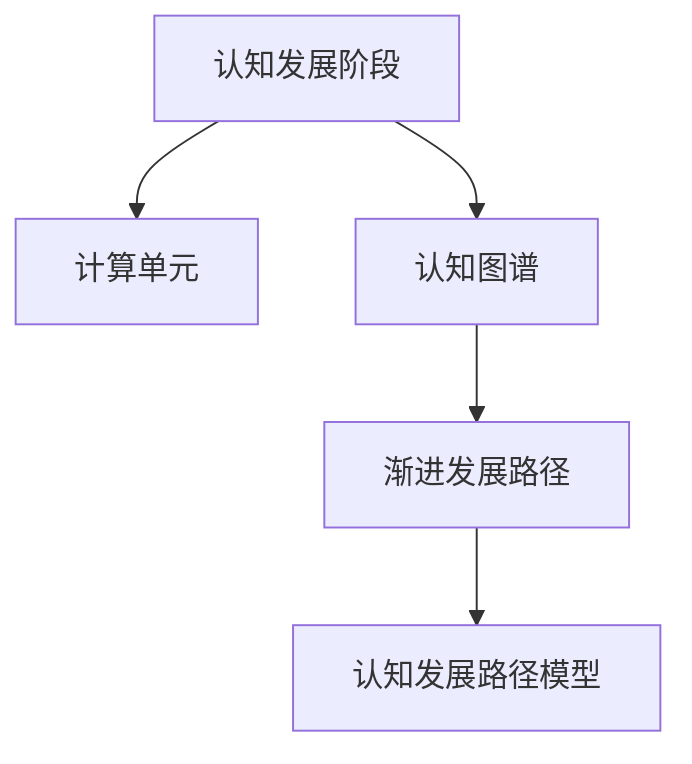

                 

# 认知渐进发展的路径模型

在认知科学的广阔领域中，探究人类认知发展的内在机制和路径一直是研究的热点。本文将围绕认知渐进发展的路径模型展开探讨，旨在为理解认知的动态过程、促进人工智能技术的认知化发展提供新的视角和方法。

## 1. 背景介绍

### 1.1 问题由来

人类认知能力的发展是一个复杂而漫长的过程，涉及神经生物学、心理学、教育学等多个学科的交叉研究。随着人工智能技术的不断进步，特别是深度学习在图像、语言处理等领域取得的突破，认知计算成为当前研究的前沿方向之一。认知计算旨在模拟人类认知机制，使机器具有类似人类的学习、理解、推理能力。然而，当前的人工智能系统更多关注具体任务的解决，缺乏对认知过程本身的研究。

### 1.2 问题核心关键点

本研究关注的是如何构建一个能够模拟认知发展路径的计算模型，使其能够反映认知过程的渐进性和层次性。具体来说，需要考虑以下几个关键点：
1. 认知发展路径的结构：如何构建一个基于神经心理学的认知发展路径模型。
2. 路径中各阶段的特性：不同认知阶段的特征、关键任务和计算机制。
3. 模型的应用领域：在人工智能、教育、心理辅导等方面的实际应用。
4. 模型的优化与改进：针对不同任务和应用场景的模型优化策略。

### 1.3 问题研究意义

研究认知渐进发展的路径模型，对于深化对认知机制的理解、推动人工智能的认知化发展具有重要意义：
1. 提升人工智能的泛化能力。通过模拟人类认知发展的路径，使模型能够更好地适应新任务和环境变化。
2. 促进教育技术的创新。认知模型可以作为教育技术的核心，辅助学生认知能力的提升和个性化学习路径的设计。
3. 提升心理辅导的效果。模拟人类认知发展的过程，为心理健康评估和干预提供新的方法和工具。
4. 推动跨学科研究。认知模型的构建需要跨学科知识和技术，促进了认知科学、人工智能、心理学等领域的融合。

## 2. 核心概念与联系

### 2.1 核心概念概述

本节将介绍几个与认知渐进发展路径模型相关的核心概念：

- 认知发展阶段：按照皮亚杰等心理学家的理论，人类认知能力发展可以分为感知运动阶段、前运算阶段、具体运算阶段和形式运算阶段。每个阶段有其特有的认知特征和计算机制。
- 计算单元：类似于神经元的计算单元，负责对输入信息进行加工处理，输出新的信息。
- 认知图谱：用于表示不同认知阶段之间的连接关系，反映认知发展的层次性和路径。
- 渐进发展路径：基于认知图谱的计算模型，模拟认知发展的渐进过程。

这些核心概念之间的逻辑关系可以通过以下Mermaid流程图来展示：



这个流程图展示了核心概念之间的相互关系：

1. 认知发展阶段为计算单元提供基础特征和任务，使其能够适应不同的认知过程。
2. 认知图谱描述了不同阶段之间的连接关系，反映认知发展的层次性和方向性。
3. 渐进发展路径是基于认知图谱构建的计算模型，模拟认知发展的渐进过程。
4. 认知发展路径模型则是将渐进路径模型应用于具体任务和领域，实现认知功能的计算模拟。

## 3. 核心算法原理 & 具体操作步骤

### 3.1 算法原理概述

认知渐进发展路径模型的核心思想是模拟人类认知过程的渐进性和层次性。其计算框架主要由三个部分构成：认知单元、认知图谱和渐进发展路径。具体算法原理如下：

1. **认知单元**：每个认知单元接收输入信息，根据当前认知阶段的特征进行信息处理和计算，输出新的信息。
2. **认知图谱**：用于描述不同认知阶段之间的连接关系，每个阶段对应于特定的计算单元和任务。
3. **渐进发展路径**：按照认知图谱构建的计算模型，模拟认知发展的渐进过程，从低级阶段逐步向高级阶段过渡。

### 3.2 算法步骤详解

#### 3.2.1 认知单元设计

1. **输入设计**：设计输入单元，负责接收外部信息。
   - 例如，在感知运动阶段，输入可以是视觉、听觉等感知信息。
   - 在语言阶段，输入可以是文本或语音信息。

2. **计算单元功能**：定义计算单元的功能和计算规则。
   - 例如，在感知运动阶段，计算单元可以处理感知信息，提取特征并进行初步的判断。
   - 在语言阶段，计算单元可以进行语义分析、推理和生成。

3. **输出设计**：设计输出单元，负责输出计算结果。
   - 例如，在感知运动阶段，输出可以是简单的行为反应。
   - 在语言阶段，输出可以是自然语言的描述和推理结果。

#### 3.2.2 认知图谱构建

1. **阶段划分**：根据皮亚杰等心理学家的理论，划分认知发展阶段，如感知运动、前运算、具体运算和形式运算阶段。
2. **阶段连接**：定义不同阶段之间的连接关系，如计算单元、任务和信息流的传递路径。
3. **阶段特征**：描述每个认知阶段的特征，如认知能力、信息处理方式和关键任务。

#### 3.2.3 渐进发展路径构建

1. **路径设计**：根据认知图谱设计渐进发展路径，从低级阶段逐步过渡到高级阶段。
2. **路径优化**：通过优化计算单元和认知图谱，提高路径的适应性和鲁棒性。
3. **路径应用**：将渐进路径模型应用于具体任务和领域，实现认知功能的计算模拟。

#### 3.2.4 示例说明

以语言阶段的计算模型为例，展示认知渐进发展路径模型的构建过程：

1. **输入设计**：接收文本或语音信息，作为计算单元的输入。
2. **计算单元功能**：进行语言处理，如分词、语法分析、语义理解等。
3. **输出设计**：生成自然语言描述和推理结果，作为计算单元的输出。

### 3.3 算法优缺点

认知渐进发展路径模型具有以下优点：
1. 模拟人类认知发展的渐进性和层次性，具有较强的适应性和泛化能力。
2. 提供了一个跨学科的研究平台，促进认知科学、人工智能、心理学等领域的融合。
3. 可以应用于多个领域，如教育、心理辅导、人工智能等，具有广泛的适用性。

同时，该模型也存在一定的局限性：
1. 需要大量的领域知识，构建认知图谱和计算单元需要跨学科的专业知识。
2. 模型复杂度较高，设计和实现成本较高。
3. 对于特定任务，模型的计算效率可能较低，需要进一步优化。

### 3.4 算法应用领域

认知渐进发展路径模型在多个领域具有广泛的应用前景：

- 教育技术：可以设计个性化的学习路径，帮助学生逐步提升认知能力。
- 人工智能：通过模拟人类认知过程，提升人工智能系统的泛化能力和适应性。
- 心理辅导：通过模拟认知发展过程，为心理健康评估和干预提供新的方法和工具。
- 机器人控制：设计模拟人类认知的路径模型，提高机器人的智能水平和适应性。

## 4. 数学模型和公式 & 详细讲解 & 举例说明

### 4.1 数学模型构建

本节将使用数学语言对认知渐进发展路径模型的构建过程进行严格刻画。

记认知发展阶段为 $S_k=\{S_1, S_2, ..., S_n\}$，其中 $S_k$ 表示第 $k$ 个认知阶段。每个阶段 $S_k$ 由一组计算单元 $U_k=\{u_{k1}, u_{k2}, ..., u_{km}\}$ 组成，每个计算单元 $u_{ki}$ 接收输入 $x_{ki}$，输出 $y_{ki}$。

认知图谱 $G$ 可以表示为：

$$
G = \{(S_i, S_j)\} \quad \text{其中} \quad S_i, S_j \in S_k, k \in \{1,2,...,n\}
$$

表示认知阶段之间的连接关系。渐进发展路径 $P$ 可以表示为：

$$
P = \{u_{ki} \rightarrow u_{k+1,i} \quad \text{其中} \quad i \in \{1,2,...,m\}, k \in \{1,2,...,n-1\}
$$

表示认知阶段之间的信息流传递路径。

### 4.2 公式推导过程

以下我们以语言阶段的计算模型为例，推导模型的数学表达式及其优化方法。

假设计算单元 $u_{ki}$ 接收输入 $x_{ki}$，输出 $y_{ki}$。语言阶段的计算模型可以表示为：

$$
y_{ki} = f_k(x_{ki}, w_k)
$$

其中 $f_k$ 为第 $k$ 阶段的计算函数，$w_k$ 为计算单元的权重参数。

根据认知图谱 $G$ 和渐进发展路径 $P$，语言阶段的计算模型可以进一步表示为：

$$
y_{ki} = f_k(x_{ki}, w_k) = \sum_{j=1}^{m_{k-1}} w_{k-1j} f_{k-1}(x_{k-1j}, w_{k-1j})
$$

其中 $f_{k-1}$ 为第 $k-1$ 阶段的计算函数，$w_{k-1j}$ 为第 $k-1$ 阶段到第 $k$ 阶段的连接权重。

对于语言阶段的计算模型，需要设计合适的损失函数，最小化模型输出与真实标签之间的差异。以分类任务为例，定义交叉熵损失函数：

$$
L(y_{ki}, y_i) = -\sum_{i=1}^N [y_i \log \hat{y}_i + (1-y_i) \log (1-\hat{y}_i)]
$$

其中 $y_i$ 为真实标签，$\hat{y}_i$ 为模型输出，$N$ 为样本数量。

### 4.3 案例分析与讲解

以文本分类任务为例，展示认知渐进发展路径模型在具体任务中的应用过程：

1. **感知运动阶段**：将输入文本进行分词和初步处理，输出特征向量。
2. **前运算阶段**：对特征向量进行语法分析和语义理解，提取关键词和主题。
3. **具体运算阶段**：根据关键词和主题，进行分类，生成分类结果。
4. **形式运算阶段**：对分类结果进行优化和后处理，输出最终的分类结果。

通过认知渐进发展路径模型，可以将文本分类任务分解为多个认知阶段，每个阶段负责特定的信息处理任务。模型可以逐步学习并提升每个阶段的计算能力，最终实现对文本的准确分类。

## 5. 项目实践：代码实例和详细解释说明

### 5.1 开发环境搭建

在进行认知渐进发展路径模型的实践前，我们需要准备好开发环境。以下是使用Python进行PyTorch开发的环境配置流程：

1. 安装Anaconda：从官网下载并安装Anaconda，用于创建独立的Python环境。

2. 创建并激活虚拟环境：
```bash
conda create -n cognitive-model-env python=3.8 
conda activate cognitive-model-env
```

3. 安装PyTorch：根据CUDA版本，从官网获取对应的安装命令。例如：
```bash
conda install pytorch torchvision torchaudio cudatoolkit=11.1 -c pytorch -c conda-forge
```

4. 安装TensorBoard：
```bash
pip install tensorboard
```

5. 安装各类工具包：
```bash
pip install numpy pandas scikit-learn matplotlib tqdm jupyter notebook ipython
```

完成上述步骤后，即可在`cognitive-model-env`环境中开始模型的开发和训练。

### 5.2 源代码详细实现

这里我们以语言阶段为例，展示使用PyTorch实现认知渐进发展路径模型的代码实现。

首先，定义认知阶段的计算单元：

```python
import torch.nn as nn
import torch

class CognitiveUnit(nn.Module):
    def __init__(self, input_size, output_size):
        super(CognitiveUnit, self).__init__()
        self.fc1 = nn.Linear(input_size, output_size)
        self.fc2 = nn.Linear(output_size, output_size)
    
    def forward(self, x):
        x = self.fc1(x)
        x = torch.sigmoid(x)
        x = self.fc2(x)
        return x
```

然后，定义认知阶段之间的连接关系：

```python
class CognitiveGraph(nn.Module):
    def __init__(self, units):
        super(CognitiveGraph, self).__init__()
        self.units = units
        self.layers = nn.ModuleList([CognitiveUnit(units[i], units[i+1]) for i in range(len(units)-1)])
    
    def forward(self, x):
        for layer in self.layers:
            x = layer(x)
        return x
```

接着，定义渐进发展路径：

```python
class CognitivePath(nn.Module):
    def __init__(self, units):
        super(CognitivePath, self).__init__()
        self.layers = nn.ModuleList([CognitiveGraph(units[i], units[i+1]) for i in range(len(units)-1)])
    
    def forward(self, x):
        for layer in self.layers:
            x = layer(x)
        return x
```

最后，定义模型的整体结构：

```python
class CognitiveModel(nn.Module):
    def __init__(self, units, input_size, output_size):
        super(CognitiveModel, self).__init__()
        self.input_layer = nn.Linear(input_size, units[0])
        self.path = CognitivePath(units)
        self.output_layer = nn.Linear(units[-1], output_size)
    
    def forward(self, x):
        x = self.input_layer(x)
        x = self.path(x)
        x = self.output_layer(x)
        return x
```

完成上述步骤后，即可构建认知渐进发展路径模型的完整结构。

### 5.3 代码解读与分析

让我们再详细解读一下关键代码的实现细节：

**CognitiveUnit类**：
- 定义了一个简单的认知单元，接收输入信息，经过两次线性变换，输出新的信息。

**CognitiveGraph类**：
- 定义了认知阶段之间的连接关系，通过多个认知单元组成认知阶段。

**CognitivePath类**：
- 定义了认知阶段之间的渐进路径，通过多个认知阶段进行信息流的传递。

**CognitiveModel类**：
- 定义了认知渐进发展路径模型的整体结构，包括输入层、计算路径和输出层。

在实际应用中，还需要根据具体任务的需求，对认知阶段和计算单元进行优化设计，以提升模型的性能。

## 6. 实际应用场景

### 6.1 智能教育系统

认知渐进发展路径模型可以应用于智能教育系统，帮助学生逐步提升认知能力。通过模拟认知发展的渐进路径，系统可以设计个性化的学习路径，根据学生的认知水平和需求，推荐合适的学习内容和练习题目，逐步提升学生的认知能力。

### 6.2 医疗诊断系统

在医疗诊断领域，认知渐进发展路径模型可以用于辅助医生进行诊断。通过模拟人类认知过程，模型可以逐步学习疾病的诊断路径和知识图谱，辅助医生进行疾病的早期发现和诊断，提升医疗服务的质量和效率。

### 6.3 智能客服系统

智能客服系统可以应用认知渐进发展路径模型，模拟认知发展的渐进路径，逐步提升系统的智能水平。通过设计认知阶段的计算单元，系统可以逐步学习用户的意图和需求，提供更加准确和智能的客服响应。

### 6.4 未来应用展望

未来，认知渐进发展路径模型将在更多领域得到应用，为人类认知智能的进化带来深远影响：

- 在智慧医疗领域，通过模拟认知过程，提升医疗服务的智能化水平，辅助医生诊疗，加速新药开发进程。
- 在智能教育领域，通过个性化的学习路径设计，提升教育质量，促进教育公平。
- 在智慧城市治理中，通过认知模型，提升城市管理的自动化和智能化水平，构建更安全、高效的未来城市。
- 在企业生产、社会治理、文娱传媒等众多领域，认知模型将成为人工智能落地应用的重要手段，为经济社会发展注入新的动力。

## 7. 工具和资源推荐

### 7.1 学习资源推荐

为了帮助开发者系统掌握认知渐进发展路径模型的理论基础和实践技巧，这里推荐一些优质的学习资源：

1. 《认知计算基础》系列书籍：详细介绍了认知计算的基本概念、发展历程和应用前景，适合初学者入门。

2. 《认知科学导论》课程：由斯坦福大学开设的认知科学课程，涵盖认知心理学的基本理论和实证研究，帮助理解认知过程的神经基础。

3. 《深度学习理论与实践》书籍：详细介绍了深度学习的理论和算法，结合认知计算的实际应用，提供了丰富的案例和实践指南。

4. 《认知计算：从理论到实践》论文：介绍了认知计算的基本框架和实现方法，为认知模型的构建提供了理论基础。

5. 《深度学习在认知计算中的应用》会议：聚焦深度学习在认知计算中的应用，展示了最新研究成果和技术进展。

通过对这些资源的学习实践，相信你一定能够快速掌握认知渐进发展路径模型的精髓，并用于解决实际的认知问题。

### 7.2 开发工具推荐

高效的开发离不开优秀的工具支持。以下是几款用于认知渐进发展路径模型开发的常用工具：

1. PyTorch：基于Python的开源深度学习框架，灵活动态的计算图，适合快速迭代研究。大部分认知计算模型都有PyTorch版本的实现。

2. TensorFlow：由Google主导开发的开源深度学习框架，生产部署方便，适合大规模工程应用。同样有丰富的认知计算模型资源。

3. Jupyter Notebook：交互式的开发环境，支持Python和多种数学库的实时交互，方便调试和展示计算过程。

4. Weights & Biases：模型训练的实验跟踪工具，可以记录和可视化模型训练过程中的各项指标，方便对比和调优。与主流深度学习框架无缝集成。

5. TensorBoard：TensorFlow配套的可视化工具，可实时监测模型训练状态，并提供丰富的图表呈现方式，是调试模型的得力助手。

合理利用这些工具，可以显著提升认知渐进发展路径模型的开发效率，加快创新迭代的步伐。

### 7.3 相关论文推荐

认知渐进发展路径模型的发展源于学界的持续研究。以下是几篇奠基性的相关论文，推荐阅读：

1. "A Framework for Cognitive Modeling"（认知建模框架）：提出了认知计算的基本框架，为认知模型的构建提供了理论基础。

2. "A Computational Theory of Cognitive Development"（认知发展的计算理论）：提出了认知发展的计算模型，为认知渐进路径的模拟提供了新的思路。

3. "Neural Computation of Language"（语言处理的神经计算）：介绍了语言处理的神经计算方法，展示了认知计算在语言处理中的应用。

4. "Cognitive Modeling in Education"（教育中的认知模型）：探讨了认知模型在教育中的应用，展示了认知渐进发展路径在个性化学习中的潜力。

5. "Cognitive Modeling in AI"（人工智能中的认知模型）：介绍了认知模型在人工智能中的应用，展示了认知计算在认知智能中的前景。

这些论文代表了大语言模型微调技术的发展脉络。通过学习这些前沿成果，可以帮助研究者把握学科前进方向，激发更多的创新灵感。

## 8. 总结：未来发展趋势与挑战

### 8.1 研究成果总结

本文对认知渐进发展路径模型的核心概念和实现方法进行了全面系统的介绍。首先阐述了认知渐进发展路径模型的背景和意义，明确了其对于理解认知机制和推动人工智能认知化发展的独特价值。其次，从原理到实践，详细讲解了认知渐进发展路径模型的数学模型和实现步骤，提供了完整的代码实例和详细解释。同时，本文还探讨了认知渐进发展路径模型在多个领域的实际应用前景，展示了其广阔的应用空间和潜力。

### 8.2 未来发展趋势

展望未来，认知渐进发展路径模型将呈现以下几个发展趋势：

1. 模型复杂度提升。随着计算资源和算法的进步，认知渐进发展路径模型的复杂度将进一步提升，能够模拟更加细致的认知过程。
2. 跨领域融合。认知模型将与其他人工智能技术如知识表示、因果推理等进行更深入的融合，提升模型的泛化能力和适应性。
3. 个性化设计。认知模型将进一步融入个性化设计，根据用户需求和反馈进行动态调整，实现更加定制化的认知服务。
4. 多模态融合。认知模型将支持多模态数据的融合，支持视觉、听觉、文本等多模态信息的协同处理和理解。
5. 实时化应用。认知模型将支持实时数据处理和推理，提升认知系统的响应速度和效率。

### 8.3 面临的挑战

尽管认知渐进发展路径模型在多个领域取得了一定进展，但在实际应用中仍面临诸多挑战：

1. 跨学科协作。认知模型涉及神经心理学、认知科学、人工智能等多个领域的知识，跨学科协作难度较大。
2. 数据稀缺性。认知模型的构建和训练需要大量高质量的数据，但相关数据资源相对稀缺。
3. 模型解释性。认知模型的决策过程较为复杂，缺乏可解释性和可理解性。
4. 应用场景限制。认知模型在特定领域的应用效果可能受到领域特定知识和规则的限制。
5. 实时性能。认知模型在实时数据处理和推理方面存在一定挑战，需要优化算法和计算资源。

### 8.4 研究展望

面对认知渐进发展路径模型所面临的挑战，未来的研究需要在以下几个方面寻求新的突破：

1. 数据增强技术。通过数据增强技术，扩大训练数据集，提升认知模型的泛化能力。
2. 多模态融合方法。通过多模态融合方法，提升认知模型的跨模态理解能力，支持多模态数据的协同处理。
3. 模型压缩与优化。通过模型压缩和优化，提升认知模型的实时性能和计算效率，支持大规模部署。
4. 跨学科研究。加强跨学科研究，促进认知科学、人工智能、心理学等领域的融合，提升认知模型的理论基础和应用前景。
5. 用户体验设计。注重用户体验设计，提升认知模型的可解释性和易用性，增强用户对认知模型的信任和接受度。

这些研究方向的研究进展，必将推动认知渐进发展路径模型的不断发展，为人工智能的认知化发展提供新的思路和方法。总之，认知渐进发展路径模型需要在理论与实践相结合的框架下，不断优化和创新，才能真正实现人工智能技术的认知化突破，推动人工智能技术的全面发展。

## 9. 附录：常见问题与解答

**Q1: 认知渐进发展路径模型与深度学习模型有何区别？**

A: 认知渐进发展路径模型和深度学习模型在构建方式和目标上存在一定区别。深度学习模型主要关注于具体任务的解决，通过大量标注数据进行训练，优化模型的参数，使其能够精确地预测目标变量。而认知渐进发展路径模型则更加关注认知过程的模拟，通过逐步学习认知发展的路径和阶段，提升模型的泛化能力和适应性。

**Q2: 认知渐进发展路径模型是否适用于所有领域？**

A: 认知渐进发展路径模型在多个领域具有广泛的应用前景，但在特定领域的应用效果可能受到领域特定知识和规则的限制。例如，在医学领域，需要根据临床知识和疾病模型进行定制化设计，才能取得较好的效果。因此，认知渐进发展路径模型需要根据具体领域进行优化和调整。

**Q3: 认知渐进发展路径模型在实际应用中需要注意哪些问题？**

A: 在实际应用中，认知渐进发展路径模型需要注意以下几个问题：
1. 数据稀缺性。认知模型的构建和训练需要大量高质量的数据，但相关数据资源相对稀缺。
2. 模型解释性。认知模型的决策过程较为复杂，缺乏可解释性和可理解性。
3. 实时性能。认知模型在实时数据处理和推理方面存在一定挑战，需要优化算法和计算资源。
4. 跨学科协作。认知模型涉及神经心理学、认知科学、人工智能等多个领域的知识，跨学科协作难度较大。

**Q4: 认知渐进发展路径模型在教育技术中的应用前景如何？**

A: 认知渐进发展路径模型在教育技术中具有广阔的应用前景。通过模拟认知发展的渐进路径，系统可以设计个性化的学习路径，根据学生的认知水平和需求，推荐合适的学习内容和练习题目，逐步提升学生的认知能力。

**Q5: 认知渐进发展路径模型在医疗诊断中的应用前景如何？**

A: 在医疗诊断领域，认知渐进发展路径模型可以用于辅助医生进行诊断。通过模拟人类认知过程，模型可以逐步学习疾病的诊断路径和知识图谱，辅助医生进行疾病的早期发现和诊断，提升医疗服务的质量和效率。

---

作者：禅与计算机程序设计艺术 / Zen and the Art of Computer Programming

