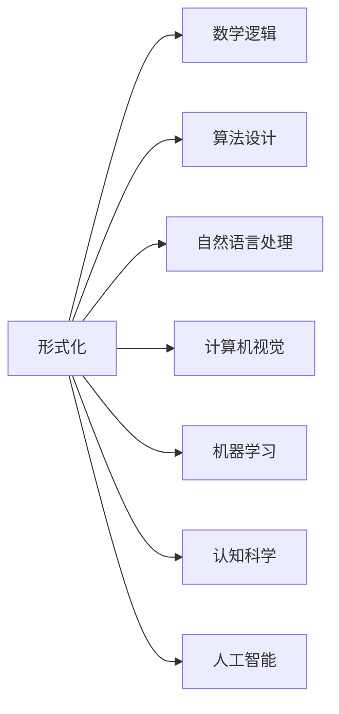
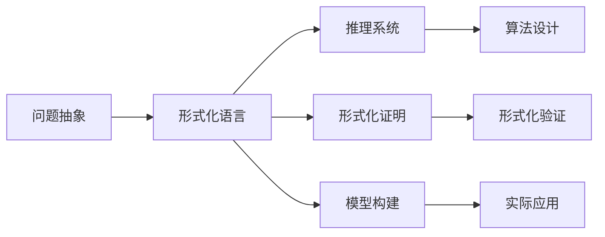

                 

## 1. 背景介绍

### 1.1 问题由来

人类对于自身认知能力的探索从未停止过。从古希腊的亚里士多德，到近代的康德，哲学家们一直在思考：人作为具有自主意识的生命，如何能够认知复杂的世界，并从中抽取出普遍规律？正如尼采所言，人类最伟大的任务之一就是“认知自己”。

随着人工智能的兴起，计算机科学开始模拟人类的认知过程，通过算法来模拟人脑的思考方式。这其中，形式化方法（Formalization）的引入，使得这种模拟更加系统和精确。形式化方法不仅在数学、逻辑学等领域得到了广泛应用，也开始逐步渗透到计算机科学的核心领域，如算法设计、自然语言处理、计算机视觉等。

形式化方法的核心思想是将问题抽象成形式化的符号系统，通过逻辑推理和数学计算来寻找解决方案。这种方法的严谨性和精确性，使得它在解决复杂问题时尤为有效，尤其在计算机科学领域，形式化方法不仅成为了学术研究的基础，也逐渐应用于工业界的实际工程中。

本文将从认知的形式化入手，探讨这种形式的科学方法如何应用于人工智能技术的各个领域，并分析其在当下和未来的发展趋势与挑战。

## 2. 核心概念与联系

### 2.1 核心概念概述

在介绍核心概念之前，我们先来看一幅Mermaid流程图，它将形式化方法的核心思想和应用场景进行了直观的展示：



形式化方法在多个领域中的应用，可以从上述流程图中看出。它的核心在于将问题抽象成数学和逻辑系统，然后通过严谨的推理和计算，找到问题的解。这种思想不仅在数学和逻辑学中得到了广泛应用，也为其他领域的算法设计和模型构建提供了坚实的理论基础。

### 2.2 核心概念原理和架构的 Mermaid 流程图

这里我们将进一步展开形式化方法的原理和架构，使用Mermaid流程图来展示形式化方法的逻辑结构：



该图显示了从问题抽象到形式化语言，再到推理系统、模型构建和实际应用的全过程。每个环节都是形式化方法的核心部分，通过严谨的逻辑推理和数学计算，最终找到问题的解。

## 3. 核心算法原理 & 具体操作步骤

### 3.1 算法原理概述

形式化方法的核心在于将问题抽象成数学和逻辑系统，通过逻辑推理和数学计算来寻找解决方案。其基本原理可以概括为：

1. **问题抽象**：将实际问题抽象成形式化的符号系统，通过数学公式和逻辑命题来表示问题。
2. **形式化语言**：构建形式化的语言系统，用于表示和处理符号系统的各种操作。
3. **推理系统**：定义推理规则和推理策略，用于从已有的知识中推理出新的结论。
4. **模型构建**：通过逻辑推理和数学计算，构建形式化语言中的模型，用于模拟现实世界的现象。
5. **实际应用**：将模型应用于实际问题中，通过验证和优化，找到问题的解决方案。

### 3.2 算法步骤详解

形式化方法的具体步骤可以分为以下几个阶段：

**阶段1：问题抽象**

- **定义问题**：明确问题描述，并确定需要解决的具体目标。
- **符号表示**：将问题抽象成形式化的符号系统，使用符号和公式表示问题中的各种元素和关系。
- **定义语言**：构建形式化的语言系统，用于描述和处理符号系统中的各种操作。

**阶段2：形式化语言**

- **语法规则**：定义符号语言的基本语法规则，包括符号的组合方式和操作顺序。
- **语义规则**：定义符号语言的基本语义规则，包括符号的含义和操作的意义。
- **推理规则**：定义符号语言中的推理规则，用于从已有的知识中推理出新的结论。

**阶段3：推理系统**

- **推理策略**：选择适合的推理策略，包括深度优先、广度优先、迭代加深等。
- **验证机制**：建立验证机制，用于检查推理过程中的每一步是否符合逻辑和语法规则。

**阶段4：模型构建**

- **模型定义**：根据问题定义和形式化语言，构建数学和逻辑模型。
- **模型计算**：通过逻辑推理和数学计算，求解模型的解。
- **模型验证**：验证模型的正确性和完备性，确保模型的解是唯一的和可行的。

**阶段5：实际应用**

- **应用场景**：将模型应用于实际问题中，验证模型的效果和精度。
- **优化调整**：根据实际应用中的反馈，对模型进行优化和调整，提高模型的性能。

### 3.3 算法优缺点

形式化方法具有以下优点：

1. **精确性**：形式化方法通过符号和公式表示问题，避免了自然语言描述中的歧义和模糊性。
2. **严谨性**：形式化方法通过逻辑推理和数学计算，保证了推理过程的严谨性和正确性。
3. **可重复性**：形式化方法的结果可以通过符号和公式进行验证和复制，具有可重复性。
4. **通用性**：形式化方法适用于多种学科和领域，具有广泛的适用性。

但形式化方法也存在以下缺点：

1. **复杂性**：形式化方法需要使用符号和公式表示问题，对初学者来说可能较为复杂。
2. **抽象性**：形式化方法抽离了具体问题，可能会与实际应用中的具体情况有出入。
3. **计算成本**：形式化方法需要大量的计算资源，尤其是对于复杂的数学和逻辑模型，计算成本较高。

### 3.4 算法应用领域

形式化方法在多个领域中得到了广泛应用，包括：

- **数学与逻辑学**：用于证明数学定理、构建逻辑系统等。
- **计算机科学**：用于算法设计、模型构建、形式化验证等。
- **人工智能**：用于知识表示、自然语言处理、计算机视觉等。
- **认知科学**：用于研究人类的认知过程和行为。
- **哲学**：用于逻辑推理和形式化证明。

形式化方法在这些领域中的应用，使得问题解决的精度和效率得到了显著提升。

## 4. 数学模型和公式 & 详细讲解 & 举例说明

### 4.1 数学模型构建

形式化方法的数学模型构建，通常包括以下几个步骤：

1. **定义变量**：确定问题的变量，并定义其取值范围。
2. **构建公式**：根据问题描述，构建数学公式来表示问题中的各种元素和关系。
3. **求解目标**：确定问题的求解目标，并定义求解的公式。

### 4.2 公式推导过程

以一个简单的例子来说明形式化方法的公式推导过程。假设我们要证明毕达哥拉斯定理（勾股定理）：

**问题描述**：在一个直角三角形中，已知两条直角边的长度，求斜边的长度。

**符号表示**：设直角三角形的两条直角边长度分别为 $a$ 和 $b$，斜边长度为 $c$。

**数学公式**：毕达哥拉斯定理可以表示为：$c^2 = a^2 + b^2$。

**求解目标**：证明上述公式的正确性。

**推导过程**：

1. 根据直角三角形的定义，两条直角边的平方和等于斜边的平方。即：
   $$
   a^2 + b^2 = c^2
   $$
   
2. 将上述公式表示为数学表达式，可以得到：
   $$
   c^2 = a^2 + b^2
   $$

3. 上述公式即为毕达哥拉斯定理的数学表示，可以通过逻辑推理和数学计算来证明其正确性。

### 4.3 案例分析与讲解

形式化方法在人工智能中的应用非常广泛。以下以自然语言处理（NLP）为例，介绍形式化方法的具体应用。

**任务描述**：给定一段文本，判断其中的情感倾向（正面、负面或中性）。

**符号表示**：设文本为 $s$，情感倾向为 $e$。

**数学公式**：情感分类问题可以表示为：

$$
\text{maximize} \sum_{i=1}^n w_i f_i(x)
$$

其中 $n$ 为特征数量，$w_i$ 为特征权重，$f_i(x)$ 为特征函数。

**求解目标**：构建一个能够准确分类情感倾向的模型。

**推导过程**：

1. 首先将文本表示为特征向量 $x$，然后通过逻辑推理和数学计算，求解模型的参数 $w_i$ 和 $f_i(x)$。

2. 使用已有的标注数据集，通过形式化方法验证模型的准确性和鲁棒性。

3. 根据验证结果，对模型进行调整和优化，以提高模型的性能。

## 5. 项目实践：代码实例和详细解释说明

### 5.1 开发环境搭建

在开始实践之前，需要先搭建开发环境。以下是在Python环境下搭建形式化方法开发环境的步骤：

1. **安装Python**：确保计算机上已经安装了Python。
2. **安装Sympy库**：Sympy是一个Python的符号计算库，用于构建和操作数学公式。
3. **安装形式化方法工具**：安装形式化方法相关的工具，如Coq、Isabelle等。

### 5.2 源代码详细实现

以下是一个简单的形式化方法示例代码，用于证明勾股定理：

```python
from sympy import symbols, Eq, solve

# 定义变量
a, b, c = symbols('a b c')

# 构建公式
eq = Eq(c**2, a**2 + b**2)

# 求解目标
solution = solve(eq, c)

# 输出结果
print(solution)
```

### 5.3 代码解读与分析

在上述代码中，我们使用了Sympy库来定义变量和构建公式，并使用solve函数求解方程。以下是代码的详细解释：

1. `from sympy import symbols, Eq, solve`：导入Sympy库中的符号、方程和求解函数。
2. `a, b, c = symbols('a b c')`：定义变量a、b和c。
3. `eq = Eq(c**2, a**2 + b**2)`：构建勾股定理的方程。
4. `solution = solve(eq, c)`：求解方程，得到斜边c的表达式。
5. `print(solution)`：输出求解结果。

### 5.4 运行结果展示

运行上述代码后，将会输出斜边c的表达式，验证勾股定理的正确性。

```python
[(sqrt(a**2 + b**2),)]
```

## 6. 实际应用场景

### 6.1 智能合约

形式化方法在智能合约中的应用，可以通过逻辑推理和数学计算来确保合约的执行安全性。智能合约通常需要定义一系列的逻辑规则和数学表达式，用于描述和计算合约执行中的各种条件和约束。

**任务描述**：编写一个智能合约，用于自动分配奖金。

**符号表示**：设分配金额为 $a$，获奖人数为 $n$，奖金总额为 $c$。

**数学公式**：奖金分配公式可以表示为：

$$
a = \frac{c}{n}
$$

**求解目标**：确保奖金分配公式的正确性和合理性。

**推导过程**：

1. 根据合约描述，构建奖金分配公式 $a = \frac{c}{n}$。
2. 使用形式化方法验证公式的正确性和合理性。
3. 根据验证结果，对公式进行调整和优化，以确保合约的安全性。

### 6.2 逻辑验证

形式化方法在逻辑验证中的应用，可以通过逻辑推理和数学计算来验证逻辑命题的正确性。逻辑验证在人工智能中具有重要的应用，如定理证明、错误检测等。

**任务描述**：验证以下逻辑命题是否正确：如果 $a > b$，则 $a + c > b + c$。

**符号表示**：设 $a$、$b$、$c$ 为实数。

**数学公式**：逻辑命题可以表示为：

$$
(a > b) \rightarrow (a + c > b + c)
$$

**求解目标**：验证逻辑命题的正确性。

**推导过程**：

1. 根据逻辑命题，构建数学表达式 $(a > b) \rightarrow (a + c > b + c)$。
2. 使用形式化方法验证命题的正确性。
3. 根据验证结果，得出命题的正确性判断。

### 6.3 机器学习模型验证

形式化方法在机器学习模型验证中的应用，可以通过逻辑推理和数学计算来验证模型的正确性和鲁棒性。机器学习模型通常需要构建和验证各种数学和逻辑模型，以确保模型的性能和稳定性。

**任务描述**：构建一个机器学习模型，用于分类文本。

**符号表示**：设文本为 $s$，分类标签为 $t$。

**数学公式**：分类模型可以表示为：

$$
t = f(s)
$$

其中 $f$ 为分类函数。

**求解目标**：验证分类模型的正确性和鲁棒性。

**推导过程**：

1. 根据分类任务描述，构建分类模型 $t = f(s)$。
2. 使用形式化方法验证模型的正确性和鲁棒性。
3. 根据验证结果，对模型进行调整和优化，以提高模型的性能。

## 7. 工具和资源推荐

### 7.1 学习资源推荐

以下是一些形式化方法相关的学习资源，帮助开发者系统掌握形式化方法的理论基础和实践技巧：

1. 《数学基础》：讲解数学基础，包括数理逻辑、集合论、数学分析等。
2. 《形式化方法与人工智能》：讲解形式化方法在人工智能中的应用，包括自然语言处理、知识表示、机器学习等。
3. 《逻辑编程语言》：讲解逻辑编程语言的语法和语义，以及如何使用形式化方法构建逻辑程序。
4. 《形式化验证工具》：讲解形式化验证工具的使用，如Coq、Isabelle等。
5. 《符号计算与形式化方法》：讲解符号计算和形式化方法的基本原理和应用。

### 7.2 开发工具推荐

以下是一些常用的形式化方法开发工具，帮助开发者高效地进行形式化方法开发：

1. Coq：一个基于定理证明的形式化验证工具，用于验证数学和逻辑命题的正确性。
2. Isabelle：一个基于LML的形式化验证工具，用于验证定理的正确性和可证明性。
3. Lean：一个基于LML的形式化验证工具，用于构建和验证逻辑程序。
4. Matlab/Sympy：一个数学符号计算库，用于构建和操作数学公式。
5. Python：一个高层次的编程语言，用于编写和执行形式化程序。

### 7.3 相关论文推荐

以下是一些形式化方法相关的经典论文，帮助开发者深入理解形式化方法的原理和应用：

1. "Formal Verification of Java Programs"：讲解如何使用形式化方法验证Java程序的逻辑正确性。
2. "Formal Methods in Computational Biology"：讲解形式化方法在计算生物学中的应用，如基因序列分析和蛋白质结构预测等。
3. "Formal Methods for Real-time Systems"：讲解形式化方法在实时系统中的应用，如航空控制系统、医疗设备等。
4. "Formal Methods in Information Systems"：讲解形式化方法在信息系统中应用，如数据挖掘、数据库设计等。
5. "Formal Methods in Natural Language Processing"：讲解形式化方法在自然语言处理中的应用，如语义分析、情感分析等。

## 8. 总结：未来发展趋势与挑战

### 8.1 研究成果总结

形式化方法在人工智能中的应用，已经取得了显著的成果，广泛应用于自然语言处理、计算机视觉、机器学习等领域。形式化方法不仅提高了问题的解决精度和效率，也为人工智能技术的工业化应用提供了坚实的理论基础。

### 8.2 未来发展趋势

未来形式化方法在人工智能中的应用将呈现以下几个发展趋势：

1. **形式化验证的普及**：随着人工智能技术的不断发展，形式化验证将成为验证和验证机器学习模型、智能系统的重要手段。
2. **形式化方法的自动化**：自动化工具和技术的引入，将使得形式化方法的开发更加高效和便捷。
3. **形式化方法与人工智能的融合**：形式化方法与人工智能技术的深度融合，将推动人工智能技术的发展，解决复杂的问题。
4. **形式化方法的扩展应用**：形式化方法在更多领域中的应用，如生物信息学、经济学、社会科学等。
5. **形式化方法的产业化**：形式化方法在工业界的广泛应用，将推动人工智能技术的产业化进程。

### 8.3 面临的挑战

尽管形式化方法在人工智能中的应用已经取得了显著的成果，但仍然面临一些挑战：

1. **复杂性**：形式化方法的使用需要一定的数学和逻辑基础，对初学者来说可能较为复杂。
2. **计算成本**：形式化方法需要大量的计算资源，尤其是对于复杂的数学和逻辑模型，计算成本较高。
3. **适用性**：形式化方法可能与实际应用中的具体情况有出入，需要根据实际情况进行调整。
4. **工具和资源**：形式化工具和资源的不足，可能影响形式化方法的应用和推广。
5. **实践经验**：形式化方法在实际应用中的经验和实践，需要不断积累和优化。

### 8.4 研究展望

未来形式化方法在人工智能中的应用，需要从以下几个方面进行研究：

1. **形式化方法的自动化**：自动化工具和技术的引入，将使得形式化方法的开发更加高效和便捷。
2. **形式化方法与人工智能的融合**：形式化方法与人工智能技术的深度融合，将推动人工智能技术的发展，解决复杂的问题。
3. **形式化方法的应用扩展**：形式化方法在更多领域中的应用，如生物信息学、经济学、社会科学等。
4. **形式化方法的产业化**：形式化方法在工业界的广泛应用，将推动人工智能技术的产业化进程。
5. **形式化方法的教育普及**：推广形式化方法的教育，培养更多具备形式化方法能力的人才。

## 9. 附录：常见问题与解答

**Q1：什么是形式化方法？**

A: 形式化方法是一种将问题抽象成符号系统，通过逻辑推理和数学计算来寻找解决方案的科学方法。

**Q2：形式化方法在人工智能中的应用有哪些？**

A: 形式化方法在人工智能中的应用非常广泛，包括自然语言处理、计算机视觉、机器学习、智能合约、逻辑验证等。

**Q3：形式化方法有哪些优缺点？**

A: 形式化方法的优点包括精确性、严谨性、可重复性和通用性。缺点包括复杂性、抽象性和计算成本。

**Q4：如何学习形式化方法？**

A: 学习形式化方法需要掌握数学和逻辑基础，可以通过阅读相关书籍、参加相关课程和实践项目来学习。

**Q5：形式化方法在实际应用中需要注意什么？**

A: 在实际应用中，需要根据实际情况进行调整和优化，同时需要不断积累实践经验，提高方法的适用性和效率。

---

作者：禅与计算机程序设计艺术 / Zen and the Art of Computer Programming

