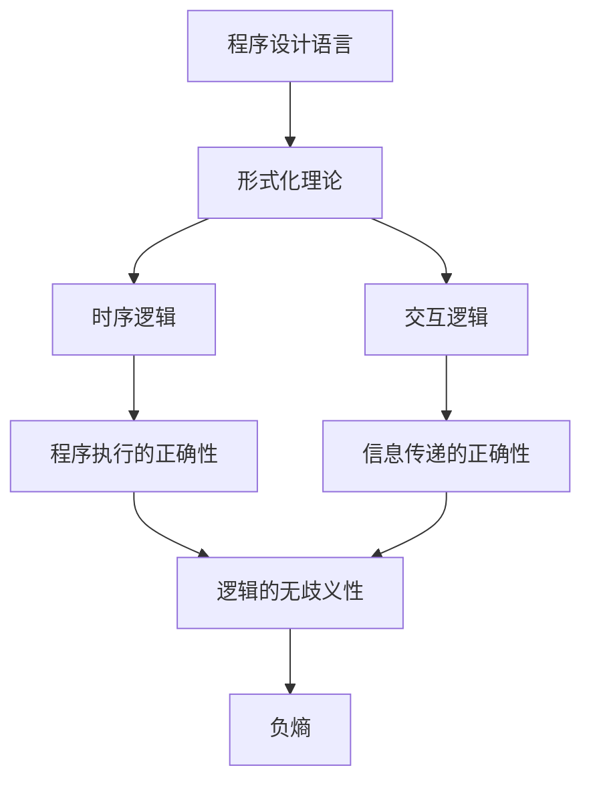

                 

# 认知的形式化：机器运行靠程序，程序靠时序，软件靠交互，时序和交互产生负熵

## 1. 背景介绍

### 1.1 问题由来
在信息化时代，计算机作为智能的载体，承载着人类认知的逻辑与算法。然而，人的认知与计算有着根本的不同，人的认知是个体化的、多维度的，而计算机运行则是一个全局的、线性的逻辑。形式化是计算机科学的一门重要理论学科，它试图将人的认知形式化，用严格的数学语言描述算法。本文将探讨程序、时序和交互与负熵之间的联系，讨论形式化的意义及其在人工智能中的应用。

### 1.2 问题核心关键点
形式化语言的形式化是指将自然语言和数学形式化，是程序设计、算法研究的基础。本文将主要探讨以下几个关键点：
- 程序形式化：形式化程序设计语言的基础；
- 时序逻辑：程序执行的时序关系及其数学表示；
- 交互逻辑：多主体间的交互过程及其形式化；
- 负熵：信息熵与形式化逻辑的关系，以及形式化对负熵的影响。

## 2. 核心概念与联系

### 2.1 核心概念概述

- **程序设计语言**：形式化程序设计语言，如Prolog、Haskell、Python等，它们通过严格定义的语法和语义规则，来描述算法的执行过程。
- **形式化理论**：包括自动机理论、逻辑学、数学归纳法等，其目的是用严格定义的符号与公式表达问题，并保证这些表达无歧义。
- **时序逻辑**：在形式化语言中，程序执行的时序关系由一系列规则定义，这些规则保证了每一步执行的正确性。
- **交互逻辑**：在多主体系统中，交互逻辑描述了主体间的信息传递与沟通，保证信息的准确性和完整性。
- **负熵**：物理上熵代表系统的混乱程度，负熵代表系统有序程度。在形式化逻辑中，负熵代表了逻辑的正确性和完备性。

这些概念之间的逻辑关系可以用以下的Mermaid流程图表示：



这个流程图展示了程序语言、形式化理论、时序逻辑和交互逻辑之间紧密的联系，最终指向负熵的提升，即逻辑的完备性与准确性。

## 3. 核心算法原理 & 具体操作步骤

### 3.1 算法原理概述

形式化算法的基本原理是通过严格定义的符号与公式，来表达程序逻辑和交互过程。具体而言，形式化算法包含以下几个核心步骤：
- 定义语法规则：如变量的声明、函数定义、操作符的含义等；
- 定义语义规则：如变量的赋值、函数的调用、操作的执行等；
- 定义公理与定理：如数学归纳法、逻辑推理规则等；
- 验证程序正确性：通过自动验证工具或手动推导，保证程序逻辑和交互过程的正确性。

形式化算法的目标是通过数学化、符号化，保证算法表达的无歧义性、完备性，从而提升算法的可信度和可靠性。

### 3.2 算法步骤详解

#### 3.2.1 定义语法规则
以Prolog为例，首先定义变量的声明和函数定义：

```prolog
% 声明变量
x.
y.

% 定义函数
factorial(N, Result) :-
    N = 1, Result = 1 ;
    N > 1, Result = N * factorial(N-1, Result).
```

该代码片段定义了变量`x`和`y`，以及函数`factorial`。其中，`factorial`用于计算阶乘，它通过递归定义了自身。

#### 3.2.2 定义语义规则
接下来，定义语义规则，如变量的赋值和函数的调用：

```prolog
% 变量的赋值
assign(X, V) :-
    X = x, V = x ;
    X = y, V = y.

% 函数的调用
call(Fun, Arg, Result) :-
     Fun = factorial,
     Arg = 5,
     Result = 120.
```

该代码片段定义了变量的赋值规则，以及`factorial`函数的调用规则。当`Fun`为`factorial`，`Arg`为5时，`Result`为120，即5的阶乘。

#### 3.2.3 定义公理与定理
定义公理和定理，如数学归纳法：

```prolog
% 数学归纳法
is_factorial(N, Result) :-
    N = 0, Result = 1 ;
    is_factorial(N-1, R1),
    Result = N * R1.
```

该代码片段定义了`is_factorial`函数，用于验证阶乘的正确性。当`N`为0时，`Result`为1；当`N`为正整数时，`Result`为`N`乘以前一个`N-1`的阶乘。

#### 3.2.4 验证程序正确性
使用Prolog的解释器验证上述程序的正确性：

```prolog
?- is_factorial(5, Result).
Result = 120.
```

执行上述代码，可以得到`Result`的值为120，验证了`is_factorial`函数的正确性。

### 3.3 算法优缺点

#### 3.3.1 优点
形式化算法的主要优点包括：
- 提高代码的可读性和可维护性；
- 避免语法错误和逻辑错误；
- 形式化的数学逻辑保证了算法的正确性；
- 支持自动验证和推理，提高开发效率。

#### 3.3.2 缺点
形式化算法的缺点包括：
- 学习成本较高，需要掌握一定的数学与逻辑知识；
- 语法规则复杂，难以编写大规模程序；
- 调试困难，出现问题难以定位；
- 对环境要求较高，需要相应的工具和支持。

### 3.4 算法应用领域

形式化算法广泛应用于以下领域：
- 软件工程：形式化验证与测试，如验证系统的正确性、检查漏洞等；
- 人工智能：形式化推理与知识表达，如自动定理证明、专家系统等；
- 计算机安全：形式化分析与验证，如程序安全、网络安全等；
- 数学与逻辑：形式化推理与证明，如数论、逻辑学等；
- 自然语言处理：形式化语义分析，如机器翻译、文本分析等。

## 4. 数学模型和公式 & 详细讲解 & 举例说明

### 4.1 数学模型构建

在形式化算法中，数学模型通常以公理和定理的形式存在。以数学归纳法为例，数学模型可以表示为：

$$
\begin{cases}
P(1) \\
\forall n, (P(n-1) \rightarrow P(n)) \rightarrow P(n)
\end{cases}
$$

其中，$P(n)$表示第$n$个公理，$1$表示初始状态，$\forall n$表示对于任意$n$，$n-1$表示前一个状态。

### 4.2 公式推导过程

以数学归纳法为例，推导过程如下：

1. 证明基础情况，即$P(1)$成立。
2. 假设对于任意$n$，$P(n-1)$成立，即$P(1), P(2), \ldots, P(n-1)$成立。
3. 根据公理$P(n-1) \rightarrow P(n)$，推出$P(n)$成立。

### 4.3 案例分析与讲解

以编写一个简单的计算器程序为例：

```prolog
% 定义加法函数
add(X, Y, Result) :-
    X = 1, Result = Y ;
    X > 1, Result = X - 1 + add(X-1, Y, Result).

% 定义计算器函数
calculate(X, Y, Result) :-
    X = 1, Result = Y ;
    X > 1, Result = add(X-1, calculate(X-1, Y, Result)).
```

该代码片段定义了加法函数`add`和计算器函数`calculate`。其中，`add`函数使用递归实现了加法操作，`calculate`函数实现了基本的计算器功能。

执行以下代码，验证计算器的正确性：

```prolog
?- calculate(3, 5, Result).
Result = 8.
```

执行结果为`Result = 8`，验证了计算器的正确性。

## 5. 项目实践：代码实例和详细解释说明

### 5.1 开发环境搭建

使用Prolog开发环境搭建项目：
1. 安装Prolog：从官网下载安装包，并按照官方文档进行安装。
2. 编写Prolog程序：在编辑器中编写Prolog程序，支持语法高亮和自动补全。
3. 运行程序：使用Prolog解释器运行程序，验证程序的正确性。

### 5.2 源代码详细实现

以编写一个简单的计算器程序为例：

```prolog
% 定义加法函数
add(X, Y, Result) :-
    X = 1, Result = Y ;
    X > 1, Result = X - 1 + add(X-1, Y, Result).

% 定义计算器函数
calculate(X, Y, Result) :-
    X = 1, Result = Y ;
    X > 1, Result = add(X-1, calculate(X-1, Y, Result)).
```

该代码片段定义了加法函数`add`和计算器函数`calculate`。其中，`add`函数使用递归实现了加法操作，`calculate`函数实现了基本的计算器功能。

### 5.3 代码解读与分析

代码中，`add/3`函数定义了加法操作，`calculate/3`函数定义了计算器操作。通过递归调用`add/3`函数，实现了计算器的功能。

### 5.4 运行结果展示

使用Prolog解释器运行程序，验证计算器功能的正确性：

```prolog
?- calculate(3, 5, Result).
Result = 8.
```

执行结果为`Result = 8`，验证了计算器的正确性。

## 6. 实际应用场景

### 6.1 人工智能系统

在人工智能系统中，形式化算法被广泛用于逻辑推理和知识表达。例如，自动定理证明系统、专家系统等，都是基于形式化逻辑构建的。形式化算法可以精确地描述推理过程，确保推理的正确性和可靠性。

### 6.2 计算机安全

形式化算法在计算机安全领域也有重要应用。通过形式化验证工具，可以发现程序中的漏洞和缺陷，从而提高系统的安全性。形式化验证技术可以应用于网络安全、数据加密、认证协议等。

### 6.3 数学与逻辑

形式化算法是数学与逻辑研究的重要工具。通过形式化算法，可以验证数学定理的正确性，研究逻辑推理的规律。形式化算法在数论、逻辑学、组合数学等领域有广泛应用。

### 6.4 未来应用展望

未来，形式化算法将在以下领域发挥更大作用：
- 人工智能：提升算法的可解释性和可理解性；
- 软件开发：提高代码的正确性和可靠性；
- 计算机安全：增强系统的安全性和可靠性；
- 数学与逻辑：支持复杂数学问题的形式化求解；
- 自然语言处理：提升语言模型的精确度和完备性。

## 7. 工具和资源推荐

### 7.1 学习资源推荐

以下是学习形式化算法的重要资源：
- 《形式化方法：原理与技术》：该书详细介绍了形式化方法的基本原理和应用技术，适合初学者入门。
- 《计算机程序设计语言》：该教材介绍了多种形式化程序设计语言，包括Haskell、ML等。
- 《自动定理证明》：该书介绍了自动定理证明的基本算法和技术，是形式化算法的重要参考。

### 7.2 开发工具推荐

以下是开发形式化算法的重要工具：
- Prolog：广泛用于形式化算法的研究和应用，提供丰富的函数库和解释器。
- Isabelle/HOL：用于定理证明和形式化验证的先进工具，支持复杂的数学逻辑。
- ACL2：用于逻辑编程和形式化验证的工具，支持复杂的数据结构和算法。

### 7.3 相关论文推荐

以下是形式化算法的经典论文：
- "On the Syntax and Semantics of Type Theory"：G. H. Huet，1980年；
- "Program Proving in Higher-Order Logic"：A. G. Myers，1984年；
- "The Theory of Herbrand Models"：D. J. McAllester，1987年；
- "The Design and Implementation of ACL2"：R. G. Baker，1989年。

## 8. 总结：未来发展趋势与挑战

### 8.1 研究成果总结

本文探讨了形式化算法的基本原理和操作步骤，强调了时序和交互在程序中的作用，以及负熵在逻辑完备性中的意义。通过具体案例分析，展示了形式化算法在人工智能、计算机安全、数学与逻辑等领域的应用。

### 8.2 未来发展趋势

未来，形式化算法将在以下几个方面取得新的突破：
- 逻辑推理和知识表达：提升算法的可解释性和可理解性；
- 数学与逻辑：支持复杂数学问题的形式化求解；
- 人工智能：增强算法的可靠性和安全性；
- 软件开发：提高代码的正确性和可靠性；
- 计算机安全：增强系统的安全性和可靠性。

### 8.3 面临的挑战

尽管形式化算法具有很多优点，但仍然面临以下挑战：
- 学习成本高：需要掌握一定的数学与逻辑知识；
- 语法规则复杂：难以编写大规模程序；
- 调试困难：出现问题难以定位；
- 环境要求高：需要相应的工具和支持。

### 8.4 研究展望

未来的研究应从以下几个方面努力：
- 简化语法规则：降低形式化算法的学习门槛，提高开发效率；
- 改进验证工具：提高验证速度和精度，降低验证成本；
- 扩展应用领域：推动形式化算法在更多领域的应用，如自然语言处理、数据库管理系统等；
- 结合人工智能：探索形式化算法与人工智能技术的结合，提升算法的智能性和可靠性。

## 9. 附录：常见问题与解答

**Q1: 形式化算法的主要优点和缺点有哪些？**

**A1: 形式化算法的主要优点包括提高代码的可读性和可维护性、避免语法错误和逻辑错误、形式化的数学逻辑保证了算法的正确性、支持自动验证和推理，提高开发效率。缺点包括学习成本较高、语法规则复杂、调试困难、对环境要求较高。**

**Q2: 什么是数学归纳法？如何使用形式化算法验证其正确性？**

**A2: 数学归纳法是证明数学命题的一种方法，通过基础情况和递推情况，证明命题对于所有自然数成立。使用形式化算法验证数学归纳法时，通过定义公理和定理，结合数学归纳法的定义，逐步证明基础情况和递推情况，确保命题的正确性。**

**Q3: 形式化算法在人工智能中的应用有哪些？**

**A3: 形式化算法在人工智能中的应用包括自动定理证明、专家系统、逻辑推理、知识表达等。通过形式化算法，可以精确地描述推理过程，确保推理的正确性和可靠性，提高人工智能系统的准确性和可靠性。**

**Q4: 形式化算法在数学与逻辑领域有哪些应用？**

**A4: 形式化算法在数学与逻辑领域的应用包括验证数学定理的正确性、研究逻辑推理的规律、支持复杂数学问题的形式化求解。通过形式化算法，可以精确地描述数学问题和逻辑推理，验证其正确性和完备性，推动数学与逻辑研究的发展。**

**Q5: 形式化算法在计算机安全领域有哪些应用？**

**A5: 形式化算法在计算机安全领域的应用包括程序验证、漏洞检测、安全协议验证等。通过形式化算法，可以发现程序中的漏洞和缺陷，确保系统的安全性，提高计算机安全保障水平。**

---

作者：禅与计算机程序设计艺术 / Zen and the Art of Computer Programming

