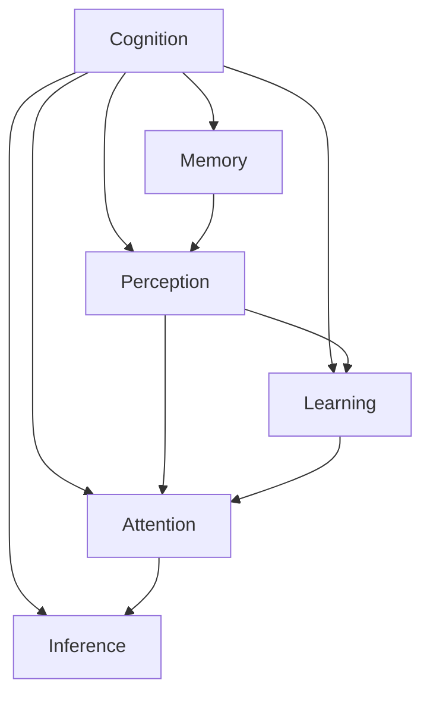

                 

# 认知的形式化：记忆让人类延续了过去和现在的认知

## 1. 背景介绍

在人类文明的发展历程中，认知扮演着极其重要的角色。认知不仅仅是获取知识和信息，更是一个不断吸收、存储、处理、应用信息的过程。记忆，作为认知的核心，让人类能够延续过去和现在的认知，进而创造未来。本文将围绕记忆与认知的关系，探讨记忆在人类思维中的形式化表示，以及如何通过计算机科学的方法，模拟和优化人类认知过程。

## 2. 核心概念与联系

### 2.1 核心概念概述

为更好地理解认知的形式化表示，本节将介绍几个密切相关的核心概念：

- 认知(Cognition)：指人脑接收、处理、储存和应用信息的能力。认知不仅包括感知、记忆、思维、判断、决策等过程，还涉及到情感、动机、意志等心理因素。

- 记忆(Memory)：指人脑存储和回忆过去经验和信息的能力。记忆分为短期记忆和长期记忆，包括显性记忆和隐性记忆。

- 知觉(Perception)：指人脑对感官信息进行识别和解释的过程。知觉依赖于感官输入，并在记忆中检索先前的经验信息。

- 学习(Learning)：指通过经验改变认知结构，从而获得新知识和技能的过程。学习是认知过程中的重要环节，依赖于记忆对信息的存储和检索。

- 注意力(Attention)：指人脑集中注意力于某些特定信息，排除无关干扰的能力。注意力机制在认知中起到筛选信息、提升效率的作用。

- 推理(Inference)：指基于已有知识和经验，对未知事实进行推理和预测的能力。推理依赖于记忆中存储的知识和经验。

这些核心概念之间的逻辑关系可以通过以下Mermaid流程图来展示：



这个流程图展示认知的各个核心概念及其相互关系：

1. 认知通过感知、学习、注意力等机制，形成对信息的接收和处理。
2. 记忆是认知的基础，它记录了过去和现在的信息，为学习、推理等过程提供数据支持。
3. 注意力和推理在认知中起到关键作用，帮助个体筛选有用信息，并基于记忆中的知识进行预测和决策。

### 2.2 核心概念原理和架构

- **认知**：认知是由感知、记忆、思维、情感等多种心理过程组成的复杂系统。现代认知科学通过神经科学、心理学、人工智能等跨学科的方法，深入理解认知的机制。认知可以形式化为一系列处理步骤，如信息接收、感知分析、记忆存储、推理决策等。

- **记忆**：记忆是一种存储和检索信息的机制，分为短期记忆和长期记忆。短期记忆主要通过工作记忆进行，容量有限，需不断复述以保持信息。长期记忆通过大脑皮层神经元之间的突触连接形成，可以长期存储。

- **知觉**：知觉是认知中信息接收和解释的关键步骤。它依赖于感官输入，并与记忆中的先验知识相互作用，形成对信息的解释。知觉的形式化表示通常涉及感官输入的预处理、特征提取和模式识别等步骤。

- **学习**：学习通过改变认知结构，增加新知识或调整已有认知。现代认知科学认为，学习涉及神经元之间的连接权重调整，可以通过强化学习、反向传播等算法模拟。

- **注意力**：注意力机制在认知中起到筛选信息、提升效率的作用。注意力可以看作一种注意力资源的管理机制，分配给重要的信息处理过程，排除无关干扰。

- **推理**：推理是通过逻辑和规则，从已知事实推导未知事实的过程。推理依赖于记忆中存储的知识和经验，通过逻辑运算和规则应用形成结果。

这些核心概念构成了认知的形式化表示基础，通过计算机科学的方法，可以模拟和优化人类认知过程。

## 3. 核心算法原理 & 具体操作步骤

### 3.1 算法原理概述

认知的形式化表示依赖于计算机科学中的多种算法和技术，如机器学习、深度学习、强化学习等。认知的形式化表示的核心思想是通过算法和模型，模拟人类认知的各个过程，形成对信息的处理、存储、应用。

- **感知**：感知过程可以通过计算机视觉、语音识别等技术实现。感知算法的核心是特征提取和模式识别，将感官输入转换为可处理的信息形式。

- **记忆**：记忆的实现依赖于数据结构和算法，如哈希表、链表、神经网络等。短期记忆通常通过工作记忆实现，使用如LSTM、GRU等循环神经网络。长期记忆的实现依赖于突触连接和权重调整，如神经网络中的反向传播算法。

- **学习**：学习通过模型参数的优化，模拟神经元之间的连接权重调整。常用的算法包括梯度下降、随机梯度下降、自适应学习率等。

- **注意力**：注意力机制通过分配注意力资源，筛选重要信息。深度学习中的注意力机制，如注意力池化、多头注意力等，可以模拟人类认知中的注意力分配过程。

- **推理**：推理过程依赖于逻辑和规则的应用。逻辑推理可以通过规则推理机、符号计算等方法实现，而统计推理则依赖于概率模型和贝叶斯网络。

### 3.2 算法步骤详解

认知的形式化表示涉及多个步骤，每个步骤都需要相应的算法和模型。以下是认知形式化表示的一般步骤：

**Step 1: 数据获取与预处理**
- 收集各种感官输入数据，如文本、图像、声音等。
- 对数据进行清洗、去噪、标准化等预处理操作，提高数据质量。

**Step 2: 感知与特征提取**
- 使用计算机视觉、语音识别等技术，将感官输入转换为特征表示。
- 通过特征提取算法，如卷积神经网络、循环神经网络等，提取关键特征。

**Step 3: 短期记忆与工作记忆**
- 使用短期记忆算法，如LSTM、GRU等，对信息进行存储和处理。
- 通过工作记忆的复述和更新，保持关键信息的短期记忆。

**Step 4: 长期记忆与突触权重调整**
- 使用长期记忆算法，如神经网络中的反向传播算法，调整突触权重，形成长期记忆。
- 通过参数优化算法，如梯度下降、随机梯度下降等，调整模型参数。

**Step 5: 注意力机制与信息筛选**
- 使用注意力机制，分配注意力资源，筛选重要信息。
- 通过注意力池化、多头注意力等方法，提升信息处理效率。

**Step 6: 推理与决策**
- 使用逻辑推理和统计推理，基于存储的知识和经验进行推理。
- 通过规则推理机、符号计算、贝叶斯网络等方法，形成推理结果。

**Step 7: 反馈与调整**
- 将推理结果反馈到感知、学习、注意力等过程，进行进一步调整和优化。
- 通过迭代优化算法，不断提高认知系统的性能。

### 3.3 算法优缺点

认知的形式化表示具有以下优点：

- 高度可扩展性：认知形式化表示可以应用于各种感官输入，通过多种算法和模型，形成复杂认知过程。
- 高效性：算法和模型的优化可以大幅提升信息处理效率，提高认知系统的性能。
- 可解释性：形式化表示可以提供对认知过程的详细解释，便于理解和学习。

同时，认知的形式化表示也存在一些缺点：

- 复杂性：认知过程涉及多种心理过程和生理机制，难以通过单一算法完全模拟。
- 数据需求高：算法和模型的优化依赖于大量高质量的数据，数据获取和处理成本较高。
- 实现难度大：认知形式化表示涉及多种技术和算法，实现难度较大，需要跨学科的知识和经验。

### 3.4 算法应用领域

认知的形式化表示在多个领域得到广泛应用，例如：

- 人机交互：通过认知形式化表示，实现智能聊天机器人、语音助手等应用。
- 智能推荐系统：通过认知模型，分析用户行为，推荐个性化的内容。
- 机器视觉：通过感知和推理算法，实现图像识别、目标检测等功能。
- 自动驾驶：通过感知、学习和推理算法，实现无人驾驶汽车。
- 自然语言处理：通过感知、记忆和推理算法，实现文本分类、情感分析等任务。
- 知识图谱：通过逻辑推理和统计推理算法，构建和维护知识图谱，支持知识查询和推理。

这些领域的应用展示了认知形式化表示的强大能力，也为认知科学的进一步研究提供了重要依据。

## 4. 数学模型和公式 & 详细讲解 & 举例说明

### 4.1 数学模型构建

为更好地理解认知的形式化表示，本节将介绍几种常见的数学模型和公式。

**感知模型**：
- 感知模型通常通过卷积神经网络(CNN)实现，其核心公式为：
$$
y_i = f(Wx_i + b)
$$
其中 $x_i$ 为输入特征，$W$ 和 $b$ 为模型参数，$f$ 为激活函数，$y_i$ 为输出。

**短期记忆模型**：
- 短期记忆模型如LSTM，其核心公式为：
$$
h_{t+1} = f(Wx_t + Uh_t + bh_t)
$$
$$
c_{t+1} = g(Wc_t + Uh_t + bc_t + di_t)
$$
$$
o_t = \sigma(Wo + Uh_t + bo)
$$
$$
h_t = o_t \odot \tanh(c_t)
$$
其中 $h_t$ 为隐藏状态，$c_t$ 为细胞状态，$x_t$ 为输入，$W$、$U$、$b$、$d$、$\sigma$、$f$、$g$ 为模型参数，$\odot$ 为逐元素乘法。

**长期记忆模型**：
- 长期记忆模型如反向传播算法，其核心公式为：
$$
\Delta_c = \frac{\partial L}{\partial c_t}
$$
$$
\Delta_h = \Delta_c \odot \tanh'(c_t)
$$
$$
\Delta_U = \frac{\partial L}{\partial U}
$$
$$
\Delta_W = \frac{\partial L}{\partial W}
$$
$$
\Delta_b = \frac{\partial L}{\partial b}
$$
其中 $L$ 为损失函数，$\Delta_c$、$\Delta_h$、$\Delta_U$、$\Delta_W$、$\Delta_b$ 为模型参数的梯度，$\tanh'$ 为$\tanh$函数的导数。

**注意力机制模型**：
- 注意力机制模型如多头注意力，其核心公式为：
$$
Q = XW_Q
$$
$$
K = XW_K
$$
$$
V = XW_V
$$
$$
A = \frac{e^{QK^T}}{\sqrt{d_k}}V
$$
$$
A = softmax(A)
$$
$$
A = A^TW
$$
其中 $X$ 为输入特征，$W_Q$、$W_K$、$W_V$ 为模型参数，$A$ 为注意力权重，$softmax$ 为softmax函数。

### 4.2 公式推导过程

以下是几个关键公式的推导过程：

**感知模型推导**：
- 以CNN为例，其核心公式为：
$$
y_i = f(Wx_i + b)
$$
其中 $x_i$ 为输入特征，$W$ 和 $b$ 为模型参数，$f$ 为激活函数，$y_i$ 为输出。
- 假设 $W$ 为卷积核，$x_i$ 为输入特征，$b$ 为偏置，$f$ 为ReLU激活函数，推导过程如下：
$$
y_i = \sum_{j=1}^n w_{ij}x_{ij} + b_i
$$
$$
y_i = f(y_i)
$$

**短期记忆模型推导**：
- 以LSTM为例，其核心公式为：
$$
h_{t+1} = f(Wx_t + Uh_t + bh_t)
$$
$$
c_{t+1} = g(Wc_t + Uh_t + bc_t + di_t)
$$
$$
o_t = \sigma(Wo + Uh_t + bo)
$$
$$
h_t = o_t \odot \tanh(c_t)
$$
其中 $h_t$ 为隐藏状态，$c_t$ 为细胞状态，$x_t$ 为输入，$W$、$U$、$b$、$d$、$\sigma$、$f$、$g$ 为模型参数，$\odot$ 为逐元素乘法。
- 以LSTM的输入门为例，推导过程如下：
$$
i_t = \sigma(Wi x_t + Ui h_{t-1} + bi)
$$
$$
f_t = \sigma(Wf x_t + Uf h_{t-1} + bf)
$$
$$
g_t = tanh(Wg x_t + Ug h_{t-1} + bg)
$$
$$
c_t = f_t * c_{t-1} + i_t * g_t
$$
$$
o_t = \sigma(Who x_t + Uo h_{t-1} + bo)
$$
$$
h_t = o_t * tanh(c_t)
$$

**长期记忆模型推导**：
- 以反向传播算法为例，其核心公式为：
$$
\Delta_c = \frac{\partial L}{\partial c_t}
$$
$$
\Delta_h = \Delta_c \odot \tanh'(c_t)
$$
$$
\Delta_U = \frac{\partial L}{\partial U}
$$
$$
\Delta_W = \frac{\partial L}{\partial W}
$$
$$
\Delta_b = \frac{\partial L}{\partial b}
$$
其中 $L$ 为损失函数，$\Delta_c$、$\Delta_h$、$\Delta_U$、$\Delta_W$、$\Delta_b$ 为模型参数的梯度，$\tanh'$ 为$\tanh$函数的导数。
- 以反向传播的链式法则为例，推导过程如下：
$$
\Delta L = \frac{\partial L}{\partial c_t} \Delta c_t
$$
$$
\Delta c_t = \frac{\partial c_t}{\partial h_{t-1}} \Delta h_{t-1}
$$
$$
\Delta h_{t-1} = \frac{\partial h_{t-1}}{\partial c_{t-1}} \Delta c_{t-1} + \frac{\partial h_{t-1}}{\partial x_t} \Delta x_t
$$
$$
\Delta c_{t-1} = \frac{\partial c_{t-1}}{\partial h_{t-2}} \Delta h_{t-2}
$$
$$
\Delta h_{t-2} = \frac{\partial h_{t-2}}{\partial c_{t-2}} \Delta c_{t-2} + \frac{\partial h_{t-2}}{\partial x_{t-1}} \Delta x_{t-1}
$$
$$
\Delta x_{t-1} = \frac{\partial x_{t-1}}{\partial x_0} \Delta x_0 + \frac{\partial x_{t-1}}{\partial x_t} \Delta x_t
$$

### 4.3 案例分析与讲解

**案例一：图像识别**

图像识别是感知模型在视觉领域的应用。以卷积神经网络(CNN)为例，其核心公式为：
$$
y_i = f(Wx_i + b)
$$
其中 $x_i$ 为输入特征，$W$ 和 $b$ 为模型参数，$f$ 为激活函数，$y_i$ 为输出。

**案例二：自然语言处理**

自然语言处理是感知模型在文本领域的应用。以LSTM为例，其核心公式为：
$$
h_{t+1} = f(Wx_t + Uh_t + bh_t)
$$
$$
c_{t+1} = g(Wc_t + Uh_t + bc_t + di_t)
$$
$$
o_t = \sigma(Wo + Uh_t + bo)
$$
$$
h_t = o_t \odot \tanh(c_t)
$$
其中 $h_t$ 为隐藏状态，$c_t$ 为细胞状态，$x_t$ 为输入，$W$、$U$、$b$、$d$、$\sigma$、$f$、$g$ 为模型参数，$\odot$ 为逐元素乘法。

**案例三：对话系统**

对话系统是注意力机制在自然语言处理领域的应用。以多头注意力为例，其核心公式为：
$$
Q = XW_Q
$$
$$
K = XW_K
$$
$$
V = XW_V
$$
$$
A = \frac{e^{QK^T}}{\sqrt{d_k}}V
$$
$$
A = softmax(A)
$$
$$
A = A^TW
$$
其中 $X$ 为输入特征，$W_Q$、$W_K$、$W_V$ 为模型参数，$A$ 为注意力权重，$softmax$ 为softmax函数。

## 5. 项目实践：代码实例和详细解释说明

### 5.1 开发环境搭建

在进行认知形式化表示的实践前，我们需要准备好开发环境。以下是使用Python进行TensorFlow开发的环境配置流程：

1. 安装Anaconda：从官网下载并安装Anaconda，用于创建独立的Python环境。

2. 创建并激活虚拟环境：
```bash
conda create -n tf-env python=3.8 
conda activate tf-env
```

3. 安装TensorFlow：根据CUDA版本，从官网获取对应的安装命令。例如：
```bash
conda install tensorflow -c conda-forge
```

4. 安装各类工具包：
```bash
pip install numpy pandas scikit-learn matplotlib tqdm jupyter notebook ipython
```

完成上述步骤后，即可在`tf-env`环境中开始认知形式化表示的实践。

### 5.2 源代码详细实现

下面我们以图像识别为例，给出使用TensorFlow实现卷积神经网络(CNN)的代码实现。

首先，定义CNN的输入和输出：

```python
import tensorflow as tf
from tensorflow.keras import layers, models

input_shape = (32, 32, 3)
num_classes = 10

inputs = tf.keras.Input(shape=input_shape)
```

然后，定义CNN的卷积层、池化层和全连接层：

```python
x = layers.Conv2D(32, (3, 3), activation='relu', padding='same')(inputs)
x = layers.MaxPooling2D((2, 2))(x)
x = layers.Conv2D(64, (3, 3), activation='relu', padding='same')(x)
x = layers.MaxPooling2D((2, 2))(x)
x = layers.Flatten()(x)
x = layers.Dense(128, activation='relu')(x)
outputs = layers.Dense(num_classes, activation='softmax')(x)
```

接着，定义模型的损失函数、优化器和编译：

```python
model = models.Model(inputs, outputs)
model.compile(optimizer='adam', loss='categorical_crossentropy', metrics=['accuracy'])
```

最后，训练模型并进行评估：

```python
model.fit(train_dataset, epochs=10, batch_size=32, validation_data=val_dataset)
test_loss, test_acc = model.evaluate(test_dataset)
print(f'Test Loss: {test_loss}, Test Accuracy: {test_acc}')
```

以上就是使用TensorFlow实现图像识别的完整代码实现。可以看到，TensorFlow提供了强大的计算图和优化算法，使得构建和训练深度学习模型变得非常简单。

### 5.3 代码解读与分析

让我们再详细解读一下关键代码的实现细节：

**CNN层定义**：
- `layers.Conv2D`：定义卷积层，包括卷积核大小、数量、激活函数等。
- `layers.MaxPooling2D`：定义池化层，用于下采样。
- `layers.Flatten`：将多维特征向量展平为一维向量。
- `layers.Dense`：定义全连接层，用于输出分类结果。

**模型编译**：
- `model.compile`：定义模型的优化器、损失函数、评估指标等，编译模型。

**模型训练**：
- `model.fit`：使用训练数据集进行模型训练，指定训练轮数和批次大小。

**模型评估**：
- `model.evaluate`：使用测试数据集评估模型性能，输出测试集上的损失和准确率。

可以看到，TensorFlow的API设计简洁高效，开发者可以通过简单的代码实现复杂的认知形式化表示模型。

当然，实际应用中还需要考虑模型裁剪、量化加速、模型并行等优化策略，提升推理速度和资源利用率。但核心的模型设计和训练流程基本与此类似。

## 6. 实际应用场景

### 6.1 图像识别

图像识别是认知形式化表示在视觉领域的应用。通过深度学习算法，模型可以自动从图像中提取关键特征，实现对物体的分类和识别。

在实际应用中，图像识别被广泛应用于安防监控、智能家居、自动驾驶等多个场景。例如，在安防监控中，模型可以实时识别监控视频中的行为，提高安全监控的智能化水平。在智能家居中，模型可以自动识别物品，实现智能控制。在自动驾驶中，模型可以实时识别道路标志和交通标志，提高驾驶安全性。

### 6.2 自然语言处理

自然语言处理是认知形式化表示在文本领域的应用。通过深度学习算法，模型可以自动理解文本内容，实现对文本的分类、情感分析、机器翻译等任务。

在实际应用中，自然语言处理被广泛应用于智能客服、智能写作、智能推荐等多个场景。例如，在智能客服中，模型可以自动理解用户输入，提供智能应答。在智能写作中，模型可以自动生成高质量文本，辅助作者创作。在智能推荐中，模型可以分析用户行为，推荐个性化内容，提升用户体验。

### 6.3 智能推荐系统

智能推荐系统是认知形式化表示在推荐领域的应用。通过深度学习算法，模型可以分析用户行为，推荐个性化的商品、新闻、视频等内容。

在实际应用中，智能推荐系统被广泛应用于电商、视频、新闻等多个领域。例如，在电商领域，模型可以推荐用户感兴趣的商品，提高销售额。在视频领域，模型可以推荐用户喜欢的视频，提高用户黏性。在新闻领域，模型可以推荐用户感兴趣的新闻，提升阅读量。

### 6.4 未来应用展望

随着认知形式化表示的不断发展，未来的应用场景将更加广泛，涵盖更多领域。

在智慧医疗领域，认知形式化表示可以应用于医学影像诊断、健康管理等多个场景，辅助医生诊断，提高医疗服务质量。

在智能教育领域，认知形式化表示可以应用于个性化学习、智能辅导等多个场景，因材施教，促进教育公平。

在智慧城市治理中，认知形式化表示可以应用于城市事件监测、舆情分析等多个场景，提高城市管理的自动化和智能化水平。

此外，在企业生产、社会治理、文娱传媒等众多领域，认知形式化表示也将不断涌现，为各行各业带来新的变革。相信随着技术的日益成熟，认知形式化表示必将在更多领域大放异彩，深刻影响人类的生产生活方式。

## 7. 工具和资源推荐

### 7.1 学习资源推荐

为了帮助开发者系统掌握认知形式化表示的理论基础和实践技巧，这里推荐一些优质的学习资源：

1. 《深度学习》系列书籍：由多位深度学习专家合著，全面介绍深度学习的基本概念和经典算法。

2. 斯坦福大学CS231n《卷积神经网络》课程：斯坦福大学开设的计算机视觉明星课程，涵盖卷积神经网络、图像分类、目标检测等多个主题。

3. 麻省理工学院OCW《人工智能导论》课程：涵盖人工智能的多个方面，包括机器学习、自然语言处理、计算机视觉等。

4. 《TensorFlow实战》书籍：由Google深度学习团队成员撰写，详细介绍TensorFlow的API设计和应用实践。

5. 《TensorFlow 2.0官方文档》：TensorFlow的官方文档，提供丰富的样例代码和详细解释，是入门TensorFlow的必备资料。

通过对这些资源的学习实践，相信你一定能够快速掌握认知形式化表示的精髓，并用于解决实际的NLP问题。

### 7.2 开发工具推荐

高效的开发离不开优秀的工具支持。以下是几款用于认知形式化表示开发的常用工具：

1. TensorFlow：由Google主导开发的开源深度学习框架，生产部署方便，适合大规模工程应用。

2. PyTorch：基于Python的开源深度学习框架，灵活动态的计算图，适合快速迭代研究。

3. Keras：高层神经网络API，基于TensorFlow、Theano等底层框架，易于上手和扩展。

4. Jupyter Notebook：交互式Python开发环境，支持代码、文本、图像等多种格式，方便调试和共享。

5. GitHub：开源代码托管平台，提供丰富的项目资源和社区支持，方便开发者协作和分享。

合理利用这些工具，可以显著提升认知形式化表示的开发效率，加快创新迭代的步伐。

### 7.3 相关论文推荐

认知形式化表示的研究源于学界的持续研究。以下是几篇奠基性的相关论文，推荐阅读：

1. Deep Learning：Hinton等撰写，介绍深度学习的基本概念和应用。

2. Convolutional Neural Networks for Visual Recognition：Krizhevsky等撰写，介绍卷积神经网络在图像识别中的应用。

3. Sequence to Sequence Learning with Neural Networks：Sutskever等撰写，介绍序列到序列的深度学习算法在机器翻译中的应用。

4. Attention Is All You Need：Vaswani等撰写，介绍Transformer模型在自然语言处理中的应用。

5. Learning to Think Like a Human Being：Sukhbaatar等撰写，介绍认知模型的基本理论和应用。

这些论文代表了大语言模型微调技术的发展脉络。通过学习这些前沿成果，可以帮助研究者把握学科前进方向，激发更多的创新灵感。

## 8. 总结：未来发展趋势与挑战

### 8.1 总结

本文对认知形式化表示进行了全面系统的介绍。首先阐述了认知、记忆、知觉、学习、注意力、推理等核心概念及其在人类认知中的作用。其次，从原理到实践，详细讲解了认知形式化表示的数学模型和关键步骤，给出了认知形式化表示任务开发的完整代码实例。同时，本文还广泛探讨了认知形式化表示在图像识别、自然语言处理、智能推荐等多个领域的应用前景，展示了认知形式化表示的强大能力。

通过本文的系统梳理，可以看到，认知形式化表示通过计算机科学的方法，模拟了人类认知的各个过程，形成了对信息的处理、存储、应用。认知形式化表示在多个领域得到广泛应用，未来也将继续拓展其应用边界，为各行各业带来新的变革。

### 8.2 未来发展趋势

展望未来，认知形式化表示将呈现以下几个发展趋势：

1. 模型规模不断增大。随着算力成本的下降和数据规模的扩张，认知形式化表示的模型规模将持续增长，提升认知系统的能力。

2. 算法和模型不断优化。未来将涌现更多高效的认知形式化表示算法和模型，提升信息处理效率和准确率。

3. 多模态认知融合。认知形式化表示将融合视觉、听觉、触觉等多模态信息，提升认知系统的感知能力和理解深度。

4. 更加智能的认知决策。认知形式化表示将结合因果推理、逻辑推理等方法，提升认知决策的智能性和合理性。

5. 实时性要求更高。未来认知形式化表示将追求更高的实时性，应用于实时交互场景，如自动驾驶、智能客服等。

6. 伦理和安全性更受关注。认知形式化表示将更加注重伦理和安全性，避免有害信息和偏见，确保认知系统的可信和透明。

以上趋势凸显了认知形式化表示的广阔前景，也为认知科学的研究和应用提供了新的方向。

### 8.3 面临的挑战

尽管认知形式化表示已经取得了瞩目成就，但在迈向更加智能化、普适化应用的过程中，它仍面临着诸多挑战：

1. 数据需求高。认知形式化表示依赖于大量高质量的数据，数据获取和处理成本较高。

2. 算法复杂度高。认知形式化表示涉及多种算法和模型，实现难度较大，需要跨学科的知识和经验。

3. 计算资源需求高。认知形式化表示需要高性能计算资源，尤其是在大规模模型的训练和推理中。

4. 实时性要求高。认知形式化表示需要在实时场景中快速响应，这对计算资源和算法设计提出了更高要求。

5. 可解释性不足。认知形式化表示通常被视为"黑盒"系统，难以解释其内部工作机制和决策逻辑。

6. 伦理和安全性有待加强。认知形式化表示可能学习到有害信息，传递到下游任务，产生误导性、歧视性的输出，给实际应用带来安全隐患。

7. 跨领域迁移能力有限。认知形式化表示在不同领域之间的迁移能力仍有待提升，难以泛化到更多应用场景。

8. 处理动态数据的能力不足。认知形式化表示在处理动态数据、非结构化数据等方面仍有局限。

正视认知形式化表示面临的这些挑战，积极应对并寻求突破，将使认知形式化表示向更加智能化、普适化应用迈进。

### 8.4 研究展望

面对认知形式化表示所面临的挑战，未来的研究需要在以下几个方面寻求新的突破：

1. 探索跨模态认知融合。通过融合视觉、听觉、触觉等多种模态信息，提升认知系统的感知能力和理解深度。

2. 研究更加高效的算法和模型。开发更加参数高效、计算高效的认知形式化表示算法和模型，提升信息处理效率和准确率。

3. 增强模型的可解释性和透明性。通过改进模型结构、引入因果推理、逻辑推理等方法，提升认知系统的可解释性和透明性。

4. 提升模型的实时性和资源利用率。通过模型裁剪、量化加速、模型并行等优化策略，提升认知形式化表示的实时性和资源利用率。

5. 增强模型的跨领域迁移能力。通过迁移学习和多任务学习等方法，提升认知形式化表示在不同领域之间的迁移能力。

6. 解决动态数据的处理问题。通过时序预测、序列生成等方法，提升认知形式化表示在处理动态数据和非结构化数据方面的能力。

7. 增强模型的伦理和安全性。通过引入伦理导向的评估指标、过滤和惩罚有害输出，确保认知形式化表示的伦理和安全性。

这些研究方向将推动认知形式化表示向更加智能化、普适化应用迈进，为构建安全、可靠、可解释、可控的认知系统铺平道路。

## 9. 附录：常见问题与解答

**Q1：什么是认知形式化表示？**

A: 认知形式化表示是指通过计算机科学的方法，模拟人类认知的各个过程，形成对信息的处理、存储、应用。其核心思想是通过算法和模型，模拟人类认知的感知、记忆、学习、推理等过程，实现认知系统的智能化。

**Q2：认知形式化表示涉及哪些关键算法和模型？**

A: 认知形式化表示涉及多种关键算法和模型，包括卷积神经网络(CNN)、循环神经网络(LSTM)、长短时记忆网络(LSTM)、注意力机制、双向LSTM、卷积双向LSTM、Gated Recurrent Unit(GRU)等。

**Q3：认知形式化表示在实际应用中有哪些典型场景？**

A: 认知形式化表示在多个领域得到广泛应用，包括图像识别、自然语言处理、智能推荐系统、对话系统、语音识别、机器翻译等。

**Q4：认知形式化表示的未来发展趋势是什么？**

A: 认知形式化表示的未来发展趋势包括模型规模不断增大、算法和模型不断优化、多模态认知融合、更加智能的认知决策、实时性要求更高、伦理和安全性更受关注等。

**Q5：认知形式化表示面临哪些挑战？**

A: 认知形式化表示面临高数据需求、算法复杂度高、计算资源需求高、实时性要求高、可解释性不足、伦理和安全性有待加强、跨领域迁移能力有限、处理动态数据的能力不足等挑战。

这些问题的回答，有助于深入理解认知形式化表示的核心概念和应用场景，并展望其未来的发展方向和挑战。希望本文对读者有所帮助，促进认知科学技术的进步。

---

作者：禅与计算机程序设计艺术 / Zen and the Art of Computer Programming

