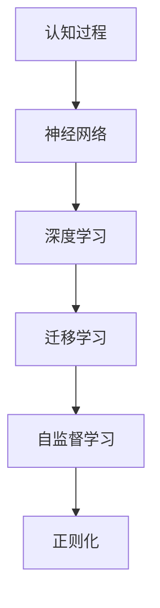

                 

# 认知过程中的简单与复杂性

## 1. 背景介绍

### 1.1 问题由来
人类认知过程是一个复杂而微妙的现象，它涉及感知、记忆、思维、决策等多个维度。在过去几十年中，心理学家、神经科学家、人工智能专家等纷纷从各自角度探索认知过程的奥秘，提出了一系列理论和模型。随着人工智能技术的发展，尤其是深度学习和神经网络的应用，我们开始尝试从数据和算法角度模拟和理解认知过程。本文旨在通过技术视角探讨认知过程中的简单与复杂性，揭示其中的规律和挑战。

### 1.2 问题核心关键点
认知过程中的简单与复杂性问题主要包括以下几个核心关键点：
1. **认知过程的建模**：如何通过模型和算法，将复杂的认知过程简化为可计算的数学表达式。
2. **数据驱动的认知学习**：通过大量标注数据训练模型，学习认知过程的规则和规律。
3. **认知过程的复杂性**：认知过程中存在许多非线性、动态特性，如何通过模型处理这些复杂性。
4. **认知过程的可解释性**：模型能否提供关于认知过程的解释，帮助我们理解其中的机制。

## 2. 核心概念与联系

### 2.1 核心概念概述

为更好地理解认知过程的简单与复杂性，本节将介绍几个关键概念及其相互联系：

- **认知过程**：包括感知、记忆、思维、决策等多个维度，是人类智能的核心体现。
- **神经网络**：一种通过多层非线性变换，模拟人类神经系统的计算模型。
- **深度学习**：一种基于神经网络的机器学习范式，通过堆叠多个非线性层，构建具有强大表征能力的模型。
- **迁移学习**：通过将一个领域的学习成果迁移到另一个领域，提升模型的泛化能力。
- **自监督学习**：利用无标签数据训练模型，学习数据的潜在结构和规律。
- **正则化**：通过引入约束，避免过拟合，提升模型的泛化能力。

这些概念构成了认知过程建模和研究的基础，通过它们，我们可以构建复杂的认知模型，并从中探索认知过程的简单与复杂性。

### 2.2 核心概念原理和架构的 Mermaid 流程图(Mermaid 流程节点中不要有括号、逗号等特殊字符)


这个流程图展示了认知过程、神经网络、深度学习、迁移学习、自监督学习和正则化之间的关系：

1. 认知过程通过神经网络进行建模。
2. 神经网络在深度学习框架下，通过多层次的特征提取和映射，提升模型的复杂度。
3. 迁移学习通过在不同领域间共享知识，提升模型的泛化能力。
4. 自监督学习利用无标签数据，提升模型的数据驱动能力。
5. 正则化通过引入约束，提升模型的泛化能力和稳定性。

这些概念相互关联，共同构成了一个复杂的认知过程建模框架。

## 3. 核心算法原理 & 具体操作步骤
### 3.1 算法原理概述

认知过程的建模通常采用神经网络和深度学习框架。以下将详细介绍基于这些技术的认知建模原理。

**认知建模**：通过构建多层神经网络模型，模拟认知过程中的感知、记忆、思维和决策等环节。其中，感知过程对应输入层，记忆过程对应中间层，思维过程对应隐藏层，决策过程对应输出层。

**深度学习框架**：通过堆叠多层神经网络，构建具有强大表征能力的模型。每一层都通过非线性变换，将输入映射到更高层次的抽象特征空间。这种层级结构使得深度学习模型能够处理复杂的多层次数据。

### 3.2 算法步骤详解

**Step 1: 数据准备**
- 收集并标注认知任务的相关数据，例如语音、图像、文本等。
- 将数据集划分为训练集、验证集和测试集，以保证模型训练和评估的独立性。

**Step 2: 模型选择与初始化**
- 根据任务特点选择合适的神经网络架构，如CNN、RNN、Transformer等。
- 使用预训练模型或随机初始化模型参数，以保证模型具有良好的起点。

**Step 3: 模型训练**
- 使用训练集数据，通过反向传播算法，优化模型参数，最小化损失函数。
- 设置合适的学习率、批大小、迭代次数等超参数，以确保模型收敛。

**Step 4: 模型评估与调整**
- 在验证集上评估模型性能，通过调整超参数和模型结构，优化模型。
- 在测试集上最终评估模型性能，判断模型的泛化能力。

### 3.3 算法优缺点

基于神经网络的认知建模具有以下优点：
1. **强大的数据处理能力**：多层非线性变换，能够处理复杂的输入数据。
2. **自动特征学习**：无需手动设计特征，模型自动从数据中学习特征表示。
3. **良好的泛化能力**：通过迁移学习和正则化技术，提升模型的泛化能力。

同时，也存在一些局限性：
1. **计算资源需求高**：多层非线性变换需要大量的计算资源。
2. **模型复杂性高**：层级结构复杂，难以解释和调试。
3. **数据依赖性强**：需要大量高质量标注数据，数据标注成本高。

## 4. 数学模型和公式 & 详细讲解 & 举例说明

### 4.1 数学模型构建

认知过程的建模通常采用多层神经网络结构。以下将以一个简单的认知过程为例，构建数学模型。

设认知过程包含 $L$ 个层次，每个层次的输入为 $x$，输出为 $y$，其中 $x_i$ 表示第 $i$ 层的输入，$y_i$ 表示第 $i$ 层的输出。定义每个层次的非线性变换函数为 $f_i(x_i)$，则整个认知过程的输出为：

$$
y = f_L(f_{L-1}(\cdots f_1(x) \cdots))
$$

### 4.2 公式推导过程

以下将推导一个简单的感知过程的数学模型。假设输入为 $x=(x_1, x_2, \cdots, x_n)$，输出为 $y=(y_1, y_2, \cdots, y_m)$，其中 $x_i$ 和 $y_i$ 分别表示第 $i$ 个输入和输出。设第 $i$ 层输入和输出之间的关系为：

$$
y_i = f_i(x_i)
$$

其中 $f_i(x_i)$ 表示第 $i$ 层非线性变换函数。假设第 $i$ 层输入为 $x_i$，输出为 $y_i$，则第 $i+1$ 层的输入可以表示为：

$$
x_{i+1} = f_i(y_i)
$$

通过不断迭代，可以构建整个认知过程的数学模型。

### 4.3 案例分析与讲解

以图像分类为例，说明基于神经网络认知过程的建模。

假设输入为一张 $28\times28$ 的灰度图像 $x$，输出为 10 个类别的概率分布 $y$。设第 $i$ 层为卷积层，第 $i$ 层的输出为 $y_i$，则第 $i+1$ 层的输入 $x_{i+1}$ 可以通过卷积和池化操作得到。最后，通过全连接层和softmax函数，得到最终的输出 $y$。

## 5. 项目实践：代码实例和详细解释说明

### 5.1 开发环境搭建

在进行认知过程建模实践前，我们需要准备好开发环境。以下是使用Python进行TensorFlow开发的环境配置流程：

1. 安装Anaconda：从官网下载并安装Anaconda，用于创建独立的Python环境。

2. 创建并激活虚拟环境：
```bash
conda create -n tf-env python=3.8 
conda activate tf-env
```

3. 安装TensorFlow：根据CUDA版本，从官网获取对应的安装命令。例如：
```bash
conda install tensorflow -c tf -c conda-forge
```

4. 安装TensorBoard：用于可视化模型训练过程和结果。
```bash
pip install tensorboard
```

5. 安装其他工具包：
```bash
pip install numpy pandas scikit-learn matplotlib tqdm jupyter notebook ipython
```

完成上述步骤后，即可在`tf-env`环境中开始认知过程建模实践。

### 5.2 源代码详细实现

这里我们以图像分类为例，给出使用TensorFlow进行认知过程建模的PyTorch代码实现。

首先，定义模型结构：

```python
import tensorflow as tf
from tensorflow.keras import layers, models

# 定义模型结构
model = models.Sequential([
    layers.Conv2D(32, (3, 3), activation='relu', input_shape=(28, 28, 1)),
    layers.MaxPooling2D((2, 2)),
    layers.Conv2D(64, (3, 3), activation='relu'),
    layers.MaxPooling2D((2, 2)),
    layers.Flatten(),
    layers.Dense(64, activation='relu'),
    layers.Dense(10, activation='softmax')
])
```

然后，定义数据准备函数：

```python
import numpy as np
from tensorflow.keras.datasets import mnist

# 加载数据集
(x_train, y_train), (x_test, y_test) = mnist.load_data()

# 数据预处理
x_train = x_train.reshape(-1, 28, 28, 1).astype('float32') / 255
x_test = x_test.reshape(-1, 28, 28, 1).astype('float32') / 255
y_train = tf.keras.utils.to_categorical(y_train, 10)
y_test = tf.keras.utils.to_categorical(y_test, 10)
```

接着，定义训练和评估函数：

```python
from tensorflow.keras.callbacks import EarlyStopping

# 定义训练函数
def train(model, x_train, y_train, x_test, y_test, batch_size=64, epochs=10, validation_split=0.2):
    model.compile(optimizer='adam', loss='categorical_crossentropy', metrics=['accuracy'])
    early_stopping = EarlyStopping(monitor='val_loss', patience=5)
    model.fit(x_train, y_train, batch_size=batch_size, epochs=epochs, validation_split=validation_split, callbacks=[early_stopping])
    score = model.evaluate(x_test, y_test, verbose=0)
    print(f'Test loss: {score[0]}')
    print(f'Test accuracy: {score[1]}')

# 定义评估函数
def evaluate(model, x_test, y_test):
    score = model.evaluate(x_test, y_test, verbose=0)
    print(f'Test loss: {score[0]}')
    print(f'Test accuracy: {score[1]}')
```

最后，启动训练流程并在测试集上评估：

```python
# 训练模型
train(model, x_train, y_train, x_test, y_test)

# 评估模型
evaluate(model, x_test, y_test)
```

以上就是使用TensorFlow进行图像分类任务的认知过程建模的完整代码实现。可以看到，TensorFlow提供了丰富的深度学习模型和工具，使得认知过程建模的代码实现变得简洁高效。

### 5.3 代码解读与分析

让我们再详细解读一下关键代码的实现细节：

**定义模型结构**：
- 使用Sequential模型，堆叠多层卷积、池化和全连接层，构建认知过程的数学模型。
- 每一层通过非线性变换，将输入映射到更高层次的抽象特征空间。

**数据准备函数**：
- 加载MNIST数据集，并对其进行预处理。
- 将二维图像数据转换为三维张量形式，并进行归一化处理。
- 将标签转换为独热编码，用于训练和评估。

**训练和评估函数**：
- 使用Adam优化器和交叉熵损失函数，编译模型。
- 定义EarlyStopping回调，避免过拟合。
- 使用训练集进行模型训练，并记录验证集上的性能指标。
- 在测试集上评估模型性能，输出结果。

**训练流程**：
- 定义模型参数，并使用训练集数据进行模型训练。
- 在验证集上记录性能指标，调整超参数，防止过拟合。
- 在测试集上最终评估模型性能，输出结果。

可以看到，TensorFlow的高级API使得认知过程建模的代码实现变得非常直观和简单。开发者可以更加专注于模型结构和数据处理，而不必过多关注底层实现细节。

## 6. 实际应用场景

### 6.1 智能医疗诊断

认知过程建模在智能医疗诊断中具有广泛应用。传统医疗诊断依赖于医生的经验，存在主观性和误诊风险。通过构建认知过程模型，可以对患者的症状和体征进行自动化分析，提高诊断的准确性和效率。

在实践中，可以收集大量医疗案例，提取和标注症状、体征和诊断结果等数据。在此基础上对预训练模型进行微调，使其能够自动学习症状和体征之间的关联规则。微调后的模型可以接受新患者的症状输入，输出可能的诊断结果，辅助医生进行诊断。

### 6.2 金融风险评估

金融行业需要实时评估客户的信用风险，传统方法依赖于复杂的规则和专家经验，难以应对快速变化的金融市场。通过构建认知过程模型，可以对客户的财务行为和交易记录进行分析，预测其违约风险。

在实践中，可以收集客户的历史交易数据、信用评分和违约记录等数据。在此基础上对预训练模型进行微调，使其能够自动学习客户的财务行为模式和信用风险因素。微调后的模型可以接受新客户的交易记录，预测其违约概率，帮助金融机构进行风险评估和信贷决策。

### 6.3 智能客服系统

智能客服系统需要实时处理大量客户咨询，传统客服系统依赖于人工坐席，存在响应慢和资源浪费问题。通过构建认知过程模型，可以对客户的咨询意图进行自动化分析，提供快速准确的答复。

在实践中，可以收集客户的咨询历史数据，提取和标注客户意图和回答等数据。在此基础上对预训练模型进行微调，使其能够自动学习客户咨询意图和回答模式。微调后的模型可以接受客户的新咨询，自动生成回答，提高客户满意度。

### 6.4 未来应用展望

随着认知过程建模技术的不断进步，未来将在更多领域得到应用，为各个行业带来变革性影响。

在智慧城市治理中，认知过程建模可以应用于城市事件监测、舆情分析、应急指挥等环节，提高城市管理的自动化和智能化水平，构建更安全、高效的未来城市。

在企业生产、社会治理、文娱传媒等众多领域，认知过程建模技术也将不断涌现，为各行各业数字化转型提供新的技术路径。相信随着技术的日益成熟，认知过程建模必将在构建人机协同的智能时代中扮演越来越重要的角色。

## 7. 工具和资源推荐
### 7.1 学习资源推荐

为了帮助开发者系统掌握认知过程建模的理论基础和实践技巧，这里推荐一些优质的学习资源：

1. **《深度学习》系列书籍**：Ian Goodfellow、Yoshua Bengio和Aaron Courville所著，全面介绍了深度学习的基本概念和核心技术。

2. **《TensorFlow实战》书籍**：Emin Torodorov和Michael Spigler所著，提供了丰富的TensorFlow实践案例和代码示例。

3. **Coursera《深度学习专项课程》**：由Andrew Ng教授主讲的深度学习课程，涵盖深度学习的基础理论和实践应用。

4. **Kaggle竞赛**：参加Kaggle深度学习竞赛，积累实践经验，提升模型性能。

5. **Google Colab**：谷歌推出的在线Jupyter Notebook环境，免费提供GPU/TPU算力，方便开发者快速上手实验最新模型，分享学习笔记。

通过对这些资源的学习实践，相信你一定能够快速掌握认知过程建模的精髓，并用于解决实际的认知问题。

### 7.2 开发工具推荐

高效的开发离不开优秀的工具支持。以下是几款用于认知过程建模开发的常用工具：

1. **TensorFlow**：由Google主导开发的开源深度学习框架，生产部署方便，适合大规模工程应用。

2. **PyTorch**：基于Python的开源深度学习框架，灵活动态的计算图，适合快速迭代研究。

3. **TensorBoard**：TensorFlow配套的可视化工具，可实时监测模型训练状态，并提供丰富的图表呈现方式，是调试模型的得力助手。

4. **Keras**：基于TensorFlow的高级API，提供了简单易用的深度学习模型构建接口，适合初学者入门。

5. **Jupyter Notebook**：用于数据处理和模型训练的交互式环境，支持代码和结果的可视化展示。

合理利用这些工具，可以显著提升认知过程建模的开发效率，加快创新迭代的步伐。

### 7.3 相关论文推荐

认知过程建模的发展源于学界的持续研究。以下是几篇奠基性的相关论文，推荐阅读：

1. **《深度神经网络与深度学习》**：Ian Goodfellow、Yoshua Bengio和Aaron Courville所著，全面介绍了深度神经网络的基本概念和核心技术。

2. **《卷积神经网络》**：Geoffrey Hinton、Simon Osindero和Yoshua Bengio所著，详细介绍了卷积神经网络的结构和应用。

3. **《Transformer模型》**：Ashish Vaswani等人所著，提出了Transformer结构，开创了自注意力机制在深度学习中的新篇章。

4. **《迁移学习》**：Andrew Ng等人所著，全面介绍了迁移学习的基本概念和核心技术。

5. **《自监督学习》**：Christopher M. Bishop所著，详细介绍了自监督学习的基本概念和核心技术。

这些论文代表了大语言模型微调技术的发展脉络。通过学习这些前沿成果，可以帮助研究者把握学科前进方向，激发更多的创新灵感。

## 8. 总结：未来发展趋势与挑战

### 8.1 总结

本文对认知过程中的简单与复杂性问题进行了全面系统的介绍。首先阐述了认知过程的建模方法，探讨了神经网络和深度学习在其中的应用。接着，从原理到实践，详细讲解了认知过程建模的数学模型和操作步骤。同时，本文还探讨了认知过程建模在实际应用中的前景和挑战。

通过本文的系统梳理，可以看到，认知过程建模技术正在成为认知科学研究的重要手段，极大地拓展了人类对认知过程的理解和模拟能力。随着技术的不断进步，未来将在更多领域得到应用，为各个行业带来变革性影响。

### 8.2 未来发展趋势

展望未来，认知过程建模技术将呈现以下几个发展趋势：

1. **模型规模增大**：随着算力成本的下降和数据规模的扩张，认知过程建模的模型参数量还将持续增长。超大规模认知模型蕴含的丰富认知知识，有望支撑更加复杂多变的认知任务。

2. **模型结构优化**：未来的认知过程建模将更注重模型结构的优化，通过减少冗余参数、引入注意力机制等手段，提升模型的效率和泛化能力。

3. **多模态认知建模**：未来的认知过程建模将更多地融合视觉、听觉、语言等多种模态数据，构建多模态认知模型，提升对真实世界的理解和建模能力。

4. **跨领域认知迁移**：未来的认知过程建模将更多地探索跨领域认知迁移的规律，通过迁移学习和领域自适应技术，提升模型在不同领域的适应能力。

5. **模型可解释性增强**：未来的认知过程建模将更多地注重模型的可解释性，通过因果推断、注意力机制等手段，增强模型输出的解释能力，提高模型的可信度。

6. **跨学科融合**：未来的认知过程建模将更多地与其他学科融合，如心理学、神经科学等，从多角度探索认知过程的规律，推动认知科学的进步。

以上趋势凸显了认知过程建模技术的广阔前景。这些方向的探索发展，必将进一步提升认知建模的性能和应用范围，为构建智能人机交互系统提供新的技术路径。

### 8.3 面临的挑战

尽管认知过程建模技术已经取得了瞩目成就，但在迈向更加智能化、普适化应用的过程中，它仍面临着诸多挑战：

1. **计算资源瓶颈**：超大规模认知建模需要大量的计算资源，GPU/TPU等高性能设备是必不可少的，但即便如此，大规模批次的训练和推理也可能遇到资源瓶颈。

2. **数据依赖性强**：需要大量高质量标注数据，数据标注成本高，且标注质量直接影响模型性能。

3. **模型复杂度高**：认知过程建模涉及多层次的非线性变换，模型结构复杂，难以解释和调试。

4. **模型鲁棒性不足**：认知过程建模面对域外数据时，泛化性能往往大打折扣。对于测试样本的微小扰动，认知过程模型也容易发生波动。

5. **模型可解释性不足**：认知过程建模往往缺乏可解释性，难以解释模型的内部工作机制和决策逻辑。

6. **模型安全性不足**：认知过程建模可能会学习到有害信息和偏见，产生误导性、歧视性的输出，给实际应用带来安全隐患。

7. **跨领域迁移能力不足**：认知过程建模通常局限于特定领域的任务，难以灵活适应其他领域的认知任务。

正视认知过程建模面临的这些挑战，积极应对并寻求突破，将使认知建模技术迈向成熟的范式，为构建安全、可靠、可解释、可控的智能系统铺平道路。相信随着学界和产业界的共同努力，这些挑战终将一一被克服，认知过程建模必将在构建人机协同的智能时代中扮演越来越重要的角色。

### 8.4 研究展望

面对认知过程建模所面临的种种挑战，未来的研究需要在以下几个方面寻求新的突破：

1. **探索无监督和半监督认知建模方法**：摆脱对大规模标注数据的依赖，利用自监督学习、主动学习等无监督和半监督范式，最大限度利用非结构化数据，实现更加灵活高效的认知建模。

2. **研究参数高效和计算高效的认知建模方法**：开发更加参数高效的认知建模方法，在固定大部分预训练参数的同时，只更新极少量的任务相关参数。同时优化认知建模的计算图，减少前向传播和反向传播的资源消耗，实现更加轻量级、实时性的部署。

3. **融合因果和对比学习范式**：通过引入因果推断和对比学习思想，增强认知建模建立稳定因果关系的能力，学习更加普适、鲁棒的语言表征，从而提升模型泛化性和抗干扰能力。

4. **引入更多先验知识**：将符号化的先验知识，如知识图谱、逻辑规则等，与神经网络模型进行巧妙融合，引导认知建模过程学习更准确、合理的认知过程表示。同时加强不同模态数据的整合，实现视觉、听觉、语言等多种模态信息与文本信息的协同建模。

5. **结合因果分析和博弈论工具**：将因果分析方法引入认知建模，识别出模型决策的关键特征，增强输出解释的因果性和逻辑性。借助博弈论工具刻画人机交互过程，主动探索并规避模型的脆弱点，提高系统稳定性。

6. **纳入伦理道德约束**：在认知建模目标中引入伦理导向的评估指标，过滤和惩罚有害信息，确保输出符合人类价值观和伦理道德。同时加强人工干预和审核，建立模型行为的监管机制，确保模型输出的安全性和可靠性。

这些研究方向的探索，必将引领认知过程建模技术迈向更高的台阶，为构建安全、可靠、可解释、可控的智能系统铺平道路。面向未来，认知过程建模技术还需要与其他人工智能技术进行更深入的融合，如知识表示、因果推理、强化学习等，多路径协同发力，共同推动认知智能的发展。

## 9. 附录：常见问题与解答

**Q1：认知过程建模是否适用于所有认知任务？**

A: 认知过程建模在大多数认知任务上都能取得不错的效果，特别是对于数据量较小的任务。但对于一些特定领域的任务，如医学、法律等，仅仅依靠通用语料预训练的模型可能难以很好地适应。此时需要在特定领域语料上进一步预训练，再进行微调，才能获得理想效果。

**Q2：如何选择合适的认知建模超参数？**

A: 认知建模的超参数通常包括学习率、批大小、迭代次数、正则化系数等。选择合适的超参数需要综合考虑模型的复杂性、数据规模和计算资源等因素。通常通过网格搜索、随机搜索等方法进行超参数调优，找到最优的参数组合。

**Q3：认知过程建模在落地部署时需要注意哪些问题？**

A: 将认知过程建模转化为实际应用，还需要考虑以下因素：
1. 模型裁剪：去除不必要的层和参数，减小模型尺寸，加快推理速度。
2. 量化加速：将浮点模型转为定点模型，压缩存储空间，提高计算效率。
3. 服务化封装：将模型封装为标准化服务接口，便于集成调用。
4. 弹性伸缩：根据请求流量动态调整资源配置，平衡服务质量和成本。
5. 监控告警：实时采集系统指标，设置异常告警阈值，确保服务稳定性。

认知过程建模为认知过程模拟和理解提供了强大的技术支撑，但如何将强大的性能转化为稳定、高效、安全的业务价值，还需要工程实践的不断打磨。唯有从数据、算法、工程、业务等多个维度协同发力，才能真正实现认知过程建模技术的产业化落地。

总之，认知过程建模需要开发者根据具体任务，不断迭代和优化模型、数据和算法，方能得到理想的效果。

---

作者：禅与计算机程序设计艺术 / Zen and the Art of Computer Programming

