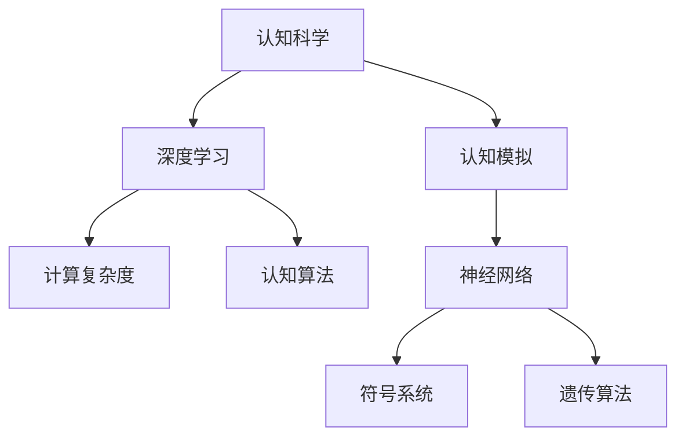

                 

# 认知过程中的简单与深刻

## 1. 背景介绍

### 1.1 问题的提出
人类认知是一个复杂而深邃的过程，涉及到感知、记忆、理解、推理等多个层面。现代人工智能技术，尤其是深度学习方法的涌现，使得对人类认知过程的模拟成为可能。但究竟何为“认知”？我们是否能够以计算机算法来理解和模拟人类认知？本文将深入探讨这一主题。

### 1.2 问题的核心关键点
本文的核心问题在于如何以计算思维理解人类认知，并尝试构建能够模拟人类认知的算法。这涉及到以下几个核心关键点：

- 人类认知的基本机制：感知、记忆、理解、推理等过程如何运作？
- 人工智能如何模仿人类认知：神经网络、深度学习等技术能否有效模拟人类认知？
- 认知过程中的简单与深刻：算法复杂度与认知能力之间的关系是什么？
- 认知算法的应用场景：哪些实际问题可以借助认知算法来解决？

这些问题不仅关乎认知科学的理论研究，也对于人工智能技术的发展具有重要的指导意义。本文将从理论到实践，对这些问题进行深入探讨。

## 2. 核心概念与联系

### 2.1 核心概念概述

为更好地理解认知过程中的简单与深刻，本节将介绍几个关键概念：

- **认知科学**：研究人类认知过程的科学，包括感知、记忆、理解、推理等过程。
- **深度学习**：一种基于神经网络的机器学习技术，通过多层次的特征提取和转化，模拟人类大脑的学习和推理机制。
- **计算复杂度**：描述一个问题的计算资源需求，如时间、空间、能量等。
- **认知算法**：能够模拟人类认知过程的算法，如神经网络、符号系统、遗传算法等。
- **认知模拟**：通过算法实现对人类认知过程的模拟，旨在理解和构建具有人类认知能力的人工智能系统。

这些概念之间的逻辑关系可以通过以下Mermaid流程图来展示：



这个流程图展示了几者之间的逻辑联系：

1. 认知科学为深度学习和认知算法的理论基础。
2. 深度学习通过计算复杂度理论指导认知算法的实现。
3. 认知算法通过神经网络、符号系统等手段实现认知模拟。

这些概念共同构成了认知算法的理论基础，使得我们能够以计算机算法来理解和模拟人类认知过程。

## 3. 核心算法原理 & 具体操作步骤
### 3.1 算法原理概述

认知过程中的简单与深刻，主要体现在算法复杂度和认知能力的对应关系。简单来说，算法越复杂，越能模拟人类认知能力的复杂性。因此，理解认知算法的设计和实现原理，是探讨认知过程中简单与深刻的关键。

### 3.2 算法步骤详解

1. **数据预处理**：将原始数据转化为模型能够处理的格式，如文本数据的分词、图像数据的归一化等。

2. **特征提取**：通过神经网络、卷积神经网络(CNN)、循环神经网络(RNN)等技术，从原始数据中提取特征，形成高维表示。

3. **模型训练**：使用大量标注数据训练模型，通过反向传播等算法更新模型参数，优化模型性能。

4. **模型评估**：使用验证集和测试集评估模型性能，选择最优模型进行下一步使用。

5. **模型应用**：将训练好的模型应用于实际问题中，如图像识别、语音识别、自然语言处理等。

### 3.3 算法优缺点

认知算法具有以下优点：

- 通过学习大量数据，能够自动发现特征和规律，具有较高的准确性。
- 可以处理大规模复杂数据，适用于各种实际问题。
- 具有较强的泛化能力，可以在新数据上表现良好。

同时，认知算法也存在一些缺点：

- 需要大量的标注数据，训练成本较高。
- 模型复杂度高，计算资源需求大，训练和推理速度慢。
- 模型黑盒，难以解释其决策过程，可解释性不足。

### 3.4 算法应用领域

认知算法广泛应用于各种实际问题中，如：

- **计算机视觉**：通过深度学习算法，自动识别和分类图像中的物体。
- **语音识别**：将语音信号转化为文本，实现人机交互。
- **自然语言处理**：通过深度学习算法，理解自然语言，进行文本生成、翻译、问答等。
- **医疗影像诊断**：通过图像处理技术，自动识别和分类医疗影像中的病变区域。
- **推荐系统**：根据用户行为数据，推荐相关商品和服务。

## 4. 数学模型和公式 & 详细讲解 & 举例说明

### 4.1 数学模型构建

认知算法的数学模型主要涉及以下几个部分：

- **神经网络**：多层感知器、卷积神经网络、循环神经网络等。
- **深度学习**：反向传播、梯度下降、卷积等。
- **符号系统**：基于规则的推理、规划、搜索等。
- **遗传算法**：基于自然进化机制的优化算法。

### 4.2 公式推导过程

以多层感知器为例，其数学模型推导如下：

设 $x \in \mathbb{R}^n$ 为输入，$W_1, W_2, ... , W_k$ 为网络权重，$b_1, b_2, ... , b_k$ 为偏置项，$f$ 为激活函数，则多层感知器的输出 $y \in \mathbb{R}$ 可以表示为：

$$
y = W_k f(W_{k-1} ... f(W_1 x + b_1) + b_2) + b_k
$$

其中，$x$ 经过一系列线性变换和激活函数，最终得到输出 $y$。

### 4.3 案例分析与讲解

以图像识别为例，神经网络通过多层卷积和池化操作，提取图像中的特征。然后通过全连接层和softmax函数，将特征映射到不同类别的概率分布上。最后，通过损失函数和优化算法，不断调整网络参数，使模型能够准确识别图像中的物体。

## 5. 项目实践：代码实例和详细解释说明

### 5.1 开发环境搭建

在进行认知算法实践前，我们需要准备好开发环境。以下是使用Python进行TensorFlow开发的环境配置流程：

1. 安装Anaconda：从官网下载并安装Anaconda，用于创建独立的Python环境。

2. 创建并激活虚拟环境：
```bash
conda create -n tf-env python=3.8 
conda activate tf-env
```

3. 安装TensorFlow：根据CUDA版本，从官网获取对应的安装命令。例如：
```bash
conda install tensorflow
```

4. 安装各类工具包：
```bash
pip install numpy pandas scikit-learn matplotlib tqdm jupyter notebook ipython
```

完成上述步骤后，即可在`tf-env`环境中开始认知算法实践。

### 5.2 源代码详细实现

下面我们以图像识别任务为例，给出使用TensorFlow库对卷积神经网络进行认知算法的PyTorch代码实现。

```python
import tensorflow as tf
from tensorflow.keras import layers, models

# 定义模型
model = models.Sequential()
model.add(layers.Conv2D(32, (3,3), activation='relu', input_shape=(28,28,1)))
model.add(layers.MaxPooling2D((2,2)))
model.add(layers.Flatten())
model.add(layers.Dense(10, activation='softmax'))

# 编译模型
model.compile(optimizer='adam', loss='categorical_crossentropy', metrics=['accuracy'])

# 训练模型
model.fit(train_images, train_labels, epochs=10, validation_data=(test_images, test_labels))
```

### 5.3 代码解读与分析

让我们再详细解读一下关键代码的实现细节：

**Sequential模型**：
- `model.add`方法：逐层构建卷积神经网络。
- `Conv2D`：添加卷积层，提取图像特征。
- `MaxPooling2D`：添加池化层，减小特征图尺寸。
- `Flatten`：将特征图展平。
- `Dense`：添加全连接层，进行分类。

**模型编译**：
- `compile`方法：设置模型的优化器、损失函数和评价指标。
- `adam`：优化器，用于更新模型参数。
- `categorical_crossentropy`：损失函数，用于衡量模型预测与真实标签的差异。

**模型训练**：
- `fit`方法：训练模型，参数设置包括训练轮数和验证集。

以上代码展示了卷积神经网络的构建和训练过程。通过简单的卷积、池化、全连接操作，模型可以有效地提取图像特征并进行分类。

## 6. 实际应用场景
### 6.1 智能客服系统

基于认知算法的智能客服系统，能够通过自然语言处理技术，理解用户意图并给出相应的回复。具体而言，可以将用户的输入文本作为输入，经过多个层级的网络处理后，得到用户的意图表示。然后，根据意图匹配相应的回复模板，生成最终的回复内容。

### 6.2 金融舆情监测

金融舆情监测系统通过认知算法，能够自动分析和理解大量的金融新闻、评论等文本数据，识别其中的情感倾向和主题。这有助于金融机构及时掌握市场动态，制定风险管理策略。

### 6.3 个性化推荐系统

基于认知算法的个性化推荐系统，可以根据用户的历史行为数据和兴趣偏好，自动生成个性化的推荐内容。通过神经网络模型对用户行为进行建模，可以更准确地预测用户对不同商品的兴趣。

### 6.4 未来应用展望

随着认知算法的不断进步，其应用场景将更加广泛。未来，认知算法将在医疗诊断、教育辅助、智能家居等领域大放异彩，为人类生活带来更多便利。

## 7. 工具和资源推荐
### 7.1 学习资源推荐

为了帮助开发者系统掌握认知算法的理论基础和实践技巧，这里推荐一些优质的学习资源：

1. 《深度学习》书籍：由Ian Goodfellow等作者撰写，详细介绍了深度学习的基本概念和算法。
2. 《认知神经科学》课程：由MIT等机构开设的认知科学课程，深入浅出地讲解了人类认知的基本机制。
3. 《TensorFlow实战》书籍：由TensorFlow官方出版的实战指南，详细介绍了TensorFlow的使用方法。
4. 《Python机器学习》书籍：由Sebastian Raschka等作者撰写，介绍了机器学习的基本算法和实现方法。
5. HuggingFace官方文档：Transformer库的官方文档，提供了海量预训练模型和完整的认知算法样例代码，是上手实践的必备资料。

通过对这些资源的学习实践，相信你一定能够快速掌握认知算法的精髓，并用于解决实际的认知问题。

### 7.2 开发工具推荐

高效的开发离不开优秀的工具支持。以下是几款用于认知算法开发的常用工具：

1. TensorFlow：由Google主导开发的开源深度学习框架，生产部署方便，适合大规模工程应用。同样有丰富的认知算法资源。
2. PyTorch：基于Python的开源深度学习框架，灵活动态的计算图，适合快速迭代研究。大部分认知算法都有PyTorch版本的实现。
3. Weights & Biases：模型训练的实验跟踪工具，可以记录和可视化模型训练过程中的各项指标，方便对比和调优。与主流深度学习框架无缝集成。
4. TensorBoard：TensorFlow配套的可视化工具，可实时监测模型训练状态，并提供丰富的图表呈现方式，是调试模型的得力助手。
5. Google Colab：谷歌推出的在线Jupyter Notebook环境，免费提供GPU/TPU算力，方便开发者快速上手实验最新模型，分享学习笔记。

合理利用这些工具，可以显著提升认知算法的开发效率，加快创新迭代的步伐。

### 7.3 相关论文推荐

认知算法的发展源于学界的持续研究。以下是几篇奠基性的相关论文，推荐阅读：

1. 《Deep Learning》论文：由Ian Goodfellow等作者发表，介绍了深度学习的基本原理和算法。
2. 《ImageNet Classification with Deep Convolutional Neural Networks》论文：由Alex Krizhevsky等作者发表，介绍了卷积神经网络在图像识别中的应用。
3. 《Attention Is All You Need》论文：由Ashish Vaswani等作者发表，介绍了Transformer结构在自然语言处理中的应用。
4. 《Reinforcement Learning: An Introduction》书籍：由Richard Sutton等作者撰写，介绍了强化学习的基本算法和实现方法。
5. 《Neuro-Symbolic Learning》论文：由Maja Gök等作者发表，介绍了符号系统和神经网络结合的认知算法。

这些论文代表了大语言模型微调技术的发展脉络。通过学习这些前沿成果，可以帮助研究者把握学科前进方向，激发更多的创新灵感。

## 8. 总结：未来发展趋势与挑战

### 8.1 总结

本文对认知算法的核心概念和实现原理进行了系统介绍，并探讨了其应用场景和发展前景。通过理论分析与实践案例相结合，展示了认知算法在实际问题中的应用潜力。

通过本文的系统梳理，可以看到，认知算法正在成为人工智能技术的重要组成部分，不断拓展其应用边界，为各行业带来变革性影响。未来，伴随深度学习技术的不断演进，认知算法将进一步深化对人类认知过程的理解，推动人工智能技术的智能化发展。

### 8.2 未来发展趋势

展望未来，认知算法的发展趋势主要包括以下几个方面：

1. **深度学习技术的发展**：深度学习算法将在更多领域得到应用，如计算机视觉、自然语言处理、语音识别等。未来，随着深度学习技术的不断进步，认知算法的性能将进一步提升。

2. **跨学科融合**：认知算法将与心理学、神经科学、认知科学等学科进行深度融合，推动认知科学的发展。同时，与自然语言处理、计算机视觉等领域的结合，也将催生更多创新应用。

3. **认知算法的扩展**：认知算法不仅应用于图像识别、语音识别等传统领域，还将拓展到医疗诊断、教育辅助、智能家居等新兴领域，带来更多的应用前景。

4. **多模态认知算法**：认知算法将逐渐拓展到多模态数据处理，如图像-文本、语音-文本、视觉-文本等。多模态数据的整合，将提升认知算法的智能水平。

5. **自动化认知算法**：自动化认知算法将成为未来的发展方向，通过自动调参、自适应学习等技术，提升认知算法的性能和泛化能力。

这些趋势凸显了认知算法的广阔前景，为人工智能技术的发展提供了新的方向。

### 8.3 面临的挑战

尽管认知算法已经取得了显著进展，但在迈向更加智能化、普适化应用的过程中，仍面临诸多挑战：

1. **数据获取和标注**：认知算法需要大量的标注数据，获取高质量的数据是挑战之一。对于某些领域，数据标注成本高，且难以获得标注样本。

2. **计算资源消耗**：深度学习模型复杂度高，训练和推理速度慢，计算资源消耗大。如何优化算法，减少计算资源消耗，是当前的重要研究方向。

3. **可解释性不足**：认知算法的模型往往是黑盒，难以解释其决策过程，可解释性不足。这对于医疗、金融等高风险应用尤为重要。

4. **模型偏见和鲁棒性**：认知算法可能学习到有偏见的数据，导致输出结果不公正。同时，模型鲁棒性不足，面对新数据时泛化性能可能下降。

5. **隐私和安全**：认知算法的应用需要处理大量的个人数据，如何保护隐私和安全，防止数据泄露，是重要的挑战。

6. **伦理和社会影响**：认知算法的应用需要考虑伦理和社会影响，避免误导性和歧视性输出，确保系统的公平性和公正性。

这些挑战需要我们在未来进一步研究和解决，才能使认知算法在更广泛的场景中得到应用。

### 8.4 研究展望

面对认知算法面临的诸多挑战，未来的研究需要在以下几个方面寻求新的突破：

1. **数据增强和迁移学习**：通过数据增强和迁移学习等技术，减少对标注数据的依赖，提升模型的泛化能力。

2. **模型压缩和加速**：通过模型压缩和加速等技术，减少计算资源消耗，提升模型的实时性。

3. **可解释性和透明性**：通过可解释性算法和透明性设计，提升认知算法的可解释性和透明性，使其更易于理解和调试。

4. **公平性和伦理**：引入公平性和伦理导向的评估指标，过滤和惩罚有偏见和有害的输出，确保系统的公平性和公正性。

5. **多模态数据整合**：通过多模态数据的整合，提升认知算法的智能水平，实现更加全面的认知能力。

这些研究方向将推动认知算法的发展，为构建更加智能和可靠的人工智能系统铺平道路。

## 9. 附录：常见问题与解答

**Q1：认知算法的核心原理是什么？**

A: 认知算法的核心原理是通过深度学习模型，模拟人类感知、记忆、理解和推理等过程。通过多层神经网络的特征提取和转化，模型能够自动发现数据中的规律和模式，并进行相应的决策和推理。

**Q2：认知算法在实际应用中需要注意哪些问题？**

A: 在实际应用中，认知算法需要注意以下问题：

1. **数据获取和标注**：需要大量高质量的标注数据，获取数据成本高，且难以获得标注样本。
2. **计算资源消耗**：深度学习模型复杂度高，训练和推理速度慢，计算资源消耗大。
3. **可解释性不足**：模型往往是黑盒，难以解释其决策过程，可解释性不足。
4. **模型偏见和鲁棒性**：模型可能学习到有偏见的数据，导致输出结果不公正。同时，模型鲁棒性不足，面对新数据时泛化性能可能下降。
5. **隐私和安全**：处理大量个人数据，需要保护隐私和安全，防止数据泄露。

**Q3：认知算法的未来发展方向是什么？**

A: 认知算法的未来发展方向主要包括以下几个方面：

1. **深度学习技术的发展**：深度学习算法将在更多领域得到应用，未来随着深度学习技术的不断进步，认知算法的性能将进一步提升。
2. **跨学科融合**：认知算法将与心理学、神经科学、认知科学等学科进行深度融合，推动认知科学的发展。
3. **认知算法的扩展**：认知算法不仅应用于图像识别、语音识别等传统领域，还将拓展到医疗诊断、教育辅助、智能家居等新兴领域，带来更多的应用前景。
4. **多模态认知算法**：认知算法将逐渐拓展到多模态数据处理，如图像-文本、语音-文本、视觉-文本等。
5. **自动化认知算法**：自动化认知算法将成为未来的发展方向，通过自动调参、自适应学习等技术，提升认知算法的性能和泛化能力。

这些研究方向将推动认知算法的发展，为构建更加智能和可靠的人工智能系统铺平道路。

**Q4：认知算法的应用场景有哪些？**

A: 认知算法的应用场景主要包括以下几个方面：

1. **计算机视觉**：通过深度学习算法，自动识别和分类图像中的物体。
2. **语音识别**：将语音信号转化为文本，实现人机交互。
3. **自然语言处理**：通过深度学习算法，理解自然语言，进行文本生成、翻译、问答等。
4. **医疗影像诊断**：通过图像处理技术，自动识别和分类医疗影像中的病变区域。
5. **推荐系统**：根据用户的历史行为数据，推荐相关商品和服务。

这些应用场景展示了认知算法的广泛适用性，为各行各业带来了变革性影响。

---

作者：禅与计算机程序设计艺术 / Zen and the Art of Computer Programming

