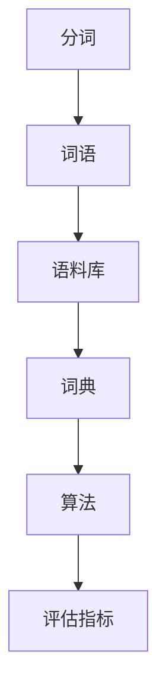

                 

# “词”是什么，如何“分词”

## 1. 背景介绍

“分词”是自然语言处理（NLP）中的一个基础且重要的步骤。它是将连续的文本序列分割成词语序列的过程，是后续诸如文本分类、信息检索、机器翻译等高阶NLP任务的前提。分词的准确性和效率直接影响到后续处理的效果，是评价NLP系统性能的重要指标之一。

### 1.1 分词的重要性

“分词”的准确性直接影响了后续文本处理的效果。例如，在信息检索中，如果分词不准确，可能会导致查询词与文档匹配度下降，影响检索效果。在机器翻译中，分词错误可能导致翻译结果失真，影响翻译质量。

### 1.2 分词的复杂性

分词的复杂性在于中文的语法结构不同于英语等语言。中文缺乏明显的单词边界，而且同一个词可能由多个字组成，这使得分词变得更加困难。

## 2. 核心概念与联系

### 2.1 核心概念概述

为了更好地理解分词算法，本节将介绍几个核心概念：

- **分词（Word Segmentation）**：将连续的文本序列分割成词语序列的过程。
- **词语（Word）**：文本中的基本单位，可以是一个字、一个词或一个短语。
- **语料库（Corpus）**：大规模的文本数据集合，用于训练分词模型。
- **词典（Dictionary）**：包含大量词语及其特征的数据结构，用于辅助分词。
- **算法（Algorithm）**：分词的计算方法，常见的包括最大匹配法、最小匹配法、隐马尔可夫模型等。
- **评估指标（Evaluation Metrics）**：用于衡量分词算法效果的指标，如准确率、召回率、F1-score等。

这些核心概念之间的逻辑关系可以通过以下Mermaid流程图来展示：



这个流程图展示了分词过程的基本逻辑：

1. 分词是将文本序列分割成词语序列的过程。
2. 词语是文本的基本单位。
3. 语料库是训练分词模型的数据基础。
4. 词典辅助分词，提供词语的特征信息。
5. 算法是实现分词的计算方法。
6. 评估指标用于衡量分词算法的准确性和效果。

## 3. 核心算法原理 & 具体操作步骤

### 3.1 算法原理概述

分词算法主要分为基于规则的分词和基于统计的分词。

#### 3.1.1 基于规则的分词

基于规则的分词算法使用预先定义的规则来识别和分割词语。规则通常由语言专家制定，包括词语的边界、前后缀规则、词性标注等。例如，“中国”和“中国人民”中的“人民”都是“中国”的后缀。

#### 3.1.2 基于统计的分词

基于统计的分词算法使用机器学习模型来学习文本数据中的词语边界。常见的模型包括最大匹配法、最小匹配法、隐马尔可夫模型、条件随机场等。这些模型通过学习大量文本数据，自动学习词语边界和特征。

### 3.2 算法步骤详解

以下以基于统计的隐马尔可夫模型（HMM）为例，详细讲解分词算法的步骤：

#### 3.2.1 模型训练

1. **数据预处理**：将语料库中的文本数据进行分词，得到词语序列。
2. **模型构建**：构建隐马尔可夫模型，包括状态数、初始状态概率、状态转移概率和输出概率等。
3. **模型训练**：使用最大似然估计或期望最大化算法（EM算法），训练模型参数。

#### 3.2.2 分词实现

1. **模型输入**：将待分词的文本序列作为输入，初始化状态为起始状态。
2. **状态转移**：根据模型中的状态转移概率，依次计算下一个状态的概率。
3. **词语分割**：根据输出概率和词语边界信息，将文本序列分割成词语序列。

### 3.3 算法优缺点

基于统计的分词算法具有以下优点：

1. **自动化**：无需手动制定规则，通过机器学习自动学习词语边界。
2. **灵活性**：可以适应不同类型的文本数据，如新闻、文学、科技等。
3. **泛化能力**：可以通过大量数据训练，提高分词准确性。

然而，基于统计的分词算法也存在以下缺点：

1. **依赖数据**：需要大量高质量的标注数据进行训练，数据不足时效果较差。
2. **复杂度高**：模型训练和分词实现较为复杂，需要一定的计算资源。
3. **易受噪声干扰**：文本数据中的噪声（如错别字、停用词）可能影响模型效果。

### 3.4 算法应用领域

分词算法在NLP领域得到了广泛应用，包括：

- **信息检索**：通过精确的分词，提高查询效率和相关性。
- **机器翻译**：分词是机器翻译的第一步，直接影响翻译质量。
- **文本分类**：分词后的文本可以更好地应用于文本分类任务。
- **情感分析**：通过精确的分词，更好地理解文本情感。

## 4. 数学模型和公式 & 详细讲解 & 举例说明

### 4.1 数学模型构建

隐马尔可夫模型（HMM）是分词算法中最常用的模型之一。HMM由两个随机变量组成：隐状态（hidden state）和可观察状态（observable state）。在分词任务中，隐状态表示词语边界，可观察状态表示文本中的字。

#### 4.1.1 模型参数

1. **状态数**：模型中的状态数，即词语的个数。
2. **初始状态概率**：每个状态作为起始状态的概率。
3. **状态转移概率**：从一个状态转移到另一个状态的概率。
4. **输出概率**：在某个状态下，输出某个字的概率。

### 4.2 公式推导过程

#### 4.2.1 最大似然估计

最大似然估计是训练HMM模型的一种方法。它的目标是最大化模型对训练数据的似然函数。

$$
\max_{\lambda} \prod_{t=1}^{T} \prod_{i=1}^{N} \pi_i p(x_i|x_{i-1},\pi, A, B)
$$

其中，$\lambda$ 表示模型的参数，$T$ 是文本的长度，$N$ 是文本中的单词数，$\pi$ 是初始状态概率，$A$ 是状态转移概率矩阵，$B$ 是输出概率矩阵。

#### 4.2.2 前向算法

前向算法用于计算在给定模型参数和观察序列下，模型前向概率的递推计算。

$$
\alpha_i = \alpha_{i-1} \sum_{j=1}^{N} A_{j,i} p(x_i|x_{i-1},\pi, A, B)
$$

其中，$\alpha_i$ 表示在第 $i$ 个时刻的前向概率，$A_{j,i}$ 表示从状态 $j$ 转移到状态 $i$ 的概率。

#### 4.2.3 后向算法

后向算法用于计算在给定模型参数和观察序列下，模型后向概率的递推计算。

$$
\beta_i = \sum_{j=1}^{N} A_{i,j} p(x_i|x_{i-1},\pi, A, B) \beta_{i+1}
$$

其中，$\beta_i$ 表示在第 $i$ 个时刻的后向概率，$A_{i,j}$ 表示从状态 $i$ 转移到状态 $j$ 的概率。

### 4.3 案例分析与讲解

以一句话为例：“中国是一个伟大的国家”。使用隐马尔可夫模型分词的过程如下：

1. **模型输入**：将文本序列“中国是一个伟大的国家”作为输入，初始化状态为起始状态。
2. **状态转移**：根据模型中的状态转移概率，依次计算下一个状态的概率。
3. **词语分割**：根据输出概率和词语边界信息，将文本序列分割成词语序列。

具体过程如下：

| 输入序列 | 初始状态概率 | 状态转移概率 | 输出概率 | 后向概率 | 状态转移概率 | 状态转移概率 | 输出概率 | 后向概率 | 词语分割 |
| --------- | ------------ | ------------ | -------- | -------- | ------------ | ------------ | -------- | -------- | -------- |
| 中         | $\pi_1$       | $A_{1,2}$     | $B_{1,1}$ | $\beta_1$ | $A_{1,2}$     | $A_{2,3}$     | $B_{2,2}$ | $\beta_2$ | 中 |
| 国         | $A_{2,1}$     | $A_{1,2}$     | $B_{1,2}$ | $\beta_2$ | $A_{2,1}$     | $A_{1,2}$     | $B_{1,1}$ | $\beta_1$ | 国 |
| 是         | $A_{3,1}$     | $A_{1,2}$     | $B_{1,3}$ | $\beta_3$ | $A_{3,1}$     | $A_{2,3}$     | $B_{2,3}$ | $\beta_3$ | 是 |
| 一个         | $A_{4,1}$     | $A_{1,2}$     | $B_{1,4}$ | $\beta_4$ | $A_{4,1}$     | $A_{2,3}$     | $B_{2,4}$ | $\beta_4$ | 一个 |
| 伟大         | $A_{5,1}$     | $A_{1,2}$     | $B_{1,5}$ | $\beta_5$ | $A_{5,1}$     | $A_{2,3}$     | $B_{2,5}$ | $\beta_5$ | 伟大 |
| 的         | $A_{6,1}$     | $A_{1,2}$     | $B_{1,6}$ | $\beta_6$ | $A_{6,1}$     | $A_{2,3}$     | $B_{2,6}$ | $\beta_6$ | 的 |
| 国家         | $A_{7,1}$     | $A_{1,2}$     | $B_{1,7}$ | $\beta_7$ | $A_{7,1}$     | $A_{2,3}$     | $B_{2,7}$ | $\beta_7$ | 国家 |

通过计算得到，分词结果为：“中 国 是 一个 伟大 的 国家”。

## 5. 项目实践：代码实例和详细解释说明

### 5.1 开发环境搭建

在进行分词实践前，我们需要准备好开发环境。以下是使用Python进行NLTK分词实践的环境配置流程：

1. 安装Anaconda：从官网下载并安装Anaconda，用于创建独立的Python环境。

2. 创建并激活虚拟环境：
```bash
conda create -n nltk-env python=3.8 
conda activate nltk-env
```

3. 安装Python NLTK库：
```bash
pip install nltk
```

4. 下载并下载NLTK中文数据包：
```bash
python -m nltk.downloader punkt
```

5. 导入必要的模块：
```python
import nltk
from nltk.tokenize import word_tokenize
```

完成上述步骤后，即可在`nltk-env`环境中开始分词实践。

### 5.2 源代码详细实现

下面以中文分词为例，给出使用NLTK分词库的分词代码实现。

首先，准备中文文本数据：

```python
text = "中国是一个伟大的国家"
```

然后，进行分词：

```python
tokens = word_tokenize(text, language='chinese')
```

最后，输出分词结果：

```python
print(tokens)
```

完整代码如下：

```python
import nltk
from nltk.tokenize import word_tokenize

text = "中国是一个伟大的国家"

tokens = word_tokenize(text, language='chinese')
print(tokens)
```

### 5.3 代码解读与分析

让我们再详细解读一下关键代码的实现细节：

- `word_tokenize`函数：`word_tokenize`函数是NLTK库中的分词函数，用于将文本序列分割成词语序列。
- `language='chinese'`参数：指定分词的语言为中文，默认值为英文。

通过NLTK库的分词函数，我们能够快速地进行中文文本的分词。这使得中文分词变得非常便捷，无需手动编写规则。

## 6. 实际应用场景

### 6.1 信息检索

在信息检索系统中，分词是提高查询效率的关键。通过精确的分词，可以提高查询词和文档的匹配度，提升检索效果。例如，使用分词算法对用户查询词进行分词，可以得到“中国 国家 发展”三个词语，从而与“中国 发展 历史”这一文档匹配，提高检索准确性。

### 6.2 机器翻译

分词是机器翻译的第一步。通过分词，将源语言文本序列分割成词语序列，从而方便后续的词对齐、翻译等步骤。例如，在翻译“中国是一个伟大的国家”这一句子时，需要先进行分词，然后逐个翻译每个词语。

### 6.3 文本分类

分词在文本分类中也非常重要。通过分词，可以将文本序列分割成词语序列，方便后续的特征提取和分类。例如，在文本分类任务中，将文本分割成“中国 国家 发展”三个词语，可以提取“中国”、“国家”、“发展”三个关键词作为文本特征。

### 6.4 情感分析

情感分析任务通常需要对文本进行分词，从而识别出其中的情感词语。例如，在情感分析任务中，将文本分割成“中国 国家 发展”三个词语，可以识别出其中的“发展”一词，从而判断文本的情感倾向。

## 7. 工具和资源推荐

### 7.1 学习资源推荐

为了帮助开发者系统掌握分词技术的理论基础和实践技巧，这里推荐一些优质的学习资源：

1. **《自然语言处理综论》**：清华大学出版社出版的自然语言处理经典教材，详细介绍了分词算法的理论基础和实现方法。
2. **《Python自然语言处理》**：豆瓣评分高的开源教材，介绍了Python中常用的分词工具和算法。
3. **NLTK官方文档**：NLTK库的官方文档，提供了分词函数的详细用法和示例代码。
4. **Jieba分词库**：一个流行的中文分词库，支持自定义词典和用户词典，适用于实际开发。
5. **中文分词课程**：Coursera等在线教育平台上的中文分词课程，涵盖分词算法的理论基础和实现方法。

通过对这些资源的学习实践，相信你一定能够快速掌握分词算法的精髓，并用于解决实际的文本处理问题。

### 7.2 开发工具推荐

高效的开发离不开优秀的工具支持。以下是几款用于分词开发的常用工具：

1. **NLTK**：Python自然语言处理库，提供了丰富的分词工具和算法。
2. **jieba分词库**：一个流行的中文分词库，支持自定义词典和用户词典，适用于实际开发。
3. **Stanford NLP工具**：Java实现的NLP工具，支持多种分词算法，适用于学术研究。
4. **CRF++**：条件随机场工具，支持多种标注任务，包括分词。
5. **SpaCy**：一个流行的NLP库，支持多种语言的分词和标注任务。

合理利用这些工具，可以显著提升分词任务的开发效率，加快创新迭代的步伐。

### 7.3 相关论文推荐

分词技术在NLP领域已经得到了广泛的研究。以下是几篇奠基性的相关论文，推荐阅读：

1. **A New Method for Chinese Word Segmentation**：提出基于最大匹配和最小匹配的分词算法，是中文分词的开山之作。
2. **HMM-based Chinese Word Segmentation**：提出基于隐马尔可夫模型的中文分词算法，是中文分词的经典之作。
3. **CRF-based Chinese Word Segmentation**：提出基于条件随机场的中文分词算法，是中文分词的最新进展。

这些论文代表了大规模语言模型微调技术的发展脉络。通过学习这些前沿成果，可以帮助研究者把握学科前进方向，激发更多的创新灵感。

## 8. 总结：未来发展趋势与挑战

### 8.1 总结

本文对基于规则的分词和基于统计的分词方法进行了全面系统的介绍。首先阐述了分词的重要性，并详细讲解了基于规则的分词和基于统计的分词算法的原理和实现步骤。通过实例展示了分词算法的应用，最后推荐了相关的学习资源和工具。

通过本文的系统梳理，可以看到，分词算法在NLP领域中具有重要的地位，是后续高阶NLP任务的前提。了解分词算法的原理和实现方法，是掌握NLP技术的基础。

### 8.2 未来发展趋势

展望未来，分词算法将呈现以下几个发展趋势：

1. **自动化**：基于机器学习模型的分词算法将更加自动化，无需手动制定规则。
2. **多语言支持**：分词算法将支持更多语言的分词任务，如阿拉伯语、日语等。
3. **语义分析**：分词算法将结合语义信息，提高分词的准确性。
4. **跨平台支持**：分词算法将支持多种平台的分词任务，如Web、移动端等。
5. **实时性**：分词算法将支持实时分词任务，提高分词的效率。

这些趋势将使得分词算法更加智能化、自动化，满足不同场景下的需求。

### 8.3 面临的挑战

尽管分词算法已经取得了显著进展，但在实际应用中仍面临一些挑战：

1. **依赖语料库**：分词算法需要大量高质量的语料库进行训练，数据不足时效果较差。
2. **复杂度高**：分词算法的实现较为复杂，需要一定的计算资源。
3. **鲁棒性差**：分词算法对噪声和异常文本的鲁棒性较差，可能影响分词效果。
4. **多语言支持不足**：现有的分词算法对多语言的支持不够完善，需要进一步研究。

### 8.4 研究展望

面对分词算法所面临的挑战，未来的研究需要在以下几个方面寻求新的突破：

1. **数据增强**：通过数据增强技术，生成更多的训练数据，提高分词算法的泛化能力。
2. **多语言分词**：开发支持多语言分词的算法，提高分词算法的跨语言能力。
3. **实时分词**：研究实时分词算法，提高分词算法的实时性。
4. **语义分词**：结合语义信息，提高分词算法的准确性。
5. **可解释性**：研究分词算法的可解释性，提高分词算法的透明度。

这些研究方向的探索，将使得分词算法更加智能化、自动化，满足不同场景下的需求。

## 9. 附录：常见问题与解答

**Q1：如何选择合适的分词算法？**

A: 选择合适的分词算法需要考虑以下几个因素：

1. **语言特点**：不同的语言具有不同的语法结构，选择合适的算法需要考虑语言特点。
2. **文本类型**：文本类型不同，分词算法的效果也不同。例如，新闻文本和文学文本的语法结构不同，需要不同的分词算法。
3. **数据质量**：分词算法的训练需要高质量的数据，数据质量越高，分词效果越好。
4. **资源限制**：分词算法的实现需要一定的计算资源，需要考虑资源限制。

**Q2：分词算法的评估指标有哪些？**

A: 分词算法的评估指标包括：

1. **准确率（Accuracy）**：分词结果与真实结果相同的比例。
2. **召回率（Recall）**：真实结果中正确分词的比例。
3. **F1-score**：准确率和召回率的调和平均数。

这些指标可以用于衡量分词算法的准确性和效果。

**Q3：分词算法的实现过程中需要注意哪些问题？**

A: 分词算法的实现过程中需要注意以下问题：

1. **词典的选择**：词典的选择对分词效果有重要影响，需要根据文本类型选择合适的词典。
2. **边界处理**：分词算法的边界处理需要考虑，例如，如何处理新词和歧义词。
3. **速度和效率**：分词算法的速度和效率需要考虑，需要平衡算法复杂度和效率。
4. **鲁棒性**：分词算法需要具有一定的鲁棒性，能够处理噪声和异常文本。

这些问题的处理将直接影响分词算法的性能和效果。

**Q4：分词算法在实际应用中需要注意哪些问题？**

A: 分词算法在实际应用中需要注意以下问题：

1. **词典更新**：分词算法需要定期更新词典，以适应语言的变化和新生词的出现。
2. **数据清洗**：分词算法需要清洗文本数据，去除噪音和停用词，提高分词效果。
3. **上下文处理**：分词算法需要考虑上下文信息，处理歧义词和边界问题。
4. **多语言支持**：分词算法需要支持多语言分词，提高分词算法的跨语言能力。

这些问题的处理将直接影响分词算法的性能和效果。

**Q5：分词算法在实际应用中有哪些应用场景？**

A: 分词算法在实际应用中有很多应用场景，例如：

1. **信息检索**：通过分词提高查询效率和相关性。
2. **机器翻译**：分词是机器翻译的第一步，方便后续的词对齐和翻译。
3. **文本分类**：分词后的文本可以提取关键词作为文本特征，方便文本分类任务。
4. **情感分析**：通过分词识别情感词语，判断文本情感倾向。
5. **命名实体识别**：通过分词识别人名、地名、机构名等命名实体。

这些应用场景展示了分词算法的广泛应用。

---

作者：禅与计算机程序设计艺术 / Zen and the Art of Computer Programming

