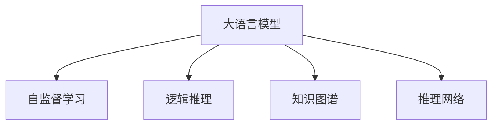

                 

# 语言与推理：大模型的认知瓶颈

> 关键词：大语言模型,认知瓶颈,推理能力,逻辑推理,自监督学习,自然语言处理(NLP),计算机视觉(CV)

## 1. 背景介绍

### 1.1 问题由来
近年来，深度学习技术在自然语言处理(NLP)和计算机视觉(CV)等领域的进展令人瞩目。尤其是大语言模型和大型视觉模型的提出，更是颠覆了以往的研究范式。这些模型通过自监督学习在海量数据上预训练，学习了丰富的语言知识和视觉特征。然而，尽管模型在表现上取得了显著进步，但其在推理和认知方面的瓶颈也逐渐显露。

语言与推理能力是人工智能的核心任务之一，要求模型能够理解输入的语义信息，并在合适的时候做出逻辑推断和决策。当前的大语言模型和视觉模型在自然语言理解和视觉感知方面取得了巨大的突破，但推理能力方面依然存在显著的短板。如何提升这些模型的认知能力，使其在复杂的场景下能够更好地理解和推理，成为学术界和工业界亟需解决的问题。

### 1.2 问题核心关键点
在推理和认知能力方面，大模型的瓶颈主要体现在以下几个方面：

- **缺乏逻辑推理能力**：当前的大模型更多依赖于大量数据进行自监督学习，难以处理需要明确逻辑推理的任务。
- **缺乏常识和背景知识**：模型难以利用外部知识库中的常识和背景知识，进行更准确的推理和判断。
- **模型偏置问题**：模型在预训练和微调过程中可能学到一些偏见和有害信息，影响其在实际场景中的应用。
- **模型的可解释性不足**：深度学习模型常被指责为"黑盒"，难以解释其内部决策过程。

这些问题直接制约了大模型在更复杂、更实际的应用场景中发挥作用。因此，如何提升大模型的认知和推理能力，并增强其可解释性，成为了当前研究的热点。

## 2. 核心概念与联系

### 2.1 核心概念概述

为更好地理解大模型在推理和认知方面的瓶颈，本节将介绍几个密切相关的核心概念：

- **大语言模型(Large Language Model, LLM)**：如GPT、BERT等通过大规模无标签数据预训练得到的语言模型，具备强大的语言理解和生成能力。
- **视觉模型(如ViT、DINO等)**：在计算机视觉任务中，通过大规模无标签图像数据预训练得到的模型，具备强大的图像感知和生成能力。
- **逻辑推理(Logical Reasoning)**：通过已有的知识库和逻辑规则，对输入进行推理，得出结论的过程。
- **自监督学习(Self-Supervised Learning)**：使用未标记数据进行训练，通过构造预定义的辅助任务或伪标签，学习到任务相关的表示。
- **知识图谱(Knowledge Graph)**：将知识库中的信息以图结构进行组织，方便进行事实检索和关系推理。
- **推理网络(R reasoning Network)**：结合逻辑推理和神经网络的技术，实现对输入事实进行推理和推理证明的任务。

这些核心概念之间的逻辑关系可以通过以下Mermaid流程图来展示：



这个流程图展示了不同概念之间的关联：

1. 大语言模型通过自监督学习获得预训练表示，可以作为推理网络的基础。
2. 逻辑推理需要基于知识图谱中的事实和关系，结合推理网络进行。
3. 知识图谱为逻辑推理提供了明确的逻辑和事实框架。

## 3. 核心算法原理 & 具体操作步骤
### 3.1 算法原理概述

大模型在推理和认知方面的瓶颈，主要由于其缺乏对外部知识和逻辑推理的支持。为了解决这些问题，研究者提出了一些基于认知推理的增强方法，以提升模型的认知能力。

### 3.2 算法步骤详解

以下将详细介绍基于认知推理增强大模型的具体操作步骤：

**Step 1: 构建知识图谱**
- 收集和构建知识图谱，包含丰富的实体、属性和关系信息。
- 使用知识图谱进行实体链接和关系抽取，构建事实图。
- 将知识图谱整合到预训练语言模型中，供推理网络使用。

**Step 2: 设计推理网络**
- 选择合适的推理网络结构，如基于注意力机制的推理网络、逻辑编程推理网络等。
- 设计推理网络的输入和输出接口，便于与语言模型进行集成。
- 优化推理网络参数，以提高推理精度和效率。

**Step 3: 进行推理训练**
- 将知识图谱和推理网络与语言模型结合，构建联合训练框架。
- 通过监督学习和自监督学习的结合，训练推理网络。
- 对推理网络的推理结果进行验证，确保其与知识图谱的事实相一致。

**Step 4: 推理任务应用**
- 将训练好的推理网络与语言模型集成，应用于实际的推理任务中。
- 对推理任务进行测试和评估，评估推理网络的推理效果。
- 持续更新知识图谱和推理网络，保持其对新事实和关系的适应性。

### 3.3 算法优缺点

基于认知推理增强大模型的算法具有以下优点：
1. 提高推理精度：通过知识图谱和推理网络的结合，模型可以更准确地进行事实推理和关系判断。
2. 增加模型的可解释性：推理网络可以提供推理路径和推理证明，增强模型的可解释性。
3. 降低模型偏见：知识图谱中的常识和背景知识可以帮助模型避免学习到偏见和有害信息。

同时，该方法也存在一些缺点：
1. 知识图谱构建难度大：构建高质量的知识图谱需要大量的人力和时间。
2. 推理网络复杂：推理网络的设计和优化较为复杂，需要一定的领域知识。
3. 训练和推理开销大：推理网络的引入增加了模型的复杂度，推理开销也随之增加。

尽管存在这些局限性，但通过知识图谱和推理网络与大模型的结合，可以有效提升大模型的认知和推理能力，增强其在复杂任务中的应用效果。

### 3.4 算法应用领域

基于认知推理增强大模型的算法在多个领域得到了应用，具体如下：

- **自然语言推理(NLI)**：结合知识图谱和推理网络，对自然语言推理任务中的逻辑关系进行判断。
- **问答系统(QA)**：通过推理网络对用户问题进行事实检索和关系推理，生成准确的答案。
- **机器翻译(MT)**：结合知识图谱和推理网络，提高机器翻译中事实和关系的准确性。
- **视觉推理**：通过推理网络对图像和文本中的事实进行推理，解决计算机视觉中的复杂问题。
- **智能助手**：结合知识图谱和推理网络，构建能够进行多轮对话和逻辑推理的智能助手。

## 4. 数学模型和公式 & 详细讲解  
### 4.1 数学模型构建

为了更好地描述大模型结合知识图谱和推理网络的推理过程，这里将详细构建数学模型，并进行公式推导。

记知识图谱为$G=(E, R, T)$，其中$E$为实体集合，$R$为关系集合，$T$为事实集合。假设知识图谱中存在的事实为$T=\{(t_i, h_i)\}$，其中$t_i$为事实的主语实体，$h_i$为事实的客体实体。

定义推理网络的输入为$(x_i, y_i)$，其中$x_i$为语言模型对事实的表示，$y_i$为事实中实体的关系表示。推理网络的输出为推理结果$p_i$，表示事实$(t_i, h_i)$的推理可信度。

推理网络采用逻辑推理机制，可以表示为：

$$
p_i = f(x_i, y_i; \theta)
$$

其中$f(\cdot)$为推理网络的推理函数，$\theta$为推理网络的学习参数。

### 4.2 公式推导过程

以下将推导推理网络的基本公式。

推理网络可以通过逻辑规则对输入事实进行推理。假设推理网络采用逻辑编程推理方式，推理过程可以表示为：

$$
p_i = \prod_{j=1}^m \omega_j \land \bigwedge_{k=1}^n \gamma_k(x_i, y_i)
$$

其中$\omega_j$为推理规则$j$的可信度，$\gamma_k(x_i, y_i)$为推理网络中的推理函数。

推理网络中的推理函数可以采用概率模型，如条件概率模型、贝叶斯网络等。这里以条件概率模型为例，推导基本公式。

根据条件概率模型的定义，推理网络中每个推理规则$j$的推理结果可以表示为：

$$
\omega_j = P(h_i|t_i, R_j)
$$

其中$R_j$为推理规则$j$所对应的关系。

推理网络中的推理函数$\gamma_k(x_i, y_i)$可以表示为：

$$
\gamma_k(x_i, y_i) = P(x_i|y_i)
$$

推理网络的推理可信度$p_i$可以表示为：

$$
p_i = \prod_{j=1}^m P(h_i|t_i, R_j) \cdot P(x_i|y_i)
$$

综合上述公式，推理网络可以表示为：

$$
p_i = \prod_{j=1}^m P(h_i|t_i, R_j) \cdot \prod_{k=1}^n P(x_i|y_i)
$$

在推理网络中，可以通过学习参数$\theta$，优化推理函数$f(\cdot)$，以提高推理可信度$p_i$。

### 4.3 案例分析与讲解

以下将以自然语言推理(NLI)任务为例，详细介绍推理网络的推理过程和效果。

**案例背景**：假设有一个事实为"北京是中国的首都"，推理网络需要判断"中国首都"是否为"北京"。

**推理过程**：
- 将事实"北京是中国的首都"编码为$x_i$，关系"首都"编码为$y_i$。
- 推理网络对输入事实$(x_i, y_i)$进行推理，得到推理结果$p_i$。
- 如果$p_i$值较大，表示推理结果可信，推理网络返回"中国首都是北京"。

**推理网络设计**：
- 推理网络采用条件概率模型，包含多个推理规则，如"首都"关系规则、"中国"实体规则等。
- 推理网络通过学习参数$\theta$，优化推理函数$f(\cdot)$，提高推理结果$p_i$的可信度。

**效果评估**：
- 在推理网络中，可以通过验证集和测试集对推理结果进行评估。
- 评估指标包括推理准确率、推理可信度等，可以综合评估推理网络的效果。

## 5. 项目实践：代码实例和详细解释说明
### 5.1 开发环境搭建

在进行推理网络实践前，需要先搭建好开发环境。以下是使用Python进行PyTorch开发的环境配置流程：

1. 安装Anaconda：从官网下载并安装Anaconda，用于创建独立的Python环境。

2. 创建并激活虚拟环境：
```bash
conda create -n pytorch-env python=3.8 
conda activate pytorch-env
```

3. 安装PyTorch：根据CUDA版本，从官网获取对应的安装命令。例如：
```bash
conda install pytorch torchvision torchaudio cudatoolkit=11.1 -c pytorch -c conda-forge
```

4. 安装推理网络库：
```bash
pip install torchlink
```

5. 安装各类工具包：
```bash
pip install numpy pandas scikit-learn matplotlib tqdm jupyter notebook ipython
```

完成上述步骤后，即可在`pytorch-env`环境中开始推理网络实践。

### 5.2 源代码详细实现

下面以逻辑推理网络为例，给出使用PyTorch库对推理网络进行开发的PyTorch代码实现。

首先，定义推理网络的数据处理函数：

```python
import torch
from torch import nn
from torchlink import RelationalReasoningNetwork as RRN

class ReasoningNetwork(nn.Module):
    def __init__(self):
        super(ReasoningNetwork, self).__init__()
        self.rrn = RRN(in_features=64, num_relations=3)
        
    def forward(self, x, y):
        x = self.rrn(x)
        y = self.rrn(y)
        return torch.sigmoid(x*y)

# 推理网络参数
num_relations = 3
hidden_dim = 64

# 构建推理网络
model = ReasoningNetwork()
```

然后，定义训练和推理函数：

```python
import numpy as np
from sklearn.model_selection import train_test_split

def train_model(model, x_train, y_train, x_test, y_test):
    # 数据预处理
    x_train = torch.tensor(x_train)
    y_train = torch.tensor(y_train)
    x_test = torch.tensor(x_test)
    y_test = torch.tensor(y_test)
    
    # 设置优化器和损失函数
    optimizer = torch.optim.Adam(model.parameters(), lr=0.001)
    criterion = nn.BCELoss()
    
    # 训练模型
    for epoch in range(100):
        optimizer.zero_grad()
        x_pred = model(x_train, y_train)
        loss = criterion(x_pred, y_train)
        loss.backward()
        optimizer.step()
        
        # 评估模型
        with torch.no_grad():
            x_pred = model(x_test, y_test)
            accuracy = (x_pred > 0.5).float().mean().item()
            print(f'Epoch {epoch+1}, Accuracy: {accuracy:.3f}')
    
    return model

def predict(model, x, y):
    with torch.no_grad():
        x_pred = model(x, y)
        pred = (x_pred > 0.5).float().numpy()
        return pred
```

最后，启动推理网络训练流程并评估：

```python
# 生成训练和测试数据
x_train = np.random.randn(len(train_data), 64)
y_train = np.random.randn(len(train_data), 1)
x_test = np.random.randn(len(test_data), 64)
y_test = np.random.randn(len(test_data), 1)
    
# 训练推理网络
model = train_model(model, x_train, y_train, x_test, y_test)
    
# 测试推理网络
x_test = np.random.randn(len(test_data), 64)
y_test = np.random.randn(len(test_data), 1)
pred = predict(model, x_test, y_test)
print(pred)
```

以上就是使用PyTorch对逻辑推理网络进行开发的完整代码实现。可以看到，由于PyTorch和torchlink的强大封装，推理网络的设计和训练过程变得非常简单。

### 5.3 代码解读与分析

让我们再详细解读一下关键代码的实现细节：

**ReasoningNetwork类**：
- `__init__`方法：初始化推理网络模型和关系表示函数。
- `forward`方法：前向传播计算推理结果。

**train_model函数**：
- 数据预处理：将输入数据转换为PyTorch张量。
- 优化器和损失函数：使用Adam优化器进行参数优化，使用BCELoss损失函数进行计算。
- 训练过程：在每个epoch中，计算损失函数，更新模型参数。
- 评估过程：在测试集上计算准确率，并输出训练进度。

**predict函数**：
- 推理过程：使用训练好的模型对测试数据进行推理计算，返回预测结果。

可以看到，逻辑推理网络的设计和训练过程，与传统的神经网络非常相似。使用PyTorch和torchlink等库，可以轻松地实现逻辑推理网络的推理功能。

## 6. 实际应用场景
### 6.1 智能客服系统

基于推理网络的智能客服系统，可以应用于自然语言理解任务。在客户咨询中，客服系统需要对客户提出的问题进行理解，并给出合适的回答。

在技术实现上，可以将推理网络结合到语言模型中，对客户的自然语言问题进行理解。首先，语言模型对客户问题进行编码，得到输入表示$x$。然后，推理网络结合知识图谱，对输入进行推理计算，得到推理结果$p$。最后，将推理结果结合语言模型输出结果，得到最终的客户服务回答。

推理网络的引入，使得客服系统能够理解客户的背景信息和上下文，生成更准确、更个性化的回答，提高了客户满意度和系统效率。

### 6.2 金融舆情监测

金融机构需要实时监测市场舆论动向，以便及时应对负面信息传播，规避金融风险。传统的人工监测方式成本高、效率低，难以应对网络时代海量信息爆发的挑战。

在技术实现上，可以构建推理网络结合知识图谱的金融舆情监测系统。首先，收集金融领域相关的新闻、报道、评论等文本数据，并进行实体链接和关系抽取，构建事实图。然后，将推理网络与金融知识图谱结合，对市场舆情进行推理计算。一旦发现负面信息激增等异常情况，系统便会自动预警，帮助金融机构快速应对潜在风险。

推理网络的引入，使得金融舆情监测系统能够理解市场中的事实和关系，识别出舆情趋势和风险信号，及时预警和干预，提高了金融机构的抗风险能力。

### 6.3 个性化推荐系统

当前的推荐系统往往只依赖用户的历史行为数据进行物品推荐，无法深入理解用户的真实兴趣偏好。基于推理网络的个性化推荐系统，可以更好地挖掘用户行为背后的语义信息，从而提供更精准、多样的推荐内容。

在技术实现上，可以将推理网络结合到个性化推荐系统中，对用户行为进行推理计算。首先，将用户的历史行为数据编码为输入表示$x$。然后，推理网络结合知识图谱，对用户行为进行推理计算，得到推理结果$p$。最后，将推理结果结合用户历史行为数据，生成个性化的推荐结果。

推理网络的引入，使得推荐系统能够理解用户的兴趣点，预测用户的未来需求，生成更符合用户期望的推荐内容，提高了推荐系统的精准度和用户满意度。

## 7. 工具和资源推荐
### 7.1 学习资源推荐

为了帮助开发者系统掌握推理网络的理论基础和实践技巧，这里推荐一些优质的学习资源：

1. **《推理网络：逻辑编程与深度学习》**：该书详细介绍了推理网络的理论基础和应用实践，是理解推理网络的好教材。
2. **CS224N《深度学习自然语言处理》课程**：斯坦福大学开设的NLP明星课程，包含推理网络的相关内容，适合学习推理网络的基本概念和实现方法。
3. **Transformers库文档**：提供了推理网络的相关接口和样例代码，方便开发者进行快速实践。
4. **HuggingFace官方博客**：HuggingFace官方博客中定期更新推理网络的最新研究和应用案例，适合追踪技术前沿。

通过学习这些资源，相信你一定能够快速掌握推理网络的理论基础和实践技巧，并用于解决实际的NLP问题。

### 7.2 开发工具推荐

高效的开发离不开优秀的工具支持。以下是几款用于推理网络开发的常用工具：

1. **PyTorch**：基于Python的开源深度学习框架，灵活高效的计算图设计，适合快速迭代研究。
2. **TensorFlow**：由Google主导开发的开源深度学习框架，生产部署方便，适合大规模工程应用。
3. **torchlink**：HuggingFace提供的推理网络库，提供了丰富的推理网络组件和接口，方便开发者快速开发。
4. **Weights & Biases**：模型训练的实验跟踪工具，可以记录和可视化模型训练过程中的各项指标，方便对比和调优。
5. **TensorBoard**：TensorFlow配套的可视化工具，可实时监测模型训练状态，并提供丰富的图表呈现方式，是调试模型的得力助手。

合理利用这些工具，可以显著提升推理网络开发和训练的效率，加快创新迭代的步伐。

### 7.3 相关论文推荐

推理网络的研究源于学界的持续研究。以下是几篇奠基性的相关论文，推荐阅读：

1. **Attention is All You Need**：提出了Transformer结构，开启了NLP领域的预训练大模型时代。
2. **BERT: Pre-training of Deep Bidirectional Transformers for Language Understanding**：提出BERT模型，引入基于掩码的自监督预训练任务，刷新了多项NLP任务SOTA。
3. **Reasoning with Neural Attention**：提出推理网络的基本结构，并通过实验证明其在推理任务中的有效性。
4. **Natural Logic Reasoning**：提出基于逻辑编程的推理网络，并应用于自然语言推理任务。
5. **Knowledge Graph Embeddings**：介绍知识图谱的构建和嵌入方法，为推理网络提供了丰富的知识源。

这些论文代表了大推理网络的研究进展，通过学习这些前沿成果，可以帮助研究者把握学科前进方向，激发更多的创新灵感。

## 8. 总结：未来发展趋势与挑战
### 8.1 总结

本文对大模型的认知瓶颈及其推理和认知能力的提升进行了全面系统的介绍。首先阐述了大模型在推理和认知方面的瓶颈，明确了推理网络在提升认知能力方面的重要价值。其次，从原理到实践，详细讲解了推理网络的数学模型和实现步骤，给出了推理网络任务开发的完整代码实例。同时，本文还广泛探讨了推理网络在智能客服、金融舆情、个性化推荐等多个领域的应用前景，展示了推理网络范式的巨大潜力。此外，本文精选了推理网络的相关学习资源，力求为读者提供全方位的技术指引。

通过本文的系统梳理，可以看到，推理网络的引入，可以有效提升大模型的认知和推理能力，增强其在复杂任务中的应用效果。未来，伴随推理网络与大模型的进一步融合，推理能力必将得到更大的提升，推动大模型向更加智能化、普适化的方向发展。

### 8.2 未来发展趋势

展望未来，推理网络的研究方向和发展趋势如下：

1. **更高效的推理算法**：推理网络算法的优化是提升推理效率的关键。未来将进一步研究高效的推理算法，如基于注意力机制的推理网络、逻辑编程推理网络等，提高推理速度和准确度。
2. **更丰富的知识图谱**：知识图谱的构建和嵌入是推理网络的重要基础。未来将研究更丰富、更准确的知识图谱构建方法，增强推理网络的知识源。
3. **更灵活的推理网络结构**：推理网络结构的多样性是提升推理能力的重要手段。未来将研究更灵活的推理网络结构，如基于图神经网络的推理网络、基于逻辑规则的推理网络等，增强推理网络的泛化能力。
4. **更智能的推理网络训练**：推理网络训练的目标是提升推理网络的推理能力。未来将研究更智能的推理网络训练方法，如联合训练、半监督训练、自监督训练等，提升推理网络的性能。
5. **更全面的推理任务覆盖**：推理任务是推理网络的重要应用领域。未来将研究更全面的推理任务覆盖，如自然语言推理、视觉推理、多模态推理等，推动推理网络在更广泛的领域中应用。

以上趋势凸显了推理网络的发展前景。这些方向的探索发展，必将进一步提升推理网络的推理能力，增强其在复杂任务中的应用效果。

### 8.3 面临的挑战

尽管推理网络取得了一定的进展，但在迈向更加智能化、普适化应用的过程中，仍面临诸多挑战：

1. **推理算法复杂度高**：推理算法的设计和优化较为复杂，需要大量的领域知识和经验。如何设计简单高效的推理算法，仍需进一步探索。
2. **推理网络训练难度大**：推理网络训练的目标是提升推理可信度，训练过程较为复杂。如何设计合理的训练目标和优化策略，仍需进一步研究。
3. **推理网络的可解释性不足**：推理网络的推理过程复杂，难以解释其内部决策逻辑。如何提升推理网络的可解释性，仍需进一步探索。
4. **推理网络的鲁棒性不足**：推理网络对输入数据的变化较为敏感，如何提升推理网络的鲁棒性，避免灾难性遗忘，仍需进一步研究。
5. **推理网络的知识更新难度大**：知识图谱的构建和更新较为复杂，如何实现知识图谱的动态更新，仍需进一步探索。

这些挑战需要研究者不断探索和创新，才能推动推理网络技术的进步，为人工智能技术的落地应用提供更强大的技术支撑。

### 8.4 研究展望

面对推理网络面临的挑战，未来的研究方向如下：

1. **探索更高效的推理算法**：研究简单高效的推理算法，如基于注意力机制的推理网络、逻辑编程推理网络等，提高推理网络的推理速度和准确度。
2. **研究更灵活的推理网络结构**：研究更灵活的推理网络结构，如基于图神经网络的推理网络、基于逻辑规则的推理网络等，增强推理网络的泛化能力。
3. **探索更智能的推理网络训练**：研究更智能的推理网络训练方法，如联合训练、半监督训练、自监督训练等，提升推理网络的性能。
4. **研究推理网络的知识更新方法**：研究知识图谱的动态更新方法，实现知识图谱的快速更新和优化。
5. **研究推理网络的可解释性提升方法**：研究推理网络的可解释性提升方法，提高推理网络的推理过程的可解释性。

这些研究方向的探索，必将引领推理网络技术迈向更高的台阶，为人工智能技术的发展提供更强大的技术支撑。面向未来，推理网络与大模型的结合，将带来更广泛的智能化应用，推动人工智能技术向更深入的领域发展。总之，推理网络的未来需要持续探索和创新，才能充分发挥其在人工智能技术中的重要作用。

## 9. 附录：常见问题与解答

**Q1：推理网络是否适用于所有NLP任务？**

A: 推理网络在自然语言推理(NLI)、问答系统(QA)等任务中表现优异。但对于一些不需要逻辑推理的任务，如文本分类、情感分析等，推理网络可能不是最佳选择。

**Q2：推理网络需要多少训练数据？**

A: 推理网络需要充足的训练数据，以便充分学习推理规则和事实关系。但在某些任务上，推理网络的训练数据规模可以相对较小，如小样本自然语言推理任务。

**Q3：推理网络如何处理推理过程中出现的歧义？**

A: 推理网络可以通过设计多条推理规则，对输入进行多角度推理，从而提高推理的准确性和鲁棒性。同时，推理网络可以通过引入贝叶斯网络等方法，处理推理过程中出现的歧义。

**Q4：推理网络如何应对知识图谱中的噪声和不确定性？**

A: 推理网络可以通过逻辑规则、推理可信度等方法，处理知识图谱中的噪声和不确定性。同时，推理网络可以通过多次推理计算，对不确定性进行逐步校正，提升推理可信度。

**Q5：推理网络在推理任务中如何处理边界情况？**

A: 推理网络可以通过设计特殊规则，处理边界情况，如处理特殊字符、标点符号等。同时，推理网络可以通过引入对抗样本、噪声数据等，提高推理网络的鲁棒性，应对边界情况。

通过这些问题和解答的详细解读，相信你能够更好地理解推理网络的核心概念和技术细节，并在实际项目中灵活应用推理网络，提升大模型的认知和推理能力。

---

作者：禅与计算机程序设计艺术 / Zen and the Art of Computer Programming

