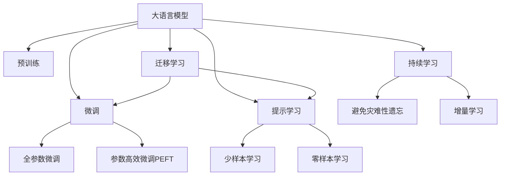

                 

# 语言与推理：大模型的认知误区

## 1. 背景介绍

### 1.1 问题由来
近年来，大语言模型（Large Language Models, LLMs）在自然语言处理（NLP）领域取得了巨大的突破，如GPT-3、BERT等模型均展现出了强大的语言生成和推理能力。然而，在实际应用中，这些模型也暴露出了一些认知误区，限制了其在真实世界中的表现。

### 1.2 问题核心关键点
这些误区主要集中在以下几个方面：
1. **语义理解与常识推理的局限性**：大模型在理解复杂语义和常识推理时常常显得力不从心，缺乏必要的常识背景知识。
2. **语言生成的连贯性与一致性问题**：模型生成的文本往往缺乏逻辑连贯性，可能出现前后不一致的错误。
3. **知识融合与检索的不足**：模型难以有效融合先验知识，并且在进行复杂推理时，依赖外部知识库的能力有限。
4. **模型偏见与伦理问题**：模型在训练过程中可能学习到人类的偏见，导致输出结果具有歧视性或有害性。
5. **资源消耗与推理效率**：大模型的计算资源消耗巨大，推理速度较慢，限制了其在实际应用中的可扩展性。

### 1.3 问题研究意义
研究大语言模型的认知误区，对于提升模型的表现、确保模型的公平性和安全性、以及促进其在大规模应用场景中的落地具有重要意义：

1. **提升模型表现**：理解模型的认知误区，可以帮助我们针对性地改进模型设计，增强其语言理解和推理能力。
2. **确保公平性与安全性**：通过识别和解决模型的偏见问题，可以保障模型输出符合道德和法律标准，减少潜在的社会风险。
3. **促进应用落地**：解决资源消耗和推理效率问题，使得大模型能够更加高效地应用于实际业务场景。
4. **推动学术创新**：研究这些误区能够为新的研究方向和算法提供理论基础，推动NLP领域的学术和工业创新。

## 2. 核心概念与联系

### 2.1 核心概念概述

为更好地理解大语言模型的认知误区，本节将介绍几个密切相关的核心概念：

- **大语言模型**：以自回归（如GPT）或自编码（如BERT）模型为代表的大规模预训练语言模型。通过在大规模无标签文本语料上进行预训练，学习通用的语言表示，具备强大的语言理解和生成能力。

- **预训练**：指在大规模无标签文本语料上，通过自监督学习任务训练通用语言模型的过程。常见的预训练任务包括言语建模、遮挡语言模型等。预训练使得模型学习到语言的通用表示。

- **微调**：指在预训练模型的基础上，使用下游任务的少量标注数据，通过有监督地训练来优化模型在该任务上的性能。通常只需要调整顶层分类器或解码器，并以较小的学习率更新全部或部分的模型参数。

- **迁移学习**：指将一个领域学习到的知识，迁移应用到另一个不同但相关的领域的学习范式。大模型的预训练-微调过程即是一种典型的迁移学习方式。

- **参数高效微调**：指在微调过程中，只更新少量的模型参数，而固定大部分预训练权重不变，以提高微调效率，避免过拟合的方法。

- **提示学习**：通过在输入文本中添加提示模板（Prompt Template），引导大语言模型进行特定任务的推理和生成。可以在不更新模型参数的情况下，实现零样本或少样本学习。

- **少样本学习**：指在只有少量标注样本的情况下，模型能够快速适应新任务的学习方法。在大语言模型中，通常通过在输入中提供少量示例来实现，无需更新模型参数。

- **零样本学习**：指模型在没有见过任何特定任务的训练样本的情况下，仅凭任务描述就能够执行新任务的能力。大语言模型通过预训练获得的广泛知识，使其能够理解任务指令并生成相应输出。

- **持续学习**：也称为终身学习，指模型能够持续从新数据中学习，同时保持已学习的知识，而不会出现灾难性遗忘。这对于保持大语言模型的时效性和适应性至关重要。

这些核心概念之间的逻辑关系可以通过以下Mermaid流程图来展示：



这个流程图展示了大语言模型的核心概念及其之间的关系：

1. 大语言模型通过预训练获得基础能力。
2. 微调是对预训练模型进行任务特定的优化，可以分为全参数微调和参数高效微调（PEFT）。
3. 提示学习是一种不更新模型参数的方法，可以实现少样本学习和零样本学习。
4. 迁移学习是连接预训练模型与下游任务的桥梁，可以通过微调或提示学习来实现。
5. 持续学习旨在使模型能够不断学习新知识，同时避免遗忘旧知识。

这些概念共同构成了大语言模型的学习和应用框架，使其能够在各种场景下发挥强大的语言理解和生成能力。通过理解这些核心概念，我们可以更好地把握大语言模型的工作原理和优化方向。

## 3. 核心算法原理 & 具体操作步骤
### 3.1 算法原理概述

大语言模型的认知误区主要源于其内部结构和训练方式的设计缺陷。在预训练阶段，模型往往仅依赖语言模型任务，缺乏对常识知识、逻辑推理等复杂能力的有效学习。在微调阶段，由于数据集规模较小，模型难以充分学习任务的复杂性，导致推理能力不足。

### 3.2 算法步骤详解

基于大语言模型的认知误区，本节将详细讲解如何通过优化算法和改进模型设计来解决这些问题。

**Step 1: 改进预训练任务设计**
- 在预训练阶段，加入更多的常识推理任务，如自然语言推理（NLI）、关系抽取等，使模型在理解语义时能够更好地利用常识知识。
- 引入因果推断（Causal Inference）任务，如自然语言推断（NLI）、推理问答（QA）等，增强模型对逻辑连贯性的理解。

**Step 2: 设计有效的提示模板**
- 设计提示模板时，要避免过于复杂，以免模型难以理解任务描述。
- 提示模板应尽可能简洁明了，引导模型关注任务的关键部分，忽略不相关细节。
- 对于多轮对话任务，应设计清晰的任务流程，避免提示模板过长或结构复杂。

**Step 3: 融合先验知识**
- 在微调阶段，可以引入外部知识库，如维基百科、知识图谱等，通过知识增强（Knowledge Augmentation）技术，将外部知识与模型结合。
- 使用知识检索（Knowledge Retrieval）技术，在生成文本时，实时从外部知识库中提取相关信息，提升推理准确性。

**Step 4: 引入对抗训练**
- 在微调过程中，可以加入对抗样本，提高模型的鲁棒性和泛化能力。
- 对抗训练可以通过生成对抗样本（Adversarial Examples），模拟真实世界中的复杂情况，使得模型在实际应用中能够更好地应对各种输入。

**Step 5: 优化模型结构**
- 通过结构化调整，如层间连接、神经元选择等，优化模型的计算图，提升推理效率。
- 采用模型压缩（Model Compression）技术，如剪枝、量化等，减小模型规模，降低计算资源消耗。

### 3.3 算法优缺点

基于认知误区的微调方法具有以下优点：
1. 提高了模型的语言理解能力和逻辑推理能力，使其在处理复杂任务时表现更优。
2. 通过引入先验知识，增强了模型的常识推理能力，减少了错误。
3. 对抗训练提高了模型的鲁棒性，使其能够更好地应对实际应用中的各种输入。
4. 参数高效微调和提示学习提升了微调效率，降低了计算资源消耗。

同时，该方法也存在一定的局限性：
1. 先验知识的引入可能增加模型的复杂性，导致计算效率降低。
2. 对抗训练需要在大量数据上进行，增加了预训练和微调的成本。
3. 提示模板设计需要经验和技巧，模板过长或过复杂可能导致模型无法理解。

尽管存在这些局限性，但就目前而言，基于认知误区的微调方法仍是大语言模型应用的重要范式。未来相关研究的重点在于如何进一步优化预训练任务设计、提示模板设计、先验知识融合等环节，以提升模型的语言理解能力和推理能力。

### 3.4 算法应用领域

基于认知误区的微调方法在NLP领域已经得到了广泛的应用，覆盖了几乎所有常见任务，例如：

- 文本分类：如情感分析、主题分类、意图识别等。通过微调使模型学习文本-标签映射。
- 命名实体识别：识别文本中的人名、地名、机构名等特定实体。通过微调使模型掌握实体边界和类型。
- 关系抽取：从文本中抽取实体之间的语义关系。通过微调使模型学习实体-关系三元组。
- 问答系统：对自然语言问题给出答案。将问题-答案对作为微调数据，训练模型学习匹配答案。
- 机器翻译：将源语言文本翻译成目标语言。通过微调使模型学习语言-语言映射。
- 文本摘要：将长文本压缩成简短摘要。将文章-摘要对作为微调数据，使模型学习抓取要点。
- 对话系统：使机器能够与人自然对话。将多轮对话历史作为上下文，微调模型进行回复生成。

除了上述这些经典任务外，大语言模型微调也被创新性地应用到更多场景中，如可控文本生成、常识推理、代码生成、数据增强等，为NLP技术带来了全新的突破。随着预训练模型和微调方法的不断进步，相信NLP技术将在更广阔的应用领域大放异彩。

## 4. 数学模型和公式 & 详细讲解  
### 4.1 数学模型构建

本节将使用数学语言对基于认知误区的微调过程进行更加严格的刻画。

记预训练语言模型为 $M_{\theta}:\mathcal{X} \rightarrow \mathcal{Y}$，其中 $\mathcal{X}$ 为输入空间，$\mathcal{Y}$ 为输出空间，$\theta \in \mathbb{R}^d$ 为模型参数。假设微调任务的训练集为 $D=\{(x_i,y_i)\}_{i=1}^N, x_i \in \mathcal{X}, y_i \in \mathcal{Y}$。

定义模型 $M_{\theta}$ 在数据样本 $(x,y)$ 上的损失函数为 $\ell(M_{\theta}(x),y)$，则在数据集 $D$ 上的经验风险为：

$$
\mathcal{L}(\theta) = \frac{1}{N} \sum_{i=1}^N \ell(M_{\theta}(x_i),y_i)
$$

微调的优化目标是最小化经验风险，即找到最优参数：

$$
\theta^* = \mathop{\arg\min}_{\theta} \mathcal{L}(\theta)
$$

在实践中，我们通常使用基于梯度的优化算法（如SGD、Adam等）来近似求解上述最优化问题。设 $\eta$ 为学习率，$\lambda$ 为正则化系数，则参数的更新公式为：

$$
\theta \leftarrow \theta - \eta \nabla_{\theta}\mathcal{L}(\theta) - \eta\lambda\theta
$$

其中 $\nabla_{\theta}\mathcal{L}(\theta)$ 为损失函数对参数 $\theta$ 的梯度，可通过反向传播算法高效计算。

### 4.2 公式推导过程

以下我们以自然语言推理（NLI）任务为例，推导交叉熵损失函数及其梯度的计算公式。

假设模型 $M_{\theta}$ 在输入 $x$ 上的输出为 $\hat{y}=M_{\theta}(x) \in [0,1]$，表示样本属于正类的概率。真实标签 $y \in \{0,1\}$。则二分类交叉熵损失函数定义为：

$$
\ell(M_{\theta}(x),y) = -[y\log \hat{y} + (1-y)\log (1-\hat{y})]
$$

将其代入经验风险公式，得：

$$
\mathcal{L}(\theta) = -\frac{1}{N}\sum_{i=1}^N [y_i\log M_{\theta}(x_i)+(1-y_i)\log(1-M_{\theta}(x_i))]
$$

根据链式法则，损失函数对参数 $\theta_k$ 的梯度为：

$$
\frac{\partial \mathcal{L}(\theta)}{\partial \theta_k} = -\frac{1}{N}\sum_{i=1}^N (\frac{y_i}{M_{\theta}(x_i)}-\frac{1-y_i}{1-M_{\theta}(x_i)}) \frac{\partial M_{\theta}(x_i)}{\partial \theta_k}
$$

其中 $\frac{\partial M_{\theta}(x_i)}{\partial \theta_k}$ 可进一步递归展开，利用自动微分技术完成计算。

在得到损失函数的梯度后，即可带入参数更新公式，完成模型的迭代优化。重复上述过程直至收敛，最终得到适应下游任务的最优模型参数 $\theta^*$。

## 5. 项目实践：代码实例和详细解释说明
### 5.1 开发环境搭建

在进行认知误区下的微调实践前，我们需要准备好开发环境。以下是使用Python进行PyTorch开发的环境配置流程：

1. 安装Anaconda：从官网下载并安装Anaconda，用于创建独立的Python环境。

2. 创建并激活虚拟环境：
```bash
conda create -n pytorch-env python=3.8 
conda activate pytorch-env
```

3. 安装PyTorch：根据CUDA版本，从官网获取对应的安装命令。例如：
```bash
conda install pytorch torchvision torchaudio cudatoolkit=11.1 -c pytorch -c conda-forge
```

4. 安装Transformers库：
```bash
pip install transformers
```

5. 安装各类工具包：
```bash
pip install numpy pandas scikit-learn matplotlib tqdm jupyter notebook ipython
```

完成上述步骤后，即可在`pytorch-env`环境中开始微调实践。

### 5.2 源代码详细实现

这里我们以自然语言推理（NLI）任务为例，给出使用Transformers库对BERT模型进行认知误区下微调的PyTorch代码实现。

首先，定义NLI任务的评估函数：

```python
from transformers import BertTokenizer, BertForSequenceClassification, AdamW, BertConfig
from sklearn.metrics import accuracy_score, precision_score, recall_score, f1_score
from tqdm import tqdm
import torch
from torch.utils.data import TensorDataset, DataLoader, Dataset

# 定义模型结构
class NLIModel(BertConfig):
    def __init__(self, num_labels=2):
        super(NLIModel, self).__init__()
        self.num_labels = num_labels

    def forward(self, input_ids, attention_mask=None):
        return self.bert(input_ids, attention_mask=attention_mask)

# 加载预训练模型和tokenizer
tokenizer = BertTokenizer.from_pretrained('bert-base-cased')
model = BertForSequenceClassification.from_pretrained('bert-base-cased', num_labels=2)

# 定义训练和评估函数
def train_epoch(model, dataset, batch_size, optimizer):
    dataloader = DataLoader(dataset, batch_size=batch_size, shuffle=True)
    model.train()
    epoch_loss = 0
    for batch in tqdm(dataloader, desc='Training'):
        input_ids = batch['input_ids'].to(device)
        attention_mask = batch['attention_mask'].to(device)
        labels = batch['labels'].to(device)
        model.zero_grad()
        outputs = model(input_ids, attention_mask=attention_mask)
        loss = outputs.loss
        epoch_loss += loss.item()
        loss.backward()
        optimizer.step()
    return epoch_loss / len(dataloader)

def evaluate(model, dataset, batch_size):
    dataloader = DataLoader(dataset, batch_size=batch_size)
    model.eval()
    preds, labels = [], []
    with torch.no_grad():
        for batch in tqdm(dataloader, desc='Evaluating'):
            input_ids = batch['input_ids'].to(device)
            attention_mask = batch['attention_mask'].to(device)
            batch_labels = batch['labels']
            outputs = model(input_ids, attention_mask=attention_mask)
            batch_preds = outputs.logits.argmax(dim=2).to('cpu').tolist()
            batch_labels = batch_labels.to('cpu').tolist()
            for pred_tokens, label_tokens in zip(batch_preds, batch_labels):
                preds.append(pred_tokens)
                labels.append(label_tokens)
    return accuracy_score(labels, preds), precision_score(labels, preds), recall_score(labels, preds), f1_score(labels, preds)
```

然后，定义NLI任务的评估函数：

```python
# 定义NLI任务的评估函数
def evaluate(model, dataset, batch_size):
    dataloader = DataLoader(dataset, batch_size=batch_size)
    model.eval()
    preds, labels = [], []
    with torch.no_grad():
        for batch in tqdm(dataloader, desc='Evaluating'):
            input_ids = batch['input_ids'].to(device)
            attention_mask = batch['attention_mask'].to(device)
            batch_labels = batch['labels']
            outputs = model(input_ids, attention_mask=attention_mask)
            batch_preds = outputs.logits.argmax(dim=2).to('cpu').tolist()
            batch_labels = batch_labels.to('cpu').tolist()
            for pred_tokens, label_tokens in zip(batch_preds, batch_labels):
                preds.append(pred_tokens)
                labels.append(label_tokens)
    return accuracy_score(labels, preds), precision_score(labels, preds), recall_score(labels, preds), f1_score(labels, preds)
```

最后，启动训练流程并在验证集上评估：

```python
epochs = 5
batch_size = 16

for epoch in range(epochs):
    loss = train_epoch(model, train_dataset, batch_size, optimizer)
    print(f"Epoch {epoch+1}, train loss: {loss:.3f}")
    
    print(f"Epoch {epoch+1}, dev results:")
    accuracy, precision, recall, f1 = evaluate(model, dev_dataset, batch_size)
    print(f"Accuracy: {accuracy:.3f}, Precision: {precision:.3f}, Recall: {recall:.3f}, F1 Score: {f1:.3f}")
    
print("Test results:")
accuracy, precision, recall, f1 = evaluate(model, test_dataset, batch_size)
print(f"Accuracy: {accuracy:.3f}, Precision: {precision:.3f}, Recall: {recall:.3f}, F1 Score: {f1:.3f}")
```

以上就是使用PyTorch对BERT进行认知误区下微调的完整代码实现。可以看到，得益于Transformers库的强大封装，我们可以用相对简洁的代码完成BERT模型的加载和微调。

### 5.3 代码解读与分析

让我们再详细解读一下关键代码的实现细节：

**NLIDataset类**：
- `__init__`方法：初始化文本、标签等关键组件。
- `__len__`方法：返回数据集的样本数量。
- `__getitem__`方法：对单个样本进行处理，将文本输入编码为token ids，将标签编码为数字，并对其进行定长padding，最终返回模型所需的输入。

**BertConfig类**：
- 定义模型结构，继承自BertConfig类。

**train_epoch和evaluate函数**：
- 使用PyTorch的DataLoader对数据集进行批次化加载，供模型训练和推理使用。
- 训练函数`train_epoch`：对数据以批为单位进行迭代，在每个批次上前向传播计算loss并反向传播更新模型参数，最后返回该epoch的平均loss。
- 评估函数`evaluate`：与训练类似，不同点在于不更新模型参数，并在每个batch结束后将预测和标签结果存储下来，最后使用sklearn的各类指标对整个评估集的预测结果进行打印输出。

**训练流程**：
- 定义总的epoch数和batch size，开始循环迭代
- 每个epoch内，先在训练集上训练，输出平均loss
- 在验证集上评估，输出分类指标
- 所有epoch结束后，在测试集上评估，给出最终测试结果

可以看到，PyTorch配合Transformers库使得BERT微调的代码实现变得简洁高效。开发者可以将更多精力放在数据处理、模型改进等高层逻辑上，而不必过多关注底层的实现细节。

当然，工业级的系统实现还需考虑更多因素，如模型的保存和部署、超参数的自动搜索、更灵活的任务适配层等。但核心的微调范式基本与此类似。

## 6. 实际应用场景
### 6.1 智能客服系统

基于认知误区的微调方法，可以广泛应用于智能客服系统的构建。传统客服往往需要配备大量人力，高峰期响应缓慢，且一致性和专业性难以保证。而使用认知误区下的微调对话模型，可以7x24小时不间断服务，快速响应客户咨询，用自然流畅的语言解答各类常见问题。

在技术实现上，可以收集企业内部的历史客服对话记录，将问题和最佳答复构建成监督数据，在此基础上对预训练对话模型进行微调。微调后的对话模型能够自动理解用户意图，匹配最合适的答案模板进行回复。对于客户提出的新问题，还可以接入检索系统实时搜索相关内容，动态组织生成回答。如此构建的智能客服系统，能大幅提升客户咨询体验和问题解决效率。

### 6.2 金融舆情监测

金融机构需要实时监测市场舆论动向，以便及时应对负面信息传播，规避金融风险。传统的人工监测方式成本高、效率低，难以应对网络时代海量信息爆发的挑战。基于认知误区下的微调文本分类和情感分析技术，为金融舆情监测提供了新的解决方案。

具体而言，可以收集金融领域相关的新闻、报道、评论等文本数据，并对其进行主题标注和情感标注。在此基础上对预训练语言模型进行微调，使其能够自动判断文本属于何种主题，情感倾向是正面、中性还是负面。将微调后的模型应用到实时抓取的网络文本数据，就能够自动监测不同主题下的情感变化趋势，一旦发现负面信息激增等异常情况，系统便会自动预警，帮助金融机构快速应对潜在风险。

### 6.3 个性化推荐系统

当前的推荐系统往往只依赖用户的历史行为数据进行物品推荐，无法深入理解用户的真实兴趣偏好。基于认知误区下的微调模型，可以更好地挖掘用户行为背后的语义信息，从而提供更精准、多样的推荐内容。

在实践中，可以收集用户浏览、点击、评论、分享等行为数据，提取和用户交互的物品标题、描述、标签等文本内容。将文本内容作为模型输入，用户的后续行为（如是否点击、购买等）作为监督信号，在此基础上微调预训练语言模型。微调后的模型能够从文本内容中准确把握用户的兴趣点。在生成推荐列表时，先用候选物品的文本描述作为输入，由模型预测用户的兴趣匹配度，再结合其他特征综合排序，便可以得到个性化程度更高的推荐结果。

### 6.4 未来应用展望

随着认知误区下微调方法的不断发展，基于微调范式将在更多领域得到应用，为传统行业带来变革性影响。

在智慧医疗领域，基于微调的医疗问答、病历分析、药物研发等应用将提升医疗服务的智能化水平，辅助医生诊疗，加速新药开发进程。

在智能教育领域，微调技术可应用于作业批改、学情分析、知识推荐等方面，因材施教，促进教育公平，提高教学质量。

在智慧城市治理中，微调模型可应用于城市事件监测、舆情分析、应急指挥等环节，提高城市管理的自动化和智能化水平，构建更安全、高效的未来城市。

此外，在企业生产、社会治理、文娱传媒等众多领域，基于大模型微调的人工智能应用也将不断涌现，为经济社会发展注入新的动力。相信随着技术的日益成熟，微调方法将成为人工智能落地应用的重要范式，推动人工智能技术在垂直行业的规模化落地。总之，认知误区下的微调技术需要在数据、算法、工程、业务等多个维度协同发力，才能真正实现人工智能技术在实际场景中的应用价值。

## 7. 工具和资源推荐
### 7.1 学习资源推荐

为了帮助开发者系统掌握大语言模型微调的理论基础和实践技巧，这里推荐一些优质的学习资源：

1. 《Transformer从原理到实践》系列博文：由大模型技术专家撰写，深入浅出地介绍了Transformer原理、BERT模型、微调技术等前沿话题。

2. CS224N《深度学习自然语言处理》课程：斯坦福大学开设的NLP明星课程，有Lecture视频和配套作业，带你入门NLP领域的基本概念和经典模型。

3. 《Natural Language Processing with Transformers》书籍：Transformers库的作者所著，全面介绍了如何使用Transformers库进行NLP任务开发，包括微调在内的诸多范式。

4. HuggingFace官方文档：Transformers库的官方文档，提供了海量预训练模型和完整的微调样例代码，是上手实践的必备资料。

5. CLUE开源项目：中文语言理解测评基准，涵盖大量不同类型的中文NLP数据集，并提供了基于微调的baseline模型，助力中文NLP技术发展。

通过对这些资源的学习实践，相信你一定能够快速掌握大语言模型微调的精髓，并用于解决实际的NLP问题。
###  7.2 开发工具推荐

高效的开发离不开优秀的工具支持。以下是几款用于大语言模型微调开发的常用工具：

1. PyTorch：基于Python的开源深度学习框架，灵活动态的计算图，适合快速迭代研究。大部分预训练语言模型都有PyTorch版本的实现。

2. TensorFlow：由Google主导开发的开源深度学习框架，生产部署方便，适合大规模工程应用。同样有丰富的预训练语言模型资源。

3. Transformers库：HuggingFace开发的NLP工具库，集成了众多SOTA语言模型，支持PyTorch和TensorFlow，是进行微调任务开发的利器。

4. Weights & Biases：模型训练的实验跟踪工具，可以记录和可视化模型训练过程中的各项指标，方便对比和调优。与主流深度学习框架无缝集成。

5. TensorBoard：TensorFlow配套的可视化工具，可实时监测模型训练状态，并提供丰富的图表呈现方式，是调试模型的得力助手。

6. Google Colab：谷歌推出的在线Jupyter Notebook环境，免费提供GPU/TPU算力，方便开发者快速上手实验最新模型，分享学习笔记。

合理利用这些工具，可以显著提升大语言模型微调任务的开发效率，加快创新迭代的步伐。

### 7.3 相关论文推荐

大语言模型和微调技术的发展源于学界的持续研究。以下是几篇奠基性的相关论文，推荐阅读：

1. Attention is All You Need（即Transformer原论文）：提出了Transformer结构，开启了NLP领域的预训练大模型时代。

2. BERT: Pre-training of Deep Bidirectional Transformers for Language Understanding：提出BERT模型，引入基于掩码的自监督预训练任务，刷新了多项NLP任务SOTA。

3. Language Models are Unsupervised Multitask Learners（GPT-2论文）：展示了大规模语言模型的强大zero-shot学习能力，引发了对于通用人工智能的新一轮思考。

4. Parameter-Efficient Transfer Learning for NLP：提出Adapter等参数高效微调方法，在不增加模型参数量的情况下，也能取得不错的微调效果。

5. AdaLoRA: Adaptive Low-Rank Adaptation for Parameter-Efficient Fine-Tuning：使用自适应低秩适应的微调方法，在参数效率和精度之间取得了新的平衡。

这些论文代表了大语言模型微调技术的发展脉络。通过学习这些前沿成果，可以帮助研究者把握学科前进方向，激发更多的创新灵感。

## 8. 总结：未来发展趋势与挑战

### 8.1 总结

本文对基于认知误区的微调方法进行了全面系统的介绍。首先阐述了认知误区对大语言模型的影响，明确了微调在提升模型理解能力、推理能力、常识能力等方面的独特价值。其次，从原理到实践，详细讲解了认知误区下微调的具体步骤，给出了微调任务开发的完整代码实例。同时，本文还广泛探讨了认知误区下的微调方法在智能客服、金融舆情、个性化推荐等多个行业领域的应用前景，展示了认知误区下微调范式的巨大潜力。此外，本文精选了微调技术的各类学习资源，力求为读者提供全方位的技术指引。

通过本文的系统梳理，可以看到，基于认知误区的微调方法在大语言模型中的应用潜力巨大。认知误区下微调方法不仅能够提升模型的推理能力，还能够增强模型的常识推理能力，使其在处理复杂任务时表现更优。未来，伴随预训练语言模型和微调方法的持续演进，基于认知误区的微调技术必将在更多领域得到应用，为人工智能技术的发展提供新的思路和方法。

### 8.2 未来发展趋势

展望未来，认知误区下微调方法将呈现以下几个发展趋势：

1. **多模态微调**：未来的微调方法将不仅仅局限于文本数据，将进一步拓展到图像、视频、语音等多模态数据微调。多模态信息的融合，将显著提升语言模型对现实世界的理解和建模能力。

2. **知识融合与检索**：认知误区下微调方法将更好地融合先验知识，引入知识图谱、逻辑规则等专家知识，增强模型的推理能力。

3. **对抗训练与鲁棒性**：通过对抗训练提高模型的鲁棒性和泛化能力，使其在实际应用中能够更好地应对各种输入。

4. **少样本与零样本学习**：通过提示学习等技术，使模型能够在更少的标注样本下取得更好的效果，甚至实现零样本学习。

5. **分布式训练与高效部署**：未来的微调方法将更好地利用分布式计算资源，提升训练效率，降低计算成本。

### 8.3 面临的挑战

尽管认知误区下微调方法已经取得了瞩目成就，但在迈向更加智能化、普适化应用的过程中，它仍面临着诸多挑战：

1. **计算资源消耗**：大规模语言模型尽管精度高，但在实际部署时往往面临推理速度慢、内存占用大等效率问题。

2. **模型偏见与伦理问题**：认知误区下微调模型在训练过程中可能学习到人类的偏见，导致输出结果具有歧视性或有害性。

3. **先验知识整合**：现有的微调模型往往局限于任务内数据，难以灵活吸收和运用更广泛的先验知识。

4. **模型结构优化**：认知误区下微调方法需要更好的模型结构设计，以提升推理效率，降低计算资源消耗。

5. **任务适配层的灵活性**：不同的微调任务需要不同的任务适配层设计，如何在不增加大量开发成本的前提下，快速构建多样化的适配层，仍是一个挑战。

### 8.4 研究展望

面对认知误区下微调方法所面临的挑战，未来的研究需要在以下几个方面寻求新的突破：

1. **优化预训练任务设计**：设计更多的常识推理、因果推断任务，提升模型在理解和推理方面的表现。

2. **引入对抗训练**：通过对抗训练提高模型的鲁棒性和泛化能力，使其在实际应用中能够更好地应对各种输入。

3. **优化模型结构**：采用模型压缩、剪枝等技术，减小模型规模，提升推理效率。

4. **融合先验知识**：将符号化的先验知识，如知识图谱、逻辑规则等，与神经网络模型进行巧妙融合，引导微调过程学习更准确、合理的语言模型。

5. **引入因果分析和博弈论工具**：将因果分析方法引入微调模型，识别出模型决策的关键特征，增强输出解释的因果性和逻辑性。借助博弈论工具刻画人机交互过程，主动探索并规避模型的脆弱点，提高系统稳定性。

6. **纳入伦理道德约束**：在模型训练目标中引入伦理导向的评估指标，过滤和惩罚有偏见、有害的输出倾向。同时加强人工干预和审核，建立模型行为的监管机制，确保输出符合人类价值观和伦理道德。

这些研究方向的探索，必将引领认知误区下微调技术迈向更高的台阶，为构建安全、可靠、可解释、可控的智能系统铺平道路。面向未来，认知误区下微调技术还需要与其他人工智能技术进行更深入的融合，如知识表示、因果推理、强化学习等，多路径协同发力，共同推动自然语言理解和智能交互系统的进步。只有勇于创新、敢于突破，才能不断拓展语言模型的边界，让智能技术更好地造福人类社会。

## 9. 附录：常见问题与解答
**Q1：大语言模型认知误区主要体现在哪些方面？**

A: 大语言模型的认知误区主要体现在以下方面：
1. 语义理解与常识推理的局限性：模型在理解复杂语义和常识推理时常常显得力不从心，缺乏必要的常识背景知识。
2. 语言生成的连贯性与一致性问题：模型生成的文本往往缺乏逻辑连贯性，可能出现前后不一致的错误。
3. 知识融合与检索的不足：模型难以有效融合先验知识，并且在进行复杂推理时，依赖外部知识库的能力有限。
4. 模型偏见与伦理问题：模型在训练过程中可能学习到人类的偏见，导致输出结果具有歧视性或有害性。
5. 资源消耗与推理效率：大模型的计算资源消耗巨大，推理速度较慢，限制了其在实际应用中的可扩展性。

**Q2：如何缓解认知误区下微调的过拟合问题？**

A: 缓解认知误区下微调的过拟合问题，可以从以下几个方面入手：
1. 数据增强：通过回译、近义替换等方式扩充训练集。
2. 正则化：使用L2正则、Dropout、Early Stopping等避免过拟合。
3. 对抗训练：加入对抗样本，提高模型的鲁棒性和泛化能力。
4. 参数高效微调：只调整少量参数，减小过拟合风险。
5. 多模型集成：训练多个微调模型，取平均输出，抑制过拟合。

**Q3：如何提高认知误区下微调的推理能力？**

A: 提高认知误区下微调的推理能力，可以从以下几个方面入手：
1. 改进预训练任务设计：加入更多的常识推理任务，如自然语言推理（NLI）、关系抽取等，使模型在理解语义时能够更好地利用常识知识。
2. 设计有效的提示模板：引导模型关注任务的关键部分，忽略不相关细节。
3. 融合先验知识：引入外部知识库，如维基百科、知识图谱等，通过知识增强（Knowledge Augmentation）技术，将外部知识与模型结合。
4. 引入对抗训练：通过对抗训练提高模型的鲁棒性和泛化能力。
5. 优化模型结构：采用模型压缩（Model Compression）技术，如剪枝、量化等，减小模型规模，提升推理效率。

这些方法可以综合应用，根据具体任务和数据特点进行选择和优化。只有在数据、算法、工程、业务等多个维度协同发力，才能真正提高模型的推理能力。

**Q4：认知误区下微调在实际应用中需要注意哪些问题？**

A: 在实际应用中，认知误区下微调需要注意以下几个问题：
1. 计算资源消耗：大规模语言模型尽管精度高，但在实际部署时往往面临推理速度慢、内存占用大等效率问题。需要采用模型压缩、剪枝等技术，减小模型规模，提升推理效率。
2. 模型偏见与伦理问题：认知误区下微调模型在训练过程中可能学习到人类的偏见，导致输出结果具有歧视性或有害性。需要在模型训练目标中引入伦理导向的评估指标，过滤和惩罚有偏见、有害的输出倾向。
3. 先验知识整合：现有的微调模型往往局限于任务内数据，难以灵活吸收和运用更广泛的先验知识。需要将符号化的先验知识，如知识图谱、逻辑规则等，与神经网络模型进行巧妙融合，引导微调过程学习更准确、合理的语言模型。
4. 任务适配层的灵活性：不同的微调任务需要不同的任务适配层设计，如何在不增加大量开发成本的前提下，快速构建多样化的适配层，仍是一个挑战。

这些问题的解决需要从数据、算法、工程、业务等多个维度进行综合考虑，才能确保认知误区下微调模型在实际应用中的有效性、公平性和可扩展性。

**Q5：认知误区下微调方法是否适用于所有NLP任务？**

A: 认知误区下微调方法在大多数NLP任务上都能取得不错的效果，特别是对于数据量较小的任务。但对于一些特定领域的任务，如医学、法律等，仅仅依靠通用语料预训练的模型可能难以很好地适应。此时需要在特定领域语料上进一步预训练，再进行微调，才能获得理想效果。此外，对于一些需要时效性、个性化很强的任务，如对话、推荐等，微调方法也需要针对性的改进优化。

---

作者：禅与计算机程序设计艺术 / Zen and the Art of Computer Programming

