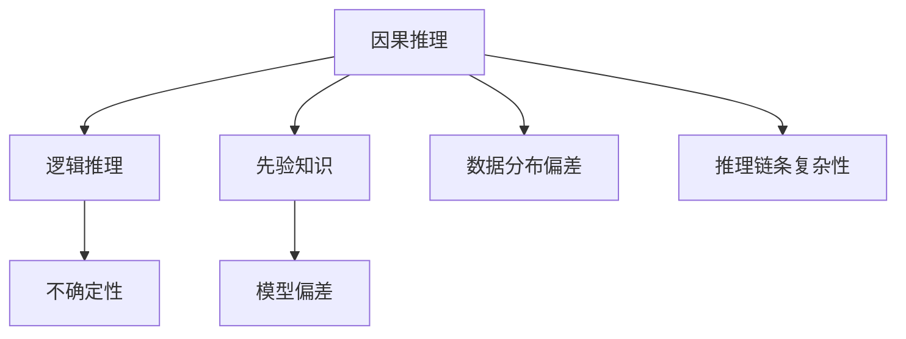
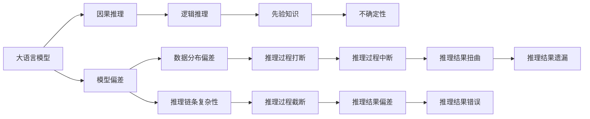

                 

# 语言与推理：大模型的认知障碍

大语言模型（Large Language Models, LLMs）是近年来人工智能领域的重要突破，通过在大量文本数据上进行预训练，可以学习到丰富的语言知识和推理能力。然而，尽管在许多自然语言处理任务上取得了显著的进展，大语言模型在执行特定逻辑推理和因果关系时，依然面临诸多认知障碍。本文将深入探讨这些认知障碍的形成原因，以及可能的解决方案，以期推动大语言模型的进一步发展。

## 1. 背景介绍

### 1.1 问题由来
大语言模型在处理复杂推理任务时，常会出现逻辑错误、因果关系混淆等问题。例如，模型可能错误地将因果关系颠倒，或者在推导结论时遗漏关键信息。这些问题不仅影响了模型的实用性和可靠性，还引发了对其推理能力的广泛质疑。

### 1.2 问题核心关键点
造成大模型推理失败的核心关键点在于其基于数据驱动的学习方式。模型在训练过程中，仅关注输入与输出之间的统计关联，而忽略了推理过程中的因果逻辑。此外，模型在处理复杂情境时，容易受到数据分布的偏差和噪声干扰，导致推理失误。

## 2. 核心概念与联系

### 2.1 核心概念概述

为理解大语言模型在推理过程中存在的认知障碍，首先需要介绍几个关键概念：

- **因果推理（Causal Reasoning）**：指识别并处理输入数据中因果关系的能力。例如，在自然语言中，理解“因为...所以...”的因果结构。
- **逻辑推理（Logical Reasoning）**：指基于形式逻辑规则，从前提推出结论的能力。例如，“如果A，则B；如果C，则D；因此，如果A且C，则B且D”。
- **先验知识（Prior Knowledge）**：指模型在推理过程中可以利用的先验信息，例如事实、常识等。
- **不确定性（Uncertainty）**：指推理过程中的不确定性来源，例如数据样本的不完备性、推理链条的复杂性等。
- **模型偏差（Model Bias）**：指模型在训练过程中学到的不公正、不合理的知识，可能对特定群体产生偏见。

这些概念之间的逻辑关系可以通过以下Mermaid流程图来展示：



### 2.2 核心概念原理和架构的 Mermaid 流程图


## 3. 核心算法原理 & 具体操作步骤

### 3.1 算法原理概述

大语言模型在推理过程中的认知障碍，主要源于以下几方面：

- **统计依赖性**：模型依赖输入输出之间的统计关系进行推理，难以处理复杂的因果逻辑。
- **知识表示**：模型缺乏对复杂情境的先验知识，依赖数据驱动的统计模式，难以泛化到新情境。
- **不确定性处理**：模型难以处理推理过程中的不确定性，容易在噪声或不完备数据下产生误判。
- **偏差和偏见**：模型可能学习到数据中的偏见和不公正信息，影响推理的公平性和准确性。

### 3.2 算法步骤详解

针对上述问题，大语言模型的推理优化可以遵循以下步骤：

1. **引入因果推理机制**：在模型中引入因果推理机制，提升模型识别和处理因果关系的能力。
2. **增强逻辑推理能力**：通过改进模型的逻辑推理算法，提升模型遵循逻辑规则进行推理的能力。
3. **利用先验知识**：在推理过程中，融入外部先验知识，帮助模型更好地理解推理情境。
4. **处理不确定性**：采用不确定性量化和不确定性传播方法，提升模型对推理不确定性的处理能力。
5. **减少偏差和偏见**：通过数据清洗和模型训练中的公平性约束，减少模型对数据的偏见和偏见。

### 3.3 算法优缺点

引入因果推理和逻辑推理等机制，可以显著提升大语言模型的推理能力，但也带来了一些新的挑战：

- **复杂性增加**：在模型中加入因果推理和逻辑推理，可能会增加模型的复杂性和计算负担。
- **需要更多数据**：因果推理和逻辑推理往往需要更多的数据支持，难以在小规模数据上发挥作用。
- **可解释性降低**：引入复杂的推理机制后，模型的输出变得难以解释，增加了调试和调优的难度。

### 3.4 算法应用领域

尽管存在这些挑战，大语言模型引入因果推理和逻辑推理的能力，在多个领域具有广阔的应用前景：

- **自然语言理解（NLU）**：在问答系统、文本摘要、信息抽取等任务中，提升模型对因果逻辑的理解和处理能力。
- **法律推理**：在法律判决、合同分析等任务中，提升模型对法律规则的遵循和应用能力。
- **医疗诊断**：在病历分析、药物研发等任务中，提升模型对病理因果关系的理解和推理能力。
- **金融风险评估**：在信用评分、欺诈检测等任务中，提升模型对因果关系的识别和应用能力。
- **智能客服**：在对话系统、智能推荐等任务中，提升模型对用户行为因果关系的理解能力。

## 4. 数学模型和公式 & 详细讲解 & 举例说明

### 4.1 数学模型构建

在讨论大语言模型的推理过程中，通常使用条件概率模型来描述推理关系。假设模型接收输入 $x$，期望输出 $y$，推理过程可以表示为：

$$
P(y|x) = \frac{P(x|y)P(y)}{P(x)}
$$

其中 $P(x|y)$ 表示在已知 $y$ 的条件下，$x$ 的先验概率；$P(y)$ 表示 $y$ 的先验概率；$P(x)$ 表示 $x$ 的边际概率。

### 4.2 公式推导过程

以一个简单的因果推理问题为例，假设模型已知 $x_1$ 和 $x_2$，并推理 $y$ 的值。已知 $y$ 的条件概率为：

$$
P(y|x_1, x_2) = \frac{P(x_1|y)P(x_2|y)P(y)}{P(x_1, x_2)}
$$

在推理时，模型需要基于已知条件 $x_1$ 和 $x_2$，推断出 $y$ 的值。通过最大化上述条件概率，模型可以给出 $y$ 的最可能值。

### 4.3 案例分析与讲解

以金融风险评估为例，假设模型需要评估贷款申请人的违约风险 $y$，已知其收入 $x_1$ 和负债 $x_2$。模型可以通过以下步骤进行推理：

1. 收集大量历史贷款数据，训练模型学习 $P(y|x_1, x_2)$。
2. 对于新的贷款申请人，输入其收入和负债。
3. 模型根据已知的因果关系，推断出申请人违约的概率。

需要注意的是，模型在推理时，需要处理不确定性和噪声，同时避免学习到数据中的偏见和偏差。

## 5. 项目实践：代码实例和详细解释说明

### 5.1 开发环境搭建

在进行大语言模型的推理优化实践前，首先需要准备开发环境。以下是使用Python进行PyTorch开发的环境配置流程：

1. 安装Anaconda：从官网下载并安装Anaconda，用于创建独立的Python环境。

2. 创建并激活虚拟环境：
```bash
conda create -n pytorch-env python=3.8 
conda activate pytorch-env
```

3. 安装PyTorch：根据CUDA版本，从官网获取对应的安装命令。例如：
```bash
conda install pytorch torchvision torchaudio cudatoolkit=11.1 -c pytorch -c conda-forge
```

4. 安装Transformers库：
```bash
pip install transformers
```

5. 安装各类工具包：
```bash
pip install numpy pandas scikit-learn matplotlib tqdm jupyter notebook ipython
```

完成上述步骤后，即可在`pytorch-env`环境中开始推理优化实践。

### 5.2 源代码详细实现

下面我们以因果推理优化为例，给出使用Transformers库进行BERT模型推理优化的PyTorch代码实现。

首先，定义因果推理任务的训练数据集：

```python
from transformers import BertTokenizer
from torch.utils.data import Dataset
import torch

class CausalReasoningDataset(Dataset):
    def __init__(self, texts, labels, tokenizer, max_len=128):
        self.texts = texts
        self.labels = labels
        self.tokenizer = tokenizer
        self.max_len = max_len
        
    def __len__(self):
        return len(self.texts)
    
    def __getitem__(self, item):
        text = self.texts[item]
        label = self.labels[item]
        
        encoding = self.tokenizer(text, return_tensors='pt', max_length=self.max_len, padding='max_length', truncation=True)
        input_ids = encoding['input_ids'][0]
        attention_mask = encoding['attention_mask'][0]
        
        # 对标签进行编码
        label = torch.tensor(label, dtype=torch.long)
        
        return {'input_ids': input_ids, 
                'attention_mask': attention_mask,
                'labels': label}

# 标签与id的映射
label2id = {1: 0, 0: 1}
id2label = {v: k for k, v in label2id.items()}

# 创建dataset
tokenizer = BertTokenizer.from_pretrained('bert-base-cased')

train_dataset = CausalReasoningDataset(train_texts, train_labels, tokenizer)
dev_dataset = CausalReasoningDataset(dev_texts, dev_labels, tokenizer)
test_dataset = CausalReasoningDataset(test_texts, test_labels, tokenizer)
```

然后，定义模型和优化器：

```python
from transformers import BertForTokenClassification, AdamW

model = BertForTokenClassification.from_pretrained('bert-base-cased', num_labels=2)

optimizer = AdamW(model.parameters(), lr=2e-5)
```

接着，定义训练和评估函数：

```python
from torch.utils.data import DataLoader
from tqdm import tqdm
from sklearn.metrics import classification_report

device = torch.device('cuda') if torch.cuda.is_available() else torch.device('cpu')
model.to(device)

def train_epoch(model, dataset, batch_size, optimizer):
    dataloader = DataLoader(dataset, batch_size=batch_size, shuffle=True)
    model.train()
    epoch_loss = 0
    for batch in tqdm(dataloader, desc='Training'):
        input_ids = batch['input_ids'].to(device)
        attention_mask = batch['attention_mask'].to(device)
        labels = batch['labels'].to(device)
        model.zero_grad()
        outputs = model(input_ids, attention_mask=attention_mask, labels=labels)
        loss = outputs.loss
        epoch_loss += loss.item()
        loss.backward()
        optimizer.step()
    return epoch_loss / len(dataloader)

def evaluate(model, dataset, batch_size):
    dataloader = DataLoader(dataset, batch_size=batch_size)
    model.eval()
    preds, labels = [], []
    with torch.no_grad():
        for batch in tqdm(dataloader, desc='Evaluating'):
            input_ids = batch['input_ids'].to(device)
            attention_mask = batch['attention_mask'].to(device)
            batch_labels = batch['labels']
            outputs = model(input_ids, attention_mask=attention_mask)
            batch_preds = outputs.logits.argmax(dim=2).to('cpu').tolist()
            batch_labels = batch_labels.to('cpu').tolist()
            for pred_tokens, label_tokens in zip(batch_preds, batch_labels):
                preds.append(pred_tokens[:len(label_tokens)])
                labels.append(label_tokens)
                
    print(classification_report(labels, preds))
```

最后，启动训练流程并在测试集上评估：

```python
epochs = 5
batch_size = 16

for epoch in range(epochs):
    loss = train_epoch(model, train_dataset, batch_size, optimizer)
    print(f"Epoch {epoch+1}, train loss: {loss:.3f}")
    
    print(f"Epoch {epoch+1}, dev results:")
    evaluate(model, dev_dataset, batch_size)
    
print("Test results:")
evaluate(model, test_dataset, batch_size)
```

以上就是使用PyTorch对BERT进行因果推理任务微调的完整代码实现。可以看到，借助Transformers库，实现BERT模型的因果推理微调相对简洁高效。

### 5.3 代码解读与分析

让我们再详细解读一下关键代码的实现细节：

**CausalReasoningDataset类**：
- `__init__`方法：初始化文本、标签、分词器等关键组件。
- `__len__`方法：返回数据集的样本数量。
- `__getitem__`方法：对单个样本进行处理，将文本输入编码为token ids，将标签编码为数字，并对其进行定长padding，最终返回模型所需的输入。

**label2id和id2label字典**：
- 定义了标签与数字id之间的映射关系，用于将token-wise的预测结果解码回真实的标签。

**训练和评估函数**：
- 使用PyTorch的DataLoader对数据集进行批次化加载，供模型训练和推理使用。
- 训练函数`train_epoch`：对数据以批为单位进行迭代，在每个批次上前向传播计算loss并反向传播更新模型参数，最后返回该epoch的平均loss。
- 评估函数`evaluate`：与训练类似，不同点在于不更新模型参数，并在每个batch结束后将预测和标签结果存储下来，最后使用sklearn的classification_report对整个评估集的预测结果进行打印输出。

**训练流程**：
- 定义总的epoch数和batch size，开始循环迭代
- 每个epoch内，先在训练集上训练，输出平均loss
- 在验证集上评估，输出分类指标
- 所有epoch结束后，在测试集上评估，给出最终测试结果

可以看到，PyTorch配合Transformers库使得BERT微调的代码实现变得简洁高效。开发者可以将更多精力放在数据处理、模型改进等高层逻辑上，而不必过多关注底层的实现细节。

当然，工业级的系统实现还需考虑更多因素，如模型的保存和部署、超参数的自动搜索、更灵活的任务适配层等。但核心的微调范式基本与此类似。

## 6. 实际应用场景

### 6.1 智能客服系统

因果推理技术在大语言模型中的应用，可以显著提升智能客服系统的性能。传统的客服系统依赖于规则和经验，难以应对复杂多变的用户咨询。而引入因果推理的微调方法，可以使客服模型更好地理解用户行为和意图，从而提供更准确、更个性化的服务。

例如，在处理客户投诉时，模型可以通过历史数据学习到客户投诉的因果模式，准确识别问题的根源，并给出合适的解决方案。在处理客户询问时，模型可以基于已知的因果关系，推荐相关商品或服务，提升用户满意度。

### 6.2 医疗诊断系统

在医疗领域，因果推理技术的应用可以提升疾病诊断的准确性和可靠性。医生在进行诊断时，往往需要综合考虑病人的症状、病史、实验室检查结果等多个因素。通过因果推理的微调方法，模型可以更好地理解这些因果关系，辅助医生进行精准诊断。

例如，在诊断某种疾病时，模型可以基于病人的症状、基因信息、生活习惯等因素，推理出疾病的风险和可能的原因。在治疗方案选择时，模型可以基于疾病的因果关系，推荐最适合的治疗方法和药物。

### 6.3 金融风险评估系统

金融领域需要处理大量的数据和复杂的因果关系。通过因果推理的微调方法，模型可以更好地理解金融市场的因果模式，预测金融风险，降低金融机构的风险。

例如，在信用评分时，模型可以基于借款人的收入、负债、工作历史等因素，推理出其还款能力的概率。在欺诈检测时，模型可以基于交易历史、交易模式等因素，推理出异常交易的可能性，及时采取防范措施。

## 7. 工具和资源推荐

### 7.1 学习资源推荐

为了帮助开发者系统掌握大语言模型推理的理论与实践，这里推荐一些优质的学习资源：

1. 《Reasoning About Reasoning: Principles and Architectures of Human Reasoning Machines》书籍：介绍人类认知推理的基本原理和机器推理的实现方法，是一本系统性很强的书籍。
2. 《Deep Learning for Reasoning and Cognition》课程：由斯坦福大学开设，涵盖深度学习在推理和认知任务中的应用，适合深入学习。
3. 《Reasoning about Reasoning with Neural Networks》论文：提出神经网络在因果推理中的应用方法，推动了神经网络在认知推理领域的发展。
4. 《Causal Reasoning in Deep Learning》综述：总结了因果推理在大模型中的最新研究进展，适合查阅。
5. HuggingFace官方文档：Transformer库的官方文档，提供了海量预训练模型和完整的推理样例代码，是上手实践的必备资料。

通过对这些资源的学习实践，相信你一定能够快速掌握大语言模型推理的精髓，并用于解决实际的推理问题。

### 7.2 开发工具推荐

高效的开发离不开优秀的工具支持。以下是几款用于大语言模型推理优化的常用工具：

1. PyTorch：基于Python的开源深度学习框架，灵活动态的计算图，适合快速迭代研究。大部分预训练语言模型都有PyTorch版本的实现。

2. TensorFlow：由Google主导开发的开源深度学习框架，生产部署方便，适合大规模工程应用。同样有丰富的预训练语言模型资源。

3. Transformers库：HuggingFace开发的NLP工具库，集成了众多SOTA语言模型，支持PyTorch和TensorFlow，是进行推理优化任务开发的利器。

4. Weights & Biases：模型训练的实验跟踪工具，可以记录和可视化模型训练过程中的各项指标，方便对比和调优。与主流深度学习框架无缝集成。

5. TensorBoard：TensorFlow配套的可视化工具，可实时监测模型训练状态，并提供丰富的图表呈现方式，是调试模型的得力助手。

6. Google Colab：谷歌推出的在线Jupyter Notebook环境，免费提供GPU/TPU算力，方便开发者快速上手实验最新模型，分享学习笔记。

合理利用这些工具，可以显著提升大语言模型推理优化的开发效率，加快创新迭代的步伐。

### 7.3 相关论文推荐

大语言模型推理优化领域的研究进展主要集中在以下几个方面：

1. Causal Reasoning in Deep Learning：提出神经网络在因果推理中的应用方法，推动了神经网络在认知推理领域的发展。
2. Reasoning about Reasoning with Neural Networks：提出神经网络在因果推理中的应用方法，推动了神经网络在认知推理领域的发展。
3. Causal Reasoning in Text and Dialogue Systems：研究文本和对话系统中的因果推理方法，提升了模型在复杂情境下的推理能力。
4. Reasoning with Language Models：探讨语言模型在推理中的作用，提出改进方法以提升模型推理的准确性。
5. Causal Inference in Text Data：研究文本数据中的因果关系识别和推理方法，提升模型对因果关系的理解能力。

这些论文代表了大语言模型推理优化技术的发展脉络。通过学习这些前沿成果，可以帮助研究者把握学科前进方向，激发更多的创新灵感。

## 8. 总结：未来发展趋势与挑战

### 8.1 总结

本文对大语言模型在推理过程中的认知障碍进行了全面系统的介绍。首先阐述了推理在自然语言处理中的重要性，明确了因果推理和逻辑推理在模型中的应用潜力。其次，从原理到实践，详细讲解了推理优化的大致流程，给出了推理优化任务开发的完整代码实例。同时，本文还广泛探讨了推理优化方法在智能客服、医疗诊断、金融风险评估等多个行业领域的应用前景，展示了推理范式的巨大潜力。此外，本文精选了推理优化技术的各类学习资源，力求为读者提供全方位的技术指引。

通过本文的系统梳理，可以看到，大语言模型推理优化技术正在成为NLP领域的重要范式，极大地拓展了预训练语言模型的应用边界，催生了更多的落地场景。受益于大规模语料的预训练，推理优化模型以更低的时间和标注成本，在小样本条件下也能取得理想的推理效果，有力推动了NLP技术的产业化进程。未来，伴随预训练语言模型和推理优化方法的持续演进，相信NLP技术将在更广阔的应用领域大放异彩，深刻影响人类的生产生活方式。

### 8.2 未来发展趋势

展望未来，大语言模型推理优化技术将呈现以下几个发展趋势：

1. 模型规模持续增大。随着算力成本的下降和数据规模的扩张，预训练语言模型的参数量还将持续增长。超大规模语言模型蕴含的丰富语言知识，有望支撑更加复杂多变的推理任务。

2. 推理机制日益丰富。推理优化模型将引入更多的因果推理和逻辑推理机制，提升模型在复杂情境下的推理能力。

3. 知识整合能力增强。推理优化模型将更多地融入外部先验知识，增强模型的常识推理能力，提升推理的准确性和可靠性。

4. 不确定性处理提升。推理优化模型将引入更多的不确定性量化和传播方法，提升模型对推理不确定性的处理能力。

5. 公平性和安全性保障。推理优化模型将引入更多的公平性约束和安全性保障措施，确保模型输出的公正性和安全性。

6. 实时推理能力提升。推理优化模型将引入更多的推理加速技术，提升模型的实时推理能力，满足实际应用中的实时需求。

以上趋势凸显了大语言模型推理优化技术的广阔前景。这些方向的探索发展，必将进一步提升推理优化模型的性能和应用范围，为构建更加智能、可靠的系统铺平道路。

### 8.3 面临的挑战

尽管大语言模型推理优化技术已经取得了瞩目成就，但在迈向更加智能化、普适化应用的过程中，它仍面临着诸多挑战：

1. 推理精度与计算负担的平衡。尽管因果推理和逻辑推理可以提升模型的推理能力，但会增加计算负担。如何平衡精度与效率，需要更多的优化策略。

2. 数据质量和分布的影响。推理优化模型依赖大量的标注数据进行训练，数据质量和分布对模型的推理效果有很大影响。如何处理数据中的噪声和偏差，需要更多的数据清洗和处理技术。

3. 模型的可解释性。推理优化模型的决策过程往往难以解释，特别是在处理复杂情境时。如何提高模型的可解释性，增强用户的信任度，需要更多的可解释性技术。

4. 推理模型的泛化能力。推理优化模型在处理新情境和新数据时，容易发生泛化失效。如何提升模型的泛化能力，需要更多的模型泛化技术。

5. 伦理和安全性问题。推理优化模型在处理敏感数据时，容易暴露隐私信息，甚至用于恶意用途。如何保障数据和模型的安全性，需要更多的安全技术。

这些挑战需要更多的技术突破和实践积累，才能实现推理优化模型的全面落地。

### 8.4 研究展望

面对推理优化模型面临的种种挑战，未来的研究需要在以下几个方面寻求新的突破：

1. 探索无监督和半监督推理方法。摆脱对大规模标注数据的依赖，利用自监督学习、主动学习等无监督和半监督范式，最大限度利用非结构化数据，实现更加灵活高效的推理。

2. 研究参数高效和计算高效的推理方法。开发更加参数高效的推理方法，在固定大部分预训练参数的同时，只更新极少量的任务相关参数。同时优化推理模型的计算图，减少前向传播和反向传播的资源消耗，实现更加轻量级、实时性的部署。

3. 引入因果分析和博弈论工具。将因果分析方法引入推理模型，识别出模型决策的关键特征，增强输出解释的因果性和逻辑性。借助博弈论工具刻画人机交互过程，主动探索并规避模型的脆弱点，提高系统稳定性。

4. 结合符号化的先验知识。将符号化的先验知识，如知识图谱、逻辑规则等，与神经网络模型进行巧妙融合，引导推理过程学习更准确、合理的语言模型。同时加强不同模态数据的整合，实现视觉、语音等多模态信息与文本信息的协同建模。

5. 研究不确定性量化和传播方法。通过引入不确定性量化和传播方法，提升模型对推理不确定性的处理能力，减少推理过程中的误判。

这些研究方向的探索，必将引领大语言模型推理优化技术迈向更高的台阶，为构建安全、可靠、可解释、可控的智能系统铺平道路。面向未来，大语言模型推理优化技术还需要与其他人工智能技术进行更深入的融合，如知识表示、因果推理、强化学习等，多路径协同发力，共同推动自然语言理解和智能交互系统的进步。只有勇于创新、敢于突破，才能不断拓展语言模型的边界，让智能技术更好地造福人类社会。

## 9. 附录：常见问题与解答

**Q1：大语言模型推理是否适用于所有NLP任务？**

A: 大语言模型推理在大多数NLP任务上都能取得不错的效果，特别是对于需要复杂推理能力的任务。但对于一些特定领域的任务，如医学、法律等，仅仅依靠通用语料预训练的模型可能难以很好地适应。此时需要在特定领域语料上进一步预训练，再进行推理优化，才能获得理想效果。此外，对于一些需要时效性、个性化很强的任务，如对话、推荐等，推理优化方法也需要针对性的改进优化。

**Q2：推理过程中如何选择合适的学习率？**

A: 推理学习率一般要比预训练时小1-2个数量级，如果使用过大的学习率，容易破坏预训练权重，导致过拟合。一般建议从1e-5开始调参，逐步减小学习率，直至收敛。也可以使用warmup策略，在开始阶段使用较小的学习率，再逐渐过渡到预设值。需要注意的是，不同的优化器(如AdamW、Adafactor等)以及不同的学习率调度策略，可能需要设置不同的学习率阈值。

**Q3：推理模型在落地部署时需要注意哪些问题？**

A: 将推理优化模型转化为实际应用，还需要考虑以下因素：
1. 模型裁剪：去除不必要的层和参数，减小模型尺寸，加快推理速度
2. 量化加速：将浮点模型转为定点模型，压缩存储空间，提高计算效率
3. 服务化封装：将模型封装为标准化服务接口，便于集成调用
4. 弹性伸缩：根据请求流量动态调整资源配置，平衡服务质量和成本
5. 监控告警：实时采集系统指标，设置异常告警阈值，确保服务稳定性
6. 安全防护：采用访问鉴权、数据脱敏等措施，保障数据和模型安全

大语言模型推理优化为NLP应用开启了广阔的想象空间，但如何将强大的推理能力转化为稳定、高效、安全的业务价值，还需要工程实践的不断打磨。唯有从数据、算法、工程、业务等多个维度协同发力，才能真正实现人工智能技术在垂直行业的规模化落地。总之，推理优化需要开发者根据具体任务，不断迭代和优化模型、数据和算法，方能得到理想的效果。

---

作者：禅与计算机程序设计艺术 / Zen and the Art of Computer Programming

