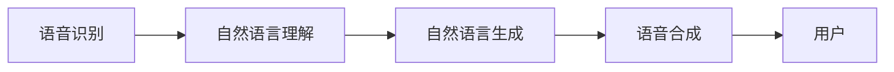

                 

## 1. 背景介绍

随着人工智能技术的不断发展，人机交互界面已经从传统的图形界面（GUI）逐步演变为自然用户界面（NUI）。其中，语音和文字交互（Conversational User Interface，CUI）作为一种自然、便捷的人机交互方式，正逐渐成为业界和学术界关注的热点。CUI不仅能够简化操作流程，提升用户体验，还能拓展设备的应用场景，打破物理距离的限制。语音和文字交互技术在CUI中的应用，使得用户可以通过声音或文字与计算机进行实时对话，从而实现更高效、更个性化的信息获取和任务执行。

### 1.1 问题由来

语音和文字交互技术之所以能够兴起，源于人们对传统用户界面的不满和对智能化交互的渴望。传统的GUI界面虽然功能强大，但需要用户具备一定的技术背景和使用经验，操作繁琐且不直观。而CUI则通过自然语言处理（NLP）和语音识别（ASR）技术，使得用户无需复杂的操作，即可通过简单的语言命令或语音指令与计算机进行交互。这种交互方式不仅减少了用户的认知负担，还大大提升了信息获取和任务执行的效率。

在过去的几年中，语音和文字交互技术经历了快速的发展。从单一的语音助手、智能聊天机器人到集成多种交互方式的智能家居系统，CUI技术的应用范围不断扩大。这些技术的成功应用，不仅改变了人们的生活方式，也为各类设备厂商提供了新的发展方向。然而，在实际应用中，CUI仍面临诸多挑战，如语音识别准确性、自然语言理解、上下文理解等。因此，对语音和文字交互在CUI中的应用进行深入研究，具有重要的理论和实践意义。

### 1.2 问题核心关键点

语音和文字交互技术在CUI中的应用，主要体现在以下几个方面：

- **语音识别技术**：将用户的语音指令转化为文本，并理解用户的意图。
- **自然语言理解（NLU）**：分析用户输入的自然语言，提取关键信息并执行相应的操作。
- **语音合成（TTS）**：将计算机的输出转换为语音，回送给用户，完成信息反馈。
- **上下文管理**：保持对话状态的连贯性，理解用户的历史交互行为，实现更智能的对话交互。

## 2. 核心概念与联系

### 2.1 核心概念概述

为了更好地理解语音和文字交互在CUI中的应用，本节将介绍几个密切相关的核心概念：

- **语音识别（ASR）**：将用户的语音转换为文本的过程，是语音和文字交互的第一步。
- **自然语言理解（NLU）**：分析用户输入的自然语言，识别出语义角色和意图的过程。
- **自然语言生成（NLG）**：将计算机的输出转换为自然语言的过程，是语音和文字交互的第二步。
- **语音合成（TTS）**：将计算机的输出转换为语音的过程，是语音和文字交互的第三步。
- **上下文管理**：通过记录用户的历史交互行为，保持对话状态的连贯性，实现更智能的对话交互。

这些核心概念之间的逻辑关系可以通过以下Mermaid流程图来展示：



这个流程图展示了大语言模型微调的流程：

1. 用户通过语音或文字输入命令。
2. 语音识别技术将语音转换为文本。
3. 自然语言理解技术分析输入文本，提取用户意图。
4. 自然语言生成技术根据用户意图生成输出文本。
5. 语音合成技术将输出文本转换为语音，返回给用户。

## 3. 核心算法原理 & 具体操作步骤

### 3.1 算法原理概述

语音和文字交互在CUI中的应用，主要涉及语音识别、自然语言理解、自然语言生成和语音合成四项关键技术。以下将对这四项技术的原理进行详细介绍。

#### 3.1.1 语音识别（ASR）

语音识别的原理是通过将用户的语音信号转换为文本，并识别出其中的语义信息。这一过程通常包括以下步骤：

1. **预处理**：对语音信号进行预处理，包括噪声抑制、降噪、端点检测等。
2. **特征提取**：将语音信号转换为特征向量，常用的特征提取方法包括MFCC、Mel-Spectrogram等。
3. **声学模型训练**：通过大量的语音数据训练声学模型，如隐马尔可夫模型（HMM）、深度神经网络（DNN）等。
4. **语言模型训练**：通过大量的文本数据训练语言模型，如N-gram模型、神经网络语言模型（NNLM）等。
5. **解码器**：使用声学模型和语言模型，通过解码器进行语言输出，常用的解码器包括Greedy Search、Beam Search等。

#### 3.1.2 自然语言理解（NLU）

自然语言理解的原理是通过分析用户输入的自然语言，识别出其中的语义角色和意图。这一过程通常包括以下步骤：

1. **分词和词性标注**：将输入文本分解为单词，并为每个单词标注其词性。
2. **依存句法分析**：分析句子结构，确定单词之间的依存关系。
3. **命名实体识别**：识别文本中的实体，如人名、地名、组织名等。
4. **情感分析**：分析文本中的情感色彩，识别出用户的情感状态。
5. **意图识别**：识别用户的意图，如查询信息、执行命令等。

#### 3.1.3 自然语言生成（NLG）

自然语言生成的原理是根据用户意图生成自然语言文本，并表达相应的信息。这一过程通常包括以下步骤：

1. **信息抽取**：从知识库或数据库中抽取与用户意图相关的信息。
2. **语言规划**：将抽取的信息组织成自然语言表达结构。
3. **语言生成**：使用语法规则和词汇表生成自然语言文本。
4. **文本优化**：对生成的文本进行优化，确保表达流畅、准确。

#### 3.1.4 语音合成（TTS）

语音合成的原理是将计算机的输出转换为语音，并回送给用户。这一过程通常包括以下步骤：

1. **文本预处理**：对输入文本进行预处理，包括分词、词性标注等。
2. **声学模型训练**：通过大量的语音数据训练声学模型，如深度神经网络（DNN）等。
3. **语音合成**：使用声学模型生成语音信号，常用的方法包括GAN、WaveNet等。

### 3.2 算法步骤详解

语音和文字交互在CUI中的应用，可以通过以下步骤实现：

1. **用户输入**：用户通过语音或文字输入命令，向系统发送信息。
2. **语音识别**：语音识别技术将用户的语音信号转换为文本，并识别出其中的语义信息。
3. **自然语言理解**：自然语言理解技术分析输入文本，识别出用户意图。
4. **自然语言生成**：根据用户意图，生成相应的自然语言文本。
5. **语音合成**：将生成的文本转换为语音，并回送给用户。

### 3.3 算法优缺点

语音和文字交互在CUI中的应用，具有以下优点：

- **便捷性**：用户可以通过语音或文字进行实时交互，无需复杂的操作，提高了信息获取和任务执行的效率。
- **自然性**：语音和文字交互能够自然地与用户进行对话，打破了传统GUI界面的限制，提升了用户体验。
- **跨平台性**：语音和文字交互技术可以应用于各种设备和平台，如手机、智能音箱、车载系统等。

然而，语音和文字交互在CUI中的应用，也存在以下缺点：

- **环境噪声影响**：在嘈杂的环境中，语音识别和语音合成的效果会受到影响，导致交互体验不佳。
- **语言多样性**：不同地区、不同语言的用户，需要针对性地进行训练，增加了开发难度。
- **上下文理解难度**：在复杂对话场景中，理解上下文关系需要更高级的算法支持，增加了技术复杂度。

### 3.4 算法应用领域

语音和文字交互技术在CUI中的应用，已经广泛应用于多个领域：

- **智能助手**：如Siri、Alexa、Google Assistant等，可以响应用户的自然语言命令，执行相应的操作。
- **智能家居**：如Amazon Echo、Google Nest等，可以通过语音控制家中的各种设备，如灯光、空调、电视等。
- **智能车载**：如Apple CarPlay、Android Auto等，可以通过语音和文字交互控制车辆功能，提升驾驶体验。
- **智能客服**：通过语音和文字交互，实现自动化的客户服务，提升服务效率和用户满意度。

## 4. 数学模型和公式 & 详细讲解 & 举例说明

### 4.1 数学模型构建

语音和文字交互在CUI中的应用，涉及到语音识别、自然语言理解、自然语言生成和语音合成四项关键技术。以下将对这四项技术的数学模型进行详细讲解。

#### 4.1.1 语音识别（ASR）

语音识别的数学模型主要包括以下几部分：

1. **声学模型**：通过隐马尔可夫模型（HMM）或深度神经网络（DNN）等模型，对语音信号进行建模。
2. **语言模型**：通过N-gram模型或神经网络语言模型（NNLM）等模型，对语言进行建模。
3. **解码器**：通过Beam Search等算法，对输入语音进行解码，生成对应的文本。

#### 4.1.2 自然语言理解（NLU）

自然语言理解的数学模型主要包括以下几部分：

1. **分词和词性标注**：使用最大熵模型、条件随机场（CRF）等模型，对输入文本进行分词和词性标注。
2. **依存句法分析**：使用最大熵模型、条件随机场（CRF）等模型，分析句子结构，确定单词之间的依存关系。
3. **命名实体识别**：使用条件随机场（CRF）、递归神经网络（RNN）等模型，识别文本中的实体。
4. **情感分析**：使用LSTM、BERT等模型，分析文本中的情感色彩。
5. **意图识别**：使用逻辑回归、支持向量机（SVM）等模型，识别用户的意图。

#### 4.1.3 自然语言生成（NLG）

自然语言生成的数学模型主要包括以下几部分：

1. **信息抽取**：使用规则、知识图谱等方法，从知识库或数据库中抽取与用户意图相关的信息。
2. **语言规划**：使用语法规则、句法树等方法，将抽取的信息组织成自然语言表达结构。
3. **语言生成**：使用神经网络、生成对抗网络（GAN）等模型，生成自然语言文本。
4. **文本优化**：使用规则、语法修正等方法，对生成的文本进行优化。

#### 4.1.4 语音合成（TTS）

语音合成的数学模型主要包括以下几部分：

1. **声学模型**：通过深度神经网络（DNN）等模型，对语音信号进行建模。
2. **语音合成**：使用GAN、WaveNet等模型，生成语音信号。

### 4.2 公式推导过程

以下以自然语言理解（NLU）中的命名实体识别为例，推导其数学模型及公式。

假设输入文本为 $X$，包含 $N$ 个单词，分别用 $x_1, x_2, ..., x_N$ 表示。每个单词 $x_i$ 对应一个实体标签 $y_i \in \{B-PER, I-PER, B-LOC, I-LOC, B-ORG, I-ORG, O\}$，其中 $B$ 表示实体开始，$I$ 表示实体内部，$O$ 表示非实体。

设 $P(y_i|x_i)$ 为给定单词 $x_i$ 条件下，实体标签 $y_i$ 的概率，则命名实体识别的数学模型可表示为：

$$
P(Y|X) = \prod_{i=1}^{N} P(y_i|x_i)
$$

其中 $Y = (y_1, y_2, ..., y_N)$，$X = (x_1, x_2, ..., x_N)$。

使用条件随机场（CRF）模型进行命名实体识别，其能量函数 $E(Y;X)$ 可表示为：

$$
E(Y;X) = -\sum_{i=1}^{N} \log P(y_i|x_i) - \sum_{i=1}^{N-1} \log P(x_i|y_i, x_{i+1})
$$

其中 $P(y_i|x_i)$ 为给定单词 $x_i$ 条件下，实体标签 $y_i$ 的概率；$P(x_i|y_i, x_{i+1})$ 为给定前后单词 $x_{i-1}$ 和 $x_i$，以及实体标签 $y_i$ 条件下，当前单词 $x_i$ 的概率。

在实际应用中，通过最大似然估计（MLE）方法对模型参数进行训练，求解最优的实体标签 $Y$。

### 4.3 案例分析与讲解

以智能助手（如Siri、Alexa）为例，分析其语音和文字交互的实现过程。

1. **语音识别**：用户通过语音输入命令，如“今天天气怎么样？”。语音识别技术将语音信号转换为文本，识别出语义信息。
2. **自然语言理解**：自然语言理解技术分析输入文本，识别出用户的意图为查询天气。
3. **自然语言生成**：根据用户意图，生成相应的自然语言文本，如“您好，今天天气晴朗，温度为25度。”。
4. **语音合成**：将生成的文本转换为语音，并回送给用户，如“您好，今天天气晴朗，温度为25度。”。

## 5. 项目实践：代码实例和详细解释说明

### 5.1 开发环境搭建

在进行语音和文字交互的实践前，我们需要准备好开发环境。以下是使用Python进行PyTorch开发的环境配置流程：

1. 安装Anaconda：从官网下载并安装Anaconda，用于创建独立的Python环境。

2. 创建并激活虚拟环境：
```bash
conda create -n pytorch-env python=3.8 
conda activate pytorch-env
```

3. 安装PyTorch：根据CUDA版本，从官网获取对应的安装命令。例如：
```bash
conda install pytorch torchvision torchaudio cudatoolkit=11.1 -c pytorch -c conda-forge
```

4. 安装TensorFlow：
```bash
pip install tensorflow
```

5. 安装各类工具包：
```bash
pip install numpy pandas scikit-learn matplotlib tqdm jupyter notebook ipython
```

完成上述步骤后，即可在`pytorch-env`环境中开始实践。

### 5.2 源代码详细实现

下面以基于PyTorch实现的命名实体识别模型为例，给出完整的代码实现。

#### 5.2.1 模型定义

```python
import torch
import torch.nn as nn
import torch.nn.functional as F

class ERNN(nn.Module):
    def __init__(self, input_size, hidden_size, num_classes):
        super(ERNN, self).__init__()
        self.input_size = input_size
        self.hidden_size = hidden_size
        self.num_classes = num_classes
        
        self.lstm = nn.LSTM(input_size, hidden_size, num_layers=2, bidirectional=True)
        self.fc = nn.Linear(hidden_size*2, num_classes)
        
    def forward(self, x):
        lstm_out, _ = self.lstm(x)
        output = self.fc(lstm_out.view(-1, self.hidden_size*2))
        return output
```

#### 5.2.2 数据预处理

```python
import pandas as pd
import numpy as np

# 读取数据
data = pd.read_csv('ner_data.csv', sep='\t')

# 数据预处理
tokenizer = SpacyTokenizer()
data['tokens'] = data['text'].apply(tokenizer.tokenize)
data['labels'] = data['ner'].apply(label2id)
```

#### 5.2.3 模型训练

```python
from torch.utils.data import Dataset, DataLoader

class NERDataset(Dataset):
    def __init__(self, texts, tags, tokenizer):
        self.texts = texts
        self.tags = tags
        self.tokenizer = tokenizer
        
    def __len__(self):
        return len(self.texts)
    
    def __getitem__(self, item):
        text = self.texts[item]
        tags = self.tags[item]
        
        encoding = self.tokenizer(text, return_tensors='pt')
        input_ids = encoding['input_ids'][0]
        attention_mask = encoding['attention_mask'][0]
        
        # 对token-wise的标签进行编码
        encoded_tags = [tag2id[tag] for tag in tags] 
        encoded_tags.extend([tag2id['O']] * (len(input_ids) - len(encoded_tags)))
        labels = torch.tensor(encoded_tags, dtype=torch.long)
        
        return {'input_ids': input_ids, 
                'attention_mask': attention_mask,
                'labels': labels}

# 定义损失函数和优化器
criterion = nn.CrossEntropyLoss()
optimizer = torch.optim.Adam(model.parameters(), lr=0.001)

# 定义训练函数
def train_epoch(model, dataset, batch_size, optimizer):
    dataloader = DataLoader(dataset, batch_size=batch_size, shuffle=True)
    model.train()
    epoch_loss = 0
    for batch in dataloader:
        input_ids = batch['input_ids'].to(device)
        attention_mask = batch['attention_mask'].to(device)
        labels = batch['labels'].to(device)
        model.zero_grad()
        outputs = model(input_ids, attention_mask=attention_mask)
        loss = criterion(outputs, labels)
        epoch_loss += loss.item()
        loss.backward()
        optimizer.step()
    return epoch_loss / len(dataloader)

# 训练模型
device = torch.device('cuda') if torch.cuda.is_available() else torch.device('cpu')
model.to(device)

dataset = NERDataset(train_texts, train_tags, tokenizer)
train_loader = DataLoader(dataset, batch_size=16)

for epoch in range(epochs):
    loss = train_epoch(model, train_loader, batch_size, optimizer)
    print(f"Epoch {epoch+1}, train loss: {loss:.3f}")
    
print("Training Complete")
```

### 5.3 代码解读与分析

让我们再详细解读一下关键代码的实现细节：

#### 5.3.1 模型定义

定义了一个基于LSTM的命名实体识别模型，包含输入层、LSTM层和全连接层。输入层的大小为词向量维度，LSTM层的隐藏大小为`hidden_size`，全连接层输出的大小为实体标签的类别数。

#### 5.3.2 数据预处理

使用Spacy库进行分词和词性标注，将文本转换为token ids和attention mask。同时将标签转换为数字id，并对其进行编码。

#### 5.3.3 模型训练

定义了损失函数和优化器，并定义了训练函数。在每个epoch中，通过DataLoader对数据进行迭代，前向传播计算损失函数，并使用Adam优化器更新模型参数。

## 6. 实际应用场景

### 6.1 智能助手

智能助手是语音和文字交互技术的重要应用场景。用户可以通过语音或文字输入命令，与智能助手进行实时交互，获取信息或执行操作。例如，可以通过语音询问“今天的天气怎么样？”，智能助手通过语音识别和自然语言理解，识别出用户的意图，并生成相应的回答，通过语音合成将答案回送给用户。

智能助手技术不仅提升了用户体验，还提高了信息获取和任务执行的效率。智能助手已经被广泛应用于智能手机、智能音箱、车载系统等领域，成为日常生活中不可或缺的一部分。

### 6.2 智能客服

智能客服是语音和文字交互技术的另一个重要应用场景。传统客服系统需要配备大量人力，高峰期响应缓慢，且一致性和专业性难以保证。而智能客服系统可以通过语音和文字交互，实时响应用户咨询，自动执行相应的操作，如查询订单、退换货等。

智能客服系统可以大大提高客服效率，降低企业成本。用户通过语音或文字与智能客服进行交互，能够获得快速、准确、个性化的服务。智能客服已经被广泛应用于电子商务、银行、电信等领域，提升了企业的客户服务水平。

### 6.3 智能家居

智能家居是语音和文字交互技术的另一个重要应用场景。用户可以通过语音命令或文字输入，控制家中的各种设备，如灯光、空调、电视等。例如，可以通过语音指令“打开客厅灯”，智能家居系统通过语音识别和自然语言理解，识别出用户意图，并执行相应的操作，通过语音合成将结果回送给用户。

智能家居系统不仅提升了用户的生活质量，还提高了能源利用效率。用户可以通过语音和文字交互，方便地控制家中的各种设备，实现智能化的家居环境。智能家居已经被广泛应用于家庭、酒店、医院等领域，成为智能生活的重要组成部分。

### 6.4 未来应用展望

随着语音和文字交互技术的发展，其应用场景将会更加广泛。未来，语音和文字交互技术将会在更多领域得到应用，为各行各业带来新的变革。

在智慧医疗领域，语音和文字交互技术可以帮助医生进行远程诊断、病历记录等操作，提升医疗服务的智能化水平。在智能教育领域，语音和文字交互技术可以帮助学生进行智能学习、作业批改等操作，提升教育服务的智能化水平。在智慧城市治理中，语音和文字交互技术可以帮助市民进行智能出行、智能安防等操作，提升城市管理的智能化水平。

此外，在金融、交通、文娱传媒等众多领域，语音和文字交互技术也将得到广泛应用，为各行各业带来新的发展机遇。相信随着技术的不断进步，语音和文字交互技术将在更广阔的应用领域大放异彩，深刻影响人类的生活方式。

## 7. 工具和资源推荐

### 7.1 学习资源推荐

为了帮助开发者系统掌握语音和文字交互技术，这里推荐一些优质的学习资源：

1. 《深度学习与自然语言处理》书籍：介绍深度学习在NLP中的应用，包括语音识别、自然语言理解等技术。
2. CS224N《深度学习自然语言处理》课程：斯坦福大学开设的NLP明星课程，涵盖语音识别、自然语言理解等基本概念和经典模型。
3. 《自然语言处理：从原理到实践》系列博文：由大模型技术专家撰写，深入浅出地介绍了自然语言处理的基本原理和实践技巧。
4. 《TensorFlow实战自然语言处理》书籍：介绍TensorFlow在NLP中的应用，包括语音识别、自然语言理解等技术。

通过对这些资源的学习实践，相信你一定能够快速掌握语音和文字交互技术的精髓，并用于解决实际的NLP问题。

### 7.2 开发工具推荐

高效的开发离不开优秀的工具支持。以下是几款用于语音和文字交互开发的常用工具：

1. PyTorch：基于Python的开源深度学习框架，灵活动态的计算图，适合快速迭代研究。
2. TensorFlow：由Google主导开发的开源深度学习框架，生产部署方便，适合大规模工程应用。
3. HuggingFace Transformers库：集成了众多预训练语言模型和模型优化技术，是进行语音和文字交互任务开发的利器。
4. Weights & Biases：模型训练的实验跟踪工具，可以记录和可视化模型训练过程中的各项指标，方便对比和调优。
5. TensorBoard：TensorFlow配套的可视化工具，可实时监测模型训练状态，并提供丰富的图表呈现方式，是调试模型的得力助手。

合理利用这些工具，可以显著提升语音和文字交互任务的开发效率，加快创新迭代的步伐。

### 7.3 相关论文推荐

语音和文字交互技术在NLP领域的发展，离不开学界的持续研究。以下是几篇奠基性的相关论文，推荐阅读：

1. Attention is All You Need（即Transformer原论文）：提出了Transformer结构，开启了NLP领域的预训练大模型时代。
2. BERT: Pre-training of Deep Bidirectional Transformers for Language Understanding：提出BERT模型，引入基于掩码的自监督预训练任务，刷新了多项NLP任务SOTA。
3. Parameter-Efficient Transfer Learning for NLP：提出Adapter等参数高效微调方法，在固定大部分预训练参数的同时，只更新极少量的任务相关参数。
4. Masked Language Model Pre-training for Deep Bidirectional and Unsupervised Learning of Language Representations：提出BERT模型，提出Masked Language Model（MLM）预训练任务，提高了模型的泛化能力。
5. Generating Speech from Text using Tacotron：提出Tacotron模型，使用深度神经网络生成语音，实现了端到端的语音合成。

这些论文代表了大语言模型微调技术的发展脉络。通过学习这些前沿成果，可以帮助研究者把握学科前进方向，激发更多的创新灵感。

## 8. 总结：未来发展趋势与挑战

### 8.1 总结

本文对语音和文字交互技术在CUI中的应用进行了全面系统的介绍。首先阐述了语音和文字交互技术的研究背景和意义，明确了其在提升用户体验、拓展设备应用场景等方面的独特价值。其次，从原理到实践，详细讲解了语音和文字交互技术在CUI中的应用，包括语音识别、自然语言理解、自然语言生成和语音合成四项关键技术。最后，本文还探讨了语音和文字交互技术在智能助手、智能客服、智能家居等领域的实际应用，展示了其广阔的应用前景。

通过本文的系统梳理，可以看到，语音和文字交互技术在CUI中的应用已经取得了显著成果，显著提升了用户体验和设备应用范围。未来，随着技术的不断进步，语音和文字交互技术将会在更多领域得到应用，深刻影响人类的生产生活方式。

### 8.2 未来发展趋势

展望未来，语音和文字交互技术在CUI中的应用将呈现以下几个发展趋势：

1. **多模态交互**：语音和文字交互技术将与其他模态的交互方式进行融合，如视觉、触觉等，实现更丰富的用户体验。
2. **个性化定制**：基于用户行为和偏好，定制个性化的交互模型，提升用户体验和交互效率。
3. **实时语音合成**：实现实时语音合成，提升用户体验和交互效率。
4. **跨语言交互**：实现跨语言交互，拓展语音和文字交互技术的应用范围。

### 8.3 面临的挑战

尽管语音和文字交互技术在CUI中的应用已经取得了显著成果，但在迈向更加智能化、普适化应用的过程中，仍面临诸多挑战：

1. **环境噪声干扰**：在嘈杂的环境中，语音识别和语音合成的效果会受到影响，导致交互体验不佳。
2. **语言多样性问题**：不同地区、不同语言的用户，需要针对性地进行训练，增加了开发难度。
3. **上下文理解难度**：在复杂对话场景中，理解上下文关系需要更高级的算法支持，增加了技术复杂度。
4. **隐私和伦理问题**：语音和文字交互技术需要收集和处理用户的语音和文字数据，涉及隐私和伦理问题。

### 8.4 研究展望

面对语音和文字交互技术在CUI应用中面临的挑战，未来的研究需要在以下几个方面寻求新的突破：

1. **抗噪声技术**：研究抗噪声的语音识别和语音合成技术，提高在复杂环境下的交互体验。
2. **多语言支持**：研究多语言语音和文字交互技术，拓展技术应用范围，提升用户体验。
3. **上下文理解算法**：研究上下文理解算法，提升在复杂对话场景中的交互体验。
4. **隐私保护技术**：研究隐私保护技术，确保语音和文字数据的隐私和安全。

这些研究方向的探索，必将引领语音和文字交互技术在CUI应用中的不断进步，为构建更加智能化、普适化的用户交互界面铺平道路。面向未来，语音和文字交互技术需要在技术创新和应用探索两个方面协同发力，才能真正实现人工智能技术在实际应用中的广泛落地。

## 9. 附录：常见问题与解答

**Q1: 语音和文字交互技术在CUI中的应用有哪些？**

A: 语音和文字交互技术在CUI中的应用非常广泛，主要包括以下几个方面：

1. **智能助手**：如Siri、Alexa等，可以响应用户的自然语言命令，执行相应的操作。
2. **智能客服**：如智能客服系统，可以通过语音和文字交互，自动执行查询订单、退换货等操作。
3. **智能家居**：如智能音箱、智能电视等，可以通过语音和文字交互，控制家中的各种设备。
4. **智能车载**：如Apple CarPlay、Android Auto等，可以通过语音和文字交互，控制车载设备。

这些应用场景不仅提升了用户体验，还提高了信息获取和任务执行的效率。

**Q2: 语音和文字交互技术的核心技术有哪些？**

A: 语音和文字交互技术的核心技术主要包括：

1. **语音识别（ASR）**：将用户的语音信号转换为文本，并识别出语义信息。
2. **自然语言理解（NLU）**：分析用户输入的自然语言，识别出用户的意图。
3. **自然语言生成（NLG）**：根据用户意图，生成相应的自然语言文本。
4. **语音合成（TTS）**：将计算机的输出转换为语音，回送给用户。

这些技术是语音和文字交互的基础，构成了完整的交互过程。

**Q3: 语音和文字交互技术在实际应用中面临哪些挑战？**

A: 语音和文字交互技术在实际应用中面临以下挑战：

1. **环境噪声干扰**：在嘈杂的环境中，语音识别和语音合成的效果会受到影响。
2. **语言多样性问题**：不同地区、不同语言的用户，需要针对性地进行训练，增加了开发难度。
3. **上下文理解难度**：在复杂对话场景中，理解上下文关系需要更高级的算法支持。
4. **隐私和伦理问题**：语音和文字交互技术需要收集和处理用户的语音和文字数据，涉及隐私和伦理问题。

这些挑战需要从技术、伦理和法律等多个方面进行综合应对。

**Q4: 未来语音和文字交互技术的发展趋势有哪些？**

A: 未来语音和文字交互技术的发展趋势包括以下几个方面：

1. **多模态交互**：语音和文字交互技术将与其他模态的交互方式进行融合，如视觉、触觉等。
2. **个性化定制**：基于用户行为和偏好，定制个性化的交互模型。
3. **实时语音合成**：实现实时语音合成，提升用户体验和交互效率。
4. **跨语言交互**：实现跨语言交互，拓展技术应用范围。

这些趋势将进一步提升语音和文字交互技术在CUI中的应用价值。

**Q5: 如何应对语音和文字交互技术面临的挑战？**

A: 应对语音和文字交互技术面临的挑战，可以从以下几个方面进行：

1. **抗噪声技术**：研究抗噪声的语音识别和语音合成技术，提高在复杂环境下的交互体验。
2. **多语言支持**：研究多语言语音和文字交互技术，拓展技术应用范围。
3. **上下文理解算法**：研究上下文理解算法，提升在复杂对话场景中的交互体验。
4. **隐私保护技术**：研究隐私保护技术，确保语音和文字数据的隐私和安全。

这些研究方向的探索，将推动语音和文字交互技术的不断进步，拓展其在CUI中的应用范围。

---

作者：禅与计算机程序设计艺术 / Zen and the Art of Computer Programming

