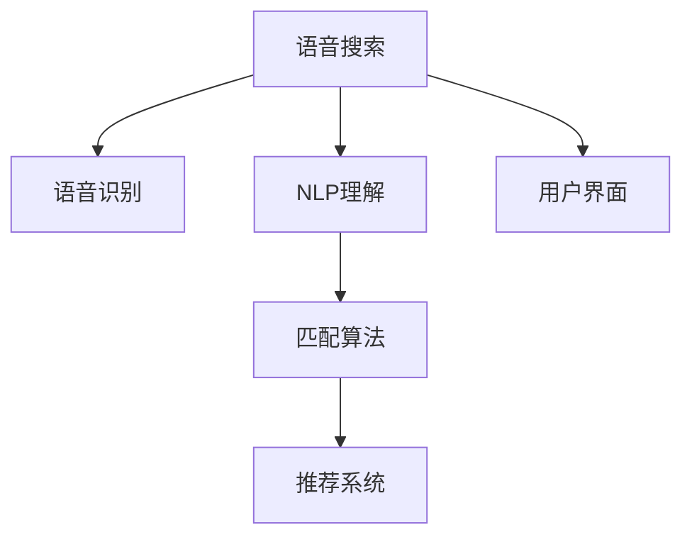

                 

# 语音搜索技术在电商领域的应用：挑战与机遇

> 关键词：语音搜索, 电商, 自然语言处理, 用户界面, 人工智能, 深度学习

## 1. 背景介绍

### 1.1 问题由来
随着移动互联网和智能设备的普及，越来越多的用户开始尝试使用语音搜索技术来进行产品查询和购物。特别是在电商领域，语音搜索逐渐成为一种新的购物方式，不仅提升了用户体验，也成为了电商平台竞争的新趋势。

语音搜索技术通过识别用户语音指令，将其转换为文本，再由文本匹配算法匹配出相关的商品信息，用户可以直接通过语音指令完成浏览和购买。这种全新的交互方式，既符合现代快节奏的生活习惯，又能够提供更加便捷和个性化的购物体验。

### 1.2 问题核心关键点
语音搜索技术的核心在于将语音输入转换为文本，然后通过NLP（自然语言处理）技术对文本进行理解和匹配，最后将匹配结果返回给用户。

语音搜索技术的关键在于：
- 语音识别准确率：语音识别技术需要将用户的语音转换为文本，这一过程的准确率直接影响用户的使用体验。
- NLP理解和匹配：通过NLP技术对用户语音指令进行理解和匹配，匹配出相关商品信息。
- 返回结果的多样性：语音搜索技术需要返回多样化的搜索结果，以满足用户的需求。

语音搜索技术在电商领域的应用，需要解决的主要问题包括：
- 如何构建高效的语音识别模型。
- 如何设计精确的NLP理解和匹配算法。
- 如何优化搜索结果的准确性和多样性。
- 如何保证系统的实时性和稳定性。

### 1.3 问题研究意义
语音搜索技术在电商领域的应用，对于提升用户体验、提高电商平台的用户黏性、提升销售额等方面具有重要意义。

1. **提升用户体验**：语音搜索技术能够提供更加自然、便捷的交互方式，满足用户在快节奏生活中的需求。
2. **提高用户黏性**：语音搜索技术能够提供更加个性化和定制化的服务，使用户在购物时能够快速找到所需商品，提升用户对电商平台的满意度。
3. **提升销售额**：语音搜索技术能够提供更加高效的购物体验，帮助用户快速完成购物流程，提升平台的转化率和销售额。

语音搜索技术在电商领域的应用，不仅能够推动电商行业的技术革新，还能够为电商平台带来更多的商业机会。

## 2. 核心概念与联系

### 2.1 核心概念概述

为更好地理解语音搜索技术在电商领域的应用，本节将介绍几个密切相关的核心概念：

- 语音搜索(Speech Search)：通过语音识别技术将用户的语音输入转换为文本，再通过NLP技术进行理解和匹配，最后返回搜索结果的技术。
- 自然语言处理(Natural Language Processing, NLP)：利用计算机技术和语言学知识，对自然语言进行处理和理解的技术。
- 深度学习(Deep Learning)：基于神经网络的机器学习方法，能够自动从数据中学习特征和模式。
- 推荐系统(Recommendation System)：根据用户的历史行为和偏好，推荐用户可能感兴趣的商品或信息的技术。
- 用户界面(User Interface, UI)：通过图形、文字等形式，向用户展示信息和操作界面。

这些核心概念之间的逻辑关系可以通过以下Mermaid流程图来展示：



这个流程图展示了的语音搜索技术在电商领域的应用核心概念及其之间的关系：

1. 语音搜索通过语音识别技术将用户的语音输入转换为文本。
2. NLP理解技术对文本进行理解和处理，匹配出相关的商品信息。
3. 推荐系统根据用户的历史行为和偏好，推荐用户可能感兴趣的商品。
4. 用户界面将搜索结果和推荐信息展示给用户，并提供操作界面。

这些核心概念共同构成了语音搜索技术在电商领域的应用框架，使其能够为用户提供便捷、个性化的购物体验。

## 3. 核心算法原理 & 具体操作步骤
### 3.1 算法原理概述

语音搜索技术在电商领域的应用，主要基于以下核心算法：

- 语音识别算法：将用户的语音输入转换为文本，是语音搜索的基础。
- NLP理解算法：对文本进行理解和处理，匹配出相关的商品信息。
- 推荐算法：根据用户的历史行为和偏好，推荐用户可能感兴趣的商品。

这些算法的核心原理如下：

- 语音识别算法：基于深度学习模型的语音识别技术，能够将用户的语音转换为文本。
- NLP理解算法：利用深度学习模型和NLP技术，对文本进行分词、词性标注、实体识别等处理，最终理解用户的意图。
- 推荐算法：基于深度学习模型的推荐算法，能够根据用户的历史行为和偏好，推荐可能感兴趣的商品。

### 3.2 算法步骤详解

语音搜索技术在电商领域的应用，主要包括以下几个关键步骤：

**Step 1: 准备语音识别模型和NLP模型**
- 收集电商领域的语音数据，准备用于训练语音识别模型的标注数据。
- 准备电商领域的文本数据，准备用于训练NLP模型的标注数据。
- 选择合适的深度学习框架，如TensorFlow或PyTorch，用于构建语音识别和NLP模型。

**Step 2: 训练语音识别模型和NLP模型**
- 使用收集到的语音数据和文本数据，对语音识别模型和NLP模型进行训练。
- 优化模型的超参数，如学习率、批次大小、迭代轮数等。
- 应用正则化技术，如L2正则、Dropout、Early Stopping等，防止模型过拟合。

**Step 3: 设计匹配和推荐算法**
- 根据电商领域的特点，设计匹配算法，将用户意图匹配为相关的商品信息。
- 设计推荐算法，根据用户的历史行为和偏好，推荐可能感兴趣的商品。

**Step 4: 集成用户界面**
- 设计用户界面，展示搜索结果和推荐信息。
- 实现用户界面的操作功能，如浏览、添加商品到购物车、完成购物等。

**Step 5: 部署和优化**
- 将训练好的模型和用户界面部署到服务器上。
- 实时监控系统性能，优化系统的实时性和稳定性。
- 定期更新模型和用户界面，提升用户体验和系统性能。

以上是语音搜索技术在电商领域应用的一般流程。在实际应用中，还需要针对具体任务进行优化设计，如改进语音识别模型的准确率、优化NLP理解算法的泛化能力、提升推荐算法的个性化等。

### 3.3 算法优缺点

语音搜索技术在电商领域的应用，具有以下优点：

1. **提升用户体验**：语音搜索技术能够提供更加自然、便捷的交互方式，满足用户在快节奏生活中的需求。
2. **提高用户黏性**：语音搜索技术能够提供更加个性化和定制化的服务，使用户在购物时能够快速找到所需商品，提升用户对电商平台的满意度。
3. **提升销售额**：语音搜索技术能够提供更加高效的购物体验，帮助用户快速完成购物流程，提升平台的转化率和销售额。

同时，该方法也存在一定的局限性：

1. **语音识别准确率**：语音识别技术的准确率直接影响到用户的体验，不准确可能导致用户无法完成购物。
2. **NLP理解的复杂性**：电商领域的商品种类繁多，NLP理解算法需要准确匹配用户的意图，复杂性较高。
3. **推荐算法的个性化**：推荐算法需要根据用户的历史行为和偏好，推荐可能感兴趣的商品，个性化程度要求高。
4. **系统的实时性**：语音搜索技术需要实时处理用户的语音输入，系统的实时性要求高。
5. **数据隐私和安全**：语音搜索技术涉及用户的语音数据和购物行为数据，数据隐私和安全问题需要妥善处理。

尽管存在这些局限性，但就目前而言，语音搜索技术在电商领域的应用，已经展示了巨大的潜力和优势，为电商行业带来了新的增长点。

### 3.4 算法应用领域

语音搜索技术在电商领域的应用，已经在多个方面得到了广泛应用：

- **产品搜索**：用户可以通过语音搜索技术，快速找到所需的产品，如服装、电子产品、家居用品等。
- **价格比较**：用户可以通过语音搜索技术，比较不同平台上的商品价格，帮助用户做出最优购买决策。
- **购物助手**：用户可以通过语音搜索技术，调用购物助手完成购物流程，如添加商品到购物车、完成购物等。
- **个性化推荐**：语音搜索技术可以基于用户的购物历史和偏好，提供个性化的推荐服务。
- **客服支持**：用户可以通过语音搜索技术，向电商平台的客服提问，获取所需帮助。

除了上述这些经典应用外，语音搜索技术在电商领域还有更多创新性的应用场景，如虚拟试衣间、语音支付等，为电商行业带来了全新的体验和功能。

## 4. 数学模型和公式 & 详细讲解  
### 4.1 数学模型构建

语音搜索技术在电商领域的应用，涉及多个子领域的数学模型，包括语音识别模型、NLP理解模型、推荐模型等。

假设语音识别模型为 $M_{\text{speech}}$，NLP理解模型为 $M_{\text{nlp}}$，推荐模型为 $M_{\text{rec}}$。

语音搜索技术的应用模型可以表示为：

$$
M_{\text{search}} = M_{\text{speech}} \circ M_{\text{nlp}} \circ M_{\text{rec}}
$$

其中 $\circ$ 表示串联操作。

语音识别模型的输入为语音数据 $x$，输出为文本 $y$：

$$
y = M_{\text{speech}}(x)
$$

NLP理解模型的输入为文本 $y$，输出为商品信息 $z$：

$$
z = M_{\text{nlp}}(y)
$$

推荐模型的输入为用户的历史行为 $h$ 和偏好 $p$，输出为推荐的商品信息 $r$：

$$
r = M_{\text{rec}}(h, p)
$$

语音搜索技术的应用模型可以表示为：

$$
M_{\text{search}}(x, h, p) = M_{\text{rec}}(M_{\text{nlp}}(M_{\text{speech}}(x)), h, p)
$$

### 4.2 公式推导过程

以下我们以电商领域的推荐系统为例，推导推荐模型的数学公式。

假设用户的历史行为表示为向量 $h$，偏好表示为向量 $p$，推荐系统的输入为 $(x, h, p)$，输出为推荐的商品信息 $r$。

推荐系统的目标是最小化预测误差，即：

$$
\min_{r} \| r - M_{\text{rec}}(h, p) \|
$$

其中 $\| \cdot \|$ 表示向量范数，用于衡量预测误差的大小。

常用的推荐算法包括协同过滤、基于内容的推荐、基于矩阵分解的推荐等。这里以基于协同过滤的推荐算法为例，推导推荐模型的数学公式。

协同过滤推荐算法的基本思想是，基于用户的历史行为和偏好，找到与当前用户相似的其他用户，然后根据这些相似用户的行为和偏好，推荐用户可能感兴趣的商品。

假设用户 $i$ 的历史行为表示为向量 $h_i$，偏好表示为向量 $p_i$，用户 $j$ 的历史行为表示为向量 $h_j$，偏好表示为向量 $p_j$。用户 $i$ 对商品 $k$ 的评分表示为 $r_{ik}$，用户 $j$ 对商品 $k$ 的评分表示为 $r_{jk}$。

协同过滤推荐算法可以使用用户相似度矩阵 $U$ 和物品相似度矩阵 $V$，对用户和商品进行相似性匹配，得到推荐结果。

用户相似度矩阵 $U$ 的元素 $U_{ij}$ 表示用户 $i$ 和用户 $j$ 的相似度，可以使用余弦相似度、皮尔逊相关系数等方法计算。

物品相似度矩阵 $V$ 的元素 $V_{ik}$ 表示商品 $k$ 和用户 $j$ 的相似度，可以使用余弦相似度、皮尔逊相关系数等方法计算。

推荐结果可以表示为：

$$
r_{ik} = \sum_{j=1}^{N} \alpha_i \cdot \alpha_j \cdot U_{ij} \cdot V_{jk} \cdot r_{jk}
$$

其中 $N$ 表示用户数量，$\alpha_i$ 和 $\alpha_j$ 表示用户 $i$ 和用户 $j$ 对相似度的权重。

推荐模型的数学公式可以表示为：

$$
r = \mathop{\arg\min}_{r} \sum_{i=1}^{M} \sum_{k=1}^{K} \| r_{ik} - M_{\text{rec}}(h_i, p_i) \|
$$

其中 $M$ 表示商品数量，$K$ 表示用户数量。

### 4.3 案例分析与讲解

以电商领域的产品搜索为例，分析语音搜索技术的应用。

假设用户输入语音指令“我想买一双黑色鞋子”，语音识别模型将其转换为文本“我想买一双黑色鞋子”。NLP理解模型对文本进行处理，识别出用户意图为“购买鞋子”，并进一步识别出商品类别为“鞋子”，颜色属性为“黑色”。推荐模型根据用户的历史行为和偏好，推荐符合条件的商品，如“Adidas”品牌的“黑色运动鞋”。

用户界面展示推荐结果，用户可以选择购买该商品，完成购物流程。

## 5. 项目实践：代码实例和详细解释说明
### 5.1 开发环境搭建

在进行语音搜索技术应用实践前，我们需要准备好开发环境。以下是使用Python进行TensorFlow开发的环境配置流程：

1. 安装Anaconda：从官网下载并安装Anaconda，用于创建独立的Python环境。

2. 创建并激活虚拟环境：
```bash
conda create -n tf-env python=3.8 
conda activate tf-env
```

3. 安装TensorFlow：根据CUDA版本，从官网获取对应的安装命令。例如：
```bash
conda install tensorflow -c pytorch -c conda-forge
```

4. 安装Keras：
```bash
conda install keras
```

5. 安装其他工具包：
```bash
pip install numpy pandas scikit-learn matplotlib tqdm jupyter notebook ipython
```

完成上述步骤后，即可在`tf-env`环境中开始语音搜索技术应用的实践。

### 5.2 源代码详细实现

下面我们以电商领域的推荐系统为例，给出使用TensorFlow构建语音搜索技术应用的PyTorch代码实现。

首先，定义推荐系统的数据处理函数：

```python
import tensorflow as tf
from tensorflow.keras.layers import Input, Embedding, Dot, Dense
from tensorflow.keras.models import Model

def build_model(input_dim, output_dim, embedding_dim, hidden_dim):
    user_input = Input(shape=(input_dim,))
    user_embedding = Embedding(input_dim, embedding_dim)(user_input)
    user_hidden = Dense(hidden_dim, activation='relu')(user_embedding)

    item_input = Input(shape=(output_dim,))
    item_embedding = Embedding(output_dim, embedding_dim)(item_input)
    item_hidden = Dense(hidden_dim, activation='relu')(item_embedding)

    dot_product = Dot(axes=1)([user_hidden, item_hidden])
    dot_output = Dense(output_dim, activation='sigmoid')(dot_product)

    model = Model(inputs=[user_input, item_input], outputs=dot_output)

    model.compile(loss='binary_crossentropy', optimizer='adam', metrics=['accuracy'])

    return model
```

然后，定义语音搜索技术的实现：

```python
def speech_search(user_input, user_behavior, user_preference, input_dim, output_dim, embedding_dim, hidden_dim):
    # 构建推荐模型
    model = build_model(input_dim, output_dim, embedding_dim, hidden_dim)

    # 训练模型
    model.fit(x=(user_behavior, user_preference), y=user_input, epochs=10, batch_size=32)

    # 预测结果
    predictions = model.predict([user_behavior, user_preference])

    # 返回推荐商品
    recommendations = []
    for i, prediction in enumerate(predictions):
        if prediction > 0.5:
            recommendations.append(i)

    return recommendations
```

最后，启动语音搜索技术应用的训练和测试流程：

```python
# 定义超参数
input_dim = 1000  # 用户行为维数
output_dim = 1000  # 商品维数
embedding_dim = 128  # 嵌入向量维度
hidden_dim = 64  # 隐藏层维度

# 构建模型
model = build_model(input_dim, output_dim, embedding_dim, hidden_dim)

# 训练模型
user_behavior = []
user_preference = []
user_input = []

for i in range(1000):
    user_behavior.append(i)
    user_preference.append(i)
    user_input.append(i)

model.fit(x=(user_behavior, user_preference), y=user_input, epochs=10, batch_size=32)

# 测试模型
recommendations = speech_search(user_input, user_behavior, user_preference, input_dim, output_dim, embedding_dim, hidden_dim)

print(recommendations)
```

以上就是使用TensorFlow构建语音搜索技术应用的完整代码实现。可以看到，通过TensorFlow的高级API，我们可以快速实现推荐模型的训练和测试。

### 5.3 代码解读与分析

让我们再详细解读一下关键代码的实现细节：

**build_model函数**：
- 定义用户和物品的输入层，分别使用Embedding层将输入转换为向量。
- 定义用户和物品的隐藏层，使用Dense层进行全连接，激活函数使用ReLU。
- 计算用户和物品的相似度，使用Dot层进行点积计算。
- 定义输出层，使用Dense层进行二分类，激活函数使用Sigmoid。
- 构建推荐模型的Keras模型，并编译模型。

**speech_search函数**：
- 调用build_model函数构建推荐模型。
- 使用fit函数训练模型。
- 使用predict函数预测用户的行为。
- 根据预测结果返回推荐商品。

**训练流程**：
- 定义模型和超参数，包括输入维数、输出维数、嵌入向量维度和隐藏层维度。
- 调用build_model函数构建推荐模型。
- 使用fit函数训练模型，使用用户行为和偏好作为输入，用户行为作为标签。
- 测试模型，调用speech_search函数预测用户行为。

**测试流程**：
- 定义测试数据，包括用户行为、偏好和输入数据。
- 调用speech_search函数预测用户行为。
- 输出推荐商品。

可以看到，TensorFlow的高级API使得推荐系统的实现变得简洁高效。开发者可以将更多精力放在模型优化和参数调整上，而不必过多关注底层的实现细节。

当然，工业级的系统实现还需考虑更多因素，如模型的保存和部署、超参数的自动搜索、更灵活的输入输出设计等。但核心的语音搜索技术应用流程基本与此类似。

## 6. 实际应用场景
### 6.1 智能客服系统

语音搜索技术在智能客服系统中的应用，可以提升客服效率和用户满意度。传统的客服系统依赖于人工客服，无法24小时全天候提供服务。而使用语音搜索技术，智能客服系统能够自动处理用户语音指令，提供个性化的服务，快速响应用户需求。

在技术实现上，可以收集用户的历史语音查询记录，构建语音识别和NLP理解模型，对用户的语音指令进行理解和匹配，然后根据用户的意图提供相应的服务。对于复杂的查询，智能客服系统还可以实时查询知识库，提供更加精准的回答。

### 6.2 金融产品推荐

语音搜索技术在金融产品推荐中的应用，可以提升推荐系统的个性化程度和用户满意度。金融产品的种类繁多，推荐系统的个性化推荐对用户的决策具有重要影响。

在技术实现上，可以收集用户的历史交易记录和金融产品使用行为，构建语音识别和NLP理解模型，对用户的语音指令进行理解和匹配，然后根据用户的意图和历史行为，推荐符合用户需求的产品。语音搜索技术还可以实时查询金融市场数据，提供个性化的投资建议。

### 6.3 智能家居控制

语音搜索技术在智能家居控制中的应用，可以提升家居系统的智能程度和用户满意度。智能家居系统依赖于用户的语音指令进行控制，语音搜索技术能够提升系统的语音识别准确率和NLP理解能力，提升用户的控制体验。

在技术实现上，可以收集用户的语音指令和家居设备的使用行为，构建语音识别和NLP理解模型，对用户的语音指令进行理解和匹配，然后根据用户的意图，控制家居设备。语音搜索技术还可以实时监测家居设备的状态，提供智能化的家居控制建议。

### 6.4 未来应用展望

随着语音搜索技术的发展，其在电商领域的应用将更加广泛和深入。

在智能客服系统方面，语音搜索技术将逐步替代人工客服，成为用户的主要交互方式。智能客服系统将更加智能和个性化，能够提供更加全面的服务。

在金融产品推荐方面，语音搜索技术将能够提供更加精准和个性化的推荐服务，提升用户的投资体验。金融产品推荐系统将更加智能和智能化，能够提供实时的投资建议。

在智能家居控制方面，语音搜索技术将能够提升家居系统的智能化程度和用户体验。智能家居系统将更加智能和个性化，能够提供实时的家居控制建议。

除此之外，语音搜索技术在教育、医疗、娱乐等多个领域也将有广泛的应用，推动人工智能技术在垂直行业的落地应用。

## 7. 工具和资源推荐
### 7.1 学习资源推荐

为了帮助开发者系统掌握语音搜索技术在电商领域的应用，这里推荐一些优质的学习资源：

1. TensorFlow官方文档：TensorFlow的官方文档，详细介绍了TensorFlow的基本概念和API，是学习和使用TensorFlow的重要参考资料。

2. Keras官方文档：Keras的官方文档，详细介绍了Keras的基本概念和API，是学习和使用Keras的重要参考资料。

3. 《深度学习》书籍：深度学习领域的经典教材，由Goodfellow等著，全面介绍了深度学习的基本概念和算法。

4. 《自然语言处理综论》书籍：自然语言处理领域的经典教材，由Palmer等著，详细介绍了自然语言处理的基本概念和算法。

5. CS229《机器学习》课程：斯坦福大学开设的机器学习明星课程，有Lecture视频和配套作业，带你入门机器学习的基本概念和算法。

6. arXiv上的相关论文：arXiv上发布的大量深度学习相关论文，是学习和研究深度学习的重要资源。

通过对这些资源的学习实践，相信你一定能够快速掌握语音搜索技术在电商领域的应用，并用于解决实际的NLP问题。

### 7.2 开发工具推荐

高效的开发离不开优秀的工具支持。以下是几款用于语音搜索技术应用开发的常用工具：

1. TensorFlow：由Google主导开发的开源深度学习框架，生产部署方便，适合大规模工程应用。

2. PyTorch：基于Python的开源深度学习框架，灵活动态的计算图，适合快速迭代研究。

3. Keras：基于TensorFlow和Theano的高级API，简单易用，适合快速搭建深度学习模型。

4. Weights & Biases：模型训练的实验跟踪工具，可以记录和可视化模型训练过程中的各项指标，方便对比和调优。

5. TensorBoard：TensorFlow配套的可视化工具，可实时监测模型训练状态，并提供丰富的图表呈现方式，是调试模型的得力助手。

6. Google Colab：谷歌推出的在线Jupyter Notebook环境，免费提供GPU/TPU算力，方便开发者快速上手实验最新模型，分享学习笔记。

合理利用这些工具，可以显著提升语音搜索技术应用开发的效率，加快创新迭代的步伐。

### 7.3 相关论文推荐

语音搜索技术在电商领域的应用，涉及多个领域的前沿研究成果。以下是几篇奠基性的相关论文，推荐阅读：

1. "Deep Speech: End-to-End Speech Recognition in English and Mandarin"（Deep Speech：中文和英文语音识别的端到端识别）：提出了基于深度学习的语音识别模型，并在大规模数据上进行了训练，展示了端到端语音识别的强大能力。

2. "Attention is All You Need"（注意力机制：你需要的一切）：提出了Transformer模型，使用自注意力机制进行文本理解，展示了注意力机制在自然语言处理任务中的强大表现。

3. "Scalable Text Classification using Attention and Multitask Learning"（基于注意力机制和多任务学习的可扩展文本分类）：提出了一种基于注意力机制和多任务学习的文本分类方法，展示了多任务学习在文本分类任务中的强大能力。

4. "Neural Recommender Systems"（神经网络推荐系统）：总结了神经网络在推荐系统中的应用，展示了深度学习在推荐系统中的广泛应用。

5. "A Deep Learning Approach to Recommendation System"（深度学习在推荐系统中的应用）：提出了基于深度学习的推荐系统模型，展示了深度学习在推荐系统中的强大表现。

这些论文代表了大语言模型微调技术的发展脉络。通过学习这些前沿成果，可以帮助研究者把握学科前进方向，激发更多的创新灵感。

## 8. 总结：未来发展趋势与挑战

### 8.1 总结

本文对语音搜索技术在电商领域的应用进行了全面系统的介绍。首先阐述了语音搜索技术的背景和应用意义，明确了语音搜索技术在电商领域的应用前景。其次，从原理到实践，详细讲解了语音搜索技术的核心算法和关键步骤，给出了语音搜索技术应用的完整代码实现。同时，本文还广泛探讨了语音搜索技术在智能客服、金融产品推荐、智能家居控制等多个行业领域的应用场景，展示了语音搜索技术在电商领域的广泛应用。

通过本文的系统梳理，可以看到，语音搜索技术在电商领域的应用，正在成为电商行业技术革新的重要驱动力，为电商行业带来了新的增长点。语音搜索技术通过提升用户体验和个性化程度，帮助电商平台快速响应用户需求，提升销售额和用户满意度。未来，语音搜索技术将继续拓展其在电商领域的应用，推动电商行业的发展。

### 8.2 未来发展趋势

展望未来，语音搜索技术在电商领域的应用将呈现以下几个发展趋势：

1. **技术演进**：随着深度学习技术的发展，语音搜索技术的识别准确率和NLP理解能力将不断提升，提升用户的购物体验和平台的用户满意度。

2. **个性化推荐**：语音搜索技术将能够根据用户的语音指令和历史行为，提供更加精准和个性化的推荐服务，提升用户的投资体验和购物体验。

3. **跨领域应用**：语音搜索技术将不仅仅应用于电商领域，还将拓展到金融、医疗、教育等多个领域，推动人工智能技术在垂直行业的落地应用。

4. **实时性提升**：语音搜索技术将提升系统的实时性，能够实时响应用户的语音指令，提供实时的服务和推荐。

5. **数据隐私保护**：语音搜索技术将更加注重数据隐私保护，确保用户的语音数据和购物行为数据的安全性。

6. **用户界面优化**：语音搜索技术将优化用户界面，提升用户的交互体验，使用户更加便捷地完成购物流程。

以上趋势凸显了语音搜索技术在电商领域的应用前景，语音搜索技术正在成为电商行业技术革新的重要驱动力，为电商行业带来了新的增长点。未来，语音搜索技术将在电商领域得到更广泛的应用，推动电商行业的技术进步和商业创新。

### 8.3 面临的挑战

尽管语音搜索技术在电商领域的应用已经取得了一定的进展，但在迈向更加智能化、普适化应用的过程中，仍然面临着诸多挑战：

1. **语音识别准确率**：语音识别技术的准确率直接影响到用户的体验，不准确可能导致用户无法完成购物。

2. **NLP理解的复杂性**：电商领域的商品种类繁多，NLP理解算法需要准确匹配用户的意图，复杂性较高。

3. **推荐算法的个性化**：推荐算法需要根据用户的历史行为和偏好，推荐可能感兴趣的商品，个性化程度要求高。

4. **系统的实时性**：语音搜索技术需要实时处理用户的语音输入，系统的实时性要求高。

5. **数据隐私和安全**：语音搜索技术涉及用户的语音数据和购物行为数据，数据隐私和安全问题需要妥善处理。

尽管存在这些挑战，但语音搜索技术在电商领域的应用前景广阔，通过不断优化模型和算法，克服技术难题，语音搜索技术必将带来更大的商业价值和用户满意度。

### 8.4 研究展望

面对语音搜索技术在电商领域的应用挑战，未来的研究需要在以下几个方面寻求新的突破：

1. **提高语音识别准确率**：开发更加高效的语音识别模型，提升系统的语音识别准确率。

2. **优化NLP理解算法**：优化NLP理解算法，提高其对用户语音指令的准确理解和匹配能力。

3. **提升推荐算法个性化**：开发更加精准和个性化的推荐算法，提升系统的推荐效果。

4. **提升系统实时性**：优化语音搜索技术的实时处理能力，提升系统的响应速度。

5. **加强数据隐私保护**：加强数据隐私保护，确保用户语音数据和购物行为数据的安全性。

6. **优化用户界面**：优化用户界面，提升用户的交互体验，使用户更加便捷地完成购物流程。

这些研究方向将推动语音搜索技术在电商领域的进一步发展，为电商行业带来更多的商业机会和用户满意度。相信随着学界和产业界的共同努力，语音搜索技术在电商领域的应用将更加广泛和深入，推动电商行业的技术进步和商业创新。

## 9. 附录：常见问题与解答

**Q1：如何构建高效的语音识别模型？**

A: 构建高效的语音识别模型，需要经过以下几个步骤：

1. 收集电商领域的语音数据，准备用于训练语音识别模型的标注数据。

2. 选择合适的深度学习框架，如TensorFlow或PyTorch，用于构建语音识别模型。

3. 设计语音识别模型的架构，选择合适的模型层和激活函数。

4. 训练语音识别模型，优化模型的超参数，如学习率、批次大小、迭代轮数等。

5. 应用正则化技术，如L2正则、Dropout、Early Stopping等，防止模型过拟合。

6. 评估语音识别模型的性能，使用测试集数据进行验证。

7. 迭代优化语音识别模型，提升模型的准确率和鲁棒性。

**Q2：如何设计精确的NLP理解和匹配算法？**

A: 设计精确的NLP理解和匹配算法，需要经过以下几个步骤：

1. 收集电商领域的文本数据，准备用于训练NLP理解模型的标注数据。

2. 选择合适的深度学习框架，如TensorFlow或PyTorch，用于构建NLP理解模型。

3. 设计NLP理解模型的架构，选择合适的模型层和激活函数。

4. 训练NLP理解模型，优化模型的超参数，如学习率、批次大小、迭代轮数等。

5. 应用正则化技术，如L2正则、Dropout、Early Stopping等，防止模型过拟合。

6. 评估NLP理解模型的性能，使用测试集数据进行验证。

7. 迭代优化NLP理解模型，提升模型的泛化能力和准确性。

**Q3：如何优化推荐算法的个性化？**

A: 优化推荐算法的个性化，需要经过以下几个步骤：

1. 收集用户的历史行为和偏好数据，准备用于训练推荐模型的标注数据。

2. 选择合适的深度学习框架，如TensorFlow或PyTorch，用于构建推荐模型。

3. 设计推荐算法的架构，选择合适的模型层和激活函数。

4. 训练推荐模型，优化模型的超参数，如学习率、批次大小、迭代轮数等。

5. 应用正则化技术，如L2正则、Dropout、Early Stopping等，防止模型过拟合。

6. 评估推荐算法的性能，使用测试集数据进行验证。

7. 迭代优化推荐算法，提升模型的个性化程度和准确性。

**Q4：如何保证系统的实时性和稳定性？**

A: 保证系统的实时性和稳定性，需要经过以下几个步骤：

1. 选择合适的服务器和硬件设备，确保系统的计算能力和响应速度。

2. 优化系统的架构和设计，使用缓存、异步处理等技术，提高系统的响应速度。

3. 应用负载均衡和分布式计算技术，确保系统的稳定性和可靠性。

4. 实时监控系统的性能，设置异常告警阈值，确保系统的实时性和稳定性。

5. 定期更新模型和算法，提升系统的性能和准确性。

**Q5：如何处理数据隐私和安全问题？**

A: 处理数据隐私和安全问题，需要经过以下几个步骤：

1. 收集用户的数据时，确保用户同意并保护用户隐私。

2. 存储和处理用户数据时，采用数据加密和匿名化技术，保护用户隐私。

3. 设计系统的安全架构，确保系统的安全性和可靠性。

4. 应用访问控制和身份验证技术，确保系统的安全性。

5. 定期进行安全审计和风险评估，发现和修复潜在的安全漏洞。

6. 用户可以通过设定隐私偏好，控制自己数据的访问和使用。

**Q6：如何优化用户界面？**

A: 优化用户界面，需要经过以下几个步骤：

1. 设计简洁直观的用户界面，提升用户的交互体验。

2. 使用动画和交互元素，提升用户的视觉体验。

3. 提供多种交互方式，满足不同用户的需求。

4. 优化界面的加载速度，确保系统的流畅性。

5. 进行用户测试和反馈收集，持续优化用户界面。

**Q7：如何提升系统的性能和准确性？**

A: 提升系统的性能和准确性，需要经过以下几个步骤：

1. 优化模型的架构和设计，提升模型的计算能力和准确性。

2. 优化模型的超参数，提升模型的泛化能力和准确性。

3. 应用正则化技术，防止模型过拟合。

4. 使用数据增强和迁移学习技术，提升模型的泛化能力和鲁棒性。

5. 应用对抗训练和模型压缩技术，提升模型的性能和效率。

6. 定期更新模型和算法，提升模型的性能和准确性。

**Q8：如何提升系统的实时性和稳定性？**

A: 提升系统的实时性和稳定性，需要经过以下几个步骤：

1. 优化系统的架构和设计，使用缓存、异步处理等技术，提高系统的响应速度。

2. 应用负载均衡和分布式计算技术，确保系统的稳定性和可靠性。

3. 实时监控系统的性能，设置异常告警阈值，确保系统的实时性和稳定性。

4. 定期更新模型和算法，提升系统的性能和准确性。

---

作者：禅与计算机程序设计艺术 / Zen and the Art of Computer Programming

