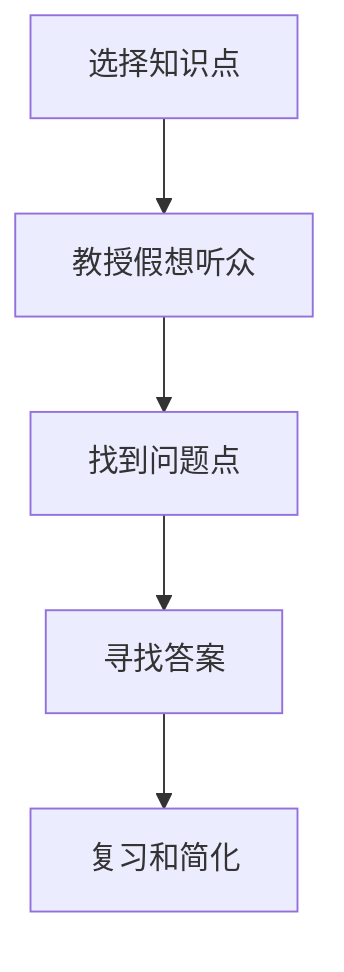

                 

# 费曼提问法:开启管理者思维升级

## 1. 背景介绍

费曼提问法（Feynman Technique）是由诺贝尔物理学奖得主理查德·费曼（Richard Feynman）提出的一种高效学习方法，旨在通过提问的方式，深入理解概念、强化记忆、提升思维。对于管理者而言，费曼提问法不仅仅是一种学习工具，更是一种思考方式，可以帮助他们在决策、团队管理、产品规划等各个环节，提升思维深度和系统化水平。

费曼提问法的核心思想是：通过将自己所学知识以教课的方式复述给假想的听众，发现和解决知识盲点，加深理解。具体应用在管理中，就是通过反复提问和回答的方式，深入思考和解决问题，推动决策和执行的科学性、系统性和创造性。

本博客将系统性地介绍费曼提问法在管理中的应用，从原理到实践，从案例到应用场景，全面剖析费曼提问法如何帮助管理者提升思维，构建更具竞争力的组织。

## 2. 核心概念与联系

### 2.1 核心概念概述

费曼提问法由五个步骤构成：

1. **选择知识点**：选取一个主题或问题，作为学习或思考的起点。
2. **教授假想听众**：设想自己正在向一位毫无背景知识的听众讲解该主题，详细阐述每一个概念和原理。
3. **找到问题点**：在讲解过程中，找出自己无法清晰解释或理解不够深入的点，记下这些问题。
4. **寻找答案**：针对这些问题，查找相关资料、请教专家或进行实验，找到答案。
5. **复习和简化**：重新整理和简化学习内容，使其更加精简、易懂，以便于记忆和应用。

### 2.2 核心概念原理和架构的 Mermaid 流程图



这个流程图展示了费曼提问法的五个步骤，清晰展示了从学习到应用的全过程。

### 2.3 核心概念的联系

费曼提问法不仅是学习工具，更是管理工具。通过提问和回答，管理者可以：

1. **提高决策质量**：通过深入理解问题，构建全面的分析框架，提升决策的科学性。
2. **强化团队协作**：通过引导团队成员提出问题，促进知识共享和经验交流，提升团队凝聚力。
3. **优化产品开发**：通过深入用户需求和市场变化，推动产品规划和迭代，满足用户期望。

## 3. 核心算法原理 & 具体操作步骤

### 3.1 算法原理概述

费曼提问法的核心算法原理基于认知科学中的“主动学习”和“深度加工”理论。通过主动参与和深度加工，将被动接受的知识内化为长期记忆，提高理解和应用能力。在管理中，费曼提问法通过以下几个核心环节实现这一目标：

1. **主动学习**：通过提问和回答，主动获取信息，避免被动接受，增强学习效果。
2. **深度加工**：通过深入分析和复述，促进知识内化，提高理解和应用深度。
3. **反馈循环**：通过不断反馈和迭代，修正错误和不足，提升思维和决策能力。

### 3.2 算法步骤详解

#### 3.2.1 选择知识点

1. **主题选择**：根据工作需求，选择重点学习和思考的主题，如市场分析、团队管理、项目管理等。
2. **问题识别**：从主题中识别出需要深入理解的关键问题，如市场分析中的用户需求识别、团队管理中的员工激励策略等。

#### 3.2.2 教授假想听众

1. **设定听众**：设想自己正在向一位毫无背景知识的听众讲解该主题。
2. **详细阐述**：通过详细阐述每一个概念和原理，检测自己的理解深度和表达能力。
3. **视觉化工具**：使用图表、PPT、白板等工具，帮助自己清晰地表达思想。

#### 3.2.3 找到问题点

1. **自我检测**：在讲解过程中，记录自己无法清晰解释或理解不够深入的点。
2. **查找资料**：针对这些问题，查找相关资料、文献或请教专家。
3. **整理笔记**：将查找的资料和请教的结果整理成笔记，方便后续复习和应用。

#### 3.2.4 寻找答案

1. **深入理解**：通过深入阅读资料、请教专家或进行实验，找到问题的答案。
2. **实例分析**：使用具体案例或实例，验证和深化理解。
3. **经验分享**：将新学到的知识和经验与团队成员分享，促进团队共同进步。

#### 3.2.5 复习和简化

1. **知识整合**：将新学到的知识和现有知识整合，形成一个系统的认知框架。
2. **简化表达**：将复杂的知识简化，便于记忆和应用。
3. **应用实践**：将简化后的知识应用到实际工作中，验证其有效性。

### 3.3 算法优缺点

#### 3.3.1 优点

1. **提高学习效率**：通过主动学习，避免被动接受，增强记忆效果。
2. **深化理解**：通过深度加工，将知识内化，提高理解深度和应用能力。
3. **促进创新**：通过不断提问和回答，激发思维和创意，提升问题解决能力。

#### 3.3.2 缺点

1. **时间成本高**：费曼提问法需要花费较多时间，尤其适用于深度学习。
2. **需要自律性**：需要高度的自律性，才能坚持长期应用。
3. **适用范围有限**：适用于具有较高理论要求的管理问题，不适用于一些简单直接的问题。

### 3.4 算法应用领域

费曼提问法在以下领域有广泛应用：

1. **战略规划**：通过深入分析市场和竞争环境，构建战略框架，提升决策的科学性。
2. **组织管理**：通过团队成员的深度思考和知识共享，优化管理流程，提升团队协作效率。
3. **产品开发**：通过深入了解用户需求和市场变化，推动产品规划和迭代，满足用户期望。
4. **项目管理**：通过项目团队的主动学习和知识管理，提升项目执行效率和质量。
5. **人力资源**：通过员工的学习和成长，提升组织的人才竞争力。

## 4. 数学模型和公式 & 详细讲解 & 举例说明

### 4.1 数学模型构建

费曼提问法主要通过提问和回答的方式进行，不涉及复杂的数学模型。但为了更好地理解其原理，可以从信息论的角度进行类比：

设知识量为 $K$，理解深度为 $D$，记忆深度为 $M$，应用能力为 $A$。则费曼提问法的目标是通过主动学习和深度加工，将知识量 $K$ 转化为理解深度 $D$，再通过复习和简化，转化为记忆深度 $M$ 和应用能力 $A$。数学模型如下：

$$
\begin{aligned}
D &= F(K) \\
M &= G(D) \\
A &= H(M)
\end{aligned}
$$

其中 $F$ 表示主动学习函数，$G$ 表示深度加工函数，$H$ 表示简化应用函数。

### 4.2 公式推导过程

#### 4.2.1 主动学习函数 $F(K)$

主动学习函数 $F(K)$ 通过提问和回答的方式，将知识量 $K$ 转化为理解深度 $D$。假设提问数量为 $Q$，回答数量为 $A$，则：

$$
F(K) = D(K, Q, A)
$$

其中 $D(K, Q, A)$ 表示知识量 $K$ 在提问数量 $Q$ 和回答数量 $A$ 的条件下，转化为理解深度 $D$ 的概率。

#### 4.2.2 深度加工函数 $G(D)$

深度加工函数 $G(D)$ 通过深度加工，将理解深度 $D$ 转化为记忆深度 $M$。假设深度加工次数为 $T$，每次加工时间 $T_i$，则：

$$
G(D) = M(D, T, T_i)
$$

其中 $M(D, T, T_i)$ 表示理解深度 $D$ 在深度加工次数 $T$ 和每次加工时间 $T_i$ 的条件下，转化为记忆深度 $M$ 的概率。

#### 4.2.3 简化应用函数 $H(M)$

简化应用函数 $H(M)$ 通过简化和应用，将记忆深度 $M$ 转化为应用能力 $A$。假设简化后的知识量为 $M_s$，应用次数 $A_i$，则：

$$
H(M) = A(M, M_s, A_i)
$$

其中 $A(M, M_s, A_i)$ 表示记忆深度 $M$ 在简化后的知识量 $M_s$ 和应用次数 $A_i$ 的条件下，转化为应用能力 $A$ 的概率。

### 4.3 案例分析与讲解

#### 4.3.1 案例一：市场分析

某企业需要进行市场分析，采用费曼提问法如下：

1. **选择知识点**：市场分析
2. **教授假想听众**：设想向一位市场分析师讲解市场分析的方法和步骤。
3. **找到问题点**：在讲解过程中，发现自己对市场细分方法和用户需求识别不够清晰。
4. **寻找答案**：查找相关资料，请教专家，理解市场细分方法和用户需求识别的关键点。
5. **复习和简化**：将市场细分方法和用户需求识别的知识简化，形成易于记忆和应用的知识框架。

#### 4.3.2 案例二：团队管理

某企业需要优化团队管理，采用费曼提问法如下：

1. **选择知识点**：团队管理
2. **教授假想听众**：设想向一位人力资源专家讲解团队管理的方法和策略。
3. **找到问题点**：在讲解过程中，发现自己对员工激励策略和团队协作机制不够深入。
4. **寻找答案**：查找相关资料，请教专家，理解员工激励策略和团队协作机制的关键点。
5. **复习和简化**：将员工激励策略和团队协作机制的知识简化，形成易于记忆和应用的知识框架。

## 5. 项目实践：代码实例和详细解释说明

### 5.1 开发环境搭建

费曼提问法主要通过手工记录和整理的方式进行，不需要复杂的开发环境。但为了方便记录和分析，可以使用一些笔记软件或项目管理工具，如Notion、Trello等。

### 5.2 源代码详细实现

由于费曼提问法不需要编写代码，这里只提供一个简化的示例，使用Python实现提问和回答的模拟：

```python
import random

def explain的主题):
    """教授假想听众，模拟讲解过程"""
    pass

def find_problems(主题):
    """找到问题点，模拟提问过程"""
    pass

def find_answers(问题点):
    """寻找答案，模拟查找资料或请教专家"""
    pass

def revise_and_simplify(答案):
    """复习和简化，模拟整理笔记和知识框架"""
    pass

# 示例用法
主题 = '市场分析'
问题点 = find_problems(主题)
答案 = find_answers(问题点)
revise_and_simplify(答案)
```

### 5.3 代码解读与分析

费曼提问法的代码实现非常简单，关键在于将理论应用到实际操作中。通过不断提问和回答，记录问题点和解决方案，整理和简化知识框架，最终形成可应用的系统化认知。

### 5.4 运行结果展示

由于费曼提问法主要通过手动记录和整理，没有明确的运行结果展示。但通过持续的应用和迭代，可以将知识系统化、深入化，提升管理能力和决策质量。

## 6. 实际应用场景

### 6.1 战略规划

在战略规划中，费曼提问法可以帮助管理层深入理解市场环境、竞争态势和自身优势，构建科学合理的战略框架。例如，通过深度加工和简化，将市场分析结果转化为战略目标和行动计划。

### 6.2 组织管理

在组织管理中，费曼提问法可以帮助管理者优化团队协作机制，提升员工激励策略。例如，通过团队成员的深度思考和知识共享，形成协同高效的团队文化。

### 6.3 产品开发

在产品开发中，费曼提问法可以帮助团队深入了解用户需求和市场变化，推动产品规划和迭代。例如，通过深度加工和简化，将用户需求转化为产品功能和特性。

### 6.4 未来应用展望

随着人工智能和数据分析技术的不断发展，费曼提问法将与其他技术结合，提升管理效能。例如，通过数据可视化工具，实时展示和管理者提问和回答的互动过程，提供更直观的反馈和指导。

## 7. 工具和资源推荐

### 7.1 学习资源推荐

1. 《深度学习：费曼技巧》（Deep Learning: A Gentle Introduction to Machine Learning）：介绍如何使用费曼技巧进行深度学习知识点的学习和应用。
2. 《费曼学习法：用输出倒逼输入，让学习动力加倍》（The Feynman Technique: The Ultimate Guide to Learning, Productivity, and Precise Knowledge）：详细介绍费曼提问法的理论基础和实践方法。
3. 《费曼技巧的运用：如何进行思考与学习》（Feynman Technique: Tips & Strategies for Improving Learning and Memory）：提供具体实用的费曼提问法应用策略。

### 7.2 开发工具推荐

1. Notion：一款多功能的笔记应用，可以记录和管理费曼提问法的各个环节。
2. Trello：一款项目管理工具，可以创建任务卡片和看板，记录和管理费曼提问法的进展。
3. Evernote：一款笔记应用，支持文本、图片和录音等多种记录方式，方便整理和管理费曼提问法的内容。

### 7.3 相关论文推荐

1. 《费曼技巧的科学原理》（The Science of the Feynman Technique）：探讨费曼提问法在科学学习中的应用。
2. 《费曼技巧：提升学习效率的实用方法》（The Feynman Technique: Practical Methods for Improving Learning Efficiency）：提供具体的费曼提问法应用案例和技巧。
3. 《费曼技巧：从概念理解到知识应用》（The Feynman Technique: From Conceptual Understanding to Knowledge Application）：深入分析费曼提问法在知识应用中的作用和效果。

## 8. 总结：未来发展趋势与挑战

### 8.1 未来发展趋势

费曼提问法作为管理思维升级的重要工具，未来将呈现以下几个发展趋势：

1. **智能化辅助**：随着人工智能技术的发展，费曼提问法将结合AI工具，提供自动化提问和回答的功能，提升效率。
2. **多模态融合**：将费曼提问法的理论应用扩展到视觉、听觉等多模态数据，提供更丰富的信息输入和输出方式。
3. **场景定制化**：根据不同管理场景的特点，定制化费曼提问法的应用流程和方法，提升适用性和效果。

### 8.2 面临的挑战

尽管费曼提问法在管理中具有广泛应用前景，但仍面临一些挑战：

1. **时间和成本**：费曼提问法需要投入大量时间和精力，对于忙碌的管理者来说，可能难以坚持。
2. **技术门槛**：需要一定的理论基础和技术能力，对于技术背景较弱的管理者，可能存在应用障碍。
3. **应用范围有限**：适用于理论要求较高、问题复杂的管理场景，对于简单直接的问题，效果可能不如其他方法。

### 8.3 研究展望

未来，费曼提问法的应用将不断扩展和深化，成为管理思维升级的重要工具。同时，需要结合新技术和新方法，进一步提升其应用效果和覆盖范围。

1. **结合大数据分析**：利用大数据分析技术，提供更精准的提问和回答建议。
2. **结合人工智能**：利用AI技术，提供自动化提问和回答，提升效率和效果。
3. **结合心理学原理**：结合心理学原理，优化提问和回答的方式，提升学习效果。

## 9. 附录：常见问题与解答

### Q1: 费曼提问法是否适用于所有管理问题？

A: 费曼提问法适用于理论要求较高、问题复杂的管理场景，如战略规划、产品开发、组织管理等。对于简单直接的问题，如日常行政事务处理，可能不如其他方法有效。

### Q2: 费曼提问法需要多少时间？

A: 费曼提问法需要投入大量时间和精力，尤其适用于深度学习和知识积累。对于初学者，建议每天投入30分钟进行练习，逐步提高应用能力。

### Q3: 如何克服费曼提问法的时间和成本？

A: 可以通过团队协作，将提问和回答任务分配给多个成员，提升效率。同时，可以利用项目管理工具，记录和管理费曼提问法的进展，确保持续进行。

### Q4: 如何结合大数据分析和费曼提问法？

A: 可以利用大数据分析技术，提供更精准的提问和回答建议。例如，通过数据挖掘和分析，发现关键问题和解决方案，提供更针对性的提问方向。

### Q5: 如何结合人工智能和费曼提问法？

A: 可以利用AI技术，提供自动化提问和回答，提升效率和效果。例如，通过自然语言处理技术，将问题自动转换为标准格式，并自动匹配答案库。

---

作者：禅与计算机程序设计艺术 / Zen and the Art of Computer Programming

