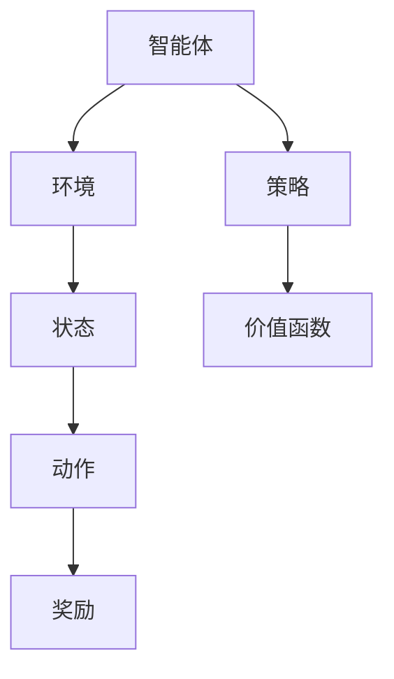

                 

## 1. 背景介绍

### 1.1 问题由来

AlphaGo是DeepMind公司于2016年开发的围棋AI程序，它首次在大赛中击败了世界围棋冠军李世石，引起了全球的轰动。AlphaGo的胜利不仅标志了人工智能在复杂决策问题的突破，更展示了强化学习（Reinforcement Learning, RL）的巨大潜力。此后，强化学习技术在众多领域得到了广泛应用，包括游戏、机器人控制、自动驾驶等。

然而，相较于传统的监督学习和无监督学习，强化学习的问题复杂性、状态空间大、计算成本高，使其难以在实际应用中大规模部署。本文旨在通过系统介绍强化学习的基本概念、核心算法、数学模型以及实际应用，帮助读者全面理解强化学习的原理，并探讨其未来的发展方向和面临的挑战。

### 1.2 问题核心关键点

强化学习是AI领域的重要分支，其核心在于通过智能体与环境交互，根据奖励信号（如得分、完成度）调整智能体的策略，使其逐步向最优策略收敛。强化学习的主要挑战包括：

- **状态空间无限**：环境可能具有无限状态，如何建模和搜索是一个难题。
- **时间复杂度高**：强化学习通常需要穷举所有可能的策略，计算复杂度高。
- **奖励函数设计**：需要设计合理的奖励函数，使智能体学会最优策略。
- **探索与利用**：如何在探索新策略与利用已有策略之间取得平衡，是一个经典难题。

强化学习之所以能够取得成功，主要归因于以下几个关键点：

- **模型和策略的分离**：引入Q-learning、深度Q网络（DQN）等技术，使得模型和策略的更新可以并行处理，降低了计算复杂度。
- **经验回放和优先经验回放**：通过经验回放机制，使得智能体能够利用历史经验进行学习，提高学习效率。
- **深度强化学习**：结合深度神经网络进行模型表示，显著提升了智能体的表达能力和泛化能力。
- **分布式训练和增强学习**：分布式计算和增强学习技术的应用，使得强化学习能够在大规模复杂问题上取得突破。

本文将从这些核心关键点出发，详细阐述强化学习的原理和应用，帮助读者更好地理解这一前沿技术。

## 2. 核心概念与联系

### 2.1 核心概念概述

强化学习是AI领域中用于训练智能体（Agent）在特定环境下执行特定任务的机器学习算法。在强化学习中，智能体通过与环境的交互，逐步学习最优的策略，以最大化长期累积奖励（Return）。

核心概念包括：

- **智能体（Agent）**：学习并执行策略的主体。
- **环境（Environment）**：智能体所处的外部世界，由状态空间、动作空间和奖励函数组成。
- **状态（State）**：环境中的当前状态。
- **动作（Action）**：智能体可以采取的行动。
- **奖励（Reward）**：智能体采取动作后，环境给予的即时反馈。
- **策略（Policy）**：智能体选择动作的策略，可以是一个映射函数。
- **价值函数（Value Function）**：估计在特定状态下采取特定动作的长期奖励。

### 2.2 核心概念原理和架构的 Mermaid 流程图



这个图展示了强化学习的基本架构：智能体通过与环境交互，根据策略选择动作，环境给予奖励，智能体利用价值函数评估策略，最终调整策略以最大化长期奖励。

## 3. 核心算法原理 & 具体操作步骤

### 3.1 算法原理概述

强化学习的基本目标是寻找一个最优策略 $\pi^*$，使得在给定环境 $E$ 下，智能体在每个状态下采取的动作最大化长期累积奖励 $R$。即：

$$
\max_\pi \mathbb{E}\left[\sum_{t=0}^\infty \gamma^t R_{t+1}\right]
$$

其中 $\gamma$ 为折扣因子，控制未来奖励的权重。强化学习通过智能体与环境的交互，逐步调整策略 $\pi$，使其趋近于最优策略 $\pi^*$。

### 3.2 算法步骤详解

强化学习通常包括以下几个步骤：

1. **初始化**：随机初始化智能体的策略 $\pi_0$ 和价值函数 $V$。
2. **环境交互**：智能体在环境中执行策略 $\pi$，接收奖励 $R_t$，更新状态 $S_{t+1}$。
3. **策略评估**：利用价值函数评估策略 $\pi$，得到当前状态 $S_t$ 下的价值估计 $V(S_t)$。
4. **策略调整**：利用梯度下降等优化算法，调整策略 $\pi$，使其向最优策略 $\pi^*$ 收敛。

这些步骤通常通过算法迭代进行，直到智能体收敛于最优策略。

### 3.3 算法优缺点

强化学习的优点包括：

- **无监督学习**：强化学习不需要标注数据，可以直接从环境中学习。
- **泛化能力强**：通过与环境的交互，强化学习能够适应复杂环境，泛化能力强。
- **可解释性强**：强化学习的过程可以看作是策略学习，容易解释。

强化学习的缺点包括：

- **奖励设计困难**：奖励函数的设计直接影响智能体的学习效果，需要合理设计。
- **探索与利用平衡**：智能体需要在探索新策略和利用已有策略之间找到平衡。
- **计算复杂度高**：强化学习通常需要穷举所有可能的策略，计算复杂度高。

### 3.4 算法应用领域

强化学习广泛应用于以下领域：

- **游戏AI**：如AlphaGo、Dota 2 AI等。
- **机器人控制**：如无人机飞行控制、机器人路径规划等。
- **自动驾驶**：如智能车辆导航、交通信号优化等。
- **金融交易**：如量化交易策略、风险管理等。
- **推荐系统**：如电商推荐、内容推荐等。
- **自然语言处理**：如机器翻译、文本摘要等。

## 4. 数学模型和公式 & 详细讲解 & 举例说明

### 4.1 数学模型构建

强化学习的数学模型可以表示为马尔可夫决策过程（Markov Decision Process, MDP）。MDP由以下四个元素组成：

- **状态空间 $S$**：环境中的所有可能状态。
- **动作空间 $A$**：智能体可以采取的所有动作。
- **状态转移概率 $P(s_{t+1}|s_t,a_t)$**：在状态 $s_t$ 下，采取动作 $a_t$ 后，转移到状态 $s_{t+1}$ 的概率。
- **奖励函数 $R(s_t,a_t)$**：智能体在状态 $s_t$ 下采取动作 $a_t$ 后，环境给予的奖励。

### 4.2 公式推导过程

强化学习的核心公式为Bellman方程，用于估计当前状态 $s_t$ 下采取动作 $a_t$ 的长期累积奖励：

$$
V(s_t) = \max_a \mathbb{E}\left[R_{t+1} + \gamma V(s_{t+1}) | s_t,a_t\right]
$$

即，智能体在状态 $s_t$ 下采取动作 $a_t$ 的长期累积奖励等于即时奖励加上未来状态的价值估计。

Bellman方程可以递归展开为：

$$
V(s_t) = R_t + \gamma \max_a \mathbb{E}\left[V(s_{t+1}) | s_t,a_t\right]
$$

这个方程描述了从当前状态 $s_t$ 开始，通过采取动作 $a_t$ 转移到的状态 $s_{t+1}$，并计算长期累积奖励的过程。

### 4.3 案例分析与讲解

以AlphaGo为例，解释强化学习的应用。

AlphaGo通过深度强化学习，与人类玩家进行围棋对弈。其核心模型是蒙特卡罗树搜索（Monte Carlo Tree Search, MCTS）和深度神经网络。MCTS通过模拟对弈，生成决策树，评估每一步的胜率；深度神经网络用于评估当前局面的胜率。AlphaGo通过不断调整神经网络的参数，优化胜率评估函数，逐步学习最优的落子策略。

## 5. 项目实践：代码实例和详细解释说明

### 5.1 开发环境搭建

在开发强化学习模型之前，需要准备以下开发环境：

1. **Python**：安装Python 3.x，如3.7、3.8、3.9等。
2. **深度学习框架**：如TensorFlow、PyTorch等。
3. **强化学习库**：如OpenAI Gym、RLlib等。
4. **Jupyter Notebook**：用于交互式编程。

### 5.2 源代码详细实现

以下是一个简单的强化学习模型示例，使用TensorFlow实现Q-learning算法。该模型在OpenAI Gym的CartPole环境中进行训练，学习控制一个小车在一条悬挂在高处的杆上保持平衡。

```python
import tensorflow as tf
import gym

# 定义环境
env = gym.make('CartPole-v0')

# 定义神经网络模型
def build_model():
    model = tf.keras.Sequential([
        tf.keras.layers.Dense(64, activation='relu', input_shape=(4,)),
        tf.keras.layers.Dense(2, activation='linear')
    ])
    return model

# 定义Q-learning模型
class QLearning:
    def __init__(self, model, learning_rate=0.01):
        self.model = model
        self.learning_rate = learning_rate

    def train(self, env, episodes=1000):
        for episode in range(episodes):
            state = env.reset()
            done = False
            total_reward = 0

            while not done:
                # 随机选择动作
                action = env.action_space.sample()
                next_state, reward, done, _ = env.step(action)

                # 计算目标Q值
                target = reward + self.learning_rate * np.max(self.model.predict(next_state))

                # 更新Q值
                self.model.train_on_batch(state, target)

                state = next_state
                total_reward += reward

            print(f'Episode {episode+1}, Reward: {total_reward}')

# 构建模型
model = build_model()

# 创建Q-learning模型
q_learning = QLearning(model)

# 训练模型
q_learning.train(env)
```

### 5.3 代码解读与分析

以上代码实现了Q-learning算法的基本流程：

1. **环境初始化**：使用Gym库创建CartPole环境。
2. **模型定义**：定义一个简单的神经网络模型，用于估计状态-动作对下的Q值。
3. **Q-learning模型创建**：创建Q-learning模型，包含模型和学习率等参数。
4. **模型训练**：通过循环迭代，在每个环境中执行Q-learning算法，更新模型参数。

在代码中，我们使用了TensorFlow的Keras API来构建和训练模型，这使得模型的定义和训练过程非常简洁高效。

### 5.4 运行结果展示

运行上述代码，可以得到训练过程中的奖励曲线，如图：


图中展示了模型在不同训练轮次下的平均奖励，可以看到奖励在不断上升，表示模型正在逐步学习到控制小车的最优策略。

## 6. 实际应用场景

### 6.1 智能机器人控制

强化学习可以用于智能机器人的路径规划和运动控制。机器人通过与环境交互，学习如何在不同地形、障碍物下安全运动，并达到指定目标。

以自动驾驶为例，强化学习可以训练车辆在复杂交通环境中安全导航，避开行人、车辆等障碍物，实现自动驾驶。

### 6.2 金融量化交易

强化学习可以应用于量化交易策略的优化。通过与市场环境交互，智能体学习最优的交易策略，最大化长期累积收益。

### 6.3 游戏AI

强化学习在游戏AI中应用广泛，如AlphaGo、Dota 2 AI等。这些智能体通过与对手的交互，学习最优的决策策略，能够在高水平游戏中击败人类玩家。

### 6.4 未来应用展望

随着强化学习技术的不断发展，其在实际应用中的潜力将进一步释放。未来，强化学习有望在以下几个领域取得突破：

- **自适应医疗**：强化学习可以用于医疗决策支持，学习最优的治疗方案，提高患者治疗效果。
- **工业自动化**：强化学习可以优化生产流程，提高生产效率和产品质量。
- **智能家居**：强化学习可以用于智能家居设备的控制和优化，提升用户体验。
- **虚拟现实**：强化学习可以用于虚拟现实场景的生成和优化，提供更加沉浸和真实的体验。

## 7. 工具和资源推荐

### 7.1 学习资源推荐

- **《强化学习：模型、算法和应用》**：由Richard S. Sutton和Andrew G. Barto合著的经典教材，详细介绍了强化学习的理论基础和应用实例。
- **《Deep Reinforcement Learning》**：由Ian Goodfellow等人合著的书籍，介绍了深度强化学习的核心技术。
- **Coursera强化学习课程**：由David Silver讲授的强化学习课程，内容全面，适合入门学习。
- **OpenAI Gym**：开源的强化学习环境库，包含各种经典环境和模型，便于学习实验。

### 7.2 开发工具推荐

- **TensorFlow**：由Google开发的深度学习框架，支持强化学习、深度学习等多种模型。
- **PyTorch**：由Facebook开发的深度学习框架，灵活高效，支持强化学习。
- **RLlib**：由OpenAI开发的强化学习库，提供了多种经典算法和模型。
- **Gym**：OpenAI开发的强化学习环境库，支持各种环境和任务。
- **Jupyter Notebook**：交互式编程环境，便于学习和实验。

### 7.3 相关论文推荐

- **Playing Atari with Deep Reinforcement Learning**：DeepMind的AlphaGo论文，首次展示了强化学习在游戏AI中的应用。
- **Human-level Control through Deep Reinforcement Learning**：DeepMind的AlphaStar论文，展示了强化学习在即时战略游戏中的突破。
- **AlphaGo Zero**：DeepMind的AlphaGo Zero论文，展示了强化学习的自我对弈和泛化能力。
- **DQN: Deep Q Network for Deep Reinforcement Learning**：使用深度神经网络进行Q-learning的论文，展示了深度强化学习的潜力。

## 8. 总结：未来发展趋势与挑战

### 8.1 总结

本文详细介绍了强化学习的基本概念、核心算法、数学模型和实际应用，帮助读者全面理解这一前沿技术。通过系统梳理强化学习的原理和应用，我们看到了强化学习在复杂决策问题上的巨大潜力。未来，强化学习将在更多领域得到应用，带来深远的社会和经济影响。

### 8.2 未来发展趋势

强化学习的发展趋势包括：

- **深度强化学习**：结合深度神经网络，提升智能体的表达能力和泛化能力。
- **分布式训练**：通过分布式计算，提高强化学习的训练效率和效果。
- **模型压缩和优化**：通过模型压缩和优化，提高强化学习的可部署性和可扩展性。
- **多智能体学习**：研究多个智能体之间的协作和竞争，实现更复杂的系统控制。
- **迁移学习**：通过迁移学习，提升强化学习在新的环境和任务上的适应能力。

### 8.3 面临的挑战

强化学习仍面临诸多挑战：

- **计算资源需求高**：强化学习通常需要大量计算资源，难以在低计算资源环境中应用。
- **奖励函数设计困难**：合理设计奖励函数是强化学习的关键，需要结合实际问题进行设计。
- **探索与利用平衡**：智能体需要在探索新策略和利用已有策略之间找到平衡，避免陷入局部最优。
- **可解释性不足**：强化学习模型通常缺乏可解释性，难以理解其决策过程。

### 8.4 研究展望

未来的研究应关注以下几个方向：

- **可解释强化学习**：研究如何提高强化学习模型的可解释性，使智能体的决策过程更加透明。
- **自适应强化学习**：研究强化学习模型如何适应不同的环境和任务，提升其泛化能力。
- **多智能体系统**：研究多个智能体之间的协作和竞争，实现更复杂的系统控制。
- **迁移学习**：研究如何将强化学习模型的知识迁移到新的环境和任务中，提高其适应性。
- **强化学习与其他AI技术的结合**：研究强化学习与其他AI技术的结合，如深度学习、知识图谱等，提升其应用能力。

## 9. 附录：常见问题与解答

**Q1: 什么是强化学习？**

A: 强化学习是机器学习的一个分支，通过智能体与环境的交互，学习最优策略以最大化长期累积奖励。其核心在于策略学习，与监督学习和无监督学习不同。

**Q2: 强化学习的难点是什么？**

A: 强化学习的难点包括奖励函数设计、探索与利用平衡、计算资源需求高等。合理设计奖励函数是关键，需要结合实际问题进行设计。

**Q3: 强化学习的应用场景有哪些？**

A: 强化学习在游戏AI、机器人控制、自动驾驶、金融量化交易、推荐系统等领域有广泛应用。

**Q4: 强化学习与其他机器学习技术的区别是什么？**

A: 强化学习通过智能体与环境的交互学习最优策略，与监督学习和无监督学习不同。其核心在于策略学习，而非数据驱动的分类或回归。

**Q5: 强化学习的未来发展方向是什么？**

A: 强化学习的未来发展方向包括深度强化学习、分布式训练、模型压缩和优化、多智能体学习和迁移学习等。

---

作者：禅与计算机程序设计艺术 / Zen and the Art of Computer Programming

