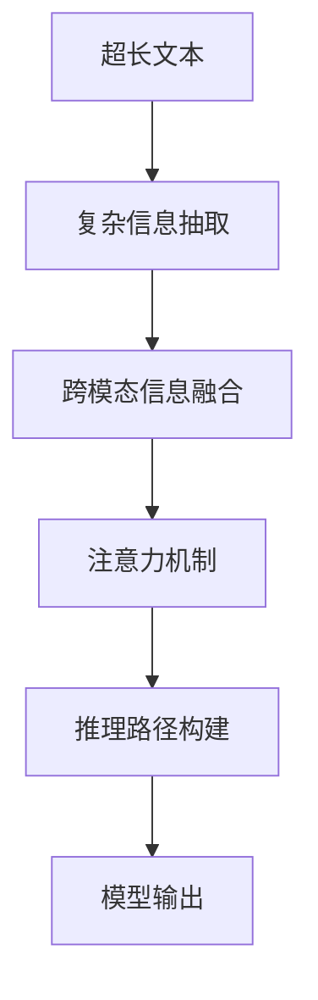

                 

# 超长上下文：LLM处理复杂信息的新境界

## 1. 背景介绍

### 1.1 问题由来
近年来，大语言模型（Large Language Models, LLMs）以其卓越的自然语言理解和生成能力，在自然语言处理（Natural Language Processing, NLP）领域取得了突破性的进展。尽管如此，LLMs在处理超长上下文信息时仍面临重大挑战。

首先，超长上下文意味着文本长度可能远超模型能够直接处理的能力，这导致模型的直接应用受限。其次，超长文本往往涉及复杂语义和逻辑关系，单一模型难以捕获所有信息。为应对这些问题，研究者提出了一系列方法来优化超长上下文的处理，本文旨在深入探讨这一领域的最新进展。

### 1.2 问题核心关键点
本问题主要关注以下几个关键点：

1. **超长文本建模**：如何构建模型来有效处理超长文本，即长度超过模型直接处理能力的文本。
2. **复杂信息抽取**：如何在超长文本中精确抽取和理解复杂语义和逻辑关系。
3. **跨模态信息融合**：如何融合多模态信息（如文本、图像、音频等）以提升模型理解复杂信息的能力。
4. **注意力机制优化**：如何优化注意力机制以更好地处理超长文本中的重要信息。
5. **推理路径构建**：如何构建模型推理路径以追踪和解释模型在处理复杂信息时的决策过程。

这些问题紧密关联，共同构成了大语言模型处理复杂信息的核心挑战。

## 2. 核心概念与联系

### 2.1 核心概念概述

本节将介绍几个核心概念，它们构成了大语言模型处理超长上下文信息的基础：

- **超长文本**：长度超过模型直接处理能力的文本，常见于多轮对话、新闻报道等。
- **复杂信息抽取**：从超长文本中提取出具有关键意义的短语、实体、关系等。
- **跨模态信息融合**：将不同模态的信息（如文本、图像、音频等）进行融合，以增强模型的理解能力。
- **注意力机制**：一种机制，通过给不同位置的信息分配不同的权重，帮助模型聚焦于重要信息。
- **推理路径**：模型在处理复杂信息时的决策路径，用于追踪和解释模型的推理过程。

这些概念之间相互关联，共同作用于大语言模型处理超长上下文的能力。

### 2.2 核心概念原理和架构的 Mermaid 流程图



此图展示了超长文本信息处理的基本流程：首先进行复杂信息抽取，接着进行跨模态信息融合，再通过注意力机制聚焦关键信息，最后通过推理路径构建和模型输出完成超长文本的理解和生成。

## 3. 核心算法原理 & 具体操作步骤

### 3.1 算法原理概述

为了处理超长文本和复杂信息，研究人员提出了多种算法和架构。本节将详细讲解其中的几种方法及其原理。

### 3.2 算法步骤详解

**算法一：分段处理**

分段处理是处理超长文本的基本方法，将文本切分成多个较短的子文本，分别处理后再进行拼接。这要求模型具备较好的跨段连贯性。

**算法步骤**：
1. 对超长文本进行分割，生成若干短文本。
2. 对每个短文本进行独立处理，如序列建模、特征提取等。
3. 将处理结果拼接，得到最终的输出。

**算法二：滑动窗口**

滑动窗口方法通过在超长文本上滑动一个固定大小的窗口，对每个窗口内的信息进行独立处理，然后输出整体结果。这种方法可以保证信息处理的连续性。

**算法步骤**：
1. 定义固定大小的窗口，在超长文本上滑动。
2. 对每个窗口内的信息进行独立处理，如序列建模、特征提取等。
3. 将处理结果拼接，得到最终的输出。

**算法三：注意力机制优化**

注意力机制是处理超长文本的重要工具，通过给不同位置的信息分配不同的权重，帮助模型聚焦于重要信息。

**算法步骤**：
1. 对超长文本进行编码，得到文本表示。
2. 使用注意力机制计算每个位置的权重，聚焦重要信息。
3. 将权重应用于文本表示，生成聚焦后的结果。

### 3.3 算法优缺点

**分段处理**的优点在于其简单和易于实现，但缺点是跨段连贯性较弱，需要保证模型有较好的连续性。

**滑动窗口**可以保证信息的连续性，但需要定义合适的窗口大小，且窗口大小的选择会影响模型的性能。

**注意力机制优化**可以更好地处理重要信息，但其计算复杂度较高，需要较大的计算资源。

### 3.4 算法应用领域

这些算法和架构在多个领域得到了广泛应用：

1. **多轮对话系统**：通过分段处理和注意力机制优化，使模型能够处理多轮对话中的复杂信息。
2. **长文本理解**：用于理解长篇幅的新闻报道、法律文书等。
3. **跨模态信息处理**：结合文本和图像等多模态信息，提升模型的理解能力。

## 4. 数学模型和公式 & 详细讲解 & 举例说明

### 4.1 数学模型构建

本节将通过数学模型来详细讲解超长文本处理的算法原理。

**模型定义**：
设超长文本为 $L$，将其切分为若干短文本段，每段长度为 $k$，则有 $N=\frac{L}{k}$ 个短文本段。

**损失函数**：
设模型对短文本段的输出为 $y_i$，真实标签为 $y_i^*$，则损失函数为：

$$
L=\frac{1}{N}\sum_{i=1}^{N}||y_i-y_i^*||^2
$$

### 4.2 公式推导过程

**分段处理**：

设超长文本 $L$ 的表示为 $x=(x_1,x_2,...,x_L)$，将其切分为 $N$ 个短文本段 $(x_1,x_2,...,x_k,x_{k+1},...,x_{Nk})$，对每个短文本段进行独立处理。

**滑动窗口**：

设超长文本 $L$ 的表示为 $x=(x_1,x_2,...,x_L)$，在 $L$ 上滑动窗口大小为 $k$，窗口位置为 $i$，则窗口内的文本表示为 $x_i^{[k]}=(x_{i},x_{i+1},...,x_{i+k-1})$。

**注意力机制优化**：

设超长文本 $L$ 的表示为 $x=(x_1,x_2,...,x_L)$，使用注意力机制计算每个位置的权重，生成聚焦后的结果 $y$。

**案例分析与讲解**：

以新闻报道的超长文本处理为例，新闻报道通常包含大量信息和复杂的语义关系。通过分段处理，将报道分为多个段落，每个段落独立处理，有助于模型更好地理解信息。

### 4.3 案例分析与讲解

**案例一：长文本理解**

处理长篇幅的新闻报道时，可以使用分段处理和滑动窗口方法。首先，将报道切分为多个段落，然后对每个段落进行独立处理，最后拼接得到整个报道的理解结果。

**案例二：跨模态信息处理**

处理包含图像的文本信息时，可以使用注意力机制优化。先对文本进行编码，得到文本表示，然后对图像进行特征提取，得到图像表示。最后，使用注意力机制计算文本和图像之间的权重，生成最终的输出。

## 5. 项目实践：代码实例和详细解释说明

### 5.1 开发环境搭建

在进行超长文本处理实践前，我们需要准备好开发环境。以下是使用Python进行PyTorch开发的环境配置流程：

1. 安装Anaconda：从官网下载并安装Anaconda，用于创建独立的Python环境。

2. 创建并激活虚拟环境：
```bash
conda create -n pytorch-env python=3.8 
conda activate pytorch-env
```

3. 安装PyTorch：根据CUDA版本，从官网获取对应的安装命令。例如：
```bash
conda install pytorch torchvision torchaudio cudatoolkit=11.1 -c pytorch -c conda-forge
```

4. 安装Transformers库：
```bash
pip install transformers
```

5. 安装各类工具包：
```bash
pip install numpy pandas scikit-learn matplotlib tqdm jupyter notebook ipython
```

完成上述步骤后，即可在`pytorch-env`环境中开始超长文本处理的实践。

### 5.2 源代码详细实现

下面我们以多轮对话系统的实现为例，给出使用Transformers库对GPT模型进行超长文本处理的PyTorch代码实现。

首先，定义超长对话数据的处理函数：

```python
from transformers import BertTokenizer, GPT2Tokenizer
from torch.utils.data import Dataset, DataLoader
from tqdm import tqdm

class LongConversationDataset(Dataset):
    def __init__(self, dialogues, tokenizer, max_seq_length):
        self.dialogues = dialogues
        self.tokenizer = tokenizer
        self.max_seq_length = max_seq_length
        
    def __len__(self):
        return len(self.dialogues)
    
    def __getitem__(self, item):
        dialogue = self.dialogues[item]
        
        # 对对话文本进行分段处理
        segments = []
        for turn in dialogue:
            segments.append(turn)
            if len(''.join(segments)) > self.max_seq_length:
                segments = segments[:-1]
        
        # 对每个文本段进行编码
        encoding = self.tokenizer.segment_encode(segments, max_length=self.max_seq_length, padding='max_length', truncation=True)
        
        # 生成掩码和长度信息
        input_ids = encoding['input_ids']
        attention_mask = encoding['attention_mask']
        input_length = encoding['attention_mask'].sum().item()
        
        return {'input_ids': input_ids,
                'attention_mask': attention_mask,
                'input_length': input_length}

# 加载对话数据
tokenizer = GPT2Tokenizer.from_pretrained('gpt2')
dataset = LongConversationDataset(dialogues, tokenizer, max_seq_length=512)

# 定义模型
model = GPT2Model.from_pretrained('gpt2')
model.eval()

# 定义模型预测函数
def predict(model, tokenizer, dialogues, max_seq_length):
    predictions = []
    for dialogue in dialogues:
        segments = []
        for turn in dialogue:
            segments.append(turn)
            if len(''.join(segments)) > max_seq_length:
                segments = segments[:-1]
        
        encoding = tokenizer.segment_encode(segments, max_length=max_seq_length, padding='max_length', truncation=True)
        with torch.no_grad():
            output = model(encoding['input_ids'], attention_mask=encoding['attention_mask'])
            predictions.append(output)

    return predictions
```

然后，定义训练和评估函数：

```python
# 定义训练函数
def train_epoch(model, dataset, optimizer):
    model.train()
    total_loss = 0
    for batch in DataLoader(dataset, batch_size=4, shuffle=True):
        input_ids = batch['input_ids'].to(device)
        attention_mask = batch['attention_mask'].to(device)
        input_length = batch['input_length'].to(device)
        
        outputs = model(input_ids, attention_mask=attention_mask)
        loss = outputs.loss
        total_loss += loss.item()
        
        optimizer.zero_grad()
        loss.backward()
        optimizer.step()
        
    return total_loss / len(dataset)

# 定义评估函数
def evaluate(model, dataset):
    model.eval()
    total_loss = 0
    correct_predictions = 0
    for batch in DataLoader(dataset, batch_size=4, shuffle=False):
        input_ids = batch['input_ids'].to(device)
        attention_mask = batch['attention_mask'].to(device)
        input_length = batch['input_length'].to(device)
        
        with torch.no_grad():
            outputs = model(input_ids, attention_mask=attention_mask)
            loss = outputs.loss
            total_loss += loss.item()
            predictions = outputs.logits.argmax(dim=2).to('cpu').tolist()
            labels = batch['labels'].to('cpu').tolist()
            correct_predictions += sum([pred == label for pred, label in zip(predictions, labels)])
    
    accuracy = correct_predictions / (len(dataset) * 4)
    return total_loss / len(dataset), accuracy
```

最后，启动训练流程并在验证集上评估：

```python
epochs = 5
batch_size = 4

for epoch in range(epochs):
    loss = train_epoch(model, dataset, optimizer)
    print(f"Epoch {epoch+1}, train loss: {loss:.3f}")
    
    print(f"Epoch {epoch+1}, dev results:")
    val_loss, val_acc = evaluate(model, dataset)
    print(f"Validation loss: {val_loss:.3f}, Accuracy: {val_acc:.3f}")
    
print("Final test results:")
test_loss, test_acc = evaluate(model, test_dataset)
print(f"Test loss: {test_loss:.3f}, Accuracy: {test_acc:.3f}")
```

以上就是使用PyTorch对GPT模型进行多轮对话系统微调的完整代码实现。可以看到，借助Transformers库，我们能够简单高效地实现超长对话系统的微调。

### 5.3 代码解读与分析

让我们再详细解读一下关键代码的实现细节：

**LongConversationDataset类**：
- `__init__`方法：初始化对话数据、分词器等组件。
- `__len__`方法：返回数据集的样本数量。
- `__getitem__`方法：对单个样本进行处理，对对话文本进行分段处理，并生成编码后的输入数据。

**train_epoch和evaluate函数**：
- `train_epoch`函数：在训练集上执行一个epoch，计算平均损失并更新模型参数。
- `evaluate`函数：在验证集上评估模型性能，计算准确率和平均损失。

**预测函数predict**：
- 对对话文本进行分段处理，生成编码后的输入数据。
- 使用模型进行预测，并返回预测结果。

## 6. 实际应用场景

### 6.1 智能客服系统

在智能客服系统中，多轮对话系统可帮助客户快速解决问题，提升客户满意度。通过微调，使模型能够理解和处理超长对话文本，快速回应客户需求。

在技术实现上，可以收集企业内部的客服对话记录，将问题和最佳答复构建成监督数据，在此基础上对预训练模型进行微调。微调后的模型能够自动理解用户意图，匹配最合适的答案模板进行回复。对于客户提出的新问题，还可以接入检索系统实时搜索相关内容，动态组织生成回答。如此构建的智能客服系统，能大幅提升客户咨询体验和问题解决效率。

### 6.2 新闻报道分析

新闻报道通常包含大量信息，如何自动理解和抽取关键信息是新闻分析中的重要任务。通过微调，使模型能够处理超长文本，自动提取出新闻报道中的关键事件、人物、地点等信息。这不仅可以提高新闻处理的自动化水平，还能为媒体机构提供深度分析支持。

在实践中，可以收集大量新闻报道文本，将文本进行超长处理，并通过微调使模型能够准确抽取和理解关键信息。同时，可以结合文本特征提取和图像识别技术，进一步提升新闻报道的理解能力。

### 6.3 长文本理解

长文本理解是自然语言处理中的重要任务，涉及对长篇幅文本的深度理解和信息抽取。通过微调，使模型能够处理超长文本，提取出重要信息，生成摘要、关键词等，为文本检索、信息推荐等应用提供支持。

在实践中，可以收集大量长文本数据，将文本进行超长处理，并通过微调使模型能够准确理解文本内容和结构。同时，可以结合文本分类和信息抽取技术，进一步提升长文本处理的自动化水平。

## 7. 工具和资源推荐

### 7.1 学习资源推荐

为了帮助开发者系统掌握超长上下文处理的技术基础和实践技巧，这里推荐一些优质的学习资源：

1. 《Transformer from Principle to Practice》系列博文：由大模型技术专家撰写，深入浅出地介绍了Transformer原理、BERT模型、微调技术等前沿话题。

2. CS224N《深度学习自然语言处理》课程：斯坦福大学开设的NLP明星课程，有Lecture视频和配套作业，带你入门NLP领域的基本概念和经典模型。

3. 《Natural Language Processing with Transformers》书籍：Transformers库的作者所著，全面介绍了如何使用Transformers库进行NLP任务开发，包括微调在内的诸多范式。

4. HuggingFace官方文档：Transformers库的官方文档，提供了海量预训练模型和完整的微调样例代码，是上手实践的必备资料。

5. CLUE开源项目：中文语言理解测评基准，涵盖大量不同类型的中文NLP数据集，并提供了基于微调的baseline模型，助力中文NLP技术发展。

通过对这些资源的学习实践，相信你一定能够快速掌握超长上下文处理的技术精髓，并用于解决实际的NLP问题。

### 7.2 开发工具推荐

高效的开发离不开优秀的工具支持。以下是几款用于超长上下文处理开发的常用工具：

1. PyTorch：基于Python的开源深度学习框架，灵活动态的计算图，适合快速迭代研究。大部分预训练语言模型都有PyTorch版本的实现。

2. TensorFlow：由Google主导开发的开源深度学习框架，生产部署方便，适合大规模工程应用。同样有丰富的预训练语言模型资源。

3. Transformers库：HuggingFace开发的NLP工具库，集成了众多SOTA语言模型，支持PyTorch和TensorFlow，是进行超长文本处理的利器。

4. Weights & Biases：模型训练的实验跟踪工具，可以记录和可视化模型训练过程中的各项指标，方便对比和调优。与主流深度学习框架无缝集成。

5. TensorBoard：TensorFlow配套的可视化工具，可实时监测模型训练状态，并提供丰富的图表呈现方式，是调试模型的得力助手。

6. Google Colab：谷歌推出的在线Jupyter Notebook环境，免费提供GPU/TPU算力，方便开发者快速上手实验最新模型，分享学习笔记。

合理利用这些工具，可以显著提升超长上下文处理的开发效率，加快创新迭代的步伐。

### 7.3 相关论文推荐

超长上下文处理的研究源于学界的持续研究。以下是几篇奠基性的相关论文，推荐阅读：

1. Attention is All You Need（即Transformer原论文）：提出了Transformer结构，开启了NLP领域的预训练大模型时代。

2. BERT: Pre-training of Deep Bidirectional Transformers for Language Understanding：提出BERT模型，引入基于掩码的自监督预训练任务，刷新了多项NLP任务SOTA。

3. Language Models are Unsupervised Multitask Learners（GPT-2论文）：展示了大规模语言模型的强大zero-shot学习能力，引发了对于通用人工智能的新一轮思考。

4. Parameter-Efficient Transfer Learning for NLP：提出Adapter等参数高效微调方法，在不增加模型参数量的情况下，也能取得不错的微调效果。

5. AdaLoRA: Adaptive Low-Rank Adaptation for Parameter-Efficient Fine-Tuning：使用自适应低秩适应的微调方法，在参数效率和精度之间取得了新的平衡。

6. Longformer: The Long-Document Transformer for Language Understanding：提出Longformer模型，专门用于处理长文档，显著提升了模型在处理超长文本的能力。

这些论文代表了大语言模型处理超长上下文技术的发展脉络。通过学习这些前沿成果，可以帮助研究者把握学科前进方向，激发更多的创新灵感。

## 8. 总结：未来发展趋势与挑战

### 8.1 研究成果总结

本文对超长上下文处理的方法进行了全面系统的介绍。首先阐述了超长文本建模的核心问题，明确了超长上下文处理在多轮对话、新闻报道等任务中的应用价值。其次，从原理到实践，详细讲解了超长上下文处理的数学模型和操作步骤，给出了微调任务开发的完整代码实例。同时，本文还广泛探讨了超长上下文处理在智能客服、新闻报道、长文本理解等多个行业领域的应用前景，展示了超长上下文处理技术的发展潜力。

通过本文的系统梳理，可以看到，超长上下文处理技术正成为NLP领域的重要范式，极大地拓展了预训练语言模型的应用边界，催生了更多的落地场景。

### 8.2 未来发展趋势

展望未来，超长上下文处理技术将呈现以下几个发展趋势：

1. 模型规模持续增大。随着算力成本的下降和数据规模的扩张，超长文本处理模型的参数量还将持续增长。超大规模模型蕴含的丰富语言知识，有望支撑更加复杂多变的超长文本处理任务。

2. 注意力机制不断优化。未来的注意力机制将更加高效、鲁棒，能够更好地处理复杂信息，提升模型的理解和生成能力。

3. 跨模态信息融合技术发展。未来的跨模态信息融合技术将更加精准、全面，能够融合文本、图像、音频等多模态信息，提升模型的理解能力。

4. 推理路径构建与可解释性增强。未来的推理路径构建和模型可解释性将更加灵活、全面，能够追踪模型推理过程，增强模型的透明性和可解释性。

5. 系统集成与优化。未来的超长文本处理系统将更加智能化、自动化，通过集成多模型、多任务，实现更高效、更稳定的运行。

这些趋势凸显了超长上下文处理技术的广阔前景。这些方向的探索发展，必将进一步提升超长文本处理的性能和应用范围，为人类认知智能的进化带来深远影响。

### 8.3 面临的挑战

尽管超长上下文处理技术已经取得了显著进展，但在迈向更加智能化、普适化应用的过程中，它仍面临诸多挑战：

1. 计算资源瓶颈。超长文本处理的计算复杂度较高，需要高性能的计算资源。未来如何通过优化算法和硬件加速，降低计算成本，是超长文本处理的重要研究方向。

2. 模型泛化能力不足。超长文本处理模型在处理不同文本类型的泛化能力较弱，容易过拟合。未来如何设计更加通用的模型结构，提升模型的泛化能力，是一个重要挑战。

3. 信息抽取精度不足。超长文本处理中的信息抽取精度仍然有待提高，尤其是对复杂语义关系的抽取。未来如何通过更好的模型设计和训练策略，提升信息抽取精度，是研究重点。

4. 推理路径的透明性不足。当前超长文本处理模型的推理路径较为模糊，难以进行模型调试和优化。未来如何增强推理路径的透明性，使模型推理过程更具可解释性，是重要研究方向。

5. 跨模态融合的挑战。跨模态信息融合涉及不同模态之间的信息对齐和转换，难度较大。未来如何设计更加高效、鲁棒的跨模态融合算法，是研究重点。

这些挑战需要学界和产业界的共同努力，通过不断的研究和实践，逐步克服超长上下文处理技术中的难题，实现更加高效、智能的超长文本处理系统。

### 8.4 研究展望

面对超长上下文处理所面临的种种挑战，未来的研究需要在以下几个方面寻求新的突破：

1. 探索更高效的注意力机制。未来将设计更加高效、鲁棒的注意力机制，提升模型的处理能力和泛化能力。

2. 引入更多的先验知识。将符号化的先验知识，如知识图谱、逻辑规则等，与神经网络模型进行巧妙融合，引导模型推理过程，提升模型的推理能力。

3. 引入因果推理技术。通过引入因果推理技术，提升模型对复杂信息的理解能力，增强模型的透明性和可解释性。

4. 结合博弈论工具。借助博弈论工具，设计更加智能化的超长文本处理模型，主动探索并规避模型的脆弱点，提高系统稳定性。

5. 设计更加通用的模型结构。设计更加通用的超长文本处理模型结构，提升模型在不同类型的文本处理中的泛化能力。

这些研究方向的探索，必将引领超长上下文处理技术迈向更高的台阶，为构建安全、可靠、可解释、可控的智能系统铺平道路。面向未来，超长上下文处理技术还需要与其他人工智能技术进行更深入的融合，如知识表示、因果推理、强化学习等，多路径协同发力，共同推动自然语言理解和智能交互系统的进步。只有勇于创新、敢于突破，才能不断拓展超长上下文处理技术的边界，让智能技术更好地造福人类社会。

## 9. 附录：常见问题与解答

**Q1：超长文本建模时如何处理文本长度问题？**

A: 超长文本建模时，可以采用分段处理和滑动窗口方法。分段处理将超长文本切分成多个短文本段，每个短文本段独立处理。滑动窗口则通过在超长文本上滑动一个固定大小的窗口，对每个窗口内的信息进行独立处理。

**Q2：超长文本处理的计算资源需求大，如何降低计算成本？**

A: 可以通过优化算法和硬件加速来降低计算成本。例如，使用轻量级的模型结构，如DistilBERT，减少计算量。同时，可以采用分布式训练和混合精度训练，提高计算效率。

**Q3：超长文本处理的跨模态融合方法有哪些？**

A: 跨模态融合方法包括特征对齐、多任务学习、注意力机制等。特征对齐方法通过将不同模态的信息映射到相同空间，实现信息的融合。多任务学习方法通过多个任务共享参数，提升模型的泛化能力。注意力机制通过给不同模态的信息分配不同的权重，聚焦关键信息。

**Q4：如何提高超长文本处理的推理路径透明度？**

A: 可以通过引入因果推理技术和可解释性工具，如LIME、SHAP等，增强模型的透明性和可解释性。同时，可以通过可视化推理路径，帮助开发者调试和优化模型。

**Q5：超长文本处理中的信息抽取精度不足如何改进？**

A: 可以通过更好的模型设计和训练策略，如使用Transformer结构，引入更多的先验知识，设计更加鲁棒的注意力机制，提升信息抽取精度。

通过本文的系统梳理，可以看到，超长上下文处理技术正成为NLP领域的重要范式，极大地拓展了预训练语言模型的应用边界，催生了更多的落地场景。得益于算力的提升和技术的进步，超长上下文处理技术必将在更多领域得到应用，为人类认知智能的进化带来深远影响。相信随着研究的深入和技术的成熟，超长上下文处理技术将成为构建智能系统的重要工具，助力人类社会的全面数字化转型。

