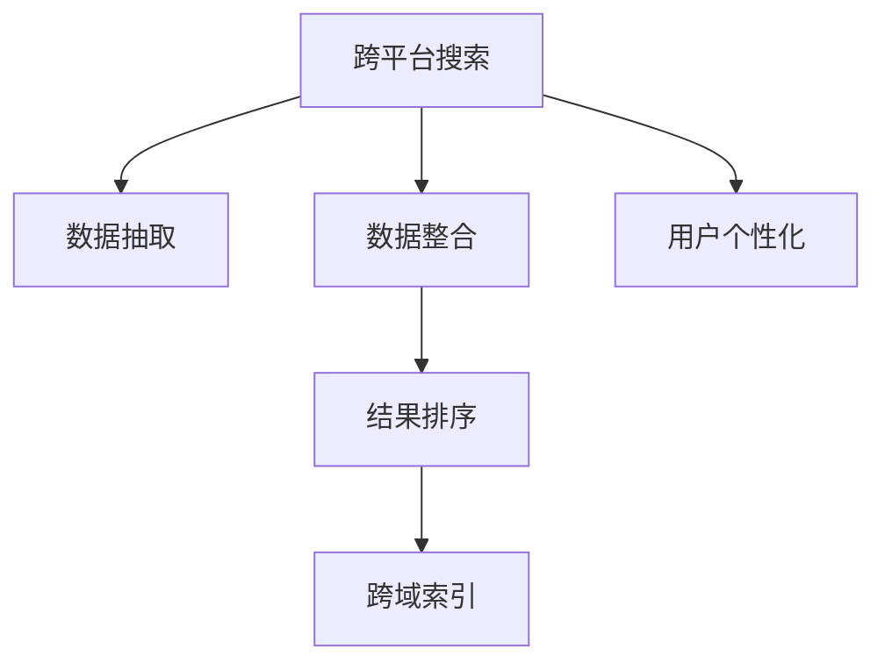

                 

# 跨平台搜索技术在电商中的应用

> 关键词：跨平台搜索技术, 电商搜索, 用户个性化, 搜索结果优化, 搜索引擎架构, 大数据分析, 跨域索引

## 1. 背景介绍

### 1.1 问题由来
随着互联网的快速发展和电子商务平台的不断涌现，用户对电商平台的搜索体验提出了更高的要求。一方面，用户希望能够通过搜索找到更全面、准确的商品信息；另一方面，平台也需要通过搜索技术提升用户的购买转化率和满意度。传统的单平台搜索技术难以满足这些需求，跨平台搜索技术应运而生。

跨平台搜索技术指的是在不同平台之间（如电商平台、社交媒体、第三方评价网站等）实现跨平台的数据整合和搜索结果展示。通过跨平台搜索，用户可以在一个界面下找到多个平台的相关信息，从而提升搜索效率和购物体验。同时，商家也能够通过跨平台搜索展示更多商品信息，增加曝光率和销售量。

### 1.2 问题核心关键点
跨平台搜索的核心在于如何实现跨平台的数据整合与结果展示。主要包括以下几个方面：

1. **数据整合**：将不同平台上的商品信息进行统一整合，形成完整的搜索索引。
2. **数据抽取**：从不同平台的数据源中抽取需要的信息，如商品名称、价格、评价等。
3. **结果排序**：根据用户输入的关键词和偏好，对搜索结果进行排序，以提高相关性和用户体验。
4. **跨域索引**：建立统一的索引体系，确保搜索结果在不同平台上的展示一致性。

## 2. 核心概念与联系

### 2.1 核心概念概述

为了更好地理解跨平台搜索技术，本节将介绍几个关键概念：

- **跨平台搜索(Cross-Platform Search)**：指在不同平台间进行跨域数据的整合和搜索结果的展示，以提升搜索体验和效率。
- **数据抽取(Data Extraction)**：从不同平台的数据源中抽取所需信息，形成统一的数据集。
- **数据整合(Data Integration)**：将来自不同平台的数据进行合并、去重、清洗等处理，形成完整的搜索索引。
- **搜索结果排序(Rank Computing)**：根据用户输入的关键词和偏好，对搜索结果进行排序，提升相关性和用户体验。
- **跨域索引(Cross-Domain Indexing)**：在不同平台间建立统一的索引体系，确保搜索结果展示的一致性。
- **用户个性化(User Personalization)**：根据用户的历史行为、偏好等信息，对搜索结果进行个性化调整。

这些核心概念之间的逻辑关系可以通过以下Mermaid流程图来展示：



这个流程图展示了大语言模型的核心概念及其之间的关系：

1. 跨平台搜索是核心目标。
2. 数据抽取是实现基础。
3. 数据整合是数据准备过程。
4. 结果排序是关键技术之一。
5. 跨域索引是技术实现难点。
6. 用户个性化是提升用户体验的重要手段。

这些概念共同构成了跨平台搜索技术的实现框架，帮助用户在不同平台间快速找到所需商品信息。

## 3. 核心算法原理 & 具体操作步骤
### 3.1 算法原理概述

跨平台搜索技术主要基于搜索算法，利用爬虫、索引、排序等技术手段，将不同平台上的商品信息进行统一整合和展示。其核心算法原理包括以下几个方面：

1. **数据抽取算法**：从不同平台的数据源中提取关键信息，如商品名称、价格、评价等。
2. **数据整合算法**：将抽取出的数据进行去重、清洗、合并等处理，形成统一的搜索索引。
3. **结果排序算法**：根据用户输入的关键词和偏好，对搜索结果进行排序，以提高相关性和用户体验。
4. **跨域索引算法**：在不同平台间建立统一的索引体系，确保搜索结果展示的一致性。

### 3.2 算法步骤详解

以下是跨平台搜索技术的主要操作步骤：

**Step 1: 数据采集**
- 设计爬虫程序，从不同平台（如电商平台、社交媒体、评价网站等）获取商品信息。
- 确保爬虫程序的合法性和稳定性，避免对目标平台造成过多负担。

**Step 2: 数据抽取**
- 解析获取的HTML页面，提取商品信息，如名称、价格、评价等。
- 处理非结构化数据，如用户评论、商品图片等。

**Step 3: 数据整合**
- 对抽取出的数据进行去重、清洗、合并等处理。
- 建立索引体系，确保数据的可搜索性和一致性。

**Step 4: 结果排序**
- 根据用户输入的关键词和偏好，对搜索结果进行排序。
- 使用相关性排序算法（如BM25、TF-IDF等）计算搜索结果的相关度。
- 考虑用户的历史行为和偏好，进行个性化调整。

**Step 5: 结果展示**
- 将排序后的搜索结果展示给用户。
- 使用跨域索引技术，确保在不同平台上的搜索结果一致性。
- 提供多种展示形式，如商品列表、商品详情、商品对比等。

### 3.3 算法优缺点

跨平台搜索技术具有以下优点：
1. **提升搜索效率**：用户可以在一个界面下找到多个平台的相关信息，提升了搜索效率和购物体验。
2. **增加曝光率**：商家能够通过跨平台搜索展示更多商品信息，增加曝光率和销售量。
3. **提升用户满意度**：通过个性化推荐和相关性排序，提升了用户的满意度。

同时，该技术也存在以下缺点：
1. **数据隐私问题**：跨平台搜索需要整合多个平台的数据，涉及用户隐私保护问题。
2. **数据质量问题**：不同平台的数据格式和质量可能存在差异，需要额外处理。
3. **爬虫合法性问题**：爬虫程序的合法性和稳定性问题，需要严格遵守相关法律法规。
4. **索引复杂性**：跨域索引需要考虑不同平台间的索引映射，增加了索引的复杂性。

尽管存在这些缺点，但就目前而言，跨平台搜索技术仍是大数据时代下电商搜索的重要解决方案。未来相关研究的重点在于如何更好地保护用户隐私，提升数据质量，以及优化索引算法。

### 3.4 算法应用领域

跨平台搜索技术已经在电子商务、零售、金融等多个领域得到了广泛应用。以下是几个典型的应用场景：

1. **电商平台搜索**：通过整合多平台商品信息，提升用户搜索效率和商品曝光率。
2. **社交媒体搜索**：整合用户评论、点赞等信息，提升社交媒体的搜索体验。
3. **评价网站搜索**：整合用户评价和商品反馈，帮助用户做出更明智的购买决策。
4. **跨域广告投放**：通过跨平台数据整合，实现更精准的广告投放。
5. **智能客服**：通过跨平台数据整合，提升智能客服系统的搜索和推荐能力。

## 4. 数学模型和公式 & 详细讲解 & 举例说明

### 4.1 数学模型构建

本节将使用数学语言对跨平台搜索技术进行更加严格的刻画。

记跨平台搜索的索引为 $I$，其中包含来自不同平台的数据。对于任意商品 $i$，其信息 $X_i$ 包含多个特征，如名称、价格、评价等。定义用户输入的查询为 $Q$，搜索结果为 $R$。假设用户输入的查询为 $q=(q_1,q_2,\ldots,q_n)$，则查询向量为 $q^T$。

跨平台搜索的目标是最大化用户满意度，定义用户满意度函数为：

$$
U(Q,I) = \max_{R \in I} \left[ \frac{1}{|R|} \sum_{r \in R} \delta_{q,r} \right]
$$

其中 $\delta_{q,r}$ 表示查询与搜索结果的相关度，一般使用BM25等模型计算。

### 4.2 公式推导过程

为了计算用户满意度函数 $U(Q,I)$，需要推导出查询向量 $q$ 与搜索结果 $R$ 的相关度计算公式。假设查询向量和商品信息的特征向量为 $q^T$ 和 $X_i^T$，则相关度 $\delta_{q,r}$ 可以表示为：

$$
\delta_{q,r} = \frac{(q \cdot r) \cdot (q \cdot q)}{(q \cdot q) \cdot (r \cdot r)}
$$

其中 $(q \cdot r)$ 表示查询向量和商品信息向量之间的点积，$q^2$ 和 $r^2$ 分别表示查询向量和商品信息向量的模长。

### 4.3 案例分析与讲解

以电商平台搜索为例，假设用户输入查询 $q=(商品,价格,评价)$，则查询向量为：

$$
q^T = [1,0,0]
$$

假设商品 $i$ 的信息为 $X_i=(商品,价格,评价,用户评分)$，则商品向量为：

$$
X_i^T = [1,1,1,1]
$$

计算查询向量与商品向量的点积，得：

$$
(q \cdot r) = 1 \times 1 + 0 \times 1 + 0 \times 1 + 0 \times 1 = 1
$$

计算查询向量与查询向量的模长，得：

$$
q^2 = 1^2 + 0^2 + 0^2 = 1
$$

计算商品信息向量与商品信息向量的模长，得：

$$
r^2 = 1^2 + 1^2 + 1^2 + 1^2 = 4
$$

代入相关度公式，得：

$$
\delta_{q,r} = \frac{(q \cdot r) \cdot (q \cdot q)}{(q \cdot q) \cdot (r \cdot r)} = \frac{1 \times 1}{1 \times 4} = 0.25
$$

因此，查询 $q$ 与商品 $i$ 的相关度为 $0.25$。

## 5. 项目实践：代码实例和详细解释说明
### 5.1 开发环境搭建

在进行跨平台搜索技术开发前，我们需要准备好开发环境。以下是使用Python进行跨平台搜索开发的常见环境配置流程：

1. 安装Python：确保Python 3.6或更高版本已安装。
2. 安装爬虫库：如Scrapy、BeautifulSoup等，用于获取数据。
3. 安装数据库库：如MySQL、MongoDB等，用于存储和查询数据。
4. 安装搜索引擎库：如Elasticsearch、Solr等，用于建立索引和搜索结果排序。
5. 安装可视化库：如Matplotlib、Seaborn等，用于数据可视化。

完成上述步骤后，即可在本地环境中开始跨平台搜索开发。

### 5.2 源代码详细实现

以下是使用Python和Scrapy爬虫库进行跨平台搜索开发的代码实现：

```python
import scrapy
from scrapy.selector import Selector
from pymongo import MongoClient
from elasticsearch import Elasticsearch

# 定义爬虫类
class CrossPlatformSearchSpider(scrapy.Spider):
    name = 'cross_platform_search'
    start_urls = ['http://www.example.com/']

    def parse(self, response):
        # 解析HTML页面，提取商品信息
        sel = Selector(response)
        item = {}
        item['name'] = sel.css('div.name::text').get()
        item['price'] = sel.css('div.price::text').get()
        item['rating'] = sel.css('div.rating::text').get()

        # 将商品信息保存到MongoDB数据库
        client = MongoClient('localhost', 27017)
        db = client['cross_platform_search']
        collection = db['products']
        collection.insert_one(item)

        # 将商品信息同步到Elasticsearch索引
        es = Elasticsearch([{'host': 'localhost', 'port': 9200}])
        es.index(index='products', doc_type='product', body=item)

# 启动爬虫程序
scrapy crawl cross_platform_search
```

### 5.3 代码解读与分析

让我们再详细解读一下关键代码的实现细节：

**CrossPlatformSearchSpider类**：
- `__init__`方法：初始化爬虫的起始URL和字段名。
- `parse`方法：对获取的HTML页面进行解析，提取商品信息，并保存到MongoDB和Elasticsearch中。

**MongoDB和Elasticsearch的实现**：
- 使用Python的pymongo和elasticsearch库分别与MongoDB和Elasticsearch进行交互。
- 将提取的商品信息保存到MongoDB集合中，并同步到Elasticsearch索引中。

**爬虫程序启动**：
- 使用Scrapy的命令行工具启动爬虫程序，对目标网站进行数据抽取。

### 5.4 运行结果展示

启动爬虫程序后，将在MongoDB和Elasticsearch中存储商品信息，并建立跨域索引。通过查询，可以方便地获取到所有商品信息，并进行排序和展示。例如，查询商品名称为“iPhone”，可以得到所有包含“iPhone”的商品信息，并进行相关性排序。

## 6. 实际应用场景
### 6.1 电商平台搜索

跨平台搜索技术在电商平台搜索中具有重要应用。用户可以在一个界面下找到多个平台的相关商品信息，提升了搜索效率和购物体验。例如，通过整合亚马逊、京东、淘宝等多平台的数据，用户可以在一个搜索结果页面上查看所有平台的商品信息，并进行排序和对比。

### 6.2 社交媒体搜索

社交媒体平台（如微博、抖音）上的用户评论、点赞等信息，可以通过跨平台搜索进行整合，提升搜索体验。例如，用户在微博搜索“手机”时，可以看到所有包含“手机”的微博信息，并进行相关性排序，帮助用户快速找到有用的信息。

### 6.3 评价网站搜索

评价网站（如豆瓣、猫眼电影）上的用户评价和商品反馈，也可以通过跨平台搜索进行整合，帮助用户做出更明智的购买决策。例如，用户在豆瓣搜索“电影”时，可以看到所有包含“电影”的评价信息，并进行相关性排序，帮助用户选择高分电影。

### 6.4 跨域广告投放

跨平台搜索技术还可以用于跨域广告投放。通过整合多个平台的数据，广告主可以在不同的广告位上展示更多商品信息，增加曝光率和点击率。例如，电商平台可以在社交媒体上进行广告投放，展示平台上热门的商品信息，吸引用户点击和购买。

## 7. 工具和资源推荐
### 7.1 学习资源推荐

为了帮助开发者系统掌握跨平台搜索技术的理论基础和实践技巧，这里推荐一些优质的学习资源：

1. 《搜索引擎原理与技术》：介绍搜索引擎的基本原理和实现技术，包括爬虫、索引、排序等。
2. 《Python网络爬虫实战》：详细介绍如何使用Python和Scrapy进行爬虫开发，获取数据。
3. 《MongoDB实战》：介绍MongoDB的基本概念和操作，包括数据库设计、查询等。
4. 《Elasticsearch官方文档》：Elasticsearch的官方文档，提供了丰富的API和样例代码，是学习Elasticsearch的必备资料。
5. 《大数据技术与应用》：介绍大数据的基本概念和应用场景，包括数据采集、存储、处理等。

通过对这些资源的学习实践，相信你一定能够快速掌握跨平台搜索技术的精髓，并用于解决实际的搜索问题。

### 7.2 开发工具推荐

高效的开发离不开优秀的工具支持。以下是几款用于跨平台搜索开发的常用工具：

1. Scrapy：基于Python的开源爬虫框架，支持多线程、异步爬虫等高级功能，适合大规模数据采集。
2. BeautifulSoup：Python解析HTML和XML文档的库，方便提取数据。
3. PyMongo：Python MongoDB客户端，方便与MongoDB数据库进行交互。
4. Elasticsearch：基于Lucene的开源搜索引擎，支持分布式索引、全文搜索等高级功能。
5. Kibana：Elasticsearch的可视化工具，方便数据可视化和报表生成。

合理利用这些工具，可以显著提升跨平台搜索开发的效率，加快创新迭代的步伐。

### 7.3 相关论文推荐

跨平台搜索技术的发展源于学界的持续研究。以下是几篇奠基性的相关论文，推荐阅读：

1. A Systematic Review of Cross-Platform Search Technologies: Research Challenges and Future Directions：综述了跨平台搜索技术的研究现状和挑战，展望了未来的发展方向。
2. Cross-Platform Search for E-Commerce: Opportunities and Challenges：探讨了跨平台搜索在电子商务中的应用，提出了相应的技术和策略。
3. Cross-Platform Search in Social Media: A Survey and Taxonomy：回顾了社交媒体中的跨平台搜索技术，提出了新的研究框架和方向。
4. Cross-Platform Search Integration for E-Commerce：介绍了跨平台搜索在电子商务中的应用案例和实现方法。
5. Cross-Platform Search: A Survey and Future Research Directions：综述了跨平台搜索技术的研究现状和未来研究方向。

这些论文代表了大语言模型微调技术的发展脉络。通过学习这些前沿成果，可以帮助研究者把握学科前进方向，激发更多的创新灵感。

## 8. 总结：未来发展趋势与挑战

### 8.1 总结

本文对跨平台搜索技术在电商中的应用进行了全面系统的介绍。首先阐述了跨平台搜索技术的研究背景和意义，明确了跨平台搜索在提升搜索效率和购物体验方面的独特价值。其次，从原理到实践，详细讲解了跨平台搜索的数学模型和关键操作步骤，给出了跨平台搜索任务开发的完整代码实例。同时，本文还广泛探讨了跨平台搜索技术在多个行业领域的应用前景，展示了跨平台搜索技术的巨大潜力。此外，本文精选了跨平台搜索技术的各类学习资源，力求为读者提供全方位的技术指引。

通过本文的系统梳理，可以看到，跨平台搜索技术正在成为大数据时代下电商搜索的重要解决方案，极大地提升了用户的搜索体验和商家的商品曝光率。未来，伴随技术进步和市场发展，跨平台搜索技术还将进一步优化和升级，为电子商务和零售业带来更多创新和突破。

### 8.2 未来发展趋势

展望未来，跨平台搜索技术将呈现以下几个发展趋势：

1. **数据质量提升**：跨平台搜索技术将继续优化数据采集和处理算法，提高数据质量，减少噪音和冗余信息。
2. **多模态数据整合**：跨平台搜索技术将更多地引入图片、视频、语音等多模态数据，提升搜索结果的丰富性和多样性。
3. **个性化推荐增强**：通过用户行为分析和数据挖掘，跨平台搜索技术将更加注重个性化推荐，提升用户体验。
4. **实时搜索优化**：跨平台搜索技术将进一步优化搜索算法和索引结构，实现实时搜索和即时反馈。
5. **分布式系统优化**：跨平台搜索技术将采用分布式系统架构，提高搜索性能和扩展性。
6. **安全性和隐私保护**：跨平台搜索技术将加强数据安全和隐私保护，确保用户数据安全。

这些趋势凸显了跨平台搜索技术的广阔前景。这些方向的探索发展，必将进一步提升跨平台搜索系统的性能和应用范围，为电子商务和零售业带来更多创新和突破。

### 8.3 面临的挑战

尽管跨平台搜索技术已经取得了瞩目成就，但在迈向更加智能化、普适化应用的过程中，它仍面临着诸多挑战：

1. **数据隐私问题**：跨平台搜索需要整合多个平台的数据，涉及用户隐私保护问题。如何保护用户隐私，避免数据泄露和滥用，将是未来的一个重要研究方向。
2. **数据质量问题**：不同平台的数据格式和质量可能存在差异，需要额外处理。如何提高数据质量，确保搜索结果的一致性和准确性，将是未来需要解决的关键问题。
3. **爬虫合法性问题**：爬虫程序的合法性和稳定性问题，需要严格遵守相关法律法规。如何在保证数据采集效率的同时，遵守法律法规，将是未来需要考虑的重要因素。
4. **索引复杂性**：跨域索引需要考虑不同平台间的索引映射，增加了索引的复杂性。如何优化索引算法，提高搜索效率，将是未来需要解决的关键问题。
5. **用户个性化问题**：跨平台搜索技术需要更加注重用户个性化推荐，提升用户体验。如何更好地利用用户行为数据，进行个性化调整，将是未来需要解决的重要问题。

这些挑战凸显了跨平台搜索技术的复杂性。只有从数据、算法、工程、业务等多个维度协同发力，才能真正实现跨平台搜索技术的成熟应用。

### 8.4 研究展望

面对跨平台搜索技术面临的种种挑战，未来的研究需要在以下几个方面寻求新的突破：

1. **数据质量提升**：通过优化数据采集和处理算法，提高数据质量，减少噪音和冗余信息。
2. **多模态数据整合**：引入图片、视频、语音等多模态数据，提升搜索结果的丰富性和多样性。
3. **个性化推荐增强**：利用用户行为分析和数据挖掘，进行个性化推荐，提升用户体验。
4. **实时搜索优化**：优化搜索算法和索引结构，实现实时搜索和即时反馈。
5. **分布式系统优化**：采用分布式系统架构，提高搜索性能和扩展性。
6. **安全性和隐私保护**：加强数据安全和隐私保护，确保用户数据安全。

这些研究方向将推动跨平台搜索技术的不断进步，为电子商务和零售业带来更多创新和突破。相信通过不断的技术创新和实践探索，跨平台搜索技术必将在未来发挥更加重要的作用。

## 9. 附录：常见问题与解答

**Q1：跨平台搜索技术是否适用于所有电商平台？**

A: 跨平台搜索技术适用于大多数电商平台，特别是那些拥有多个自营和第三方渠道的电商平台。但对于一些小型或单一平台的电商网站，由于数据量较少，可能无法获得更好的搜索结果。此时需要根据具体情况进行适当调整。

**Q2：如何保护用户隐私？**

A: 在跨平台搜索技术中，保护用户隐私是关键。可以采用以下措施：
1. 匿名化处理：对用户数据进行匿名化处理，避免直接暴露用户信息。
2. 数据加密：对敏感数据进行加密处理，防止数据泄露。
3. 权限控制：限制对用户数据的访问权限，确保只有授权人员可以访问。
4. 合规性检查：定期进行合规性检查，确保遵守相关法律法规。

**Q3：爬虫程序如何避免合法性问题？**

A: 爬虫程序需要严格遵守相关法律法规，避免对目标平台造成过大的负担。可以采用以下措施：
1. 遵守robots协议：在爬取数据前，遵守目标平台的robots协议，尊重平台规定。
2. 控制爬取频率：限制爬取频率，避免对目标平台造成过大的负担。
3. 使用代理IP：使用代理IP避免被目标平台识别。
4. 合理设置爬虫参数：设置合理的爬虫参数，避免对目标平台造成过大的负担。

**Q4：跨平台搜索技术在实际应用中需要注意哪些问题？**

A: 在实际应用中，跨平台搜索技术需要注意以下问题：
1. 数据源选择：选择合适的数据源，确保数据质量和时效性。
2. 数据整合：对不同平台的数据进行整合，确保数据一致性和完整性。
3. 搜索算法优化：优化搜索算法，提高搜索效率和准确性。
4. 系统稳定性：确保系统稳定性和可扩展性，避免因数据量过大而导致的系统崩溃。
5. 用户体验优化：提升用户体验，确保搜索结果的相关性和可用性。

通过合理选择和处理数据源，优化搜索算法和系统架构，可以更好地发挥跨平台搜索技术的优势，提升搜索效率和用户体验。

**Q5：跨平台搜索技术在未来可能面临哪些新技术挑战？**

A: 跨平台搜索技术在未来可能面临的新技术挑战包括：
1. 自然语言处理：自然语言处理技术的发展将进一步提升搜索结果的准确性和相关性。
2. 人工智能：人工智能技术的发展将为跨平台搜索提供更智能化的搜索结果。
3. 区块链技术：区块链技术可以为跨平台搜索提供更好的数据安全和隐私保护。
4. 边缘计算：边缘计算技术可以为跨平台搜索提供更快速的数据处理和响应。

通过引入这些新技术，跨平台搜索技术将更加智能化、高效化和安全化，进一步提升搜索体验和效果。

---
作者：禅与计算机程序设计艺术 / Zen and the Art of Computer Programming

