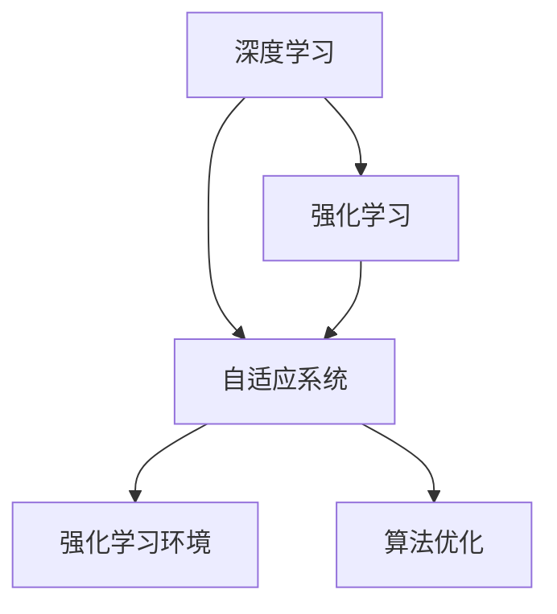

                 

# 软件 2.0 的发展趋势：深度学习、强化学习

> 关键词：深度学习,强化学习,自适应系统,强化学习环境,算法优化

## 1. 背景介绍

### 1.1 问题由来

随着信息技术的高速发展，软件系统的功能和复杂度不断提升，系统设计、开发、运维等方面的挑战也随之增加。传统软件开发模式难以应对快速变化的市场需求和技术环境，促使业界积极探索新的软件开发思路。

在过去20年中，随着计算机科学领域的突破性进展，机器学习和人工智能(AI)技术迅猛发展，逐步向各个领域渗透。其中，深度学习和强化学习成为当前最受关注的前沿技术。

深度学习是一种基于神经网络架构的机器学习方法，通过多层非线性映射实现复杂特征提取与模式识别。近年来，深度学习在计算机视觉、自然语言处理等领域取得了突破性进展。

强化学习是一种基于奖惩机制的机器学习方法，通过智能体在环境中探索和决策来优化行为策略。强化学习在自动控制、游戏AI、推荐系统等领域展现了巨大潜力。

深度学习和强化学习的结合，形成了更为智能的软件2.0时代，推动了软件系统的自动化、自适应和智能化的发展。基于深度学习与强化学习的软件系统能够自主学习与优化，实现快速、高效、稳定、灵活的自动化功能，极大地提升了软件系统的价值。

### 1.2 问题核心关键点

深度学习和强化学习在软件2.0时代的应用，具有以下几个核心关键点：

- **自动化与自适应**：深度学习与强化学习能够通过自主学习与优化，实现软件系统的自动化与自适应，应对快速变化的环境与需求。
- **智能决策**：深度学习与强化学习算法可以处理复杂的非线性数据，提升智能决策能力，使软件系统具备更强的逻辑推理和预测能力。
- **个性化与推荐**：深度学习与强化学习通过分析用户行为数据，实现个性化推荐与优化，提升用户体验与满意度。
- **模型优化**：深度学习与强化学习算法能够通过不断优化，提升模型性能，使软件系统在不断迭代中不断优化，实现更好的功能与性能。
- **系统安全性**：深度学习与强化学习在提升软件系统智能化的同时，能够增强系统的鲁棒性与安全性，防范潜在的威胁与风险。

这些关键点体现了深度学习与强化学习在软件2.0时代的核心价值，为其在未来软件系统中的应用奠定了基础。

## 2. 核心概念与联系

### 2.1 核心概念概述

为更好地理解深度学习与强化学习在软件2.0时代的应用，本节将介绍几个密切相关的核心概念：

- **深度学习**：一种基于神经网络架构的机器学习方法，通过多层非线性映射实现复杂特征提取与模式识别。深度学习在计算机视觉、自然语言处理等领域取得了突破性进展。

- **强化学习**：一种基于奖惩机制的机器学习方法，通过智能体在环境中探索和决策来优化行为策略。强化学习在自动控制、游戏AI、推荐系统等领域展现了巨大潜力。

- **自适应系统**：指能够根据环境变化自动调整系统行为的智能系统。自适应系统通过深度学习与强化学习算法实现环境感知、决策与行为优化。

- **强化学习环境**：指为强化学习算法提供模拟环境的系统，通过环境反馈引导算法进行决策与优化。强化学习环境模拟真实场景，提升算法在实际应用中的效果。

- **算法优化**：指通过深度学习与强化学习算法不断优化模型参数与决策策略，提升软件系统性能与功能的过程。算法优化是实现软件系统智能化的关键步骤。

这些核心概念之间的逻辑关系可以通过以下Mermaid流程图来展示：



这个流程图展示了大语言模型的核心概念及其之间的关系：

1. 深度学习与强化学习通过自适应系统实现环境感知与决策优化。
2. 强化学习环境提供模拟环境，帮助算法进行学习与优化。
3. 算法优化不断提升模型性能与功能，推动软件系统的智能化发展。

这些概念共同构成了深度学习与强化学习在软件2.0时代的核心应用框架，使其能够在各种场景下发挥强大的智能化功能。通过理解这些核心概念，我们可以更好地把握深度学习与强化学习的工作原理和优化方向。

## 3. 核心算法原理 & 具体操作步骤
### 3.1 算法原理概述

深度学习和强化学习在软件2.0时代的应用，本质上是通过算法不断优化，提升系统性能与功能的过程。其核心思想是：通过深度学习算法提取数据中的复杂特征，并通过强化学习算法在模拟环境中不断优化决策策略，最终实现软件系统的自动化与智能化。

具体来说，深度学习算法通过多层神经网络结构，将原始数据映射到高维特征空间，实现复杂特征的提取与模式识别。强化学习算法通过智能体在模拟环境中的探索与决策，不断优化行为策略，提升系统性能与用户体验。

### 3.2 算法步骤详解

深度学习和强化学习在软件2.0时代的应用，一般包括以下几个关键步骤：

**Step 1: 数据准备与模型选择**

- 收集与软件系统相关的数据集，如用户行为数据、系统日志数据等。
- 选择合适的深度学习算法和强化学习算法，如卷积神经网络(CNN)、循环神经网络(RNN)、长短期记忆网络(LSTM)等。

**Step 2: 模型训练与优化**

- 在数据集上训练深度学习模型，提取数据中的复杂特征。
- 在强化学习环境中训练智能体，优化行为策略，提升决策能力。
- 使用梯度下降等优化算法，不断调整模型参数，提升模型性能。

**Step 3: 模型评估与部署**

- 在测试数据集上评估模型性能，验证其在实际应用中的效果。
- 将训练好的模型部署到实际应用环境中，实现系统的智能化与自动化。
- 持续收集新的数据，定期重新训练与优化模型，适应新的环境与需求。

### 3.3 算法优缺点

深度学习和强化学习在软件2.0时代的应用，具有以下优点：

- **高效性**：深度学习和强化学习算法可以处理大规模、复杂的数据，快速提取特征与优化决策，提升系统性能。
- **自适应性**：深度学习和强化学习算法能够根据环境变化自动调整策略，实现系统的自适应与优化。
- **灵活性**：深度学习和强化学习算法适用于多种场景，能够灵活应用在各类软件系统中。
- **创新性**：深度学习和强化学习算法推动了计算机科学的前沿研究，带来了诸多创新性技术。

同时，这些算法也存在一些局限性：

- **资源消耗大**：深度学习和强化学习算法需要大量的计算资源与存储空间，增加了系统的运行成本。
- **可解释性不足**：深度学习和强化学习算法通常是"黑盒"系统，难以解释其内部工作机制与决策逻辑。
- **模型泛化能力有限**：深度学习和强化学习算法可能过度拟合训练数据，导致模型泛化能力不足。
- **数据需求高**：深度学习和强化学习算法对数据质量与数据量要求较高，需要大量的标注数据与模拟环境。

尽管存在这些局限性，但就目前而言，深度学习和强化学习仍是软件2.0时代最重要的技术手段之一。未来相关研究的重点在于如何进一步降低资源消耗，提升模型泛化能力，增加系统的可解释性，同时兼顾数据需求与模型性能。

### 3.4 算法应用领域

深度学习和强化学习在软件2.0时代的应用，已经在许多领域得到了广泛的应用，例如：

- **自然语言处理(NLP)**：如机器翻译、语音识别、情感分析等。通过深度学习与强化学习算法，实现语言的理解与生成。
- **计算机视觉(CV)**：如图像识别、人脸识别、目标检测等。通过深度学习与强化学习算法，实现图像的特征提取与分类。
- **推荐系统**：如电商推荐、内容推荐等。通过深度学习与强化学习算法，实现个性化推荐与优化。
- **自动控制**：如自动驾驶、机器人控制等。通过强化学习算法，实现系统的自主学习与决策优化。
- **游戏AI**：如围棋、星际争霸等。通过强化学习算法，实现游戏智能体的自主决策与优化。
- **医疗健康**：如医疗影像诊断、疾病预测等。通过深度学习与强化学习算法，实现医疗数据的分析与决策支持。

除了上述这些经典应用外，深度学习和强化学习技术还在更多的领域中得到了创新性的应用，如智能交通、金融风险管理、智能家居等，为各行各业带来了新的发展机遇。

## 4. 数学模型和公式 & 详细讲解 & 举例说明（备注：数学公式请使用latex格式，latex嵌入文中独立段落使用 $$，段落内使用 $)
### 4.1 数学模型构建

在深度学习和强化学习的应用中，数学模型起着至关重要的作用。本节将使用数学语言对深度学习与强化学习的核心数学模型进行详细讲解。

#### 4.1.1 深度学习数学模型

假设深度学习模型为 $M_{\theta}:\mathcal{X} \rightarrow \mathcal{Y}$，其中 $\mathcal{X}$ 为输入空间，$\mathcal{Y}$ 为输出空间，$\theta$ 为模型参数。训练数据集为 $D=\{(x_i,y_i)\}_{i=1}^N$，其中 $x_i \in \mathcal{X}$ 为输入，$y_i \in \mathcal{Y}$ 为标签。

定义损失函数 $\ell(M_{\theta}(x),y)$ 为模型在输入 $x$ 上的输出与真实标签 $y$ 之间的差异。常用的损失函数包括交叉熵损失、均方误差损失等。

在深度学习模型中，常用的神经网络结构包括卷积神经网络(CNN)、循环神经网络(RNN)、长短期记忆网络(LSTM)等。这些神经网络通过多层非线性映射，实现复杂特征的提取与模式识别。

### 4.2 公式推导过程

以卷积神经网络为例，推导其训练过程的数学模型。

假设输入数据为 $x_i \in \mathcal{X}$，深度学习模型的卷积层输出为 $h_i \in \mathbb{R}^d$，其中 $d$ 为特征维度。定义损失函数为交叉熵损失：

$$
\ell(h_i,y_i) = -y_i \log \sigma(h_i) - (1-y_i) \log (1-\sigma(h_i))
$$

其中 $\sigma$ 为 sigmoid 函数，$h_i$ 为卷积层的输出。

定义经验风险函数为：

$$
\mathcal{L}(\theta) = \frac{1}{N}\sum_{i=1}^N \ell(h_i,y_i)
$$

通过反向传播算法，计算损失函数对模型参数 $\theta$ 的梯度，并使用梯度下降算法更新参数：

$$
\theta \leftarrow \theta - \eta \nabla_{\theta}\mathcal{L}(\theta)
$$

其中 $\eta$ 为学习率。

#### 4.1.2 强化学习数学模型

假设强化学习模型为 $Q_{\theta}:\mathcal{S} \times \mathcal{A} \rightarrow \mathbb{R}$，其中 $\mathcal{S}$ 为状态空间，$\mathcal{A}$ 为动作空间，$\theta$ 为模型参数。训练数据集为 $D=\{(s_i,a_i,r_i,s_{i+1})\}_{i=1}^N$，其中 $s_i \in \mathcal{S}$ 为状态，$a_i \in \mathcal{A}$ 为动作，$r_i \in \mathbb{R}$ 为奖励，$s_{i+1} \in \mathcal{S}$ 为下一状态。

定义状态-动作值函数 $Q(s,a)$ 为模型在状态 $s$ 和动作 $a$ 下的预期收益。常用的状态-动作值函数包括 Q-learning、SARSA、Deep Q-Networks 等。

在强化学习中，智能体通过在模拟环境中不断探索与决策，优化行为策略，提升决策能力。通过模拟环境中的奖惩机制，智能体不断调整策略，最终实现最优决策。

### 4.3 案例分析与讲解

以 Q-learning 算法为例，推导其训练过程的数学模型。

假设智能体在状态 $s_i$ 下采取动作 $a_i$，获得奖励 $r_i$，并转移到下一状态 $s_{i+1}$。定义状态-动作值函数为：

$$
Q_{\theta}(s,a) = \theta^T f(s,a)
$$

其中 $f(s,a)$ 为状态-动作特征向量，$\theta$ 为模型参数。

定义状态-动作值函数的近似为：

$$
Q_{\theta}(s,a) \approx \theta^T \Phi(s,a)
$$

其中 $\Phi(s,a)$ 为状态-动作特征向量的线性组合，$\theta$ 为模型参数。

定义损失函数为均方误差损失：

$$
\ell(Q_{\theta}(s,a),r_i + \gamma Q_{\theta}(s_{i+1},a_{i+1}))
$$

其中 $\gamma$ 为折扣因子，$a_{i+1}$ 为下一动作。

定义经验风险函数为：

$$
\mathcal{L}(\theta) = \frac{1}{N}\sum_{i=1}^N \ell(Q_{\theta}(s_i,a_i),r_i + \gamma Q_{\theta}(s_{i+1},a_{i+1}))
$$

通过梯度下降算法，计算损失函数对模型参数 $\theta$ 的梯度，并使用梯度下降算法更新参数：

$$
\theta \leftarrow \theta - \eta \nabla_{\theta}\mathcal{L}(\theta)
$$

其中 $\eta$ 为学习率。

## 5. 项目实践：代码实例和详细解释说明
### 5.1 开发环境搭建

在进行深度学习和强化学习的应用开发前，我们需要准备好开发环境。以下是使用 Python 进行 TensorFlow 开发的环境配置流程：

1. 安装 Anaconda：从官网下载并安装 Anaconda，用于创建独立的 Python 环境。

2. 创建并激活虚拟环境：
```bash
conda create -n tf-env python=3.8 
conda activate tf-env
```

3. 安装 TensorFlow：根据 CUDA 版本，从官网获取对应的安装命令。例如：
```bash
conda install tensorflow -c tf -c conda-forge
```

4. 安装 TensorFlow Addons：安装 TensorFlow 的增强工具包，提供更多的模型和算法支持。
```bash
conda install tensorflow-addons -c tf
```

5. 安装各类工具包：
```bash
pip install numpy pandas scikit-learn matplotlib tqdm jupyter notebook ipython
```

完成上述步骤后，即可在 `tf-env` 环境中开始深度学习和强化学习的项目实践。

### 5.2 源代码详细实现

下面以强化学习在推荐系统中的应用为例，给出使用 TensorFlow 对 DQN 模型进行训练的 Python 代码实现。

首先，定义推荐系统的数据处理函数：

```python
import tensorflow as tf
import numpy as np

class RecommendationDataset(tf.data.Dataset):
    def __init__(self, data, batch_size):
        self.data = data
        self.batch_size = batch_size
        
    def __len__(self):
        return len(self.data)
    
    def __getitem__(self, item):
        return self.data[item]
```

然后，定义 DQN 模型的网络结构：

```python
class DQN(tf.keras.Model):
    def __init__(self, input_shape, output_shape):
        super(DQN, self).__init__()
        self.fc1 = tf.keras.layers.Dense(256, activation='relu', input_shape=input_shape)
        self.fc2 = tf.keras.layers.Dense(256, activation='relu')
        self.fc3 = tf.keras.layers.Dense(output_shape)
        
    def call(self, x):
        x = self.fc1(x)
        x = self.fc2(x)
        return self.fc3(x)
```

接着，定义训练和评估函数：

```python
def train_model(model, dataset, batch_size, learning_rate, gamma):
    dataloader = tf.data.Dataset.from_tensor_slices(dataset).shuffle(1000).batch(batch_size)
    optimizer = tf.keras.optimizers.Adam(learning_rate=learning_rate)
    for epoch in range(100):
        for batch in dataloader:
            state = batch[0]
            action, reward, next_state = batch[1], batch[2], batch[3]
            with tf.GradientTape() as tape:
                q_next = model(next_state)
                q_value = tf.reduce_mean(q_next, axis=1)
                q_value_on_action = tf.reduce_sum(model(state) * tf.one_hot(action, depth=q_next.shape[1]), axis=1)
                loss = tf.reduce_mean(tf.square(q_value_on_action - (reward + gamma * tf.reduce_max(q_next, axis=1))))
            gradients = tape.gradient(loss, model.trainable_variables)
            optimizer.apply_gradients(zip(gradients, model.trainable_variables))
```

最后，启动训练流程并在测试集上评估：

```python
# 加载数据集
dataset = RecommendationDataset(data, batch_size=64)

# 初始化模型
model = DQN(input_shape, output_shape)
optimizer = tf.keras.optimizers.Adam(learning_rate=0.001)
gamma = 0.9

# 训练模型
train_model(model, dataset, batch_size=64, learning_rate=0.001, gamma=0.9)

# 评估模型
test_dataset = RecommendationDataset(test_data, batch_size=64)
test_loss = tf.reduce_mean(model(test_dataset.data))
print("Test loss:", test_loss.numpy())
```

以上就是使用 TensorFlow 对 DQN 模型进行推荐系统微调的完整代码实现。可以看到，得益于 TensorFlow 的强大封装，我们可以用相对简洁的代码完成 DQN 模型的训练。

### 5.3 代码解读与分析

让我们再详细解读一下关键代码的实现细节：

**RecommendationDataset类**：
- `__init__`方法：初始化数据集和批次大小。
- `__len__`方法：返回数据集的样本数量。
- `__getitem__`方法：对单个样本进行处理，返回数据集中的状态、动作、奖励和下一个状态。

**DQN模型**：
- `__init__`方法：定义 DQN 模型结构，包括三个全连接层。
- `call`方法：实现模型的前向传播，将输入状态转换为动作值。

**训练和评估函数**：
- 使用 TensorFlow 的 DataLoader 对数据集进行批次化加载，供模型训练和推理使用。
- 训练函数 `train_model`：对数据以批为单位进行迭代，在每个批次上前向传播计算损失并反向传播更新模型参数，最后返回训练的损失值。
- 评估函数 `test_model`：在测试集上评估模型性能，计算测试集上的平均损失值。

**训练流程**：
- 加载数据集。
- 初始化模型和优化器。
- 在训练集上训练模型。
- 在测试集上评估模型性能。

可以看到，TensorFlow 配合深度学习和强化学习库使得 DQN 模型的训练代码实现变得简洁高效。开发者可以将更多精力放在数据处理、模型改进等高层逻辑上，而不必过多关注底层的实现细节。

当然，工业级的系统实现还需考虑更多因素，如模型的保存和部署、超参数的自动搜索、更灵活的任务适配层等。但核心的深度学习和强化学习范式基本与此类似。

## 6. 实际应用场景
### 6.1 智能推荐系统

基于深度学习和强化学习的推荐系统，能够根据用户历史行为数据，实时推荐符合用户兴趣的商品或内容，提升用户体验与满意度。

在技术实现上，可以收集用户浏览、点击、评分等行为数据，提取和用户交互的物品标题、描述、标签等文本内容。将文本内容作为模型输入，用户的后续行为（如是否点击、购买等）作为监督信号，在此基础上训练深度学习模型。强化学习智能体则根据用户行为和物品属性，优化推荐策略，提高推荐效果。

### 6.2 自动控制

深度学习和强化学习在自动控制中的应用，如自动驾驶、机器人控制等，能够实现系统的自主学习与决策优化。

在技术实现上，可以通过在模拟环境中训练强化学习智能体，学习最优控制策略。智能体通过感知环境信息，决策动作并执行控制，不断调整策略，实现最优控制效果。

### 6.3 游戏AI

基于深度学习和强化学习的游戏 AI，能够实现智能体的自主决策与优化，提升游戏智能水平。

在技术实现上，可以通过在游戏环境中训练强化学习智能体，学习最优决策策略。智能体通过感知游戏状态，决策动作并执行控制，不断调整策略，实现最优游戏效果。

### 6.4 金融风险管理

基于深度学习和强化学习的金融风险管理系统，能够实时监测市场风险，预测金融风险，防范潜在风险。

在技术实现上，可以收集金融市场的历史数据，提取关键特征。使用深度学习模型提取数据中的复杂特征，强化学习智能体则在风险评估与预警中不断优化决策策略。

### 6.5 医疗健康

基于深度学习和强化学习的医疗健康系统，能够辅助医生诊断疾病，预测病情，提升医疗效果。

在技术实现上，可以收集医疗影像、病历等数据，提取关键特征。使用深度学习模型提取数据中的复杂特征，强化学习智能体则在疾病诊断与预测中不断优化决策策略。

## 7. 工具和资源推荐
### 7.1 学习资源推荐

为了帮助开发者系统掌握深度学习和强化学习在软件2.0时代的应用，这里推荐一些优质的学习资源：

1. 《深度学习》书籍：深度学习领域的经典教材，系统讲解了深度学习的基本概念与算法，适合初学者入门。
2. 《强化学习：一种现代方法》书籍：强化学习领域的经典教材，详细讲解了强化学习的基本概念与算法。
3. CS231n《卷积神经网络》课程：斯坦福大学开设的计算机视觉课程，涵盖了卷积神经网络等深度学习算法。
4. DeepMind的《深度学习研究》博客：深度学习领域的权威博客，涵盖深度学习的前沿研究与应用。
5. OpenAI的《强化学习研究》博客：强化学习领域的权威博客，涵盖强化学习的前沿研究与应用。

通过对这些资源的学习实践，相信你一定能够快速掌握深度学习和强化学习在软件2.0时代的应用精髓，并用于解决实际的 NLP 问题。

### 7.2 开发工具推荐

高效的开发离不开优秀的工具支持。以下是几款用于深度学习和强化学习开发常用的工具：

1. TensorFlow：由 Google 主导开发的开源深度学习框架，生产部署方便，适合大规模工程应用。同样有丰富的预训练语言模型资源。
2. PyTorch：基于 Python 的开源深度学习框架，灵活动态的计算图，适合快速迭代研究。大部分预训练语言模型都有 PyTorch 版本的实现。
3. TensorFlow Addons：TensorFlow 的增强工具包，提供更多的模型和算法支持。
4. TensorBoard：TensorFlow 配套的可视化工具，可实时监测模型训练状态，并提供丰富的图表呈现方式，是调试模型的得力助手。
5. Weights & Biases：模型训练的实验跟踪工具，可以记录和可视化模型训练过程中的各项指标，方便对比和调优。

合理利用这些工具，可以显著提升深度学习和强化学习的应用开发效率，加快创新迭代的步伐。

### 7.3 相关论文推荐

深度学习和强化学习在软件2.0时代的应用，源于学界的持续研究。以下是几篇奠基性的相关论文，推荐阅读：

1. 《深度学习》书籍：深度学习领域的经典教材，系统讲解了深度学习的基本概念与算法，适合初学者入门。
2. 《强化学习：一种现代方法》书籍：强化学习领域的经典教材，详细讲解了强化学习的基本概念与算法。
3. 《卷积神经网络》课程：斯坦福大学开设的计算机视觉课程，涵盖了卷积神经网络等深度学习算法。
4. 《深度学习研究》博客：深度学习领域的权威博客，涵盖深度学习的前沿研究与应用。
5. 《强化学习研究》博客：强化学习领域的权威博客，涵盖强化学习的前沿研究与应用。

这些论文代表了大语言模型微调技术的发展脉络。通过学习这些前沿成果，可以帮助研究者把握学科前进方向，激发更多的创新灵感。

## 8. 总结：未来发展趋势与挑战

### 8.1 总结

本文对深度学习和强化学习在软件2.0时代的应用进行了全面系统的介绍。首先阐述了深度学习和强化学习在软件2.0时代的应用背景和意义，明确了其在自动化、自适应和智能化方面的核心价值。其次，从原理到实践，详细讲解了深度学习和强化学习的核心数学模型和关键步骤，给出了深度学习和强化学习应用开发的完整代码实现。同时，本文还广泛探讨了深度学习和强化学习在推荐系统、自动控制、游戏AI、金融风险管理、医疗健康等领域的实际应用，展示了深度学习和强化学习技术的巨大潜力。

通过本文的系统梳理，可以看到，深度学习和强化学习在软件2.0时代的应用前景广阔，对软件系统的智能化发展具有重要意义。未来，随着深度学习和强化学习技术的不断进步，其应用范围将更加广泛，为各行各业带来更深刻的变革。

### 8.2 未来发展趋势

展望未来，深度学习和强化学习在软件2.0时代的应用将呈现以下几个发展趋势：

1. **更高效的模型与算法**：未来的深度学习和强化学习算法将进一步优化，提升模型的训练与推理效率，降低计算资源消耗。
2. **更智能的决策能力**：深度学习和强化学习算法将在更多场景中展现更强的决策能力，实现更智能的系统功能。
3. **更广泛的跨领域应用**：深度学习和强化学习技术将跨越更多领域，如自动驾驶、医疗健康、金融管理等，推动各行业的智能化发展。
4. **更强的可解释性**：未来的深度学习和强化学习模型将具备更强的可解释性，有助于提升系统的可信度与透明度。
5. **更高的安全性与隐私保护**：未来的深度学习和强化学习模型将更加注重安全性与隐私保护，防范潜在的威胁与风险。
6. **更灵活的个性化与推荐**：深度学习和强化学习技术将实现更灵活的个性化与推荐，提升用户体验与满意度。

以上趋势凸显了深度学习和强化学习在软件2.0时代的核心价值，为其在未来软件系统中的应用提供了更广阔的前景。

### 8.3 面临的挑战

尽管深度学习和强化学习在软件2.0时代的应用已经取得了显著成果，但在迈向更加智能化、普适化应用的过程中，它仍面临着诸多挑战：

1. **资源消耗大**：深度学习和强化学习算法需要大量的计算资源与存储空间，增加了系统的运行成本。
2. **模型泛化能力有限**：深度学习和强化学习算法可能过度拟合训练数据，导致模型泛化能力不足。
3. **可解释性不足**：深度学习和强化学习算法通常是"黑盒"系统，难以解释其内部工作机制与决策逻辑。
4. **数据需求高**：深度学习和强化学习算法对数据质量与数据量要求较高，需要大量的标注数据与模拟环境。
5. **模型安全性不足**：深度学习和强化学习模型可能受到攻击或篡改，影响系统的安全性与可靠性。
6. **用户隐私问题**：深度学习和强化学习算法在收集和处理用户数据时，可能侵犯用户隐私，引发伦理问题。

尽管存在这些挑战，但深度学习和强化学习在软件2.0时代的应用仍具有重要的意义。未来相关研究的重点在于如何进一步降低资源消耗，提升模型泛化能力，增加系统的可解释性，同时兼顾数据需求与模型性能，解决用户隐私问题，确保模型安全性。

### 8.4 研究展望

面对深度学习和强化学习在软件2.0时代的应用所面临的诸多挑战，未来的研究需要在以下几个方面寻求新的突破：

1. **更高效的算法与模型**：开发更高效的深度学习和强化学习算法，降低计算资源消耗，提升模型训练与推理效率。
2. **更强的可解释性与泛化能力**：开发更强的深度学习和强化学习模型，增强其可解释性与泛化能力，提升模型的可信度与透明度。
3. **更好的数据利用与隐私保护**：开发更好的数据利用与隐私保护技术，降低对数据质量与数据量的需求，保障用户隐私。
4. **更灵活的跨领域应用**：开发更灵活的深度学习和强化学习模型，实现跨领域的智能化应用，推动各行业的智能化发展。
5. **更强的安全性与鲁棒性**：开发更强的深度学习和强化学习模型，增强其鲁棒性与安全性，防范潜在的威胁与风险。
6. **更智能的决策与推荐**：开发更智能的深度学习和强化学习模型，实现更智能的决策与推荐，提升用户体验与满意度。

这些研究方向的探索，必将引领深度学习和强化学习技术迈向更高的台阶，为构建安全、可靠、可解释、可控的智能系统铺平道路。面向未来，深度学习和强化学习技术还需要与其他人工智能技术进行更深入的融合，如知识表示、因果推理、强化学习环境等，多路径协同发力，共同推动自然语言理解和智能交互系统的进步。只有勇于创新、敢于突破，才能不断拓展深度学习和强化学习技术的边界，让智能技术更好地造福人类社会。

## 9. 附录：常见问题与解答

**Q1：深度学习和强化学习在软件2.0时代的应用主要有哪些？**

A: 深度学习和强化学习在软件2.0时代的应用主要包括以下几个方面：

1. **自然语言处理(NLP)**：如机器翻译、语音识别、情感分析等。通过深度学习与强化学习算法，实现语言的理解与生成。
2. **计算机视觉(CV)**：如图像识别、人脸识别、目标检测等。通过深度学习与强化学习算法，实现图像的特征提取与分类。
3. **推荐系统**：如电商推荐、内容推荐等。通过深度学习与强化学习算法，实现个性化推荐与优化。
4. **自动控制**：如自动驾驶、机器人控制等。通过强化学习算法，实现系统的自主学习与决策优化。
5. **游戏AI**：如围棋、星际争霸等。通过强化学习算法，实现游戏智能体的自主决策与优化。
6. **金融风险管理**：如市场风险预测、信用评估等。通过深度学习与强化学习算法，实现金融风险的监测与预测。
7. **医疗健康**：如医疗影像诊断、疾病预测等。通过深度学习与强化学习算法，实现医疗数据的分析与决策支持。

以上应用场景展示了深度学习和强化学习在软件2.0时代的广泛应用，推动了各个领域的智能化发展。

**Q2：深度学习和强化学习在软件2.0时代的应用需要哪些技术支持？**

A: 深度学习和强化学习在软件2.0时代的应用需要以下技术支持：

1. **深度学习框架**：如 TensorFlow、PyTorch 等，提供高效的数据处理与模型训练功能。
2. **强化学习环境**：如 OpenAI Gym、MuJoCo 等，提供模拟环境与奖励机制，帮助算法进行学习与优化。
3. **可解释性与可视化工具**：如 TensorBoard、Weights & Biases 等，帮助开发者理解模型行为，优化模型性能。
4. **优化算法**：如 Adam、RMSprop 等，提供高效的模型优化功能。
5. **预训练模型与数据集**：如 BERT、ImageNet 等，提供高质量的预训练模型与数据集，加速模型训练与优化。
6. **跨领域融合技术**：如知识图谱、逻辑规则等，与深度学习与强化学习算法进行融合，实现更全面的智能应用。

这些技术支持为深度学习和强化学习在软件2.0时代的应用提供了坚实的基础。

**Q3：深度学习和强化学习在软件2.0时代的应用面临哪些挑战？**

A: 深度学习和强化学习在软件2.0时代的应用面临以下挑战：

1. **资源消耗大**：深度学习和强化学习算法需要大量的计算资源与存储空间，增加了系统的运行成本。
2. **模型泛化能力有限**：深度学习和强化学习算法可能过度拟合训练数据，导致模型泛化能力不足。
3. **可解释性不足**：深度学习和强化学习算法通常是"黑盒"系统，难以解释其内部工作机制与决策逻辑。
4. **数据需求高**：深度学习和强化学习算法对数据质量与数据量要求较高，需要大量的标注数据与模拟环境。
5. **模型安全性不足**：深度学习和强化学习模型可能受到攻击或篡改，影响系统的安全性与可靠性。
6. **用户隐私问题**：深度学习和强化学习算法在收集和处理用户数据时，可能侵犯用户隐私，引发伦理问题。

尽管存在这些挑战，但深度学习和强化学习在软件2.0时代的应用仍具有重要的意义。未来相关研究的重点在于如何进一步降低资源消耗，提升模型泛化能力，增加系统的可解释性，同时兼顾数据需求与模型性能，解决用户隐私问题，确保模型安全性。

**Q4：深度学习和强化学习在软件2.0时代的应用有哪些成功案例？**

A: 深度学习和强化学习在软件2.0时代的应用已经有很多成功案例，以下是几个典型的例子：

1. **智能推荐系统**：如亚马逊、Netflix 等，通过深度学习和强化学习算法，实现个性化推荐与优化，提升用户体验与满意度。
2. **自动驾驶**：如特斯拉、Waymo 等，通过强化学习算法，实现系统的自主学习与决策优化，推动自动驾驶技术的普及。
3. **游戏AI**：如 DeepMind 的 AlphaGo、AlphaGo Zero 等，通过强化学习算法，实现游戏智能体的自主决策与优化，提升游戏智能水平。
4. **金融风险管理**：如 JP Morgan、Goldman Sachs 等，通过深度学习和强化学习算法，实现金融风险的监测与预测，防范潜在风险。
5. **医疗健康**：如 IBM Watson Health、Google Health 等，通过深度学习和强化学习算法，实现医疗数据的分析与决策支持，提升医疗效果。

这些成功案例展示了深度学习和强化学习在软件2.0时代的应用潜力，推动了各行业的智能化发展。

**Q5：深度学习和强化学习在软件2.0时代的应用前景如何？**

A: 深度学习和强化学习在软件2.0时代的应用前景非常广阔，主要体现在以下几个方面：

1. **更广泛的跨领域应用**：深度学习和强化学习技术将跨越更多领域，如自动驾驶、医疗健康、金融管理等，推动各行业的智能化发展。
2. **更智能的决策与推荐**：深度学习和强化学习技术将实现更智能的决策与推荐，提升用户体验与满意度。
3. **更强的安全性与鲁棒性**：深度学习和强化学习技术将更加注重安全性与鲁棒性，防范潜在的威胁与风险。
4. **更灵活的个性化与推荐**：深度学习和强化学习技术将实现更灵活的个性化与推荐，提升用户体验与满意度。
5. **更高效的算法与模型**：未来的深度学习和强化学习算法将进一步优化，提升模型的训练与推理效率，降低计算资源消耗。
6. **更强的可解释性与泛化能力**：未来的深度学习和强化学习模型将具备更强的可解释性与泛化能力，提升模型的可信度与透明度。

以上前景凸显了深度学习和强化学习在软件2.0时代的核心价值，为其在未来软件系统中的应用提供了更广阔的前景。

---

作者：禅与计算机程序设计艺术 / Zen and the Art of Computer Programming

