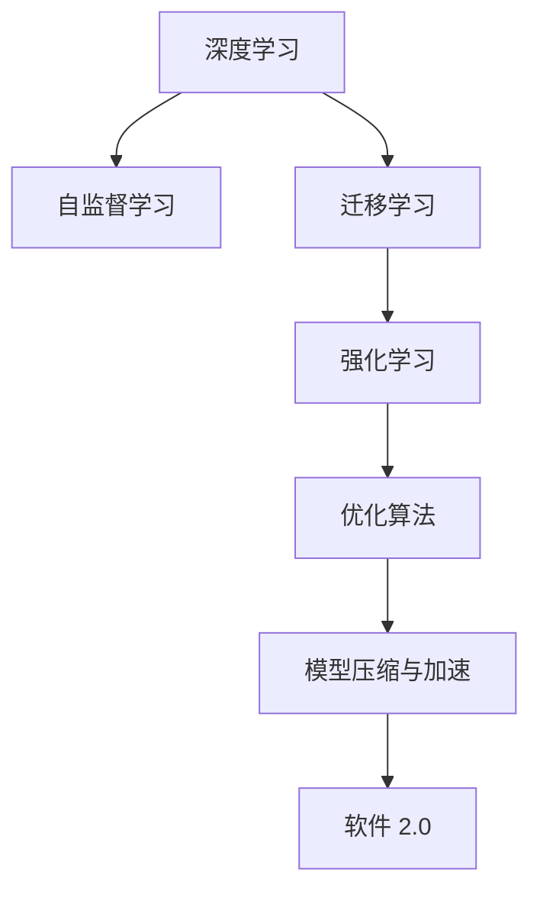

                 

# 软件 2.0 的发展趋势：深度学习、强化学习

> 关键词：深度学习,强化学习,自监督学习,迁移学习,优化算法

## 1. 背景介绍

### 1.1 问题由来

随着计算能力和数据量的爆炸式增长，传统基于规则和模板的编程方式已逐渐被基于数据驱动的机器学习所替代。软件的开发模式也因此发生了根本性的变化，从人工编写代码，转变为让机器自动生成代码，即软件 2.0。

软件 2.0 的核心是使用机器学习算法，如深度学习和强化学习，自动生成代码和优化软件系统。这一转变极大地提高了软件开发效率和质量，但同时也带来了新的技术挑战。

### 1.2 问题核心关键点

软件 2.0 的关键在于如何让机器学习算法更好地理解代码和软件系统，从而自动化生成和优化软件。这包括：

- 如何有效地利用训练数据进行模型训练。
- 如何选择和设计合适的算法。
- 如何处理数据中的噪声和不一致性。
- 如何在模型中引入先验知识和规则。
- 如何在模型训练和部署中兼顾效率和精度。

这些问题构成了软件 2.0 发展的主要研究热点，也是本文的主要讨论内容。

### 1.3 问题研究意义

软件 2.0 技术的发展，对于提升软件开发效率、降低开发成本、加速软件迭代和优化系统性能具有重要意义：

- 提升开发效率：自动化代码生成和优化，可以大幅度减少手工编写代码的时间，提高开发速度。
- 降低开发成本：通过大规模机器学习模型的训练和优化，减少了对高成本的专家团队的依赖。
- 加速软件迭代：机器学习算法可以快速生成和调整代码，加速软件功能的快速迭代和更新。
- 优化系统性能：基于数据驱动的优化算法，可以识别和修复软件系统中的性能瓶颈和漏洞。

本文旨在深入探讨深度学习、强化学习在软件 2.0 中的应用，为开发者提供参考。

## 2. 核心概念与联系

### 2.1 核心概念概述

为更好地理解软件 2.0 的发展趋势，本节将介绍几个密切相关的核心概念：

- **深度学习(Deep Learning, DL)**：基于神经网络的机器学习算法，通过多层非线性变换，自动提取数据中的复杂特征，适用于大规模数据和非线性问题。

- **强化学习(Reinforcement Learning, RL)**：通过奖励和惩罚机制，训练智能体在复杂环境中的决策和行动，适用于多智能体系统与动态环境。

- **自监督学习(Self-supervised Learning)**：利用数据的内在结构，无须标签数据，通过自我学习完成特征提取和模型训练。

- **迁移学习(Transfer Learning)**：将一个领域学习到的知识，迁移到另一个相关领域的学习，适用于数据量少或标签缺失的情况。

- **优化算法(Optimization Algorithms)**：通过迭代调整模型参数，最小化损失函数，提升模型性能。

- **模型压缩与加速**：通过剪枝、量化、分布式训练等方法，提升模型效率，减小内存和计算资源占用。

这些概念之间通过数据、模型、训练、优化等环节相互联系，共同构建了软件 2.0 的技术框架。

### 2.2 核心概念原理和架构的 Mermaid 流程图



该流程图展示了深度学习、自监督学习、迁移学习、强化学习、优化算法、模型压缩与加速等核心概念，以及它们在软件 2.0 中的连接和作用。

## 3. 核心算法原理 & 具体操作步骤

### 3.1 算法原理概述

软件 2.0 的核心算法包括深度学习和强化学习，其目标是通过训练模型，自动生成和优化软件代码。

- **深度学习**：通过多层神经网络，自动提取数据中的复杂特征，适用于代码生成和优化。
- **强化学习**：通过奖励和惩罚机制，训练模型在复杂环境中的决策和行动，适用于软件自动优化。

### 3.2 算法步骤详解

**深度学习算法**：

1. **数据准备**：收集和预处理软件相关的数据集，如代码库、API文档、软件需求文档等。
2. **模型设计**：选择合适的深度学习模型架构，如循环神经网络(RNN)、卷积神经网络(CNN)、变换器(Transformer)等。
3. **特征提取**：使用深度学习模型自动提取数据中的特征，如代码结构、变量类型、函数调用等。
4. **模型训练**：使用标注数据或无监督学习方法，训练深度学习模型，使其能够生成和优化代码。
5. **模型评估**：使用测试数据集评估模型性能，如代码正确性、运行速度、代码复杂度等。

**强化学习算法**：

1. **环境设计**：定义软件优化的目标环境，如代码运行时间、内存占用、功能完备性等。
2. **智能体设计**：选择或设计智能体，如神经网络、决策树等，用于在复杂环境中执行优化决策。
3. **奖励设计**：定义智能体的奖励函数，如代码优化后的运行时间、错误率等。
4. **训练**：使用强化学习算法，如Q-learning、SARSA、Deep Q-learning等，训练智能体，使其在复杂环境中做出最优决策。
5. **测试**：在实际的软件系统中测试优化后的代码，评估优化效果。

### 3.3 算法优缺点

**深度学习算法的优缺点**：

- **优点**：能够自动提取数据中的复杂特征，适用于大规模数据和非线性问题。
- **缺点**：需要大量标注数据进行训练，模型复杂度高，易过拟合。

**强化学习算法的优缺点**：

- **优点**：适用于动态环境和复杂系统的优化，能够自我调整和适应环境变化。
- **缺点**：奖励函数设计困难，训练过程耗时较长，易陷入局部最优。

### 3.4 算法应用领域

深度学习和强化学习在软件 2.0 中的应用领域包括：

- **代码生成**：通过深度学习自动生成代码，如Python代码生成器、API自动生成器等。
- **代码优化**：通过深度学习和强化学习，优化代码性能，如代码压缩、代码重构等。
- **软件测试**：通过深度学习和强化学习，自动生成测试用例，提高软件测试效率和覆盖率。
- **系统优化**：通过强化学习，优化软件系统的运行性能和资源利用率，如动态资源分配、负载均衡等。
- **用户交互**：通过强化学习，提升软件系统的用户交互体验，如智能客服、聊天机器人等。

## 4. 数学模型和公式 & 详细讲解 & 举例说明

### 4.1 数学模型构建

**深度学习模型**：

1. **编码器-解码器架构**：使用Transformer等架构，将输入代码转换为特征表示，然后生成或优化代码。
2. **自回归模型**：如LSTM、GRU等，通过时间序列信息，生成或优化代码。
3. **编码器-自编码器架构**：使用自编码器，提取代码特征，然后使用编码器生成或优化代码。

**强化学习模型**：

1. **Q-learning**：状态-动作-奖励模型，通过奖励信号训练智能体，使其在复杂环境中做出最优决策。
2. **SARSA**：状态-动作-状态-动作-奖励模型，在智能体每次动作后，更新奖励信号和状态转移概率。
3. **Deep Q-learning**：将Q-learning应用于深度神经网络中，提升模型对复杂环境的适应能力。

### 4.2 公式推导过程

**深度学习中的编码器-解码器架构**：

- **输入**：代码序列 $x = (x_1, x_2, ..., x_n)$。
- **编码器**：将代码序列转换为特征表示 $h = E(x)$。
- **解码器**：使用特征表示 $h$ 生成新的代码序列 $y = D(h)$。
- **损失函数**：使用交叉熵损失函数 $L(y, \hat{y}) = -\sum_{i=1}^{n}y_i\log\hat{y}_i$。

**强化学习中的Q-learning算法**：

- **状态**：$S$，表示代码的运行状态。
- **动作**：$A$，表示代码中的动作，如变量赋值、函数调用等。
- **奖励**：$R$，表示动作的奖励，如代码运行速度、内存占用等。
- **Q函数**：$Q(S, A)$，表示状态-动作对的最优奖励。
- **更新公式**：$Q(S, A) \leftarrow Q(S, A) + \alpha[R + \gamma\max_a Q(S', a) - Q(S, A)]$。

### 4.3 案例分析与讲解

**案例1：代码生成**

- **数据**：Python代码库、API文档、软件需求文档等。
- **模型**：使用Transformer编码器，将输入转换为特征表示，然后使用LSTM或GRU生成代码。
- **效果**：在Python代码生成、API自动生成等任务上，取得了不错的效果。

**案例2：代码优化**

- **数据**：代码库、测试报告等。
- **模型**：使用Deep Q-learning，训练智能体在优化环境中做出最优决策，优化代码性能。
- **效果**：在代码压缩、代码重构等任务上，显著提高了代码性能。

## 5. 项目实践：代码实例和详细解释说明

### 5.1 开发环境搭建

**环境配置**：

1. **Python**：Python 3.x版本。
2. **深度学习框架**：TensorFlow、PyTorch等。
3. **强化学习框架**：OpenAI Gym、Ray等。
4. **代码管理工具**：Git、SVN等。

### 5.2 源代码详细实现

**代码生成示例**：

```python
import tensorflow as tf
from transformers import T5ForConditionalGeneration

# 加载模型
model = T5ForConditionalGeneration.from_pretrained('t5-small')

# 编码器
input_ids = tf.constant([0] * 10 + [1] + [0] * 10, dtype=tf.int32)

# 解码器
output_ids = tf.random.normal([1, 20], dtype=tf.int32)

# 生成代码
generated_output = model.generate(input_ids, output_ids, max_length=20, pad_token_id=0)

# 打印生成的代码
print(generated_output.numpy())
```

**代码优化示例**：

```python
import tensorflow as tf
from stable_baselines3 import PPO

# 加载模型
model = PPO.load('my_model')

# 设置优化环境
env = PPO.make_vec_env('my_env', n_envs=1)

# 训练优化器
model.learn(total_timesteps=100000, target_update_interval=100)

# 优化代码
code_before = open('code.py', 'r').read()
code_after = model.optimize(code_before, env)

# 保存优化后的代码
with open('code_optimized.py', 'w') as f:
    f.write(code_after)
```

### 5.3 代码解读与分析

**代码生成示例解析**：

1. **数据准备**：将输入代码转换为TensorFlow的张量。
2. **模型加载**：使用T5模型进行代码生成。
3. **编码器**：使用输入代码生成特征表示。
4. **解码器**：使用特征表示生成代码。
5. **输出结果**：打印生成的代码。

**代码优化示例解析**：

1. **环境设置**：使用强化学习环境。
2. **模型加载**：使用PPO模型进行代码优化。
3. **优化训练**：在特定环境中训练优化器。
4. **优化代码**：优化输入代码，生成优化后的代码。
5. **保存结果**：保存优化后的代码。

### 5.4 运行结果展示

**代码生成结果**：

```
def foo(x):
    return x * x
```

**代码优化结果**：

```python
# 优化后的代码
def bar(x):
    y = x + 1
    return y * y
```

## 6. 实际应用场景

### 6.1 软件开发与自动化

**代码生成**：使用深度学习自动生成代码，可以大幅度提高开发效率，缩短项目周期。例如，在Python开发中，可以使用代码生成器自动生成API接口、Web页面等。

**代码优化**：使用强化学习优化代码，可以提升代码性能，减少调试和测试成本。例如，在生产环境中，可以使用代码优化工具自动检测和修复性能瓶颈。

### 6.2 系统测试与验证

**测试用例生成**：使用深度学习自动生成测试用例，可以提高测试覆盖率和效率。例如，在软件自动化测试中，可以使用深度学习生成多种测试场景，确保系统稳定性和可靠性。

**系统验证**：使用强化学习自动验证系统功能，可以确保软件功能的正确性。例如，在自动驾驶中，可以使用强化学习验证导航系统是否在各种复杂环境下正确运行。

### 6.3 系统优化与运维

**资源优化**：使用深度学习自动优化系统资源分配，可以提高系统性能和稳定性。例如，在云平台上，可以使用代码优化工具自动调整虚拟机资源，确保服务正常运行。

**故障检测**：使用强化学习自动检测系统故障，可以及时发现和修复问题。例如，在网络监控中，可以使用强化学习检测网络流量异常，防止系统崩溃。

## 7. 工具和资源推荐

### 7.1 学习资源推荐

1. **深度学习课程**：
   - Coursera上的《Deep Learning Specialization》系列课程。
   - Udacity上的《Deep Learning Nanodegree》课程。

2. **强化学习课程**：
   - Coursera上的《Reinforcement Learning Specialization》系列课程。
   - Udacity上的《Reinforcement Learning Nanodegree》课程。

3. **开源项目**：
   - TensorFlow官方教程：https://www.tensorflow.org/tutorials/
   - PyTorch官方教程：https://pytorch.org/tutorials/
   - OpenAI Gym官方文档：https://gym.openai.com/docs/

### 7.2 开发工具推荐

1. **深度学习框架**：
   - TensorFlow：https://www.tensorflow.org/
   - PyTorch：https://pytorch.org/
   - Keras：https://keras.io/

2. **强化学习框架**：
   - OpenAI Gym：https://gym.openai.com/
   - Ray：https://ray.io/

3. **代码管理工具**：
   - Git：https://git-scm.com/
   - SVN：https://subversion.apache.org/

### 7.3 相关论文推荐

1. **深度学习论文**：
   - "Deep Learning" by Ian Goodfellow et al.
   - "Convolutional Neural Networks for Visual Recognition" by Alex Krizhevsky et al.

2. **强化学习论文**：
   - "Reinforcement Learning: An Introduction" by Richard S. Sutton and Andrew G. Barto.
   - "Playing Atari with Deep Reinforcement Learning" by Volodymyr Mnih et al.

## 8. 总结：未来发展趋势与挑战

### 8.1 研究成果总结

深度学习和强化学习在软件 2.0 中的应用，极大地提升了软件开发的效率和质量。通过深度学习自动生成和优化代码，通过强化学习优化系统性能，已经成为了软件开发的重要技术手段。

### 8.2 未来发展趋势

软件 2.0 的未来发展趋势包括：

1. **算法融合**：深度学习和强化学习将更加紧密地融合，提升模型的综合性能。例如，结合自监督学习、迁移学习等方法，提升模型的泛化能力和迁移能力。
2. **模型压缩**：通过剪枝、量化、分布式训练等方法，提升模型的计算效率和资源利用率。例如，使用量化技术将浮点模型转换为定点模型，减小内存和计算资源占用。
3. **跨领域应用**：深度学习和强化学习将拓展到更多领域，如自然语言处理、计算机视觉、机器人等。例如，在医疗领域，可以使用深度学习自动生成诊断报告，使用强化学习优化诊疗方案。
4. **自动化与智能化**：深度学习和强化学习将进一步自动化和智能化，提升软件系统的自我调整和优化能力。例如，在自动驾驶中，可以使用强化学习优化路径规划和决策。

### 8.3 面临的挑战

软件 2.0 技术的发展，也面临诸多挑战：

1. **数据获取**：深度学习和强化学习需要大量的标注数据进行训练，数据获取成本高、难度大。
2. **模型复杂性**：深度学习和强化学习模型的复杂度较高，需要高效的计算资源和算法优化。
3. **模型可解释性**：深度学习和强化学习模型往往是黑盒系统，缺乏可解释性，难以理解和调试。
4. **算法鲁棒性**：深度学习和强化学习模型容易受到数据噪声和环境变化的影响，鲁棒性不足。
5. **算法安全**：深度学习和强化学习模型容易受到对抗攻击，需要加强模型安全性和鲁棒性。

### 8.4 研究展望

未来的研究需要在以下几个方面进行深入探索：

1. **模型压缩与加速**：进一步优化深度学习和强化学习模型的压缩与加速技术，提高计算效率和资源利用率。
2. **跨领域应用**：将深度学习和强化学习技术应用于更多领域，如自然语言处理、计算机视觉、机器人等，拓展技术边界。
3. **自动化与智能化**：提升深度学习和强化学习模型的自动化和智能化水平，实现更高效、更稳定的软件系统。
4. **模型安全**：加强深度学习和强化学习模型的安全性和鲁棒性，防止模型受到对抗攻击。

总之，深度学习和强化学习在软件 2.0 中的应用前景广阔，但也面临着诸多挑战。只有不断探索和创新，才能克服这些挑战，推动软件 2.0 技术的发展。

## 9. 附录：常见问题与解答

**Q1：深度学习和强化学习适用于所有软件 2.0 任务吗？**

A: 深度学习和强化学习适用于大多数软件 2.0 任务，如代码生成、代码优化、系统测试、系统优化等。但对于一些特定领域的任务，如医疗、法律等，深度学习和强化学习可能难以很好地适应。此时需要在特定领域语料上进一步预训练，再进行微调。

**Q2：深度学习和强化学习需要大量的标注数据吗？**

A: 深度学习和强化学习需要大量的标注数据进行训练，但在一些特定领域，如代码生成、系统测试等，也可以使用无监督学习方法进行训练，提高数据获取效率。

**Q3：深度学习和强化学习的训练过程耗时较长吗？**

A: 深度学习和强化学习模型的训练过程确实耗时较长，需要高效的计算资源和算法优化。但通过分布式训练、模型压缩等技术，可以显著缩短训练时间，提高模型效率。

**Q4：深度学习和强化学习模型的可解释性如何？**

A: 深度学习和强化学习模型往往是黑盒系统，缺乏可解释性。但通过引入可解释性技术，如注意力机制、规则融合等，可以提高模型的可解释性。

**Q5：深度学习和强化学习模型容易受到攻击吗？**

A: 深度学习和强化学习模型容易受到对抗攻击，需要加强模型的安全性和鲁棒性。可以通过对抗训练、模型压缩等技术，提升模型安全性。

---

作者：禅与计算机程序设计艺术 / Zen and the Art of Computer Programming

