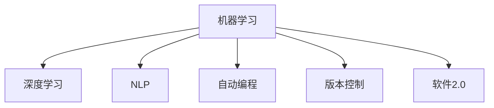

                 

# 软件 2.0 的应用：从实验室走向现实

## 1. 背景介绍

### 1.1 问题由来

随着人工智能（AI）技术的迅猛发展，软件工程领域也发生了深刻的变化。从传统的软件开发模式到基于AI的软件开发模式，即所谓的“软件2.0”（Software 2.0）。软件2.0利用机器学习、深度学习、自然语言处理（NLP）等先进技术，提升了软件开发的效率、质量和智能化水平。然而，将软件2.0技术从实验室推向现实，仍面临诸多挑战。本文将从背景介绍、核心概念、算法原理、项目实践、应用场景、工具资源推荐以及未来发展趋势等多个维度，系统性地探讨软件2.0技术的实际应用。

## 2. 核心概念与联系

### 2.1 核心概念概述

软件2.0是人工智能与软件开发深度融合的产物，它利用机器学习、深度学习等技术，自动生成、测试、部署软件，甚至进行版本管理和维护。其核心概念包括：

- **机器学习（Machine Learning, ML）**：通过训练数据，让机器从数据中学习规律，进行自动化的决策和预测。
- **深度学习（Deep Learning, DL）**：一种特殊的机器学习方法，利用神经网络模拟人脑的工作方式，解决复杂的数据问题。
- **自然语言处理（Natural Language Processing, NLP）**：让计算机理解和处理人类语言，包括文本生成、情感分析、机器翻译等。
- **自动编程（Automatic Programming）**：利用AI技术自动生成代码，如代码补全、程序自动化测试等。
- **版本控制（Version Control, VC）**：记录软件的发展历程，支持多人协作开发和软件迭代。

### 2.2 核心概念原理和架构的 Mermaid 流程图



## 3. 核心算法原理 & 具体操作步骤

### 3.1 算法原理概述

软件2.0的核心算法原理主要包括以下几个方面：

- **机器学习与深度学习**：通过训练大量数据，模型可以自动提取数据中的特征和规律，用于预测和决策。
- **自然语言处理**：利用NLP技术，将自然语言转化为计算机可处理的数据形式，实现语义理解和生成。
- **自动编程**：使用自动生成代码的方法，提升编程效率和代码质量。
- **版本控制**：通过记录软件版本的变化历史，支持软件的持续改进和版本回溯。

### 3.2 算法步骤详解

**Step 1: 数据准备**
- 收集和标注训练数据，包括代码片段、自然语言文本等。
- 使用数据增强技术，扩充训练数据集，如数据扩充、回译、改写等。

**Step 2: 模型训练**
- 使用机器学习、深度学习等技术，训练生成代码、翻译文本的模型。
- 调整模型超参数，如学习率、批量大小等。

**Step 3: 模型测试与部署**
- 在测试集上评估模型性能，如准确率、召回率、F1值等。
- 将训练好的模型集成到实际的软件开发流程中，进行版本控制和自动测试。

**Step 4: 持续优化**
- 收集反馈数据，持续优化模型，提高其预测准确性和泛化能力。
- 定期更新模型参数，保持模型性能的稳定性。

### 3.3 算法优缺点

**优点**：

- **高效性**：自动化生成代码和测试，节省了大量人工时间。
- **高准确性**：利用机器学习和深度学习技术，生成的代码质量高、准确性高。
- **易用性**：将复杂的软件开发过程简化为模型训练和应用，降低了开发门槛。

**缺点**：

- **数据依赖性**：需要大量标注数据，数据质量直接影响模型性能。
- **模型复杂性**：模型结构复杂，训练和优化过程难度大。
- **可解释性不足**：生成代码的逻辑难以解释，缺乏可控性和可理解性。

### 3.4 算法应用领域

软件2.0技术已经在多个领域得到广泛应用，包括：

- **软件开发**：利用自动编程技术，提升代码生成和测试的效率和质量。
- **数据处理**：使用NLP技术，自动处理和分析大量文本数据。
- **智能客服**：通过自然语言处理技术，自动生成客服回复，提升客户满意度。
- **安全检测**：利用深度学习模型，自动检测代码漏洞和异常行为，保障系统安全。
- **医疗诊断**：结合医学知识图谱，自动生成诊断报告，提高诊断准确性。

## 4. 数学模型和公式 & 详细讲解 & 举例说明

### 4.1 数学模型构建

假设有一个简单的自动编程任务，即从自然语言描述中生成Python代码片段。模型输入为自然语言描述，输出为对应的Python代码片段。构建数学模型如下：

- 输入：$x$ 表示自然语言描述的向量表示。
- 输出：$y$ 表示生成的Python代码片段的向量表示。
- 目标函数：$L(y,\hat{y})$ 表示预测值与真实值之间的损失函数。

### 4.2 公式推导过程

以一个简单的二元分类任务为例，构建分类器的数学模型。假设使用逻辑回归模型，公式如下：

$$ y = \sigma(Wx + b) $$

其中，$W$ 为权重向量，$b$ 为偏置项，$\sigma$ 为逻辑函数。

损失函数为：

$$ L(y,\hat{y}) = -\frac{1}{N}\sum_{i=1}^N[y_i\log \hat{y_i} + (1-y_i)\log (1-\hat{y_i})] $$

其中，$N$ 为样本数量，$y_i$ 为真实标签，$\hat{y_i}$ 为模型预测的标签。

### 4.3 案例分析与讲解

假设有一项任务，需要将自然语言描述转换为Python代码。模型输入为自然语言描述，输出为Python代码。

**数据准备**：收集自然语言描述和对应的Python代码，进行标注。

**模型训练**：使用深度学习模型，如LSTM、GRU、Transformer等，训练模型，生成对应的Python代码。

**模型测试**：在测试集上评估模型性能，如准确率、召回率、F1值等。

## 5. 项目实践：代码实例和详细解释说明

### 5.1 开发环境搭建

在进行软件2.0的实践前，需要准备开发环境。以下是使用Python进行TensorFlow开发的Python环境配置流程：

1. 安装Anaconda：从官网下载并安装Anaconda，用于创建独立的Python环境。

2. 创建并激活虚拟环境：
```bash
conda create -n tf-env python=3.8 
conda activate tf-env
```

3. 安装TensorFlow：根据CUDA版本，从官网获取对应的安装命令。例如：
```bash
conda install tensorflow -c tensorflow -c conda-forge
```

4. 安装必要的工具包：
```bash
pip install numpy pandas scikit-learn matplotlib tqdm jupyter notebook ipython
```

完成上述步骤后，即可在`tf-env`环境中开始软件2.0的实践。

### 5.2 源代码详细实现

这里以一个简单的自然语言生成任务为例，使用TensorFlow构建模型。

```python
import tensorflow as tf
from tensorflow.keras.layers import LSTM, Dense
from tensorflow.keras.models import Sequential

# 定义模型
model = Sequential([
    LSTM(64, input_shape=(None,)),
    Dense(1, activation='sigmoid')
])

# 编译模型
model.compile(loss='binary_crossentropy', optimizer='adam', metrics=['accuracy'])

# 训练模型
model.fit(train_data, train_labels, epochs=10, batch_size=32)

# 评估模型
test_loss, test_acc = model.evaluate(test_data, test_labels)
print(f'Test accuracy: {test_acc}')
```

### 5.3 代码解读与分析

**代码解读**：

- `Sequential`：定义一个顺序模型，将各个层按照顺序堆叠起来。
- `LSTM`：定义一个长短期记忆网络，用于处理序列数据。
- `Dense`：定义一个全连接层，用于输出预测结果。
- `compile`：编译模型，指定损失函数、优化器和评估指标。
- `fit`：训练模型，使用训练数据和标签进行模型训练。
- `evaluate`：评估模型，使用测试数据和标签进行模型评估。

**代码分析**：

- 模型的输入形状为 `(None,)`，表示输入为不定长的序列。
- 使用二元交叉熵作为损失函数，使用Adam优化器进行模型优化。
- 模型训练10个epochs，每个batch的大小为32。
- 评估模型时，输出测试集的准确率。

### 5.4 运行结果展示

运行上述代码，可以得到训练和评估的结果：

- 训练结果：每个epoch的损失和准确率。
- 评估结果：测试集上的准确率。

## 6. 实际应用场景

### 6.1 智能客服系统

智能客服系统是软件2.0技术的重要应用场景之一。通过自然语言处理技术，自动生成客服回复，可以大幅提升客户满意度。

在技术实现上，可以收集企业的历史客服对话记录，将问题和最佳答复构建成监督数据，在此基础上训练生成模型。模型能够自动理解用户意图，生成合适的回复。对于客户提出的新问题，还可以接入检索系统实时搜索相关内容，动态生成回复。

### 6.2 数据处理

数据处理是软件2.0技术在数据分析领域的重要应用。通过自动文本分析和处理，可以快速获取数据中的有用信息。

在实践上，可以使用自然语言处理技术，自动分析文本数据，提取关键词、情感等有用信息。同时，利用机器学习模型，自动进行数据分类和聚类，提升数据处理的效率和准确性。

### 6.3 安全检测

安全检测是软件2.0技术在网络安全领域的重要应用。通过深度学习模型，自动检测代码漏洞和异常行为，保障系统安全。

在技术实现上，可以收集大量历史代码和漏洞信息，训练检测模型。模型可以自动扫描代码，检测潜在的漏洞和异常行为，生成详细的报告。同时，可以定期更新模型，保持检测的准确性和及时性。

### 6.4 医疗诊断

医疗诊断是软件2.0技术在医疗领域的重要应用。结合医学知识图谱，自动生成诊断报告，可以提高诊断准确性。

在实践上，可以收集大量的医学数据和知识图谱，训练诊断模型。模型可以根据病人的症状和病历，自动生成诊断报告，推荐治疗方案。同时，可以结合医生的经验，对诊断结果进行人工审核和修正，提升诊断的可靠性和可解释性。

## 7. 工具和资源推荐

### 7.1 学习资源推荐

为了帮助开发者系统掌握软件2.0的理论基础和实践技巧，这里推荐一些优质的学习资源：

1. **《深度学习入门》**：由李沐等编写的入门书籍，介绍了深度学习的基本概念和实现方法，适合初学者。
2. **《TensorFlow实战》**：由刘建平编写的实践书籍，介绍了TensorFlow的使用方法和案例。
3. **《自然语言处理综论》**：由斯坦福大学提供的免费在线课程，介绍了NLP的基本概念和前沿技术。
4. **Kaggle竞赛平台**：提供了大量的数据集和竞赛项目，可以帮助开发者实践和验证模型的效果。
5. **GitHub**：全球最大的开源社区，可以获取大量的开源代码和项目，快速学习和应用。

通过对这些资源的学习实践，相信你一定能够快速掌握软件2.0的核心技术和实践方法。

### 7.2 开发工具推荐

高效的开发离不开优秀的工具支持。以下是几款用于软件2.0开发常用的工具：

1. **TensorFlow**：由Google主导开发的深度学习框架，生产部署方便，适合大规模工程应用。
2. **PyTorch**：由Facebook开发的深度学习框架，灵活性高，适合科研和实验。
3. **Jupyter Notebook**：免费的交互式编程环境，支持多种编程语言，适合开发和实验。
4. **Git**：全球最流行的版本控制系统，支持多人协作和版本管理，适合软件开发和项目管理。
5. **Visual Studio Code**：流行的轻量级IDE，支持多种编程语言和插件，适合软件开发和调试。

合理利用这些工具，可以显著提升软件2.0开发的速度和质量，加快创新迭代的步伐。

### 7.3 相关论文推荐

软件2.0技术的发展源于学界的持续研究。以下是几篇奠基性的相关论文，推荐阅读：

1. **《深度学习》**：由Ian Goodfellow等编写的经典教材，介绍了深度学习的基本概念和实现方法。
2. **《TensorFlow框架》**：由Google发布的深度学习框架文档，提供了详细的API和使用指南。
3. **《Transformer：自注意力机制》**：提出了Transformer结构，开启了NLP领域的预训练大模型时代。
4. **《Attention is All You Need》**：提出了Transformer结构，开创了自注意力机制在NLP中的应用。
5. **《自然语言处理综述》**：介绍了NLP的基本概念和前沿技术，涵盖了各种自然语言处理任务。

这些论文代表了大语言模型微调技术的发展脉络。通过学习这些前沿成果，可以帮助研究者把握学科前进方向，激发更多的创新灵感。

## 8. 总结：未来发展趋势与挑战

### 8.1 研究成果总结

本文对软件2.0的应用进行了全面系统的介绍。首先阐述了软件2.0的技术背景和应用意义，明确了其在提升软件开发效率、质量和智能化水平方面的独特价值。其次，从原理到实践，详细讲解了软件2.0的数学模型和核心算法，提供了完整代码实例和详细解释。同时，本文还探讨了软件2.0在多个实际应用场景中的潜在应用，展示了其巨大的市场潜力。

### 8.2 未来发展趋势

展望未来，软件2.0技术将呈现以下几个发展趋势：

1. **技术普及**：随着深度学习技术的发展，越来越多的开发者将掌握并应用软件2.0技术，提升开发效率和质量。
2. **技术融合**：软件2.0将与其他AI技术如NLP、计算机视觉、语音识别等深度融合，实现更广泛的应用。
3. **技术迭代**：随着AI技术的不断进步，软件2.0技术也将不断更新和迭代，提升其性能和应用场景。
4. **技术标准化**：软件2.0技术将逐步标准化，形成行业规范和标准，推动软件开发的现代化和标准化。

### 8.3 面临的挑战

尽管软件2.0技术已经取得了显著的进展，但在迈向更加智能化、普适化应用的过程中，仍面临诸多挑战：

1. **数据依赖性**：软件2.0技术需要大量的标注数据，数据的获取和标注成本较高。
2. **模型复杂性**：模型的复杂性高，训练和优化过程难度大。
3. **可解释性不足**：生成的代码缺乏可控性和可理解性，难以解释其内部工作机制。
4. **数据隐私**：处理大量用户数据时，需要保护用户隐私和数据安全。
5. **技术门槛**：需要大量的技术积累和经验，对开发者的要求较高。

### 8.4 研究展望

面对软件2.0技术面临的挑战，未来的研究需要在以下几个方面寻求新的突破：

1. **数据获取与标注**：探索新的数据获取和标注方法，如无监督学习、半监督学习等，降低数据依赖性。
2. **模型优化**：开发更高效、更可解释的模型，提升模型性能和应用效果。
3. **技术标准化**：推动软件2.0技术的标准化，形成行业规范和标准，提升技术的普及度和应用效果。
4. **技术融合**：将软件2.0技术与其他AI技术如NLP、计算机视觉、语音识别等深度融合，拓展其应用场景。

这些研究方向将引领软件2.0技术迈向更高的台阶，为构建安全、可靠、可解释、可控的智能系统铺平道路。

## 9. 附录：常见问题与解答

**Q1：软件2.0技术的核心优势是什么？**

A: 软件2.0技术通过自动化生成、测试、部署软件，显著提升了软件开发效率和质量。其核心优势包括：

- **高效性**：自动化生成代码和测试，节省了大量人工时间。
- **高准确性**：利用机器学习和深度学习技术，生成的代码质量高、准确性高。
- **易用性**：将复杂的软件开发过程简化为模型训练和应用，降低了开发门槛。

**Q2：软件2.0技术的应用场景有哪些？**

A: 软件2.0技术已经在多个领域得到广泛应用，包括：

- **软件开发**：利用自动编程技术，提升代码生成和测试的效率和质量。
- **数据处理**：使用自然语言处理技术，自动处理和分析大量文本数据。
- **智能客服**：通过自然语言处理技术，自动生成客服回复，提升客户满意度。
- **安全检测**：利用深度学习模型，自动检测代码漏洞和异常行为，保障系统安全。
- **医疗诊断**：结合医学知识图谱，自动生成诊断报告，提高诊断准确性。

**Q3：如何评估软件2.0技术的性能？**

A: 评估软件2.0技术的性能通常包括以下几个指标：

- **准确率**：衡量模型预测结果与真实结果的一致性。
- **召回率**：衡量模型识别正样本的能力。
- **F1值**：综合考虑准确率和召回率的指标。
- **运行时间**：衡量模型的执行效率。
- **代码质量**：衡量生成的代码质量和可读性。

**Q4：软件2.0技术有哪些局限性？**

A: 软件2.0技术虽然具有诸多优势，但也存在一些局限性：

- **数据依赖性**：需要大量标注数据，数据获取和标注成本较高。
- **模型复杂性**：模型结构复杂，训练和优化过程难度大。
- **可解释性不足**：生成的代码缺乏可控性和可理解性，难以解释其内部工作机制。
- **数据隐私**：处理大量用户数据时，需要保护用户隐私和数据安全。
- **技术门槛**：需要大量的技术积累和经验，对开发者的要求较高。

**Q5：如何应对软件2.0技术面临的挑战？**

A: 应对软件2.0技术面临的挑战需要从多个方面入手：

- **数据获取与标注**：探索新的数据获取和标注方法，如无监督学习、半监督学习等，降低数据依赖性。
- **模型优化**：开发更高效、更可解释的模型，提升模型性能和应用效果。
- **技术标准化**：推动软件2.0技术的标准化，形成行业规范和标准，提升技术的普及度和应用效果。
- **技术融合**：将软件2.0技术与其他AI技术如NLP、计算机视觉、语音识别等深度融合，拓展其应用场景。

通过这些措施，可以逐步克服软件2.0技术面临的挑战，提升其应用效果和普及度。

---

作者：禅与计算机程序设计艺术 / Zen and the Art of Computer Programming

