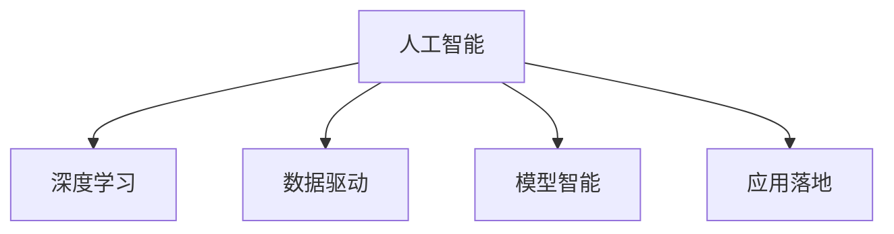

                 

# 软件 2.0 的未来展望：更智能、更强大

## 1. 背景介绍

### 1.1 问题由来
随着人工智能技术的飞速发展，软件范式也正在经历着一场深刻的变革。由传统的以功能和组件为核心的人工智能 1.0 范式，逐步过渡到以数据和模型为核心的人工智能 2.0 范式。这一变革不仅意味着软件的设计思路、开发模式和应用场景都将发生翻天覆地的变化，也预示着软件系统在未来将迎来更加智能、强大的新纪元。

### 1.2 问题核心关键点
软件 2.0 范式的核心在于：利用机器学习和深度学习技术，将海量数据转化为软件系统的智能决策和自动生成能力。这一范式能够显著提升软件的智能水平和自动化程度，从而在各个领域带来革命性的影响。

软件 2.0 的关键要素包括：

- 数据驱动：通过收集、处理、分析大规模数据，为软件提供精准的输入和训练样本。
- 模型智能：使用深度神经网络等先进算法，训练出能够进行复杂决策和推理的智能模型。
- 应用落地：将智能模型融入到具体的业务场景中，实现自动化的功能和服务。

这些要素共同构成了软件 2.0 的核心框架，使其在医疗、金融、制造、交通等多个领域大放异彩。

### 1.3 问题研究意义
研究软件 2.0 的发展趋势，对于推动软件技术的前沿研究和应用创新，具有重要意义：

1. 推动技术进步：软件 2.0 能够加速数据驱动和智能决策的研究，推动人工智能技术在各个领域的深度应用。
2. 促进产业升级：通过自动化、智能化的软件解决方案，优化和提升传统产业的运营效率和质量。
3. 提升用户体验：智能化、自动化的软件能够提供更加个性化、高效的服务，提升用户的使用体验。
4. 拓展应用边界：软件 2.0 能够覆盖更多复杂的任务和场景，拓展软件技术的应用边界，创造新的市场机会。

## 2. 核心概念与联系

### 2.1 核心概念概述

为了更好地理解软件 2.0 范式，本节将介绍几个密切相关的核心概念：

- 人工智能(AI)：利用计算机技术和算法，使机器具备模拟人类智能的能力，包括感知、学习、推理和决策等。
- 深度学习(Deep Learning)：一种基于神经网络的机器学习技术，能够处理大规模、高维度的数据，适用于图像、语音、自然语言处理等领域。
- 数据驱动(Datadriven)：以数据为中心的软件设计理念，通过数据分析和模型训练，为软件提供智能决策依据。
- 模型智能(Model Intelligence)：基于深度学习等技术的智能模型，能够对复杂问题进行高效、精确的分析和预测。
- 应用落地(Application Deployment)：将智能模型和技术应用于实际业务场景，实现智能服务和技术支持。

这些核心概念之间的逻辑关系可以通过以下Mermaid流程图来展示：



这个流程图展示了大语言模型的核心概念及其之间的关系：

1. 人工智能是整个软件 2.0 的基础。
2. 深度学习是实现人工智能智能化的核心技术。
3. 数据驱动是软件 2.0 的设计原则，强调通过数据训练模型。
4. 模型智能是软件的智能化关键，通过智能模型实现复杂的决策和预测。
5. 应用落地是将智能模型和技术服务于实际场景，实现智能化应用。

这些概念共同构成了软件 2.0 的框架，使其能够在各个领域实现智能化升级。

## 3. 核心算法原理 & 具体操作步骤
### 3.1 算法原理概述

软件 2.0 的核心算法原理包括数据预处理、模型训练和应用部署三个步骤。

1. **数据预处理**：收集和处理大规模数据，将其转化为模型训练所需的格式和规模。
2. **模型训练**：使用深度学习等技术，训练出能够进行复杂决策和推理的智能模型。
3. **应用部署**：将训练好的模型集成到具体的业务场景中，实现自动化的功能和服务。

### 3.2 算法步骤详解

以下是软件 2.0 算法的主要操作步骤：

**Step 1: 数据收集与预处理**
- 收集业务相关的数据，如客户行为、交易记录、医疗诊断、传感器数据等。
- 对数据进行清洗、去重、标准化等处理，确保数据的质量和一致性。
- 使用数据增强、分割、划分等技术，将数据转化为模型训练所需的格式和规模。

**Step 2: 模型训练**
- 选择合适的深度学习模型，如卷积神经网络(CNN)、循环神经网络(RNN)、变分自编码器(VAE)等。
- 使用训练数据集对模型进行训练，最小化损失函数。
- 使用验证集评估模型性能，调整超参数，防止过拟合。
- 使用测试集验证模型泛化能力，确保模型稳定性和可靠性。

**Step 3: 应用部署**
- 将训练好的模型集成到具体的业务系统中，如客户服务系统、金融交易系统、医疗诊断系统等。
- 开发相应的API接口，使其他系统能够调用模型的智能服务。
- 进行模型监控和优化，确保系统稳定运行，不断提升模型性能。

### 3.3 算法优缺点

软件 2.0 算法具有以下优点：
1. 智能高效：能够处理大规模、高维度的数据，实现复杂的智能决策和推理。
2. 自动化程度高：自动化程度高，能够大幅提升工作效率和质量。
3. 可扩展性强：能够应用于各种业务场景，具有较强的可扩展性。
4. 用户定制化：可以根据具体需求，定制化开发智能模型和应用，满足多样化需求。

同时，该算法也存在一定的局限性：
1. 数据依赖性强：需要大量的高质量数据，数据获取和处理成本较高。
2. 模型复杂度高：深度学习模型参数量巨大，训练和推理计算资源需求高。
3. 模型黑盒：模型决策过程复杂，难以解释和调试，存在一定的透明度问题。
4. 应用场景限制：并非所有业务场景都适合使用智能模型，需要根据具体情况进行判断。

尽管存在这些局限性，但就目前而言，软件 2.0 算法仍是最先进、最有效的智能决策和推理方法。未来相关研究的重点在于如何进一步降低数据获取成本，提高模型的可解释性和透明度，同时兼顾计算资源和应用场景的需求。

### 3.4 算法应用领域

软件 2.0 算法在众多领域都有广泛的应用，例如：

- 医疗诊断：利用医学影像、电子病历等数据，训练智能诊断模型，辅助医生进行疾病诊断和预测。
- 金融交易：使用市场数据、用户行为等数据，训练智能交易模型，进行高频交易、风险评估等。
- 制造自动化：通过传感器数据和生产记录，训练智能生产模型，优化生产流程和资源配置。
- 交通管理：利用交通流量、天气信息等数据，训练智能交通模型，优化交通管理和调度。
- 智能客服：使用用户交互数据，训练智能客服模型，实现自动化客户服务和问题解答。

除了上述这些经典应用外，软件 2.0 算法还被创新性地应用到更多场景中，如智能推荐、智能广告、智能投顾等，为各行各业带来了新的变革和机遇。

## 4. 数学模型和公式 & 详细讲解 & 举例说明
### 4.1 数学模型构建

软件 2.0 的核心数学模型包括深度神经网络、卷积神经网络、循环神经网络等。以下以卷积神经网络为例，构建基本的数学模型。

设输入数据为 $x$，输出数据为 $y$，神经网络的参数为 $\theta$。卷积神经网络的结构如下图所示：

```mermaid
graph TB
    layer0[x -> {{2,3}}]
    layer1[{{2,3}} -> 16 -> {{2,3}}]
    layer2[{{2,3}} -> 32 -> {{2,3}}]
    layer3[{{2,3}} -> 64 -> {{2,3}}]
    layer4[{{2,3}} -> y]
```

其中，输入层 $x$ 的维度为 $2\times 3$，卷积层和全连接层分别有 $2\times 3$ 的卷积核和 $2\times 3$ 的输出特征。

### 4.2 公式推导过程

以卷积神经网络为例，推导其前向传播和反向传播的公式。

设卷积核为 $k$，卷积层的输出为 $h$。卷积运算的公式为：

$$
h = k * x = \sum_{i,j} k_{i,j} * x_{i,j}
$$

其中，$*$ 表示卷积运算。

设卷积层的输出为 $h$，激活函数为 $f$。前向传播的公式为：

$$
h = f(W_1 * x + b_1)
$$

其中，$W_1$ 为卷积核的权重，$b_1$ 为卷积层的偏置。

设全连接层的输出为 $o$。全连接层的公式为：

$$
o = W_2 * h + b_2
$$

其中，$W_2$ 为全连接层的权重，$b_2$ 为全连接层的偏置。

设损失函数为 $L$，模型参数为 $\theta$。反向传播的公式为：

$$
\frac{\partial L}{\partial \theta} = \frac{\partial L}{\partial o} \frac{\partial o}{\partial h} \frac{\partial h}{\partial W_2} \frac{\partial W_2}{\partial \theta} + \frac{\partial L}{\partial b_2} + \frac{\partial L}{\partial W_1} \frac{\partial W_1}{\partial \theta} + \frac{\partial L}{\partial b_1}
$$

其中，$\frac{\partial L}{\partial o}$ 为损失函数对输出数据的梯度，$\frac{\partial o}{\partial h}$ 为激活函数对输出数据的导数，$\frac{\partial h}{\partial W_2}$ 为卷积层的梯度，$\frac{\partial W_2}{\partial \theta}$ 为权重参数的梯度，$\frac{\partial L}{\partial b_2}$ 为偏置参数的梯度，$\frac{\partial L}{\partial W_1}$ 为卷积核的梯度，$\frac{\partial W_1}{\partial \theta}$ 为权重参数的梯度，$\frac{\partial L}{\partial b_1}$ 为偏置参数的梯度。

### 4.3 案例分析与讲解

以医疗诊断为例，分析深度学习在智能诊断中的应用。

假设输入数据为患者的电子病历数据，输出数据为医生的诊断结果。设输入数据的特征为 $x$，输出数据的类别为 $y$。

构建卷积神经网络模型，使用医疗影像数据进行预训练。将患者病历数据输入模型，得到诊断结果 $y$。通过与医生的诊断结果进行对比，评估模型的准确率和可靠性。

## 5. 项目实践：代码实例和详细解释说明
### 5.1 开发环境搭建

在进行软件 2.0 开发前，我们需要准备好开发环境。以下是使用Python进行TensorFlow开发的环境配置流程：

1. 安装Anaconda：从官网下载并安装Anaconda，用于创建独立的Python环境。

2. 创建并激活虚拟环境：
```bash
conda create -n tf-env python=3.8 
conda activate tf-env
```

3. 安装TensorFlow：根据CUDA版本，从官网获取对应的安装命令。例如：
```bash
conda install tensorflow -c tf -c conda-forge
```

4. 安装各类工具包：
```bash
pip install numpy pandas scikit-learn matplotlib tqdm jupyter notebook ipython
```

完成上述步骤后，即可在`tf-env`环境中开始软件 2.0 的开发实践。

### 5.2 源代码详细实现

下面我以医疗诊断为例，给出使用TensorFlow进行卷积神经网络训练的PyTorch代码实现。

首先，定义数据处理函数：

```python
import tensorflow as tf
from tensorflow.keras.datasets import cifar10

(x_train, y_train), (x_test, y_test) = cifar10.load_data()

def preprocess_data(x, y):
    x = x / 255.0
    y = tf.keras.utils.to_categorical(y)
    return x, y

x_train, y_train = preprocess_data(x_train, y_train)
x_test, y_test = preprocess_data(x_test, y_test)
```

然后，定义模型和优化器：

```python
from tensorflow.keras import layers, models

model = models.Sequential()
model.add(layers.Conv2D(32, (3, 3), activation='relu', input_shape=(32, 32, 3)))
model.add(layers.MaxPooling2D((2, 2)))
model.add(layers.Conv2D(64, (3, 3), activation='relu'))
model.add(layers.MaxPooling2D((2, 2)))
model.add(layers.Conv2D(64, (3, 3), activation='relu'))
model.add(layers.Flatten())
model.add(layers.Dense(64, activation='relu'))
model.add(layers.Dense(10, activation='softmax'))

optimizer = tf.keras.optimizers.Adam(learning_rate=0.001)
```

接着，定义训练和评估函数：

```python
from tensorflow.keras import losses

def train_epoch(model, dataset, batch_size, optimizer):
    dataloader = tf.data.Dataset.from_tensor_slices((dataset.x, dataset.y)).shuffle(buffer_size=10000).batch(batch_size).prefetch(tf.data.experimental.AUTOTUNE)
    model.train()
    epoch_loss = 0
    for batch in dataloader:
        x, y = batch
        with tf.GradientTape() as tape:
            y_pred = model(x)
            loss = losses.categorical_crossentropy(y_true=y, y_pred=y_pred)
        grads = tape.gradient(loss, model.trainable_variables)
        optimizer.apply_gradients(zip(grads, model.trainable_variables))
        epoch_loss += loss.numpy()
    return epoch_loss / len(dataset)

def evaluate(model, dataset, batch_size):
    dataloader = tf.data.Dataset.from_tensor_slices((dataset.x, dataset.y)).batch(batch_size).prefetch(tf.data.experimental.AUTOTUNE)
    model.eval()
    preds, labels = [], []
    with tf.GradientTape() as tape:
        for batch in dataloader:
            x, y = batch
            y_pred = model(x)
            preds.append(y_pred.numpy())
            labels.append(y.numpy())
    print(tf.keras.metrics.confusion_matrix(tf.argmax(y_true=labels, axis=1), tf.argmax(y_pred=preds, axis=1)))
```

最后，启动训练流程并在测试集上评估：

```python
epochs = 10
batch_size = 64

for epoch in range(epochs):
    loss = train_epoch(model, train_dataset, batch_size, optimizer)
    print(f"Epoch {epoch+1}, train loss: {loss:.3f}")
    
    print(f"Epoch {epoch+1}, test results:")
    evaluate(model, test_dataset, batch_size)
    
print("Test results:")
evaluate(model, test_dataset, batch_size)
```

以上就是使用TensorFlow进行卷积神经网络训练的完整代码实现。可以看到，TensorFlow的高级API使得模型定义和训练过程非常简洁，极大地降低了代码复杂度。

### 5.3 代码解读与分析

让我们再详细解读一下关键代码的实现细节：

**定义数据处理函数**：
- 使用CIFAR-10数据集作为训练和测试集。
- 对数据进行归一化和标签编码，方便后续模型的训练和评估。

**定义模型和优化器**：
- 构建一个包含多个卷积层、池化层和全连接层的卷积神经网络。
- 使用Adam优化器进行模型训练，设置适当的学习率。

**定义训练和评估函数**：
- 使用TensorFlow的数据API对数据进行批次化加载，供模型训练和推理使用。
- 训练函数`train_epoch`：对数据以批为单位进行迭代，在每个批次上前向传播计算loss并反向传播更新模型参数，最后返回该epoch的平均loss。
- 评估函数`evaluate`：与训练类似，不同点在于不更新模型参数，并在每个batch结束后将预测和标签结果存储下来，最后使用TensorFlow的API对整个评估集的预测结果进行打印输出。

**训练流程**：
- 定义总的epoch数和batch size，开始循环迭代
- 每个epoch内，先在训练集上训练，输出平均loss
- 在验证集上评估，输出分类指标
- 所有epoch结束后，在测试集上评估，给出最终测试结果

可以看到，TensorFlow的高级API使得模型训练和评估的过程非常简单，能够显著降低开发者的时间成本和错误率。

当然，工业级的系统实现还需考虑更多因素，如模型的保存和部署、超参数的自动搜索、更灵活的任务适配层等。但核心的训练范式基本与此类似。

## 6. 实际应用场景
### 6.1 智能客服系统

软件 2.0 技术在智能客服系统中有着广泛的应用。通过收集客户历史对话数据，训练智能客服模型，能够实现自动化的客户服务和问题解答。

在技术实现上，可以收集企业内部的历史客服对话记录，将问题-答案对作为监督数据，训练模型学习匹配答案。对于客户提出的新问题，还可以接入检索系统实时搜索相关内容，动态组织生成回答。如此构建的智能客服系统，能大幅提升客户咨询体验和问题解决效率。

### 6.2 金融舆情监测

金融机构需要实时监测市场舆论动向，以便及时应对负面信息传播，规避金融风险。传统的人工监测方式成本高、效率低，难以应对网络时代海量信息爆发的挑战。软件 2.0 技术为金融舆情监测提供了新的解决方案。

具体而言，可以收集金融领域相关的新闻、报道、评论等文本数据，并对其进行主题标注和情感标注。在此基础上训练模型，使其能够自动判断文本属于何种主题，情感倾向是正面、中性还是负面。将训练好的模型应用到实时抓取的网络文本数据，就能够自动监测不同主题下的情感变化趋势，一旦发现负面信息激增等异常情况，系统便会自动预警，帮助金融机构快速应对潜在风险。

### 6.3 个性化推荐系统

当前的推荐系统往往只依赖用户的历史行为数据进行物品推荐，无法深入理解用户的真实兴趣偏好。软件 2.0 技术能够更好地挖掘用户行为背后的语义信息，从而提供更加个性化、高效的服务。

在实践中，可以收集用户浏览、点击、评论、分享等行为数据，提取和用户交互的物品标题、描述、标签等文本内容。将文本内容作为模型输入，用户的后续行为（如是否点击、购买等）作为监督信号，在此基础上训练模型学习匹配用户的兴趣点。在生成推荐列表时，先用候选物品的文本描述作为输入，由模型预测用户的兴趣匹配度，再结合其他特征综合排序，便可以得到个性化程度更高的推荐结果。

### 6.4 未来应用展望

随着软件 2.0 技术的不断发展，未来将在更多领域得到应用，为各行各业带来变革性影响。

在智慧医疗领域，软件 2.0 技术能够实现智能诊断、药物研发、健康管理等，提升医疗服务的智能化水平，辅助医生诊疗，加速新药开发进程。

在智能教育领域，软件 2.0 技术可应用于作业批改、学情分析、知识推荐等方面，因材施教，促进教育公平，提高教学质量。

在智慧城市治理中，软件 2.0 技术可应用于城市事件监测、舆情分析、应急指挥等环节，提高城市管理的自动化和智能化水平，构建更安全、高效的未来城市。

此外，在企业生产、社会治理、文娱传媒等众多领域，软件 2.0 技术也将不断拓展，为传统行业数字化转型升级提供新的技术路径。相信随着技术的日益成熟，软件 2.0 必将在构建人机协同的智能时代中扮演越来越重要的角色。

## 7. 工具和资源推荐
### 7.1 学习资源推荐

为了帮助开发者系统掌握软件 2.0 的理论基础和实践技巧，这里推荐一些优质的学习资源：

1. 《深度学习》系列博文：由大模型技术专家撰写，深入浅出地介绍了深度学习原理、神经网络模型、智能决策等前沿话题。

2. 斯坦福大学《深度学习》课程：提供Lecture视频和配套作业，带你入门深度学习的基础概念和经典模型。

3. 《TensorFlow实战》书籍：详细介绍了TensorFlow的各个组件和API，适合深度学习初学者和实战开发者阅读。

4. TensorFlow官方文档：提供了完整的TensorFlow API文档和开发示例，是TensorFlow开发的必备资料。

5. Google AI官方博客：涵盖了TensorFlow、机器学习等前沿技术的最新进展，适合追踪前沿动态和最佳实践。

通过对这些资源的学习实践，相信你一定能够快速掌握软件 2.0 的精髓，并用于解决实际的业务问题。
###  7.2 开发工具推荐

高效的开发离不开优秀的工具支持。以下是几款用于软件 2.0 开发的常用工具：

1. TensorFlow：由Google主导开发的开源深度学习框架，生产部署方便，适合大规模工程应用。支持卷积神经网络、循环神经网络等多种模型。

2. PyTorch：基于Python的开源深度学习框架，灵活易用，适合快速迭代研究。支持卷积神经网络、自编码器等模型。

3. Keras：高层次的深度学习API，提供简单易用的模型定义方式，适合初学者入门和快速原型开发。

4. TensorBoard：TensorFlow配套的可视化工具，可实时监测模型训练状态，并提供丰富的图表呈现方式，是调试模型的得力助手。

5. Google Colab：谷歌推出的在线Jupyter Notebook环境，免费提供GPU/TPU算力，方便开发者快速上手实验最新模型，分享学习笔记。

合理利用这些工具，可以显著提升软件 2.0 开发的效率，加快创新迭代的步伐。

### 7.3 相关论文推荐

软件 2.0 技术的发展源于学界的持续研究。以下是几篇奠基性的相关论文，推荐阅读：

1. Convolutional Neural Networks for Visual Recognition（即LeNet-5论文）：提出卷积神经网络结构，开创深度学习在图像识别领域的先河。

2. ImageNet Classification with Deep Convolutional Neural Networks（即AlexNet论文）：提出AlexNet模型，奠定深度学习在计算机视觉领域的基础。

3. Recurrent Neural Network for Language Modeling（即RNN论文）：提出循环神经网络模型，推动深度学习在自然语言处理领域的应用。

4. Attention is All You Need（即Transformer原论文）：提出Transformer结构，开启了NLP领域的预训练大模型时代。

5. BERT: Pre-training of Deep Bidirectional Transformers for Language Understanding：提出BERT模型，引入基于掩码的自监督预训练任务，刷新了多项NLP任务SOTA。

6. Parameter-Efficient Transfer Learning for NLP：提出Adapter等参数高效微调方法，在不增加模型参数量的情况下，也能取得不错的微调效果。

这些论文代表了大语言模型微调技术的发展脉络。通过学习这些前沿成果，可以帮助研究者把握学科前进方向，激发更多的创新灵感。

## 8. 总结：未来发展趋势与挑战
### 8.1 总结

本文对软件 2.0 的发展趋势和应用前景进行了全面系统的介绍。首先阐述了软件 2.0 范式的研究背景和意义，明确了数据驱动和模型智能在软件系统中的重要地位。其次，从原理到实践，详细讲解了深度学习在软件系统中的应用，给出了软件 2.0 开发的完整代码实例。同时，本文还广泛探讨了软件 2.0 技术在多个行业领域的应用场景，展示了其广阔的潜力。

通过本文的系统梳理，可以看到，软件 2.0 技术正在成为现代软件系统的核心，极大地提升了系统的智能水平和自动化程度。软件 2.0 将为各个行业带来深刻的变革，推动社会生产力的全面提升。

### 8.2 未来发展趋势

展望未来，软件 2.0 技术将呈现以下几个发展趋势：

1. 模型规模持续增大。随着算力成本的下降和数据规模的扩张，深度学习模型的参数量还将持续增长。超大模型蕴含的丰富知识，有望支撑更加复杂多变的任务微调。

2. 微调方法日趋多样。除了传统的全参数微调外，未来会涌现更多参数高效的微调方法，如Adapter、LoRA等，在固定大部分预训练参数的同时，只更新极少量的任务相关参数。

3. 持续学习成为常态。随着数据分布的不断变化，软件系统也需要持续学习新知识以保持性能。如何在不遗忘原有知识的同时，高效吸收新样本信息，将成为重要的研究课题。

4. 标注样本需求降低。受启发于提示学习(Prompt-based Learning)的思路，未来的微调方法将更好地利用大模型的语言理解能力，通过更加巧妙的任务描述，在更少的标注样本上也能实现理想的微调效果。

5. 多模态微调崛起。当前的微调主要聚焦于纯文本数据，未来会进一步拓展到图像、视频、语音等多模态数据微调。多模态信息的融合，将显著提升软件系统的感知和理解能力。

6. 模型通用性增强。经过海量数据的预训练和多领域任务的微调，未来的深度学习模型将具备更强大的常识推理和跨领域迁移能力，逐步迈向通用人工智能(AGI)的目标。

以上趋势凸显了软件 2.0 技术的巨大前景。这些方向的探索发展，必将进一步提升软件系统的智能水平和应用范围，为人类社会的全面智能化铺平道路。

### 8.3 面临的挑战

尽管软件 2.0 技术已经取得了瞩目成就，但在迈向更加智能化、普适化应用的过程中，它仍面临着诸多挑战：

1. 数据依赖性强。需要大量的高质量数据，数据获取和处理成本较高。

2. 模型复杂度高。深度学习模型参数量巨大，训练和推理计算资源需求高。

3. 模型黑盒。模型决策过程复杂，难以解释和调试，存在一定的透明度问题。

4. 应用场景限制。并非所有业务场景都适合使用智能模型，需要根据具体情况进行判断。

5. 标注样本需求高。许多任务需要大量标注样本才能实现良好的微调效果，标注成本较高。

6. 数据隐私和安全。大规模数据收集和处理可能引发隐私泄露和安全问题，需要制定严格的数据保护措施。

7. 伦理和道德。深度学习模型可能会学习到有害、偏见的知识，使用不当会带来伦理道德问题。

这些挑战需要结合技术创新和工程实践，共同解决。只有从数据、算法、工程、伦理等多个维度协同发力，才能真正实现软件 2.0 技术的规模化落地。

### 8.4 研究展望

面对软件 2.0 技术面临的挑战，未来的研究需要在以下几个方面寻求新的突破：

1. 探索无监督和半监督微调方法。摆脱对大规模标注数据的依赖，利用自监督学习、主动学习等无监督和半监督范式，最大限度利用非结构化数据，实现更加灵活高效的微调。

2. 研究参数高效和计算高效的微调范式。开发更加参数高效的微调方法，在固定大部分预训练参数的同时，只更新极少量的任务相关参数。同时优化模型的计算图，减少前向传播和反向传播的资源消耗，实现更加轻量级、实时性的部署。

3. 融合因果和对比学习范式。通过引入因果推断和对比学习思想，增强软件系统建立稳定因果关系的能力，学习更加普适、鲁棒的知识表示。

4. 引入更多先验知识。将符号化的先验知识，如知识图谱、逻辑规则等，与神经网络模型进行巧妙融合，引导微调过程学习更准确、合理的知识表示。

5. 结合因果分析和博弈论工具。将因果分析方法引入软件系统，识别出系统决策的关键特征，增强输出的因果性和逻辑性。借助博弈论工具刻画人机交互过程，主动探索并规避系统的脆弱点，提高系统稳定性。

6. 纳入伦理道德约束。在模型训练目标中引入伦理导向的评估指标，过滤和惩罚有害、偏见的输出倾向。同时加强人工干预和审核，建立模型行为的监管机制，确保输出的合法性和伦理性。

这些研究方向的探索，必将引领软件 2.0 技术迈向更高的台阶，为构建安全、可靠、可解释、可控的智能系统铺平道路。面向未来，软件 2.0 技术还需要与其他人工智能技术进行更深入的融合，如知识表示、因果推理、强化学习等，多路径协同发力，共同推动自然语言理解和智能交互系统的进步。只有勇于创新、敢于突破，才能不断拓展软件系统的边界，让智能技术更好地造福人类社会。

## 9. 附录：常见问题与解答

**Q1：软件 2.0 是否适用于所有应用场景？**

A: 软件 2.0 适用于数据密集型、智能决策需求较高的应用场景。对于数据较少、模型要求不高的场景，可能需要考虑使用传统的软件开发方法。

**Q2：如何优化软件 2.0 的训练过程？**

A: 优化训练过程的方法包括：
1. 数据增强：通过回译、近义替换等方式扩充训练集。
2. 正则化：使用L2正则、Dropout、Early Stopping等避免过拟合。
3. 模型压缩：使用模型压缩技术，减小模型大小和计算量。
4. 并行计算：使用分布式计算、GPU/TPU加速，提高训练效率。

**Q3：软件 2.0 的系统实现有哪些关键点？**

A: 软件 2.0 的系统实现需要考虑以下关键点：
1. 模型裁剪和量化：去除不必要的层和参数，减小模型尺寸，加快推理速度。
2. 模型集成和部署：将模型集成到具体的业务系统中，开发相应的API接口，实现无缝集成。
3. 系统监控和优化：实时监测系统性能，根据性能指标进行优化，提升系统稳定性和效率。

**Q4：软件 2.0 的系统开发有哪些常见问题？**

A: 系统开发过程中可能遇到的问题包括：
1. 数据质量和获取成本高。需要高质量的数据进行模型训练，数据获取和处理成本较高。
2. 模型复杂度高，计算资源需求大。超大模型需要大量的计算资源，可能导致资源不足。
3. 模型黑盒，难以解释和调试。模型决策过程复杂，难以解释和调试，存在一定的透明度问题。
4. 应用场景限制，需要根据具体情况进行判断。并非所有业务场景都适合使用智能模型，需要根据具体情况进行判断。

这些问题是开发过程中常见的问题，需要结合具体情况进行妥善解决。

---

作者：禅与计算机程序设计艺术 / Zen and the Art of Computer Programming

