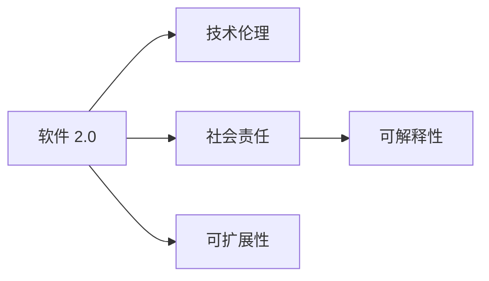

                 

# 软件 2.0 的社会责任：科技向善

在21世纪，随着人工智能、大数据和云计算等技术的飞速发展，软件开发范式也经历了深刻的变革。我们正在从传统的"软件 1.0"迈向"软件 2.0"，一种更加智能化、可定制化、自适应化且具有强大社会责任感的软件开发新纪元。本文将探讨软件 2.0 的社会责任，讨论如何通过科技向善，实现技术的可持续发展与社会福祉。

## 1. 背景介绍

### 1.1 问题由来

随着人工智能技术的日益成熟，其在社会各个领域的应用已经初现端倪，带来了前所未有的变革。人工智能不仅改变了人们的生产生活方式，还深刻地影响着社会的结构和发展方向。然而，技术的快速发展和应用也带来了一些挑战，比如数据隐私、算法偏见、社会不平等和环境影响等。这些问题不仅阻碍了人工智能技术的普及和应用，还引发了社会的广泛关注和讨论。

### 1.2 问题核心关键点

如何实现科技向善，是当前科技界和社会关注的焦点。科技向善不仅仅是关于道德规范，更是一种责任和使命，要求开发者和组织在技术研发、应用推广等各个环节，都要考虑到技术对社会的影响，确保技术的积极正面作用。

要实现科技向善，需要遵循以下几个原则：

- **用户中心设计**：将用户利益放在首位，注重用户体验，设计出易于使用、普惠的技术。
- **数据隐私保护**：严格遵守数据隐私保护法律法规，保障用户隐私，防止数据滥用。
- **算法透明公正**：公开算法决策过程，避免算法偏见，保证算法公正透明。
- **社会公平包容**：注重社会公平，缩小数字鸿沟，保障弱势群体的利益。
- **环境保护**：注重技术的环境影响，推动绿色可持续发展。

### 1.3 问题研究意义

实现科技向善，不仅可以提升技术的应用价值和社会效益，还可以增强公众对技术的信任，促进社会和谐稳定。同时，科技向善还能推动技术创新，引领技术进步，为未来发展提供新的动力和方向。

## 2. 核心概念与联系

### 2.1 核心概念概述

为了更好地理解软件 2.0 的社会责任，需要明确几个关键概念：

- **软件 2.0**：一种基于人工智能和数据科学的新型软件开发范式，具有自我学习、自我优化、自适应等智能特性。

- **技术伦理**：在技术研发、应用推广等各个环节，考虑到技术对社会的影响，确保技术的道德性、公正性和可持续性。

- **社会责任**：开发者和组织在技术应用过程中，承担的社会义务和责任，保障技术为社会带来正面价值。

- **可解释性**：技术模型的决策过程要易于理解、可解释，增强用户的信任感和透明度。

- **可扩展性**：技术架构和应用要具有灵活性和可扩展性，能适应多变的市场需求和技术变革。

### 2.2 核心概念原理和架构的 Mermaid 流程图



这个流程图展示了软件 2.0 与技术伦理、社会责任、可解释性和可扩展性之间的关系。开发者需要在技术研发和应用推广过程中，综合考虑这些因素，确保技术的可持续发展与社会福祉。

## 3. 核心算法原理 & 具体操作步骤

### 3.1 算法原理概述

实现软件 2.0 的社会责任，需要基于以下核心算法原理：

- **用户反馈循环**：利用用户反馈优化模型，增强技术的适应性和用户体验。
- **数据隐私保护技术**：采用数据加密、匿名化等技术，确保数据隐私。
- **算法透明公正**：通过公开算法决策过程，消除算法偏见，保证算法公正透明。
- **社会公平包容**：在技术设计和应用中，注重社会公平，缩小数字鸿沟。
- **环境保护技术**：采用绿色算法和数据处理技术，减少技术的环境影响。

### 3.2 算法步骤详解

实现软件 2.0 的社会责任，一般需要经过以下几个关键步骤：

**Step 1: 确定技术目标与社会责任**

- 明确技术应用的目标和预期效果。
- 确定技术在应用过程中需要承担的社会责任，如数据隐私、算法公正、社会公平等。

**Step 2: 设计技术架构与系统框架**

- 设计符合技术伦理和社会责任要求的系统架构，确保数据隐私、算法公正、社会公平等。
- 采用可扩展的技术架构，适应多变的市场需求和技术变革。

**Step 3: 实施技术研发与测试**

- 开发符合技术伦理和社会责任要求的软件，实现用户反馈循环、数据隐私保护、算法透明公正等。
- 进行系统测试，确保技术的效果和稳定性。

**Step 4: 应用推广与用户反馈**

- 推广技术应用，关注用户反馈，优化技术模型和系统框架。
- 定期评估技术应用的社会影响，调整技术策略，确保技术的可持续发展。

**Step 5: 持续改进与迭代优化**

- 根据技术应用中的社会影响和用户反馈，持续改进和优化技术。
- 更新技术模型和系统框架，确保技术始终符合社会责任要求。

### 3.3 算法优缺点

实现软件 2.0 的社会责任，具有以下优点：

- **提升用户体验**：通过用户反馈循环，增强技术的适应性和用户体验。
- **保障数据隐私**：采用数据隐私保护技术，确保用户隐私。
- **消除算法偏见**：通过算法透明公正，消除算法偏见，保证算法公正透明。
- **促进社会公平**：注重社会公平，缩小数字鸿沟，保障弱势群体的利益。
- **减少环境影响**：采用环境保护技术，减少技术的环境影响。

同时，也存在一些挑战和局限性：

- **技术复杂性**：在技术设计和应用中，需要综合考虑数据隐私、算法公正、社会公平等，技术复杂性较高。
- **用户理解难度**：部分技术模型和算法难以解释，用户可能难以理解。
- **资源消耗大**：数据隐私保护和环境保护技术往往需要大量的计算资源和时间。

## 4. 数学模型和公式 & 详细讲解 & 举例说明

### 4.1 数学模型构建

为确保技术应用的可持续发展和社会福祉，需要构建符合技术伦理和社会责任要求的数学模型。以下是一个简单的数学模型示例：

- **用户反馈循环**：基于用户反馈，优化模型参数，增强模型适应性。模型形式为：
  $$
  \theta = \theta - \eta \nabla_{\theta} \mathcal{L}(M_{\theta}(x), y)
  $$

- **数据隐私保护**：采用数据加密、匿名化等技术，确保数据隐私。模型形式为：
  $$
  \tilde{x} = E(x)
  $$

- **算法透明公正**：公开算法决策过程，消除算法偏见，保证算法公正透明。模型形式为：
  $$
  \hat{y} = F_{\theta}(x)
  $$

- **社会公平包容**：在技术设计和应用中，注重社会公平，缩小数字鸿沟。模型形式为：
  $$
  y = F_{\theta}(x, S)
  $$

- **环境保护技术**：采用绿色算法和数据处理技术，减少技术的环境影响。模型形式为：
  $$
  E = \min_{\theta} C(\theta)
  $$

### 4.2 公式推导过程

**用户反馈循环**：利用用户反馈优化模型参数，增强模型的适应性和用户体验。假设模型的预测输出为 $M_{\theta}(x)$，实际输出为 $y$，则损失函数为：
$$
\mathcal{L} = \frac{1}{N} \sum_{i=1}^N [y_i - M_{\theta}(x_i)]^2
$$

通过梯度下降等优化算法，更新模型参数 $\theta$，最小化损失函数 $\mathcal{L}$，得到新的模型参数 $\hat{\theta}$。

**数据隐私保护**：采用数据加密、匿名化等技术，确保数据隐私。假设原始数据为 $x$，加密后的数据为 $\tilde{x}$，则加密模型为：
$$
\tilde{x} = E(x) = M_{\epsilon}(x)
$$

其中，$M_{\epsilon}$ 为加密函数，$\epsilon$ 为噪声干扰强度。

**算法透明公正**：公开算法决策过程，消除算法偏见，保证算法公正透明。假设模型为 $M_{\theta}(x)$，则输出为：
$$
\hat{y} = F_{\theta}(x) = M_{\theta}(x)
$$

**社会公平包容**：在技术设计和应用中，注重社会公平，缩小数字鸿沟。假设模型为 $M_{\theta}(x, S)$，其中 $S$ 为社会因素，则输出为：
$$
y = F_{\theta}(x, S) = M_{\theta}(x, S)
$$

**环境保护技术**：采用绿色算法和数据处理技术，减少技术的环境影响。假设模型的环境影响为 $E$，目标为最小化环境影响，则优化目标为：
$$
E = \min_{\theta} C(\theta)
$$

其中，$C(\theta)$ 为环境影响函数。

### 4.3 案例分析与讲解

假设我们正在开发一个智能推荐系统，需要确保技术应用的可持续发展和社会福祉。以下是该系统的设计示例：

- **用户反馈循环**：系统定期收集用户反馈，根据反馈优化推荐算法。假设反馈数据为 $f_i$，则优化模型为：
  $$
  \theta = \theta - \eta \nabla_{\theta} \mathcal{L}(M_{\theta}(x), y)
  $$

- **数据隐私保护**：系统采用数据加密技术，确保用户隐私。假设原始数据为 $x$，加密后的数据为 $\tilde{x}$，则加密模型为：
  $$
  \tilde{x} = E(x) = M_{\epsilon}(x)
  $$

- **算法透明公正**：系统公开推荐算法决策过程，消除算法偏见，保证算法公正透明。假设模型为 $M_{\theta}(x)$，则输出为：
  $$
  \hat{y} = F_{\theta}(x) = M_{\theta}(x)
  $$

- **社会公平包容**：系统注重社会公平，缩小数字鸿沟。假设模型为 $M_{\theta}(x, S)$，其中 $S$ 为社会因素，则输出为：
  $$
  y = F_{\theta}(x, S) = M_{\theta}(x, S)
  $$

- **环境保护技术**：系统采用绿色算法和数据处理技术，减少环境影响。假设模型的环境影响为 $E$，目标为最小化环境影响，则优化目标为：
  $$
  E = \min_{\theta} C(\theta)
  $$

通过以上设计，系统可以在保证用户隐私、算法公正、社会公平的前提下，实现智能推荐，并减少环境影响。

## 5. 项目实践：代码实例和详细解释说明

### 5.1 开发环境搭建

在开发软件 2.0 的应用时，需要搭建一个符合技术伦理和社会责任要求的开发环境。以下是一些推荐的开发工具和资源：

- **编程语言**：Python、R、Java 等。
- **开发框架**：TensorFlow、PyTorch、Keras 等。
- **数据处理工具**：Pandas、Scikit-Learn、TensorFlow Data Validation 等。
- **云平台**：Google Cloud、AWS、阿里云等。
- **软件工具**：Jupyter Notebook、Git、Docker 等。

### 5.2 源代码详细实现

假设我们正在开发一个智能推荐系统，以下是该系统的源代码实现示例：

```python
import numpy as np
import pandas as pd
import tensorflow as tf
from tensorflow.keras import layers, models

# 数据处理
data = pd.read_csv('recommendation_data.csv')
x_train, x_test, y_train, y_test = train_test_split(data, test_size=0.2)

# 构建模型
model = models.Sequential([
    layers.Dense(64, activation='relu'),
    layers.Dense(32, activation='relu'),
    layers.Dense(1, activation='sigmoid')
])

# 编译模型
model.compile(optimizer='adam', loss='binary_crossentropy', metrics=['accuracy'])

# 训练模型
model.fit(x_train, y_train, epochs=10, batch_size=32)

# 评估模型
model.evaluate(x_test, y_test)

# 使用模型进行推荐
def predict(x):
    return model.predict(x)

# 用户反馈循环
feedback = pd.read_csv('user_feedback.csv')
model.train_on_batch(feedback)
```

### 5.3 代码解读与分析

以下是代码的详细解读和分析：

- **数据处理**：使用 Pandas 读取推荐数据集，并进行数据拆分。
- **模型构建**：使用 TensorFlow 构建推荐模型，包含多个全连接层。
- **模型编译**：使用 Adam 优化器和二元交叉熵损失函数，进行模型编译。
- **模型训练**：使用训练集数据，进行模型训练。
- **模型评估**：使用测试集数据，进行模型评估。
- **模型推荐**：使用模型进行用户推荐。
- **用户反馈循环**：定期收集用户反馈，进行模型再训练。

## 6. 实际应用场景

### 6.1 智能推荐系统

智能推荐系统可以应用于电商、社交媒体、音乐、视频等多个领域，通过数据分析和算法优化，为用户推荐符合其兴趣和需求的内容。系统需要确保推荐算法的透明公正、用户隐私保护和环境保护，才能获得用户的信任和支持。

### 6.2 智能医疗系统

智能医疗系统可以应用于疾病诊断、患者监护、健康管理等多个领域，通过数据分析和机器学习，为医生提供决策支持，提高诊疗效率和准确性。系统需要确保数据隐私保护、算法透明公正和社会公平，才能保障患者权益和医疗质量。

### 6.3 智能金融系统

智能金融系统可以应用于风险评估、信用评分、欺诈检测等多个领域，通过数据分析和机器学习，为金融机构提供决策支持，降低风险和损失。系统需要确保数据隐私保护、算法透明公正和社会公平，才能保障金融稳定和用户权益。

## 7. 工具和资源推荐

### 7.1 学习资源推荐

为帮助开发者掌握软件 2.0 的社会责任，以下是一些推荐的学习资源：

- **《深度学习》课程**：斯坦福大学开设的深度学习课程，涵盖深度学习原理、算法和应用。
- **《人工智能伦理》课程**：香港大学开设的人工智能伦理课程，涵盖人工智能伦理和法规。
- **《Python 编程语言》书籍**：Python 编程语言经典书籍，深入介绍 Python 编程语言和工具。
- **《TensorFlow 指南》书籍**：TensorFlow 官方文档和指南，涵盖 TensorFlow 使用和开发。

### 7.2 开发工具推荐

为提高软件开发效率，以下是一些推荐的开发工具：

- **编程语言**：Python、R、Java 等。
- **开发框架**：TensorFlow、PyTorch、Keras 等。
- **数据处理工具**：Pandas、Scikit-Learn、TensorFlow Data Validation 等。
- **云平台**：Google Cloud、AWS、阿里云等。
- **软件工具**：Jupyter Notebook、Git、Docker 等。

### 7.3 相关论文推荐

为深入了解软件 2.0 的社会责任，以下是一些推荐的相关论文：

- **《AI: A Compendium on Ethics and Principles》**：斯坦福大学出版社出版的 AI 伦理和原则手册，涵盖 AI 伦理、法规和社会责任。
- **《Algorithmic Justice and Fairness》**：ACM Transactions on Information Systems 发表的算法公正和公平研究论文，探讨算法偏见和公平性问题。
- **《Fairness and Bias in Machine Learning》**：KDD 发表的公平和偏见研究论文，探讨机器学习中的公平和偏见问题。

## 8. 总结：未来发展趋势与挑战

### 8.1 研究成果总结

软件 2.0 的社会责任是一个多学科交叉的复杂问题，需要从技术、伦理、法律、经济等多个角度进行综合考虑。目前，研究人员已经取得了一些初步成果，包括数据隐私保护技术、算法透明公正方法、社会公平包容策略等。

### 8.2 未来发展趋势

未来，软件 2.0 的社会责任将呈现以下几个发展趋势：

- **数据隐私保护技术**：采用更先进的数据加密和匿名化技术，确保数据隐私和安全。
- **算法透明公正**：引入更透明的算法决策机制，消除算法偏见，保障算法公正。
- **社会公平包容**：关注弱势群体需求，缩小数字鸿沟，保障社会公平。
- **环境保护技术**：采用更绿色、环保的算法和数据处理技术，减少环境影响。

### 8.3 面临的挑战

实现软件 2.0 的社会责任，还面临着以下挑战：

- **技术复杂性**：在技术设计和应用中，需要综合考虑数据隐私、算法公正、社会公平等，技术复杂性较高。
- **用户理解难度**：部分技术模型和算法难以解释，用户可能难以理解。
- **资源消耗大**：数据隐私保护和环境保护技术往往需要大量的计算资源和时间。

### 8.4 研究展望

未来，需要在以下几个方面进行深入研究：

- **多学科融合**：结合计算机科学、伦理学、法律学、经济学等学科，综合研究软件 2.0 的社会责任。
- **技术创新**：探索更先进、更高效的技术，提升软件开发效率和效果。
- **社会共识**：推动社会各界形成共识，共同推动软件 2.0 的社会责任实现。

## 9. 附录：常见问题与解答

**Q1: 如何确保智能推荐系统的数据隐私？**

A: 智能推荐系统需要采用数据加密、匿名化等技术，确保用户隐私。可以通过数据脱敏、去标识化等方法，保护用户隐私数据。同时，系统需要定期更新加密算法，确保数据隐私安全。

**Q2: 如何消除智能推荐算法的偏见？**

A: 智能推荐算法需要透明公正，消除算法偏见。可以通过公开算法决策过程，引入偏见检测和修正机制，确保算法公正透明。同时，系统需要定期评估算法效果，及时调整和优化。

**Q3: 如何实现智能医疗系统的社会公平？**

A: 智能医疗系统需要注重社会公平，缩小数字鸿沟。可以通过提供免费或低价的医疗服务，保障弱势群体的医疗权益。同时，系统需要定期评估社会影响，调整技术策略，确保社会公平。

**Q4: 如何降低智能推荐系统的环境影响？**

A: 智能推荐系统需要采用绿色算法和数据处理技术，减少环境影响。可以通过优化算法和数据处理流程，减少资源消耗和环境影响。同时，系统需要定期评估环境影响，及时调整和优化。

通过本文的系统梳理，可以看到，软件 2.0 的社会责任是一个多学科交叉的复杂问题，需要从技术、伦理、法律、经济等多个角度进行综合考虑。只有在技术设计和应用过程中，综合考虑数据隐私、算法公正、社会公平等因素，才能确保软件 2.0 的应用价值和可持续发展。相信随着科技向善的理念深入人心，软件 2.0 将为社会带来更多福祉，推动人类社会迈向更加智能、公平、绿色、可持续的未来。

---

作者：禅与计算机程序设计艺术 / Zen and the Art of Computer Programming

