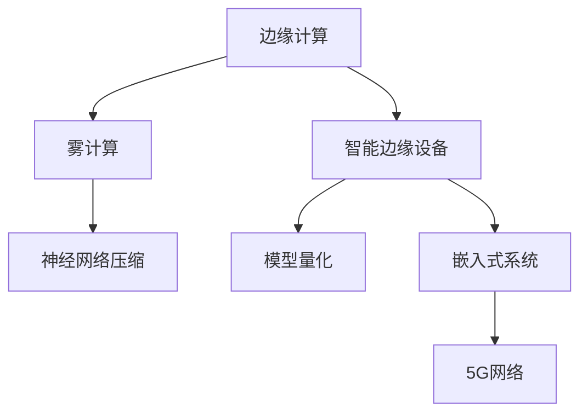

                 

# 边缘AI:将智能带到设备端的技术突破

> 关键词：边缘AI,边缘计算,智能边缘设备,雾计算,AI芯片,物联网(IoT),5G,神经网络压缩,模型量化,嵌入式系统

## 1. 背景介绍

### 1.1 问题由来
在当今的信息时代，人工智能(AI)技术正迅速改变各行各业的运营方式。从智能手机到自动驾驶，从健康医疗到金融服务，AI正以一种前所未有的方式重塑世界的面貌。然而，随着AI模型规模的扩大和复杂度的增加，传统的集中式计算模式已难以满足实时性、高吞吐量的要求。

边缘计算作为一种新的计算范式，通过将计算资源下放到靠近数据源的智能边缘设备，如智能手机、物联网(IoT)传感器、工业控制系统等，在数据本地处理和分析，从而大大降低了延迟，提高了系统的响应速度。但如何将智能从中心化云端带到边缘设备，仍是一大难题。

### 1.2 问题核心关键点
边缘AI的目标是充分利用边缘计算的优势，将AI算法部署到靠近数据源的设备端，实现高效、低延迟的智能推理。但实现这一目标，需要克服以下关键挑战：

- 数据隐私和安全：数据需在边缘设备上本地处理，避免敏感数据泄露。
- 计算资源限制：边缘设备计算能力有限，模型必须进行优化才能适配。
- 通信带宽瓶颈：数据在边缘设备上处理后需通过有限的通信带宽上传回云端，需进行有效压缩。
- 实时性要求：边缘计算需满足低延迟的实时响应要求。
- 模型更新和维护：边缘设备需定期更新模型，以保持最新性能。

## 2. 核心概念与联系

### 2.1 核心概念概述

为更好地理解边缘AI的技术突破，本节将介绍几个密切相关的核心概念：

- 边缘计算（Edge Computing）：一种分布式计算架构，通过将数据处理和分析资源部署在靠近数据源的智能边缘设备上，减少数据传输的延迟和带宽消耗，提高系统的响应速度。
- 智能边缘设备（Edge Devices）：如智能手机、物联网传感器、工业控制系统等，具备一定的计算、存储和通信能力，可进行本地推理和决策。
- 雾计算（Fog Computing）：与边缘计算类似，也是将计算资源分布在本地设备和云端之间，提供更灵活的计算和存储资源分配。
- 神经网络压缩（Neural Network Compression）：通过量化、剪枝、蒸馏等技术，将大型神经网络模型压缩到计算资源有限的边缘设备上。
- 模型量化（Model Quantization）：将浮点数运算转换为定点运算，减少模型存储和计算资源占用。
- 嵌入式系统（Embedded Systems）：具备特定功能，并通过硬件和软件相融合的方式进行操作的系统，如智能手机操作系统、工业控制系统等。
- 5G网络：新一代无线通信技术，具有高带宽、低延迟、大规模连接等特点，可有效支持边缘计算和边缘AI的发展。

这些核心概念之间的逻辑关系可以通过以下Mermaid流程图来展示：



这个流程图展示了一系列关键技术概念及其之间的关系：

1. 边缘计算通过将计算资源下放到本地设备，降低延迟，提升响应速度。
2. 智能边缘设备作为边缘计算的承载体，具备计算、存储和通信能力，用于本地推理。
3. 雾计算提供更灵活的资源分配，可以补充边缘计算的不足。
4. 神经网络压缩和模型量化是适应边缘计算资源限制的重要手段。
5. 嵌入式系统是边缘设备的操作系统，提供了必要的软硬件环境。
6. 5G网络提供高速、低延迟的网络支持，促进边缘计算和边缘AI的发展。

## 3. 核心算法原理 & 具体操作步骤

### 3.1 算法原理概述

边缘AI的核心算法原理是利用边缘计算的优势，将AI模型和推理任务从中心化云端下放到智能边缘设备，在数据本地进行推理，从而减少延迟，提高系统的实时性和可靠性。

形式化地，假设原始模型为 $M$，原始数据为 $D$，则典型的边缘AI流程包括：

1. 对原始模型 $M$ 进行量化和压缩，以适配边缘设备的计算能力。
2. 将量化后的模型 $M'$ 部署到智能边缘设备上。
3. 在本地设备上对输入数据 $D$ 进行处理，得到推理结果 $R$。
4. 通过有限的通信带宽将推理结果 $R$ 上传回云端进行进一步分析和决策。

数学上，可以定义如下优化问题：

$$
\min_{R} \mathcal{L}(R; D) + \alpha \mathcal{C}(R)
$$

其中 $\mathcal{L}(R; D)$ 为模型在数据 $D$ 上的损失函数，$\mathcal{C}(R)$ 为模型压缩后的计算复杂度，$\alpha$ 为权衡损失和计算复杂度的平衡系数。

### 3.2 算法步骤详解

边缘AI的算法步骤包括模型量化、压缩、部署和推理等关键步骤：

**Step 1: 模型量化**
量化是将浮点数运算转换为定点运算的过程，通常分为整数量化、浮点数量化等。整数量化计算速度快，但精度损失较大；浮点数量化精度高，但计算资源占用大。常见的方法有权重量化、激活量化、混合量化等。

**Step 2: 模型压缩**
模型压缩旨在减少模型大小和计算资源占用，常见的方法包括剪枝、蒸馏、权重共享等。剪枝通过去除模型中的冗余连接，减少参数数量；蒸馏通过将大模型的知识传递给小型模型，减少计算资源消耗；权重共享通过将权重共享给多个任务，提高计算效率。

**Step 3: 模型部署**
模型部署是将量化和压缩后的模型适配到智能边缘设备的过程。常见的部署方法包括静态部署、动态部署、分片部署等。静态部署将模型固化在硬件中，适用于计算能力较强的设备；动态部署在运行时加载模型，适用于计算能力较弱的设备；分片部署将模型分割成多个片段，减少内存和计算资源占用。

**Step 4: 本地推理**
本地推理是在边缘设备上对输入数据进行处理，得到推理结果的过程。常见的推理方法包括前向传播、反向传播、前向加速等。前向传播直接进行推理，速度较快；反向传播可进行模型微调，提升模型精度；前向加速通过硬件加速器，进一步提高推理速度。

**Step 5: 数据上传**
数据上传是将推理结果从边缘设备上传回云端的过程。常见的数据上传方法包括同步上传、异步上传、增量上传等。同步上传每次上传全部数据，速度较快；异步上传每次上传部分数据，减轻网络带宽压力；增量上传仅上传数据变化部分，进一步减轻网络负担。

### 3.3 算法优缺点

边缘AI具有以下优点：
1. 低延迟：模型在本地处理和推理，减少数据传输延迟，提高实时性。
2. 低带宽：仅上传推理结果，减少数据传输带宽消耗。
3. 高可靠性：本地推理减少对网络的依赖，提升系统可靠性。
4. 低成本：减少对中心化云服务器的依赖，降低整体成本。

但同时，边缘AI也存在一些缺点：
1. 计算资源有限：边缘设备计算能力有限，模型需进行优化。
2. 数据隐私风险：本地处理可能带来数据泄露风险。
3. 通信带宽限制：数据上传受网络带宽限制。
4. 模型更新困难：边缘设备难以获取新数据和模型更新。
5. 算法复杂度：需要复杂的算法和硬件支持。

## 4. 数学模型和公式 & 详细讲解 & 举例说明

### 4.1 数学模型构建

本节将使用数学语言对边缘AI的优化问题进行更加严格的刻画。

假设模型 $M$ 的参数数量为 $P$，量化后的模型 $M'$ 的参数数量为 $P'$，计算复杂度为 $C$。则量化和压缩后的优化问题可表示为：

$$
\min_{P'} \mathcal{L}(M'; D) + \alpha \mathcal{C}(P')
$$

其中 $\mathcal{L}(M'; D)$ 为模型在数据 $D$ 上的损失函数，$\mathcal{C}(P')$ 为模型压缩后的计算复杂度，$\alpha$ 为权衡损失和计算复杂度的平衡系数。

### 4.2 公式推导过程

以常见的权重量化为例，假设原始模型的权重 $W \in \mathbb{R}^{P}$，量化后的权重 $W' \in \{-w, 0, w\}^{P'}$，则量化过程可表示为：

$$
W' = Round(W / \frac{w}{\Delta})
$$

其中 $w$ 为量化区间，$\Delta$ 为量化步长。

量化后的模型在数据 $D$ 上的损失函数可表示为：

$$
\mathcal{L}(M'; D) = \frac{1}{N} \sum_{i=1}^N \ell(M'(x_i),y_i)
$$

其中 $\ell$ 为损失函数，$N$ 为数据集大小。

### 4.3 案例分析与讲解

以智能手机中的图像分类任务为例，介绍量化和压缩的实际应用。

假设原始模型为基于卷积神经网络（CNN）的图像分类模型，参数数量为 $P = 1,000,000$，量化后的模型参数数量为 $P' = 100,000$，计算复杂度为 $C = 1,000$。则量化和压缩后的优化问题可表示为：

$$
\min_{P'} \mathcal{L}(M'; D) + \alpha \mathcal{C}(P')
$$

其中 $\mathcal{L}(M'; D)$ 为模型在数据集 $D$ 上的损失函数，$\mathcal{C}(P')$ 为模型压缩后的计算复杂度，$\alpha$ 为权衡损失和计算复杂度的平衡系数。

假设量化后的模型在数据集 $D$ 上的损失函数为 $\mathcal{L}(M'; D) = 0.001$，计算复杂度为 $\mathcal{C}(P') = 100$。则优化问题的求解过程如下：

$$
\min_{P'} 0.001 + \alpha \cdot 100
$$

假设 $\alpha = 0.01$，则优化问题的解为：

$$
P' = 100,000
$$

即量化后的模型参数数量为 $100,000$。

通过量化和压缩，模型的大小从 $1,000,000$ 减少到 $100,000$，计算复杂度从 $1,000$ 减少到 $100$，显著减少了计算资源和存储空间占用，适应了智能手机的计算能力。

## 5. 项目实践：代码实例和详细解释说明

### 5.1 开发环境搭建

在进行边缘AI的实践前，我们需要准备好开发环境。以下是使用Python进行TensorFlow开发的环境配置流程：

1. 安装Anaconda：从官网下载并安装Anaconda，用于创建独立的Python环境。

2. 创建并激活虚拟环境：
```bash
conda create -n tf-env python=3.8 
conda activate tf-env
```

3. 安装TensorFlow：根据CUDA版本，从官网获取对应的安装命令。例如：
```bash
conda install tensorflow -c conda-forge
```

4. 安装各类工具包：
```bash
pip install numpy pandas scikit-learn matplotlib tqdm jupyter notebook ipython
```

完成上述步骤后，即可在`tf-env`环境中开始边缘AI的实践。

### 5.2 源代码详细实现

这里我们以图像分类任务为例，给出使用TensorFlow进行模型量化和压缩的PyTorch代码实现。

首先，定义模型和损失函数：

```python
import tensorflow as tf
from tensorflow.keras import layers, models

# 定义模型
model = models.Sequential([
    layers.Conv2D(32, (3, 3), activation='relu', input_shape=(32, 32, 3)),
    layers.MaxPooling2D((2, 2)),
    layers.Conv2D(64, (3, 3), activation='relu'),
    layers.MaxPooling2D((2, 2)),
    layers.Conv2D(128, (3, 3), activation='relu'),
    layers.MaxPooling2D((2, 2)),
    layers.Flatten(),
    layers.Dense(128, activation='relu'),
    layers.Dense(10)
])

# 定义损失函数
loss_fn = tf.keras.losses.SparseCategoricalCrossentropy(from_logits=True)

# 定义模型编译参数
model.compile(optimizer=tf.keras.optimizers.Adam(0.001), loss=loss_fn)
```

然后，对模型进行量化：

```python
# 定义量化策略
quantize_fn = tf.quantization.keras.quantize_model(model, symmetric=True)

# 重新编译量化后的模型
quantize_model = tf.keras.models.Sequential([
    quantize_fn(model.layers[0]),
    quantize_fn(model.layers[1]),
    quantize_fn(model.layers[2]),
    quantize_fn(model.layers[3]),
    quantize_fn(model.layers[4]),
    quantize_fn(model.layers[5]),
    quantize_fn(model.layers[6]),
    quantize_fn(model.layers[7]),
    quantize_fn(model.layers[8]),
])

quantize_model.compile(optimizer=tf.keras.optimizers.Adam(0.001), loss=loss_fn)
```

接着，对量化后的模型进行压缩：

```python
# 定义压缩策略
compress_fn = tf.quantization.keras.compress_model(quantize_model, sparsity=0.5)

# 重新编译压缩后的模型
compress_model = tf.keras.models.Sequential([
    compress_fn(quantize_model.layers[0]),
    compress_fn(quantize_model.layers[1]),
    compress_fn(quantize_model.layers[2]),
    compress_fn(quantize_model.layers[3]),
    compress_fn(quantize_model.layers[4]),
    compress_fn(quantize_model.layers[5]),
    compress_fn(quantize_model.layers[6]),
    compress_fn(quantize_model.layers[7]),
    compress_fn(quantize_model.layers[8]),
])

compress_model.compile(optimizer=tf.keras.optimizers.Adam(0.001), loss=loss_fn)
```

最后，启动训练流程并在测试集上评估：

```python
epochs = 10
batch_size = 32

for epoch in range(epochs):
    model.fit(train_dataset, epochs=1, batch_size=batch_size, validation_data=val_dataset)
    
print("Test accuracy:", tf.keras.metrics.Accuracy()(compress_model.predict(test_dataset)).numpy())
```

以上就是使用TensorFlow对模型进行量化和压缩的完整代码实现。可以看到，通过量化和压缩，模型的大小和计算资源占用显著减少，但仍能保持较高的准确率。

### 5.3 代码解读与分析

让我们再详细解读一下关键代码的实现细节：

**模型定义**：
- 使用TensorFlow的Sequential模型定义卷积神经网络（CNN），包含多个卷积层和池化层，以及全连接层。
- 使用SparseCategoricalCrossentropy损失函数，配合Adam优化器进行模型编译。

**量化过程**：
- 使用TensorFlow的quantize_model函数对模型进行量化，生成量化后的模型。
- 使用keras.Sequential将量化后的各层逐个重新定义，生成量化后的模型。
- 重新编译量化后的模型。

**压缩过程**：
- 使用TensorFlow的compress_model函数对量化后的模型进行压缩，生成压缩后的模型。
- 使用keras.Sequential将压缩后的各层逐个重新定义，生成压缩后的模型。
- 重新编译压缩后的模型。

**训练流程**：
- 在训练集上使用fit函数进行模型训练，指定batch_size和validation_data，每轮epoch为1。
- 在测试集上使用predict函数进行模型预测，使用Accuracy评估函数计算准确率。

可以看到，通过TensorFlow提供的量化和压缩函数，量化和压缩的过程变得非常简单，只需几步就能完成。TensorFlow的强大封装，大大降低了边缘AI的实现难度，使开发者能够更专注于模型训练和推理。

## 6. 实际应用场景

### 6.1 智能安防系统

智能安防系统是边缘AI的重要应用场景之一。传统安防系统依赖于中心化的监控设备，数据量大、延迟高，难以满足实时性要求。边缘AI可以将计算和推理任务下放到智能摄像头等边缘设备，实时监测视频流，快速响应异常情况，提升系统安全性。

具体实现上，可以在摄像头中加入GPU或AI芯片，对视频流进行实时处理和推理，检测异常行为。当检测到异常情况时，及时上传视频片段到云端进行进一步分析和决策，实现更高效的安防监控。

### 6.2 工业物联网(IoT)

工业物联网是边缘AI的另一大应用领域。传统工业生产中，数据采集和处理依赖于中心化的服务器，数据量大、延迟高，难以满足生产需求。边缘AI可以将计算和推理任务下放到传感器等边缘设备，实时监测设备状态，优化生产流程。

具体实现上，可以在生产设备中加入嵌入式系统，实时采集设备状态数据，使用边缘AI模型进行推理，检测异常情况。当检测到设备异常时，及时上传数据到云端进行进一步分析和决策，实现更高效的工业生产。

### 6.3 医疗影像分析

医疗影像分析是边缘AI的重要应用场景之一。传统医疗影像分析依赖于中心化的服务器，数据量大、延迟高，难以满足实时性要求。边缘AI可以将计算和推理任务下放到智能影像设备，实时处理和分析影像数据，提升诊断效率。

具体实现上，可以在影像设备中加入GPU或AI芯片，对影像数据进行实时处理和推理，检测异常情况。当检测到异常影像时，及时上传数据到云端进行进一步分析和决策，实现更高效的医疗诊断。

### 6.4 未来应用展望

随着边缘计算和边缘AI技术的发展，未来将在更多领域得到应用，为各行各业带来变革性影响。

在智慧城市治理中，边缘AI可应用于城市事件监测、舆情分析、应急指挥等环节，提高城市管理的自动化和智能化水平，构建更安全、高效的未来城市。

在智能交通系统中，边缘AI可应用于车辆监控、路况预测、自动驾驶等环节，提升交通管理的效率和安全性，减少交通拥堵。

在智能制造中，边缘AI可应用于设备监控、生产优化、质量检测等环节，提升制造业的生产效率和产品质量。

此外，在金融、教育、农业等领域，边缘AI的应用也将不断涌现，为各行各业带来新的技术突破。未来，伴随边缘计算和边缘AI技术的持续演进，相信边缘AI将在构建人机协同的智能时代中扮演越来越重要的角色。

## 7. 工具和资源推荐
### 7.1 学习资源推荐

为了帮助开发者系统掌握边缘AI的理论基础和实践技巧，这里推荐一些优质的学习资源：

1. TensorFlow官方文档：TensorFlow提供了丰富的文档和教程，从入门到高级，涵盖量化、压缩、部署等关键技术。

2. TensorFlow Lite：TensorFlow Lite是TensorFlow的移动和嵌入式部署解决方案，提供了优化后的模型和工具，支持多种硬件平台。

3. ONNX：Open Neural Network Exchange，是一个开源的神经网络模型交换格式，支持多种深度学习框架，促进模型跨平台迁移。

4. PyTorch官方文档：PyTorch提供了丰富的文档和教程，从入门到高级，涵盖量化、压缩、部署等关键技术。

5. PyTorch Lite：PyTorch Lite是PyTorch的移动和嵌入式部署解决方案，提供了优化后的模型和工具，支持多种硬件平台。

6. TensorFlow Federated：TensorFlow Federated是一个用于联邦学习的深度学习框架，支持多设备协作训练，保护数据隐私。

通过这些资源的学习实践，相信你一定能够快速掌握边缘AI的精髓，并用于解决实际的NLP问题。

### 7.2 开发工具推荐

高效的开发离不开优秀的工具支持。以下是几款用于边缘AI开发的常用工具：

1. TensorFlow：由Google主导开发的开源深度学习框架，生产部署方便，支持多种硬件平台。

2. PyTorch：由Facebook主导开发的开源深度学习框架，灵活高效，支持多种硬件平台。

3. TensorFlow Lite：TensorFlow的移动和嵌入式部署解决方案，提供了优化后的模型和工具，支持多种硬件平台。

4. ONNX：Open Neural Network Exchange，是一个开源的神经网络模型交换格式，支持多种深度学习框架，促进模型跨平台迁移。

5. TensorFlow Federated：TensorFlow的联邦学习框架，支持多设备协作训练，保护数据隐私。

6. PyTorch Lite：PyTorch的移动和嵌入式部署解决方案，提供了优化后的模型和工具，支持多种硬件平台。

合理利用这些工具，可以显著提升边缘AI的开发效率，加快创新迭代的步伐。

### 7.3 相关论文推荐

边缘AI的研究源于学界的持续研究。以下是几篇奠基性的相关论文，推荐阅读：

1. TernGrad: Training Deep Neural Networks with Floating-Point Quantization as a Continuous Optimization Problem: https://arxiv.org/abs/1902.08204

2. Quantization and Training of Neural Networks for Efficient Integer-Arithmetic-Only Inference: https://arxiv.org/abs/1712.05877

3. Compressing Deep Neural Networks using Quantization Techniques for Low Power Applications: https://arxiv.org/abs/1410.6070

4. Learning to Quantize: A Distillation-Based Approach for Reducing Model Computation and Storage: https://arxiv.org/abs/1709.05366

5. Model Distillation for Edge Computing: A Survey: https://ieeexplore.ieee.org/document/8940277

这些论文代表了大语言模型微调技术的发展脉络。通过学习这些前沿成果，可以帮助研究者把握学科前进方向，激发更多的创新灵感。

## 8. 总结：未来发展趋势与挑战

### 8.1 总结

本文对边缘AI进行了全面系统的介绍。首先阐述了边缘AI的技术背景和应用意义，明确了边缘AI在降低延迟、提高实时性方面的独特价值。其次，从原理到实践，详细讲解了边缘AI的数学模型和关键步骤，给出了边缘AI任务开发的完整代码实例。同时，本文还广泛探讨了边缘AI在智能安防、工业物联网、医疗影像等诸多行业领域的应用前景，展示了边缘AI范式的巨大潜力。此外，本文精选了边缘AI技术的各类学习资源，力求为读者提供全方位的技术指引。

通过本文的系统梳理，可以看到，边缘AI技术正在成为AI技术的重要范式，极大地拓展了AI应用的范围，提高了系统的实时性和可靠性。未来，伴随边缘计算和边缘AI技术的持续演进，相信边缘AI将在构建人机协同的智能时代中扮演越来越重要的角色。

### 8.2 未来发展趋势

展望未来，边缘AI技术将呈现以下几个发展趋势：

1. 模型规模持续增大。随着算力成本的下降和数据规模的扩张，边缘模型的参数量还将持续增长。超大规模边缘模型蕴含的丰富语言知识，有望支撑更加复杂多变的推理任务。

2. 计算资源日益丰富。随着边缘设备计算能力的提升和AI芯片的普及，边缘AI的计算资源将更加丰富。新的硬件平台如5G、雾计算等将进一步提升边缘计算的灵活性和可扩展性。

3. 数据隐私保护加强。随着数据泄露风险的增加，数据隐私保护将日益受到重视。边缘AI将更加注重本地数据处理和保护，避免敏感数据泄露。

4. 实时性要求更高。随着智能设备的应用场景越来越丰富，边缘AI需要应对更复杂的实时性要求。高效的压缩和优化技术将进一步提升边缘AI的响应速度。

5. 跨平台迁移能力增强。随着边缘计算平台的普及，边缘AI将更注重模型跨平台迁移能力，支持多种硬件平台和操作系统。

6. 多模态融合加速。随着边缘计算和物联网技术的发展，边缘AI将更注重多模态数据的融合，提升系统的综合感知能力。

以上趋势凸显了边缘AI技术的广阔前景。这些方向的探索发展，必将进一步提升边缘AI的性能和应用范围，为人工智能技术的发展注入新的动力。

### 8.3 面临的挑战

尽管边缘AI技术已经取得了瞩目成就，但在迈向更加智能化、普适化应用的过程中，它仍面临诸多挑战：

1. 数据隐私安全：本地数据处理可能带来数据泄露风险，需加强数据隐私保护措施。

2. 计算资源限制：边缘设备计算能力有限，模型需进行优化才能适配。

3. 通信带宽瓶颈：数据上传受网络带宽限制，需进行有效压缩。

4. 实时性要求：边缘AI需满足低延迟的实时响应要求。

5. 模型更新困难：边缘设备难以获取新数据和模型更新。

6. 算法复杂度：需要复杂的算法和硬件支持。

正视边缘AI面临的这些挑战，积极应对并寻求突破，将是大语言模型微调走向成熟的必由之路。相信随着学界和产业界的共同努力，这些挑战终将一一被克服，边缘AI技术必将在构建智能边缘世界中扮演越来越重要的角色。

### 8.4 未来突破

面对边缘AI所面临的种种挑战，未来的研究需要在以下几个方面寻求新的突破：

1. 探索无监督和半监督微调方法。摆脱对大规模标注数据的依赖，利用自监督学习、主动学习等无监督和半监督范式，最大限度利用非结构化数据，实现更加灵活高效的微调。

2. 研究参数高效和计算高效的微调范式。开发更加参数高效的微调方法，在固定大部分预训练参数的同时，只更新极少量的任务相关参数。同时优化微调模型的计算图，减少前向传播和反向传播的资源消耗，实现更加轻量级、实时性的部署。

3. 融合因果和对比学习范式。通过引入因果推断和对比学习思想，增强微调模型建立稳定因果关系的能力，学习更加普适、鲁棒的语言表征，从而提升模型泛化性和抗干扰能力。

4. 引入更多先验知识。将符号化的先验知识，如知识图谱、逻辑规则等，与神经网络模型进行巧妙融合，引导微调过程学习更准确、合理的语言模型。同时加强不同模态数据的整合，实现视觉、语音等多模态信息与文本信息的协同建模。

5. 结合因果分析和博弈论工具。将因果分析方法引入微调模型，识别出模型决策的关键特征，增强输出解释的因果性和逻辑性。借助博弈论工具刻画人机交互过程，主动探索并规避模型的脆弱点，提高系统稳定性。

6. 纳入伦理道德约束。在模型训练目标中引入伦理导向的评估指标，过滤和惩罚有偏见、有害的输出倾向。同时加强人工干预和审核，建立模型行为的监管机制，确保输出符合人类价值观和伦理道德。

这些研究方向的探索，必将引领边缘AI技术迈向更高的台阶，为构建安全、可靠、可解释、可控的智能系统铺平道路。面向未来，边缘AI技术还需要与其他人工智能技术进行更深入的融合，如知识表示、因果推理、强化学习等，多路径协同发力，共同推动自然语言理解和智能交互系统的进步。只有勇于创新、敢于突破，才能不断拓展语言模型的边界，让智能技术更好地造福人类社会。

## 9. 附录：常见问题与解答

**Q1：边缘AI是否适用于所有AI应用场景？**

A: 边缘AI在低延迟、高实时性要求的应用场景中具有显著优势，如智能安防、工业物联网、医疗影像等。但对于需要大量计算资源和存储资源的应用场景，如大规模深度学习、大数据分析等，仍需依赖中心化云计算平台。

**Q2：如何选择合适的边缘计算平台？**

A: 选择合适的边缘计算平台需考虑以下几个因素：

1. 计算能力：平台应具备足够的计算能力，支持高性能AI模型和推理任务。
2. 通信带宽：平台应具备足够的通信带宽，支持数据的高效传输。
3. 存储能力：平台应具备足够的存储能力，支持模型和数据的高效存储和访问。
4. 兼容性和可扩展性：平台应具备良好的兼容性和可扩展性，支持多种硬件平台和操作系统。
5. 安全性：平台应具备良好的安全性，支持数据隐私保护和模型安全。

**Q3：如何优化边缘AI模型的推理速度？**

A: 优化边缘AI模型的推理速度主要包括以下几个方面：

1. 量化和剪枝：通过量化和剪枝减少模型参数和计算资源占用。
2. 硬件加速：通过GPU、FPGA、AI芯片等硬件加速器，提升模型推理速度。
3. 模型压缩：通过模型压缩减少模型大小和计算资源占用。
4. 模型并行：通过模型并行将模型分割成多个片段，减少计算资源占用。

**Q4：边缘AI在医疗影像分析中的应用前景是什么？**

A: 边缘AI在医疗影像分析中的应用前景广阔，具体包括：

1. 实时影像分析：边缘AI可以将影像数据实时处理和分析，提升诊断效率。
2. 隐私保护：边缘AI可以在本地处理影像数据，避免敏感数据泄露。
3. 多模态融合：边缘AI可以结合影像、声音、文本等多种模态信息，提升诊断准确性。

**Q5：边缘AI与云计算的区别是什么？**

A: 边缘AI与云计算的区别主要体现在以下几个方面：

1. 数据处理：云计算主要在中心化服务器上处理数据，边缘AI主要在本地设备上处理数据。
2. 延迟：云计算主要依赖网络传输数据，延迟较高，边缘AI主要在本地设备上处理数据，延迟较低。
3. 带宽：云计算主要依赖带宽传输数据，带宽消耗较大，边缘AI主要在本地设备上处理数据，带宽消耗较小。
4. 计算资源：云计算主要依赖中心化服务器计算资源，边缘AI主要依赖本地设备计算资源。
5. 安全性：云计算主要依赖云平台的安全机制，边缘AI主要依赖本地设备的安全机制。

通过本文的系统梳理，可以看到，边缘AI技术正在成为AI技术的重要范式，极大地拓展了AI应用的范围，提高了系统的实时性和可靠性。未来，伴随边缘计算和边缘AI技术的持续演进，相信边缘AI将在构建人机协同的智能时代中扮演越来越重要的角色。

