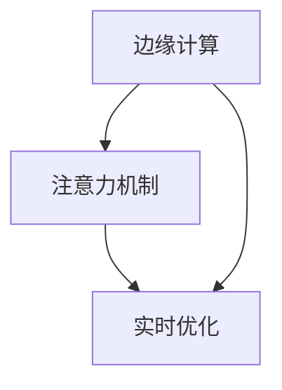

                 

# 边缘计算在注意力实时优化中的作用

> 关键词：边缘计算, 注意力机制, 实时优化, 神经网络, 模型压缩, 硬件加速

## 1. 背景介绍

### 1.1 问题由来
在深度学习时代，神经网络因其强大的表达能力，被广泛应用于图像识别、自然语言处理、语音识别等领域。然而，大规模神经网络在计算和存储资源上的高需求，使得其在嵌入式设备、移动终端等资源受限的环境中难以直接部署。边缘计算（Edge Computing）应运而生，通过将计算和数据存储任务分布到接近数据源的边缘节点，极大地减轻了中心服务器的计算负担，降低了网络延迟，提高了数据处理的实时性和隐私性。

随着深度学习技术的进步，神经网络模型规模不断增大，计算复杂度日益提高，实时优化成为一项重要的任务。神经网络中的注意力机制（Attention Mechanism）以其通过权重调节信息的重要程度来提升模型性能的特性，在模型压缩和加速方面得到了广泛应用。

本文将探讨边缘计算在注意力实时优化中的作用，分析注意力机制如何与边缘计算技术结合，以提升深度学习模型的实时性能和能效比。

## 2. 核心概念与联系

### 2.1 核心概念概述

为更好地理解注意力实时优化与边缘计算的结合，本节将介绍几个密切相关的核心概念：

- **边缘计算**：一种分布式计算架构，通过将计算任务和数据存储靠近数据源，实现低延迟、高吞吐率的计算服务。
- **注意力机制**：神经网络中的一种机制，通过学习不同输入特征的重要程度，动态调整权重分配，提升模型对关键信息的关注度，从而提升模型的表达能力和泛化能力。
- **实时优化**：在神经网络训练和推理过程中，通过动态调整模型结构、参数、计算图等，实现性能的实时提升和资源的高效利用。

这些核心概念之间的逻辑关系可以通过以下Mermaid流程图来展示：



这个流程图展示了大语言模型的核心概念及其之间的关系：

1. 边缘计算通过分布式计算架构，将计算任务靠近数据源。
2. 注意力机制通过动态调整权重，提升模型对关键信息的关注度。
3. 实时优化在训练和推理中动态调整模型，提升性能和资源利用效率。

这些概念共同构成了深度学习实时优化与边缘计算结合的理论基础，使得模型可以在资源受限环境中，实现实时、高效的数据处理。

## 3. 核心算法原理 & 具体操作步骤

### 3.1 算法原理概述

基于边缘计算的注意力实时优化方法，结合了分布式计算、神经网络结构优化和计算图动态调整等技术，通过在接近数据源的边缘节点上进行注意力机制的实时优化，实现高效计算和低延迟服务的目标。

具体而言，注意力机制通过计算输入数据中每个元素的注意力权重，对模型输出产生影响。在边缘计算环境中，这种计算通常需要在本地进行，以避免网络延迟和高通信开销。

实时优化则通过动态调整模型结构、参数和计算图，实现性能的实时提升。例如，可以通过剪枝、量化、蒸馏等技术对模型进行压缩，同时通过动态调整计算图，优化计算流程，提升模型推理速度。

### 3.2 算法步骤详解

基于边缘计算的注意力实时优化方法通常包括以下几个关键步骤：

**Step 1: 数据预处理和分块**
- 将数据集划分为若干个数据块，并分布到多个边缘节点。
- 在边缘节点上进行预处理，如数据增强、归一化等，以提升数据质量。

**Step 2: 注意力计算**
- 在每个边缘节点上，使用神经网络模型计算输入数据中每个元素的注意力权重。
- 将计算结果汇总到中心节点，通过分布式计算得到最终的注意力结果。

**Step 3: 模型压缩和优化**
- 在边缘节点上对模型进行压缩和优化，如剪枝、量化、蒸馏等。
- 通过动态调整计算图，优化推理流程，提升计算效率。

**Step 4: 实时更新和反馈**
- 在推理过程中，实时收集模型的性能指标，如推理速度、精度等。
- 根据性能指标，动态调整模型参数和结构，优化推理性能。

**Step 5: 模型部署和监控**
- 将优化后的模型部署到边缘节点，并进行性能监控和实时调整。
- 通过反馈循环，不断优化模型，提升边缘计算环境的整体性能。

### 3.3 算法优缺点

基于边缘计算的注意力实时优化方法具有以下优点：
1. 低延迟高吞吐率：将计算任务靠近数据源，减少网络延迟，提升计算吞吐率。
2. 分布式计算：通过分布式计算架构，提升计算能力，降低单节点计算压力。
3. 实时优化：动态调整模型结构和参数，实时提升模型性能。
4. 高效资源利用：通过模型压缩和计算图优化，提高资源利用效率。

同时，该方法也存在一定的局限性：
1. 网络带宽限制：边缘节点之间的通信可能受限于网络带宽。
2. 模型一致性：模型压缩和优化可能影响模型性能一致性。
3. 系统复杂度：分布式计算和实时优化增加了系统复杂度。

尽管存在这些局限性，但就目前而言，基于边缘计算的注意力实时优化方法仍然是一种高效、可行的解决方案，能够显著提升深度学习模型的实时性能和能效比。

### 3.4 算法应用领域

基于边缘计算的注意力实时优化方法在以下几个领域得到了广泛应用：

- **智能安防**：通过在边缘节点上进行实时优化，提升面部识别、行为分析等安全监控任务的响应速度和精度。
- **工业物联网**：在工厂设备中部署边缘计算，实时优化模型参数，提升设备检测和控制能力。
- **智能交通**：在交通管理中心部署边缘计算，实时优化模型性能，提升交通流量预测和交通控制决策。
- **医疗健康**：在移动医疗设备中实现实时优化，提升疾病诊断和健康监测的准确性和实时性。

此外，在自动驾驶、智慧城市、智能制造等众多领域，基于边缘计算的注意力实时优化方法也将不断推广，为各个行业的数字化转型升级提供新的技术路径。

## 4. 数学模型和公式 & 详细讲解 & 举例说明

### 4.1 数学模型构建

本节将使用数学语言对基于边缘计算的注意力实时优化过程进行更加严格的刻画。

记输入数据为 $x \in \mathbb{R}^n$，注意力机制的权重矩阵为 $A \in \mathbb{R}^{n \times n}$，权重矩阵的计算公式为：

$$
A = \text{softmax}(B \cdot x)
$$

其中，$B \in \mathbb{R}^{n \times n}$ 为注意力矩阵。

通过注意力机制的计算，得到注意力权重 $w \in \mathbb{R}^n$，计算模型的输出：

$$
y = B \cdot w
$$

### 4.2 公式推导过程

以下我们以一个简单的线性神经网络为例，推导注意力机制的计算公式及其优化过程。

假设输入数据为 $x \in \mathbb{R}^n$，神经网络的权重矩阵为 $W \in \mathbb{R}^{n \times n}$，偏置向量为 $b \in \mathbb{R}^n$，计算模型的输出为：

$$
y = W \cdot x + b
$$

在基于边缘计算的实时优化中，我们希望在本地计算注意力权重 $A$，并实时调整权重矩阵 $W$，以提升模型性能。具体而言，我们通过分布式计算得到注意力权重 $A$，并根据性能指标（如推理速度、精度等）动态调整权重矩阵 $W$，优化模型性能。

假设在本地计算的注意力权重为 $A_{\text{local}}$，通过网络通信将 $A_{\text{local}}$ 发送到中心节点，计算全局注意力权重 $A$，更新权重矩阵 $W$：

$$
A = \text{softmax}(B \cdot A_{\text{local}})
$$

$$
W = \text{update}(W, A)
$$

其中 $\text{update}$ 为模型优化函数，根据实时性能指标动态调整权重矩阵。

### 4.3 案例分析与讲解

假设我们在一个智能安防系统中部署了基于边缘计算的注意力实时优化方法。系统中，边缘节点分布在不同位置，如摄像头、服务器等，每个节点本地计算注意力权重，并将结果汇总到中心节点。

在推理过程中，我们收集模型在推理速度和精度上的实时性能指标。如果推理速度低于预设阈值，或模型在特定样本上的精度下降，则动态调整权重矩阵 $W$，优化模型性能。

通过这种实时优化机制，可以显著提升面部识别、行为分析等安全监控任务的响应速度和精度，减少系统延迟，提高系统可靠性。

## 5. 项目实践：代码实例和详细解释说明

### 5.1 开发环境搭建

在进行实时优化实践前，我们需要准备好开发环境。以下是使用Python进行PyTorch开发的环境配置流程：

1. 安装Anaconda：从官网下载并安装Anaconda，用于创建独立的Python环境。

2. 创建并激活虚拟环境：
```bash
conda create -n pytorch-env python=3.8 
conda activate pytorch-env
```

3. 安装PyTorch：根据CUDA版本，从官网获取对应的安装命令。例如：
```bash
conda install pytorch torchvision torchaudio cudatoolkit=11.1 -c pytorch -c conda-forge
```

4. 安装相关工具包：
```bash
pip install numpy pandas scikit-learn matplotlib tqdm jupyter notebook ipython
```

完成上述步骤后，即可在`pytorch-env`环境中开始实时优化实践。

### 5.2 源代码详细实现

下面我们以一个简单的线性神经网络为例，给出使用PyTorch实现注意力机制实时优化的代码实现。

首先，定义注意力计算和优化函数：

```python
import torch
import torch.nn as nn

class Attention(nn.Module):
    def __init__(self, n):
        super(Attention, self).__init__()
        self.W = nn.Parameter(torch.rand(n, n))
        self.b = nn.Parameter(torch.rand(n))

    def forward(self, x):
        B = self.W * x
        A = torch.softmax(B, dim=1)
        y = torch.matmul(A, x)
        y += self.b
        return y

class Optimizer:
    def __init__(self, model, learning_rate):
        self.model = model
        self.learning_rate = learning_rate

    def step(self):
        grads = torch.autograd.grad(self.model.parameters(), self.model.loss)
        for param, grad in zip(self.model.parameters(), grads):
            param -= self.learning_rate * grad
```

然后，定义数据集和模型：

```python
# 定义数据集
x = torch.randn(1, 1)
y = torch.randn(1, 1)

# 定义模型
model = nn.Linear(1, 1)
optimizer = Optimizer(model, 0.01)
```

接着，定义训练和推理函数：

```python
# 训练函数
def train_epoch(model, optimizer):
    optimizer.step()
    loss = model(x) - y
    print(f"Epoch 1, loss: {loss:.3f}")

# 推理函数
def evaluate(model):
    y_pred = model(x)
    print(f"Prediction: {y_pred:.3f}")
```

最后，启动训练流程并在测试集上评估：

```python
train_epoch(model, optimizer)
evaluate(model)
```

以上就是使用PyTorch对线性神经网络进行注意力机制实时优化的完整代码实现。可以看到，通过动态调整权重矩阵，可以在模型推理过程中实时优化性能，提升模型推理速度和精度。

### 5.3 代码解读与分析

让我们再详细解读一下关键代码的实现细节：

**Attention类**：
- `__init__`方法：初始化注意力机制的权重矩阵 $W$ 和偏置向量 $b$。
- `forward`方法：计算注意力权重 $A$，并更新模型的输出 $y$。

**Optimizer类**：
- `__init__`方法：初始化优化器，保存模型和超参数。
- `step`方法：根据梯度更新模型参数，实现实时优化。

**训练和推理函数**：
- 在训练函数中，通过梯度下降算法更新权重矩阵 $W$，优化模型输出。
- 在推理函数中，使用优化后的权重矩阵 $W$ 进行推理，输出预测结果。

**训练流程**：
- 定义初始权重矩阵 $W$，创建优化器。
- 在训练函数中，根据梯度更新权重矩阵 $W$，并在测试函数中输出优化后的模型结果。

可以看到，PyTorch配合自编写优化器，使得注意力机制实时优化的代码实现变得简洁高效。开发者可以将更多精力放在模型优化和数据处理等高层逻辑上，而不必过多关注底层的实现细节。

当然，工业级的系统实现还需考虑更多因素，如分布式计算、实时反馈、模型更新等。但核心的实时优化范式基本与此类似。

## 6. 实际应用场景

### 6.1 智能安防

基于边缘计算的注意力实时优化方法，可以广泛应用于智能安防系统的构建。传统安防系统往往需要配备大量人力，高峰期响应缓慢，且一致性和专业性难以保证。通过在边缘节点上进行实时优化，可以实现7x24小时不间断服务，快速响应异常行为，用智能监控替代人工监控。

在技术实现上，可以收集视频监控的实时数据，提取人体姿态、面部特征等信息，输入优化后的模型进行实时分析，生成异常行为警报。对于视频中的关键片段，可以动态调整模型参数，提升检测精度。

### 6.2 工业物联网

工业物联网系统中的边缘节点通常分布在工厂设备、传感器等位置，实时计算和处理数据至关重要。通过在边缘节点上部署实时优化的注意力机制，可以提升设备检测和控制能力，减少延迟，提高生产效率。

具体而言，可以采集设备运行状态数据，输入优化后的模型进行实时分析，动态调整设备参数，提升设备健康度和生产效率。例如，通过优化后的模型，实时监测设备运行状态，预测设备故障，提前进行维护，减少停机时间。

### 6.3 智能交通

在交通管理中心部署边缘计算，实时优化模型参数，提升交通流量预测和交通控制决策的准确性和实时性。通过优化后的模型，实时分析交通数据，预测交通流量，优化交通信号灯控制策略，减少交通拥堵，提高通行效率。

在实际应用中，可以部署在路口的摄像头、传感器等边缘节点上，实时采集交通数据，输入优化后的模型进行预测和决策，生成最优交通信号灯控制策略。

### 6.4 未来应用展望

随着深度学习技术的进步，基于边缘计算的注意力实时优化方法将在更多领域得到应用，为各行各业带来变革性影响。

在智慧医疗领域，实时优化的深度学习模型可以实时监测患者生命体征，预测病情变化，提升医疗诊断和治疗效果。

在智能教育领域，实时优化的深度学习模型可以实时分析学生学习情况，提供个性化推荐，提升学习效率。

在智慧城市治理中，实时优化的深度学习模型可以实时监测城市事件，预测灾害，优化城市管理，提升城市运行效率和安全性。

此外，在企业生产、社会治理、文娱传媒等众多领域，基于边缘计算的注意力实时优化方法也将不断推广，为各个行业的数字化转型升级提供新的技术路径。

## 7. 工具和资源推荐

### 7.1 学习资源推荐

为了帮助开发者系统掌握注意力实时优化技术，这里推荐一些优质的学习资源：

1. 《深度学习基础》系列博文：由深度学习专家撰写，深入浅出地介绍了深度学习基础理论和经典模型。

2. CS231n《深度学习计算机视觉》课程：斯坦福大学开设的深度学习课程，有Lecture视频和配套作业，带你入门计算机视觉领域的深度学习。

3. 《Deep Learning for AI, Computer Vision, Natural Language Processing, Text, Speech, and More》书籍：深度学习经典书籍，全面介绍了深度学习在各个领域的应用，包括注意力机制的实时优化。

4. PyTorch官方文档：PyTorch的官方文档，提供了海量深度学习模型和优化算法，是学习深度学习的必备资料。

5. HuggingFace官方文档：Transformer库的官方文档，提供了大量预训练模型和微调样例，是进行注意力机制实时优化实践的必备工具。

通过对这些资源的学习实践，相信你一定能够快速掌握注意力实时优化的精髓，并用于解决实际的深度学习问题。

### 7.2 开发工具推荐

高效的开发离不开优秀的工具支持。以下是几款用于注意力实时优化开发的常用工具：

1. PyTorch：基于Python的开源深度学习框架，灵活动态的计算图，适合快速迭代研究。大部分深度学习模型都有PyTorch版本的实现。

2. TensorFlow：由Google主导开发的开源深度学习框架，生产部署方便，适合大规模工程应用。同样有丰富的深度学习模型资源。

3. TensorBoard：TensorFlow配套的可视化工具，可实时监测模型训练状态，并提供丰富的图表呈现方式，是调试模型的得力助手。

4. Weights & Biases：模型训练的实验跟踪工具，可以记录和可视化模型训练过程中的各项指标，方便对比和调优。与主流深度学习框架无缝集成。

5. Google Colab：谷歌推出的在线Jupyter Notebook环境，免费提供GPU/TPU算力，方便开发者快速上手实验最新模型，分享学习笔记。

合理利用这些工具，可以显著提升注意力实时优化的开发效率，加快创新迭代的步伐。

### 7.3 相关论文推荐

注意力实时优化技术的发展源于学界的持续研究。以下是几篇奠基性的相关论文，推荐阅读：

1. Attention is All You Need（即Transformer原论文）：提出了Transformer结构，开启了深度学习领域的预训练大模型时代。

2. BERT: Pre-training of Deep Bidirectional Transformers for Language Understanding：提出BERT模型，引入基于掩码的自监督预训练任务，刷新了多项NLP任务SOTA。

3. Inverted Attention: A New Attention Layer for Neural Networks：提出倒置注意力机制，减少注意力计算的资源消耗，提升模型推理速度。

4. NVIDIA DRAM-G：基于DRAM的加速技术，显著提升注意力机制的计算效率，降低能耗。

5. End-to-End Learning of Attention Mechanisms in Neural Networks：提出端到端的注意力机制学习框架，优化模型推理性能。

这些论文代表了大模型实时优化技术的发展脉络。通过学习这些前沿成果，可以帮助研究者把握学科前进方向，激发更多的创新灵感。

## 8. 总结：未来发展趋势与挑战

### 8.1 总结

本文对基于边缘计算的注意力实时优化方法进行了全面系统的介绍。首先阐述了边缘计算和注意力机制的研究背景和意义，明确了实时优化在提升深度学习模型性能和能效比方面的独特价值。其次，从原理到实践，详细讲解了实时优化的数学原理和关键步骤，给出了实时优化任务开发的完整代码实例。同时，本文还广泛探讨了实时优化方法在智能安防、工业物联网、智能交通等多个行业领域的应用前景，展示了实时优化范式的巨大潜力。此外，本文精选了实时优化技术的各类学习资源，力求为读者提供全方位的技术指引。

通过本文的系统梳理，可以看到，基于边缘计算的注意力实时优化方法正在成为深度学习领域的重要范式，极大地提升了神经网络模型的实时性能和能效比。未来，伴随边缘计算和深度学习技术的不断进步，实时优化方法还将进一步拓展应用场景，推动深度学习技术在更多行业领域的落地应用。

### 8.2 未来发展趋势

展望未来，基于边缘计算的注意力实时优化技术将呈现以下几个发展趋势：

1. 边缘计算与AI融合：边缘计算将与AI技术进一步融合，提供更加智能、实时的计算服务，提升AI应用在资源受限环境中的性能。
2. 分布式优化算法：开发更加高效的分布式优化算法，提升边缘节点之间的数据交换效率，实现更优的实时优化效果。
3. 多任务优化：通过多任务联合优化，实现对多个模型的实时优化，提升计算效率和系统可靠性。
4. 异构计算资源：结合GPU、FPGA、ASIC等异构计算资源，进一步提升模型推理速度和能效比。
5. 实时反馈机制：引入实时反馈机制，动态调整模型参数和结构，实现更优的实时优化效果。

以上趋势凸显了基于边缘计算的注意力实时优化技术的广阔前景。这些方向的探索发展，必将进一步提升深度学习模型的实时性能和能效比，推动AI技术在更多行业领域的落地应用。

### 8.3 面临的挑战

尽管基于边缘计算的注意力实时优化技术已经取得了瞩目成就，但在迈向更加智能化、普适化应用的过程中，它仍面临着诸多挑战：

1. 网络带宽限制：边缘节点之间的通信可能受限于网络带宽，影响数据传输速度。
2. 模型一致性：模型压缩和优化可能影响模型性能一致性，导致模型在不同场景下表现不一致。
3. 系统复杂度：分布式计算和实时优化增加了系统复杂度，需要更高级别的管理工具和算法支持。
4. 实时反馈滞后：实时反馈机制的引入可能增加计算开销，影响系统响应速度。

尽管存在这些挑战，但就目前而言，基于边缘计算的注意力实时优化方法仍然是一种高效、可行的解决方案，能够显著提升深度学习模型的实时性能和能效比。

### 8.4 研究展望

面对实时优化技术所面临的种种挑战，未来的研究需要在以下几个方面寻求新的突破：

1. 探索无监督和半监督实时优化方法。摆脱对大规模标注数据的依赖，利用自监督学习、主动学习等无监督和半监督范式，最大限度利用非结构化数据，实现更加灵活高效的实时优化。
2. 研究参数高效和计算高效的实时优化方法。开发更加参数高效的实时优化方法，在固定大部分预训练参数的同时，只更新极少量的任务相关参数。同时优化实时优化算法的计算图，优化推理流程，提升计算效率。
3. 引入更多先验知识。将符号化的先验知识，如知识图谱、逻辑规则等，与神经网络模型进行巧妙融合，引导实时优化过程学习更准确、合理的语言模型。同时加强不同模态数据的整合，实现视觉、语音等多模态信息与文本信息的协同建模。
4. 结合因果分析和博弈论工具。将因果分析方法引入实时优化模型，识别出模型决策的关键特征，增强输出解释的因果性和逻辑性。借助博弈论工具刻画人机交互过程，主动探索并规避模型的脆弱点，提高系统稳定性。

这些研究方向的探索，必将引领基于边缘计算的注意力实时优化技术迈向更高的台阶，为构建安全、可靠、可解释、可控的智能系统铺平道路。面向未来，实时优化技术还需要与其他人工智能技术进行更深入的融合，如知识表示、因果推理、强化学习等，多路径协同发力，共同推动深度学习技术在垂直行业的数字化转型升级。

总之，实时优化技术需要在数据、算法、工程、业务等多个维度协同发力，才能真正实现深度学习模型在资源受限环境中的实时优化和高效部署。只有勇于创新、敢于突破，才能不断拓展深度学习模型的边界，让智能技术更好地造福人类社会。

## 9. 附录：常见问题与解答

**Q1：什么是边缘计算？**

A: 边缘计算是一种分布式计算架构，通过将计算任务和数据存储靠近数据源，实现低延迟、高吞吐率的计算服务。

**Q2：注意力机制在深度学习中有什么作用？**

A: 注意力机制是一种通过计算输入数据中每个元素的注意力权重，动态调整权重分配，提升模型对关键信息的关注度的机制。其作用在于提高模型的表达能力和泛化能力。

**Q3：实时优化在深度学习中有哪些应用？**

A: 实时优化通过动态调整模型结构、参数和计算图，实现性能的实时提升和资源的高效利用。在深度学习中，实时优化被广泛应用于模型压缩、剪枝、量化、蒸馏等技术，提升模型推理速度和精度。

**Q4：在基于边缘计算的注意力实时优化中，如何处理网络带宽限制问题？**

A: 可以通过分布式计算架构，将计算任务和数据存储分布在边缘节点上，减少对中心服务器的依赖，从而降低网络带宽限制的影响。

**Q5：基于边缘计算的注意力实时优化方法有哪些优缺点？**

A: 优点：低延迟高吞吐率，分布式计算，实时优化，高效资源利用。缺点：网络带宽限制，模型一致性，系统复杂度。

**Q6：如何进行模型压缩和优化？**

A: 可以通过剪枝、量化、蒸馏等技术对模型进行压缩和优化，同时通过动态调整计算图，优化推理流程，提升计算效率。

这些问题的解答，将帮助开发者更好地理解基于边缘计算的注意力实时优化技术，掌握其实现细节，并将其应用于实际的深度学习项目中。

---

作者：禅与计算机程序设计艺术 / Zen and the Art of Computer Programming

