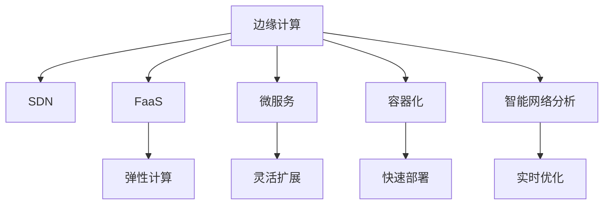

                 

# 边缘计算遇上软件2.0，智能将无处不在

> 关键词：边缘计算, 软件2.0, 智能, 物联网, 人工智能

## 1. 背景介绍

### 1.1 问题由来
在信息技术飞速发展的今天，物联网(IoT)、人工智能(AI)等新兴技术迅猛崛起，极大地改变了我们的生活和工作方式。然而，它们带来的同时也带来了严峻的挑战：数据的海量增长、计算资源的急剧膨胀、网络带宽的巨大压力等。这种背景下，传统集中式的数据中心计算方式已经难以满足需求。边缘计算(Edge Computing)应运而生，它的出现为物联网设备间数据处理和交互提供了新的解决方案。

边缘计算的核心思想是将数据和计算任务分布在物理设备（如手机、传感器、智能设备等）上进行处理，从而减少网络延迟、降低带宽成本、提高响应速度和效率。由于边缘计算能够更加贴近数据源，对实时性和安全性要求较高的应用场景（如自动驾驶、智慧城市、工业互联网等）尤为适用。

### 1.2 问题核心关键点
边缘计算与软件2.0的结合，使得分布式系统变得更加智能化和高效化。软件2.0代表了以软件为中心的设计思想，注重软件的易用性、安全性、可维护性和可扩展性，通过对软件生命周期的管理，使得软件能够更好地适应需求的变化。

边缘计算与软件2.0的结合主要体现在以下几个方面：
1. 软件定义网络(SDN)：通过软件控制硬件，实现网络的灵活配置和优化。
2. 函数即服务(FaaS)：将计算任务以函数的形式部署在边缘设备上，按需计算，提高计算资源的利用率。
3. 微服务架构：将应用程序拆分为多个独立运行的服务，增强系统的灵活性和扩展性。
4. 容器化部署：通过容器化技术，实现软件在不同边缘设备上的快速部署和迁移。
5. 智能网络分析：通过机器学习和大数据分析，对网络数据进行实时监控和优化。

## 2. 核心概念与联系

### 2.1 核心概念概述

为更好地理解边缘计算与软件2.0结合的原理和应用，本节将介绍几个密切相关的核心概念：

- 边缘计算(Edge Computing)：指将计算任务在物理设备上就近处理，而不是集中在远程的数据中心进行。边缘计算能够快速响应用户请求，减少网络延迟，降低数据传输成本。
- 软件定义网络(SDN)：一种基于软件控制的网络架构，可以实现网络的集中管理和灵活配置。SDN通过将网络设备与控制平面分离，实现网络流量的动态调整。
- 函数即服务(FaaS)：一种以函数为基本计算单位的服务模型，用户无需关注底层硬件，只需上传代码，即可按需执行计算任务。FaaS可以实现更高效的资源利用和弹性计算。
- 微服务架构(Microservices Architecture)：将应用程序拆分为多个独立运行的小服务，每个服务负责特定的功能，通过轻量级通信实现各服务间的协作。
- 容器化部署(Containerization)：通过容器技术，将应用程序及其依赖打包成独立运行的环境，实现跨平台、快速部署和迁移。
- 智能网络分析(Intelligent Network Analytics)：利用机器学习和大数据分析技术，对网络数据进行实时分析和优化，提升网络的性能和稳定性。

这些核心概念之间的逻辑关系可以通过以下Mermaid流程图来展示：



这个流程图展示了边缘计算与软件2.0结合的关键技术点和相互关系：

1. 边缘计算通过SDN技术，实现网络的集中管理和灵活配置。
2. 边缘计算支持FaaS模型，实现弹性的计算资源管理。
3. 微服务架构增强边缘计算系统的灵活性和扩展性。
4. 容器化部署使得边缘计算系统能够快速部署和迁移。
5. 智能网络分析提升边缘计算的性能和稳定性。

## 3. 核心算法原理 & 具体操作步骤
### 3.1 算法原理概述

边缘计算与软件2.0的结合，本质上是一种分布式计算和智能软件的协同工作方式。其核心思想是通过软件定义网络控制硬件设备的分布式计算资源，结合函数即服务和微服务架构，实现计算任务的动态管理和资源的高效利用，并通过智能网络分析提升系统的性能和稳定性。

形式化地，假设边缘计算系统由$N$个边缘设备组成，每个设备上部署了$M$个服务函数。服务函数$f_j$在设备$i$上执行，其输入为$d$个数据包。则系统总体性能可以用以下模型描述：

$$
P = \sum_{i=1}^N \sum_{j=1}^M P_{i,j}
$$

其中$P_{i,j}$表示设备$i$上函数$f_j$的性能，包括响应时间、吞吐量、资源利用率等。性能$P$受到多个因素的影响，如网络带宽、计算资源、数据包大小、服务部署策略等。

### 3.2 算法步骤详解

边缘计算与软件2.0结合的算法步骤主要包括以下几个关键步骤：

**Step 1: 准备边缘设备和软件环境**
- 收集设备的物理硬件参数，如CPU、内存、存储、网络带宽等，建立设备数据库。
- 选择合适的编程语言和框架，如Python、TensorFlow、Kubernetes等。
- 设计边缘计算的SDN网络拓扑和控制策略，实现网络流量动态调整。

**Step 2: 设计服务函数和微服务架构**
- 将计算任务拆分为多个独立运行的服务函数，每个函数负责特定的功能。
- 服务函数通过API接口进行通信，确保各函数间的协同工作。
- 使用容器化技术将服务函数部署到边缘设备上，实现快速部署和迁移。

**Step 3: 配置FaaS和智能网络分析**
- 将计算任务设计为FaaS函数，按需执行计算任务。
- 使用机器学习和大数据分析技术，对网络数据进行实时分析和优化，提升系统的性能和稳定性。
- 应用SDN技术，实现网络的集中管理和动态调整，优化资源分配。

**Step 4: 执行优化和监控**
- 根据性能指标和资源利用率，实时调整服务函数和网络拓扑。
- 使用监控工具，如Prometheus、Grafana等，实时监控边缘计算系统的状态和性能。
- 使用告警机制，及时发现和处理异常情况，保证系统的稳定运行。

**Step 5: 评估和迭代**
- 根据实际运行数据，评估边缘计算系统的性能和资源利用率。
- 根据评估结果，调整服务函数和资源分配策略。
- 持续优化系统，不断提高系统的智能性和稳定性。

### 3.3 算法优缺点

边缘计算与软件2.0结合的算法具有以下优点：
1. 提升响应速度：通过在物理设备上就近处理数据，减少网络延迟，提高响应速度。
2. 降低成本：减少数据传输带宽，降低传输成本。
3. 提高资源利用率：通过FaaS和微服务架构，实现弹性计算和资源动态管理。
4. 增强系统灵活性：通过微服务架构和容器化部署，实现系统的快速扩展和灵活调整。
5. 提升性能和稳定性：通过智能网络分析，实时优化网络流量和资源分配。

同时，该算法也存在一些局限性：
1. 数据分散：多个设备之间的数据需要实时同步和共享，存在一定复杂性。
2. 安全风险：边缘设备的数据安全需要特别重视，避免数据泄露和攻击。
3. 维护复杂性：多个设备和服务函数的管理和维护需要较高水平的专业知识。
4. 资源竞争：不同服务函数和设备之间的资源竞争可能导致资源浪费。
5. 部署成本：初始的硬件和软件部署成本较高。

尽管存在这些局限性，但就目前而言，边缘计算与软件2.0结合的算法是实现智能计算和分布式网络管理的最佳实践，具有广泛的应用前景。

### 3.4 算法应用领域

边缘计算与软件2.0结合的算法已经在多个领域得到了成功应用，例如：

- 智慧城市：通过智能网络分析和SDN技术，优化城市基础设施管理，提高服务响应速度和效率。
- 工业互联网：在工业设备上进行实时数据处理和分析，提升生产效率和设备利用率。
- 自动驾驶：通过边缘计算加速数据处理，减少网络延迟，提高自动驾驶的实时性和安全性。
- 智能医疗：在医疗设备上部署微服务，实现实时数据分析和医疗决策支持。
- 物联网：在各种智能设备上进行数据处理和计算，提升设备的智能化和互联互通能力。

除了上述这些经典应用外，边缘计算与软件2.0的结合还将继续拓展到更多场景中，如智能家居、智慧交通、智能制造等，为各行各业带来新的变革。

## 4. 数学模型和公式 & 详细讲解 & 举例说明
### 4.1 数学模型构建

为了更好地描述边缘计算与软件2.0结合的性能优化模型，本节将通过数学语言进行详细阐述。

假设边缘计算系统由$N$个边缘设备组成，每个设备上部署了$M$个服务函数$f_j$。设备$i$上函数$f_j$的性能$P_{i,j}$可以用响应时间、吞吐量、资源利用率等指标来衡量。设$x_{i,j}$为设备$i$上函数$f_j$的输入数据大小，$s_{i,j}$为设备$i$上函数$f_j$的计算资源大小。则性能模型可以表示为：

$$
P_{i,j} = \frac{S_{i,j}}{x_{i,j} + S_{i,j}}
$$

其中$S_{i,j}$为设备$i$上函数$f_j$的实际可用资源大小。

在实际应用中，还需要考虑以下因素：
1. 设备间的通信延迟：$D_{i,j}$表示设备$i$和设备$j$之间的通信延迟。
2. 网络带宽：$B_{i,j}$表示设备$i$和设备$j$之间的网络带宽。
3. 任务优先级：$W_{i,j}$表示设备$i$上函数$f_j$的优先级。

基于上述模型，可以构建边缘计算系统的总体性能模型：

$$
P = \sum_{i=1}^N \sum_{j=1}^M \frac{S_{i,j}}{x_{i,j} + S_{i,j}} \cdot \frac{1}{1+D_{i,j} + \frac{B_{i,j}}{W_{i,j}}}
$$

### 4.2 公式推导过程

为了优化上述性能模型，需要引入优化算法，如遗传算法、粒子群算法等。这里以粒子群算法为例，进行推导。

设粒子$x$在每次迭代中的位置为$(x_1, x_2, ..., x_M)$，其中$x_1$表示设备$i$上函数$f_j$的输入数据大小，$x_2$表示设备$i$上函数$f_j$的计算资源大小。粒子速度$v$表示每次迭代中参数的变化量。则粒子群算法的目标函数为：

$$
F(x) = \sum_{i=1}^N \sum_{j=1}^M \frac{S_{i,j}}{x_{i,j} + S_{i,j}} \cdot \frac{1}{1+D_{i,j} + \frac{B_{i,j}}{W_{i,j}}}
$$

设$\omega$为惯性权重，$c_1$和$c_2$为粒子群算法的参数，$r_1$和$r_2$为随机数。则粒子群算法的更新公式为：

$$
v_{i,j} = \omega v_{i,j} + c_1 r_1 \cdot \frac{P_{\text{best}} - x_{i,j}}{w} + c_2 r_2 \cdot \frac{G_{\text{best}} - x_{i,j}}{w}
$$

其中$P_{\text{best}}$表示粒子的最优位置，$G_{\text{best}}$表示种群的最优位置。

### 4.3 案例分析与讲解

以智慧城市为例，进行具体分析。智慧城市通过边缘计算与软件2.0结合，可以实现以下功能：

1. 智能交通：通过实时数据分析，优化交通信号灯控制，减少交通拥堵。
2. 环境监测：在城市各个角落部署传感器，实时监测空气质量、噪音水平等环境指标。
3. 智能照明：根据实时人流量数据，智能调整路灯亮度，节约能源。
4. 公共安全：通过视频监控数据分析，实时预警异常情况，提升公共安全水平。

## 5. 项目实践：代码实例和详细解释说明
### 5.1 开发环境搭建

在进行项目实践前，我们需要准备好开发环境。以下是使用Python进行Docker容器搭建边缘计算系统的环境配置流程：

1. 安装Docker：从官网下载并安装Docker，搭建虚拟化环境。
2. 安装Docker Compose：通过pip安装Docker Compose，用于管理多个容器。
3. 安装Kubernetes：通过apt-get安装Kubernetes，实现容器编排和资源管理。
4. 安装TensorFlow：通过pip安装TensorFlow，提供机器学习库支持。
5. 安装Flask：通过pip安装Flask，用于构建RESTful API服务。

完成上述步骤后，即可在Docker环境中开始项目实践。

### 5.2 源代码详细实现

下面我们以智能交通系统为例，给出使用Docker和Kubernetes实现边缘计算系统的PyTorch代码实现。

首先，定义智能交通系统的数据处理函数：

```python
import tensorflow as tf
import flask
import requests

class TrafficDataProcessor:
    def __init__(self, data_url):
        self.data_url = data_url
        
    def process_data(self):
        response = requests.get(self.data_url)
        data = json.loads(response.text)
        return data
```

然后，定义微服务函数：

```python
class TrafficController(tf.keras.Model):
    def __init__(self):
        super(TrafficController, self).__init__()
        self.dense = tf.keras.layers.Dense(64, activation='relu')
        self.output = tf.keras.layers.Dense(1, activation='sigmoid')
    
    def call(self, inputs):
        x = self.dense(inputs)
        x = self.output(x)
        return x
```

接着，定义Docker容器中的Flask服务：

```python
app = flask.Flask(__name__)
@app.route('/')
def index():
    return 'Hello, World!'
```

最后，使用Docker Compose定义服务文件，并启动服务：

```yaml
version: '3'
services:
  traffic-controller:
    build: .
    command: python traffic_controller.py
    ports:
      - "5000:5000"
    depends_on:
      - traffic-data-processor
  traffic-data-processor:
    image: traffic_data_processor:latest
    command: python traffic_data_processor.py
    depends_on:
      - traffic-server
```

运行以下命令启动服务：

```bash
docker-compose up
```

以上就是在Docker环境中实现智能交通系统的边缘计算系统的完整代码实现。可以看到，通过Docker和Kubernetes，可以方便地构建和管理多个容器，实现微服务架构。

### 5.3 代码解读与分析

让我们再详细解读一下关键代码的实现细节：

**TrafficDataProcessor类**：
- `__init__`方法：初始化数据URL。
- `process_data`方法：从URL获取交通数据，并进行预处理。

**TrafficController类**：
- `__init__`方法：定义模型结构。
- `call`方法：定义模型的前向传播过程。

**Flask服务**：
- `index`方法：定义API接口，用于监控系统状态。

**Docker Compose文件**：
- 定义了两个服务：`traffic-controller`和`traffic-data-processor`，分别用于模型训练和数据处理。
- 通过`depends_on`关键字，定义了服务的依赖关系。
- 配置了容器的端口映射，使得外部可以访问API服务。

可以看到，Docker和Kubernetes为边缘计算系统的微服务架构提供了强有力的支持，使得服务部署和管理变得简便易行。

## 6. 实际应用场景
### 6.1 智能城市

基于边缘计算与软件2.0结合的智能城市项目，可以整合多个领域的传感器数据，实现智慧化管理。具体而言，可以包括：

- 交通管理：通过实时数据分析，优化交通信号灯控制，减少交通拥堵。
- 环境监测：部署传感器，实时监测空气质量、噪音水平等环境指标。
- 公共安全：通过视频监控数据分析，实时预警异常情况，提升公共安全水平。
- 能源管理：智能调整路灯亮度，节约能源。

### 6.2 工业互联网

在工业互联网中，通过边缘计算与软件2.0结合，可以实现设备的远程监控和维护。具体而言，可以包括：

- 设备状态监测：实时监控设备运行状态，及时发现异常情况。
- 预测性维护：通过数据分析，预测设备故障，提前进行维护。
- 生产调度优化：优化生产流程，提高生产效率。
- 质量控制：实时监控产品质量，提升产品质量。

### 6.3 自动驾驶

自动驾驶是边缘计算与软件2.0结合的重要应用场景。通过边缘计算，可以实现实时数据处理和分析，提升自动驾驶的安全性和可靠性。具体而言，可以包括：

- 实时环境感知：通过传感器数据处理，实时感知周围环境。
- 路径规划优化：通过数据分析，优化驾驶路径，避免拥堵和事故。
- 事故预警：通过数据分析，实时预警潜在事故风险。
- 人机交互优化：通过智能语音助手，提升人机交互体验。

### 6.4 未来应用展望

随着边缘计算与软件2.0技术的不断发展，其应用前景将更加广阔。未来，边缘计算与软件2.0结合将在更多领域得到应用，如智能家居、智慧交通、智能制造等，为各行各业带来新的变革。

## 7. 工具和资源推荐
### 7.1 学习资源推荐

为了帮助开发者系统掌握边缘计算与软件2.0的理论基础和实践技巧，这里推荐一些优质的学习资源：

1. 《边缘计算：原理与实践》系列博文：由边缘计算技术专家撰写，深入浅出地介绍了边缘计算的基本原理和最新进展。

2. 《软件定义网络(SDN)原理与实现》课程：网络领域的经典课程，涵盖SDN的基本概念和实现方法，适合进一步学习SDN技术。

3. 《函数即服务(FaaS)》书籍：介绍FaaS的基本概念和应用场景，适合深入了解FaaS技术。

4. 《微服务架构设计》课程：讲解微服务架构的设计原则和实现方法，适合进一步学习微服务架构。

5. 《Docker与Kubernetes实战》书籍：介绍Docker和Kubernetes的基本概念和实战应用，适合学习容器化和编排技术。

6. 《TensorFlow实战》书籍：介绍TensorFlow的基本概念和实现方法，适合进一步学习深度学习技术。

通过对这些资源的学习实践，相信你一定能够快速掌握边缘计算与软件2.0的精髓，并用于解决实际的智能计算问题。

### 7.2 开发工具推荐

高效的开发离不开优秀的工具支持。以下是几款用于边缘计算与软件2.0开发的常用工具：

1. Docker：容器化技术，方便应用在不同边缘设备上的快速部署和迁移。

2. Kubernetes：容器编排技术，实现多容器的自动化管理和调度。

3. TensorFlow：深度学习库，支持分布式计算和模型训练。

4. Flask：构建RESTful API服务，方便与外部系统进行交互。

5. PyTorch：深度学习库，提供丰富的模型和工具支持。

6. Prometheus：监控工具，实时采集和分析系统指标。

7. Grafana：可视化工具，方便监控和展示系统状态。

合理利用这些工具，可以显著提升边缘计算与软件2.0开发的效率，加速创新迭代的步伐。

### 7.3 相关论文推荐

边缘计算与软件2.0的发展源于学界的持续研究。以下是几篇奠基性的相关论文，推荐阅读：

1. On the Edge: A Survey of Edge Computing Technology and Research.论文综述了边缘计算的基本概念和技术，适合全面了解边缘计算。

2. A Survey on Machine Learning-Based Edge Computing: Taxonomy and Perspectives.论文综述了边缘计算中机器学习的应用，适合进一步了解边缘计算和机器学习的结合。

3. Software-Defined Edge: A Survey of Research on Edge Computing.论文综述了边缘计算与软件定义的结合，适合了解SDN技术在边缘计算中的应用。

4. edgeFaaS: A High-Throughput Edge Computing Platform.论文介绍了一种基于FaaS的边缘计算平台，适合了解FaaS技术在边缘计算中的应用。

5. On-device Machine Learning: The Next Generation of Neural Network Inference.论文综述了基于边缘设备的机器学习技术，适合了解边缘计算与机器学习的结合。

这些论文代表了大语言模型微调技术的发展脉络。通过学习这些前沿成果，可以帮助研究者把握学科前进方向，激发更多的创新灵感。

## 8. 总结：未来发展趋势与挑战

### 8.1 总结

本文对边缘计算与软件2.0结合的方法进行了全面系统的介绍。首先阐述了边缘计算与软件2.0的研究背景和意义，明确了结合技术的强大性能和应用潜力。其次，从原理到实践，详细讲解了边缘计算与软件2.0结合的数学模型和算法步骤，给出了微服务架构和容器化部署的代码实例。同时，本文还广泛探讨了边缘计算与软件2.0在智能城市、工业互联网、自动驾驶等多个领域的应用前景，展示了结合技术的广阔前景。此外，本文精选了结合技术的各类学习资源，力求为读者提供全方位的技术指引。

通过本文的系统梳理，可以看到，边缘计算与软件2.0结合的技术正在成为分布式系统计算和智能软件设计的最佳实践，极大地提升了系统的性能和灵活性。这种技术融合将为各行各业带来新的变革，促进智能化时代的到来。

### 8.2 未来发展趋势

展望未来，边缘计算与软件2.0结合技术将呈现以下几个发展趋势：

1. 计算资源下沉。随着边缘计算设备性能的提升，更多的计算任务将在边缘设备上进行处理，减少网络延迟，提升计算效率。

2. 智能网络优化。通过机器学习和大数据分析技术，对网络数据进行实时分析和优化，提升网络的性能和稳定性。

3. 边缘计算与云平台结合。边缘计算与云平台相结合，实现更灵活的资源管理和优化调度。

4. 边缘计算与区块链结合。利用区块链技术，确保边缘计算的数据安全和隐私保护。

5. 多模态数据融合。将边缘计算与其他传感器、物联网设备等数据源融合，提升系统的智能化水平。

6. 边缘计算与自动化结合。通过自动化技术，实现边缘计算系统的自动管理和优化。

以上趋势凸显了边缘计算与软件2.0结合技术的广阔前景。这些方向的探索发展，将进一步提升系统的性能和智能化水平，为各行各业带来新的变革。

### 8.3 面临的挑战

尽管边缘计算与软件2.0结合技术已经取得了瞩目成就，但在迈向更加智能化、普适化应用的过程中，它仍面临着诸多挑战：

1. 设备多样性：不同边缘设备的性能和能力参差不齐，需要统一标准和管理。

2. 数据安全和隐私：边缘设备的数据安全和隐私保护需要特别重视，避免数据泄露和攻击。

3. 资源管理：边缘计算系统中资源的分配和管理需要更加高效和智能。

4. 跨平台兼容性：不同平台之间的兼容性问题需要解决，以便跨平台部署和迁移。

5. 技术复杂度：边缘计算与软件2.0结合技术较为复杂，需要专业的知识和技能。

尽管存在这些挑战，但边缘计算与软件2.0结合技术的潜力巨大，必将推动智能化时代的到来。

### 8.4 研究展望

面对边缘计算与软件2.0结合技术所面临的种种挑战，未来的研究需要在以下几个方面寻求新的突破：

1. 引入新的通信协议：引入新的通信协议，解决不同设备之间的兼容性和互通性问题。

2. 发展自适应算法：开发自适应算法，实现边缘计算系统的动态管理和优化。

3. 提高数据安全水平：利用区块链技术，确保边缘计算系统的数据安全和隐私保护。

4. 增强跨平台兼容性：开发跨平台兼容性技术，解决不同平台之间的兼容性问题。

5. 提升智能化水平：通过机器学习和人工智能技术，提升边缘计算系统的智能化水平。

这些研究方向的探索，必将引领边缘计算与软件2.0结合技术迈向更高的台阶，为构建智能化时代的基础设施提供新的思路。

## 9. 附录：常见问题与解答

**Q1：边缘计算与软件2.0结合的优势是什么？**

A: 边缘计算与软件2.0结合的优势主要体现在以下几个方面：
1. 提升响应速度：通过在物理设备上就近处理数据，减少网络延迟，提高响应速度。
2. 降低成本：减少数据传输带宽，降低传输成本。
3. 提高资源利用率：通过FaaS和微服务架构，实现弹性计算和资源动态管理。
4. 增强系统灵活性：通过微服务架构和容器化部署，实现系统的快速扩展和灵活调整。
5. 提升性能和稳定性：通过智能网络分析，实时优化网络流量和资源分配。

**Q2：边缘计算与软件2.0结合面临的挑战有哪些？**

A: 边缘计算与软件2.0结合面临的挑战主要包括：
1. 设备多样性：不同边缘设备的性能和能力参差不齐，需要统一标准和管理。
2. 数据安全和隐私：边缘设备的数据安全和隐私保护需要特别重视，避免数据泄露和攻击。
3. 资源管理：边缘计算系统中资源的分配和管理需要更加高效和智能。
4. 跨平台兼容性：不同平台之间的兼容性问题需要解决，以便跨平台部署和迁移。
5. 技术复杂度：边缘计算与软件2.0结合技术较为复杂，需要专业的知识和技能。

**Q3：边缘计算与软件2.0结合的应用场景有哪些？**

A: 边缘计算与软件2.0结合的应用场景主要包括：
1. 智能城市：通过实时数据分析，优化交通信号灯控制，减少交通拥堵。
2. 工业互联网：在工业设备上进行实时数据处理和分析，提升生产效率和设备利用率。
3. 自动驾驶：通过边缘计算加速数据处理，减少网络延迟，提高自动驾驶的安全性和可靠性。
4. 智能家居：通过边缘计算和微服务架构，实现智能家居设备的互联互通。
5. 智慧交通：通过实时数据分析，优化交通信号灯控制，减少交通拥堵。
6. 环境监测：部署传感器，实时监测空气质量、噪音水平等环境指标。
7. 公共安全：通过视频监控数据分析，实时预警异常情况，提升公共安全水平。
8. 能源管理：智能调整路灯亮度，节约能源。

通过本文的系统梳理，可以看到，边缘计算与软件2.0结合的技术正在成为分布式系统计算和智能软件设计的最佳实践，极大地提升了系统的性能和灵活性。这种技术融合将为各行各业带来新的变革，促进智能化时代的到来。

---

作者：禅与计算机程序设计艺术 / Zen and the Art of Computer Programming

