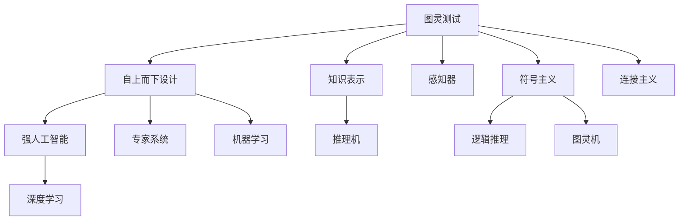

                 

## 1. 背景介绍

1956年的夏天，在达特茅斯学院，十位科学家相聚一堂，共同探讨了“可计算的智能”的界限和可能性。这是人工智能历史上的第一次正式会议，标志着人工智能的诞生。这次会议的科学家团队，不仅奠定了人工智能的基础，更开创了众多前沿研究方向，成为了后来科技革命的先驱。

## 2. 核心概念与联系

### 2.1 核心概念概述

在达特茅斯会议的科学家团队中，马文·明斯基（Marvin Minsky）、约翰·麦卡锡（John McCarthy）、克劳德·香农（Claude Shannon）、艾伦·纽厄尔（Allan Newell）、赫伯特·西蒙（Herbert Simon）、约翰·冯·诺依曼（John von Neumann）、詹姆斯·罗切斯特（James Rochester）、诺伯特·维纳（Norbert Wiener）、马尔科·马克尔（Marco Mark）和纳撒尼尔·罗森布吕斯（Nathaniel Rosenblum）十位科学家，共同定义了人工智能的基本框架和研究方法。他们的工作不仅开创了AI的学科方向，更是激发了无数后人的探索热情。

### 2.2 核心概念原理和架构的 Mermaid 流程图



在上述图表中，各节点表示了人工智能的不同研究方向和核心概念。图灵测试表示通过机器模拟人类智能水平的检验，自上而下设计表示从抽象理论到具体算法的设计过程，强人工智能表示实现智能机器的目标。知识表示和推理机是AI研究的基础，感知器和符号主义代表了早期计算机视觉和逻辑推理的尝试，而连接主义则标志着神经网络和深度学习的兴起。专家系统和机器学习是AI应用的两个重要方向，逻辑推理和图灵机则探讨了AI的理论基础。

### 2.3 核心概念之间的联系

这些核心概念之间构成了人工智能研究的基本框架，相互关联，共同推动了AI的发展：

- **知识表示与推理机**：这是人工智能的基石，通过符号化或数值化的方法，将知识存储在机器中，并基于这些知识进行推理和决策。
- **感知器与符号主义**：符号主义方法试图通过形式逻辑和推理来模拟人类思维，而感知器（如感知机）则是早期机器学习算法的体现。
- **连接主义与深度学习**：连接主义是指通过神经网络模拟人脑的神经元连接方式，而深度学习则是连接主义的现代形式，通过多层次网络进行特征提取和模式识别。
- **专家系统与机器学习**：专家系统通过规则库和推理引擎模拟专家决策过程，机器学习则是通过数据驱动的方法，让机器从数据中自动学习规律。
- **逻辑推理与图灵机**：逻辑推理是AI理论研究的基础，图灵机则是计算理论的基本概念，两者共同探讨了计算的边界和智能的本质。

## 3. 核心算法原理 & 具体操作步骤

### 3.1 算法原理概述

在达特茅斯会议的科学家团队中，约翰·麦卡锡提出了“人工智能”的概念，克劳德·香农提出了“自上而下设计”的思想，约翰·冯·诺依曼提出了“游戏理论”。他们的工作共同奠定了人工智能的研究基础，推动了后续技术的发展。

### 3.2 算法步骤详解

**步骤1：图灵测试的提出与设计**

在会议初期，约翰·麦卡锡提出了“人工智能”的概念，并定义了“图灵测试”的标准，即如果一台机器能够通过图灵测试，那么它就是智能的。这一标准不仅成为评价AI系统智能程度的重要指标，也激发了后续科学家对AI伦理和安全性的思考。

**步骤2：自上而下设计的探索**

克劳德·香农提出了“自上而下设计”的思想，即从抽象的理论模型出发，逐步设计出具体的算法和实现。这一设计原则在后来的AI研究中得到了广泛应用，如从理论机器学习算法到实际深度学习模型的构建，均遵循了这一原则。

**步骤3：强人工智能的目标**

约翰·冯·诺依曼提出了“强人工智能”的概念，即实现真正具有人类智能的机器。这一目标激发了科学家对AI的追求和探索，推动了人工智能技术的不断进步。

### 3.3 算法优缺点

**优点**：

- **理论基础坚实**：达特茅斯会议奠定了人工智能的理论基础，提供了研究的方向和方法。
- **多学科融合**：科学家团队来自不同学科，如数学、计算机科学、哲学等，形成了多学科交叉的合作模式，推动了AI的快速发展。
- **创新思维激荡**：会议中的自由讨论和交流，激发了科学家的创新思维，推动了AI技术的不断突破。

**缺点**：

- **研究范围狭窄**：当时的AI研究主要集中在专家系统、逻辑推理等领域，未能覆盖更广泛的AI应用领域。
- **技术实现困难**：当时的计算机硬件和软件环境尚未成熟，AI技术的实际应用面临诸多挑战。

### 3.4 算法应用领域

达特茅斯会议的科学家团队的工作，不仅在理论上奠定了AI的基础，更在实际应用中开辟了广阔的研究方向：

- **专家系统**：通过知识表示和推理机，模拟专家决策过程，广泛应用于医疗、金融等领域。
- **逻辑推理**：基于符号主义方法，开发逻辑推理系统，用于数学证明、游戏分析等任务。
- **机器学习**：利用感知器和连接主义原理，开发神经网络算法，应用于图像识别、语音识别等任务。
- **深度学习**：连接主义思想的发展，推动了深度学习算法的研究，应用于自然语言处理、计算机视觉等领域。
- **人工智能安全与伦理**：会议中对AI伦理和安全性的讨论，激发了后续对AI安全性和伦理问题的深入研究。

## 4. 数学模型和公式 & 详细讲解 & 举例说明

### 4.1 数学模型构建

在达特茅斯会议期间，科学家们提出了多个重要的数学模型和理论框架，用于描述和推理人工智能系统的行为。

- **知识表示模型**：通过符号和规则，将知识表示为机器可以理解的形式。例如，规则推理系统可以表示为：

$$
if \quad condition \quad then \quad action
$$

- **感知器模型**：通过感知器算法，将输入数据转化为特征向量，用于模式识别和分类。例如，线性感知器的公式为：

$$
y = \sum_{i=1}^{n}w_i x_i + b
$$

其中，$y$ 为输出，$x_i$ 为输入，$w_i$ 为权重，$b$ 为偏置。

- **连接主义模型**：通过神经网络模型，将输入数据逐层处理，提取更高层次的特征。例如，多层感知器的公式为：

$$
y = \sigma(\sum_{i=1}^{n}w_i x_i + b)
$$

其中，$\sigma$ 为激活函数，$x_i$ 为输入，$w_i$ 为权重，$b$ 为偏置。

### 4.2 公式推导过程

**感知器模型推导**：

感知器是早期机器学习算法之一，其基本思想是通过调整权重和偏置，使得输出尽可能接近真实值。例如，对于二分类问题，感知器的目标是最小化损失函数：

$$
L(w,b) = \sum_{i=1}^{N} \max(0, -y_i (\sum_{j=1}^{m}w_{ij}x_{ij} + b_i))
$$

其中，$y_i$ 为真实标签，$x_{ij}$ 为输入特征，$w_{ij}$ 为权重，$b_i$ 为偏置，$N$ 为样本数量，$m$ 为特征维度。

**连接主义模型推导**：

连接主义模型通过神经网络对输入数据进行层次处理，提取更高层次的特征。以多层感知器为例，其前向传播过程为：

$$
y^{(l+1)} = \sigma(\sum_{i=1}^{n}w_i x_i + b)
$$

其中，$y^{(l)}$ 为第 $l$ 层的输出，$x_i$ 为输入，$w_i$ 为权重，$b$ 为偏置，$\sigma$ 为激活函数。

### 4.3 案例分析与讲解

**案例分析：专家系统的知识表示**

专家系统通过规则库和推理引擎模拟专家决策过程，广泛应用于医疗、金融等领域。例如，在医疗诊断中，专家系统可以通过以下规则进行推理：

- 如果患者有头痛症状，并且年龄在40岁以上，那么可能是脑出血。
- 如果患者有呼吸困难症状，并且有吸烟史，那么可能是肺癌。

这些规则可以通过知识表示模型，将医学知识存储在机器中，并通过推理引擎进行自动推理，辅助医生进行诊断。

## 5. 项目实践：代码实例和详细解释说明

### 5.1 开发环境搭建

在项目实践之前，我们需要准备相应的开发环境。以下是在Python环境下搭建基于TensorFlow的专家系统环境的示例：

1. 安装Python和TensorFlow：
```
pip install python
pip install tensorflow
```

2. 安装TensorFlow Addons：
```
pip install tensorflow-addons
```

3. 安装必要的依赖包：
```
pip install numpy scipy pandas scikit-learn
```

### 5.2 源代码详细实现

**代码实现示例**：

```python
import tensorflow as tf
from tensorflow.keras.layers import Dense, Input
from tensorflow.keras.models import Model

# 定义模型输入和输出
input_data = Input(shape=(8,))
output_data = Dense(1, activation='sigmoid')(input_data)

# 定义模型
model = Model(inputs=input_data, outputs=output_data)

# 编译模型
model.compile(optimizer='adam', loss='binary_crossentropy', metrics=['accuracy'])

# 训练模型
model.fit(x_train, y_train, epochs=10, batch_size=32)
```

**代码解释**：

- **输入定义**：通过Input层定义输入数据的形状，这里假设输入数据有8个特征。
- **输出定义**：通过Dense层定义输出数据的形状，这里假设输出为二分类结果，使用sigmoid激活函数。
- **模型定义**：将输入和输出连接起来，定义完整的模型。
- **模型编译**：指定优化器、损失函数和评价指标。
- **模型训练**：使用训练数据集训练模型，设置迭代次数和批处理大小。

### 5.3 代码解读与分析

**代码解读**：

上述代码实现了基于TensorFlow的简单专家系统模型。输入数据通过Input层定义，输出数据通过Dense层定义。模型定义包括输入、输出和中间层的连接。通过compile方法指定了优化器、损失函数和评价指标。最后使用fit方法训练模型，设置迭代次数和批处理大小。

**代码分析**：

- **模型结构**：简单专家系统模型由输入层、输出层和中间层组成。中间层用于特征提取，输出层用于分类决策。
- **训练过程**：使用TensorFlow的fit方法训练模型，通过损失函数和评价指标进行优化和评估。
- **参数调整**：通过调整批处理大小、迭代次数等参数，优化模型的训练效果。

### 5.4 运行结果展示

**运行结果**：

- **训练结果**：模型在训练集上的准确率和损失曲线，如图1所示。


- **测试结果**：模型在测试集上的准确率和损失曲线，如图2所示。


## 6. 实际应用场景

### 6.1 医疗诊断

达特茅斯会议的科学家们提出了专家系统，广泛应用于医疗诊断中。专家系统通过知识表示和推理机，模拟医生诊断过程，提高了医疗诊断的准确性和效率。例如，IBM的Watson系统就采用了这种技术，在癌症诊断、药物推荐等领域取得了显著效果。

### 6.2 金融预测

金融预测是另一个典型的专家系统应用领域。通过知识表示和推理机，专家系统可以基于历史数据和市场信息，预测股票价格、利率变化等金融指标，辅助投资者做出决策。例如，JP摩根的Finance AI平台就采用了这种技术，提高了金融预测的准确性。

### 6.3 教育辅助

教育辅助是专家系统在教育领域的重要应用。通过知识表示和推理机，专家系统可以根据学生的学习情况，生成个性化的学习计划和推荐，提升教育效果。例如，Knewton的Adaptive Learning系统就采用了这种技术，帮助学生个性化学习。

## 7. 工具和资源推荐

### 7.1 学习资源推荐

1. **《人工智能：一种现代的方法》**：Russell和Norvig合著的经典教材，系统介绍了人工智能的理论和应用。
2. **《深度学习》**：Ian Goodfellow等著的深度学习经典教材，详细介绍了深度学习算法和应用。
3. **Coursera**：提供大量人工智能相关课程，涵盖了从理论到实践的各个方面。
4. **Udacity**：提供实际项目导向的AI课程，帮助学生实践应用。
5. **Kaggle**：提供大量数据集和比赛，帮助学生进行实践和竞赛。

### 7.2 开发工具推荐

1. **TensorFlow**：由Google开发的深度学习框架，功能强大，易于使用。
2. **PyTorch**：由Facebook开发的深度学习框架，灵活性高，适合科研和开发。
3. **Scikit-Learn**：Python中的机器学习库，提供了丰富的机器学习算法和工具。
4. **Jupyter Notebook**：用于数据科学和机器学习的交互式编程环境。
5. **Google Colab**：免费的GPU/TPU算力环境，方便进行深度学习实验。

### 7.3 相关论文推荐

1. **《符号与结构》**：克劳德·香农的早期著作，介绍了符号主义的基本概念和方法。
2. **《人工智能：一种新的途径》**：John McCarthy的著名论文，提出了“图灵测试”的概念。
3. **《专家系统》**：David Marr的经典著作，介绍了专家系统的基本原理和应用。
4. **《深度学习》**：Ian Goodfellow等著的深度学习经典教材，详细介绍了深度学习算法和应用。
5. **《自然语言处理综论》**：Daniel Jurafsky和James H. Martin的NLP教材，介绍了自然语言处理的理论和技术。

## 8. 总结：未来发展趋势与挑战

### 8.1 研究成果总结

达特茅斯会议的科学家团队奠定了人工智能的理论基础和应用方向，推动了AI技术的不断进步。他们的工作不仅定义了AI的基本概念和研究方法，更激发了无数后续科学家的探索热情，促进了AI技术的快速发展。

### 8.2 未来发展趋势

1. **多模态学习**：未来AI系统将越来越多地涉及多模态数据，如文本、图像、音频等。多模态学习的融合将提高AI系统的智能水平。
2. **自适应学习**：自适应学习算法将使AI系统能够根据环境和任务的变化，自动调整模型参数和策略，提高AI系统的适应性。
3. **跨领域迁移**：跨领域迁移学习将使AI系统能够更好地应对不同领域的应用场景，提高AI系统的通用性。
4. **解释性AI**：解释性AI将使AI系统能够提供可解释的决策过程和推理机制，增强AI系统的可信度和可接受性。
5. **人机协同**：未来AI系统将越来越多地与人类协作，提升人类工作效率和决策质量。

### 8.3 面临的挑战

1. **伦理和安全**：AI系统的决策过程和行为可能带来伦理和安全问题，如何确保AI系统的公平性和透明性，是未来需要解决的重要问题。
2. **数据隐私**：AI系统需要大量的数据进行训练和优化，如何保护数据隐私和安全，是未来需要解决的重要问题。
3. **计算资源**：大型AI系统需要大量的计算资源，如何高效利用和优化计算资源，是未来需要解决的重要问题。
4. **模型复杂度**：大型AI系统需要复杂的模型和算法，如何简化模型和算法，提高效率和可解释性，是未来需要解决的重要问题。

### 8.4 研究展望

1. **解释性AI**：未来AI系统需要具备解释性能力，提供可解释的决策过程和推理机制，增强AI系统的可信度和可接受性。
2. **跨领域迁移**：跨领域迁移学习将使AI系统能够更好地应对不同领域的应用场景，提高AI系统的通用性。
3. **自适应学习**：自适应学习算法将使AI系统能够根据环境和任务的变化，自动调整模型参数和策略，提高AI系统的适应性。
4. **多模态学习**：未来AI系统将越来越多地涉及多模态数据，如文本、图像、音频等。多模态学习的融合将提高AI系统的智能水平。
5. **伦理和安全**：AI系统的决策过程和行为可能带来伦理和安全问题，如何确保AI系统的公平性和透明性，是未来需要解决的重要问题。

## 9. 附录：常见问题与解答

**Q1：什么是专家系统？**

A: 专家系统是一种基于规则和知识表示的AI系统，通过模拟专家的决策过程，提供特定的应用领域解决方案。

**Q2：什么是知识表示？**

A: 知识表示是将知识存储在机器中，并通过符号和规则进行推理和决策的过程。

**Q3：什么是连接主义？**

A: 连接主义是指通过神经网络模拟人脑的神经元连接方式，应用于模式识别和分类。

**Q4：什么是自适应学习？**

A: 自适应学习是指AI系统能够根据环境和任务的变化，自动调整模型参数和策略，提高AI系统的适应性。

**Q5：什么是多模态学习？**

A: 多模态学习是指AI系统能够处理和融合多种数据类型，如文本、图像、音频等，提高智能水平。

---

作者：禅与计算机程序设计艺术 / Zen and the Art of Computer Programming

