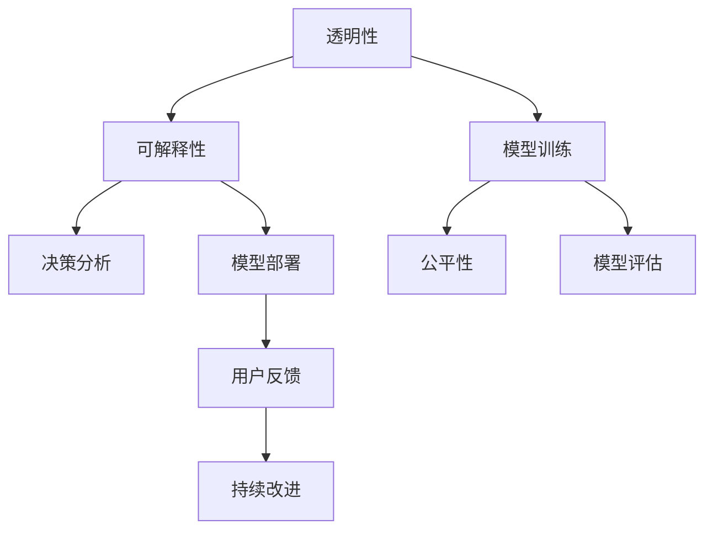

                 

# 透明度与可解释性：构建可信赖的人工智能

> 关键词：人工智能,透明度,可解释性,可信赖,模型解释,决策分析,公平性

## 1. 背景介绍

### 1.1 问题由来
随着人工智能技术的发展，机器学习、深度学习等模型在各行各业中得到广泛应用。这些模型通常具有黑盒特性，难以解释内部运作机制，导致其决策过程缺乏透明度和可理解性。这在一定程度上限制了人工智能技术在各个领域的应用范围和深度，也带来了诸多风险，如错误决策、偏见和不公平问题。

这些问题引起了研究者和政策制定者的关注。如何构建可信赖、可解释的人工智能系统，使其能够公开透明地运作，并确保其决策过程公平公正，成为了当前AI领域的重要研究课题。

### 1.2 问题核心关键点
透明性和可解释性是构建可信赖AI系统的两大核心要素：

- **透明度**：要求模型的决策过程能够被理解、解释和复现，使得模型行为符合预期的道德和伦理标准。
- **可解释性**：要求模型能够提供具体的解释或理由，说明其决策依据，帮助用户理解模型行为。

这些问题涉及模型设计、训练、评估、部署等各个环节，需要通过多方面的努力才能实现。

## 2. 核心概念与联系

### 2.1 核心概念概述

构建可信赖AI系统涉及多个关键概念：

- **模型解释**：通过特定方法，使得模型决策过程可理解、可解释。
- **决策分析**：对模型输出结果进行详细分析，评估其合理性和可靠性。
- **公平性**：确保模型在处理不同群体时，决策公平公正，不带有歧视性。
- **透明性**：模型的训练过程和决策依据公开透明，可供审查和复现。
- **可信赖性**：模型行为稳定可靠，满足应用场景的需求，具备较高的信任度。

这些概念之间存在紧密的联系，通过透明性、可解释性、公平性等手段，可以构建可信赖的AI系统，提升其应用价值和公众信任度。

### 2.2 核心概念原理和架构的 Mermaid 流程图



该流程图展示了构建可信赖AI系统的主要流程和关键要素：

1. **透明性**：模型训练过程的公开透明，可以通过数据预处理、模型架构和训练参数等手段实现。
2. **可解释性**：决策分析过程的详细解释，通过模型解释技术，如LIME、SHAP等，提供模型行为的可解释性。
3. **公平性**：在模型训练中，通过设计公平性约束，确保模型输出公平公正。
4. **模型部署**：在实际应用中，模型行为稳定可靠，满足需求。
5. **用户反馈**：用户对模型行为的反馈，通过持续改进机制，提升模型性能。
6. **模型评估**：通过评估指标，如准确率、召回率、公平性指标等，评估模型性能。

这些要素共同构成了构建可信赖AI系统的完整框架。

## 3. 核心算法原理 & 具体操作步骤

### 3.1 算法原理概述

构建可信赖AI系统，需要综合应用多种技术和方法，涵盖模型设计、训练、评估和部署等各个环节。核心算法原理包括：

- **模型设计**：选择适合问题的模型架构，如线性回归、决策树、神经网络等。
- **数据处理**：清洗和预处理数据，确保数据质量。
- **模型训练**：通过优化算法，最小化损失函数，训练模型参数。
- **模型评估**：使用评估指标，如准确率、召回率、F1分数等，衡量模型性能。
- **模型解释**：提供模型行为解释，如LIME、SHAP、Attention等。
- **公平性约束**：引入公平性指标，如均方误差、平均绝对误差、混淆矩阵等，确保模型公平公正。
- **持续改进**：通过用户反馈和模型重训练，不断提升模型性能。

### 3.2 算法步骤详解

构建可信赖AI系统的主要步骤包括：

**Step 1: 数据收集与处理**

1. 收集数据：从不同渠道收集数据，确保数据多样性和代表性。
2. 数据清洗：去除噪声数据，处理缺失值。
3. 数据预处理：进行特征选择、归一化、标准化等预处理操作。

**Step 2: 模型选择与训练**

1. 选择模型：根据问题类型和数据特点，选择合适的模型架构。
2. 训练模型：使用优化算法，如梯度下降、Adam等，训练模型参数。
3. 调参优化：调整超参数，如学习率、批大小、正则化系数等，优化模型性能。

**Step 3: 模型评估与解释**

1. 模型评估：使用评估指标，如准确率、召回率、F1分数等，评估模型性能。
2. 模型解释：应用LIME、SHAP、Attention等技术，解释模型决策依据。
3. 公平性检查：使用公平性指标，如均方误差、平均绝对误差、混淆矩阵等，检查模型公平性。

**Step 4: 模型部署与反馈**

1. 模型部署：将模型集成到应用系统中，提供API接口供用户调用。
2. 用户反馈：收集用户反馈，用于模型持续改进。
3. 模型重训练：根据用户反馈，对模型进行重训练和优化。

### 3.3 算法优缺点

构建可信赖AI系统的方法具有以下优点：

1. **提升信任度**：通过透明的决策过程和可解释的输出，提升用户对AI系统的信任度。
2. **提高公平性**：确保模型在处理不同群体时，决策公平公正，减少偏见和歧视。
3. **优化性能**：通过模型解释和公平性约束，不断优化模型性能，提升应用效果。

同时，该方法也存在一些局限性：

1. **复杂性高**：需要多方面的技术手段和数据处理，技术门槛较高。
2. **资源消耗大**：在模型解释和公平性检查等环节，需要消耗大量计算资源。
3. **依赖数据**：模型训练和评估依赖数据质量，数据偏差可能影响模型性能。
4. **解释误差**：解释技术可能无法完美解释模型行为，存在一定的误差。

尽管存在这些局限性，但就目前而言，构建可信赖AI系统仍然是AI应用中不可或缺的一部分。

### 3.4 算法应用领域

构建可信赖AI系统的方法在多个领域得到了广泛应用，包括：

- **金融风控**：通过模型解释和公平性检查，确保风控模型的透明性和公正性。
- **医疗诊断**：通过可解释的诊断模型，帮助医生理解模型诊断依据。
- **自动驾驶**：通过透明性和公平性约束，确保自动驾驶系统的安全性。
- **司法判决**：通过可信赖的决策模型，确保司法判决的公正性和透明性。
- **智慧城市**：通过透明性和公平性检查，提升智慧城市系统的可信度和可靠性。

这些应用领域对AI系统的透明性和可解释性要求较高，构建可信赖AI系统有助于提升系统的可信度和公众信任度。

## 4. 数学模型和公式 & 详细讲解 & 举例说明

### 4.1 数学模型构建

构建可信赖AI系统需要设计多个数学模型，包括训练模型、公平性约束和模型解释等。

**训练模型**：使用优化算法，如梯度下降、Adam等，最小化损失函数，训练模型参数。公式如下：

$$
\theta^* = \mathop{\arg\min}_{\theta} \mathcal{L}(\theta)
$$

其中，$\theta$ 为模型参数，$\mathcal{L}$ 为损失函数。

**公平性约束**：引入公平性指标，如均方误差、平均绝对误差、混淆矩阵等，确保模型公平性。例如，对于一个二分类问题，公平性约束可以表示为：

$$
\text{Fairness} = \frac{1}{n} \sum_{i=1}^n |y_i - \hat{y}_i|^2
$$

其中，$y_i$ 为真实标签，$\hat{y}_i$ 为模型预测标签。

**模型解释**：应用LIME、SHAP、Attention等技术，解释模型决策依据。例如，LIME的局部可解释性可以表示为：

$$
\text{LIME} = \mathop{\arg\min}_{\text{labeled}} \sum_{i=1}^N (y_i - \hat{y}_i)^2
$$

其中，$\text{labeled}$ 为训练集中的有标签样本，$N$ 为样本数量。

### 4.2 公式推导过程

以下我们以LIME局部可解释性为例，推导其计算过程。

假设模型 $M_{\theta}$ 在输入 $x$ 上的输出为 $\hat{y}$，训练集为 $\{(x_i,y_i)\}_{i=1}^N$。LIME的局部可解释性定义如下：

$$
\text{LIME} = \mathop{\arg\min}_{\text{labeled}} \sum_{i=1}^N (y_i - \hat{y}_i)^2
$$

其中，$\text{labeled}$ 为训练集中的有标签样本，$N$ 为样本数量。

推导过程如下：

1. 计算模型的预测结果 $\hat{y}$：

$$
\hat{y} = M_{\theta}(x)
$$

2. 定义可解释模型 $M^*_{\theta^*}$：

$$
M^*_{\theta^*}(x) = \sum_{i=1}^N \alpha_i M_{\theta_i}(x)
$$

其中，$\alpha_i$ 为权重，满足 $\sum_{i=1}^N \alpha_i = 1$。

3. 求解权重 $\alpha_i$：

$$
\alpha_i = \frac{\alpha_i'}{\sum_{i=1}^N \alpha_i'}
$$

其中，$\alpha_i'$ 为 $x_i$ 的权重。

4. 计算LIME解释：

$$
\text{LIME} = \sum_{i=1}^N \alpha_i M_{\theta_i}(x)
$$

通过以上推导，可以看出LIME解释方法利用训练集中的有标签样本，拟合出局部可解释模型 $M^*_{\theta^*}$，使得其预测结果与模型 $M_{\theta}$ 相似，从而解释模型的决策过程。

### 4.3 案例分析与讲解

以一个二分类任务为例，展示LIME的解释过程。假设模型 $M_{\theta}$ 在训练集上训练得到，输入 $x$ 的预测结果为 $\hat{y}$。

**Step 1: 计算模型预测结果**

$$
\hat{y} = M_{\theta}(x)
$$

**Step 2: 定义可解释模型 $M^*_{\theta^*}$**

假设 $x$ 在训练集中的有标签样本为 $(x_1,y_1),(x_2,y_2),\ldots,(x_N,y_N)$，计算模型在 $x_i$ 上的预测结果 $M_{\theta_i}(x)$：

$$
M_{\theta_i}(x) = M_{\theta}(x_i)
$$

定义可解释模型 $M^*_{\theta^*}$：

$$
M^*_{\theta^*}(x) = \sum_{i=1}^N \alpha_i M_{\theta_i}(x)
$$

其中，$\alpha_i$ 为权重，满足 $\sum_{i=1}^N \alpha_i = 1$。

**Step 3: 求解权重 $\alpha_i$**

利用贝叶斯优化等方法，求解权重 $\alpha_i$：

$$
\alpha_i = \frac{\alpha_i'}{\sum_{i=1}^N \alpha_i'}
$$

其中，$\alpha_i'$ 为 $x_i$ 的权重。

**Step 4: 计算LIME解释**

通过求解 $\alpha_i$，得到可解释模型 $M^*_{\theta^*}$：

$$
M^*_{\theta^*}(x) = \sum_{i=1}^N \alpha_i M_{\theta_i}(x)
$$

计算 $x$ 在 $M^*_{\theta^*}$ 上的预测结果：

$$
\text{LIME} = M^*_{\theta^*}(x)
$$

通过LIME解释，可以得到模型 $M_{\theta}$ 在输入 $x$ 上的决策依据，帮助用户理解模型的行为。

## 5. 项目实践：代码实例和详细解释说明

### 5.1 开发环境搭建

在进行可信赖AI系统构建时，需要搭建合适的开发环境，以下是Python环境搭建步骤：

1. 安装Anaconda：从官网下载并安装Anaconda，用于创建独立的Python环境。

2. 创建并激活虚拟环境：
```bash
conda create -n trust_env python=3.8 
conda activate trust_env
```

3. 安装依赖包：
```bash
pip install torch torchvision torchaudio pandas numpy matplotlib scikit-learn jupyter notebook ipython 
```

4. 安装机器学习库：
```bash
pip install scikit-learn-xgboost pytorch-lightning sklearn-cluster xgboost -i https://pypi.tuna.tsinghua.edu.cn/simple
```

5. 安装数据处理库：
```bash
pip install pandas pyarrow fsspec pydantic
```

完成上述步骤后，即可在`trust_env`环境中开始开发实践。

### 5.2 源代码详细实现

以下是一个基于LIME进行模型解释的Python代码实现，假设模型为线性回归模型：

```python
import numpy as np
from sklearn.datasets import load_boston
from sklearn.linear_model import LinearRegression
from sklearn.model_selection import train_test_split
from sklearn.metrics import mean_squared_error
from sklearn.metrics import mean_absolute_error
from sklearn.metrics import r2_score
from lime.lime_tabular import LimeTabularExplainer
from sklearn.preprocessing import StandardScaler
from sklearn.linear_model import LinearRegression
from sklearn.pipeline import Pipeline
from sklearn.linear_model import LinearRegression
from sklearn.model_selection import train_test_split
from sklearn.metrics import mean_squared_error
from sklearn.metrics import mean_absolute_error
from sklearn.metrics import r2_score

# 加载数据集
boston = load_boston()
X = boston.data
y = boston.target

# 数据预处理
scaler = StandardScaler()
X_scaled = scaler.fit_transform(X)

# 分割数据集
X_train, X_test, y_train, y_test = train_test_split(X_scaled, y, test_size=0.2, random_state=42)

# 训练模型
model = LinearRegression()
model.fit(X_train, y_train)

# 模型评估
y_pred = model.predict(X_test)
mse = mean_squared_error(y_test, y_pred)
mae = mean_absolute_error(y_test, y_pred)
r2 = r2_score(y_test, y_pred)
print("均方误差(MSE):", mse)
print("平均绝对误差(MAE):", mae)
print("R^2分数(R^2):", r2)

# 构建LIME解释器
explainer = LimeTabularExplainer(X_train, categorical_features=None, feature_names=boston.feature_names)

# 解释模型预测
explanation = explainer.explain_instance(X_test[0], model.predict_proba)
print("LIME解释:", explanation)
```

### 5.3 代码解读与分析

**数据加载与预处理**：
- 使用`load_boston`函数加载波士顿房价数据集，使用`StandardScaler`对数据进行标准化处理。

**模型训练与评估**：
- 使用`train_test_split`函数将数据集分为训练集和测试集。
- 使用`LinearRegression`模型进行训练，并计算模型的评估指标。

**LIME解释器构建**：
- 使用`LimeTabularExplainer`构建LIME解释器，指定训练集和特征名称。
- 使用`explain_instance`方法解释模型在单个样本上的预测结果。

**结果展示**：
- 输出模型的评估指标，如均方误差、平均绝对误差、R^2分数。
- 使用LIME解释器输出模型在单个样本上的预测结果，帮助理解模型行为。

## 6. 实际应用场景

### 6.1 金融风控

在金融风控领域，模型解释和公平性检查尤为重要。金融机构需要构建可信赖的信用评分模型，确保模型的透明性和公平性。例如，使用LIME解释器对模型的决策过程进行解释，帮助审核人员理解模型行为，减少偏见和歧视。

### 6.2 医疗诊断

在医疗诊断领域，模型透明性和可解释性对医生诊断至关重要。通过可解释的诊断模型，帮助医生理解模型诊断依据，减少误诊和漏诊。例如，使用LIME解释器对诊断模型的预测结果进行解释，帮助医生理解模型的诊断依据。

### 6.3 自动驾驶

在自动驾驶领域，透明性和公平性约束对系统的安全性和可靠性至关重要。自动驾驶系统需要构建可信赖的决策模型，确保模型的透明性和公平性。例如，使用公平性检查技术对决策模型进行约束，确保模型在处理不同场景时决策公平公正。

### 6.4 未来应用展望

随着技术的不断发展，构建可信赖AI系统的方法将进一步得到优化和完善。未来可能的趋势包括：

1. **自动化解释技术**：使用自动化解释技术，如模型蒸馏、梯度可视化等，降低人工解释的工作量。
2. **公平性优化算法**：引入公平性优化算法，如公平性约束、对抗训练等，提升模型的公平性和鲁棒性。
3. **混合模型解释**：结合多种模型解释技术，如LIME、SHAP、Attention等，提供更全面、准确的模型解释。
4. **实时解释系统**：构建实时解释系统，在模型推理过程中，即时提供模型解释和反馈，提升用户信任度。

通过不断优化和改进构建可信赖AI系统的方法，将使得AI技术在更多领域得到广泛应用，为社会带来深远影响。

## 7. 工具和资源推荐

### 7.1 学习资源推荐

为了帮助开发者系统掌握构建可信赖AI系统的理论基础和实践技巧，以下是几本经典书籍和在线课程：

1. 《机器学习实战》：介绍了机器学习的基本概念和常用算法，适合初学者入门。
2. 《深度学习》（Ian Goodfellow）：深度学习领域的经典教材，涵盖了深度学习的理论基础和应用实践。
3. 《Python深度学习》：通过Python编程语言，介绍了深度学习的基本框架和常用技术。
4. 《Python数据科学手册》：介绍了Python在数据科学和机器学习中的应用，适合数据科学家和工程师。
5. 《可信赖的AI：公平、透明、可解释的机器学习》：系统介绍了构建可信赖AI系统的理论和方法。

此外，在线课程平台如Coursera、edX、Udacity等，也提供了大量关于AI和机器学习的课程，适合学习者进行系统学习。

### 7.2 开发工具推荐

构建可信赖AI系统需要多种工具和库的支持，以下是一些常用的工具和库：

1. Python编程语言：Python在数据科学和机器学习领域应用广泛，语法简洁、功能强大。
2. Jupyter Notebook：数据科学和机器学习常用的交互式编程环境，支持代码编写、数据可视化和交互式计算。
3. TensorFlow：由Google开发的深度学习框架，支持分布式计算和模型优化。
4. PyTorch：由Facebook开发的深度学习框架，支持动态计算图和GPU加速。
5. Scikit-learn：Python数据科学和机器学习库，提供了丰富的机器学习算法和工具。
6. Pandas：Python数据处理库，支持数据清洗、处理和分析。
7. NumPy：Python科学计算库，支持多维数组和矩阵计算。

通过合理利用这些工具，可以显著提升构建可信赖AI系统的效率和效果。

### 7.3 相关论文推荐

构建可信赖AI系统涉及多个前沿研究方向，以下是几篇经典论文，推荐阅读：

1. "A Unified Approach to Interpreting Model Predictions"（论文链接：https://arxiv.org/abs/1702.08608）：提出了LIME局部可解释性方法，通过数据驱动的方式解释模型预测。
2. "SHAP: A Unified Approach to Interpreting Model Predictions"（论文链接：https://arxiv.org/abs/1606.03498）：提出了SHAP可解释性方法，利用Shapley值对模型预测进行解释。
3. "Fairness Constraints: Foundations and Objectives"（论文链接：https://arxiv.org/abs/1807.09227）：提出了公平性约束方法，通过引入公平性指标，确保模型公平性。
4. "Interpretable and Equitable Learning in the AI Age"（论文链接：https://arxiv.org/abs/1809.07571）：系统介绍了构建可信赖AI系统的方法，包括模型解释和公平性约束。
5. "Adversarial Examples for Adversarial Machine Learning"（论文链接：https://arxiv.org/abs/1412.6572）：提出了对抗训练方法，提升模型鲁棒性。

通过学习这些前沿论文，可以全面了解构建可信赖AI系统的方法和最新进展，激发更多的创新灵感。

## 8. 总结：未来发展趋势与挑战

### 8.1 总结

本文对构建可信赖AI系统的透明性和可解释性进行了全面系统的介绍。通过系统阐述透明性和可解释性的核心概念、原理和实践方法，帮助读者全面理解可信赖AI系统的构建过程，以及如何通过透明性和可解释性，提升AI系统的可信度和公众信任度。

透明性和可解释性是构建可信赖AI系统的两大核心要素，通过模型设计、训练、评估、解释和公平性约束等手段，可以实现AI系统的透明性和可解释性，从而构建可信赖的AI系统。

### 8.2 未来发展趋势

展望未来，构建可信赖AI系统的方法将呈现以下几个发展趋势：

1. **自动化解释技术**：通过自动化解释技术，如模型蒸馏、梯度可视化等，降低人工解释的工作量，提升解释效率。
2. **公平性优化算法**：引入公平性优化算法，如公平性约束、对抗训练等，提升模型的公平性和鲁棒性，确保不同群体的平等对待。
3. **混合模型解释**：结合多种模型解释技术，如LIME、SHAP、Attention等，提供更全面、准确的模型解释，提升用户信任度。
4. **实时解释系统**：构建实时解释系统，在模型推理过程中，即时提供模型解释和反馈，提升用户信任度。
5. **跨模态解释技术**：将多模态信息融合，提升模型解释的多样性和全面性，满足不同应用场景的需求。

这些趋势将推动构建可信赖AI系统的技术不断进步，提升AI系统的应用效果和公众信任度。

### 8.3 面临的挑战

尽管构建可信赖AI系统取得了一定的进展，但仍面临许多挑战：

1. **数据质量问题**：数据质量直接影响模型的训练和解释效果，低质量数据可能导致模型偏见和不公平。
2. **解释误差问题**：解释技术可能无法完美解释模型行为，存在一定的误差，影响用户信任度。
3. **公平性约束问题**：公平性约束可能与模型性能产生冲突，需要在公平性和性能之间进行权衡。
4. **计算资源问题**：模型解释和公平性检查等环节，需要消耗大量计算资源，影响系统效率。
5. **用户接受度问题**：用户对AI系统的理解和信任度直接影响系统的应用效果，需要进行广泛的用户教育和沟通。

这些挑战需要研究者不断探索和改进，通过技术手段和机制优化，提升构建可信赖AI系统的效率和效果。

### 8.4 研究展望

面向未来，构建可信赖AI系统需要在多个方面进行深入研究：

1. **自动化解释技术**：通过自动化解释技术，提升解释效率和准确性，降低人工干预成本。
2. **公平性优化算法**：引入公平性优化算法，提升模型的公平性和鲁棒性，确保不同群体的平等对待。
3. **跨模态解释技术**：将多模态信息融合，提升模型解释的多样性和全面性，满足不同应用场景的需求。
4. **模型蒸馏技术**：通过模型蒸馏技术，提升解释效率和模型性能，降低解释成本。
5. **对抗训练方法**：通过对抗训练方法，提升模型的鲁棒性和泛化能力，减少模型偏见和公平性问题。

这些研究方向将推动构建可信赖AI系统的技术不断进步，为社会带来深远影响。

## 9. 附录：常见问题与解答

**Q1：如何构建透明性和可解释性较高的AI模型？**

A: 构建透明性和可解释性较高的AI模型需要综合应用多种技术和方法，包括：

1. 选择适合问题的模型架构，如线性回归、决策树、神经网络等。
2. 数据处理：清洗和预处理数据，确保数据质量。
3. 模型训练：使用优化算法，如梯度下降、Adam等，训练模型参数。
4. 模型解释：应用LIME、SHAP、Attention等技术，解释模型决策依据。
5. 公平性约束：引入公平性指标，如均方误差、平均绝对误差、混淆矩阵等，确保模型公平性。
6. 持续改进：根据用户反馈和模型评估结果，不断优化模型性能。

通过这些方法，可以构建透明性和可解释性较高的AI模型，提升模型的可信度和用户信任度。

**Q2：在构建可信赖AI系统时，如何处理数据质量问题？**

A: 数据质量问题直接影响模型的训练和解释效果，需要在数据预处理阶段进行严格控制：

1. 数据清洗：去除噪声数据，处理缺失值。
2. 特征选择：选择有意义的特征，去除无用特征。
3. 数据标准化：对数据进行标准化处理，提高模型性能。
4. 数据增强：通过数据增强技术，扩充训练集，减少数据偏差。
5. 数据平衡：处理不平衡数据，避免模型偏向数据多的一方。

通过这些措施，可以有效提升数据质量，减少模型偏差和不公平。

**Q3：在构建可信赖AI系统时，如何处理解释误差问题？**

A: 解释误差问题可以通过以下方法进行处理：

1. 多层次解释：使用多层次解释技术，如模型蒸馏、梯度可视化等，提供更全面、准确的模型解释。
2. 模型融合：结合多种模型解释技术，如LIME、SHAP、Attention等，提升解释的准确性和可靠性。
3. 专家评审：邀请领域专家对模型解释进行评审，发现和修正解释错误。
4. 反馈机制：建立用户反馈机制，收集用户对模型解释的反馈，不断优化解释技术。

通过这些方法，可以有效处理解释误差问题，提升用户信任度。

**Q4：在构建可信赖AI系统时，如何处理公平性约束问题？**

A: 公平性约束问题可以通过以下方法进行处理：

1. 公平性指标：引入公平性指标，如均方误差、平均绝对误差、混淆矩阵等，检查模型公平性。
2. 公平性优化算法：引入公平性优化算法，如公平性约束、对抗训练等，提升模型的公平性和鲁棒性。
3. 数据预处理：处理不平衡数据，避免模型偏向数据多的一方。
4. 用户反馈：建立用户反馈机制，收集用户对模型公平性的反馈，不断优化模型性能。

通过这些方法，可以有效处理公平性约束问题，提升模型的公平性和用户信任度。

**Q5：在构建可信赖AI系统时，如何处理计算资源问题？**

A: 计算资源问题可以通过以下方法进行处理：

1. 模型压缩：使用模型压缩技术，如剪枝、量化等，减少模型参数量，降低计算资源消耗。
2. 分布式计算：使用分布式计算技术，将计算任务分散到多台机器上，提高计算效率。
3. 硬件优化：使用GPU、TPU等高性能硬件设备，加速计算过程。
4. 梯度优化：优化梯度计算算法，减少计算资源消耗。
5. 模型并行：使用模型并行技术，将计算任务分散到多个模型中，提高计算效率。

通过这些方法，可以有效处理计算资源问题，提升模型性能和系统效率。

**Q6：在构建可信赖AI系统时，如何处理用户接受度问题？**

A: 用户接受度问题可以通过以下方法进行处理：

1. 用户教育：通过培训、文档等方式，提高用户对AI系统的理解和信任度。
2. 用户反馈：建立用户反馈机制，收集用户对AI系统的意见和建议，不断优化系统性能。
3. 系统设计：设计易用、直观的UI/UX界面，提升用户的使用体验。
4. 透明化运营：公开透明地展示AI系统的决策过程和数据来源，增加用户信任度。
5. 安全防护：采取安全防护措施，保障数据和模型安全，减少用户顾虑。

通过这些方法，可以有效提升用户接受度，增加AI系统的应用效果。

---

作者：禅与计算机程序设计艺术 / Zen and the Art of Computer Programming

