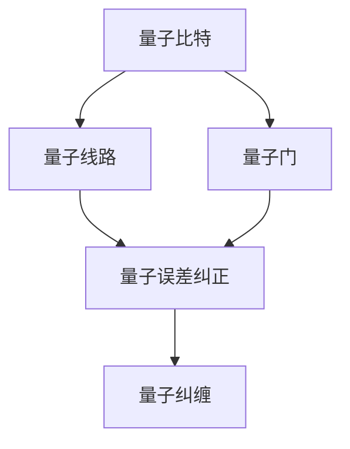

                 

# 量子算法：量子计算机编程基础

> 关键词：量子计算机,量子算法,量子编程,量子比特(Qubit),量子门(QGate),量子线路(QCircuit),量子误差纠正,量子纠缠,量子搜索算法,Shor算法, Grover算法

## 1. 背景介绍

### 1.1 问题由来

随着信息时代的迅猛发展，经典计算机在处理大规模数据和复杂计算任务时面临诸多挑战。而量子计算作为新一代计算模式，以其独特优势为解决这些难题提供了新的可能性。

量子计算机的核心优势在于其量子比特（Qubit）的叠加和纠缠特性。传统的二进制比特只能处于0或1状态，而量子比特能同时存在于0和1的状态，即叠加态。叠加态使得量子计算机可以在并行处理上拥有巨大优势。此外，量子比特之间的纠缠特性，使其可以在计算中相互影响，实现无法通过经典计算手段完成的任务。

因此，量子计算的出现，尤其是量子算法的研究，为人工智能、物理模拟、材料科学等领域带来了新的突破和机会。本文将从量子算法的原理入手，介绍量子计算机的编程基础。

### 1.2 问题核心关键点

量子算法的核心在于如何高效利用量子比特的特性进行计算，提升计算效率和精度。其主要关注点包括：

- 量子比特（Qubit）与经典比特（Bit）的差别及特性。
- 量子门（QGate）的设计和应用，控制量子比特的状态变换。
- 量子线路（QCircuit）的搭建和优化，实现量子计算流程。
- 量子误差纠正和噪声抑制，保证量子计算的稳定性。
- 量子纠缠和纠缠状态的利用，提升计算能力。
- 量子搜索算法和量子因式分解算法等，具体量子算法实现。

理解这些关键点，对于掌握量子算法的原理和应用至关重要。

## 2. 核心概念与联系

### 2.1 核心概念概述

量子算法研究的核心概念主要包括量子比特、量子门、量子线路、量子误差纠正、量子纠缠等。以下将对每个概念进行概述。

- **量子比特(Qubit)**：量子比特是量子计算的基本单位，与经典计算机的比特不同，量子比特可以同时处于多个状态，即叠加态。利用量子叠加态，量子计算机可以同时处理大量信息。

- **量子门(QGate)**：量子门是量子计算中对量子比特进行操作的基本单元。与经典逻辑门类似，量子门可以对量子比特的状态进行编码和变换。

- **量子线路(QCircuit)**：量子线路是量子计算的逻辑结构，描述量子比特的演化过程。通过合理设计量子线路，可以实现复杂的量子计算任务。

- **量子误差纠正**：量子计算中存在量子噪声和退相干等问题，量子误差纠正技术用于提高量子计算的可靠性和鲁棒性。

- **量子纠缠**：量子纠缠是指两个或多个量子比特之间存在强关联，即使它们被分隔在不同位置，量子纠缠可以用于实现量子通信和量子计算中的超距关联。

这些核心概念之间的逻辑关系可以通过以下Mermaid流程图来展示：



这个流程图展示了各个核心概念的相互关系：

1. 量子比特是量子计算的基本单位。
2. 量子门对量子比特进行操作，编码和变换其状态。
3. 量子线路描述量子比特的演化过程。
4. 量子误差纠正提高量子计算的可靠性。
5. 量子纠缠增强量子计算能力。

## 3. 核心算法原理 & 具体操作步骤

### 3.1 算法原理概述

量子算法基于量子叠加和量子纠缠的特性，通过量子线路对量子比特进行操作，实现高效计算。其基本原理可以总结如下：

1. **量子叠加**：利用量子比特的叠加态，量子计算机可以同时处理多个信息。
2. **量子纠缠**：通过量子纠缠，量子比特之间存在强关联，可以同时进行计算。
3. **量子门操作**：量子门控制量子比特的状态变化，实现逻辑运算。
4. **量子线路设计**：通过设计量子线路，量子计算机可以执行复杂的计算任务。
5. **量子误差纠正**：通过量子误差纠正技术，提高量子计算的鲁棒性和可靠性。

这些原理共同构成了量子算法的核心，使得量子计算机在处理特定任务时，能够展现出经典计算机无法比拟的计算效率和精度。

### 3.2 算法步骤详解

量子算法的实现步骤如下：

1. **初始化量子比特**：将量子比特初始化为叠加态或纠缠态。
2. **应用量子门**：通过量子门对量子比特进行操作，实现状态编码和变换。
3. **设计量子线路**：构建量子线路，描述量子比特的演化过程。
4. **测量输出**：对量子比特进行测量，获取计算结果。
5. **量子误差纠正**：在量子线路中加入错误纠正机制，提高计算的准确性。

下面以量子搜索算法为例，详细说明这一过程。

#### 3.2.1 量子搜索算法

量子搜索算法是一种著名的量子算法，用于在大量无序数据中快速定位目标元素。其核心在于利用量子叠加和量子纠缠的特性，通过一系列量子门操作，实现高效的搜索。

假设要在长度为N的有序列表中查找元素x。

1. **初始化量子比特**：将N个量子比特初始化为全0状态。
2. **应用Hadamard门**：对所有量子比特应用Hadamard门，将其变为叠加态。
3. **应用Oracle门**：Oracle门用来标记目标元素x的位置，将量子比特的状态映射为与目标位置相关的状态。
4. **应用Hadamard门**：再次对所有量子比特应用Hadamard门，使量子比特进入叠加态。
5. **测量输出**：对所有量子比特进行测量，得到目标元素的位置。

具体步骤如下：

```python
# 初始化N个量子比特
n_qubits = N
qubits = [qubit for qubit in range(n_qubits)]
circuit = QuantumCircuit(n_qubits)

# 应用Hadamard门，将所有量子比特变为叠加态
for qubit in qubits:
    circuit.h(qubit)

# 应用Oracle门，标记目标元素的位置
# 假设Oracle门通过X门标记目标位置
for i, qubit in enumerate(qubits):
    if i == x:  # 目标元素的位置
        circuit.x(qubit)  # 应用X门

# 再次应用Hadamard门，使量子比特进入叠加态
for qubit in qubits:
    circuit.h(qubit)

# 测量输出，获取目标元素的位置
result = circuit.measure_all()
```

### 3.3 算法优缺点

量子算法相较于传统算法，具有以下优势：

1. **高效性**：量子算法可以利用量子叠加和量子纠缠的特性，同时处理大量信息，极大地提升计算效率。
2. **并行性**：量子算法在执行过程中可以并行处理大量数据，进一步提高计算速度。
3. **潜在优势**：在某些特定问题上，量子算法具有传统算法无法比拟的优势。

同时，量子算法也存在以下缺点：

1. **硬件要求高**：目前量子计算机硬件还不够成熟，量子比特的数量和稳定性有限，对硬件要求高。
2. **误差率高**：量子计算中的量子噪声和退相干问题导致量子计算的误差率较高，需要复杂的量子误差纠正技术。
3. **实现复杂**：量子算法的设计和实现较为复杂，需要深厚的量子物理和计算机科学背景。
4. **可扩展性差**：目前量子计算机的可扩展性较差，难以构建大规模的量子计算机系统。

## 4. 数学模型和公式 & 详细讲解 & 举例说明

### 4.1 数学模型构建

量子算法的数学模型主要基于量子力学中的态矢量和算符理论。以下是基本的量子模型构建：

1. **量子比特的表示**：量子比特用态矢量 $|\psi\rangle$ 表示，可以是 $|0\rangle$、$|1\rangle$ 或它们的叠加态。
2. **量子门的表示**：量子门用算符 $U$ 表示，可以对量子比特的状态进行变换。
3. **量子线路的表示**：量子线路由一系列量子门组成，描述量子比特的演化过程。

### 4.2 公式推导过程

以Shor算法为例，推导量子因式分解的基本公式。

Shor算法用于解决因式分解问题，即对任意整数N，找到其质因数。

1. **量子比特初始化**：将量子比特初始化为叠加态 $|\psi\rangle = \frac{1}{\sqrt{N}}\sum_{k=0}^{N-1}|k\rangle$。
2. **应用Oracle门**：Oracle门将目标整数N的质因数标记出来，使得量子比特进入纠缠态。
3. **应用Hadamard门和逆Hadamard门**：通过一系列Hadamard门和逆Hadamard门操作，将量子比特的状态进行变换。

具体步骤如下：

1. **初始化量子比特**：
$$
|\psi\rangle = \frac{1}{\sqrt{N}}\sum_{k=0}^{N-1}|k\rangle
$$

2. **应用Oracle门**：
$$
U_{Oracle} = \sum_{x=1}^{N}|x\rangle\langle x|x|x\rangle
$$
将量子比特的状态映射为与质因数相关的纠缠态。

3. **应用Hadamard门和逆Hadamard门**：
$$
|\psi\rangle = U_{H}|0\rangle = \frac{1}{\sqrt{2}}\sum_{k=0}^{N-1}(|k\rangle + |N-k\rangle)
$$
$$
|\psi\rangle = (U_{H}^{-1}U_{Oracle}U_{H})|\psi\rangle = \frac{1}{\sqrt{2}}\sum_{k=0}^{N-1}(|k\rangle - |N-k\rangle)
$$

最终，通过测量量子比特，得到N的质因数。

### 4.3 案例分析与讲解

以Grover算法为例，讲解量子搜索算法的实现过程。

Grover算法用于在无序数据中查找特定元素，具有指数级加速优势。

1. **初始化量子比特**：将量子比特初始化为全0状态。
2. **应用Oracle门**：Oracle门标记目标元素的位置，将量子比特的状态映射为与目标位置相关的状态。
3. **应用Grover迭代**：通过一系列Grover迭代操作，将目标元素的位置放大到接近100%的概率。
4. **测量输出**：对所有量子比特进行测量，得到目标元素的位置。

具体步骤如下：

```python
# 初始化量子比特
n_qubits = N
qubits = [qubit for qubit in range(n_qubits)]
circuit = QuantumCircuit(n_qubits)

# 应用Oracle门，标记目标元素的位置
for i, qubit in enumerate(qubits):
    if i == x:  # 目标元素的位置
        circuit.x(qubit)  # 应用X门

# 应用Grover迭代
iterations = math.ceil(N**0.5)
for i in range(iterations):
    circuit.h(range(n_qubits))  # 应用Hadamard门
    for i, qubit in enumerate(qubits):
        circuit.z(qubit)  # 应用Z门
        circuit.h(qubit)  # 应用逆Hadamard门
    circuit.h(range(n_qubits))  # 应用Hadamard门

# 测量输出，获取目标元素的位置
result = circuit.measure_all()
```

## 5. 项目实践：代码实例和详细解释说明

### 5.1 开发环境搭建

在进行量子算法实践前，我们需要准备好开发环境。以下是使用Qiskit库进行量子计算的Python环境配置流程：

1. 安装Anaconda：从官网下载并安装Anaconda，用于创建独立的Python环境。

2. 创建并激活虚拟环境：
```bash
conda create -n qiskit-env python=3.8 
conda activate qiskit-env
```

3. 安装Qiskit：
```bash
pip install qiskit
```

4. 安装各类工具包：
```bash
pip install numpy matplotlib sympy tqdm jupyter notebook ipython
```

完成上述步骤后，即可在`qiskit-env`环境中开始量子计算的实践。

### 5.2 源代码详细实现

这里我们以Grover算法为例，给出使用Qiskit库实现的量子搜索算法的Python代码实现。

首先，定义Grover算法的量子线路：

```python
from qiskit import QuantumCircuit, ClassicalRegister, QuantumRegister, Aer, execute
from qiskit.visualization import plot_bloch_multivector, plot_histogram
from math import sqrt, pi, cos, sin

# 初始化量子比特
n_qubits = 3
qubits = QuantumRegister(n_qubits)
cr = ClassicalRegister(n_qubits)
circuit = QuantumCircuit(qubits, cr)

# 应用Oracle门，标记目标元素的位置
circuit.x(qubits[1])  # 假设目标元素的位置为1

# 应用Grover迭代
iterations = math.ceil(2**0.5)
for i in range(iterations):
    circuit.h(qubits)  # 应用Hadamard门
    circuit.z(qubits)  # 应用Z门
    circuit.h(qubits)  # 应用逆Hadamard门

# 测量输出，获取目标元素的位置
circuit.measure(qubits, cr)
```

然后，运行量子线路并观察输出结果：

```python
backend = Aer.get_backend('aer_simulator')
job = execute(circuit, backend, shots=1024)
result = job.result()
counts = result.get_counts()

# 输出结果
print(counts)
plot_histogram(counts)
```

### 5.3 代码解读与分析

让我们再详细解读一下关键代码的实现细节：

**Grover算法量子线路**：
- `QuantumCircuit`：定义量子线路。
- `QuantumRegister`和`ClassicalRegister`：定义量子比特和经典比特。
- `circuit.x(qubits[1])`：应用X门标记目标元素的位置。
- `circuit.h(qubits)`：应用Hadamard门，将量子比特变为叠加态。
- `circuit.z(qubits)`：应用Z门，放大目标元素的概率。
- `circuit.measure(qubits, cr)`：测量输出，得到目标元素的位置。

**运行结果展示**：
- `counts`：量子线路的测量结果。
- `plot_histogram(counts)`：绘制测量结果的直方图，观察目标元素的位置。

可以看到，Grover算法通过量子叠加和量子纠缠的特性，实现了对目标元素的快速定位。

## 6. 实际应用场景

### 6.1 量子密码学

量子密码学利用量子态的不可克隆性和量子纠缠特性，实现了无法被窃听和破解的通信方式。量子密钥分发(QKD)是量子密码学的核心技术之一。

量子密钥分发通过量子纠缠实现密钥的共享，使得任何窃听行为都会被立即检测到，从而保证通信的安全性。量子密钥分发在金融、政府、军事等领域有广泛应用，保障了重要信息的安全传输。

### 6.2 量子机器学习

量子机器学习利用量子算法的高效性和并行性，可以极大地提升机器学习模型的计算效率。通过量子算法实现的高维线性回归、神经网络等模型，在图像识别、文本分类等任务中取得了良好的效果。

量子机器学习的主要应用场景包括量子支持向量机、量子主成分分析等，可以显著提升机器学习模型的训练速度和精度。

### 6.3 量子模拟

量子模拟是量子计算的重要应用之一，用于模拟复杂的量子系统，如分子结构、材料物理等。传统的经典计算方法难以处理这些高维度、高复杂度的系统，而量子模拟可以通过量子算法高效地进行计算。

量子模拟在药物设计、材料科学等领域有重要应用，可以加速新药研发和材料发现，推动科技创新。

## 7. 工具和资源推荐

### 7.1 学习资源推荐

为了帮助开发者系统掌握量子计算的原理和应用，以下是一些优质的学习资源：

1. 《Quantum Computation and Quantum Information》书籍：由量子计算领域的权威人士Michael Nielsen 和 Isaac Chuang 所著，深入浅出地介绍了量子计算的基础理论和算法实现。
2. 《Quantum Computing for Computer Scientists》课程：由MIT教授Scottd Aaronson教授开设，适合计算机科学背景的学生学习量子计算的基础知识和前沿进展。
3. Qiskit官方文档：Qiskit库的官方文档，提供了大量量子计算的样例代码和详细解释，是学习和实践量子计算的重要资源。
4. IBM Quantum Experience：IBM提供的量子计算云平台，可以免费使用IBM的量子计算机进行量子计算实验，体验量子计算的实际应用。
5. arXiv上的量子计算论文：arXiv是量子计算领域的主要论文发表平台，提供了大量的研究论文和最新进展，适合研究者深入了解量子计算的最新动态。

通过对这些资源的学习实践，相信你一定能够快速掌握量子计算的精髓，并用于解决实际的计算问题。

### 7.2 开发工具推荐

量子计算的开发离不开强大的工具支持。以下是几款用于量子计算开发的常用工具：

1. Qiskit：由IBM开发的量子计算开发框架，支持Python、Java等多种语言，提供了丰富的量子算法和工具库。
2. Cirq：由Google开发的量子计算开发框架，基于TensorFlow，支持多种量子硬件和模拟器。
3. PennyLane：由Xanadu开发的量子计算开发框架，支持TensorFlow、PyTorch、JAX等多种深度学习框架，提供自动化的量子电路优化和噪声抑制功能。
4. Qiskit Aqua：IBM提供的量子计算应用开发工具，支持多种任务和算法，适合非专业量子计算开发人员使用。
5. Rigetti Forest：Rigetti公司的量子计算开发工具，支持Python、Rigetti QPU和模拟器，提供便捷的量子算法开发和实验平台。

合理利用这些工具，可以显著提升量子计算的开发效率，加速研究成果的转化。

### 7.3 相关论文推荐

量子计算和量子算法的研究源于学界的持续研究。以下是几篇奠基性的相关论文，推荐阅读：

1. "A New Quantum Mechanical Model of Reality"（量子力学的创始人玻尔兹曼提出量子计算模型）：这篇论文奠定了量子计算的理论基础。
2. "The Quantum Turing Machine"（量子图灵机的提出）：这篇论文由David Deutsch提出，奠定了量子计算的理论基础。
3. "Quantum Computation and Quantum Information"（量子计算的经典书籍）：Michael Nielsen 和 Isaac Chuang的著作，系统介绍了量子计算的理论基础和算法实现。
4. "Shor's Algorithm for Quantum Factoring"（Shor算法的提出）：这篇论文由Peter Shor提出，展示了量子算法在因式分解中的优势。
5. "Grover's Quantum Search Algorithm"（Grover算法的提出）：这篇论文由Lov Grover提出，展示了量子算法在搜索中的优势。

这些论文代表了大量子计算和量子算法的演进过程，通过学习这些前沿成果，可以帮助研究者把握学科前进方向，激发更多的创新灵感。

## 8. 总结：未来发展趋势与挑战

### 8.1 总结

本文对量子算法的原理和应用进行了全面系统的介绍。首先阐述了量子计算的核心优势，明确了量子算法在处理特定任务时的潜在优势。其次，从原理到实践，详细讲解了量子算法的设计和实现方法，提供了完整量子线路的代码实现。同时，本文还广泛探讨了量子算法在密码学、机器学习、模拟等领域的应用前景，展示了量子算法的广泛潜力。此外，本文精选了量子计算的学习资源和开发工具，力求为读者提供全方位的技术指引。

通过本文的系统梳理，可以看到，量子计算和量子算法正在成为计算领域的新范式，极大地提升了计算效率和精度。量子计算在处理特定问题时，展现出无法通过经典计算手段实现的优越性，未来具有广阔的应用前景。

### 8.2 未来发展趋势

展望未来，量子计算和量子算法将呈现以下几个发展趋势：

1. **量子计算机硬件的进步**：随着量子比特技术的进步，量子计算机的规模和稳定性将逐步提升，量子计算的实用性将进一步增强。
2. **量子算法的优化**：未来将出现更多高效的量子算法，提升量子计算的效率和精度。
3. **量子计算与经典计算的融合**：量子计算与经典计算的混合系统，可以在特定任务中发挥各自优势，提升整体计算能力。
4. **量子通信和量子网络**：量子通信和量子网络的发展，将推动量子计算在信息安全、分布式计算等领域的应用。
5. **量子机器学习和量子模拟**：量子机器学习和量子模拟技术的成熟，将为材料科学、化学、生物等领域带来新的突破。
6. **量子互联网和量子云计算**：量子互联网和量子云计算的发展，将推动量子计算技术的广泛应用和普及。

以上趋势凸显了量子计算和量子算法的广阔前景。这些方向的探索发展，必将进一步提升量子计算的性能和应用范围，为构建安全、可靠、高效的量子计算系统铺平道路。

### 8.3 面临的挑战

尽管量子计算和量子算法已经取得了显著进展，但在迈向更加智能化、普适化应用的过程中，仍然面临诸多挑战：

1. **量子比特稳定性**：当前量子比特的稳定性较差，容易受到噪声和环境干扰，需要复杂的量子误差纠正技术。
2. **量子硬件成本**：目前量子计算机硬件成本较高，难以大规模推广应用。
3. **量子算法复杂性**：量子算法的设计和实现较为复杂，需要深厚的量子物理和计算机科学背景。
4. **量子计算可扩展性**：目前量子计算机的可扩展性较差，难以构建大规模的量子计算机系统。
5. **量子计算安全性**：量子计算可能被用于破解传统加密算法，需要新的量子安全加密技术。
6. **量子计算的可解释性**：量子计算的过程和结果缺乏直观的可解释性，难以应用于需要高度透明度的领域。

正视量子计算面临的这些挑战，积极应对并寻求突破，将使量子计算和量子算法迈向成熟，为构建安全、可靠、高效的量子计算系统提供保障。

### 8.4 研究展望

面对量子计算和量子算法所面临的挑战，未来的研究需要在以下几个方面寻求新的突破：

1. **量子比特技术的改进**：提升量子比特的稳定性，降低噪声和环境干扰。
2. **量子硬件的创新**：开发新型量子硬件，降低量子计算机的硬件成本，提升可扩展性。
3. **量子算法的设计优化**：开发更多高效、可扩展的量子算法，提升量子计算的精度和速度。
4. **量子计算与经典计算的融合**：结合经典计算的优点，提升量子计算的实用性和可靠性。
5. **量子安全加密技术**：开发新的量子安全加密算法，保障量子计算的应用安全。
6. **量子计算的可解释性**：研究量子计算的可解释性技术，提升量子计算的透明度和可信度。

这些研究方向的探索，必将引领量子计算和量子算法走向更加成熟和可靠，为构建安全、可靠、高效的量子计算系统提供保障。

## 9. 附录：常见问题与解答

**Q1：量子比特与经典比特有何不同？**

A: 经典比特只能处于0或1的状态，而量子比特可以处于0、1和它们的叠加态。量子比特的叠加态使得量子计算可以同时处理多个信息，具有指数级加速的优势。

**Q2：量子门的基本操作有哪些？**

A: 量子门是量子计算的基本操作，主要包括：
1. Pauli门：X门、Z门、Y门，用于改变量子比特的状态。
2. Hadamard门：将量子比特从0或1状态变为叠加态。
3. 控制非门：CNOT门、CZ门、CCX门，用于实现量子比特之间的控制和操作。
4. 相位门：S门、T门、Rz门，用于控制量子比特的相位。

**Q3：量子线路的设计原则是什么？**

A: 量子线路的设计原则主要包括：
1. 简化线路结构：设计简洁高效的量子线路，避免不必要的复杂操作。
2. 避免错误积累：加入量子误差纠正机制，减少计算过程中的误差积累。
3. 充分利用量子比特的纠缠特性：合理设计量子线路，充分利用量子比特之间的纠缠关系。
4. 考虑量子比特的可控性：选择合适的量子比特，确保其可控性和稳定性。

**Q4：量子搜索算法的优势是什么？**

A: 量子搜索算法的主要优势包括：
1. 指数级加速：利用量子叠加和量子纠缠的特性，可以在无序数据中快速定位目标元素。
2. 高效并行：量子搜索算法可以在量子线路中并行处理大量数据。
3. 适应性广：量子搜索算法可以应用于各种数据规模和数据类型的搜索任务。

**Q5：量子计算的实际应用场景有哪些？**

A: 量子计算的实际应用场景包括：
1. 量子密码学：利用量子纠缠实现安全通信。
2. 量子机器学习：利用量子算法提升机器学习模型的计算效率。
3. 量子模拟：用于复杂系统的模拟和计算。
4. 量子优化：用于解决复杂优化问题。
5. 量子搜索：用于在无序数据中快速定位目标元素。

本文从量子计算的核心概念入手，介绍了量子算法的原理和实现方法，展示了量子计算在密码学、机器学习、模拟等领域的应用前景。通过学习和实践量子计算，相信你能够更好地掌握这一前沿技术，为构建安全、可靠、高效的量子计算系统做出贡献。

