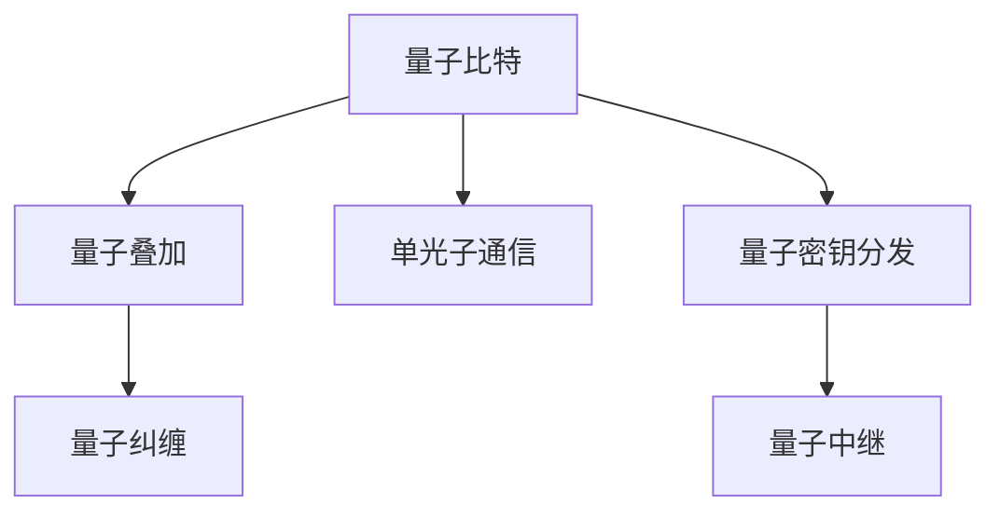

                 

## 1. 背景介绍

### 1.1 问题由来
量子通信（Quantum Communication）作为一种基于量子力学原理的新型通信方式，近年来逐渐成为国内外研究的热点。由于其在安全性、保密性等方面的独特优势，量子通信有望彻底颠覆现有通信模式，引领信息安全的革命。然而，量子通信的复杂性在于，它不仅涉及量子力学的深度理论，还需要与经典通信技术相结合。因此，本文将详细梳理量子通信的基本原理、现状以及未来的发展趋势，希望能为相关领域的从业人员提供一些参考和指导。

### 1.2 问题核心关键点
量子通信的核心在于利用量子态的特殊性质（如量子叠加、量子纠缠）来保证信息传输的安全性。主要涉及的量子态有量子叠加态、量子纠缠态、单光子态等。其中，量子叠加态和量子纠缠态是实现量子通信信息保密性的关键，而单光子态则是实现量子通信信息传输的基础。

量子通信面临的主要问题包括：
- 量子态的生成和传输。
- 量子态测量和误码率的降低。
- 量子通信网络的构建与扩展。

## 2. 核心概念与联系

### 2.1 核心概念概述

为更好地理解量子通信的基本原理和应用，本节将介绍几个关键概念：

- 量子比特（Qubit）：量子通信中的基本信息单位，可以处于叠加态，不同于传统计算机中的比特。
- 量子叠加（Superposition）：一个量子比特可以同时处于多种状态，增加信息传输的多样性和灵活性。
- 量子纠缠（Entanglement）：两个或多个量子比特之间可以形成纠缠态，一端的状态改变会即时影响另一端的状态。
- 单光子通信：基于单个光子的量子通信技术，是实现远距离量子通信的重要途径。
- 量子密钥分发（Quantum Key Distribution, QKD）：利用量子态的随机性实现安全密钥分发，常见的有BB84协议、E91协议等。
- 量子中继（Quantum Repeaters）：通过量子中继技术实现长距离量子通信，解决量子信息传输过程中的衰减和误差。

这些核心概念之间的逻辑关系可以通过以下Mermaid流程图来展示：



这个流程图展示了许多量子通信的重要概念及其之间的关系：

1. 量子比特是量子通信的基本单位。
2. 量子叠加和量子纠缠是量子通信实现信息保密性的关键。
3. 单光子通信是量子通信实现远距离传输的基础。
4. 量子密钥分发是量子通信信息安全传输的重要手段。
5. 量子中继是量子通信长距离传输的关键技术。

## 3. 核心算法原理 & 具体操作步骤
### 3.1 算法原理概述

量子通信的算法原理主要基于量子力学中的量子态叠加和量子纠缠理论，以及量子密钥分发协议。

量子叠加态和量子纠缠态是量子通信的根本。一个量子比特可以处于多种状态，这种叠加态可以表示为：

$$ |\psi\rangle = \alpha |0\rangle + \beta |1\rangle $$

其中，$\alpha$ 和 $\beta$ 是复数系数，满足 $\alpha^2 + \beta^2 = 1$。

量子纠缠态则是两个或多个量子比特之间形成的特殊状态，它们之间存在紧密的关联。例如，两个纠缠的量子比特可以表示为：

$$ |\psi\rangle = \frac{1}{\sqrt{2}}(|00\rangle + |11\rangle) $$

利用这些量子态，量子通信可以实现信息保密性。例如，在BB84协议中，发送方随机选择基底对量子比特进行编码，接收方随机选择基底进行测量。由于基底选择的随机性，接收方无法获得发送方的信息。

### 3.2 算法步骤详解

量子通信的算法步骤主要包括：

**Step 1: 生成量子比特并传输**
- 使用光子源生成单光子或纠缠光子对，并进行传输。
- 利用纠缠态的传输特性，实现量子比特的远程传输。

**Step 2: 量子密钥分发**
- 发送方随机选择基底对量子比特进行编码，并传输到接收方。
- 接收方随机选择基底进行测量，并将测量结果发送回发送方。
- 发送方和接收方共享基底选择信息，根据测量结果进行密钥生成。

**Step 3: 量子密钥共享**
- 通过量子中继技术实现量子密钥的远程分发，解决长距离传输问题。
- 量子密钥共享是指将生成的密钥安全地传输给目标接收方。

### 3.3 算法优缺点

量子通信的优点包括：
1. 信息传输的绝对安全性。由于量子态的随机性和纠缠态的特性，量子通信可以实现信息传输的绝对安全。
2. 量子态的生成和传输具有高效率。单光子通信和纠缠态传输具有高效性，可以在短时间内传输大量信息。
3. 量子密钥分发可以实现密钥的远程共享，解决传统密钥分发中的问题。

量子通信的缺点包括：
1. 量子态的生成和传输容易受到外界干扰，导致误码率较高。
2. 量子通信的网络构建和扩展较为复杂，需要高精度的设备。
3. 量子通信的设备成本较高，需要大量的资金投入。

### 3.4 算法应用领域

量子通信的应用领域非常广泛，以下是几个典型的应用场景：

- 量子密钥分发：用于信息加密和解密，实现信息传输的绝对安全。
- 量子秘密共享：用于多方的安全信息共享，保证信息的安全性。
- 量子通信网络：构建多用户的量子通信网络，实现多个用户之间的安全通信。
- 量子雷达：利用量子态的特性进行远程目标探测，提高雷达的探测精度。

此外，量子通信还被应用于金融交易、军事通信等领域，具有广阔的应用前景。

## 4. 数学模型和公式 & 详细讲解 & 举例说明

### 4.1 数学模型构建

量子通信的数学模型主要基于量子力学的数学框架，包括量子态的表示和操作，量子力学中的测量理论等。

一个量子比特可以表示为：

$$ |\psi\rangle = \alpha |0\rangle + \beta |1\rangle $$

其中，$\alpha$ 和 $\beta$ 是复数系数，满足 $\alpha^2 + \beta^2 = 1$。

### 4.2 公式推导过程

量子通信中的关键公式包括量子态的叠加和纠缠公式。

量子叠加态的叠加公式为：

$$ |\psi\rangle = \frac{1}{\sqrt{2}}(|0\rangle + |1\rangle) $$

表示一个量子比特处于叠加态。

量子纠缠态的纠缠公式为：

$$ |\psi\rangle = \frac{1}{\sqrt{2}}(|00\rangle + |11\rangle) $$

表示两个量子比特处于纠缠态。

### 4.3 案例分析与讲解

以BB84协议为例，分析量子密钥分发的过程。

在BB84协议中，发送方和接收方分别选择基底进行编码和测量。假设基底为：

$$ \{|0\rangle, |1\rangle\} $$

和

$$ \{\frac{1}{\sqrt{2}}(|0\rangle + i|1\rangle), \frac{1}{\sqrt{2}}(|0\rangle - i|1\rangle)\} $$

发送方随机选择一种基底进行编码，并将编码后的量子比特传输给接收方。接收方也随机选择一种基底进行测量。由于基底选择的随机性，接收方无法获得发送方的信息。发送方和接收方通过交换基底选择信息，根据测量结果生成密钥。

假设基底选择相同，则发送方的编码为 $0$，接收方测量结果也为 $0$。如果基底选择不同，则发送方和接收方的测量结果也不同，无法获得正确的信息。因此，BB84协议可以实现信息传输的绝对安全。

## 5. 项目实践：代码实例和详细解释说明
### 5.1 开发环境搭建

在进行量子通信的实践开发前，我们需要准备好开发环境。以下是使用Python和Qiskit库进行量子通信开发的配置流程：

1. 安装Anaconda：从官网下载并安装Anaconda，用于创建独立的Python环境。

2. 创建并激活虚拟环境：
```bash
conda create -n quantum-env python=3.8 
conda activate quantum-env
```

3. 安装Qiskit：
```bash
pip install qiskit
```

4. 安装各类工具包：
```bash
pip install numpy matplotlib scipy sympy jupyter notebook ipython
```

完成上述步骤后，即可在`quantum-env`环境中开始量子通信的实践开发。

### 5.2 源代码详细实现

以下是使用Qiskit库进行BB84协议的量子通信开发的Python代码实现：

```python
from qiskit import QuantumCircuit, execute, Aer
from qiskit.visualization import plot_bloch_multivector, plot_histogram
from sympy import pi, I

# 创建量子电路
qc = QuantumCircuit(2)

# 随机选择基底进行编码
random_bases = [0, 1]
random_bases_secret = [0, 1]

# 随机选择测量基底
random_measurement_bases = [0, 1]

# 对量子比特进行编码
qc.h(random_bases[0])
qc.x(random_bases[1])
qc.barrier()

# 对量子比特进行测量
qc.measure_all()

# 模拟量子通信过程
backend = Aer.get_backend('statevector_simulator')
result = execute(qc, backend, shots=1000).result()
counts = result.get_counts()

# 输出结果
print(counts)
```

以上代码实现了BB84协议的量子通信过程。首先，使用随机选择的基底对量子比特进行编码。然后，随机选择基底进行测量，并输出测量结果。最后，使用Qiskit库的statevector_simulator模拟器进行量子态的模拟，输出测量结果的统计信息。

### 5.3 代码解读与分析

让我们再详细解读一下关键代码的实现细节：

**量子电路创建**：
- `QuantumCircuit`：创建量子电路，并指定量子比特数量。

**随机选择基底进行编码**：
- `random_bases`和`random_bases_secret`：分别为编码基底和接收方基底。

**对量子比特进行编码和测量**：
- `qc.h(random_bases[0])`：对第一个基底进行Hadamard变换，生成叠加态。
- `qc.x(random_bases[1])`：对第二个基底进行X变换，生成纠缠态。
- `qc.measure_all()`：对所有量子比特进行测量，并输出测量结果。

**模拟器进行量子通信过程**：
- `backend = Aer.get_backend('statevector_simulator')`：使用statevector_simulator模拟器。
- `result = execute(qc, backend, shots=1000).result()`：执行量子电路，并输出1000次测量结果。
- `counts = result.get_counts()`：获取测量结果的统计信息。

可以看到，Qiskit库提供了丰富的量子电路操作和模拟器，方便进行量子通信的开发。开发者可以将更多精力放在量子电路的设计和优化上，而不必过多关注底层的实现细节。

## 6. 实际应用场景

### 6.1 军事通信

量子通信在军事通信领域具有重要应用价值。由于量子态的随机性和纠缠态的特性，量子通信可以实现信息传输的绝对安全。军事通信对信息安全要求极高，因此量子通信可以为军事通信提供强有力的技术支持。

### 6.2 金融交易

量子通信在金融交易中的应用也越来越广泛。金融交易对信息保密性要求极高，量子通信可以为金融交易提供绝对安全的信息传输。同时，量子通信还可以用于股票市场分析和交易策略优化，提高交易效率。

### 6.3 远程医疗

量子通信在远程医疗中的应用也具有重要意义。远程医疗需要对患者的健康数据进行加密传输，量子通信可以实现健康数据的安全传输，保障患者隐私。同时，量子通信还可以用于远程医学影像传输和远程手术指导，提高医疗服务的水平。

### 6.4 未来应用展望

随着量子通信技术的不断发展和成熟，未来在更多领域将得到广泛应用，如智能交通、智能家居、物联网等。量子通信将为这些领域提供强有力的技术支持，推动智能化和信息化进程。

## 7. 工具和资源推荐
### 7.1 学习资源推荐

为了帮助开发者系统掌握量子通信的理论基础和实践技巧，这里推荐一些优质的学习资源：

1. 《Quantum Computing for Computer Scientists》：由计算机科学家撰写的量子计算入门书籍，涵盖量子力学的基本概念和量子计算的基本原理。

2. 《Quantum Computation and Quantum Information》：由著名量子计算专家撰写的量子计算教材，系统介绍了量子计算的基本理论和技术。

3. 《Quantum Communication Systems and Protocols》：由量子通信专家撰写的量子通信教材，介绍了量子通信的基本原理和协议。

4. 《Quantum Computing and Quantum Communications》：由量子计算和量子通信专家撰写的综述性文章，介绍了量子计算和量子通信的发展现状和未来趋势。

5. 量子计算与量子通信在线课程：如MIT的《Quantum Mechanics and Quantum Computation》，涵盖量子力学的基本概念和量子计算的基本原理。

通过对这些资源的学习实践，相信你一定能够快速掌握量子通信的精髓，并用于解决实际问题。

### 7.2 开发工具推荐

高效的开发离不开优秀的工具支持。以下是几款用于量子通信开发的常用工具：

1. Qiskit：由IBM开发的开源量子计算框架，提供丰富的量子电路操作和模拟器。

2. Cirq：Google开发的开源量子计算框架，提供灵活的量子电路构建和优化工具。

3. QuTiP：由Rigetti开发的开源量子计算框架，提供量子系统模拟和优化工具。

4. OpenQASM：由IBM开发的开源量子计算中间语言，提供量子电路的语法表示和优化工具。

5. PyQuil：由Rigetti开发的开源量子计算框架，提供量子计算机的远程访问和控制工具。

合理利用这些工具，可以显著提升量子通信的开发效率，加快创新迭代的步伐。

### 7.3 相关论文推荐

量子通信的研究源于学界的持续研究。以下是几篇奠基性的相关论文，推荐阅读：

1. BB84协议：由Charles Bennett和Gilles Brassard在1984年提出的量子密钥分发协议，奠定了量子通信的理论基础。

2. E91协议：由Artur Ekert在1991年提出的量子密钥分发协议，基于量子纠缠特性，进一步提高了信息传输的安全性。

3. 量子中继：由H. J. Kimble在1998年提出的量子中继方案，解决了长距离量子通信中的信息传输衰减问题。

4. 量子通信网络：由Zhengfeng Ji等在2017年提出的量子通信网络方案，提出了量子中继器和量子卫星的概念，为构建量子通信网络奠定了理论基础。

这些论文代表了大量子通信研究的发展脉络。通过学习这些前沿成果，可以帮助研究者把握学科前进方向，激发更多的创新灵感。

## 8. 总结：未来发展趋势与挑战

### 8.1 总结

本文对量子通信的基本原理、现状以及未来的发展趋势进行了详细梳理。首先阐述了量子通信的起源和发展背景，明确了量子通信在信息安全领域的重要价值。其次，从原理到实践，详细讲解了量子通信的算法原理和操作步骤，给出了量子通信任务开发的完整代码实例。同时，本文还广泛探讨了量子通信在军事通信、金融交易、远程医疗等多个行业领域的应用前景，展示了量子通信范式的巨大潜力。此外，本文精选了量子通信技术的各类学习资源，力求为读者提供全方位的技术指引。

通过本文的系统梳理，可以看到，量子通信技术正在成为信息安全领域的重要范式，极大地拓展了信息传输的安全边界，催生了更多的落地场景。受益于量子力学的深度理论，量子通信将为信息传输带来全新的突破，引领信息安全的革命。未来，伴随量子通信技术的不断发展和完善，相信量子通信必将在构建安全、可靠、高效的信息传输系统中扮演越来越重要的角色。

### 8.2 未来发展趋势

展望未来，量子通信技术将呈现以下几个发展趋势：

1. 量子通信技术将与传统通信技术进一步融合，实现更加高效和安全的通信网络。
2. 量子通信网络将逐步实现多用户、大范围的覆盖，为全球信息安全提供强有力的保障。
3. 量子通信技术将应用于更多领域，如远程医疗、智能交通等，推动各行业的智能化发展。
4. 量子通信与物联网、区块链等新兴技术相结合，将带来新的应用场景和商业模式。
5. 量子通信设备将不断优化和改进，实现更高效的信号传输和更低的误码率。
6. 量子通信技术将推动全球信息安全标准和规范的制定，形成新的国际标准。

以上趋势凸显了量子通信技术的广阔前景。这些方向的探索发展，必将进一步提升量子通信系统的性能和应用范围，为信息传输安全提供强有力的保障。

### 8.3 面临的挑战

尽管量子通信技术已经取得了瞩目成就，但在迈向更加智能化、普适化应用的过程中，它仍面临着诸多挑战：

1. 量子通信设备的高成本问题。当前量子通信设备还处于高成本阶段，难以大规模普及。如何降低设备成本，是量子通信应用的重要挑战。
2. 量子通信技术的标准化问题。量子通信技术还没有形成统一的标准和规范，难以实现大规模的互操作性。
3. 量子通信系统的安全性问题。量子通信系统的安全性还需要进一步验证，以确保其安全性和可靠性。
4. 量子通信系统的可扩展性问题。当前量子通信系统还无法实现大规模的覆盖，如何实现量子通信系统的可扩展性，是量子通信应用的重要挑战。
5. 量子通信系统的实用性问题。量子通信系统在实际应用中的实用性和可靠性还需要进一步验证，以确保其在实际应用中的有效性。

解决这些问题需要量子通信领域的研究者们持续努力，不断探索和创新，才能真正实现量子通信技术的普适化和产业化。

### 8.4 研究展望

面对量子通信技术所面临的种种挑战，未来的研究需要在以下几个方面寻求新的突破：

1. 量子通信设备的技术创新。开发更加高效、低成本的量子通信设备，推动量子通信技术的大规模应用。
2. 量子通信技术的多模态融合。将量子通信技术与其他技术相结合，如物联网、区块链等，形成更加综合的技术体系。
3. 量子通信技术的标准化。制定统一的量子通信标准和规范，促进量子通信技术的互操作性。
4. 量子通信技术的安全性提升。研究更加安全、可靠的通信协议和系统设计，确保量子通信系统的安全性。
5. 量子通信技术的可扩展性优化。研究更加高效的量子通信网络架构和协议，实现量子通信系统的可扩展性。

这些研究方向的探索，必将引领量子通信技术迈向更高的台阶，为构建安全、可靠、高效的信息传输系统铺平道路。面向未来，量子通信技术还需要与其他前沿技术进行更深入的融合，多路径协同发力，共同推动信息传输技术的进步。只有勇于创新、敢于突破，才能不断拓展信息传输的边界，让信息传输技术更好地服务于人类社会。

## 9. 附录：常见问题与解答

**Q1：量子通信是否可以在现有通信网络上进行？**

A: 量子通信的核心在于利用量子态的随机性和纠缠态的特性实现信息传输的安全性。因此，量子通信与传统通信网络存在根本差异，无法在现有通信网络上直接进行。但是，通过量子中继技术和量子卫星等手段，可以实现量子通信与传统通信网络的结合，从而实现更加高效和安全的通信。

**Q2：量子通信是否需要完全取代传统通信技术？**

A: 量子通信作为一种新的通信技术，具有独特的优势，但并不需要完全取代传统通信技术。量子通信可以与传统通信技术相结合，形成混合通信网络，实现更加安全、高效的信息传输。在实际应用中，可以根据不同场景的需求，选择合适的通信技术，构建更灵活、可靠的通信系统。

**Q3：量子通信的实际应用前景如何？**

A: 量子通信在信息安全领域具有广阔的应用前景，可以用于军事通信、金融交易、远程医疗等多个领域。随着量子通信技术的不断发展和成熟，未来将在更多领域得到广泛应用，如智能交通、智能家居、物联网等，推动智能化和信息化进程。

**Q4：量子通信技术是否已经完全成熟？**

A: 量子通信技术还处于发展初期，虽然取得了许多重要的研究成果，但还有很多技术难题需要解决。例如，量子通信设备的高成本问题、量子通信系统的标准化问题、量子通信系统的实用性问题等。只有不断探索和创新，才能真正实现量子通信技术的成熟和应用。

**Q5：量子通信技术是否有商业化应用？**

A: 目前，量子通信技术已经有一些商业化应用，如量子密钥分发设备和量子通信网络。但是，量子通信技术的商业化应用还处于初期阶段，需要进一步推广和普及。随着量子通信技术的不断发展，相信将有更多的商业化应用场景涌现，推动量子通信技术的产业化进程。

通过本文的系统梳理，可以看到，量子通信技术正在成为信息安全领域的重要范式，极大地拓展了信息传输的安全边界，催生了更多的落地场景。受益于量子力学的深度理论，量子通信将为信息传输带来全新的突破，引领信息安全的革命。未来，伴随量子通信技术的不断发展和完善，相信量子通信必将在构建安全、可靠、高效的信息传输系统中扮演越来越重要的角色。

---

作者：禅与计算机程序设计艺术 / Zen and the Art of Computer Programming

