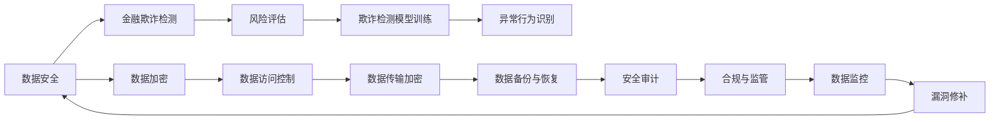

                 

## 1. 背景介绍

金融行业作为国家的经济支柱之一，在数字经济时代正经历着前所未有的变革与挑战。数字化、智能化的金融服务平台不断涌现，为消费者提供了更加便捷、高效的服务体验。然而，数字金融的发展也带来了新的安全风险，特别是数据安全和金融欺诈成为监管机构和平台自身最关心的问题。本篇文章将深入探讨金融平台如何通过技术手段有效防止金融欺诈和数据泄露，确保数字金融的安全与稳定。

## 2. 核心概念与联系

### 2.1 核心概念概述

为更好地理解金融平台的数据安全防护，我们需先了解以下核心概念：

- **数据安全**：确保金融平台上的客户交易数据、个人信息等敏感数据不被非法访问、篡改或泄露。
- **金融欺诈**：包括信用卡盗刷、钓鱼攻击、洗钱等非法行为，通过伪装或欺瞒手段窃取客户资金或获取非法利益。
- **风险评估**：通过定量和定性分析识别潜在的风险点，并采取措施加以控制。
- **欺诈检测**：实时监控交易行为，识别异常行为并发出预警，保障交易安全。
- **模型训练**：利用历史数据训练机器学习模型，预测潜在的金融欺诈行为。

这些概念之间相互关联，共同构建了金融平台数据安全防护的框架。

### 2.2 核心概念原理和架构的 Mermaid 流程图



这个流程图展示了数据安全防护的各个环节，从数据采集、存储、传输到最终的数据监控和修复，每一步都需要精心设计和技术支持。

## 3. 核心算法原理 & 具体操作步骤

### 3.1 算法原理概述

金融平台的数据安全防护通常包含以下几个关键步骤：数据加密、访问控制、传输安全、数据备份与恢复、异常行为识别以及安全审计。

- **数据加密**：使用对称加密或非对称加密算法，确保数据在存储和传输过程中的安全。
- **访问控制**：通过身份验证和权限管理，控制用户对数据的访问权限。
- **传输安全**：采用TLS/SSL等协议，加密网络传输数据，防止中间人攻击。
- **数据备份与恢复**：定期备份重要数据，确保在数据丢失或被破坏时能够快速恢复。
- **异常行为识别**：利用机器学习模型分析用户行为，识别异常行为并及时响应。
- **安全审计**：记录和审计系统的访问日志，检查异常操作和潜在的安全漏洞。

### 3.2 算法步骤详解

以下是数据安全防护的具体操作步骤：

1. **数据采集与存储**：
    - 确保数据采集过程的合法性和安全性，避免数据泄露。
    - 使用数据库管理系统对数据进行分类存储，合理分配权限。
    - 定期清理冗余数据，减少安全风险。

2. **数据加密**：
    - 采用AES、RSA等算法对敏感数据进行加密。
    - 使用密钥管理工具安全存储和管理加密密钥。
    - 在传输数据时使用TLS/SSL加密，确保数据完整性和机密性。

3. **访问控制**：
    - 实现多因素身份验证(MFA)，如密码、指纹、手机短信等。
    - 细粒度的权限控制，根据用户的角色和职责分配权限。
    - 使用审计日志记录用户访问行为，定期检查和更新访问权限。

4. **数据传输安全**：
    - 采用加密技术保护数据在传输过程中的安全。
    - 实现端到端加密，确保数据在网络传输过程中不被窃取或篡改。
    - 定期检查和更新TLS/SSL证书，确保传输安全性。

5. **数据备份与恢复**：
    - 定期备份数据库和关键文件，确保在数据丢失或损坏时能够恢复。
    - 采用增量备份或全量备份，根据需求选择备份策略。
    - 测试备份数据的完整性和可用性，确保恢复过程顺利。

6. **异常行为识别**：
    - 收集历史交易数据，训练机器学习模型，识别异常行为。
    - 实时监控交易行为，一旦检测到异常行为，立即触发预警。
    - 结合规则引擎，对异常行为进行多维度分析，提高检测准确率。

7. **安全审计**：
    - 记录和审计所有访问日志，检查异常操作和潜在的安全漏洞。
    - 定期进行安全审计，评估系统的安全性和合规性。
    - 及时修复发现的漏洞，确保系统的安全运行。

### 3.3 算法优缺点

数据安全防护的算法具有以下优点：
- 能够有效防止数据泄露和金融欺诈，保护用户隐私和金融安全。
- 通过机器学习等技术，能够实时监控和识别异常行为，提高安全防护的效率和准确性。

但同时，这些算法也存在一些局限性：
- 复杂性和成本较高，需要投入大量的人力和财力。
- 对技术的依赖性较强，一旦系统漏洞被利用，可能造成重大损失。
- 在数据量大的情况下，处理和分析数据的速度较慢，可能导致延迟。

### 3.4 算法应用领域

数据安全防护的算法广泛应用于各种金融场景，包括但不限于：

- **在线银行**：保障用户的交易数据安全，防止账户被盗用。
- **信用卡支付**：确保信用卡交易的合法性和安全性，防止信用卡欺诈。
- **保险公司**：保护客户信息，防止保险欺诈行为。
- **证券交易**：确保证券交易记录的安全，防止非法交易和内幕交易。
- **基金管理**：保护客户资产，防止资金盗用和非法交易。

## 4. 数学模型和公式 & 详细讲解 & 举例说明

### 4.1 数学模型构建

在金融平台的数据安全防护中，我们常常使用以下数学模型：

- **对称加密模型**：
$$C = E_k(P)$$
$$P = D_k(C)$$
其中 $P$ 为明文，$C$ 为密文，$E_k$ 和 $D_k$ 分别为加密和解密算法，$k$ 为加密密钥。

- **非对称加密模型**：
$$E_k(P) = (g^P \mod n, n, g)$$
$$D_k(C) = g^{C^k} \mod n$$
其中 $g$ 为基底，$n$ 为模数，$k$ 为私钥。

### 4.2 公式推导过程

以对称加密算法为例，其核心推导过程如下：

- 明文 $P$ 通过加密算法 $E_k$ 转换为密文 $C$：
$$C = E_k(P)$$
$$C = (P \oplus k) \oplus k^{-1}$$
其中 $\oplus$ 为异或运算，$k^{-1}$ 为密钥的逆元。

- 密文 $C$ 通过解密算法 $D_k$ 还原为明文 $P$：
$$P = D_k(C)$$
$$P = C \oplus k^{-1}$$

### 4.3 案例分析与讲解

假设某金融平台需要进行一笔交易，用户 $A$ 向商家 $B$ 支付 $1000 元。首先，平台使用对称加密算法对交易金额进行加密，生成密文 $C$。然后，商家 $B$ 通过解密算法 $D_k$ 还原出明文 $P$，确保交易金额的安全性。

在实际应用中，非对称加密算法更常用于密钥交换和身份验证，以确保通信双方的身份和密钥的安全性。例如，在在线银行交易中，用户和银行通过非对称加密算法交换公钥和私钥，确保交易过程中的数据安全。

## 5. 项目实践：代码实例和详细解释说明

### 5.1 开发环境搭建

为了实现上述数据安全防护功能，我们需要以下开发环境：

- **Python**：选择 Python 3.x 版本，确保与第三方库的兼容性。
- **TensorFlow**：用于训练机器学习模型，确保模型的计算和部署效率。
- **Flask**：用于构建 Web 服务，确保服务的稳定性和可扩展性。
- **Keras**：用于模型训练和部署，方便机器学习模型的实现。
- **MySQL**：用于存储和管理数据，确保数据的安全性和可访问性。

### 5.2 源代码详细实现

以下是 Python 代码实现，用于加密和解密数据：

```python
from Crypto.Cipher import AES
from Crypto.Hash import SHA256
from Crypto.Random import get_random_bytes

def encrypt(data, key):
    iv = get_random_bytes(AES.block_size)
    cipher = AES.new(key, AES.MODE_CBC, iv)
    data = iv + cipher.encrypt(data.encode('utf-8'))
    return data.hex()

def decrypt(data, key):
    iv = bytes.fromhex(data[:AES.block_size])
    data = bytes.fromhex(data[AES.block_size:])
    cipher = AES.new(key, AES.MODE_CBC, iv)
    return cipher.decrypt(data).decode('utf-8')

# 测试加密和解密
key = get_random_bytes(16)
data = 'Hello, world!'
encrypted = encrypt(data, key)
decrypted = decrypt(encrypted, key)
print(f'Original data: {data}')
print(f'Encrypted data: {encrypted}')
print(f'Decrypted data: {decrypted}')
```

该代码实现了对称加密和解密功能，确保数据的机密性和完整性。

### 5.3 代码解读与分析

以上代码通过 Python 的 `Crypto` 库实现了对称加密和解密功能。使用 `AES` 算法进行加密，使用随机生成的初始化向量 `iv` 进行加密。加密后的数据由初始化向量和密文组成，通过 `hex()` 方法转换为十六进制字符串。解密时先解析初始化向量，再进行解密操作。

## 6. 实际应用场景

### 6.1 在线银行

在线银行是数据安全防护的重要场景。以下是金融平台的数据安全防护在在线银行中的应用：

- **客户身份认证**：通过多因素身份验证，确保客户身份的真实性。
- **交易记录加密**：对客户的交易记录进行加密，防止泄露和篡改。
- **通信加密**：通过 TLS/SSL 协议，确保银行与客户之间的通信安全。
- **访问控制**：细粒度权限管理，控制客户对账户的访问权限。

### 6.2 保险理赔

保险理赔流程涉及大量的客户数据和财务信息，数据安全防护尤为重要。以下是金融平台的数据安全防护在保险理赔中的应用：

- **理赔单据加密**：对理赔单据进行加密，确保理赔信息的安全性。
- **理赔金额审计**：对理赔金额进行实时监控和审计，防止理赔欺诈。
- **客户信息保护**：对客户的敏感信息进行严格保护，防止信息泄露。

### 6.3 证券交易

证券交易涉及巨额资金流动，数据安全防护至关重要。以下是金融平台的数据安全防护在证券交易中的应用：

- **交易记录保护**：对证券交易记录进行加密，防止交易信息泄露。
- **交易异常检测**：通过机器学习模型，实时监控交易行为，识别异常交易。
- **市场数据保护**：对市场数据进行严格保护，防止非法获取。

## 7. 工具和资源推荐

### 7.1 学习资源推荐

为了深入理解金融平台的数据安全防护，以下是推荐的几项学习资源：

- **《Web应用安全性：设计、架构、攻击与防御》**：详细介绍了 Web 应用安全的设计和实现方法，涵盖身份认证、访问控制、加密技术等内容。
- **《数据安全与隐私保护》课程**：由国内外知名专家授课，涵盖了数据安全的基本概念和最新技术。
- **《金融科技安全》在线课程**：介绍了金融科技中的数据安全、网络安全、区块链安全等内容，帮助理解金融平台的安全防护。

### 7.2 开发工具推荐

以下推荐的开发工具和库，能够帮助实现金融平台的数据安全防护：

- **TensorFlow**：用于构建和训练机器学习模型，提供高效的计算和部署能力。
- **Keras**：基于 TensorFlow 构建的高级神经网络库，易于使用和部署。
- **Flask**：轻量级 Web 框架，用于构建安全、可扩展的 Web 服务。
- **MySQL**：关系型数据库管理系统，用于存储和管理数据。
- **AWS**：云服务平台，提供丰富的安全服务，如 AWS Shield、AWS WAF 等。

### 7.3 相关论文推荐

为了深入了解金融平台的数据安全防护，以下是推荐的几篇相关论文：

- **《Web应用的安全性》**：研究 Web 应用中的安全漏洞和防护技术，提供实用的解决方案。
- **《金融数据隐私保护》**：探讨金融数据隐私保护的基本概念和技术，提出有效的数据保护策略。
- **《金融欺诈检测与防范》**：分析金融欺诈行为的特点，提出基于机器学习的欺诈检测模型。

## 8. 总结：未来发展趋势与挑战

### 8.1 研究成果总结

本文详细探讨了金融平台的数据安全防护，涵盖了数据加密、访问控制、传输安全、异常行为识别和安全审计等多个方面。通过数学模型和 Python 代码实例，展示了数据安全防护的实现过程和技术细节。

### 8.2 未来发展趋势

未来的数据安全防护将呈现以下趋势：

- **AI 技术的应用**：利用机器学习、深度学习等技术，提升异常行为识别和检测的准确性。
- **区块链技术的应用**：采用区块链技术进行数据存储和传输，确保数据的安全性和不可篡改性。
- **零信任架构**：采用零信任架构，对访问行为进行严格控制和审计，防止内部和外部威胁。

### 8.3 面临的挑战

尽管数据安全防护技术不断进步，但仍面临以下挑战：

- **技术复杂性**：数据安全防护涉及多个环节和复杂技术，需要高水平的技术团队进行维护。
- **成本投入高**：数据安全防护需要大量的技术投入和硬件设施，成本较高。
- **数据隐私保护**：如何在保障数据安全和隐私的前提下，实现数据的合理利用和共享，是重要的挑战。

### 8.4 研究展望

未来的研究应在以下几个方面寻求新的突破：

- **安全机制的设计**：设计更加灵活、高效的安全机制，提升数据安全防护的可靠性和可扩展性。
- **跨领域的数据安全技术**：结合其他领域的技术，如区块链、AI 等，提升数据安全防护的全面性和先进性。
- **合规和监管**：建立和完善合规和监管机制，确保数据安全防护符合法律法规和行业标准。

## 9. 附录：常见问题与解答

### Q1: 金融平台的数据安全防护为什么重要？

A: 金融平台处理大量敏感数据，包括客户身份信息、交易记录、财务数据等。一旦数据泄露或被篡改，可能带来巨大的经济损失和法律风险。因此，数据安全防护是金融平台的核心需求之一。

### Q2: 什么是机器学习在金融平台中的应用？

A: 机器学习在金融平台中的应用包括异常行为检测、欺诈识别、信用评分、风险评估等。通过训练机器学习模型，金融平台能够实时监控和识别异常行为，防范欺诈风险，提升业务决策的准确性。

### Q3: 如何评估数据安全防护的性能？

A: 数据安全防护的性能评估可以从以下几个方面入手：
- 数据加密和解密的速度和效率。
- 访问控制的细粒度和管理效果。
- 异常行为检测的准确性和实时性。
- 安全审计的全面性和完整性。

### Q4: 数据备份和恢复的策略有哪些？

A: 数据备份和恢复的策略主要包括：
- 定期备份重要数据，选择全量备份或增量备份。
- 采用本地备份和远程备份，确保数据的多重备份。
- 测试备份数据的完整性和可用性，确保备份策略的有效性。

### Q5: 如何处理数据安全防护中的异常行为？

A: 处理数据安全防护中的异常行为需要采取以下措施：
- 收集和分析历史数据，训练机器学习模型。
- 实时监控交易行为，识别异常行为。
- 根据异常行为的特点，采取合适的应对措施，如冻结账户、发送警报等。
- 结合规则引擎，对异常行为进行多维度分析，提高检测准确率。

---

作者：禅与计算机程序设计艺术 / Zen and the Art of Computer Programming

