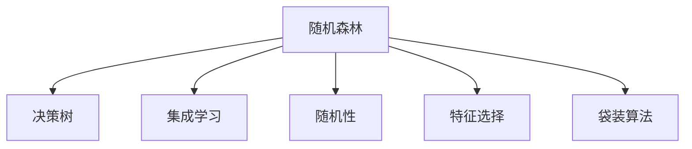

                 

# 随机森林 原理与代码实例讲解

> 关键词：随机森林,决策树,特征选择,集成学习,分类器,回归器

## 1. 背景介绍

### 1.1 问题由来
随机森林是一种基于决策树的集成学习算法，由PACI（Pattern Recognition and Machine Learning）的创始人之一Breiman于2001年提出。随机森林不仅在数据挖掘、特征选择、分类与回归等领域广受关注，还在金融风控、医疗诊断、自然语言处理等多个应用场景中显示出强大的潜力。

### 1.2 问题核心关键点
随机森林算法的核心在于：
1. **集成学习**：通过将多个决策树组合起来，提升模型的泛化能力和鲁棒性。
2. **随机性**：在决策树的构建过程中，随机选择样本和特征，以避免过拟合。
3. **特征选择**：通过随机选择子集特征，提升模型在训练和预测阶段的效率。
4. **并行计算**：随机森林具有很好的并行处理能力，可以在分布式系统上高效运行。

## 2. 核心概念与联系

### 2.1 核心概念概述

为更好地理解随机森林算法，本节将介绍几个密切相关的核心概念：

- **决策树（Decision Tree）**：一种基于树形结构的分类器，通过对特征进行选择和划分，将数据集递归地划分为纯净的子集，直至到达叶节点。决策树的输出是叶节点的类别。

- **集成学习（Ensemble Learning）**：通过将多个模型组合起来，形成集成模型，以提升整体的预测准确性和鲁棒性。集成学习可以进一步分为Bagging、Boosting等不同方法。

- **随机性（Randomness）**：在随机森林中，决策树的构建过程具有随机性，具体体现在两个方面：
  1. **随机选择样本**：每个决策树的训练样本是从原始数据集中随机抽取的，从而避免了数据集的重复使用。
  2. **随机选择特征**：每个决策树的划分特征是从所有特征中随机选择的子集。

- **特征选择（Feature Selection）**：随机森林中，每个决策树的构建过程仅使用部分特征，从而提高了模型训练和预测的效率。

- **袋装算法（Bagging）**：随机森林属于Bagging算法的一种特殊形式，即通过Bagging方法结合决策树进行集成学习。

这些核心概念之间存在紧密的逻辑联系，共同构成了随机森林算法的理论基础。

### 2.2 核心概念原理和架构的 Mermaid 流程图


这个流程图展示出随机森林的核心概念及其联系：

1. **A 随机森林**：作为集成学习的一种形式，通过随机性、特征选择和决策树结合，形成最终的模型。
2. **B 决策树**：随机森林中的基本单元，通过划分特征构建树形结构。
3. **C 集成学习**：随机森林的总体框架，通过多个决策树的组合提升模型效果。
4. **D 随机性**：随机森林的两个核心特性，避免过拟合。
5. **E 特征选择**：提升模型训练和预测效率。
6. **F 袋装算法**：随机森林的具体实现方式。

## 3. 核心算法原理 & 具体操作步骤
### 3.1 算法原理概述

随机森林是一种集成学习算法，其核心思想是：通过构建多个决策树，并组合其预测结果，提升模型的泛化能力和鲁棒性。在决策树的构建过程中，随机森林采用了随机性和特征选择策略，以避免过拟合和提升模型效率。

### 3.2 算法步骤详解

随机森林的构建过程包括以下步骤：

**Step 1: 数据准备**
- 收集原始数据集，划分为训练集和测试集。
- 进行数据预处理，如数据清洗、归一化、缺失值处理等。

**Step 2: 构建单个决策树**
- 随机选择训练样本。从原始数据集中随机抽取样本，避免重复使用。
- 随机选择特征。从所有特征中随机选择一部分子集特征，用于划分。
- 使用CART算法构建决策树。
  1. 选择一个划分特征。
  2. 对特征进行二值分割，将数据集划分为纯净的子集。
  3. 递归进行划分，直至到达叶节点，并输出叶节点的类别。

**Step 3: 集成模型**
- 重复Step 2，构建多个决策树。
- 对每个决策树的预测结果进行投票或平均，得到最终的预测结果。
- 输出随机森林的预测结果。

### 3.3 算法优缺点

随机森林算法具有以下优点：
1. 泛化能力强：通过集成多个决策树，随机森林能够更好地捕捉数据的复杂模式。
2. 鲁棒性好：每个决策树的随机性，使随机森林对异常值和噪声具有较强的容忍度。
3. 可解释性高：通过可视化决策树，可以对模型的决策过程进行解释和分析。
4. 模型高效：决策树的并行计算能力，使随机森林能够快速处理大规模数据集。

同时，该算法也存在一些缺点：
1. 模型复杂：随机森林的参数较多，模型训练时间较长。
2. 内存消耗大：由于每个决策树的构建需要保存多个子集特征，内存消耗较大。
3. 随机性高：随机选择样本和特征，可能导致模型的稳定性和可重复性降低。
4. 计算开销大：随机森林的计算开销较大，不适合处理高维稀疏数据。

### 3.4 算法应用领域

随机森林在多个领域得到广泛应用：

- **数据挖掘**：通过分类和回归任务，随机森林能够自动挖掘数据中的模式和规律。
- **特征选择**：随机森林的特征重要性评估，能够帮助选择最佳的特征集。
- **医疗诊断**：在医疗数据中，随机森林可用于疾病的分类和预测。
- **金融风控**：在金融数据中，随机森林可用于信用评估、风险预测等任务。
- **自然语言处理**：在文本数据中，随机森林可用于情感分析、主题分类等任务。

## 4. 数学模型和公式 & 详细讲解  
### 4.1 数学模型构建

随机森林的数学模型可以形式化地描述为：

$$
F = \{ T_1, T_2, \dots, T_n \}
$$

其中，$F$ 表示随机森林，$T_i$ 表示第 $i$ 棵决策树。每个决策树 $T_i$ 的形式化定义如下：

$$
T_i = \left\{ \left\{ T_i, S_i, F_i \right\} \right\}
$$

其中：
- $S_i$ 表示第 $i$ 棵树的训练样本集合。
- $F_i$ 表示第 $i$ 棵树的划分特征集合。

### 4.2 公式推导过程

在决策树 $T_i$ 的构建过程中，需要进行以下推导：

1. **样本划分**：
   - 从数据集 $D$ 中随机抽取 $n$ 个样本，记为 $S_i = \{x_1, x_2, \dots, x_n\}$。
   - 对每个样本 $x_j$，随机选择 $m$ 个特征，记为 $F_i = \{f_{ij}\}$。

2. **特征划分**：
   - 对每个特征 $f_{ij}$，随机选择 $k$ 个阈值，记为 $\{\tau_{ik}\}$。
   - 对每个样本 $x_j$，计算 $x_j$ 在每个阈值 $\tau_{ik}$ 下的值，记为 $\{x_j(\tau_{ik})\}$。
   - 选择最优阈值 $\tau_{ik}^*$，使得该阈值下样本集的纯度最高。

3. **节点划分**：
   - 将样本集合 $S_i$ 根据最优阈值 $\tau_{ik}^*$ 划分为两个子集 $S_{i1}$ 和 $S_{i2}$。
   - 递归进行划分，直至到达叶节点。

### 4.3 案例分析与讲解

以分类任务为例，假设有一个包含两类数据（类别0和类别1）的数据集 $D = \{x_1, x_2, \dots, x_n\}$。使用随机森林进行分类时，随机森林 $F$ 由多棵决策树组成，每棵树 $T_i$ 的构建过程如下：

1. **样本选择**：随机从数据集 $D$ 中选择 $n$ 个样本，记为 $S_i = \{x_1, x_2, \dots, x_n\}$。
2. **特征选择**：随机选择 $m$ 个特征，记为 $F_i = \{f_{ij}\}$。
3. **节点划分**：对每个特征 $f_{ij}$，随机选择 $k$ 个阈值，计算每个阈值下的样本集纯度，选择最优阈值 $\tau_{ik}^*$。
4. **叶节点输出**：将叶节点标记为类别0或类别1。

最终，通过投票或平均的方式，输出随机森林的分类结果。

## 5. 项目实践：代码实例和详细解释说明
### 5.1 开发环境搭建

在使用Python进行随机森林实践时，需要以下开发环境：

1. 安装Python：确保Python版本为3.6及以上。
2. 安装pandas：用于数据处理。
3. 安装scikit-learn：用于实现随机森林算法。

```bash
pip install pandas
pip install scikit-learn
```

### 5.2 源代码详细实现

以下是一个简单的随机森林分类器实现：

```python
import numpy as np
import pandas as pd
from sklearn.ensemble import RandomForestClassifier

# 读取数据集
df = pd.read_csv('data.csv')

# 数据预处理
X = df.drop('label', axis=1)
y = df['label']
X = X.values
y = y.values

# 创建随机森林分类器
rfc = RandomForestClassifier(n_estimators=100, random_state=42)

# 训练模型
rfc.fit(X, y)

# 预测测试集
X_test = pd.read_csv('test_data.csv')
X_test = X_test.values
y_pred = rfc.predict(X_test)

# 输出结果
print(y_pred)
```

### 5.3 代码解读与分析

**代码解析**：
1. **数据读取**：使用pandas读取数据集。
2. **数据预处理**：将数据集分为特征和标签，并进行归一化处理。
3. **创建随机森林分类器**：使用scikit-learn库中的RandomForestClassifier创建随机森林分类器，设置参数。
4. **训练模型**：使用fit方法训练模型。
5. **预测测试集**：使用predict方法对测试集进行预测。
6. **输出结果**：输出预测结果。

**代码优化**：
- **参数调整**：设置不同的n_estimators、max_depth等参数，以优化模型效果。
- **交叉验证**：使用交叉验证方法，评估模型性能。
- **并行计算**：使用joblib库进行并行计算，加速模型训练。

**性能优化**：
- **特征选择**：使用scikit-learn中的特征选择方法，优化特征集合。
- **数据增强**：使用数据增强技术，增加样本多样性。
- **模型裁剪**：使用模型裁剪技术，减小模型尺寸。

## 6. 实际应用场景
### 6.1 金融风控

金融行业需要实时监控用户的信用风险，随机森林在金融风控中得到了广泛应用。通过分析用户的信用历史、消费行为、社交网络等数据，随机森林能够快速评估用户的信用风险，防止金融欺诈行为。

在实际应用中，可以将用户的历史数据输入随机森林模型，输出用户的信用评分。对于高风险用户，可以采取更严格的审核措施，确保金融系统的安全性。

### 6.2 医疗诊断

在医疗领域，随机森林常用于疾病的诊断和治疗方案推荐。通过分析患者的病历数据、基因数据等，随机森林能够预测患者的病情，并推荐最适合的治疗方案。

例如，使用随机森林模型对患者的基因数据进行分析，预测患者患某种疾病的概率，并根据基因特征推荐相应的治疗方案。

### 6.3 电商推荐

电商公司需要根据用户的历史行为和偏好，推荐合适的商品。随机森林可以用于分析用户的购物数据、浏览历史等，预测用户对商品的兴趣，推荐相应的商品。

例如，使用随机森林模型对用户的浏览记录进行分析，预测用户对某类商品的兴趣，并推荐类似商品。

## 7. 工具和资源推荐
### 7.1 学习资源推荐

为了帮助开发者系统掌握随机森林算法，以下推荐一些优质的学习资源：

1. 《Python机器学习》：Hands-On Machine Learning with Scikit-Learn, Keras, and TensorFlow 的中文版，详细介绍了随机森林的原理和实现。
2. Coursera的《机器学习》课程：由斯坦福大学Andrew Ng教授授课，涵盖随机森林等机器学习算法。
3. Kaggle的随机森林比赛：参加Kaggle的比赛，实战演练随机森林算法，提升技能。
4. scikit-learn官方文档：详细介绍了随机森林算法的实现和应用。
5. 《随机森林：原理与实践》：开源书籍，深入讲解随机森林的原理和应用。

### 7.2 开发工具推荐

在随机森林开发过程中，以下工具值得推荐：

1. Jupyter Notebook：用于编写和调试代码，支持代码块和图形界面。
2. Python IDE：如PyCharm、VSCode等，提供代码编辑、调试和测试功能。
3. scikit-learn：提供了多种机器学习算法，包括随机森林算法。
4. joblib：用于并行计算，加速模型训练。
5. pandas：用于数据处理和分析。

### 7.3 相关论文推荐

以下是几篇奠基性的随机森林论文，推荐阅读：

1. Breiman, L. (2001). Random Forests. Machine Learning, 45(1), 5-32.
2. Quinlan, J. (1986). Induction of decision trees. Machine Learning, 1(1), 81-106.
3. Ho, T. K. (1998). The random subspace method for constructing random decision forests. Pattern Analysis and Machine Intelligence, 20(8), 832-844.
4. Pedregosa, F., Varoquaux, G., Gramfort, A., Michel, V., Thirion, B., Grisel, O., ... & Duchesnay, E. (2011). Scikit-learn: machine learning in Python. Journal of Machine Learning Research, 12, 2825-2830.

这些论文代表了随机森林算法的发展脉络，通过学习这些前沿成果，可以帮助研究者把握学科前进方向，激发更多的创新灵感。

## 8. 总结：未来发展趋势与挑战

### 8.1 总结

本文对随机森林算法进行了全面系统的介绍。首先阐述了随机森林算法的核心概念和原理，明确了集成学习在随机森林中的重要地位。其次，从原理到实践，详细讲解了随机森林的数学模型和实现步骤，给出了完整的代码实现示例。同时，本文还广泛探讨了随机森林算法在金融风控、医疗诊断、电商推荐等多个领域的应用前景，展示了随机森林算法的巨大潜力。此外，本文精选了随机森林算法的各类学习资源，力求为读者提供全方位的技术指引。

通过本文的系统梳理，可以看到，随机森林算法不仅在数据挖掘和特征选择等领域表现出色，还在多个实际应用场景中展示了其强大的能力。未来，伴随随机森林算法的持续演进，相信其在多个领域的应用将进一步拓展，为人类认知智能的进化带来深远影响。

### 8.2 未来发展趋势

展望未来，随机森林算法的发展趋势包括：

1. **高效化**：随着硬件计算能力的提升，随机森林算法将在处理大规模数据时更加高效。
2. **并行化**：利用分布式计算技术，随机森林算法可以在多核和集群上并行运行，加速模型训练。
3. **自适应**：引入自适应算法，使随机森林算法能够动态调整参数，提升模型效果。
4. **可解释性**：研究随机森林算法的可解释性，提高模型的透明度和可靠性。
5. **迁移学习**：将随机森林算法应用于跨领域迁移学习，提升模型的泛化能力。

这些趋势凸显了随机森林算法的广阔前景。未来，随机森林算法将在更多领域得到应用，为人类认知智能的进化带来新的推动力。

### 8.3 面临的挑战

尽管随机森林算法已经取得了显著成效，但在实际应用中，仍然面临诸多挑战：

1. **模型复杂**：随机森林算法的参数较多，模型训练时间较长。
2. **内存消耗大**：由于每个决策树的构建需要保存多个子集特征，内存消耗较大。
3. **随机性高**：随机选择样本和特征，可能导致模型的稳定性和可重复性降低。
4. **计算开销大**：随机森林的计算开销较大，不适合处理高维稀疏数据。

这些问题需要在算法优化和应用实践中不断改进。只有不断提升随机森林算法的性能和效率，才能满足实际应用的需求。

### 8.4 研究展望

为了应对随机森林算法面临的挑战，未来的研究需要在以下几个方面寻求新的突破：

1. **模型优化**：研究新的随机森林算法变体，如随机子空间森林、随机梯度森林等，提升模型的训练速度和准确性。
2. **特征选择**：研究更高效和可解释的特征选择方法，优化特征集合。
3. **并行计算**：研究分布式随机森林算法，利用分布式计算资源加速模型训练。
4. **自适应学习**：研究自适应随机森林算法，使模型能够动态调整参数，提升模型效果。
5. **可解释性**：研究随机森林算法的可解释性，提高模型的透明度和可靠性。

这些研究方向的探索，必将引领随机森林算法迈向更高的台阶，为构建安全、可靠、可解释、可控的智能系统铺平道路。面向未来，随机森林算法还需要与其他人工智能技术进行更深入的融合，如深度学习、强化学习等，多路径协同发力，共同推动自然语言理解和智能交互系统的进步。只有勇于创新、敢于突破，才能不断拓展随机森林算法的边界，让智能技术更好地造福人类社会。

## 9. 附录：常见问题与解答

**Q1: 随机森林和决策树的区别是什么？**

A: 随机森林是决策树的集成学习算法，通过构建多个决策树进行组合，提升模型的泛化能力和鲁棒性。相比之下，决策树是单个分类器，通过划分特征构建树形结构，预测输出。

**Q2: 随机森林在实际应用中需要注意哪些问题？**

A: 随机森林在实际应用中需要注意以下问题：
1. 数据预处理：进行数据清洗、归一化、缺失值处理等。
2. 特征选择：选择最佳的特征集合，提升模型效率。
3. 参数调整：设置不同的n_estimators、max_depth等参数，优化模型效果。
4. 并行计算：利用并行计算技术，加速模型训练。
5. 数据增强：使用数据增强技术，增加样本多样性。

**Q3: 随机森林在哪些领域有广泛应用？**

A: 随机森林在多个领域得到广泛应用，包括：
1. 金融风控：评估用户的信用风险，防止金融欺诈。
2. 医疗诊断：预测疾病的发生，推荐治疗方案。
3. 电商推荐：根据用户的历史行为，推荐合适的商品。
4. 数据挖掘：自动挖掘数据中的模式和规律。

**Q4: 随机森林的计算开销大，如何优化？**

A: 为了降低随机森林的计算开销，可以采用以下优化方法：
1. 特征选择：使用特征选择方法，优化特征集合。
2. 模型裁剪：使用模型裁剪技术，减小模型尺寸。
3. 并行计算：利用并行计算技术，加速模型训练。

**Q5: 随机森林的优缺点是什么？**

A: 随机森林算法的优点包括：
1. 泛化能力强：通过集成多个决策树，提升模型的泛化能力和鲁棒性。
2. 鲁棒性好：每个决策树的随机性，使随机森林对异常值和噪声具有较强的容忍度。
3. 可解释性高：通过可视化决策树，可以对模型的决策过程进行解释和分析。

随机森林算法的缺点包括：
1. 模型复杂：随机森林的参数较多，模型训练时间较长。
2. 内存消耗大：由于每个决策树的构建需要保存多个子集特征，内存消耗较大。
3. 随机性高：随机选择样本和特征，可能导致模型的稳定性和可重复性降低。
4. 计算开销大：随机森林的计算开销较大，不适合处理高维稀疏数据。

以上问题需要在算法优化和应用实践中不断改进，只有不断提升随机森林算法的性能和效率，才能满足实际应用的需求。

---

作者：禅与计算机程序设计艺术 / Zen and the Art of Computer Programming

