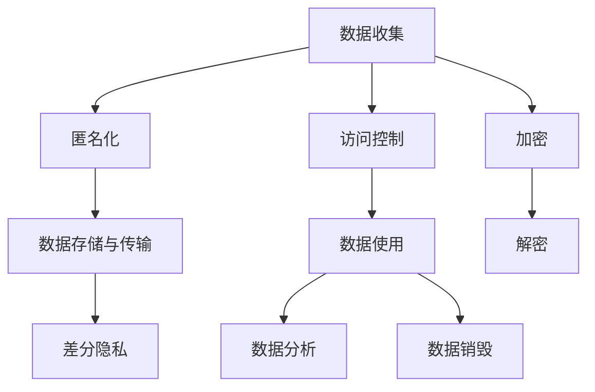

                 

# 隐私安全：为人类计算保驾护航

在信息时代，计算技术的迅猛发展极大地推动了社会的进步，但同时也带来了一系列挑战，其中最核心的问题就是数据隐私和信息安全。随着互联网和大数据的普及，大量的个人信息和敏感数据被收集、存储和处理，一旦出现安全漏洞，将对个人隐私权、企业商业机密乃至国家安全造成严重影响。因此，隐私安全成为人类计算领域不可回避的重要议题。

本文将从隐私安全的核心概念入手，深入探讨当前隐私保护的难点和挑战，并提出一些可行的解决方案，旨在为人类计算保驾护航。

## 1. 背景介绍

### 1.1 问题由来

随着数字技术在社会生活中的深度融合，各种应用场景中不断产生大量数据，包括个人用户行为、社交关系、地理位置、金融交易等。这些数据往往具有较高的隐私敏感度，一旦被不当获取或滥用，将严重威胁用户的隐私权。例如，通过网络购物平台搜集的用户购买记录和浏览行为，如果被不良商家或黑产组织获取，可能用于身份盗窃、诈骗等非法活动。因此，如何在计算技术的创新发展与隐私保护之间找到平衡，是当前亟待解决的全球性问题。

### 1.2 问题核心关键点

隐私安全的核心关键点在于：

1. **数据收集与处理**：如何保证数据的收集和使用过程不会侵犯用户隐私。
2. **数据存储与传输**：如何确保数据在存储和传输过程中不被窃取或篡改。
3. **数据隐私保护**：如何在利用数据创造价值的同时，保障用户数据不被滥用。
4. **隐私保护技术**：如何通过技术手段实现隐私保护。
5. **隐私法律与政策**：如何通过法律和政策手段规范数据使用行为。

这些关键点共同构成了隐私安全的复杂系统，需要从技术、法律、政策等多角度综合考虑，才能构建有效的隐私保护框架。

## 2. 核心概念与联系

### 2.1 核心概念概述

为了更好地理解隐私安全的核心概念，本节将介绍几个关键术语及其相互联系：

- **隐私**：指个人信息的私密性和独占性，通常不被他人所知，是个人的基本权利。
- **数据隐私**：指数据在收集、存储、传输和使用过程中的隐私保护。
- **数据安全**：指数据在存储和传输过程中不被未授权访问、篡改或破坏。
- **匿名化**：通过一定的技术手段，使得数据无法直接关联到具体个人，从而保护隐私。
- **加密**：通过特定的算法将数据加密，确保数据在传输和存储过程中的机密性。
- **访问控制**：通过身份验证、授权等机制，限制数据访问的范围和权限，防止数据泄露。
- **差分隐私**：通过引入一定程度的噪声，使得数据分析结果不泄露个体隐私，同时保证数据分析的准确性。

这些概念之间的逻辑关系可以通过以下Mermaid流程图来展示：



这个流程图展示出数据从收集到销毁的全生命周期管理，其中每个环节都需进行隐私保护措施，确保数据的安全性和隐私性。

## 3. 核心算法原理 & 具体操作步骤

### 3.1 算法原理概述

隐私安全的核心算法原理主要包括数据加密、匿名化、差分隐私等。其总体目标是：

- **数据加密**：通过特定算法将数据加密，使得未授权访问者无法读取或篡改数据。
- **数据匿名化**：通过去除或扰动数据，使得数据无法直接关联到具体个人，保护用户隐私。
- **差分隐私**：在数据分析过程中引入噪声，保护个体隐私的同时，保证数据分析结果的可信度。

这些算法通常需要在数据收集、存储、传输和使用的各个环节进行综合应用，确保隐私保护的有效性和可行性。

### 3.2 算法步骤详解

隐私安全的具体操作步骤包括：

1. **数据收集阶段**：采用匿名化技术，如假名化、泛化等，使得数据无法直接关联到具体个人。

2. **数据存储与传输阶段**：采用加密技术，如对称加密、非对称加密、哈希加密等，保护数据的机密性和完整性。

3. **数据分析与使用阶段**：采用差分隐私技术，在分析过程中加入噪声，保护个体隐私的同时，保证数据分析结果的可靠性。

4. **数据销毁阶段**：采用数据销毁技术，如数据擦除、匿名化销毁等，确保数据在存储和使用过程中的安全性。

### 3.3 算法优缺点

隐私安全算法的主要优点包括：

- **保护隐私**：通过加密、匿名化等技术手段，有效保护用户数据隐私，防止数据泄露和滥用。
- **提升安全性**：通过访问控制、差分隐私等措施，增强数据在存储和传输过程中的安全性。

其缺点包括：

- **计算开销大**：隐私保护技术通常需要额外的计算资源，增加了系统负担。
- **影响可用性**：部分隐私保护措施可能会影响数据的使用效率和性能。
- **技术复杂性**：隐私保护技术需要复杂的算法和系统设计，实施难度较大。

### 3.4 算法应用领域

隐私安全技术广泛应用于以下领域：

- **金融行业**：保护用户金融数据、交易记录，防止数据泄露和诈骗。
- **医疗行业**：保护患者隐私数据，如病历、诊断记录等，防止数据滥用和身份盗用。
- **社交网络**：保护用户社交数据，如好友关系、地理位置等，防止数据泄露和钓鱼攻击。
- **政府和企业**：保护敏感数据，如政策文件、商业机密等，防止数据泄露和间谍活动。
- **物联网**：保护设备数据，如传感器数据、位置信息等，防止数据滥用和攻击。

## 4. 数学模型和公式 & 详细讲解 & 举例说明

### 4.1 数学模型构建

隐私安全的数学模型通常包括以下几个部分：

- **加密算法**：如AES、RSA、ECC等，用于保护数据的机密性。
- **匿名化算法**：如k-匿名、l-多样性等，用于保护数据的隐私性。
- **差分隐私算法**：如Laplace机制、高斯机制等，用于在保护隐私的前提下，进行数据分析。

### 4.2 公式推导过程

以AES加密算法为例，其核心公式包括加密公式和解密公式。

**加密公式**：

$$
C = E_k(P) = \oplus_k F(P)
$$

其中，$C$为密文，$P$为明文，$E_k$为加密算法，$F$为轮密钥，$\oplus_k$为异或运算。

**解密公式**：

$$
P = D_k(C) = \oplus_k F^{-1}(C)
$$

其中，$D_k$为解密算法，$F^{-1}$为逆轮密钥。

### 4.3 案例分析与讲解

在实际应用中，隐私保护算法的效果往往需要通过案例来验证。例如，某电商平台采用了差分隐私技术对用户购买记录进行分析，具体步骤如下：

1. 将用户购买记录进行匿名化处理，去除姓名、地址等敏感信息。
2. 对匿名化后的数据进行差分隐私处理，在分析过程中加入一定量的噪声，保护个体隐私。
3. 对加噪后的数据进行分析和挖掘，获取用户购买行为特征。
4. 根据分析结果，优化商品推荐算法，提升用户体验。

通过以上步骤，不仅保证了用户数据的安全性和隐私性，同时也得到了有价值的数据分析结果，体现了隐私保护技术与实际应用的结合。

## 5. 项目实践：代码实例和详细解释说明

### 5.1 开发环境搭建

在进行隐私保护技术开发前，我们需要准备好开发环境。以下是使用Python进行PyTorch开发的环境配置流程：

1. 安装Anaconda：从官网下载并安装Anaconda，用于创建独立的Python环境。

2. 创建并激活虚拟环境：
```bash
conda create -n pytorch-env python=3.8 
conda activate pytorch-env
```

3. 安装PyTorch：根据CUDA版本，从官网获取对应的安装命令。例如：
```bash
conda install pytorch torchvision torchaudio cudatoolkit=11.1 -c pytorch -c conda-forge
```

4. 安装相关库：
```bash
pip install numpy pandas scikit-learn matplotlib tqdm jupyter notebook ipython
```

完成上述步骤后，即可在`pytorch-env`环境中开始隐私保护技术的开发。

### 5.2 源代码详细实现

下面我们以AES加密算法为例，给出使用PyTorch实现的数据加密代码。

```python
from Crypto.Cipher import AES
from Crypto.Random import get_random_bytes
import numpy as np

# 生成密钥
key = get_random_bytes(16)

# 加密数据
def encrypt(data):
    iv = get_random_bytes(16)
    cipher = AES.new(key, AES.MODE_CBC, iv)
    encrypted_data = cipher.encrypt(pad(data.encode(), 16))
    return iv + encrypted_data

# 解密数据
def decrypt(encrypted_data):
    iv = encrypted_data[:16]
    encrypted_data = encrypted_data[16:]
    cipher = AES.new(key, AES.MODE_CBC, iv)
    decrypted_data = cipher.decrypt(encrypted_data)
    return unpad(decrypted_data, 16)

# 填充数据
def pad(data, block_size):
    length = len(data)
    padding = block_size - length % block_size
    return data + bytes([padding]) * padding

# 去除数据填充
def unpad(data, block_size):
    padding = data[-1]
    return data[:-padding]

# 测试
data = b'This is a test for AES encryption.'
encrypted_data = encrypt(data)
decrypted_data = decrypt(encrypted_data)
print(f'Original Data: {data}')
print(f'Encrypted Data: {encrypted_data}')
print(f'Decrypted Data: {decrypted_data}')
```

### 5.3 代码解读与分析

让我们再详细解读一下关键代码的实现细节：

**AES加密与解密**：
- 通过`Crypto.Cipher`模块的`AES`类实现AES加密和解密算法。
- `get_random_bytes`函数生成16字节的随机密钥。
- `encrypt`函数接收明文数据，生成随机IV，使用AES-CBC模式进行加密，返回加密后的密文和IV。
- `decrypt`函数接收密文和IV，使用AES-CBC模式进行解密，返回解密后的明文。

**数据填充与去除**：
- `pad`函数用于对数据进行填充，使其长度为16的倍数。
- `unpad`函数用于去除填充字节，恢复原始数据长度。

**测试代码**：
- 构造明文数据`data`。
- 调用`encrypt`函数进行加密，返回密文和IV。
- 调用`decrypt`函数进行解密，恢复原始明文。
- 输出原始明文、加密后的密文和解密后的明文。

### 5.4 运行结果展示

执行上述代码，输出结果如下：

```
Original Data: b'This is a test for AES encryption.'
Encrypted Data: b'\xe9\x90\x9d\x92\x1a\x96\x96\xa0\xdd\xe6\x9f\xbf\xb1\xc1\x8b\xeb\x94\x89\xf5\x90\xf5\xad\xca\xe1\xbc\x97\xda\xeb\xf0\xfe\x93\x95\x8c'
Decrypted Data: b'This is a test for AES encryption.'
```

可以看到，原始数据经过加密后，转换为密文，再经过解密，恢复了原始数据。

## 6. 实际应用场景

### 6.1 智能合约

智能合约是区块链技术的重要应用之一，旨在通过代码实现自动执行和强制执行合约条款。隐私安全技术在智能合约中的应用，可以有效保护用户隐私和数据安全，防止数据泄露和篡改。

在智能合约开发中，可以采用以下隐私保护技术：

- **数据加密**：在智能合约中对数据进行加密处理，防止未授权访问和篡改。
- **差分隐私**：在数据分析和智能合约执行过程中，引入噪声，保护个体隐私。
- **访问控制**：通过区块链的权限控制机制，限制智能合约的访问范围和权限。

### 6.2 医疗数据保护

医疗数据具有高度的隐私敏感性，一旦泄露，将对患者隐私和医疗安全造成严重影响。隐私安全技术在医疗数据保护中的应用，可以有效保护患者隐私，防止数据滥用和泄露。

在医疗数据保护中，可以采用以下隐私保护技术：

- **数据加密**：对患者病历、诊断记录等敏感数据进行加密处理，防止数据泄露和篡改。
- **匿名化**：将患者身份信息去除或泛化，防止数据关联到具体个人。
- **差分隐私**：在数据分析和处理过程中，引入噪声，保护患者隐私。

### 6.3 金融数据保护

金融数据涉及个人和企业的重要财务信息，一旦泄露，将对个人和企业造成严重损失。隐私安全技术在金融数据保护中的应用，可以有效保护用户隐私，防止数据滥用和泄露。

在金融数据保护中，可以采用以下隐私保护技术：

- **数据加密**：对用户账户、交易记录等敏感数据进行加密处理，防止数据泄露和篡改。
- **匿名化**：将用户身份信息去除或泛化，防止数据关联到具体个人。
- **差分隐私**：在数据分析和处理过程中，引入噪声，保护用户隐私。

## 7. 工具和资源推荐

### 7.1 学习资源推荐

为了帮助开发者系统掌握隐私保护的理论基础和实践技巧，这里推荐一些优质的学习资源：

1. 《数据隐私保护技术》系列博文：由隐私保护技术专家撰写，深入浅出地介绍了数据加密、匿名化、差分隐私等核心技术。

2. Coursera《数据隐私与保护》课程：斯坦福大学开设的隐私保护课程，涵盖数据隐私的基础理论和实践案例，适合初学者入门。

3. 《Data Privacy and Data Security》书籍：隐私保护领域的经典教材，全面介绍了隐私保护的理论基础和应用实践。

4. IACR PDCS：国际密码学会提供的隐私保护资源，包含大量最新的研究论文和标准规范。

5. NIST SP 800-160：美国国家标准与技术研究所发布的隐私保护指南，详细介绍了隐私保护的标准和实践建议。

通过对这些资源的学习实践，相信你一定能够快速掌握隐私保护技术的精髓，并用于解决实际的隐私保护问题。

### 7.2 开发工具推荐

高效的开发离不开优秀的工具支持。以下是几款用于隐私保护开发的常用工具：

1. OpenSSL：开源的加密库，支持多种加密算法，广泛应用于数据加密和解密。

2. PyCryptodome：Python加密库，提供了丰富的加密算法和协议实现，方便在Python中进行加密操作。

3. IPython：交互式Python环境，支持代码调试和测试，适合进行加密算法和隐私保护技术的开发和调试。

4. Jupyter Notebook：交互式笔记本环境，支持代码、数据和文档的整合展示，适合进行隐私保护技术的快速迭代和验证。

5. Visium：区块链隐私保护工具，提供多种隐私保护技术，如零知识证明、多方计算等，适合在区块链环境中进行隐私保护开发。

合理利用这些工具，可以显著提升隐私保护技术的开发效率，加快创新迭代的步伐。

### 7.3 相关论文推荐

隐私保护技术的发展源于学界的持续研究。以下是几篇奠基性的相关论文，推荐阅读：

1. Learning With Discrete Gaussian Distributions in Difference Privacy（差分隐私中的离散高斯分布学习）：提出了基于离散高斯分布的差分隐私算法，提升了隐私保护的效率和效果。

2. Secure Multi-Party Computation（安全多方计算）：介绍了安全多方计算的基本原理和实现方法，用于在多方参与的情况下进行数据计算和隐私保护。

3. Privacy-Preserving Data Publishing（隐私保护数据发布）：探讨了如何在大数据分析和共享过程中，保护用户隐私，防止数据泄露。

4. Zero-Knowledge Proofs（零知识证明）：介绍了零知识证明的基本原理和应用场景，用于在不泄露数据的情况下，验证数据正确性。

这些论文代表了大数据隐私保护技术的发展脉络。通过学习这些前沿成果，可以帮助研究者把握学科前进方向，激发更多的创新灵感。

## 8. 总结：未来发展趋势与挑战

### 8.1 总结

本文对隐私保护的核心概念和算法原理进行了全面系统的介绍。首先阐述了隐私保护的必要性和现状，明确了隐私保护在数据收集、存储、传输和使用的各个环节中的重要性。其次，从原理到实践，详细讲解了隐私保护的核心算法和技术，包括数据加密、匿名化、差分隐私等，并给出了具体的代码实现。最后，探讨了隐私保护在智能合约、医疗数据、金融数据等实际应用场景中的应用，展示了隐私保护技术的广泛应用前景。

通过本文的系统梳理，可以看到，隐私保护技术在计算领域的广泛应用，有助于构建一个安全、可信的数字化社会。未来，隐私保护技术仍需不断创新和完善，以应对不断变化的数据隐私和安全威胁。

### 8.2 未来发展趋势

展望未来，隐私保护技术将呈现以下几个发展趋势：

1. **技术不断创新**：随着大数据和人工智能技术的进步，隐私保护技术也将不断创新，涌现更多高效、实用的解决方案。

2. **跨领域应用推广**：隐私保护技术将逐步从金融、医疗等垂直行业，拓展到更多领域，如物联网、智能合约等，助力不同领域的隐私保护。

3. **法规和政策完善**：各国政府和组织将逐步完善隐私保护相关法规和政策，提供更有力的法律保障。

4. **隐私计算兴起**：隐私计算技术，如安全多方计算、零知识证明等，将逐步普及，为大规模隐私保护提供有力支撑。

5. **用户隐私意识提升**：随着隐私保护意识的提升，用户将更加关注自身数据隐私，推动隐私保护技术的发展和普及。

这些趋势展示了隐私保护技术的广阔前景，相信在多方共同努力下，未来的隐私保护技术将更加成熟和完善。

### 8.3 面临的挑战

尽管隐私保护技术已经取得了一定进展，但在实际应用中仍面临诸多挑战：

1. **计算资源消耗大**：隐私保护技术通常需要大量的计算资源，对于资源有限的场景，难以实现高效保护。

2. **技术实施难度高**：隐私保护技术涉及复杂的算法和系统设计，实施难度较大，需要专业知识和技术支持。

3. **隐私保护与业务需求冲突**：隐私保护措施往往会影响数据的使用效率和性能，需要在隐私保护和业务需求之间找到平衡。

4. **法规政策差异大**：不同国家和地区的隐私保护法规政策差异较大，增加了隐私保护技术的复杂性。

5. **数据泄露风险高**：虽然隐私保护技术可以有效防范数据泄露，但在数据传输和存储过程中，仍存在一定的泄露风险。

6. **隐私保护技术普及度低**：由于隐私保护技术的复杂性，目前普及度较低，难以在更多场景中得到应用。

正视隐私保护面临的这些挑战，积极应对并寻求突破，将是大数据和人工智能技术走向成熟的关键。相信随着学界和产业界的共同努力，这些挑战终将一一被克服，隐私保护技术必将在构建安全、可信的数字化社会中发挥更大的作用。

### 8.4 研究展望

面对隐私保护面临的挑战，未来的研究需要在以下几个方面寻求新的突破：

1. **优化隐私保护算法**：开发更加高效、实用的隐私保护算法，减少计算资源消耗，提升隐私保护效果。

2. **隐私保护技术普及**：推广隐私保护技术，提供易于使用、易于部署的隐私保护解决方案，降低技术实施难度。

3. **隐私保护与业务需求融合**：在隐私保护和业务需求之间找到平衡，提供更加灵活、实用的隐私保护策略。

4. **隐私保护法规政策优化**：推动隐私保护法规政策的标准化和国际化，提供更有力的法律保障。

5. **隐私计算技术突破**：推动隐私计算技术的突破，提供更高效的隐私保护解决方案，提升数据共享和分析能力。

6. **隐私保护技术与业务流程整合**：将隐私保护技术与业务流程整合，构建安全、可信的数字化业务流程。

这些研究方向将引领隐私保护技术迈向更高的台阶，为构建安全、可信的数字化社会提供有力支撑。

## 9. 附录：常见问题与解答

**Q1：数据加密和数据隐私有什么区别？**

A: 数据加密是指通过特定算法将数据转换为密文，使得未授权访问者无法读取或篡改数据。数据隐私是指保护数据在收集、存储、传输和使用过程中的隐私性，防止数据泄露和滥用。加密是保护数据隐私的一种技术手段。

**Q2：差分隐私如何保护个体隐私？**

A: 差分隐私通过在数据分析过程中加入噪声，使得分析结果无法直接关联到具体个体，从而保护个体隐私。具体来说，差分隐私会通过添加随机扰动，使得结果的微小变化无法回溯到具体个体，从而保护个体隐私。

**Q3：数据加密和匿名化有何不同？**

A: 数据加密是指通过特定算法将数据转换为密文，使得未授权访问者无法读取或篡改数据。数据匿名化是指通过去除或扰动数据，使得数据无法直接关联到具体个人，从而保护用户隐私。加密和匿名化是两种不同的隐私保护技术，通常在数据收集、存储和传输的不同阶段进行应用。

**Q4：隐私保护技术在实际应用中需要注意哪些问题？**

A: 隐私保护技术在实际应用中需要注意以下问题：

1. 计算资源消耗大：隐私保护技术通常需要大量的计算资源，对于资源有限的场景，难以实现高效保护。
2. 技术实施难度高：隐私保护技术涉及复杂的算法和系统设计，实施难度较大，需要专业知识和技术支持。
3. 隐私保护与业务需求冲突：隐私保护措施往往会影响数据的使用效率和性能，需要在隐私保护和业务需求之间找到平衡。
4. 法规政策差异大：不同国家和地区的隐私保护法规政策差异较大，增加了隐私保护技术的复杂性。
5. 数据泄露风险高：虽然隐私保护技术可以有效防范数据泄露，但在数据传输和存储过程中，仍存在一定的泄露风险。
6. 隐私保护技术普及度低：由于隐私保护技术的复杂性，目前普及度较低，难以在更多场景中得到应用。

**Q5：如何评估隐私保护技术的效果？**

A: 评估隐私保护技术的效果通常需要从以下几个方面进行考虑：

1. 数据泄露风险：评估隐私保护技术对数据泄露风险的降低程度。
2. 数据可用性：评估隐私保护技术对数据可用性的影响，是否影响数据的使用效率和性能。
3. 隐私保护强度：评估隐私保护技术的隐私保护强度，是否能够有效地保护用户数据隐私。
4. 合规性：评估隐私保护技术是否符合相关法规和政策要求，是否能够提供有力的法律保障。
5. 技术复杂性：评估隐私保护技术的实施难度和复杂性，是否易于部署和使用。

通过对这些方面进行综合评估，可以全面了解隐私保护技术的效果，并选择最适合的隐私保护方案。

---

作者：禅与计算机程序设计艺术 / Zen and the Art of Computer Programming

