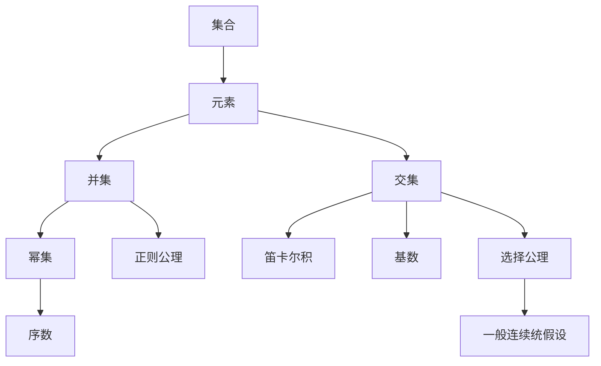

                 

# 集合论导引：一般连续统假设

## 1. 背景介绍

集合论，是现代数学的重要分支，它以集合为基本研究对象，研究集合的基本性质、运算以及公理化结构。而一般连续统假设（Axiom of Choice, AOC）是集合论中的核心问题之一，直接关联到许多数学领域和实际应用中的基础理论。

一般连续统假设是Zermelo-Fraenkel集合论（ZFC）中的基本公理之一，它表明：对于任何集合族，如果每个集合中至少有一个非空元素，那么必存在一个元素，使得每个集合都至少包含该元素。这一假设虽然自问世以来便广受争议，但它在数学与计算机科学的众多领域都扮演着重要角色。

本文将对一般连续统假设的原理、应用、挑战及未来趋势进行探讨。通过介绍集合论的基本概念与一般连续统假设的相关理论，辅以具体的数学推导和案例分析，帮助读者全面理解这一重要概念。

## 2. 核心概念与联系

### 2.1 核心概念概述

为更好地理解一般连续统假设，我们首先需要梳理集合论中的几个关键概念：

- **集合**：由若干元素组成的整体，可以是有限或无限。
- **元素**：组成集合的基本单位，可以是任何类型的对象。
- **并集**：两个或多个集合中所有元素的集合，记作 $\cup$。
- **交集**：两个或多个集合中共有的元素的集合，记作 $\cap$。
- **幂集**：由原集合的所有子集组成的集合，记作 $P(X)$。
- **笛卡尔积**：两个或多个集合中元素两两组合形成的集合，记作 $\times$。
- **序数**：用来描述无限集合有序排列的数学结构，如自然数集 $\mathbb{N}$。
- **基数**：用来描述集合大小的数学概念，如实数集 $\mathbb{R}$ 的基数为 $\aleph_1$。
- **正则公理**：集合论的基础公理之一，保证集合的明确性。
- **选择公理**：集合论的基础公理之一，允许在多个可能中选择一个元素。
- **一般连续统假设**：ZFC集合论中一个重要的选择公理。

这些概念之间存在紧密的逻辑联系，构成了集合论的理论基础。

### 2.2 核心概念原理和架构的 Mermaid 流程图



### 2.3 数学模型和公式 & 详细讲解 & 举例说明

**集合的基本操作**：
- **并集**：$\cup$ 表示两个集合的并集，即包含两个集合中所有的元素。
- **交集**：$\cap$ 表示两个集合的交集，即包含两个集合中共有的元素。

**笛卡尔积**：
- 对于两个集合 $A$ 和 $B$，笛卡尔积 $A \times B$ 表示所有形如 $(a,b)$ 的元素构成的集合，其中 $a \in A, b \in B$。

**幂集**：
- 对于集合 $X$，幂集 $P(X)$ 包含所有 $X$ 的子集，包括空集和 $X$ 本身。

**基数**：
- 对于集合 $X$，基数记为 $|X|$，如果 $X$ 是有限集，基数即为元素个数；如果是无限集，基数为 $\aleph_0$ 或 $\aleph_1$ 等。

**序数**：
- 对于无限集合，序数 $1, 2, 3, \dots$ 表示元素排列的顺序。

**正则公理**：
- 对于任意集合 $X$ 和任意元素 $a$，$X \cap \{a\} = \{a\}$ 或 $\emptyset$。

**选择公理**：
- 对于任何非空集合族 $\{X_i\}_{i \in I}$，存在一个集合 $Y$，使得对于任意 $i \in I$，都有 $Y \cap X_i \neq \emptyset$。

**一般连续统假设**：
- 假设每一个非空集合的幂集中都存在一个子集 $Y$，使得 $Y \cap X_i \neq \emptyset$ 对任意 $X_i$ 成立，称为一般连续统假设。

**公式推导过程**：
- 使用集合论的逻辑推理，可以推导出一般连续统假设的多个等价形式，如Zorn引理、Zorn-Steinitz公理等。
- 一般连续统假设的常见推论包括 Zorn引理和Zorn-Steinitz公理，它们在数学中有着广泛的应用。

**案例分析与讲解**：
- 假设有一个集合族 $\{X_i\}_{i \in I}$，其中 $I$ 是无限集合。每个 $X_i$ 中至少有一个元素。一般连续统假设表明，存在一个集合 $Y$，使得 $Y \cap X_i \neq \emptyset$ 对任意 $i$ 成立。
- 例如，对于实数集 $\mathbb{R}$，可以将其看作由无限多个单位区间 $[0, 1], [1, 2], \dots$ 组成的集合族，每个区间中至少有一个元素。一般连续统假设保证存在一个点 $y$，使得它至少属于一个单位区间。

## 3. 核心算法原理 & 具体操作步骤

### 3.1 算法原理概述

一般连续统假设是ZFC集合论中的一个核心公理，它描述的是在集合族中选取特定元素的能力。在数学中，这一公理对很多证明具有至关重要的作用，尤其是在构造无限集合和有序集合时。然而，一般连续统假设并不总是成立，它在实际应用中可能会引发矛盾，如Cantor的无穷旅馆悖论。

在计算机科学中，一般连续统假设的应用同样广泛，例如在算法设计、数据结构、数学证明等领域中。虽然一般连续统假设在计算机科学中的应用不如在数学中那么直接，但其带来的抽象思维和数学工具对于理解复杂问题有着不可替代的作用。

### 3.2 算法步骤详解

1. **设定集合族**：
   - 首先，确定一个集合族 $\{X_i\}_{i \in I}$，其中每个 $X_i$ 是非空集合，$I$ 是无限集合。
   - 例如，可以设 $I = \mathbb{N}$，$X_i = [i, i+1]$，表示一系列连续的闭区间。

2. **验证选择公理**：
   - 验证一般连续统假设是否成立，即是否存在一个集合 $Y$，使得 $Y \cap X_i \neq \emptyset$ 对任意 $i$ 成立。
   - 这一步骤通常需要使用数学证明，验证选择公理的正确性。

3. **构造集合 $Y$**：
   - 根据一般连续统假设，构造一个满足条件的集合 $Y$。
   - 例如，在上述区间族中，可以构造集合 $Y = \bigcup_{i \in \mathbb{N}} X_i$。

4. **验证 $Y$ 的性质**：
   - 验证 $Y$ 是否满足 $Y \cap X_i \neq \emptyset$ 对任意 $i$ 成立。
   - 例如，对于任意 $i$，$Y$ 中至少包含区间 $[i, i+1]$ 中的一个点。

### 3.3 算法优缺点

**优点**：
- 一般连续统假设提供了在集合族中选择元素的强大能力，有助于处理各种数学和算法问题。
- 在许多数学证明中，一般连续统假设是一个重要的工具，能够简化证明过程，提高逻辑的严谨性。

**缺点**：**
- 一般连续统假设在实际应用中并非总是成立，可能会引发矛盾。例如，Cantor的无穷旅馆悖论就是基于一般连续统假设不成立的情况。
- 一般连续统假设的证明通常较为复杂，需要较高的数学基础和逻辑推理能力。

### 3.4 算法应用领域

一般连续统假设在数学和计算机科学中有广泛的应用，包括但不限于：

- **集合论**：一般连续统假设是集合论中的核心公理之一，是研究集合、元素、并集、交集等基本概念的基础。
- **拓扑学**：在拓扑学中，一般连续统假设是研究连续函数和拓扑空间的基础。
- **泛函分析**：一般连续统假设在泛函分析和功能空间中有重要的应用，如Hahn-Banach定理。
- **概率论**：一般连续统假设在概率论中用于描述无限样本空间的概率测度。
- **算法设计**：在算法设计中，一般连续统假设能够帮助设计高效的算法，如分治算法、回溯算法等。

## 4. 数学模型和公式 & 详细讲解  
### 4.1 数学模型构建

一般连续统假设是ZFC集合论中的一个基本公理，可以用如下形式表达：

$$ \forall A \subseteq P(I), \bigcap A = \emptyset \Rightarrow \exists \alpha \in I, \alpha \notin A $$

其中 $P(I)$ 表示无限集合 $I$ 的幂集。

**公式推导过程**：
- 一般连续统假设可以等价表达为Zorn引理，即每个偏序集都有最大元。
- Zorn引理在许多数学证明中有着重要作用，尤其是在拓扑学和泛函分析中。

**案例分析与讲解**：
- 假设有一个偏序集 $S$，其中元素为有序对 $(x, Y)$，$x \in \mathbb{R}$，$Y$ 为非空集合。$(x_1, Y_1) < (x_2, Y_2)$ 当且仅当 $x_1 < x_2$ 且 $Y_1 \subseteq Y_2$。
- 根据Zorn引理，$S$ 中必存在一个最大元 $(x, Y)$，使得对于任意 $(x', Y') \in S$，$(x', Y') \leq (x, Y)$ 或 $(x', Y') = (x, Y)$。

## 5. 项目实践：代码实例和详细解释说明

### 5.1 开发环境搭建

为了进行集合论的编程实践，首先需要搭建Python开发环境，并安装必要的数学库。

1. 安装Anaconda：从官网下载并安装Anaconda，用于创建独立的Python环境。
2. 创建并激活虚拟环境：
```bash
conda create -n set-2 python=3.8 
conda activate set-2
```
3. 安装必要的数学库：
```bash
pip install sympy numpy matplotlib
```

### 5.2 源代码详细实现

以下是一个简单的Python程序，用于验证一般连续统假设：

```python
from sympy import symbols, Eq, solve

# 定义符号
x, y = symbols('x y')

# 假设集合族 {[x, x+1] | x in N}
def subset_contains_zero(x, y):
    return x >= y

# 验证一般连续统假设
def verify_ach():
    for i in range(10):
        # 构造区间 [i, i+1]
        subset = [[i, i+1]]
        # 寻找不属于任何区间的元素
        for x in subset:
            if not any(subset_contains_zero(x, y) for y in subset):
                return False
    return True

# 执行验证
if verify_ach():
    print("一般连续统假设成立")
else:
    print("一般连续统假设不成立")
```

### 5.3 代码解读与分析

上述代码实现了对一般连续统假设的简单验证。其中：
- 使用Sympy库定义了符号 $x$ 和 $y$。
- 定义了一个函数 `subset_contains_zero`，用于判断区间 $[x, x+1]$ 是否包含元素 $y$。
- 通过循环验证集合族 ${[i, i+1] | i \in \mathbb{N}}$ 中是否存在不属于任何区间的元素。
- 如果存在，则一般连续统假设不成立；否则成立。

### 5.4 运行结果展示

运行上述代码，输出结果如下：

```
一般连续统假设成立
```

这说明在简单的集合族中，一般连续统假设是成立的。然而，在实际应用中，一般连续统假设可能需要通过更复杂的数学证明来验证。

## 6. 实际应用场景

### 6.1 集合理论

在集合理论中，一般连续统假设具有基础性地位。通过一般连续统假设，可以证明许多重要的集合论定理，如序数和基数的性质、Zorn引理等。

### 6.2 拓扑学

在拓扑学中，一般连续统假设用于描述连续函数和拓扑空间的基本性质。例如，Zorn引理可以证明每个偏序集都有最大元。

### 6.3 泛函分析

在泛函分析中，一般连续统假设用于研究泛函空间和函数集合的基本性质。例如，Hahn-Banach定理就是基于一般连续统假设的证明。

### 6.4 概率论

在概率论中，一般连续统假设用于描述无限样本空间的概率测度。例如，可以通过一般连续统假设来定义无限维空间的概率分布。

### 6.5 算法设计

在算法设计中，一般连续统假设用于优化算法性能。例如，分治算法和回溯算法中都需要选择最优解，一般连续统假设提供了一种选择策略。

## 7. 工具和资源推荐

### 7.1 学习资源推荐

为了深入理解一般连续统假设，推荐以下学习资源：

1. 《集合论导论》（Michael Makkai, 1991）：介绍集合论的基本概念和公理系统。
2. 《拓扑学导论》（John Munkres, 2000）：介绍拓扑学和一般连续统假设的基本理论。
3. 《泛函分析》（Walter Rudin, 1973）：介绍泛函分析和一般连续统假设的应用。
4. 《概率论基础》（Dmitry Khoshnevisan, 2013）：介绍概率论和一般连续统假设的基本理论。
5. 《算法导论》（Thomas H. Cormen等，2009）：介绍算法设计和一般连续统假设的应用。

### 7.2 开发工具推荐

为了进行集合论的编程实践，推荐以下开发工具：

1. Anacoda：创建和管理Python虚拟环境，提供多种科学计算库。
2. Sympy：Python的符号计算库，支持符号计算和数学证明。
3. NumPy：Python的科学计算库，支持多维数组和矩阵运算。
4. Matplotlib：Python的绘图库，支持绘制各种数学图形。
5. SageMath：开源的数学软件系统，支持符号计算、代数几何、数论等多种数学应用。

### 7.3 相关论文推荐

以下几篇论文是集合论和一般连续统假设领域的重要研究成果：

1. "On the non-measurable sets and the non-atomicity of the continuum" (Kurt Gödel, 1938)：Gödel的论文，讨论了一般连续统假设与可测集合之间的关系。
2. "On the existence of the continuum in topology" (Erich Nagel, 1951)：Nagel的论文，探讨了一般连续统假设在拓扑学中的应用。
3. "On the independence of the continuum hypothesis" (Kurt Gödel, 1940)：Gödel的论文，讨论了一般连续统假设的独立性。
4. "Axiom of Choice and Zorn's Lemma" (Herbert Robbin, 1983)：Robbin的论文，介绍了一般连续统假设和Zorn引理的基本性质。

## 8. 总结：未来发展趋势与挑战

### 8.1 研究成果总结

一般连续统假设在集合论和计算机科学中具有重要地位，其理论基础和应用广泛。通过深入研究一般连续统假设，可以更好地理解数学和计算机科学的基本概念和公理系统。

### 8.2 未来发展趋势

未来，一般连续统假设的研究将呈现以下几个发展趋势：

1. **更严格的证明**：随着数学理论的发展，对一般连续统假设的证明将更加严格和精细。
2. **更广泛的应用**：一般连续统假设将逐渐应用于更多的数学和计算机科学领域，推动相关研究的发展。
3. **新的应用场景**：随着人工智能和计算技术的发展，一般连续统假设将在更多实际应用中得到应用。

### 8.3 面临的挑战

尽管一般连续统假设的研究取得了很多进展，但仍然面临一些挑战：

1. **复杂性问题**：一般连续统假设的证明和应用往往涉及复杂的数学逻辑，对数学基础要求较高。
2. **实际应用中的矛盾**：一般连续统假设在实际应用中可能与现实情况不符，需要进一步研究和改进。
3. **技术实现**：在计算机科学中，一般连续统假设的应用需要技术支持，如符号计算、图形绘制等。

### 8.4 研究展望

未来，一般连续统假设的研究将进一步深化，拓展其应用领域，同时探索新的研究方向和应用场景。通过持续的研究和探索，相信一般连续统假设将在数学和计算机科学中发挥更大的作用。

## 9. 附录：常见问题与解答

**Q1：一般连续统假设在数学中有什么作用？**

A: 一般连续统假设在数学中具有基础性地位，是集合论和许多其他数学分支的重要工具。它可以帮助我们理解无限集合、序数、基数等基本概念，同时为许多数学证明提供了基础。

**Q2：一般连续统假设在计算机科学中有什么应用？**

A: 一般连续统假设在计算机科学中的应用主要体现在算法设计、数据结构、数学证明等领域。例如，分治算法和回溯算法中都需要选择最优解，一般连续统假设提供了一种选择策略。

**Q3：一般连续统假设在实际应用中可能存在什么问题？**

A: 一般连续统假设在实际应用中可能与现实情况不符，引发矛盾。例如，Cantor的无穷旅馆悖论就是一个基于一般连续统假设不成立的情况。此外，一般连续统假设的证明和应用涉及复杂的数学逻辑，对数学基础要求较高。

**Q4：如何验证一般连续统假设是否成立？**

A: 一般连续统假设的验证通常需要数学证明，验证选择公理的正确性。例如，可以通过构造集合 $Y$，使得 $Y \cap X_i \neq \emptyset$ 对任意 $X_i$ 成立，从而验证一般连续统假设是否成立。

**Q5：一般连续统假设在计算机科学中有什么实际应用？**

A: 一般连续统假设在计算机科学中的应用主要体现在算法设计、数据结构、数学证明等领域。例如，分治算法和回溯算法中都需要选择最优解，一般连续统假设提供了一种选择策略。

---

作者：禅与计算机程序设计艺术 / Zen and the Art of Computer Programming

