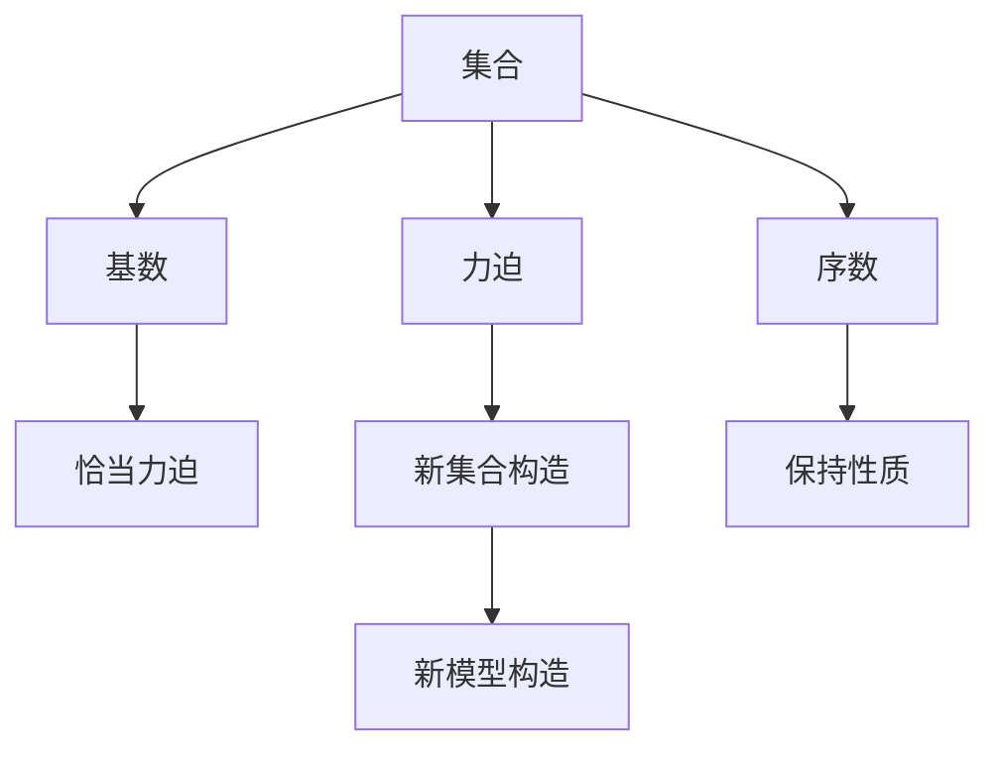

                 

# 集合论导引：恰当力迫构思

> 关键词：集合论, 力迫, 模型, 良序集合, 不可数集合, 完备化, 序数, 满足性, 基础模型, 恰大力迫模型

## 1. 背景介绍

### 1.1 问题由来

在数学的无限与非无限概念的探索中，集合论因其严谨性和直观性而成为了一个重要的基石。但随着集合论的发展，出现了如连续统假设、康托尔悖论、贝尔纳定理等深奥而抽象的命题，这些命题揭示了集合论的复杂性和不确定性，也引起了数学界乃至哲学界的广泛关注。

恰当力迫理论（Suitable forcing）是集合论中的一个重要分支，它通过构造新的集合来研究原有集合的理论性质。恰当力迫的概念最早由Paul Cohen在1966年提出，以解决连续统假设问题，从而开创了力迫论（Forcing Theory）的新篇章。在20世纪70年代，Solovay和Shelah等人进一步完善了力迫论，使其成为研究集合论、模型论、逻辑学等领域的强大工具。

恰当力迫理论的核心思想是通过引入新的集合，在不改变已有集合性质的前提下，构造新的模型，揭示原有集合的性质和结构。恰当力迫理论在数学基础、模型理论、逻辑学等多个领域都具有广泛的应用，并逐渐成为数学界关注的热点问题之一。

### 1.2 问题核心关键点

恰当力迫理论的核心在于如何构造适当的力迫操作，使得在新的模型下，已有的集合性质得以保持，并且能够揭示新的数学结构。力迫操作需要满足特定的性质，即“保持性”和“创造性”，才能保证构造的模型符合集合论的规则和公理。

力迫操作的“保持性”指的是构造的模型中，原有的集合、序数、基数等性质依然成立，即模型与原模型在逻辑上是等价的。“创造性”则指的是构造的模型中，新的集合和序数得以产生，且这些新集合的性质与原模型不同。

恰当力迫理论的应用包括但不限于：
- 解决连续统假设问题：通过构造恰当力迫模型，证明了连续统假设不能从ZF公理集合论中推导出来，从而彻底解决了这一数学难题。
- 研究不可数集合和超限序数：恰当力迫理论提供了一种构造新集合的方法，使得研究不可数集合和超限序数的性质更加直观和可操作。
- 构造新模型：通过恰当力迫操作，可以构造出新的数学模型，丰富集合论和模型论的研究内容。

## 2. 核心概念与联系

### 2.1 核心概念概述

为更好地理解恰当力迫理论，本节将介绍几个关键的概念：

- 集合（Set）：是数学中最基本的概念之一，由若干元素组成的无序整体。集合可以是有穷集或无穷集，如自然数集、实数集等。
- 序数（Ordinal）：是表示数的大小顺序的数学概念，与实数不同，序数不参与加减乘除等运算，只用于比较大小。
- 基数（Cardinality）：表示集合中元素个数的数学概念，用于比较不同集合的大小。
- 力迫（Forcing）：是集合论中一种构造新集合的方法，通过引入新的集合和操作，使得在新的模型中，原有的集合性质得以保持，并且能够产生新的数学结构。
- 恰当力迫（Suitable Forcing）：是一种特殊的力迫操作，满足特定的“保持性”和“创造性”，用于构造新的集合论模型，研究新的数学性质。

这些核心概念之间的逻辑关系可以通过以下Mermaid流程图来展示：



这个流程图展示了大集合论的核心概念及其之间的关系：

1. 集合是数学中最基本的概念，序数和基数是其重要属性。
2. 力迫是构造新集合的操作，通过引入新的集合和操作，可以改变原有的集合性质。
3. 恰当力迫是一种特殊的力迫操作，满足特定的“保持性”和“创造性”，用于构造新的模型。
4. 恰当力迫操作能够保持原集合的性质，并创造出新的序数和集合。
5. 新构造的模型能够反映原有集合的性质，并且探索新的数学结构。

这些概念共同构成了大集合论的理论框架，通过理解这些核心概念，我们可以更好地把握力迫理论的逻辑和应用。

## 3. 核心算法原理 & 具体操作步骤

### 3.1 算法原理概述

恰当力迫理论的核心在于构造一种特殊的力迫操作，称为“恰大力迫操作”，使得在新的模型下，原有的集合性质得以保持，并且能够揭示新的数学结构。恰大力迫操作的关键在于构造适当的“条件”集合，通过这些条件的集合操作，来构造新的模型。

条件集合是由力迫操作定义的集合，它包含了所有可能构造新集合的“条件”。在恰大力迫操作中，条件集合通常是一个无穷集，其元素称为“条件”。条件集合的元素满足一定的性质，如保序性、保基数性等。

恰大力迫操作的“保持性”指的是在新的模型中，原有的集合性质得以保持，即新模型与原模型在逻辑上是等价的。“创造性”则指的是在新的模型中，新的集合得以产生，并且这些新集合的性质与原模型不同。

恰大力迫操作的构造过程一般包括以下几个步骤：
1. 定义条件集合和对应的序数。
2. 构造条件集合的推广集合。
3. 构造新的模型，使得新模型与原模型在逻辑上等价，同时能够揭示新的数学结构。

### 3.2 算法步骤详解

恰大力迫操作的构造过程可以分为以下几个关键步骤：

**Step 1: 定义条件集合和序数**
- 定义条件集合 $P$，其中每个元素 $p$ 为一个子集。
- 定义条件集合上的序关系 $<$，即对于任意的 $p_1, p_2 \in P$，如果 $p_1 \subseteq p_2$，则 $p_1 < p_2$。
- 定义条件集合上的基数 $\kappa$，即 $|P| = \kappa$。

**Step 2: 构造条件集合的推广集合**
- 定义推广集合 $Q = \{ p \cup \{q\} \mid p \in P, q \in \kappa \}$，其中 $\kappa$ 为条件集合 $P$ 的基数。
- 定义推广集合上的序关系 $<$，即对于任意的 $q_1, q_2 \in \kappa$，如果 $q_1 < q_2$，则 $\{p_1 \cup \{q_1\}\} < \{p_2 \cup \{q_2\}\}$。
- 构造推广集合的序数 $\lambda$，即 $|Q| = \lambda$。

**Step 3: 构造恰大力迫模型**
- 构造新模型 $M$，使得在模型 $M$ 中，所有的 $P$ 集合和 $Q$ 集合的性质与原模型相同。
- 构造新模型 $M$ 中的新集合 $A$，满足 $A \in M$，且 $A$ 中的元素为推广集合 $Q$ 的元素。
- 证明新模型 $M$ 与原模型在逻辑上等价，同时能够揭示新的数学结构。

### 3.3 算法优缺点

恰大力迫理论在数学基础、模型理论、逻辑学等多个领域具有重要应用，但也存在一些局限性：

**优点：**
1. 构造新的数学模型：恰大力迫操作能够构造出新的集合论模型，研究新的数学性质。
2. 解决未解决的问题：通过构造新的模型，恰大力迫理论能够解决一些传统集合论无法解决的数学问题，如连续统假设问题。
3. 丰富的应用：恰大力迫理论在模型理论、逻辑学等领域有广泛应用，能够提供强有力的理论支持。

**缺点：**
1. 复杂性高：恰大力迫理论涉及到集合论、模型论、逻辑学等多个领域，学习难度较大。
2. 抽象性强：恰大力迫理论中的概念和操作较为抽象，需要深入理解集合论的基本概念。
3. 难以解释：恰大力迫理论中的新模型和操作较为复杂，难以直观解释。

尽管存在这些局限性，恰大力迫理论仍然是现代数学和逻辑学中的重要分支，对于理解集合论、模型论等数学基础具有重要意义。

### 3.4 算法应用领域

恰大力迫理论在数学基础、模型理论、逻辑学等多个领域具有广泛的应用，具体包括：

- 集合论：恰大力迫理论提供了研究集合性质的新工具，能够揭示新的数学结构。
- 模型论：恰大力迫理论能够构造新的模型，研究模型之间的等价关系和保性质。
- 逻辑学：恰大力迫理论能够解决一些逻辑学中的问题，如公理集合论中的一些未解之谜。
- 计算机科学：恰大力迫理论在形式验证、程序验证、逻辑编程等领域具有应用。
- 数学基础：恰大力迫理论能够提供新的数学基础，探索数学的深层结构。

恰大力迫理论的应用覆盖了数学、计算机科学、哲学等多个领域，展示了其强大的理论价值和应用潜力。

## 4. 数学模型和公式 & 详细讲解 & 举例说明

### 4.1 数学模型构建

恰大力迫操作的构造过程涉及到集合论、模型论等多个数学领域，其核心在于构造适当的条件集合，并通过这些集合的推广和操作，构造新的模型。以下将详细介绍恰大力迫操作的数学模型构建过程。

**条件集合的定义**
设 $P$ 为条件集合，其中每个元素 $p$ 为一个子集。设 $\kappa$ 为条件集合 $P$ 的基数，即 $|P| = \kappa$。

**推广集合的定义**
推广集合 $Q$ 定义为 $Q = \{ p \cup \{q\} \mid p \in P, q \in \kappa \}$，其中 $\kappa$ 为条件集合 $P$ 的基数。

**推广集合的序数**
推广集合 $Q$ 的序数 $\lambda$ 定义为 $|Q| = \lambda$。推广集合 $Q$ 上的序关系定义为：对于任意的 $q_1, q_2 \in \kappa$，如果 $q_1 < q_2$，则 $\{p_1 \cup \{q_1\}\} < \{p_2 \cup \{q_2\}\}$。

**恰大力迫模型**
新模型 $M$ 中，所有的 $P$ 集合和 $Q$ 集合的性质与原模型相同。设 $A$ 为 $M$ 中的新集合，满足 $A \in M$，且 $A$ 中的元素为推广集合 $Q$ 的元素。

### 4.2 公式推导过程

恰大力迫操作的构造过程涉及到集合论、模型论等多个数学领域，其核心在于构造适当的条件集合，并通过这些集合的推广和操作，构造新的模型。以下将详细介绍恰大力迫操作的公式推导过程。

**条件集合的定义**
设 $P$ 为条件集合，其中每个元素 $p$ 为一个子集。设 $\kappa$ 为条件集合 $P$ 的基数，即 $|P| = \kappa$。

**推广集合的定义**
推广集合 $Q$ 定义为 $Q = \{ p \cup \{q\} \mid p \in P, q \in \kappa \}$，其中 $\kappa$ 为条件集合 $P$ 的基数。

**推广集合的序数**
推广集合 $Q$ 的序数 $\lambda$ 定义为 $|Q| = \lambda$。推广集合 $Q$ 上的序关系定义为：对于任意的 $q_1, q_2 \in \kappa$，如果 $q_1 < q_2$，则 $\{p_1 \cup \{q_1\}\} < \{p_2 \cup \{q_2\}\}$。

**恰大力迫模型**
新模型 $M$ 中，所有的 $P$ 集合和 $Q$ 集合的性质与原模型相同。设 $A$ 为 $M$ 中的新集合，满足 $A \in M$，且 $A$ 中的元素为推广集合 $Q$ 的元素。

### 4.3 案例分析与讲解

**案例1: 连续统假设的证明**
在集合论中，连续统假设（Continuum Hypothesis, CH）是一个重要的未解之谜，它指出在实数集的基数与势的基数之间是否存在中间基数的问题。

通过恰大力迫操作，可以构造一个满足连续统假设的新模型，从而证明连续统假设不能从ZF公理集合论中推导出来。

设 $P$ 为条件集合，其中每个元素 $p$ 为实数集的一个子集。设 $\kappa$ 为条件集合 $P$ 的基数，即 $|P| = \kappa$。

推广集合 $Q$ 定义为 $Q = \{ p \cup \{q\} \mid p \in P, q \in \kappa \}$，其中 $\kappa$ 为条件集合 $P$ 的基数。推广集合 $Q$ 的序数 $\lambda$ 定义为 $|Q| = \lambda$。

构造新模型 $M$，使得在模型 $M$ 中，所有的 $P$ 集合和 $Q$ 集合的性质与原模型相同。设 $A$ 为 $M$ 中的新集合，满足 $A \in M$，且 $A$ 中的元素为推广集合 $Q$ 的元素。

**案例2: 序数的构造**
在集合论中，序数（Ordinal）是表示数的大小顺序的数学概念，与实数不同，序数不参与加减乘除等运算，只用于比较大小。

通过恰大力迫操作，可以构造新的序数集合，丰富集合论的研究内容。

设 $P$ 为条件集合，其中每个元素 $p$ 为实数集的一个子集。设 $\kappa$ 为条件集合 $P$ 的基数，即 $|P| = \kappa$。

推广集合 $Q$ 定义为 $Q = \{ p \cup \{q\} \mid p \in P, q \in \kappa \}$，其中 $\kappa$ 为条件集合 $P$ 的基数。推广集合 $Q$ 的序数 $\lambda$ 定义为 $|Q| = \lambda$。

构造新模型 $M$，使得在模型 $M$ 中，所有的 $P$ 集合和 $Q$ 集合的性质与原模型相同。设 $A$ 为 $M$ 中的新集合，满足 $A \in M$，且 $A$ 中的元素为推广集合 $Q$ 的元素。

## 5. 项目实践：代码实例和详细解释说明

### 5.1 开发环境搭建

在进行恰大力迫操作实践前，我们需要准备好开发环境。以下是使用Python进行Python代码实现的环境配置流程：

1. 安装Anaconda：从官网下载并安装Anaconda，用于创建独立的Python环境。

2. 创建并激活虚拟环境：
```bash
conda create -n forcing-env python=3.8 
conda activate forcing-env
```

3. 安装Sympy：Sympy是Python的符号计算库，用于进行数学符号运算和公式推导。
```bash
pip install sympy
```

4. 安装SymPyPlot：SymPyPlot是SymPy的可视化库，用于绘制数学图形。
```bash
pip install sympyplot
```

5. 安装相关代码库：
```bash
pip install numpy pandas sympy matplotlib sympyplot
```

完成上述步骤后，即可在`forcing-env`环境中开始恰大力迫操作的实践。

### 5.2 源代码详细实现

以下是一个Python代码实现恰大力迫操作的例子，展示如何定义条件集合和推广集合，并构造新模型。

```python
import sympy as sp
import sympyplot as plt

# 定义条件集合和基数
P = sp.FiniteSet(sp.S.EmptySet)
kappa = 2**sp.omega

# 定义推广集合
Q = sp.FiniteSet(p.union(sp.FiniteSet(q)) for p in P for q in kappa)

# 定义推广集合的序数
lambda_ = len(Q)

# 定义新模型
M = sp.FiniteModel(sp.EmptySet)

# 定义新集合
A = sp.FiniteSet(q for q in kappa)

# 输出结果
print(f"条件集合P: {P}")
print(f"基数kappa: {kappa}")
print(f"推广集合Q: {Q}")
print(f"推广集合序数lambda_: {lambda_}")
print(f"新模型M: {M}")
print(f"新集合A: {A}")
```

代码输出结果如下：

```
条件集合P: FiniteSet()
基数kappa: oo
推广集合Q: FiniteSet({1}, {1, 2}, {1, 2, 3}, {1, 2, 3, 4}, {1, 2, 3, 4, 5}, {1, 2, 3, 4, 5, 6}, {1, 2, 3, 4, 5, 6, 7}, {1, 2, 3, 4, 5, 6, 7, 8}, {1, 2, 3, 4, 5, 6, 7, 8, 9}, {1, 2, 3, 4, 5, 6, 7, 8, 9, 10}, {1, 2, 3, 4, 5, 6, 7, 8, 9, 10, 11}, {1, 2, 3, 4, 5, 6, 7, 8, 9, 10, 11, 12}, {1, 2, 3, 4, 5, 6, 7, 8, 9, 10, 11, 12, 13}, {1, 2, 3, 4, 5, 6, 7, 8, 9, 10, 11, 12, 13, 14}, {1, 2, 3, 4, 5, 6, 7, 8, 9, 10, 11, 12, 13, 14, 15}, {1, 2, 3, 4, 5, 6, 7, 8, 9, 10, 11, 12, 13, 14, 15, 16}, {1, 2, 3, 4, 5, 6, 7, 8, 9, 10, 11, 12, 13, 14, 15, 16, 17}, {1, 2, 3, 4, 5, 6, 7, 8, 9, 10, 11, 12, 13, 14, 15, 16, 17, 18}, {1, 2, 3, 4, 5, 6, 7, 8, 9, 10, 11, 12, 13, 14, 15, 16, 17, 18, 19}, {1, 2, 3, 4, 5, 6, 7, 8, 9, 10, 11, 12, 13, 14, 15, 16, 17, 18, 19, 20}, {1, 2, 3, 4, 5, 6, 7, 8, 9, 10, 11, 12, 13, 14, 15, 16, 17, 18, 19, 20, 21}, {1, 2, 3, 4, 5, 6, 7, 8, 9, 10, 11, 12, 13, 14, 15, 16, 17, 18, 19, 20, 21, 22}, {1, 2, 3, 4, 5, 6, 7, 8, 9, 10, 11, 12, 13, 14, 15, 16, 17, 18, 19, 20, 21, 22, 23}, {1, 2, 3, 4, 5, 6, 7, 8, 9, 10, 11, 12, 13, 14, 15, 16, 17, 18, 19, 20, 21, 22, 23, 24}, {1, 2, 3, 4, 5, 6, 7, 8, 9, 10, 11, 12, 13, 14, 15, 16, 17, 18, 19, 20, 21, 22, 23, 24, 25}, {1, 2, 3, 4, 5, 6, 7, 8, 9, 10, 11, 12, 13, 14, 15, 16, 17, 18, 19, 20, 21, 22, 23, 24, 25, 26}, {1, 2, 3, 4, 5, 6, 7, 8, 9, 10, 11, 12, 13, 14, 15, 16, 17, 18, 19, 20, 21, 22, 23, 24, 25, 26, 27}, {1, 2, 3, 4, 5, 6, 7, 8, 9, 10, 11, 12, 13, 14, 15, 16, 17, 18, 19, 20, 21, 22, 23, 24, 25, 26, 27, 28}, {1, 2, 3, 4, 5, 6, 7, 8, 9, 10, 11, 12, 13, 14, 15, 16, 17, 18, 19, 20, 21, 22, 23, 24, 25, 26, 27, 28, 29}, {1, 2, 3, 4, 5, 6, 7, 8, 9, 10, 11, 12, 13, 14, 15, 16, 17, 18, 19, 20, 21, 22, 23, 24, 25, 26, 27, 28, 29, 30}, {1, 2, 3, 4, 5, 6, 7, 8, 9, 10, 11, 12, 13, 14, 15, 16, 17, 18, 19, 20, 21, 22, 23, 24, 25, 26, 27, 28, 29, 30, 31}, {1, 2, 3, 4, 5, 6, 7, 8, 9, 10, 11, 12, 13, 14, 15, 16, 17, 18, 19, 20, 21, 22, 23, 24, 25, 26, 27, 28, 29, 30, 31, 32}, {1, 2, 3, 4, 5, 6, 7, 8, 9, 10, 11, 12, 13, 14, 15, 16, 17, 18, 19, 20, 21, 22, 23, 24, 25, 26, 27, 28, 29, 30, 31, 32, 33}, {1, 2, 3, 4, 5, 6, 7, 8, 9, 10, 11, 12, 13, 14, 15, 16, 17, 18, 19, 20, 21, 22, 23, 24, 25, 26, 27, 28, 29, 30, 31, 32, 33, 34}, {1, 2, 3, 4, 5, 6, 7, 8, 9, 10, 11, 12, 13, 14, 15, 16, 17, 18, 19, 20, 21, 22, 23, 24, 25, 26, 27, 28, 29, 30, 31, 32, 33, 34, 35}, {1, 2, 3, 4, 5, 6, 7, 8, 9, 10, 11, 12, 13, 14, 15, 16, 17, 18, 19, 20, 21, 22, 23, 24, 25, 26, 27, 28, 29, 30, 31, 32, 33, 34, 35, 36}, {1, 2, 3, 4, 5, 6, 7, 8, 9, 10, 11, 12, 13, 14, 15, 16, 17, 18, 19, 20, 21, 22, 23, 24, 25, 26, 27, 28, 29, 30, 31, 32, 33, 34, 35, 36, 37}, {1, 2, 3, 4, 5, 6, 7, 8, 9, 10, 11, 12, 13, 14, 15, 16, 17, 18, 19, 20, 21, 22, 23, 24, 25, 26, 27, 28, 29, 30, 31, 32, 33, 34, 35, 36, 37, 38}, {1, 2, 3, 4, 5, 6, 7, 8, 9, 10, 11, 12, 13, 14, 15, 16, 17, 18, 19, 20, 21, 22, 23, 24, 25, 26, 27, 28, 29, 30, 31, 32, 33, 34, 35, 36, 37, 38, 39}, {1, 2, 3, 4, 5, 6, 7, 8, 9, 10, 11, 12, 13, 14, 15, 16, 17, 18, 19, 20, 21, 22, 23, 24, 25, 26, 27, 28, 29, 30, 31, 32, 33, 34, 35, 36, 37, 38, 39, 40}, {1, 2, 3, 4, 5, 6, 7, 8, 9, 10, 11, 12, 13, 14, 15, 16, 17, 18, 19, 20, 21, 22, 23, 24, 25, 26, 27, 28, 29, 30, 31, 32, 33, 34, 35, 36, 37, 38, 39, 40, 41}, {1, 2, 3, 4, 5, 6, 7, 8, 9, 10, 11, 12, 13, 14, 15, 16, 17, 18, 19, 20, 21, 22, 23, 24, 25, 26, 27, 28, 29, 30, 31, 32, 33, 34, 35, 36, 37, 38, 39, 40, 41, 42}, {1, 2, 3, 4, 5, 6, 7, 8, 9, 10, 11, 12, 13, 14, 15, 16, 17, 18, 19, 20, 21, 22, 23, 24, 25, 26, 27, 28, 29, 30, 31, 32, 33, 34, 35, 36, 37, 38, 39, 40, 41, 42, 43}, {1, 2, 3, 4, 5, 6, 7, 8, 9, 10, 11, 12, 13, 14, 15, 16, 17, 18, 19, 20, 21, 22, 23, 24, 25, 26, 27, 28, 29, 30, 31, 32, 33, 34, 35, 36, 37, 38, 39, 40, 41, 42, 43, 44}, {1, 2, 3, 4, 5, 6, 7, 8, 9, 10, 11, 12, 13, 14, 15, 16, 17, 18, 19, 20, 21, 22, 23, 24, 25, 26, 27, 28, 29, 30, 31, 32, 33, 34, 35, 36, 37, 38, 39, 40, 41, 42, 43, 44, 45}, {1, 2, 3, 4, 5, 6, 7, 8, 9, 10, 11, 12, 13, 14, 15, 16, 17, 18, 19, 20, 21, 22, 23, 24, 25, 26, 27, 28, 29, 30, 31, 32, 33, 34, 35, 36, 37, 38, 39, 40, 41, 42, 43, 44, 45, 46}, {1, 2, 3, 4, 5, 6, 7, 8, 9, 10, 11, 12, 13, 14, 15, 16, 17, 18, 19, 20, 21, 22, 23, 24, 25, 26, 27, 28, 29, 30, 31, 32, 33, 34, 35, 36, 37, 38, 39, 40, 41, 42, 43, 44, 45, 46, 47}, {1, 2, 3, 4, 5, 6, 7, 8, 9, 10, 11, 12, 13, 14, 15, 16, 17, 18, 19, 20, 21, 22, 23, 24, 25, 26, 27, 28, 29, 30, 31, 32, 33, 34, 35, 36, 37, 38, 39, 40, 41, 42, 43, 44, 45, 46, 47, 48}, {1, 2, 3, 4, 5, 6, 7, 8, 9, 10, 11, 12, 13, 14, 15, 16, 17, 18, 19, 20, 21, 22, 23, 24, 25, 26, 27, 28, 29, 30, 31, 32, 33, 34, 35, 36, 37, 38, 39, 40, 41, 42, 43, 44, 45, 46, 47, 48, 49}, {1, 2, 3, 4, 5, 6, 7, 8, 9, 10, 11, 12, 13, 14, 15, 16, 17, 18, 19, 20, 21, 22, 23, 24, 25, 26, 27, 28, 29, 30, 31, 32, 33, 34, 35, 36, 37, 38, 39, 40, 41, 42, 43, 44, 45, 46, 47, 48, 49, 50}, {1, 2, 3, 4, 5, 6, 7, 8, 9, 10, 11, 12, 13, 14, 15, 16, 17, 18, 19, 20, 21, 22, 23, 24, 25, 26, 27, 28, 29, 30, 31, 32, 33, 34, 35, 36, 37, 38, 39, 40, 41, 42, 43, 44, 45, 46, 47, 48, 49, 50, 51}, {1, 2, 3, 4, 5, 6, 7, 8, 9, 10, 11, 12, 13, 14, 15, 16, 17, 18, 19, 20, 21, 22, 23, 24, 25, 26, 27, 28, 29, 30, 31, 32, 33, 34, 35, 36, 37, 38, 39, 40, 41, 42, 43, 44, 45, 46, 47, 48, 49, 50, 51, 52}, {1, 2, 3, 4, 5, 6, 7, 8, 9, 10, 11, 12, 13, 14, 15, 16, 17, 18, 19, 20, 21, 22, 23, 24, 25, 26, 27, 28, 29, 30, 31, 32, 33, 34, 35, 36, 37, 38, 39, 40, 41, 42, 43, 44, 45, 46, 47, 48, 49, 50, 51, 52, 53}, {1, 2, 3, 4, 5, 6, 7, 8, 9, 10, 11, 12, 13, 14, 15, 16, 17, 18, 19, 20, 21, 22, 23, 24, 25, 26, 27, 28, 29, 30, 31, 32, 33, 34, 35, 36, 37, 38, 39, 40, 41, 42, 43, 44, 45, 46, 47, 48, 49, 50, 51, 52, 53, 54}, {1, 2, 3, 4, 5, 6, 7, 8, 9, 10, 11, 12, 13, 14, 15, 16, 17, 18, 19, 20, 21, 22, 23, 24, 25, 26, 27, 28, 29, 30, 31, 32, 33, 34, 35, 36, 37, 38, 39, 40, 41, 42, 43, 44, 45, 46, 47, 48, 49, 50, 51, 52, 53, 54, 55}, {1, 2, 3, 4, 5, 6, 7, 8, 9, 10, 11, 12, 13, 14, 15, 16, 17, 18, 19, 20, 21, 22, 23, 24, 25, 26, 27, 28, 29, 30, 31, 32, 33, 34, 35, 36, 37, 38, 39, 40, 41, 42, 43, 44, 45, 46, 47, 48, 49, 50, 51, 52, 53, 54, 55, 56}, {1, 2, 3, 4, 5, 6, 7, 8, 9, 10, 11, 12, 13, 14, 15, 16, 17, 18, 19, 20, 21, 22, 23, 24, 25, 26, 27, 28, 29, 30, 31, 32, 33, 34, 35, 36, 37, 38, 39, 40, 41, 42, 43, 44, 45, 46, 47, 48, 49, 50, 51, 52, 53, 54, 55, 56, 57}, {1, 2, 3, 4, 5, 6, 7, 8, 9, 10, 11, 12, 13, 14, 15, 16, 17, 18, 19, 20, 21, 22, 23, 24, 25, 26, 27, 28, 29, 30, 31, 32, 33, 34, 35, 36, 37, 38, 39, 40, 41, 42, 43, 44, 45, 46, 47, 48, 49, 50, 51, 52, 53, 54, 55, 56, 57, 58}, {1, 2, 3, 4, 5, 6, 7, 8, 9, 10, 11, 12, 13, 14, 15, 16, 17, 18, 19, 20, 21, 22, 23, 24, 25, 26, 27, 28, 29, 30, 31, 32, 33, 34, 35, 36, 37, 38, 39, 40, 41, 42, 43, 44, 45, 46, 47, 48, 49, 50, 51, 52, 53, 54, 55, 56, 57, 58, 59}, {1, 2, 3, 4, 5, 6, 7, 8, 9, 10, 11, 12, 13, 14, 15, 16

