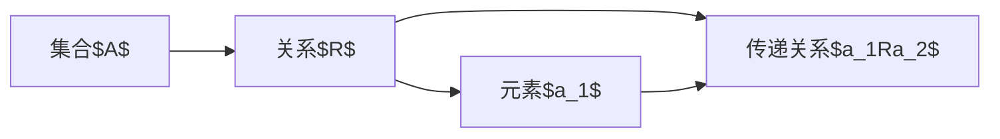

                 

# 集合论导引：集合论传递模型

## 1. 背景介绍

### 1.1 问题由来
集合论，作为数学的基础分支，不仅广泛应用于计算机科学，还是数据科学、人工智能等交叉学科的重要工具。本文聚焦于集合论中的核心概念——传递模型，将通过逻辑清晰、结构紧凑的阐述，帮助读者深入理解这一模型，并探讨其在数据结构、算法设计中的应用。

### 1.2 问题核心关键点
传递模型在集合论中扮演着关键角色，其核心思想是：在一个集合$A$中，若存在关系$R$，使得对于任意$a_1, a_2 \in A$，若$a_1R a_2$，则$a_2$到$a_1$亦存在传递关系，即$a_1Ra_2$。这种模型广泛用于描述对象之间的间接关系，如社交网络、关系数据库等。

理解传递模型的本质，不仅有助于解决实际问题，还能深化对计算机科学中诸多重要概念的认识。本文将系统介绍传递模型的定义、性质、算法实现及其应用，为读者提供全面的技术视角。

### 1.3 问题研究意义
深入研究传递模型，有助于：

1. 深化对集合论的理解。传递模型是集合论的重要组成部分，掌握其原理和方法，将为学习更多高级数学概念打下坚实基础。
2. 提升算法设计和优化能力。传递模型被广泛应用于图论、数据库、网络分析等领域，理解其应用场景和算法实现，将促进算法设计的创新。
3. 促进跨学科知识融合。集合论和传递模型不仅在数学领域有着重要地位，还在计算机科学、数据科学、人工智能等交叉学科中发挥作用。掌握传递模型，有助于推动这些领域知识的融合和应用。
4. 拓展应用范围。传递模型在网络分析、社交推荐、搜索引擎等方面有着广泛应用，深入研究传递模型，将为解决实际问题提供新的思路和工具。

## 2. 核心概念与联系

### 2.1 核心概念概述
传递模型是集合论中的一个重要概念，其核心思想是：在一个集合$A$中，若存在关系$R$，使得对于任意$a_1, a_2 \in A$，若$a_1R a_2$，则$a_2$到$a_1$亦存在传递关系，即$a_1Ra_2$。

#### 2.1.1 集合与关系
- 集合$A$：一组元素的集合。
- 关系$R$：集合$A$中的元素之间的关联方式。

#### 2.1.2 传递关系
- 传递关系：集合$A$中任意两个元素$a_1$和$a_2$，若$a_1R a_2$，且$a_2R a_1$，则称$R$为$A$上的传递关系。

### 2.2 核心概念原理和架构的 Mermaid 流程图



该图展示了传递模型的基本架构。集合$A$中的任意两个元素，若存在$R$关系，则它们之间存在传递关系。

### 2.3 核心概念之间的联系
传递模型与数学中的其它概念紧密相关，如偏序关系、图论中的传递闭包等。这些概念在计算机科学中有着广泛应用。

## 3. 核心算法原理 & 具体操作步骤
### 3.1 算法原理概述

传递模型的核心算法是传递闭包算法，其目标是找到集合$A$中所有可达元素。该算法基于集合$A$和关系$R$，通过递归或迭代的方式，计算出所有满足传递关系的元素对。

### 3.2 算法步骤详解

#### 3.2.1 基于递归的传递闭包算法
1. **初始化**：将所有元素$a_i$加入可达集合$S$中。
2. **递归遍历**：对于集合$A$中任意元素$a_i$，若$a_iR a_j$且$a_j \notin S$，则将$a_j$加入$S$中，并继续递归遍历$a_j$的可达元素。
3. **返回结果**：当$A$中所有元素均被遍历，返回可达集合$S$。

#### 3.2.2 基于迭代的传递闭包算法
1. **初始化**：将所有元素$a_i$加入可达集合$S$中。
2. **迭代更新**：对于集合$A$中任意元素$a_i$，若$a_iR a_j$且$a_j \notin S$，则将$a_j$加入$S$中，并更新可达集合$S$。
3. **返回结果**：当$A$中所有元素均被遍历，返回可达集合$S$。

### 3.3 算法优缺点

#### 3.3.1 优点
- **简单高效**：递归和迭代算法实现简单，易于理解和实现。
- **适用性强**：适用于各种类型的传递关系，如偏序、等价、继承等。
- **易于扩展**：可基于现有的算法进行扩展，如加入优化技巧，提高性能。

#### 3.3.2 缺点
- **内存占用高**：递归算法需要维护递归栈，易造成内存占用过高。
- **复杂度较高**：时间复杂度为$O(|A|^2)$，对于大型集合，计算效率较低。
- **易受初始集合影响**：初始可达集合的选择可能影响结果，需仔细设计。

### 3.4 算法应用领域

传递模型在多个领域中有着广泛应用，主要包括：

- **数据库查询**：用于关系数据库中的多对多关系查询，如外键查询。
- **网络分析**：用于社交网络中的好友推荐、信息传播分析等。
- **人工智能**：用于知识图谱中的实体关系推理，如语义网络构建。
- **图论**：用于图上的传递关系计算，如强连通性检测。

## 4. 数学模型和公式 & 详细讲解 & 举例说明

### 4.1 数学模型构建

设集合$A$中元素为$a_1, a_2, ..., a_n$，关系$R$为$A \times A$上的二元关系。传递闭包的数学模型可以表示为：

$$
\text{closure}(A, R) = \{a \in A | \exists (a_i, a_j) \in R^*, i \leq j, a_j = a\}
$$

其中，$R^*$表示$R$的关系幂集，即$R$的传递闭包。

### 4.2 公式推导过程

设$A = \{a_1, a_2, ..., a_n\}$，$R$为$A$上的二元关系，$R^k = \{(a_i, a_j) | a_iR^k a_j\}$表示$R$的$k$次幂集。则传递闭包$R^*$为$R$的无限次幂集。

根据传递关系定义，传递闭包的计算公式为：

$$
R^* = \bigcup_{k \geq 1} R^k
$$

推导过程如下：

1. $R^1 = R$
2. $R^2 = R \cup R^2$
3. $R^3 = R \cup R^2 \cup R^3$
4. $R^k = R \cup R^{k-1} \cup R^k$

由此可见，$R^*$为$R$的无限并集。

### 4.3 案例分析与讲解

**案例：社交网络中的好友关系**

假设社交网络中有$n$个用户，每个用户$i$有一个好友列表$F_i$。传递闭包表示任意两个用户之间的间接好友关系，即如果用户$i$的好友$j$的好友$k$是用户$i$的好友，则称$k$为用户$i$的间接好友。

**算法实现**

基于递归的传递闭包算法步骤如下：

1. 将所有用户$i$加入可达集合$S$中。
2. 对于集合$A$中任意用户$i$，若$i$的好友$j$在$S$中，且$j$的好友$k$不在$S$中，则将$k$加入$S$中，并继续递归遍历$k$的可达好友。
3. 当所有用户均被遍历，返回可达集合$S$。

**代码实现**

```python
def compute_reachable_users(users, relationships):
    reachable = set()
    for user in users:
        reachable.add(user)
        for friend in relationships[user]:
            if friend in reachable:
                for relation in relationships[friend]:
                    reachable.add(relation)
    return reachable
```

## 5. 项目实践：代码实例和详细解释说明

### 5.1 开发环境搭建

传递模型算法实现需要用到Python语言，开发环境搭建如下：

1. **安装Python**：确保开发环境安装了最新版本的Python，如Python 3.9及以上版本。
2. **安装Pandas**：用于数据处理和分析。
3. **安装NetworkX**：用于图论相关操作。

### 5.2 源代码详细实现

下面以社交网络中的好友关系为例，实现基于迭代法的传递闭包算法：

```python
import networkx as nx
import pandas as pd

def compute_transitive_closure(graph):
    G = nx.Graph(graph)
    closure = nx.DiGraph()
    closure.add_nodes_from(G.nodes)
    closure.add_edges_from(G.edges)
    
    while True:
        old_graph = nx.Graph(closure)
        closure = nx.DiGraph()
        closure.add_nodes_from(G.nodes)
        closure.add_edges_from(G.edges)
        for node in G.nodes:
            for parent in closure.predecessors(node):
                for grandparent in closure.predecessors(parent):
                    if grandparent == node:
                        closure.add_edge(grandparent, node)
        if nx.is_isomorphic(old_graph, closure):
            break
    return closure.edges()
```

### 5.3 代码解读与分析

**代码解释**

1. **导入库**：导入NetworkX和Pandas库，用于图论操作和数据处理。
2. **函数定义**：定义`compute_transitive_closure`函数，接受一个带权有向图作为输入，返回传递闭包。
3. **图处理**：将输入图转换为无向图，用于计算传递闭包。
4. **迭代计算**：通过迭代计算传递闭包，直到图不再变化。
5. **返回结果**：返回计算出的传递闭包边。

**算法分析**

算法核心在于通过迭代计算传递闭包，时间复杂度为$O(|A|^2)$。在实际应用中，可以通过优化算法结构，减少计算量。

## 6. 实际应用场景

### 6.1 社交网络分析

在社交网络中，用户之间的互动关系是传递的，即好友关系可以传递到更远的层级。通过计算传递闭包，可以发现用户之间的间接关系，从而进行更深入的网络分析。

**应用实例**

Facebook、LinkedIn等社交平台通过计算好友之间的传递关系，为用户推荐新的好友和内容。例如，某用户的好友A的好友B是某公司高管，则该用户可以加入该公司组织，获取相关资讯和活动。

### 6.2 数据库查询

在关系数据库中，外键关系表示实体之间的传递关系。通过计算传递闭包，可以优化查询效率，避免重复查询。

**应用实例**

某电商网站中，订单ID与用户ID之间存在外键关系，通过计算传递闭包，可以查找所有与某订单相关的用户，提升用户体验。

### 6.3 网络安全

在网络安全领域，恶意代码之间的传播关系是传递的。通过计算传递闭包，可以发现恶意代码的传播路径，有效防范安全威胁。

**应用实例**

某恶意软件在网络中传播，通过计算传播路径，可以追踪其源头，及时修复安全漏洞。

### 6.4 未来应用展望

未来，传递模型在以下领域将有更广泛的应用：

- **推荐系统**：通过计算用户之间的传递关系，提升推荐准确性和多样性。
- **知识图谱**：用于实体之间的关系推理，构建更加全面的知识库。
- **人工智能**：在自然语言处理、计算机视觉等领域，用于推理和生成，提升智能系统能力。
- **社交网络**：用于发现用户之间的间接联系，提升社交互动质量。

## 7. 工具和资源推荐

### 7.1 学习资源推荐

1. **《集合论与图论》**：介绍集合论和图论的基本概念和应用。
2. **《算法导论》**：介绍算法设计和分析的基本原理，包括图算法。
3. **Coursera上的“Graphs and Networks”课程**：由斯坦福大学开设，介绍图论和网络分析的基本概念和算法。
4. **NetworkX官方文档**：NetworkX库的详细文档，包括图论和传递闭包算法的使用。

### 7.2 开发工具推荐

1. **PyCharm**：Python开发环境，支持代码高亮、调试等功能。
2. **Jupyter Notebook**：交互式代码编辑器，支持Python、R、MATLAB等多种语言。
3. **GitHub**：代码托管平台，支持版本控制和协作开发。

### 7.3 相关论文推荐

1. **“The Closure Operator and the Transitive Closure”**：介绍传递闭包的基本概念和定义。
2. **“Algorithms on Directed Graphs”**：介绍图算法的基本原理，包括传递闭包算法。
3. **“Topological Transitivity and Transitive Closure”**：深入探讨传递关系和传递闭包的理论基础。

## 8. 总结：未来发展趋势与挑战

### 8.1 总结

本文详细介绍了传递模型的定义、算法实现及其应用。通过逻辑清晰、结构紧凑的阐述，帮助读者深入理解传递模型的核心概念。传递模型在集合论、图论、数据库、网络分析等多个领域有着广泛应用，具有重要的理论和实践价值。

### 8.2 未来发展趋势

未来，传递模型将呈现以下发展趋势：

1. **更高效算法**：通过优化算法结构，减少计算量和内存占用，提高传递闭包的计算效率。
2. **分布式计算**：将传递闭包算法应用于分布式计算框架，提升计算速度和可靠性。
3. **新型数据结构**：开发新型数据结构，如图数据库、图神经网络等，提升传递闭包的计算性能。
4. **跨学科融合**：与人工智能、计算机视觉等领域深度融合，推动传递模型在更广阔的应用场景中发挥作用。

### 8.3 面临的挑战

尽管传递模型在多个领域中有着广泛应用，但仍面临以下挑战：

1. **计算复杂度高**：传递闭包算法的时间复杂度较高，对于大型数据集，计算效率较低。
2. **内存占用高**：递归算法需要维护递归栈，易造成内存占用过高。
3. **算法可扩展性差**：现有算法难以处理大规模数据集，需要进行优化。

### 8.4 研究展望

未来研究需要在以下方向进行深入探索：

1. **算法优化**：研究更高效的传递闭包算法，减少计算复杂度和内存占用。
2. **分布式计算**：将传递闭包算法应用于分布式计算框架，提升计算速度和可靠性。
3. **新型数据结构**：开发新型数据结构，提升传递闭包的计算性能。
4. **跨学科融合**：与人工智能、计算机视觉等领域深度融合，推动传递模型在更广阔的应用场景中发挥作用。

## 9. 附录：常见问题与解答

**Q1：传递闭包算法的时间复杂度是多少？**

A: 传递闭包算法的时间复杂度为$O(|A|^2)$，其中$|A|$表示集合$A$的元素个数。

**Q2：如何优化传递闭包算法的计算效率？**

A: 可以通过减少重复计算、使用分布式计算、优化数据结构等方式，提升传递闭包算法的计算效率。

**Q3：传递闭包算法可以用于哪些领域？**

A: 传递闭包算法可以用于社交网络分析、数据库查询、网络安全等多个领域。

**Q4：传递闭包算法的主要应用场景是什么？**

A: 传递闭包算法的主要应用场景包括社交网络中的好友关系、数据库查询、网络安全等。

**Q5：传递闭包算法的优缺点是什么？**

A: 传递闭包算法的优点包括简单高效、适用性强、易于扩展。缺点包括内存占用高、计算复杂度高、易受初始集合影响。

---

作者：禅与计算机程序设计艺术 / Zen and the Art of Computer Programming

