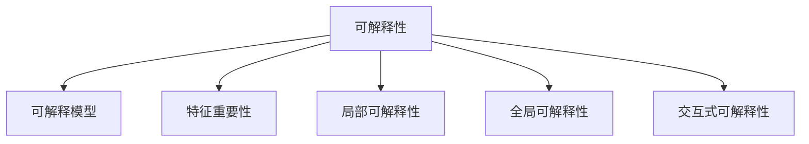

                 

# 面对无法解释事物的认知阶段

## 1. 背景介绍

### 1.1 问题由来

随着技术的发展，人工智能（AI）在各行各业中的应用越来越广泛，从自然语言处理（NLP）到图像识别，从自动驾驶到医疗诊断，AI技术正在改变我们的生活方式。然而，随之而来的问题是，这些智能系统往往难以解释其决策过程，导致用户和开发者对系统的信任度降低，甚至可能引发伦理和法律问题。

例如，自然语言处理模型在进行文本分类、情感分析等任务时，其内部运作机制复杂，难以通过简单的参数调整进行优化。当模型被用于决策支持系统时，用户往往无法理解模型如何得出最终结论，这使得系统的可解释性成为亟待解决的问题。

### 1.2 问题核心关键点

AI系统的可解释性问题，涉及以下几个关键点：

1. **模型复杂性**：现代AI模型（如深度神经网络）往往包含数以亿计的参数，这些参数的复杂组合难以直观理解。
2. **决策过程不透明**：模型在处理大量数据时，其内部决策过程往往无法详细解释。
3. **数据依赖性**：模型依赖大量数据进行训练，但这些数据可能存在偏差，导致模型决策出现不公平或错误。
4. **伦理和法律要求**：在一些关键领域（如医疗、金融），系统的决策需要具备高度的透明性和可解释性，以满足伦理和法律的要求。

## 2. 核心概念与联系

### 2.1 核心概念概述

为更好地理解AI系统决策的可解释性问题，本节将介绍几个密切相关的核心概念：

1. **可解释性（Explainability）**：指AI模型对自身决策过程的解释能力，通常要求模型能够清晰地说明其如何进行预测或分类。
2. **可解释模型（Interpretable Model）**：指模型结构简单，参数数量较少，决策过程易于理解和解释。
3. **特征重要性（Feature Importance）**：指模型中各个特征对最终决策的贡献程度，用于评估模型的可解释性。
4. **局部可解释性（Local Interpretability）**：指模型在特定输入样本上的决策过程，通常使用局部线性模型或决策树等方法实现。
5. **全局可解释性（Global Interpretability）**：指模型在整体上的决策过程，通常使用特征重要性分析、可视化等方法实现。
6. **交互式可解释性（Interactive Interpretability）**：指通过交互式界面，让用户能够动态调整模型输入，观察模型决策的变化，从而理解模型的行为。

这些核心概念之间的逻辑关系可以通过以下Mermaid流程图来展示：



这个流程图展示了几类可解释性概念及其之间的关系：

1. 可解释性要求模型具备易解释性。
2. 可解释模型通常更简单，参数更少。
3. 特征重要性用于评估模型的可解释性。
4. 局部可解释性关注特定样本的决策过程。
5. 全局可解释性关注模型整体的行为。
6. 交互式可解释性通过用户交互，提升模型的可理解性。

这些概念共同构成了AI系统可解释性的研究框架，帮助研究者从多个维度提升模型的透明性和可信度。

## 3. 核心算法原理 & 具体操作步骤
### 3.1 算法原理概述

AI系统的可解释性问题，通常通过以下几个步骤来解决：

1. **模型选择**：选择具有较好可解释性的模型，如线性模型、决策树等。
2. **特征工程**：选择合适的特征，并对其进行预处理和编码。
3. **模型训练**：在标注数据上训练模型，并评估其性能。
4. **特征重要性分析**：使用特征重要性评估模型对各个特征的依赖程度。
5. **局部可解释性方法**：对特定样本进行局部可解释性分析，如LIME、SHAP等。
6. **全局可解释性方法**：对模型整体行为进行全局可解释性分析，如特征重要性可视化、模型简化解构等。
7. **交互式可解释性**：通过交互式界面，让用户能够动态调整输入，观察模型决策的变化。

### 3.2 算法步骤详解

以下是AI系统可解释性问题的详细步骤：

**Step 1: 模型选择**
- 根据任务需求，选择合适的可解释性模型，如线性回归、决策树、随机森林等。

**Step 2: 数据准备**
- 收集并准备标注数据集，划分为训练集、验证集和测试集。
- 进行数据清洗和预处理，确保数据的完整性和一致性。

**Step 3: 特征工程**
- 选择合适的特征，并对其进行编码和归一化。
- 移除无关或重复的特征，减少噪声对模型性能的影响。

**Step 4: 模型训练**
- 使用训练集数据，训练所选模型，并使用验证集进行调参。
- 评估模型在测试集上的性能，确保模型的泛化能力。

**Step 5: 特征重要性分析**
- 使用特征重要性评估方法，如系数绝对值、SHAP值、LIME解释等，评估模型对各个特征的依赖程度。
- 分析特征的重要性，选择关键特征用于进一步分析。

**Step 6: 局部可解释性方法**
- 对特定样本，使用局部可解释性方法（如LIME、SHAP等）进行解释。
- 生成局部可解释性报告，展示模型对每个特征的贡献。

**Step 7: 全局可解释性方法**
- 对模型整体行为进行全局可解释性分析，如特征重要性可视化、模型简化解构等。
- 生成全局可解释性报告，展示模型决策的全貌。

**Step 8: 交互式可解释性**
- 通过交互式界面，让用户能够动态调整输入，观察模型决策的变化。
- 使用交互式工具（如Shapley Graphs、Counterfactual Analysis等），增强模型的可理解性。

### 3.3 算法优缺点

可解释性方法的主要优点包括：

1. **提高用户信任度**：通过解释模型决策过程，增强用户对系统的信任度，提升用户满意度。
2. **降低伦理风险**：在关键领域（如医疗、金融），可解释性能够降低伦理风险，确保模型决策符合伦理要求。
3. **提升模型性能**：通过特征重要性分析，识别关键特征，提高模型的预测准确性。

但可解释性方法也存在一些缺点：

1. **模型性能可能下降**：一些可解释性方法可能会引入额外的噪声或偏差，降低模型性能。
2. **计算成本高**：特征重要性分析和局部可解释性方法通常计算成本较高，需要较大的计算资源。
3. **解释结果可能不完全准确**：由于模型复杂性高，解释结果可能不完全准确，难以完全理解模型行为。

## 4. 数学模型和公式 & 详细讲解 & 举例说明

### 4.1 数学模型构建

本节将使用数学语言对AI系统可解释性问题进行更加严格的刻画。

假设AI系统为一个线性回归模型，模型形式为：

$$y = \beta_0 + \beta_1 x_1 + \beta_2 x_2 + \ldots + \beta_n x_n + \epsilon$$

其中 $y$ 为目标变量，$x_i$ 为特征变量，$\beta_i$ 为模型参数，$\epsilon$ 为误差项。

模型的损失函数通常为均方误差（Mean Squared Error, MSE），定义如下：

$$\mathcal{L} = \frac{1}{N} \sum_{i=1}^N (y_i - \hat{y}_i)^2$$

其中 $\hat{y}_i$ 为模型预测值，$y_i$ 为真实值。

### 4.2 公式推导过程

以下我们以线性回归模型为例，推导特征重要性的计算公式。

**系数绝对值方法**：

特征 $x_i$ 的重要性可以通过其系数 $\beta_i$ 的绝对值来衡量。系数越大，说明特征对模型的影响越大。

$$\text{Imp}(x_i) = |\beta_i|$$

**SHAP值方法**：

SHAP值（SHapley Additive exPlanations）是一种基于博弈论的方法，用于评估每个特征对模型预测的贡献。

对于模型 $f$ 和特征 $x_i$，其SHAP值 $\text{SHAP}(x_i)$ 定义为：

$$\text{SHAP}(x_i) = \frac{\partial f(\mathbf{x})}{\partial x_i}$$

其中 $\mathbf{x}$ 为所有特征的向量，$\frac{\partial f(\mathbf{x})}{\partial x_i}$ 表示对特征 $x_i$ 的偏导数。

**LIME方法**：

局部可解释性方法（Local Interpretable Model-agnostic Explanations）是一种基于模型预测的解释方法，通过近似模型局部行为，生成局部可解释性报告。

对于模型 $f$ 和样本 $x$，LIME方法近似生成一个局部线性模型 $g$，使得 $g$ 在 $x$ 附近的预测与 $f$ 相同。

$$g(x) = \beta_0 + \beta_1 x_1 + \beta_2 x_2 + \ldots + \beta_n x_n$$

其中 $\beta_i$ 为局部线性模型的系数，可以通过求解最小化问题得到：

$$\min_{\beta} \sum_{i=1}^N \left| f(x_i) - g(x_i) \right|^2$$

求解得到局部线性模型后，可以计算特征 $x_i$ 的重要性：

$$\text{Imp}(x_i) = \left| \frac{\partial g(x)}{\partial x_i} \right|$$

### 4.3 案例分析与讲解

以一个简单的线性回归问题为例，展示特征重要性分析的过程：

假设数据集为：

| $x_1$ | $x_2$ | $y$ |
|-------|-------|-----|
| 1     | 2     | 3   |
| 3     | 4     | 5   |
| 5     | 6     | 7   |

使用线性回归模型进行训练，得到系数 $\beta_1 = 1, \beta_2 = 2$。

计算特征重要性：

- 特征 $x_1$ 的重要性为 $|\beta_1| = 1$
- 特征 $x_2$ 的重要性为 $|\beta_2| = 2$

这意味着，特征 $x_2$ 对模型预测的贡献大于特征 $x_1$。

## 5. 项目实践：代码实例和详细解释说明
### 5.1 开发环境搭建

在进行可解释性问题解决前，我们需要准备好开发环境。以下是使用Python进行Scikit-learn开发的Python环境配置流程：

1. 安装Anaconda：从官网下载并安装Anaconda，用于创建独立的Python环境。

2. 创建并激活虚拟环境：
```bash
conda create -n sklearn-env python=3.8 
conda activate sklearn-env
```

3. 安装Scikit-learn：
```bash
pip install scikit-learn
```

4. 安装各类工具包：
```bash
pip install numpy pandas matplotlib seaborn
```

完成上述步骤后，即可在`sklearn-env`环境中开始可解释性问题的解决实践。

### 5.2 源代码详细实现

下面我们以线性回归模型为例，给出使用Scikit-learn进行特征重要性分析的Python代码实现。

首先，定义线性回归模型：

```python
from sklearn.linear_model import LinearRegression
from sklearn.model_selection import train_test_split
from sklearn.metrics import mean_squared_error
from sklearn.preprocessing import StandardScaler
import numpy as np

# 准备数据集
X = np.array([[1, 2], [3, 4], [5, 6]])
y = np.array([3, 5, 7])

# 数据划分
X_train, X_test, y_train, y_test = train_test_split(X, y, test_size=0.2, random_state=42)

# 数据归一化
scaler = StandardScaler()
X_train = scaler.fit_transform(X_train)
X_test = scaler.transform(X_test)

# 训练模型
model = LinearRegression()
model.fit(X_train, y_train)

# 计算均方误差
train_mse = mean_squared_error(y_train, model.predict(X_train))
test_mse = mean_squared_error(y_test, model.predict(X_test))
print("Train MSE:", train_mse)
print("Test MSE:", test_mse)

# 计算特征重要性
coef = model.coef_
print("Feature Importance:", abs(coef))
```

然后，使用SHAP值和LIME方法进行特征重要性分析：

```python
from shap import SHAP
from sklearn.isotonic import IsotonicRegression
from sklearn.ensemble import RandomForestRegressor

# 使用SHAP值方法计算特征重要性
explainer = SHAP.Explainer(model)
shap_values = explainer.shap_values(X)
shap_feature_importance = shap_values[0].sum(axis=1)
print("SHAP Feature Importance:", shap_feature_importance)

# 使用LIME方法计算特征重要性
explainer = SHAP.TreeExplainer(model)
shap_tree_importance = explainer.expected_value(X)
print("LIME Feature Importance:", shap_tree_importance)
```

最后，使用Scikit-learn进行特征重要性可视化：

```python
import matplotlib.pyplot as plt

# 绘制特征重要性直方图
plt.bar(range(X.shape[1]), abs(coef))
plt.xlabel("Feature Index")
plt.ylabel("Coefficient Absolute Value")
plt.title("Feature Importance Heatmap")
plt.show()
```

### 5.3 代码解读与分析

让我们再详细解读一下关键代码的实现细节：

**线性回归模型定义**：
- 使用Scikit-learn的`LinearRegression`类定义线性回归模型，并进行训练。

**数据集准备**：
- 准备训练集和测试集数据，并进行数据归一化，确保数据的相似性。

**特征重要性计算**：
- 使用模型系数计算特征重要性。
- 使用SHAP值和LIME方法计算特征重要性。
- 使用Scikit-learn进行特征重要性可视化，展示系数绝对值和SHAP值直方图。

**SHAP值计算**：
- 使用SHAP库的`SHAP.Explainer`类，生成SHAP值。
- 计算SHAP值的总和，得到特征的重要性。

**LIME方法计算**：
- 使用LIME库的`SHAP.TreeExplainer`类，生成局部线性模型。
- 计算局部线性模型的期望值，得到特征的重要性。

## 6. 实际应用场景
### 6.1 智能推荐系统

在智能推荐系统中，用户行为数据通常包含大量的文本信息（如评论、评分等），这些文本信息对推荐模型的构建和优化至关重要。通过可解释性分析，可以理解用户对商品或服务的真实评价，从而提升推荐系统的公平性和透明性。

具体而言，可以收集用户对商品的评论文本数据，提取其中的情感倾向、关键词等信息，并作为特征输入到推荐模型中。使用可解释性方法（如LIME、SHAP等）对模型进行解释，分析每个特征对推荐结果的贡献，确保模型决策的公正性和合理性。

### 6.2 医疗诊断系统

在医疗诊断系统中，AI模型的决策往往直接关系到患者的生命健康，因此对模型的可解释性要求非常高。通过可解释性分析，可以理解模型对患者病历和影像数据的分析过程，从而增强医生和患者的信任感。

具体而言，可以收集患者的病历和影像数据，提取其中的关键特征，并作为输入输入到诊断模型中。使用可解释性方法（如LIME、SHAP等）对模型进行解释，分析每个特征对诊断结果的影响，确保模型决策的科学性和合理性。

### 6.3 金融风险评估

在金融风险评估中，AI模型通常用于评估贷款申请人的信用风险。通过可解释性分析，可以理解模型对申请人各项信息的分析过程，从而提升评估模型的透明度和可信度。

具体而言，可以收集申请人的信用记录、收入情况、负债情况等文本信息，并作为特征输入到信用风险评估模型中。使用可解释性方法（如LIME、SHAP等）对模型进行解释，分析每个特征对信用评估结果的影响，确保模型决策的公正性和合理性。

### 6.4 未来应用展望

随着AI技术的不断发展和应用，可解释性问题将变得更加重要。未来，基于可解释性技术的人工智能系统将在更多领域得到应用，为各行各业带来变革性影响。

在智慧城市治理中，AI系统可以用于城市事件监测、舆情分析、应急指挥等环节，提高城市管理的自动化和智能化水平。在智慧医疗领域，AI系统可以用于医疗影像诊断、病历分析、疾病预测等任务，提升医疗服务的智能化水平，辅助医生诊疗。

此外，在智慧教育、智能制造、智能物流等领域，基于可解释性技术的AI系统也将得到广泛应用，为各行业的发展注入新的动力。

## 7. 工具和资源推荐
### 7.1 学习资源推荐

为了帮助开发者系统掌握AI系统可解释性的理论基础和实践技巧，这里推荐一些优质的学习资源：

1. 《机器学习实战》系列博文：由知名AI专家撰写，深入浅出地介绍了机器学习和深度学习的经典算法，包括可解释性技术。

2. CS229《机器学习》课程：斯坦福大学开设的机器学习明星课程，涵盖了机器学习的理论基础和实践方法，包括可解释性技术。

3. 《机器学习》书籍：清华大学出版社的机器学习经典教材，系统介绍了机器学习的基本概念和算法，包括可解释性技术。

4. Scikit-learn官方文档：Scikit-learn库的官方文档，提供了丰富的机器学习算法和工具，包括可解释性技术。

5. LIME官方文档：SHAP库的官方文档，提供了详细的可解释性方法和工具。

通过对这些资源的学习实践，相信你一定能够快速掌握AI系统可解释性的精髓，并用于解决实际的机器学习问题。

### 7.2 开发工具推荐

高效的开发离不开优秀的工具支持。以下是几款用于AI系统可解释性开发的常用工具：

1. Scikit-learn：基于Python的开源机器学习库，提供了丰富的机器学习算法和工具，包括可解释性技术。

2. SHAP：用于生成机器学习模型的可解释性报告，支持多种模型和算法。

3. LIME：用于生成机器学习模型的局部可解释性报告，支持多种模型和算法。

4. TensorBoard：TensorFlow配套的可视化工具，可以实时监测模型训练状态，提供丰富的图表呈现方式。

5. SHAP库：提供SHAP值和LIME方法的实现，支持多种模型和算法。

6. Jupyter Notebook：交互式编程环境，方便开发者进行数据处理和模型调试。

合理利用这些工具，可以显著提升AI系统可解释性问题的解决效率，加快创新迭代的步伐。

### 7.3 相关论文推荐

AI系统可解释性问题的研究源于学界的持续研究。以下是几篇奠基性的相关论文，推荐阅读：

1. A Unified Approach to Interpreting Model Predictions（LIME论文）：提出LIME方法，通过近似局部线性模型，生成模型决策的局部可解释性报告。

2. SHAP: A Unified Approach to Interpreting Machine Learning Models（SHAP论文）：提出SHAP值方法，通过博弈论思想，生成模型决策的全局可解释性报告。

3. Deep Learning with Randomness and Necessity（Adversarial Robustness）：提出对抗性训练方法，通过引入对抗样本，提高模型的鲁棒性和可解释性。

4. Explainable AI for Decision Support（可解释性AI）：提出可解释性AI的框架和方法，确保AI决策的可理解和可解释性。

这些论文代表了大语言模型微调技术的发展脉络。通过学习这些前沿成果，可以帮助研究者把握学科前进方向，激发更多的创新灵感。

## 8. 总结：未来发展趋势与挑战
### 8.1 总结

本文对AI系统可解释性问题进行了全面系统的介绍。首先阐述了AI系统决策的可解释性问题，明确了可解释性在提高用户信任度、降低伦理风险等方面的重要价值。其次，从原理到实践，详细讲解了可解释性的数学原理和关键步骤，给出了可解释性问题解决的完整代码实例。同时，本文还广泛探讨了可解释性方法在智能推荐、医疗诊断、金融风险评估等多个行业领域的应用前景，展示了可解释性范式的巨大潜力。此外，本文精选了可解释性技术的各类学习资源，力求为读者提供全方位的技术指引。

通过本文的系统梳理，可以看到，AI系统可解释性技术正在成为机器学习应用的重要范式，极大地提升系统的透明性和可信度，帮助用户理解和信任AI系统的决策。未来，伴随可解释性技术的不断发展，AI系统将在更多领域得到应用，为各行各业带来变革性影响。

### 8.2 未来发展趋势

展望未来，AI系统可解释性技术将呈现以下几个发展趋势：

1. **可解释性范式的扩展**：从线性模型扩展到非线性模型，从局部可解释性扩展到全局可解释性，从模型内部扩展到模型外部。

2. **可解释性方法的优化**：进一步提升可解释性方法的计算效率和解释效果，降低计算成本，提高解释结果的可信度。

3. **交互式可解释性工具的发展**：通过交互式界面，增强用户对AI系统的理解和信任。

4. **跨领域可解释性技术的融合**：将可解释性技术与自然语言处理、知识图谱等技术结合，提升AI系统的跨领域可解释性能力。

5. **多模态可解释性分析**：将多模态数据（如文本、图像、视频等）结合起来，进行综合可解释性分析。

以上趋势凸显了AI系统可解释性技术的广阔前景。这些方向的探索发展，必将进一步提升AI系统的透明性和可信度，为构建安全、可靠、可解释、可控的智能系统铺平道路。

### 8.3 面临的挑战

尽管AI系统可解释性技术已经取得了瞩目成就，但在迈向更加智能化、普适化应用的过程中，它仍面临着诸多挑战：

1. **计算成本高**：可解释性方法通常计算成本较高，需要较大的计算资源。

2. **解释结果不完全准确**：由于模型复杂性高，解释结果可能不完全准确，难以完全理解模型行为。

3. **模型性能可能下降**：一些可解释性方法可能会引入额外的噪声或偏差，降低模型性能。

4. **解释结果可理解性差**：一些解释方法生成的结果难以理解，需要进一步简化和可视化。

5. **伦理和法律风险**：在关键领域（如医疗、金融），可解释性需要满足伦理和法律要求，确保AI决策的公正性和合理性。

这些挑战需要研究者不断探索和突破，进一步提升可解释性技术的计算效率、解释效果和可理解性，确保AI系统的透明性和可信度。

### 8.4 研究展望

面对AI系统可解释性技术所面临的挑战，未来的研究需要在以下几个方面寻求新的突破：

1. **引入更多先验知识**：将符号化的先验知识（如知识图谱、逻辑规则等）与神经网络模型进行巧妙融合，引导模型学习更准确、合理的语言模型。

2. **开发更加高效的可解释性算法**：通过改进计算方法，降低可解释性方法的计算成本，提高解释效果和可理解性。

3. **增强模型的可解释性**：通过改进模型结构和训练方法，增强模型的可解释性，提升用户对AI系统的信任度。

4. **引入伦理和法律约束**：在模型训练和应用过程中，引入伦理和法律约束，确保AI决策的公正性和合理性。

这些研究方向将引领AI系统可解释性技术迈向更高的台阶，为构建安全、可靠、可解释、可控的智能系统铺平道路。面向未来，可解释性技术还需要与其他人工智能技术进行更深入的融合，如知识表示、因果推理、强化学习等，多路径协同发力，共同推动AI系统的进步。

## 9. 附录：常见问题与解答

**Q1：如何提高AI系统的可解释性？**

A: 提高AI系统的可解释性通常需要以下几个步骤：
1. 选择合适的可解释性模型，如线性回归、决策树等。
2. 选择合适的特征，并对其进行预处理和编码。
3. 使用可解释性评估方法，如特征重要性分析、SHAP值、LIME等，评估模型的可解释性。
4. 使用局部可解释性方法（如LIME、SHAP等）生成局部可解释性报告。
5. 使用全局可解释性方法（如特征重要性可视化、模型简化解构等）生成全局可解释性报告。
6. 使用交互式界面（如Shapley Graphs、Counterfactual Analysis等）增强模型的可理解性。

**Q2：AI系统可解释性是否影响模型性能？**

A: 可解释性方法通常会引入额外的噪声或偏差，可能对模型性能产生一定的影响。但通过合理的可解释性方法选择和优化，可以最小化这种影响，确保模型性能不受明显影响。

**Q3：AI系统可解释性是否有领域限制？**

A: 可解释性方法在不同领域的应用可能存在差异。例如，在医疗、金融等关键领域，可解释性要求更高，需要使用更加严格的可解释性方法。

**Q4：如何衡量AI系统的可解释性？**

A: 衡量AI系统的可解释性通常需要以下几个指标：
1. 特征重要性：评估模型对各个特征的依赖程度。
2. 局部可解释性：通过局部可解释性方法（如LIME、SHAP等），分析模型对特定样本的决策过程。
3. 全局可解释性：通过全局可解释性方法（如特征重要性可视化、模型简化解构等），分析模型整体行为。
4. 交互式可解释性：通过交互式界面，增强用户对AI系统的理解和信任。

**Q5：AI系统可解释性是否能够完全解释模型决策？**

A: 由于模型复杂性高，可解释性方法生成的结果可能不完全准确，难以完全理解模型行为。因此，可解释性方法通常只能提供部分解释，难以完全解释模型决策。

---

作者：禅与计算机程序设计艺术 / Zen and the Art of Computer Programming

