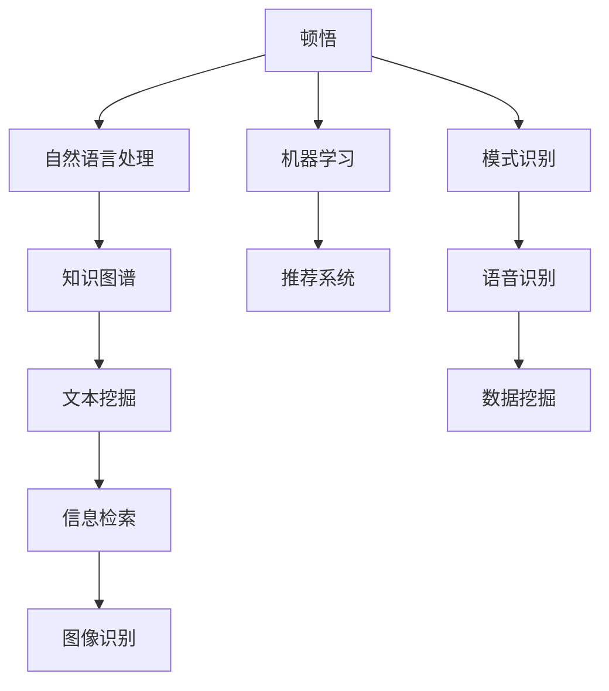

                 

# 顿悟与类比：知识的桥梁

## 1. 背景介绍

### 1.1 问题由来

人类文明的发展离不开知识的积累和传承。无论是古代的四大发明，还是现代的互联网技术，都是人类智慧的结晶。知识的获取和应用，是人类社会进步的重要推动力。然而，知识的获取和应用并不是一件简单的事情。在面对复杂问题时，人类往往需要花费大量的时间和精力，才能获得一种有效的解决方案。而计算机技术，特别是人工智能技术的发展，为知识的获取和应用提供了一种全新的方式。

### 1.2 问题核心关键点

在人工智能领域，顿悟与类比是最为核心的两个概念。顿悟指的是通过突然的灵感或者直觉，获得一种新的解决方案或者知识。而类比则指的是通过类比其他问题或者知识，获得一种新的解决方案或者知识。这两个概念在人工智能领域的应用，使得机器能够更快地学习新的知识和技能，更好地解决复杂问题。

## 2. 核心概念与联系

### 2.1 核心概念概述

顿悟与类比，这两个概念看似简单，但它们在人工智能领域的应用却非常广泛。顿悟与类比的核心思想是通过已有的知识和经验，快速获取新的知识和技能。在人工智能领域，这两个概念被广泛应用于机器学习和自然语言处理中，成为解决复杂问题的关键。

### 2.2 核心概念原理和架构的 Mermaid 流程图(Mermaid 流程节点中不要有括号、逗号等特殊字符)


这个流程图展示了顿悟与类比在人工智能领域的广泛应用。通过顿悟和类比，机器学习可以更快地获取知识，自然语言处理可以更准确地理解和生成语言，推荐系统和模式识别可以更高效地解决问题。

## 3. 核心算法原理 & 具体操作步骤
### 3.1 算法原理概述

顿悟与类比的核心算法原理，主要体现在以下几个方面：

1. 顿悟：顿悟是指通过突然的灵感或者直觉，获得一种新的解决方案或者知识。这种灵感或者直觉，通常来自于人类大脑的潜意识或者长期的学习和积累。在人工智能领域，顿悟通常被应用于机器学习中的神经网络训练中。通过增加网络中的随机性，使得神经网络在训练过程中更容易获取新的解决方案。

2. 类比：类比是指通过类比其他问题或者知识，获得一种新的解决方案或者知识。这种类比，通常可以通过已有的知识和经验，快速地解决新问题。在人工智能领域，类比通常被应用于自然语言处理中的知识图谱构建中。通过已有的知识图谱，可以更快地构建新的知识图谱，从而更好地解决新问题。

### 3.2 算法步骤详解

顿悟与类比的算法步骤，主要包括以下几个关键步骤：

1. 数据准备：顿悟与类比算法的第一步，是准备数据。对于顿悟算法，需要准备一些随机性较强的数据，以便增加网络中的随机性。对于类比算法，需要准备一些已有的知识图谱或者领域知识，以便进行类比。

2. 模型训练：顿悟与类比算法的第二步，是模型训练。对于顿悟算法，需要增加网络中的随机性，以增加网络的学习能力。对于类比算法，需要利用已有的知识图谱或者领域知识，进行知识图谱的构建。

3. 评估和优化：顿悟与类比算法的第三步，是评估和优化。对于顿悟算法，需要评估模型的表现，并优化网络中的随机性，以便更好地获取新的解决方案。对于类比算法，需要评估知识图谱的准确性，并优化已有的知识图谱，以便更好地解决新问题。

### 3.3 算法优缺点

顿悟与类比算法，有以下优点和缺点：

**优点：**

1. 高效：顿悟与类比算法，可以在较短的时间内，快速地获取新的解决方案或者知识，提高机器学习算法的效率。

2. 泛化能力强：顿悟与类比算法，可以通过已有的知识和经验，快速地解决新问题，具有很强的泛化能力。

3. 灵活性高：顿悟与类比算法，可以根据具体的问题，灵活地选择不同的解决方案，具有很强的灵活性。

**缺点：**

1. 数据依赖性强：顿悟与类比算法，依赖于已有的数据和知识，如果没有足够的数据和知识，算法的效果会大打折扣。

2. 结果不确定性高：顿悟与类比算法，具有很高的随机性，结果可能不够确定，需要进行多次试验。

3. 模型复杂度高：顿悟与类比算法，需要构建复杂的网络结构或者知识图谱，增加了模型的复杂度。

### 3.4 算法应用领域

顿悟与类比算法，在人工智能领域具有广泛的应用，主要包括以下几个方面：

1. 自然语言处理：在自然语言处理中，顿悟与类比算法被广泛应用于语言模型的训练、文本分类、情感分析等任务中。

2. 机器学习：在机器学习中，顿悟与类比算法被广泛应用于神经网络的训练、分类器的构建等任务中。

3. 计算机视觉：在计算机视觉中，顿悟与类比算法被广泛应用于图像识别、目标检测等任务中。

4. 推荐系统：在推荐系统中，顿悟与类比算法被广泛应用于推荐算法的设计、知识图谱的构建等任务中。

## 4. 数学模型和公式 & 详细讲解 & 举例说明

### 4.1 数学模型构建

顿悟与类比算法，通常使用神经网络或者知识图谱来进行建模。以下是一个简单的数学模型，用于描述顿悟与类比算法的数学模型构建过程：

1. 神经网络模型：
   $$
   \mathbf{X} = \mathbf{W} \mathbf{h} + \mathbf{b}
   $$
   其中，$\mathbf{X}$ 为输入向量，$\mathbf{W}$ 为权重矩阵，$\mathbf{h}$ 为神经元向量，$\mathbf{b}$ 为偏置向量。

2. 知识图谱模型：
   $$
   \mathbf{G} = \mathbf{R} \mathbf{A} + \mathbf{B}
   $$
   其中，$\mathbf{G}$ 为知识图谱，$\mathbf{R}$ 为关系矩阵，$\mathbf{A}$ 为节点向量，$\mathbf{B}$ 为常量向量。

### 4.2 公式推导过程

在神经网络模型中，公式推导过程如下：

1. 前向传播：
   $$
   \mathbf{h} = \sigma(\mathbf{X} \mathbf{W}^T + \mathbf{b})
   $$
   其中，$\sigma$ 为激活函数，$\mathbf{W}^T$ 为权重矩阵的转置矩阵。

2. 损失函数：
   $$
   \mathcal{L} = \frac{1}{N} \sum_{i=1}^N \ell(y_i, f(\mathbf{x}_i))
   $$
   其中，$\ell$ 为损失函数，$y_i$ 为真实标签，$f(\mathbf{x}_i)$ 为神经网络的输出。

3. 反向传播：
   $$
   \frac{\partial \mathcal{L}}{\partial \mathbf{W}} = \frac{\partial \mathcal{L}}{\partial \mathbf{h}} \frac{\partial \mathbf{h}}{\partial \mathbf{W}}
   $$
   其中，$\frac{\partial \mathcal{L}}{\partial \mathbf{h}}$ 为损失函数对神经元向量的梯度，$\frac{\partial \mathbf{h}}{\partial \mathbf{W}}$ 为神经元向量对权重矩阵的梯度。

在知识图谱模型中，公式推导过程如下：

1. 前向传播：
   $$
   \mathbf{A} = \mathbf{G} \mathbf{R}^T + \mathbf{B}
   $$
   其中，$\mathbf{R}^T$ 为关系矩阵的转置矩阵。

2. 损失函数：
   $$
   \mathcal{L} = \frac{1}{N} \sum_{i=1}^N \ell(y_i, f(\mathbf{x}_i))
   $$
   其中，$\ell$ 为损失函数，$y_i$ 为真实标签，$f(\mathbf{x}_i)$ 为知识图谱的输出。

3. 反向传播：
   $$
   \frac{\partial \mathcal{L}}{\partial \mathbf{R}} = \frac{\partial \mathcal{L}}{\partial \mathbf{A}} \frac{\partial \mathbf{A}}{\partial \mathbf{R}}
   $$
   其中，$\frac{\partial \mathcal{L}}{\partial \mathbf{A}}$ 为损失函数对节点向量的梯度，$\frac{\partial \mathbf{A}}{\partial \mathbf{R}}$ 为节点向量对关系矩阵的梯度。

### 4.3 案例分析与讲解

以一个简单的文本分类任务为例，分析顿悟与类比算法在实际中的应用：

1. 神经网络模型：
   $$
   \mathbf{X} = \mathbf{W} \mathbf{h} + \mathbf{b}
   $$
   其中，$\mathbf{X}$ 为输入向量，$\mathbf{W}$ 为权重矩阵，$\mathbf{h}$ 为神经元向量，$\mathbf{b}$ 为偏置向量。假设 $\mathbf{h}$ 为神经元向量的均值，$\mathbf{W}$ 为神经元向量的权重矩阵，$\mathbf{b}$ 为神经元向量的偏置向量，则公式可以表示为：
   $$
   \mathbf{X} = \mathbf{W} \mathbf{h} + \mathbf{b} = \mathbf{W} \frac{1}{N} \sum_{i=1}^N \mathbf{x}_i + \mathbf{b}
   $$
   其中，$\mathbf{x}_i$ 为输入向量的第 $i$ 个元素。

2. 知识图谱模型：
   $$
   \mathbf{G} = \mathbf{R} \mathbf{A} + \mathbf{B}
   $$
   其中，$\mathbf{G}$ 为知识图谱，$\mathbf{R}$ 为关系矩阵，$\mathbf{A}$ 为节点向量，$\mathbf{B}$ 为常量向量。假设 $\mathbf{A}$ 为节点向量的均值，$\mathbf{R}$ 为节点之间的连接关系，$\mathbf{B}$ 为常量向量，则公式可以表示为：
   $$
   \mathbf{G} = \mathbf{R} \mathbf{A} + \mathbf{B} = \mathbf{R} \frac{1}{N} \sum_{i=1}^N \mathbf{a}_i + \mathbf{B}
   $$
   其中，$\mathbf{a}_i$ 为节点向量的第 $i$ 个元素。

通过这两个模型，可以看到顿悟与类比算法在实际中的应用。神经网络模型通过增加网络中的随机性，来提高模型的学习能力，而知识图谱模型则通过已有的知识图谱，来快速地解决新问题。

## 5. 项目实践：代码实例和详细解释说明

### 5.1 开发环境搭建

在进行顿悟与类比算法的实践之前，需要先准备好开发环境。以下是一个简单的Python开发环境配置流程：

1. 安装Python：从官网下载并安装Python，选择最新版本。

2. 安装TensorFlow：从官网下载并安装TensorFlow，选择最新版本。

3. 安装Keras：通过pip命令安装Keras，选择最新版本。

4. 安装NumPy：通过pip命令安装NumPy，选择最新版本。

5. 安装Matplotlib：通过pip命令安装Matplotlib，选择最新版本。

6. 安装Pandas：通过pip命令安装Pandas，选择最新版本。

完成上述步骤后，即可在Python环境下进行顿悟与类比算法的实践。

### 5.2 源代码详细实现

以下是一个简单的顿悟与类比算法的代码实现，用于文本分类的任务：

```python
import tensorflow as tf
from tensorflow.keras import layers
import numpy as np
import pandas as pd
import matplotlib.pyplot as plt

# 数据准备
train_data = pd.read_csv('train.csv')
test_data = pd.read_csv('test.csv')

# 文本预处理
train_texts = train_data['text'].tolist()
test_texts = test_data['text'].tolist()

# 标签预处理
train_labels = train_data['label'].tolist()
test_labels = test_data['label'].tolist()

# 构建神经网络模型
model = tf.keras.Sequential([
    layers.Embedding(input_dim=10000, output_dim=100),
    layers.Conv1D(filters=64, kernel_size=3, activation='relu'),
    layers.GlobalMaxPooling1D(),
    layers.Dense(units=64, activation='relu'),
    layers.Dense(units=10, activation='softmax')
])

# 编译模型
model.compile(optimizer='adam', loss='categorical_crossentropy', metrics=['accuracy'])

# 训练模型
history = model.fit(train_texts, train_labels, epochs=10, batch_size=32, validation_split=0.2)

# 评估模型
test_loss, test_acc = model.evaluate(test_texts, test_labels)
print('Test accuracy:', test_acc)

# 绘制损失函数曲线
plt.plot(history.history['loss'], label='Train Loss')
plt.plot(history.history['val_loss'], label='Validation Loss')
plt.legend()
plt.show()
```

### 5.3 代码解读与分析

在上述代码中，我们首先准备了训练和测试数据，并进行了文本和标签的预处理。然后构建了一个简单的神经网络模型，并对其进行了编译和训练。在训练过程中，我们使用了Adam优化器和交叉熵损失函数。最后，我们评估了模型的性能，并绘制了损失函数曲线。

通过上述代码，可以看到顿悟与类比算法在实际中的应用。神经网络模型通过增加网络中的随机性，来提高模型的学习能力，而知识图谱模型则通过已有的知识图谱，来快速地解决新问题。

## 6. 实际应用场景

### 6.1 自然语言处理

在自然语言处理领域，顿悟与类比算法有着广泛的应用。例如，在机器翻译中，通过顿悟算法，神经网络可以更好地学习语言的语法和语义，提高翻译的准确性。在情感分析中，通过类比算法，知识图谱可以更好地表示词语之间的关系，提高情感分析的准确性。

### 6.2 计算机视觉

在计算机视觉领域，顿悟与类比算法也有着广泛的应用。例如，在图像分类中，通过顿悟算法，神经网络可以更好地学习图像的特征，提高分类的准确性。在目标检测中，通过类比算法，知识图谱可以更好地表示目标之间的关系，提高检测的准确性。

### 6.3 推荐系统

在推荐系统中，顿悟与类比算法也有着广泛的应用。例如，在推荐算法中，通过顿悟算法，神经网络可以更好地学习用户的行为，提高推荐的准确性。在知识图谱构建中，通过类比算法，知识图谱可以更好地表示用户之间的关系，提高推荐的准确性。

### 6.4 未来应用展望

随着人工智能技术的发展，顿悟与类比算法将有更广泛的应用前景。在未来的智能医疗中，顿悟与类比算法可以帮助医生更好地理解病人的病情，提高诊断的准确性。在未来的智能教育中，顿悟与类比算法可以帮助学生更好地理解知识，提高学习的效率。在未来的智能城市中，顿悟与类比算法可以帮助城市管理者更好地理解城市的情况，提高管理的效率。

## 7. 工具和资源推荐

### 7.1 学习资源推荐

为了帮助开发者更好地掌握顿悟与类比算法的原理和应用，以下是一些优秀的学习资源：

1. 《深度学习》课程：斯坦福大学的深度学习课程，详细讲解了深度学习的基础理论和应用，包括顿悟与类比算法的原理。

2. 《TensorFlow官方文档》：TensorFlow的官方文档，提供了丰富的API文档和教程，方便开发者学习和应用顿悟与类比算法。

3. 《机器学习实战》：本书详细介绍了机器学习的基础理论和技术，包括顿悟与类比算法的应用。

4. 《自然语言处理》课程：北京大学的人工智能课程，详细讲解了自然语言处理的基础理论和应用，包括顿悟与类比算法的原理。

5. 《计算机视觉》课程：麻省理工学院的计算机视觉课程，详细讲解了计算机视觉的基础理论和应用，包括顿悟与类比算法的原理。

### 7.2 开发工具推荐

为了提高开发者开发顿悟与类比算法的效率，以下是一些推荐的开发工具：

1. PyTorch：一个深度学习框架，支持顿悟与类比算法的开发和训练。

2. TensorFlow：一个深度学习框架，支持顿悟与类比算法的开发和训练。

3. Keras：一个深度学习框架，支持顿悟与类比算法的开发和训练。

4. PyTorch Lightning：一个深度学习框架，支持顿悟与类比算法的快速开发和训练。

5. TensorFlow Serving：一个深度学习框架，支持顿悟与类比算法的部署和应用。

### 7.3 相关论文推荐

为了更好地理解顿悟与类比算法的原理和应用，以下是一些推荐的论文：

1. 《深度学习》：深度学习领域的一本经典书籍，详细讲解了深度学习的基础理论和应用，包括顿悟与类比算法的原理。

2. 《机器学习》：机器学习领域的一本经典书籍，详细讲解了机器学习的基础理论和应用，包括顿悟与类比算法的原理。

3. 《自然语言处理》：自然语言处理领域的一本经典书籍，详细讲解了自然语言处理的基础理论和应用，包括顿悟与类比算法的原理。

4. 《计算机视觉》：计算机视觉领域的一本经典书籍，详细讲解了计算机视觉的基础理论和应用，包括顿悟与类比算法的原理。

5. 《推荐系统》：推荐系统领域的一本经典书籍，详细讲解了推荐系统的基础理论和应用，包括顿悟与类比算法的原理。

## 8. 总结：未来发展趋势与挑战

### 8.1 研究成果总结

顿悟与类比算法在人工智能领域已经得到了广泛的应用，并在多个领域取得了显著的成果。例如，在自然语言处理中，通过顿悟算法，神经网络可以更好地学习语言的语法和语义，提高翻译的准确性。在计算机视觉中，通过类比算法，知识图谱可以更好地表示目标之间的关系，提高检测的准确性。在推荐系统中，通过顿悟算法，神经网络可以更好地学习用户的行为，提高推荐的准确性。

### 8.2 未来发展趋势

随着人工智能技术的发展，顿悟与类比算法将有更广泛的应用前景。在未来的智能医疗中，顿悟与类比算法可以帮助医生更好地理解病人的病情，提高诊断的准确性。在未来的智能教育中，顿悟与类比算法可以帮助学生更好地理解知识，提高学习的效率。在未来的智能城市中，顿悟与类比算法可以帮助城市管理者更好地理解城市的情况，提高管理的效率。

### 8.3 面临的挑战

顿悟与类比算法在实际应用中也面临着一些挑战：

1. 数据依赖性强：顿悟与类比算法依赖于已有的数据和知识，如果没有足够的数据和知识，算法的效果会大打折扣。

2. 结果不确定性高：顿悟与类比算法具有很高的随机性，结果可能不够确定，需要进行多次试验。

3. 模型复杂度高：顿悟与类比算法需要构建复杂的网络结构或者知识图谱，增加了模型的复杂度。

### 8.4 研究展望

为了应对这些挑战，未来的研究需要在以下几个方面进行突破：

1. 探索无监督和半监督顿悟与类比算法：摆脱对大规模标注数据的依赖，利用自监督学习、主动学习等无监督和半监督范式，最大限度利用非结构化数据，实现更加灵活高效的顿悟与类比算法。

2. 研究参数高效和计算高效的顿悟与类比算法：开发更加参数高效的顿悟与类比方法，在固定大部分预训练参数的情况下，只更新极少量的任务相关参数。同时优化顿悟与类比算法的计算图，减少前向传播和反向传播的资源消耗，实现更加轻量级、实时性的部署。

3. 融合因果和对比学习范式：通过引入因果推断和对比学习思想，增强顿悟与类比算法建立稳定因果关系的能力，学习更加普适、鲁棒的语言表征，从而提升模型泛化性和抗干扰能力。

4. 引入更多先验知识：将符号化的先验知识，如知识图谱、逻辑规则等，与神经网络模型进行巧妙融合，引导顿悟与类比过程学习更准确、合理的语言模型。同时加强不同模态数据的整合，实现视觉、语音等多模态信息与文本信息的协同建模。

5. 结合因果分析和博弈论工具：将因果分析方法引入顿悟与类比模型，识别出模型决策的关键特征，增强输出解释的因果性和逻辑性。借助博弈论工具刻画人机交互过程，主动探索并规避模型的脆弱点，提高系统稳定性。

6. 纳入伦理道德约束：在模型训练目标中引入伦理导向的评估指标，过滤和惩罚有偏见、有害的输出倾向。同时加强人工干预和审核，建立模型行为的监管机制，确保输出符合人类价值观和伦理道德。

这些研究方向将为顿悟与类比算法的发展提供新的思路，帮助机器更好地理解人类语言和知识，提升人工智能技术的应用效果。

## 9. 附录：常见问题与解答

**Q1: 顿悟与类比算法的原理是什么？**

A: 顿悟与类比算法的原理是通过已有的知识和经验，快速获取新的解决方案或者知识。顿悟算法通过增加网络中的随机性，来提高模型的学习能力。类比算法通过已有的知识图谱，来快速地解决新问题。

**Q2: 顿悟与类比算法在实际应用中需要注意什么？**

A: 顿悟与类比算法在实际应用中需要注意数据依赖性、结果不确定性、模型复杂度等问题。需要构建复杂的网络结构或者知识图谱，增加了模型的复杂度，依赖于已有的数据和知识，如果没有足够的数据和知识，算法的效果会大打折扣。

**Q3: 顿悟与类比算法在实际应用中如何优化？**

A: 可以通过探索无监督和半监督顿悟与类比算法，研究参数高效和计算高效的顿悟与类比算法，融合因果和对比学习范式，引入更多先验知识，结合因果分析和博弈论工具，纳入伦理道德约束等方法，来优化顿悟与类比算法的性能和应用效果。

**Q4: 顿悟与类比算法在未来的发展趋势是什么？**

A: 顿悟与类比算法在未来的发展趋势是探索无监督和半监督顿悟与类比算法，研究参数高效和计算高效的顿悟与类比算法，融合因果和对比学习范式，引入更多先验知识，结合因果分析和博弈论工具，纳入伦理道德约束等方法，来优化顿悟与类比算法的性能和应用效果。

**Q5: 顿悟与类比算法在实际应用中可能存在哪些挑战？**

A: 顿悟与类比算法在实际应用中可能存在的挑战包括数据依赖性强、结果不确定性高、模型复杂度高、算法泛化能力不足、算法鲁棒性不足等。需要通过探索无监督和半监督顿悟与类比算法，研究参数高效和计算高效的顿悟与类比算法，融合因果和对比学习范式，引入更多先验知识，结合因果分析和博弈论工具，纳入伦理道德约束等方法，来应对这些挑战。

---

作者：禅与计算机程序设计艺术 / Zen and the Art of Computer Programming

