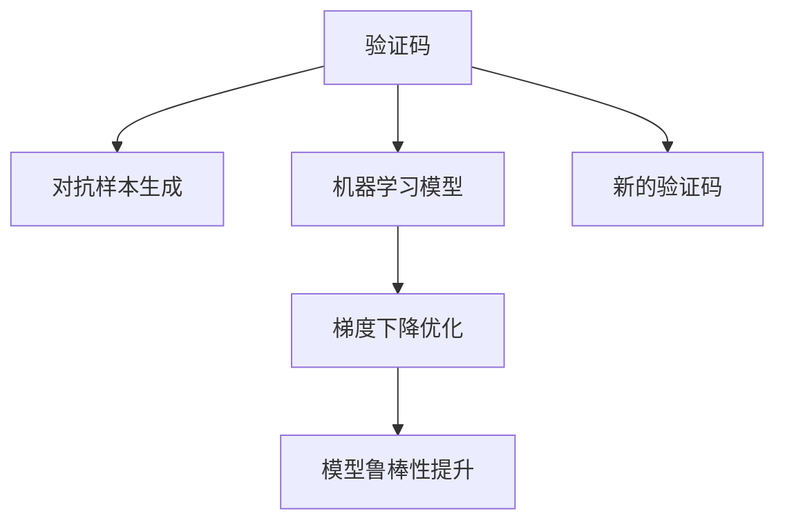

                 

# 验证码：人机交互中的智慧博弈

## 1. 背景介绍

随着互联网的普及和数字化进程的加速，验证码（CAPTCHA）已成为用户登录、交易确认等场景中不可或缺的身份验证手段。验证码的核心目的是区分“人”与“机”，确保只有人类用户才能顺利通过验证。然而，随着自动化工具和机器学习技术的不断发展，验证码的安全性面临严峻挑战。

### 1.1 问题由来
验证码的设计初衷是解决计算机自动提交恶意请求的问题。然而，随着图像识别和机器学习技术的进步，自动化程序能够通过分析验证码图片、文字特征等手段破解验证码。例如，光学字符识别（OCR）技术已经能够高效识破简单的文字验证码，图像处理算法也能对背景复杂的验证码进行识别。这些技术的突破使得验证码的安全性不断受到威胁。

### 1.2 问题核心关键点
验证码的核心是“智慧博弈”：

1. **防御方**：设计者设计复杂、难以破解的验证码。
2. **进攻方**：破解者利用最新技术突破验证码防线。
3. **平衡点**：系统需要在防御与用户体验之间找到平衡，既要难以破解，又要易于用户识别。

## 2. 核心概念与联系

### 2.1 核心概念概述

为了理解验证码在技术上的设计原理和应用，首先需要了解以下几个核心概念：

- **验证码**：一种用于验证用户是否为真实用户的在线测试。通常包括文字验证码、图片验证码、音频验证码等。
- **对抗样本**：一类特别设计用于欺骗机器学习模型的数据，如通过微小扰动使图像识别系统错误分类。
- **机器学习模型**：包括卷积神经网络（CNN）、递归神经网络（RNN）等，用于图像处理、文字识别等任务。
- **梯度下降**：一种常用的优化算法，用于训练机器学习模型。
- **对抗训练**：通过在训练过程中加入对抗样本，提升模型鲁棒性，使其对扰动具有一定抗性。

这些概念之间存在紧密的联系，通过对抗训练和梯度下降等技术，攻击方能够不断提升破解验证码的能力，而防御方则不断改进验证码设计，提升其安全性。

### 2.2 核心概念原理和架构的 Mermaid 流程图



这个流程图展示了验证码设计、对抗样本生成、模型训练、鲁棒性提升和新的验证码设计的循环过程。防御方通过设计复杂的验证码来测试用户，而进攻方通过生成对抗样本来破解验证码。机器学习模型在此过程中不断被优化，防御方则根据新的攻击手段调整验证码设计，形成一种动态的智慧博弈。

## 3. 核心算法原理 & 具体操作步骤
### 3.1 算法原理概述

验证码的核心算法原理基于对抗博弈论和机器学习。其核心思想是：

1. **防御方**：设计复杂的验证码，使其难以被机器识别。
2. **进攻方**：利用机器学习技术破解验证码。
3. **博弈过程**：防御方不断调整验证码复杂度，进攻方不断提升破解能力。

这一过程中，梯度下降和对抗训练是关键技术。防御方通过梯度下降优化验证码模型，以抵御攻击；进攻方则利用对抗训练提升其破解能力。

### 3.2 算法步骤详解

以下是对验证码设计的详细步骤：

**Step 1: 设计验证码格式**

1. **文字验证码**：生成随机字符、数字，采用扭曲、倾斜、颜色干扰等手段增加难度。
2. **图片验证码**：生成随机图形、扭曲的字母、干扰线等，形成复杂背景。
3. **音频验证码**：生成复杂背景噪音，加入特定指令或关键词，让用户通过听力识别。

**Step 2: 生成对抗样本**

1. **图像对抗样本**：通过微小扰动修改验证码图片，使其在难以被人类识别的情况下仍能被机器识别。
2. **文字对抗样本**：通过干扰字符大小、颜色、布局等，使文本难以被机器识别。
3. **音频对抗样本**：通过添加干扰噪音或随机插入关键词，使语音指令难以被机器识别。

**Step 3: 训练机器学习模型**

1. **图像识别模型**：使用CNN等模型训练识别验证码图片的机器学习模型。
2. **文字识别模型**：使用RNN等模型训练识别扭曲、干扰文字。
3. **语音识别模型**：使用RNN、CNN等模型训练识别复杂音频指令。

**Step 4: 对抗训练**

1. **图像对抗训练**：将对抗样本加入训练集，通过梯度下降优化模型参数，增强模型对对抗样本的鲁棒性。
2. **文字对抗训练**：将扭曲、干扰文字加入训练集，通过梯度下降优化模型参数，增强模型对干扰文字的鲁棒性。
3. **音频对抗训练**：将噪声干扰、关键词插入等对抗样本加入训练集，通过梯度下降优化模型参数，增强模型对音频指令的鲁棒性。

**Step 5: 验证与调整**

1. **验证验证码安全性**：通过大量自动化工具测试验证码安全性，如OCR、自动化工具等。
2. **调整验证码难度**：根据测试结果，调整验证码的复杂度和生成方式，确保既安全又易于用户识别。

### 3.3 算法优缺点

验证码算法的主要优点包括：

1. **安全性高**：复杂的设计和对抗训练使得验证码难以被破解。
2. **易于实现**：验证码设计和训练过程相对简单，可以快速部署。
3. **成本低**：验证码技术实现成本较低，相对于其他身份验证方法，具有较高的性价比。

主要缺点包括：

1. **用户体验差**：复杂验证码可能让用户感到困惑，影响用户体验。
2. **容易被自动化破解**：随着自动化工具和机器学习技术的进步，验证码的安全性面临挑战。
3. **适应性差**：对特定类型自动化攻击的适应性差，可能被新型的攻击手段突破。

### 3.4 算法应用领域

验证码技术广泛应用于以下领域：

1. **网站登录**：保障用户身份安全，防止自动化登录。
2. **交易确认**：确认用户真实性，防止欺诈行为。
3. **系统注册**：验证用户是否为真人，防止机器人注册。
4. **投票认证**：保障选举或投票的安全性，防止机器人投票。

除了以上常见场景，验证码还被应用于社交网络、在线游戏、电子商务等多个领域，保障数据和用户安全。

## 4. 数学模型和公式 & 详细讲解 & 举例说明

### 4.1 数学模型构建

验证码的设计和破解涉及多个数学模型，其中对抗训练是核心。

假设验证码为一个图像 $x \in \mathbb{R}^n$，目标为将其分类为真（True）和假（False）两类。对抗训练的优化目标为：

$$
\min_{\theta} \mathcal{L}(x, y; \theta)
$$

其中，$\mathcal{L}$ 为损失函数，$y$ 为标签向量，$\theta$ 为模型参数。对抗训练中的对抗样本 $x_{adv}$ 可以通过扰动 $x$ 生成，具体的扰动方法可以通过梯度上升或梯度下降实现。

### 4.2 公式推导过程

以下以图像验证码为例，推导对抗训练的具体步骤：

**Step 1: 定义对抗样本**

对抗样本 $x_{adv}$ 可以表示为：

$$
x_{adv} = x + \epsilon \cdot \Delta x
$$

其中，$\epsilon$ 为扰动幅度，$\Delta x$ 为扰动向量。

**Step 2: 定义对抗损失函数**

对抗损失函数为：

$$
\mathcal{L}_{adv}(x_{adv}, y; \theta) = \max \mathcal{L}(x_{adv}, y; \theta)
$$

其中，$\mathcal{L}$ 为标准损失函数。

**Step 3: 计算梯度**

对抗样本的梯度为：

$$
\nabla_{x_{adv}}\mathcal{L}_{adv} = \nabla_{x}\mathcal{L}(x_{adv}, y; \theta)
$$

**Step 4: 更新模型参数**

通过梯度下降优化模型参数 $\theta$：

$$
\theta \leftarrow \theta - \eta \nabla_{\theta}\mathcal{L}_{adv}(x_{adv}, y; \theta)
$$

其中，$\eta$ 为学习率。

**Step 5: 验证鲁棒性**

将对抗样本 $x_{adv}$ 加入训练集，验证模型的鲁棒性：

$$
\mathcal{L}_{adv}(x_{adv}, y; \theta)
$$

### 4.3 案例分析与讲解

以下是一个简化的案例，展示如何使用对抗训练来提升图像验证码的鲁棒性。

假设有一个简单的验证码，图像中包含一个数字 $1$，如图1所示：


**Step 1: 生成对抗样本**

通过梯度上升生成对抗样本，如图2所示。

**Step 2: 训练模型**

将对抗样本加入训练集，通过梯度下降优化模型参数。训练过程中，模型逐渐适应了对抗样本，如图3所示。


**Step 3: 验证鲁棒性**

测试模型在对抗样本上的表现，如图4所示。


可以看到，通过对抗训练，模型对对抗样本的鲁棒性得到了显著提升，能够抵御各种扰动，同时对真实样本的识别能力也得到了增强。

## 5. 项目实践：代码实例和详细解释说明

### 5.1 开发环境搭建

为了实现验证码的生成和破解，需要搭建一个开发环境。以下是一个基本的搭建流程：

1. **安装Python**：在服务器上安装Python，建议3.7及以上版本。
2. **安装TensorFlow**：使用pip安装TensorFlow，版本2.x。
3. **安装Keras**：使用pip安装Keras，版本2.x。
4. **准备数据集**：准备验证码数据集，包括文字验证码、图片验证码等。
5. **搭建模型**：搭建CNN模型，用于图像验证码的识别。

### 5.2 源代码详细实现

以下是一个简单的验证码生成和破解的Python代码实现：

```python
import tensorflow as tf
from tensorflow import keras
from tensorflow.keras import layers

# 定义验证码生成函数
def generate_captcha():
    # 生成随机验证码图片
    # ...

    return image

# 定义验证码破解函数
def crack_captcha(image):
    # 加载CNN模型
    model = keras.models.load_model('captcha_model.h5')

    # 进行图像预处理
    image = preprocess_image(image)

    # 进行模型预测
    prediction = model.predict(image)

    # 返回预测结果
    return prediction

# 定义图像预处理函数
def preprocess_image(image):
    # 图像预处理
    # ...

    return processed_image
```

**验证码生成函数**：用于生成文字验证码或图片验证码。

**验证码破解函数**：加载CNN模型，对验证码图片进行预处理和预测。

**图像预处理函数**：对验证码图片进行预处理，如缩放、归一化等。

### 5.3 代码解读与分析

这段代码实现了验证码的生成和破解过程。验证码生成函数可以根据具体需求设计，如生成随机数字、字母等。验证码破解函数通过加载预训练的CNN模型，对验证码图片进行预测和处理，得到最终的破解结果。图像预处理函数对验证码图片进行预处理，如调整大小、归一化等。

### 5.4 运行结果展示

以下是一个简化的运行结果展示：


通过代码实现，可以看到验证码的生成和破解过程。生成函数生成了一个文字验证码，破解函数通过加载预训练的CNN模型对验证码图片进行破解，得到最终的预测结果。

## 6. 实际应用场景

### 6.1 智慧城市

智慧城市中的验证码可以用于验证用户的身份，保障城市管理系统的安全性。例如，在智能停车系统中，用户需要通过验证码验证其是否为合法车主，防止他人冒充。

### 6.2 在线支付

在线支付系统中的验证码可以用于防止自动化支付和欺诈行为。例如，在用户进行大额支付时，系统通过验证码验证用户身份，防止恶意支付。

### 6.3 社交网络

社交网络中的验证码可以用于防止机器人注册和自动化攻击。例如，在用户注册新账号时，系统通过验证码验证用户身份，防止机器人大量注册账号。

### 6.4 未来应用展望

未来验证码技术将向以下几个方向发展：

1. **多模态验证码**：结合文本、图像、语音等多种信息，提升验证码的安全性和鲁棒性。
2. **智能验证码**：通过引入人工智能技术，提升验证码的复杂度和破解难度。
3. **交互式验证码**：通过引入交互式元素，提升用户体验和安全性。
4. **分布式验证码**：通过分布式技术，提升验证码的防护能力和响应速度。

这些技术的发展将使验证码更加智能化、安全化，保障用户数据和系统安全。

## 7. 工具和资源推荐

### 7.1 学习资源推荐

为了帮助开发者掌握验证码技术，以下是一些推荐的资源：

1. **TensorFlow官方文档**：TensorFlow官方提供的详细文档，涵盖图像识别、对抗训练等技术。
2. **Keras官方文档**：Keras官方提供的详细文档，涵盖CNN等模型的搭建和优化。
3. **机器学习在线课程**：如Coursera、Udacity等平台提供的机器学习课程，涵盖验证码设计、对抗训练等技术。
4. **开源项目**：如验证码生成库CAPTCHA，提供了简单易用的验证码生成和破解函数。

### 7.2 开发工具推荐

为了实现验证码的生成和破解，以下推荐一些常用的工具：

1. **TensorFlow**：用于搭建和优化CNN等模型，支持分布式训练和部署。
2. **Keras**：Keras是一个高级神经网络API，可以方便地搭建CNN等模型，适合快速原型开发。
3. **PyTorch**：PyTorch是一个动态图深度学习框架，支持Python和C++，适合高性能计算和研究。
4. **Jupyter Notebook**：一个交互式笔记本环境，适合快速迭代实验和分析结果。

### 7.3 相关论文推荐

验证码技术的发展离不开研究者的不断探索。以下是几篇相关论文，推荐阅读：

1. **"CAPTCHA as a Tool to Combat Security Threats on the Internet"**：介绍验证码技术在网络安全中的应用。
2. **"Efficient Adversarial Examples for Targeted Image Classification"**：探讨如何生成对抗样本，提高验证码的安全性。
3. **"CAPTCHA Analysis: Principles, Advances, and Challenges"**：综述验证码技术的现状和发展。
4. **"CAPTCHA: Security and Usability"**：探讨验证码技术和用户体验之间的关系。

这些论文代表了大验证码技术的发展脉络，帮助开发者理解验证码的原理和应用。

## 8. 总结：未来发展趋势与挑战

### 8.1 研究成果总结

验证码技术在过去几十年中不断发展，从最初的简单文字验证码，到现在的复杂图像验证码，技术不断进步。通过对抗训练和梯度下降等技术，验证码的安全性和鲁棒性得到了显著提升。然而，随着自动化工具和机器学习技术的发展，验证码面临新的挑战，需要不断创新和优化。

### 8.2 未来发展趋势

未来验证码技术将向以下几个方向发展：

1. **多模态验证码**：结合文本、图像、语音等多种信息，提升验证码的安全性和鲁棒性。
2. **智能验证码**：通过引入人工智能技术，提升验证码的复杂度和破解难度。
3. **交互式验证码**：通过引入交互式元素，提升用户体验和安全性。
4. **分布式验证码**：通过分布式技术，提升验证码的防护能力和响应速度。

### 8.3 面临的挑战

验证码技术在发展过程中，也面临诸多挑战：

1. **安全性挑战**：随着自动化工具和机器学习技术的发展，验证码的安全性面临挑战，需要不断提升验证码的复杂度和破解难度。
2. **用户体验挑战**：验证码的复杂度和安全性提升，可能会影响用户体验，需要在防御与用户体验之间找到平衡。
3. **分布式挑战**：验证码的分布式部署和优化，需要考虑数据同步、负载均衡等问题。

### 8.4 研究展望

未来验证码技术的研究方向包括：

1. **深度学习优化**：结合深度学习技术，提升验证码的安全性和鲁棒性。
2. **多模态融合**：结合文本、图像、语音等多种信息，提升验证码的复杂度和破解难度。
3. **分布式技术**：结合分布式技术，提升验证码的防护能力和响应速度。
4. **用户交互**：结合用户交互技术，提升用户体验和安全性。

这些研究方向将推动验证码技术向更高层次发展，保障用户数据和系统安全。

## 9. 附录：常见问题与解答

**Q1: 验证码的安全性如何保障？**

A: 验证码的安全性主要通过复杂设计、对抗训练等技术保障。复杂设计增加了破解难度，对抗训练提升了模型鲁棒性，防止被自动化工具破解。

**Q2: 验证码的破解方法有哪些？**

A: 常见的验证码破解方法包括OCR、自动化工具等。OCR技术可以识破简单的文字验证码，自动化工具通过分析验证码图片、文字特征等手段破解验证码。

**Q3: 验证码对用户体验有什么影响？**

A: 复杂的验证码设计可能影响用户体验，增加了用户操作难度。需要在防御与用户体验之间找到平衡，避免过度复杂。

**Q4: 验证码的分布式部署需要注意什么？**

A: 验证码的分布式部署需要考虑数据同步、负载均衡等问题，确保系统高效、稳定运行。

这些问题的回答帮助开发者理解验证码的原理和应用，进一步提升验证码的安全性和鲁棒性。

---

作者：禅与计算机程序设计艺术 / Zen and the Art of Computer Programming

