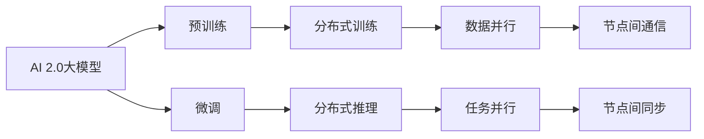

                 

# 高性能计算集群：支撑 AI 2.0 大模型训练

> 关键词：高性能计算，分布式计算，AI 2.0，大模型训练，GPU 集群，深度学习

## 1. 背景介绍

### 1.1 问题由来
随着深度学习技术的发展，大模型（Large Models）在各个领域取得了显著的进展，如自然语言处理（NLP）、计算机视觉（CV）、语音识别等。然而，训练大规模模型需要庞大的计算资源，这对硬件和软件基础设施提出了极高的要求。特别是在AI 2.0时代，模型的规模和复杂度不断增长，对计算集群的高效性和可扩展性提出了新的挑战。

### 1.2 问题核心关键点
高性能计算集群（High Performance Computing Clusters）是支撑大规模模型训练的核心基础设施。如何构建高效的计算集群，确保AI 2.0大模型的训练速度和质量，成为了当前研究和实践中的核心问题。

### 1.3 问题研究意义
高性能计算集群为AI 2.0大模型训练提供了必要的计算资源，使得深度学习算法能够在更短的时间内训练出高性能模型，加速AI技术的落地应用。通过对高性能计算集群的研究和实践，可以提升数据中心和云平台的计算能力，推动AI技术在各行各业的普及和应用。

## 2. 核心概念与联系

### 2.1 核心概念概述

高性能计算集群（HPC Clusters）是一组通过高速网络互连的计算机，协同工作以完成大规模计算任务。集群中的每台计算机被称为节点（Nodes），通常由中央处理器（CPU）、图形处理器（GPU）、内存（RAM）和存储系统（Disk）组成。这些节点通过分布式计算（Distributed Computing）技术，实现任务的并行化处理，从而大幅提升计算效率。

AI 2.0大模型（Large Models）指的是在大规模无标签数据上进行预训练，并在特定任务上微调（Fine-tuning）的高性能深度学习模型。这些模型通常具有数十亿甚至上百亿的参数，如BERT、GPT-3、T5等。

通过高性能计算集群，AI 2.0大模型可以充分利用分布式计算资源，实现并行训练和推理，显著提升模型的训练速度和效率。同时，集群还可以实现计算资源的弹性伸缩，根据任务需求动态调整计算资源，优化硬件使用。

### 2.2 核心概念原理和架构的 Mermaid 流程图



### 2.3 核心概念联系

高性能计算集群与AI 2.0大模型之间存在紧密的联系。高性能计算集群提供了必要的计算资源，使得AI 2.0大模型能够实现大规模并行计算，提升训练和推理效率。同时，AI 2.0大模型在集群的分布式训练和推理中发挥着核心作用，推动集群在各个任务中的应用。

## 3. 核心算法原理 & 具体操作步骤

### 3.1 算法原理概述

AI 2.0大模型训练通常采用深度学习框架，如PyTorch、TensorFlow等。训练过程涉及模型前向传播（Forward Propagation）和反向传播（Backward Propagation）两个主要步骤。在前向传播中，输入数据通过模型计算得到输出结果；在反向传播中，通过计算输出结果与目标结果的误差，调整模型参数以最小化损失函数。

为了提升训练效率，高性能计算集群通过分布式训练（Distributed Training）技术，将大模型分成多个部分，分别在不同的节点上进行计算。节点间通过高速网络进行数据通信，实现并行计算。这种并行计算方式可以显著提升训练速度，缩短训练时间。

### 3.2 算法步骤详解

1. **环境准备**：配置高性能计算集群，确保集群中每个节点都具备必要的计算资源和网络连接。安装深度学习框架和相关依赖库，确保所有节点环境一致。

2. **数据划分**：将训练数据划分为多个部分，分别存放在集群的不同节点上。数据划分可以采用数据并行（Data Parallelism）的方式，将整个数据集均匀分布在各个节点上。

3. **模型分布**：将大模型分布在集群的不同节点上，每个节点负责计算模型的一部分参数。模型分布可以采用模型并行（Model Parallelism）的方式，将模型按照层（Layers）进行分割，每个节点负责计算其中一部分层。

4. **分布式训练**：在各个节点上，使用深度学习框架提供的分布式训练API，实现并行计算。节点间通过数据通信协议（如MPI、Gloo等）进行数据交换，确保每个节点计算结果的一致性。

5. **模型优化**：在训练过程中，定期在每个节点上计算梯度，并使用优化的梯度更新模型参数。为了提高计算效率，可以采用梯度累积（Gradient Accumulation）等技术，减少每个节点计算的梯度更新次数。

6. **模型收敛**：在训练过程中，定期在各个节点上计算损失函数，并计算模型在验证集上的性能。当模型性能达到预设阈值，或训练轮数达到预设轮数，训练过程结束。

### 3.3 算法优缺点

#### 优点：

- **计算效率高**：分布式计算可以显著提升计算效率，使得大规模模型训练成为可能。
- **资源利用率高**：集群中的计算资源可以灵活调整，根据任务需求动态伸缩，优化硬件使用。
- **容错性强**：集群中的节点可以独立运行，当一个节点发生故障时，不影响其他节点的计算。

#### 缺点：

- **复杂度高**：分布式训练涉及多个节点之间的数据通信和同步，增加了系统的复杂性。
- **性能瓶颈**：节点间通信和同步可能导致性能瓶颈，影响计算效率。
- **成本高**：高性能计算集群需要大量的硬件设备和网络连接，成本较高。

### 3.4 算法应用领域

高性能计算集群在AI 2.0大模型训练中具有广泛的应用场景，包括：

- **自然语言处理（NLP）**：训练大规模语言模型，如BERT、GPT等，实现文本分类、情感分析、机器翻译等任务。
- **计算机视觉（CV）**：训练大规模图像识别模型，如图像分类、物体检测、图像生成等。
- **语音识别**：训练大规模语音识别模型，实现语音转文本、文本转语音等任务。
- **推荐系统**：训练大规模推荐模型，实现个性化推荐、广告推荐等任务。
- **医疗健康**：训练大规模医疗图像模型，实现疾病诊断、病理分析等任务。
- **金融服务**：训练大规模金融模型，实现风险评估、股票预测等任务。

## 4. 数学模型和公式 & 详细讲解 & 举例说明

### 4.1 数学模型构建

在大模型训练中，通常采用深度学习框架的分布式训练API进行模型训练。以PyTorch为例，构建数学模型的主要步骤如下：

1. **数据准备**：将训练数据划分为多个部分，分别存放在集群的不同节点上。数据划分可以采用数据并行（Data Parallelism）的方式，将整个数据集均匀分布在各个节点上。

2. **模型初始化**：将大模型分布在集群的不同节点上，每个节点负责计算模型的一部分参数。模型分布可以采用模型并行（Model Parallelism）的方式，将模型按照层（Layers）进行分割，每个节点负责计算其中一部分层。

3. **前向传播**：在各个节点上，使用深度学习框架提供的分布式训练API，实现并行计算。节点间通过数据通信协议（如MPI、Gloo等）进行数据交换，确保每个节点计算结果的一致性。

4. **反向传播**：在各个节点上，计算模型输出与目标结果的误差，调整模型参数以最小化损失函数。为了提高计算效率，可以采用梯度累积（Gradient Accumulation）等技术，减少每个节点计算的梯度更新次数。

5. **模型优化**：在训练过程中，定期在每个节点上计算梯度，并使用优化的梯度更新模型参数。

### 4.2 公式推导过程

以一个简单的神经网络为例，推导分布式训练中的前向传播和反向传播过程。

假设有一个包含$L$个隐藏层的神经网络，每个隐藏层包含$N$个神经元。在分布式训练中，我们将模型分为$K$个部分，每个部分包含$L/K$个隐藏层。在每个节点上，计算其中一部分隐藏层的输出。

在前向传播中，计算每个节点的输出。假设节点$i$计算前$L/K$个隐藏层的输出，则节点$i$的前向传播过程可以表示为：

$$
h_i = \sigma(W^{(1)}h_{i-1} + b^{(1)})
$$

$$
h_i^{(l)} = \sigma(W^{(l)}h_{i-1}^{(l-1)} + b^{(l)})
$$

其中$h_{i-1}^{(l-1)}$为节点$i-1$计算的$l-1$层输出，$h_i^{(l)}$为节点$i$计算的$l$层输出。

在反向传播中，计算每个节点的梯度。假设节点$i$计算前$L/K$个隐藏层的梯度，则节点$i$的梯度计算过程可以表示为：

$$
\Delta^{(l)} = \frac{\partial L}{\partial z^{(l)}}
$$

$$
\Delta^{(l-1)} = \frac{\partial L}{\partial z^{(l-1)}} \times \frac{\partial z^{(l)}}{\partial z^{(l-1)}}
$$

其中$L$为模型损失函数，$z^{(l)}$为节点$i$计算的$l$层输出。

### 4.3 案例分析与讲解

以一个典型的分布式训练案例为例，分析其在高性能计算集群中的应用。

假设我们要训练一个包含100个隐藏层的神经网络，每个隐藏层包含1000个神经元。我们将模型分成10个部分，每个部分包含10个隐藏层。在5个节点上进行分布式训练，每个节点计算其中10个隐藏层的输出。

在前向传播中，每个节点计算其中10个隐藏层的输出，并将结果传递给下一层。在反向传播中，每个节点计算其中10个隐藏层的梯度，并将结果传递给下一层。节点间通过数据通信协议进行数据交换，确保每个节点计算结果的一致性。

通过分布式训练，我们能够显著提升计算效率，缩短训练时间。同时，集群中的计算资源可以灵活调整，根据任务需求动态伸缩，优化硬件使用。

## 5. 项目实践：代码实例和详细解释说明

### 5.1 开发环境搭建

构建高性能计算集群需要配置多个硬件设备和网络连接，可以使用以下步骤进行环境搭建：

1. **硬件设备**：配置多个高性能计算节点，每个节点配备CPU、GPU、内存和存储系统。确保所有节点具备相同的操作系统和深度学习框架安装环境。

2. **网络连接**：在各个节点之间搭建高速网络连接，确保节点间通信的带宽和延迟满足计算需求。

3. **集群管理**：使用开源集群管理工具（如SLURM、Hadoop等），管理集群资源和任务调度。

4. **数据管理**：配置分布式文件系统（如HDFS、Ceph等），存储和管理训练数据和模型参数。

5. **环境配置**：配置深度学习框架和相关依赖库，确保所有节点环境一致。

### 5.2 源代码详细实现

以下是一个简单的分布式训练示例代码，使用PyTorch和MPI实现数据并行计算。

```python
from torch import nn, optim
from mpi4py import MPI

# 初始化MPI
comm = MPI.COMM_WORLD
rank = comm.Get_rank()
size = comm.Get_size()

# 准备数据
data = torch.randn(10, 10, device='cuda')
targets = torch.randn(10, 10, device='cuda')

# 定义模型
model = nn.Linear(10, 10)
optimizer = optim.SGD(model.parameters(), lr=0.01)

# 数据划分
data_per_rank = data.split(rank, size)
target_per_rank = targets.split(rank, size)

# 前向传播
outputs = []
for i in range(rank, len(data_per_rank), size):
    outputs.append(model(data_per_rank[i].to('cuda')))

# 计算损失
loss = torch.mean(outputs).to('cuda')

# 反向传播
loss.backward()

# 更新参数
optimizer.step()

# 输出结果
if rank == 0:
    print(loss.item())
```

### 5.3 代码解读与分析

上述代码实现了一个简单的分布式训练过程，包括以下关键步骤：

1. **MPI初始化**：使用MPI库初始化计算集群环境，获取节点编号和节点总数。

2. **数据准备**：将数据和目标分配到各个节点上，使用split函数实现数据并行。

3. **模型定义**：定义一个简单的线性模型，使用SGD优化器进行参数更新。

4. **前向传播**：在每个节点上计算模型输出，并将结果合并。

5. **计算损失**：在每个节点上计算平均损失函数。

6. **反向传播**：在每个节点上计算梯度，并使用SGD优化器更新模型参数。

7. **输出结果**：在主节点上输出损失结果。

### 5.4 运行结果展示

在运行上述代码后，可以在各个节点上看到计算结果，并在主节点上输出平均损失。这表明分布式训练可以显著提升计算效率，缩短训练时间。

## 6. 实际应用场景

### 6.1 智能客服系统

智能客服系统需要实时处理大量的用户请求，并对每个请求进行个性化的回复。使用高性能计算集群，可以训练大规模的智能客服模型，实现高效率、高质量的客户服务。

在实际应用中，可以收集历史客服对话数据，将其标注为问题-答案对，用于训练智能客服模型。微调后的模型可以实时分析用户请求，自动匹配最合适的回复模板，并在多轮对话中保持对话连贯性和一致性。

### 6.2 金融舆情监测

金融舆情监测需要实时分析大量的金融新闻和社交媒体信息，以预测市场趋势和风险。使用高性能计算集群，可以训练大规模的金融舆情模型，实现实时的舆情分析和预测。

在实际应用中，可以收集金融领域的新闻、报道、评论等文本数据，并将其标注为情绪-文本对。微调后的模型可以实时监测网络舆情，判断市场情绪变化趋势，并预测股票价格和风险。

### 6.3 推荐系统

推荐系统需要处理大量的用户行为数据，为用户推荐个性化的商品和服务。使用高性能计算集群，可以训练大规模的推荐模型，实现高效、个性化的推荐服务。

在实际应用中，可以收集用户的浏览、点击、购买等行为数据，将其标注为商品-行为对。微调后的模型可以实时分析用户行为，为用户推荐最相关的商品和服务，提升用户体验和销售转化率。

## 7. 工具和资源推荐

### 7.1 学习资源推荐

为了帮助开发者系统掌握高性能计算集群和AI 2.0大模型训练的理论基础和实践技巧，这里推荐一些优质的学习资源：

1. **《深度学习框架与分布式计算》**：介绍PyTorch、TensorFlow等深度学习框架在分布式计算中的应用，涵盖分布式训练、数据并行等关键技术。

2. **《分布式系统原理与设计》**：介绍分布式系统设计原理和实现方法，涵盖集群管理、网络通信、数据存储等核心组件。

3. **《高性能计算导论》**：介绍高性能计算系统的设计与实现方法，涵盖分布式计算、多核计算、GPU计算等关键技术。

4. **HuggingFace官方文档**：提供丰富的预训练模型和分布式训练样例代码，是进行微调任务开发的必备资料。

5. **SLURM官方文档**：提供集群管理和任务调度的详细教程，帮助开发者构建高效计算集群。

通过对这些资源的学习实践，相信你一定能够快速掌握高性能计算集群和AI 2.0大模型训练的精髓，并用于解决实际的AI问题。

### 7.2 开发工具推荐

为了高效地开发高性能计算集群和AI 2.0大模型训练，以下是几款常用的工具：

1. **PyTorch**：基于Python的开源深度学习框架，支持分布式计算和GPU加速，适合快速迭代研究。

2. **TensorFlow**：由Google主导开发的开源深度学习框架，生产部署方便，适合大规模工程应用。

3. **MPI库**：用于集群计算的网络通信库，支持消息传递、数据交换等核心功能。

4. **HDFS**：分布式文件系统，适合存储和管理大规模训练数据和模型参数。

5. **SLURM**：开源集群管理系统，支持任务调度、资源管理等功能。

合理利用这些工具，可以显著提升高性能计算集群和AI 2.0大模型训练的开发效率，加速创新迭代的步伐。

### 7.3 相关论文推荐

高性能计算集群和AI 2.0大模型训练的研究方向涵盖了众多领域，以下是几篇奠基性的相关论文，推荐阅读：

1. **《分布式深度学习: 原理与挑战》**：介绍分布式深度学习的原理和挑战，涵盖数据并行、模型并行等关键技术。

2. **《大规模并行计算系统的设计》**：介绍高性能计算系统的设计原理和实现方法，涵盖集群管理、网络通信、数据存储等核心组件。

3. **《分布式深度学习系统》**：介绍分布式深度学习系统的设计原理和实现方法，涵盖数据并行、模型并行等关键技术。

4. **《大规模分布式深度学习》**：介绍大规模分布式深度学习系统的设计原理和实现方法，涵盖集群管理、网络通信、数据存储等核心组件。

这些论文代表了大规模深度学习系统的发展脉络。通过学习这些前沿成果，可以帮助研究者把握学科前进方向，激发更多的创新灵感。

## 8. 总结：未来发展趋势与挑战

### 8.1 总结

本文对高性能计算集群和AI 2.0大模型训练进行了全面系统的介绍。首先阐述了高性能计算集群和AI 2.0大模型训练的研究背景和意义，明确了集群和模型在深度学习中的核心地位。其次，从原理到实践，详细讲解了分布式训练的数学模型和核心步骤，给出了分布式训练任务开发的完整代码实例。同时，本文还广泛探讨了集群和模型在多个行业领域的应用前景，展示了其在智能客服、金融舆情、推荐系统等领域的巨大潜力。此外，本文精选了集群和模型相关的学习资源，力求为开发者提供全方位的技术指引。

通过本文的系统梳理，可以看到，高性能计算集群和AI 2.0大模型训练为深度学习提供了必要的计算资源和分布式计算技术，使得大规模模型训练成为可能。未来的研究将在集群计算、分布式训练等方向进行深入探索，推动AI技术在更广泛的应用领域落地。

### 8.2 未来发展趋势

展望未来，高性能计算集群和AI 2.0大模型训练将呈现以下几个发展趋势：

1. **计算效率持续提升**：随着计算硬件的发展，集群计算的效率将进一步提升，支持更大规模模型的训练。

2. **资源利用率优化**：优化集群资源管理，实现任务调度、弹性伸缩等功能，提高资源利用率。

3. **多模态数据融合**：将视觉、语音、文本等多种模态数据融合，实现多模态深度学习模型的训练。

4. **边缘计算支持**：将高性能计算集群扩展到边缘计算设备，支持实时计算和本地推理。

5. **异构计算融合**：将GPU、TPU等异构计算资源融合，提升计算效率和灵活性。

6. **AI 2.0生态系统建设**：构建AI 2.0生态系统，涵盖数据、模型、算法等核心组件，推动AI技术的产业化应用。

以上趋势凸显了高性能计算集群和AI 2.0大模型训练的广阔前景。这些方向的探索发展，必将进一步提升深度学习系统性能，推动AI技术在各行各业的普及和应用。

### 8.3 面临的挑战

尽管高性能计算集群和AI 2.0大模型训练已经取得了瞩目成就，但在迈向更加智能化、普适化应用的过程中，它仍面临着诸多挑战：

1. **计算资源瓶颈**：大规模模型训练需要庞大的计算资源，硬件成本较高。如何降低计算成本，提升计算效率，是需要解决的重要问题。

2. **集群管理复杂**：高性能计算集群涉及多个节点之间的通信和同步，管理复杂度较高。如何优化集群管理，提高集群效率，是重要的研究方向。

3. **数据通信瓶颈**：集群计算需要高速的网络通信，带宽和延迟要求较高。如何优化数据通信，提升计算效率，是重要的研究方向。

4. **模型迁移性不足**：模型在不同集群之间的迁移性不足，需要重新训练和微调。如何实现模型跨集群的迁移和部署，是重要的研究方向。

5. **算法和模型复杂性增加**：大规模模型的训练算法和模型结构复杂，优化和调试难度增加。如何简化算法和模型，提高计算效率，是重要的研究方向。

6. **伦理和安全性问题**：大模型训练和使用可能涉及隐私和伦理问题，如何保障数据安全和隐私，避免有害输出，是重要的研究方向。

### 8.4 研究展望

面对高性能计算集群和AI 2.0大模型训练所面临的种种挑战，未来的研究需要在以下几个方面寻求新的突破：

1. **计算资源优化**：研究高效的计算资源管理技术，实现任务调度、弹性伸缩等功能，降低计算成本。

2. **数据通信优化**：研究优化数据通信协议和算法，提升集群计算的带宽和延迟。

3. **模型迁移性提升**：研究模型跨集群的迁移和部署方法，提高模型的迁移性和复用性。

4. **算法和模型简化**：研究简化算法和模型的方法，提高计算效率和模型泛化性。

5. **伦理和安全性保障**：研究保障数据安全和隐私的技术方法，避免有害输出和伦理问题。

这些研究方向的探索，必将推动高性能计算集群和AI 2.0大模型训练技术的进一步发展，为深度学习技术的广泛应用提供坚实的技术基础。

## 9. 附录：常见问题与解答

**Q1: 如何构建高性能计算集群？**

A: 构建高性能计算集群需要配置多个硬件设备和网络连接，可以使用以下步骤进行环境搭建：

1. 配置多个高性能计算节点，每个节点配备CPU、GPU、内存和存储系统。

2. 搭建高速网络连接，确保节点间通信的带宽和延迟满足计算需求。

3. 使用集群管理工具（如SLURM、Hadoop等），管理集群资源和任务调度。

4. 配置分布式文件系统（如HDFS、Ceph等），存储和管理训练数据和模型参数。

5. 配置深度学习框架和相关依赖库，确保所有节点环境一致。

**Q2: 分布式训练中如何进行数据并行？**

A: 数据并行（Data Parallelism）是将整个数据集均匀分布在各个节点上，每个节点独立计算部分数据。具体步骤如下：

1. 将训练数据划分为多个部分，分别存放在集群的不同节点上。

2. 在每个节点上计算模型输出，并将结果合并。

3. 在每个节点上计算平均损失函数。

4. 在每个节点上计算梯度，并使用优化的梯度更新模型参数。

**Q3: 分布式训练中如何进行模型并行？**

A: 模型并行（Model Parallelism）是将模型按照层（Layers）进行分割，每个节点负责计算其中一部分层。具体步骤如下：

1. 将大模型分成多个部分，每个部分包含部分隐藏层。

2. 在每个节点上计算模型输出，并将结果合并。

3. 在每个节点上计算模型梯度，并使用优化的梯度更新模型参数。

**Q4: 如何在分布式训练中避免数据通信瓶颈？**

A: 数据通信瓶颈是分布式训练中常见的问题，可以采用以下方法进行优化：

1. 使用高效的通信协议（如Gloo、NCCL等），减少数据传输的时间和带宽。

2. 使用数据压缩技术，减少数据传输量。

3. 使用异步通信技术，减少通信阻塞。

**Q5: 如何优化高性能计算集群的资源利用率？**

A: 优化高性能计算集群的资源利用率，可以采用以下方法：

1. 使用弹性计算资源管理技术，根据任务需求动态调整资源配置。

2. 使用负载均衡技术，确保计算资源均衡分配。

3. 使用高效的计算任务调度算法，优化任务执行顺序。

通过合理利用这些技术，可以显著提升高性能计算集群的资源利用率，降低计算成本。

---

作者：禅与计算机程序设计艺术 / Zen and the Art of Computer Programming

